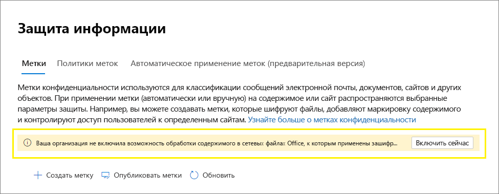

# <a name="enable-sensitivity-labels-for-office-files-in-sharepoint-and-onedrive"></a><span data-ttu-id="6d61b-103">Включение меток конфиденциальности для файлов Office в SharePoint и OneDrive</span><span class="sxs-lookup"><span data-stu-id="6d61b-103">Enable sensitivity labels for Office files in SharePoint and OneDrive</span></span>

><span data-ttu-id="6d61b-104">*[Руководство по лицензированию Microsoft 365 для обеспечения безопасности и соответствия требованиям](/office365/servicedescriptions/microsoft-365-service-descriptions/microsoft-365-tenantlevel-services-licensing-guidance/microsoft-365-security-compliance-licensing-guidance).*</span><span class="sxs-lookup"><span data-stu-id="6d61b-104">*[Microsoft 365 licensing guidance for security & compliance](/office365/servicedescriptions/microsoft-365-service-descriptions/microsoft-365-tenantlevel-services-licensing-guidance/microsoft-365-security-compliance-licensing-guidance).*</span></span>

<span data-ttu-id="6d61b-105">Внесите метки конфиденциальности для Office файлов в SharePoint и OneDrive, чтобы пользователи [](sensitivity-labels.md) могли применять метки конфиденциальности Office в Интернете.</span><span class="sxs-lookup"><span data-stu-id="6d61b-105">Enable sensitivity labels for Office files in SharePoint and OneDrive so that users can apply your [sensitivity labels](sensitivity-labels.md) in Office for the web.</span></span> <span data-ttu-id="6d61b-106">Когда эта функция включена,  пользователи увидят кнопку "Чувствительность" на ленте, чтобы они могли применять метки, и увидеть любое примененное имя метки на панели состояния.</span><span class="sxs-lookup"><span data-stu-id="6d61b-106">When this feature is enabled, users will see the **Sensitivity** button on the ribbon so they can apply labels, and see any applied label name on the status bar.</span></span>

<span data-ttu-id="6d61b-107">Включение этой функции также SharePoint и OneDrive возможность обработки содержимого файлов, зашифрованных с помощью метки конфиденциальности.</span><span class="sxs-lookup"><span data-stu-id="6d61b-107">Enabling this feature also results in SharePoint and OneDrive being able to process the contents of files that have been encrypted by using a sensitivity label.</span></span> <span data-ttu-id="6d61b-108">Метка может применяться в Office веб Office или в настольных приложениях, а также загружаться или SharePoint и OneDrive.</span><span class="sxs-lookup"><span data-stu-id="6d61b-108">The label can be applied in Office for the web, or in Office desktop apps and uploaded or saved in SharePoint and OneDrive.</span></span> <span data-ttu-id="6d61b-109">Пока эта функция не включается, эти службы не могут обрабатывать зашифрованные файлы, что означает, что совместное открытие, eDiscovery, предотвращение потери данных, поиск и другие функции совместной работы не будут работать для этих файлов.</span><span class="sxs-lookup"><span data-stu-id="6d61b-109">Until you enable this feature, these services can't process encrypted files, which means that coauthoring, eDiscovery, Data Loss Prevention, search, and other collaborative features won't work for these files.</span></span>

<span data-ttu-id="6d61b-110">После ввести метки конфиденциальности для Office файлов в SharePoint и OneDrive, для новых и измененных файлов с меткой чувствительности, применяемой шифрованием с облачным ключом (и не используемое шифрование [двойных](double-key-encryption.md)ключей):</span><span class="sxs-lookup"><span data-stu-id="6d61b-110">After you enable sensitivity labels for Office files in SharePoint and OneDrive, for new and changed files that have a sensitivity label that applies encryption with a cloud-based key (and doesn't use [Double Key Encryption](double-key-encryption.md)):</span></span>

- <span data-ttu-id="6d61b-111">Для Word Excel и PowerPoint файлы SharePoint и OneDrive распознают метку и теперь могут обрабатывать содержимое зашифрованного файла.</span><span class="sxs-lookup"><span data-stu-id="6d61b-111">For Word, Excel, and PowerPoint files, SharePoint and OneDrive recognize the label and can now process the contents of the encrypted file.</span></span>

- <span data-ttu-id="6d61b-112">При загрузке или доступе к этим файлам из SharePoint или OneDrive, метка конфиденциальности и любые параметры шифрования с метки применяются и остаются с файлом, где бы он ни хранился.</span><span class="sxs-lookup"><span data-stu-id="6d61b-112">When users download or access these files from SharePoint or OneDrive, the sensitivity label and any encryption settings from the label are enforced and remain with the file, wherever it is stored.</span></span> <span data-ttu-id="6d61b-113">Убедитесь, что вы предоставляете пользователю рекомендации по использованию только меток для защиты документов.</span><span class="sxs-lookup"><span data-stu-id="6d61b-113">Ensure you provide user guidance to use only labels to protect documents.</span></span> <span data-ttu-id="6d61b-114">Дополнительные сведения см. в [меню Параметры управления правами на информацию (IRM) и метки конфиденциальности.](sensitivity-labels-office-apps.md#information-rights-management-irm-options-and-sensitivity-labels)</span><span class="sxs-lookup"><span data-stu-id="6d61b-114">For more information, see [Information Rights Management (IRM) options and sensitivity labels](sensitivity-labels-office-apps.md#information-rights-management-irm-options-and-sensitivity-labels).</span></span>

- <span data-ttu-id="6d61b-115">Когда пользователи загружают помеченные и зашифрованные файлы в SharePoint или OneDrive, они должны иметь по крайней мере права просмотра этих файлов.</span><span class="sxs-lookup"><span data-stu-id="6d61b-115">When users upload labeled and encrypted files to SharePoint or OneDrive, they must have at least view rights to those files.</span></span> <span data-ttu-id="6d61b-116">Например, они могут открывать файлы за пределами SharePoint.</span><span class="sxs-lookup"><span data-stu-id="6d61b-116">For example, they can open the files outside SharePoint.</span></span> <span data-ttu-id="6d61b-117">Если они не имеют этого права на минимальное использование, загрузка успешно, но служба не распознает метку и не может обрабатывать содержимое файла.</span><span class="sxs-lookup"><span data-stu-id="6d61b-117">If they don't have this minimum usage right, the upload is successful but the service doesn't recognize the label and can't process the file contents.</span></span>

- <span data-ttu-id="6d61b-118">Используйте Office веб-страницы (Word, Excel, PowerPoint) для открытия и редактирования Office с метами конфиденциальности, которые применяют шифрование.</span><span class="sxs-lookup"><span data-stu-id="6d61b-118">Use Office for the web (Word, Excel, PowerPoint) to open and edit Office files that have sensitivity labels that apply encryption.</span></span> <span data-ttu-id="6d61b-119">Разрешения, которые были назначены с помощью шифрования, применяются.</span><span class="sxs-lookup"><span data-stu-id="6d61b-119">The permissions that were assigned with the encryption are enforced.</span></span> <span data-ttu-id="6d61b-120">Для этих документов также можно [использовать](apply-sensitivity-label-automatically.md) автометку.</span><span class="sxs-lookup"><span data-stu-id="6d61b-120">You can also use [auto-labeling](apply-sensitivity-label-automatically.md) for these documents.</span></span>

- <span data-ttu-id="6d61b-121">Внешние пользователи могут получать доступ к документам, помеченным шифрованием, с помощью учетных записей гостей.</span><span class="sxs-lookup"><span data-stu-id="6d61b-121">External users can access documents that are labeled with encryption by using guest accounts.</span></span> <span data-ttu-id="6d61b-122">Дополнительные сведения см. в [материалах Support for external users and labeled content.](sensitivity-labels-office-apps.md#support-for-external-users-and-labeled-content)</span><span class="sxs-lookup"><span data-stu-id="6d61b-122">For more information, see [Support for external users and labeled content](sensitivity-labels-office-apps.md#support-for-external-users-and-labeled-content).</span></span> 

- <span data-ttu-id="6d61b-123">Office 365 eDiscovery поддерживает полнотексовое поиск этих файлов, а политики предотвращения потери данных (DLP) поддерживают контент в этих файлах.</span><span class="sxs-lookup"><span data-stu-id="6d61b-123">Office 365 eDiscovery supports full-text search for these files and Data Loss Prevention (DLP) policies support content in these files.</span></span>

> [!NOTE]
> <span data-ttu-id="6d61b-124">Если шифрование было применено с помощью локального ключа (топология управления ключом, часто именуемая [](double-key-encryption.md)"удержание собственного ключа" или HYOK), или с помощью шифрования двойных ключей, поведение службы для обработки содержимого файла не меняется.</span><span class="sxs-lookup"><span data-stu-id="6d61b-124">If encryption has been applied with an on-premises key (a key management topology often referred to as "hold your own key" or HYOK), or by using [Double Key Encryption](double-key-encryption.md), the service behavior for processing the file contents doesn't change.</span></span> <span data-ttu-id="6d61b-125">Поэтому для этих файлов совместная работа, поиск, открытие электронных данных, предотвращение потери данных, поиск и другие функции совместной работы не будут работать.</span><span class="sxs-lookup"><span data-stu-id="6d61b-125">So for these files, coauthoring, eDiscovery, Data Loss Prevention, search, and other collaborative features won't work.</span></span>
>
> <span data-ttu-id="6d61b-126">Поведение SharePoint и OneDrive также не меняется для существующих файлов в этих расположениях, помеченных шифрованием с помощью одного ключа на основе Azure.</span><span class="sxs-lookup"><span data-stu-id="6d61b-126">The SharePoint and OneDrive behavior also doesn't change for existing files in these locations that are labeled with encryption using a single Azure-based key.</span></span> <span data-ttu-id="6d61b-127">Чтобы эти файлы могли воспользоваться новыми возможностями после добавления меток конфиденциальности для Office файлов SharePoint и OneDrive, файлы должны быть загружены и загружены повторно или изменены.</span><span class="sxs-lookup"><span data-stu-id="6d61b-127">For these files to benefit from the new capabilities after you enable sensitivity labels for Office files in SharePoint and OneDrive, the files must be either downloaded and uploaded again, or edited.</span></span>

<span data-ttu-id="6d61b-128">После ввести метки конфиденциальности для Office файлов в SharePoint и OneDrive доступны [](search-the-audit-log-in-security-and-compliance.md#sensitivity-label-activities) три новых события аудита для мониторинга меток чувствительности, применяемых к документам в SharePoint и OneDrive:</span><span class="sxs-lookup"><span data-stu-id="6d61b-128">After you enable sensitivity labels for Office files in SharePoint and OneDrive, three new [audit events](search-the-audit-log-in-security-and-compliance.md#sensitivity-label-activities) are available for monitoring sensitivity labels that are applied to documents in SharePoint and OneDrive:</span></span>
- <span data-ttu-id="6d61b-129">**Метка конфиденциальности применена к файлу**</span><span class="sxs-lookup"><span data-stu-id="6d61b-129">**Applied sensitivity label to file**</span></span>
- <span data-ttu-id="6d61b-130">**Метка конфиденциальности, примененная к файлу, изменена**</span><span class="sxs-lookup"><span data-stu-id="6d61b-130">**Changed sensitivity label applied to file**</span></span>
- <span data-ttu-id="6d61b-131">**Метка конфиденциальности, примененная к файлу, удалена**</span><span class="sxs-lookup"><span data-stu-id="6d61b-131">**Removed sensitivity label from file**</span></span>

<span data-ttu-id="6d61b-132">Просмотрите следующее видео (без звука), чтобы увидеть новые возможности в действии:</span><span class="sxs-lookup"><span data-stu-id="6d61b-132">Watch the following video (no audio) to see the new capabilities in action:</span></span>

> [!VIDEO https://www.microsoft.com/videoplayer/embed//RE4ornZ]

<span data-ttu-id="6d61b-133">У вас всегда есть выбор, чтобы отключить метки конфиденциальности для Office файлов[](#how-to-disable-sensitivity-labels-for-sharepoint-and-onedrive-opt-out)в SharePoint и OneDrive (отказ) в любое время.</span><span class="sxs-lookup"><span data-stu-id="6d61b-133">You always have the choice to disable sensitivity labels for Office files in SharePoint and OneDrive ([opt-out](#how-to-disable-sensitivity-labels-for-sharepoint-and-onedrive-opt-out)) at any time.</span></span>

<span data-ttu-id="6d61b-134">Если в настоящее время вы защищаете документы в SharePoint с помощью SharePoint управления правами на информацию (IRM), обязательно ознакомьтесь с разделом управления правами на SharePoint информации [(IRM)](#sharepoint-information-rights-management-irm-and-sensitivity-labels) и меток конфиденциальности на этой странице.</span><span class="sxs-lookup"><span data-stu-id="6d61b-134">If you are currently protecting documents in SharePoint by using SharePoint Information Rights Management (IRM), be sure to check the [SharePoint Information Rights Management (IRM) and sensitivity labels](#sharepoint-information-rights-management-irm-and-sensitivity-labels) section on this page.</span></span> 

## <a name="requirements"></a><span data-ttu-id="6d61b-135">Requirements</span><span class="sxs-lookup"><span data-stu-id="6d61b-135">Requirements</span></span>

<span data-ttu-id="6d61b-136">Эти новые возможности работают только с [метами конфиденциальности.](sensitivity-labels.md)</span><span class="sxs-lookup"><span data-stu-id="6d61b-136">These new capabilities work with [sensitivity labels](sensitivity-labels.md) only.</span></span> <span data-ttu-id="6d61b-137">Если в настоящее время у вас есть метки Azure Information Protection, сначала перенаселите их на метки конфиденциальности, чтобы включить эти функции для новых файлов, которые вы загружаете.</span><span class="sxs-lookup"><span data-stu-id="6d61b-137">If you currently have Azure Information Protection labels, first migrate them to sensitivity labels so that you can enable these features for new files that you upload.</span></span> <span data-ttu-id="6d61b-138">Дополнительные сведения об этом процессе см. в статье [Перенос меток Azure Information Protection на платформу унифицированных меток конфиденциальности](/azure/information-protection/configure-policy-migrate-labels).</span><span class="sxs-lookup"><span data-stu-id="6d61b-138">For instructions, see [How to migrate Azure Information Protection labels to unified sensitivity labels](/azure/information-protection/configure-policy-migrate-labels).</span></span>

<span data-ttu-id="6d61b-139">Используйте OneDrive синхронизацию версии приложения 19.002.0121.0008 или более поздней версии Windows и версии 19.002.0107.0008 или более поздней версии на Mac.</span><span class="sxs-lookup"><span data-stu-id="6d61b-139">Use the OneDrive sync app version 19.002.0121.0008 or later on Windows, and version 19.002.0107.0008 or later on Mac.</span></span> <span data-ttu-id="6d61b-140">Обе эти версии были выпущены 28 января 2019 г. и в настоящее время выпущены для всех колец.</span><span class="sxs-lookup"><span data-stu-id="6d61b-140">Both these versions were released January 28, 2019, and are currently released to all rings.</span></span> <span data-ttu-id="6d61b-141">Дополнительные сведения см. в [OneDrive заметки о выпуске.](https://support.office.com/article/845dcf18-f921-435e-bf28-4e24b95e5fc0)</span><span class="sxs-lookup"><span data-stu-id="6d61b-141">For more information, see the [OneDrive release notes](https://support.office.com/article/845dcf18-f921-435e-bf28-4e24b95e5fc0).</span></span> <span data-ttu-id="6d61b-142">После включить метки конфиденциальности для Office файлов в SharePoint и OneDrive, пользователям, которые запускают более старую версию приложения синхронизации, будет предложено обновить его.</span><span class="sxs-lookup"><span data-stu-id="6d61b-142">After you enable sensitivity labels for Office files in SharePoint and OneDrive, users who run an older version of the sync app are prompted to update it.</span></span>

## <a name="limitations"></a><span data-ttu-id="6d61b-143">Ограничения</span><span class="sxs-lookup"><span data-stu-id="6d61b-143">Limitations</span></span>

- <span data-ttu-id="6d61b-144">SharePoint и OneDrive не могут обрабатывать некоторые файлы, помеченные и зашифрованные из Office настольных приложений, когда эти файлы содержат данные PowerQuery, данные, хранимые в настраиваемой надстройке, или настраиваемые XML-части, такие как Cover Page Properties, схемы типа контента, настраиваемая информационная панель документов и настраиваемая XSN.</span><span class="sxs-lookup"><span data-stu-id="6d61b-144">SharePoint and OneDrive can't process some files that are labeled and encrypted from Office desktop apps when these files contain PowerQuery data, data stored by custom add-ins, or custom XML parts such as Cover Page Properties, content type schemas, custom Document Information Panel, and Custom XSN.</span></span> <span data-ttu-id="6d61b-145">Это ограничение также применимо к файлам, в которые при отправке добавлен [iD](https://support.microsoft.com/office/enable-and-configure-unique-document-ids-ea7fee86-bd6f-4cc8-9365-8086e794c984) документа.</span><span class="sxs-lookup"><span data-stu-id="6d61b-145">This limitation also applies to files that have a [Document ID](https://support.microsoft.com/office/enable-and-configure-unique-document-ids-ea7fee86-bd6f-4cc8-9365-8086e794c984) added when they are uploaded.</span></span>
    
    <span data-ttu-id="6d61b-146">Для этих файлов либо нанесите метку без шифрования, чтобы их можно было открыть в Office в Интернете, либо поручить пользователям открывать файлы в своих настольных приложениях.</span><span class="sxs-lookup"><span data-stu-id="6d61b-146">For these files, either apply a label without encryption so that they can later be opened in Office on the web, or instruct users to open the files in their desktop apps.</span></span> <span data-ttu-id="6d61b-147">Файлы, помеченные и зашифрованные только в Office в Интернете, не затронуты.</span><span class="sxs-lookup"><span data-stu-id="6d61b-147">Files that are labeled and encrypted only in Office on the web aren't affected.</span></span>

- <span data-ttu-id="6d61b-148">SharePoint и OneDrive автоматически не применяйте метки конфиденциальности к существующим файлам, которые вы уже зашифрованы с помощью меток Azure Information Protection.</span><span class="sxs-lookup"><span data-stu-id="6d61b-148">SharePoint and OneDrive don't automatically apply sensitivity labels to existing files that you've already encrypted using Azure Information Protection labels.</span></span> <span data-ttu-id="6d61b-149">Вместо этого, чтобы функции работали после того, как вы включаете метки конфиденциальности для Office файлов в SharePoint и OneDrive, выполните эти задачи:</span><span class="sxs-lookup"><span data-stu-id="6d61b-149">Instead, for the features to work after you enable sensitivity labels for Office files in SharePoint and OneDrive, complete these tasks:</span></span>
    
    1. <span data-ttu-id="6d61b-150">Убедитесь, что метки [Azure Information Protection](/azure/information-protection/configure-policy-migrate-labels) перенесены [](create-sensitivity-labels.md#publish-sensitivity-labels-by-creating-a-label-policy) на метки конфиденциальности и опубликованы из центра Microsoft 365 соответствия требованиям.</span><span class="sxs-lookup"><span data-stu-id="6d61b-150">Make sure you have [migrated the Azure Information Protection labels](/azure/information-protection/configure-policy-migrate-labels) to sensitivity labels and [published them](create-sensitivity-labels.md#publish-sensitivity-labels-by-creating-a-label-policy) from the Microsoft 365 compliance center.</span></span>
    2. <span data-ttu-id="6d61b-151">Скачайте помеченные файлы и загрузите их в исходное расположение в SharePoint или OneDrive.</span><span class="sxs-lookup"><span data-stu-id="6d61b-151">Download the labeled files and then upload them to their original location in SharePoint or OneDrive.</span></span>

- <span data-ttu-id="6d61b-152">SharePoint и OneDrive не могут обрабатывать зашифрованные файлы, если метка, которая применяла шифрование, имеет любую из следующих конфигураций [для шифрования:](encryption-sensitivity-labels.md#configure-encryption-settings)</span><span class="sxs-lookup"><span data-stu-id="6d61b-152">SharePoint and OneDrive can't process encrypted files when the label that applied the encryption has any of the following [configurations for encryption](encryption-sensitivity-labels.md#configure-encryption-settings):</span></span>
    - <span data-ttu-id="6d61b-153">**Разрешить пользователям назначать разрешения при применении метки** и если выбран флажок **предлагать пользователям указать разрешения в Word, PowerPoint и Excel**.</span><span class="sxs-lookup"><span data-stu-id="6d61b-153">**Let users assign permissions when they apply the label** and the checkbox **In Word, PowerPoint, and Excel, prompt users to specify permissions** is selected.</span></span> <span data-ttu-id="6d61b-154">Этот параметр иногда называют "пользовательскими разрешениями".</span><span class="sxs-lookup"><span data-stu-id="6d61b-154">This setting is sometimes referred to as "user-defined permissions".</span></span>
    - <span data-ttu-id="6d61b-155">Для параметра **Срок действия доступа пользователей к содержимому истекает** установлено значение, отличное от **никогда**.</span><span class="sxs-lookup"><span data-stu-id="6d61b-155">**User access to content expires** is set to a value other than **Never**.</span></span>
    - <span data-ttu-id="6d61b-156">Выбрано: **Шифрование с двойным ключом**.</span><span class="sxs-lookup"><span data-stu-id="6d61b-156">**Double Key Encryption** is selected.</span></span>
    
    <span data-ttu-id="6d61b-157">Для меток с любой из этих конфигураций шифрования метки не отображаются пользователям в Office веб-сайта.</span><span class="sxs-lookup"><span data-stu-id="6d61b-157">For labels with any of these encryption configurations, the labels aren't displayed to users in Office for the web.</span></span> <span data-ttu-id="6d61b-158">Кроме того, новые возможности нельзя использовать с помеченными документами, которые уже имеют эти параметры шифрования.</span><span class="sxs-lookup"><span data-stu-id="6d61b-158">Additionally, the new capabilities can't be used with labeled documents that already have these encryption settings.</span></span> <span data-ttu-id="6d61b-159">Например, эти документы не будут возвращены в результатах поиска, даже если они обновлены.</span><span class="sxs-lookup"><span data-stu-id="6d61b-159">For example, these documents won't be returned in search results, even if they are updated.</span></span>

- <span data-ttu-id="6d61b-160">По причинам производительности при загрузке или сохранения документа для SharePoint и метка файла не применяется шифрование, столбец **Sensitivity** в библиотеке документов может отобразить имя метки.</span><span class="sxs-lookup"><span data-stu-id="6d61b-160">For performance reasons, when you upload or save a document to SharePoint and the file's label doesn't apply encryption, the **Sensitivity** column in the document library can take a while to display the label name.</span></span> <span data-ttu-id="6d61b-161">Фактор в этой задержке, если вы используете сценарии или автоматизации, которые зависят от имени метки в этом столбце.</span><span class="sxs-lookup"><span data-stu-id="6d61b-161">Factor in this delay if you use scripts or automation that depend on the label name in this column.</span></span>

- <span data-ttu-id="6d61b-162">Пользователи могут испытывать задержки с открытием зашифрованных документов в следующем сценарии Save As: Using a desktop version of Office, пользователь выбирает save As для документа с меткой конфиденциальности, применяемой шифрованием.</span><span class="sxs-lookup"><span data-stu-id="6d61b-162">Users might experience delays in being able to open encrypted documents in the following Save As scenario: Using a desktop version of Office, a user chooses Save As for a document that has a sensitivity label that applies encryption.</span></span> <span data-ttu-id="6d61b-163">Пользователь выбирает SharePoint или OneDrive для расположения, а затем немедленно пытается открыть этот документ Office веб-страницы.</span><span class="sxs-lookup"><span data-stu-id="6d61b-163">The user selects SharePoint or OneDrive for the location, and then immediately tries to open that document in Office for the web.</span></span> <span data-ttu-id="6d61b-164">Если служба по-прежнему обрабатывает шифрование, пользователь видит сообщение о том, что документ должен быть открыт в своем настольном приложении.</span><span class="sxs-lookup"><span data-stu-id="6d61b-164">If the service is still processing the encryption, the user sees a message that the document must be opened in their desktop app.</span></span> <span data-ttu-id="6d61b-165">Если они попытаются повторить попытку через пару минут, документ успешно откроется Office веб-страницы.</span><span class="sxs-lookup"><span data-stu-id="6d61b-165">If they try again in a couple of minutes, the document successfully opens in Office for the web.</span></span> 

- <span data-ttu-id="6d61b-166">Для зашифрованных документов печать не поддерживается.</span><span class="sxs-lookup"><span data-stu-id="6d61b-166">For encrypted documents, printing is not supported.</span></span>

- <span data-ttu-id="6d61b-167">Для зашифрованного документа, который предоставляет пользователю разрешения на редактирование, копирование не может быть заблокировано в веб-версиях Office приложений.</span><span class="sxs-lookup"><span data-stu-id="6d61b-167">For an encrypted document that grants edit permissions to a user, copying can't be blocked in the web versions of the Office apps.</span></span>

- <span data-ttu-id="6d61b-168">По умолчанию Office и мобильные приложения не поддерживают совместное авторство файлов, помеченных шифрованием.</span><span class="sxs-lookup"><span data-stu-id="6d61b-168">By default, Office desktop apps and mobile apps don't support co-authoring for files that are labeled with encryption.</span></span> <span data-ttu-id="6d61b-169">Эти приложения продолжают открывать помеченные и зашифрованные файлы в эксклюзивном режиме редактирования.</span><span class="sxs-lookup"><span data-stu-id="6d61b-169">These apps continue to open labeled and encrypted files in exclusive editing mode.</span></span>
    
    > [!NOTE]
    > <span data-ttu-id="6d61b-170">Теперь совместное авторство поддерживается в предварительном просмотре.</span><span class="sxs-lookup"><span data-stu-id="6d61b-170">Co-authoring is now supported in preview.</span></span> <span data-ttu-id="6d61b-171">Дополнительные сведения см. в публикации [Enable co-authoring for files encrypted with sensitivity labels.](sensitivity-labels-coauthoring.md)</span><span class="sxs-lookup"><span data-stu-id="6d61b-171">For more information, see [Enable co-authoring for files encrypted with sensitivity labels](sensitivity-labels-coauthoring.md).</span></span>

- <span data-ttu-id="6d61b-172">Если администратор изменяет параметры опубликованных меток, которые уже применяются к файлам, скачамым для клиента синхронизации пользователей, пользователи не смогут сохранить изменения, внесенные в файл в папке OneDrive Sync.</span><span class="sxs-lookup"><span data-stu-id="6d61b-172">If an admin changes settings for a published label that's already applied to files downloaded to users' sync client, users might be unable to save changes they make to the file in their OneDrive Sync folder.</span></span> <span data-ttu-id="6d61b-173">Этот сценарий применяется к файлам, помеченным шифрованием, а также при изменении метки с метки, которая не применяла шифрование к мете, применяемой шифрованием.</span><span class="sxs-lookup"><span data-stu-id="6d61b-173">This scenario applies to files that are labeled with encryption, and also when the label change is from a label that didn't apply encryption to a label that does apply encryption.</span></span> <span data-ttu-id="6d61b-174">Пользователи видят [красный круг с](https://support.office.com/article/what-do-the-onedrive-icons-mean-11143026-8000-44f8-aaa9-67c985aa49b3)ошибкой с белым крестом и просят сохранить новые изменения в виде отдельной копии.</span><span class="sxs-lookup"><span data-stu-id="6d61b-174">Users see a [red circle with a white cross icon error](https://support.office.com/article/what-do-the-onedrive-icons-mean-11143026-8000-44f8-aaa9-67c985aa49b3), and they are asked to save new changes as a separate copy.</span></span> <span data-ttu-id="6d61b-175">Вместо этого они могут закрыть и открыть файл или Office веб-страницу.</span><span class="sxs-lookup"><span data-stu-id="6d61b-175">Instead, they can close and reopen the file, or use Office for the web.</span></span>

- <span data-ttu-id="6d61b-176">Если помеченный документ загружается в SharePoint или OneDrive и метка применяется шифрование с помощью учетной записи с основным именем службы, документ не может быть открыт в Office для веб-сайта.</span><span class="sxs-lookup"><span data-stu-id="6d61b-176">If a labeled document is uploaded to SharePoint or OneDrive and the label applied encryption by using an account from a service principal name, the document can't be opened in Office for the web.</span></span> <span data-ttu-id="6d61b-177">Примеры сценариев включают Microsoft Cloud App Security и файл, отправленный Teams по электронной почте.</span><span class="sxs-lookup"><span data-stu-id="6d61b-177">Example scenarios include Microsoft Cloud App Security and a file sent to Teams by email.</span></span>

- <span data-ttu-id="6d61b-178">Пользователи могут испытывать проблемы с сохранением после отключения или в режиме сна, когда вместо использования Office в Интернете, они используют настольные и мобильные приложения для Word, Excel или PowerPoint.</span><span class="sxs-lookup"><span data-stu-id="6d61b-178">Users can experience save problems after going offline or into a sleep mode when instead of using Office for the web, they use the desktop and mobile apps for Word, Excel, or PowerPoint.</span></span> <span data-ttu-id="6d61b-179">Для этих пользователей, когда они возобновляют сеанс Приложение Office и пытаются сохранить изменения, они видят сообщение о сбое отправки с возможностью сохранить копию вместо сохранения исходного файла.</span><span class="sxs-lookup"><span data-stu-id="6d61b-179">For these users, when they resume their Office app session and try to save changes, they see an upload failure message with an option to save a copy instead of saving the original file.</span></span> 

- <span data-ttu-id="6d61b-180">Документы, зашифрованные следующими способами, не могут быть открыты Office веб-сайте:</span><span class="sxs-lookup"><span data-stu-id="6d61b-180">Documents that have been encrypted in the following ways can't be opened in Office for the web:</span></span>
    - <span data-ttu-id="6d61b-181">Шифрование с локальной клавишей ("удерживайте собственный ключ" или HYOK)</span><span class="sxs-lookup"><span data-stu-id="6d61b-181">Encryption that uses an on-premises key ("hold your own key" or HYOK)</span></span>
    - <span data-ttu-id="6d61b-182">Шифрование, примененное с помощью [шифрования двойных ключей](double-key-encryption.md)</span><span class="sxs-lookup"><span data-stu-id="6d61b-182">Encryption that was applied by using [Double Key Encryption](double-key-encryption.md)</span></span>
    - <span data-ttu-id="6d61b-183">Шифрование, которое применялось независимо от метки, например, путем непосредственного применения шаблона защиты управления правами.</span><span class="sxs-lookup"><span data-stu-id="6d61b-183">Encryption that was applied independently from a label, for example, by directly applying a Rights Management protection template.</span></span>

- <span data-ttu-id="6d61b-184">Метки, настроенные для [других языков,](create-sensitivity-labels.md#additional-label-settings-with-security--compliance-center-powershell) не поддерживаются и отображают только исходный язык.</span><span class="sxs-lookup"><span data-stu-id="6d61b-184">Labels configured for [other languages](create-sensitivity-labels.md#additional-label-settings-with-security--compliance-center-powershell) are not supported and display the original language only.</span></span>

- <span data-ttu-id="6d61b-185">Захваты экрана не могут быть предотвращены для зашифрованных документов.</span><span class="sxs-lookup"><span data-stu-id="6d61b-185">Screen captures can't be prevented for encrypted documents.</span></span> <span data-ttu-id="6d61b-186">Дополнительные сведения см. в [статью Can Rights Management prevent screen captures?](/azure/information-protection/faqs-rms#can-rights-management-prevent-screen-captures)</span><span class="sxs-lookup"><span data-stu-id="6d61b-186">For more information, see [Can Rights Management prevent screen captures?](/azure/information-protection/faqs-rms#can-rights-management-prevent-screen-captures)</span></span>

- <span data-ttu-id="6d61b-187">Если удалить метку, которая была применена к документу в SharePoint или OneDrive, а не удалить метку из применимой политики меток, документ при загрузке не будет помечен или зашифрован.</span><span class="sxs-lookup"><span data-stu-id="6d61b-187">If you delete a label that's been applied to a document in SharePoint or OneDrive, rather than remove the label from the applicable label policy, the document when downloaded won't be labeled or encrypted.</span></span> <span data-ttu-id="6d61b-188">Для сравнения, если помеченный документ хранится за пределами SharePoint или OneDrive, документ остается зашифрованным, если метка удалена.</span><span class="sxs-lookup"><span data-stu-id="6d61b-188">In comparison, if the labeled document is stored outside SharePoint or OneDrive, the document remains encrypted if the label is deleted.</span></span> <span data-ttu-id="6d61b-189">Обратите внимание, что хотя метки можно удалить на этапе тестирования, удаление метки в производственной среде очень редко.</span><span class="sxs-lookup"><span data-stu-id="6d61b-189">Note that although you might delete labels during a testing phase, it's very rare to delete a label in a production environment.</span></span>

## <a name="how-to-enable-sensitivity-labels-for-sharepoint-and-onedrive-opt-in"></a><span data-ttu-id="6d61b-190">Как включить метки конфиденциальности для SharePoint и OneDrive (в)</span><span class="sxs-lookup"><span data-stu-id="6d61b-190">How to enable sensitivity labels for SharePoint and OneDrive (opt-in)</span></span>

<span data-ttu-id="6d61b-191">Новые возможности можно включить с помощью центра Microsoft 365 соответствия требованиям или с помощью PowerShell.</span><span class="sxs-lookup"><span data-stu-id="6d61b-191">You can enable the new capabilities by using the Microsoft 365 compliance center, or by using PowerShell.</span></span> <span data-ttu-id="6d61b-192">Как и во всех изменениях конфигурации на уровне клиента для SharePoint и OneDrive, для внесения изменений требуется около 15 минут.</span><span class="sxs-lookup"><span data-stu-id="6d61b-192">As with all tenant-level configuration changes for SharePoint and OneDrive, it takes about 15 minutes for the change to take effect.</span></span>

### <a name="use-the-compliance-center-to-enable-support-for-sensitivity-labels"></a><span data-ttu-id="6d61b-193">Используйте центр соответствия требованиям, чтобы включить поддержку меток конфиденциальности</span><span class="sxs-lookup"><span data-stu-id="6d61b-193">Use the compliance center to enable support for sensitivity labels</span></span>

<span data-ttu-id="6d61b-194">Этот параметр является самым простым способом включить метки конфиденциальности для SharePoint и OneDrive, но вы должны войти в качестве глобального администратора для клиента.</span><span class="sxs-lookup"><span data-stu-id="6d61b-194">This option is the easiest way to enable sensitivity labels for SharePoint and OneDrive, but you must sign in as a global administrator for your tenant.</span></span>

1. <span data-ttu-id="6d61b-195">Войдите в центр [Microsoft 365 в](https://compliance.microsoft.com/) качестве глобального администратора и перейдите к защите **информации**  >  **решений**</span><span class="sxs-lookup"><span data-stu-id="6d61b-195">Sign in to the [Microsoft 365 compliance center](https://compliance.microsoft.com/) as a global administrator, and navigate to **Solutions** > **Information protection**</span></span>
    
    <span data-ttu-id="6d61b-196">Если этот параметр не отображается сразу, сначала выберите пункт **Показать все**.</span><span class="sxs-lookup"><span data-stu-id="6d61b-196">If you don't immediately see this option, first select **Show all**.</span></span> 

2. <span data-ttu-id="6d61b-197">Если вы видите сообщение, которое включит возможность обработки контента в Office файлах, выберите **Включить сейчас:**</span><span class="sxs-lookup"><span data-stu-id="6d61b-197">If you see a message to turn on the ability to process content in Office online files, select **Turn on now**:</span></span>
    
    
    
    <span data-ttu-id="6d61b-199">Команда запускается немедленно, и когда страница будет обновлена, сообщение или кнопку больше не будут видеть.</span><span class="sxs-lookup"><span data-stu-id="6d61b-199">The command runs immediately and when the page is next refreshed, you no longer see the message or button.</span></span>

> [!NOTE]
> <span data-ttu-id="6d61b-200">Если у вас Microsoft 365 multi-Geo, необходимо использовать PowerShell, чтобы включить эти возможности для всех географических местоположений.</span><span class="sxs-lookup"><span data-stu-id="6d61b-200">If you have Microsoft 365 Multi-Geo, you must use PowerShell to enable these capabilities for all your geo-locations.</span></span> <span data-ttu-id="6d61b-201">Подробнее см. в следующем разделе.</span><span class="sxs-lookup"><span data-stu-id="6d61b-201">See the next section for details.</span></span>

### <a name="use-powershell-to-enable-support-for-sensitivity-labels"></a><span data-ttu-id="6d61b-202">Использование PowerShell для поддержки меток конфиденциальности</span><span class="sxs-lookup"><span data-stu-id="6d61b-202">Use PowerShell to enable support for sensitivity labels</span></span>

<span data-ttu-id="6d61b-203">В качестве альтернативы использованию центра соответствия требованиям можно включить поддержку меток конфиденциальности с помощью [комлета Set-SPOTenant](/powershell/module/sharepoint-online/set-spotenant) из SharePoint PowerShell.</span><span class="sxs-lookup"><span data-stu-id="6d61b-203">As an alternative to using the compliance center, you can enable support for sensitivity labels by using the [Set-SPOTenant](/powershell/module/sharepoint-online/set-spotenant) cmdlet from SharePoint Online PowerShell.</span></span> 

<span data-ttu-id="6d61b-204">Если у вас Microsoft 365-Geo, необходимо использовать PowerShell, чтобы включить эту поддержку для всех географических местоположений.</span><span class="sxs-lookup"><span data-stu-id="6d61b-204">If you have Microsoft 365 Multi-Geo, you must use PowerShell to enable this support for all your geo-locations.</span></span>

#### <a name="prepare-the-sharepoint-online-management-shell"></a><span data-ttu-id="6d61b-205">Подготовка SharePoint сетевой оболочки управления</span><span class="sxs-lookup"><span data-stu-id="6d61b-205">Prepare the SharePoint Online Management Shell</span></span>

<span data-ttu-id="6d61b-206">Перед запуском команды PowerShell, чтобы включить метки конфиденциальности для Office файлов в SharePoint и OneDrive, убедитесь, что вы запустите SharePoint версии Online Management Shell 16.0.0.19418.12000 или более поздней версии.</span><span class="sxs-lookup"><span data-stu-id="6d61b-206">Before you run the PowerShell command to enable sensitivity labels for Office files in SharePoint and OneDrive, ensure that you're running SharePoint Online Management Shell version 16.0.19418.12000 or later.</span></span> <span data-ttu-id="6d61b-207">Если у вас уже есть последняя версия, можно перейти к [следующей процедуре](#run-the-powershell-command-to-enable-support-for-sensitivity-labels) для запуска команды PowerShell.</span><span class="sxs-lookup"><span data-stu-id="6d61b-207">If you already have the latest version, you can skip to [next procedure](#run-the-powershell-command-to-enable-support-for-sensitivity-labels) to run the PowerShell command.</span></span>

1. <span data-ttu-id="6d61b-208">Если у вас установлена предыдущая версия командной консоли SharePoint Online из коллекции PowerShell, вы можете обновить модуль, выполнив следующий командлет.</span><span class="sxs-lookup"><span data-stu-id="6d61b-208">If you have installed a previous version of the SharePoint Online Management Shell from PowerShell gallery, you can update the module by running the following cmdlet.</span></span>

    ```PowerShell
    Update-Module -Name Microsoft.Online.SharePoint.PowerShell
    ```

2. <span data-ttu-id="6d61b-209">Кроме того, если вы установили предыдущую версию SharePoint online Management Shell из Центра  загрузки Майкрософт, вы также можете перейти к добавлению или удалению программ и удалить SharePoint online Management Shell.</span><span class="sxs-lookup"><span data-stu-id="6d61b-209">Alternatively, if you have installed a previous version of the SharePoint Online Management Shell from the Microsoft Download Center, you can also go to **Add or remove programs** and uninstall the SharePoint Online Management Shell.</span></span>

3. <span data-ttu-id="6d61b-210">В веб-браузере перейдите на страницу Центра загрузки и [скачайте последнюю версию командной консоли SharePoint Online](https://go.microsoft.com/fwlink/p/?LinkId=255251).</span><span class="sxs-lookup"><span data-stu-id="6d61b-210">In a web browser, go to the Download Center page and [Download the latest SharePoint Online Management Shell](https://go.microsoft.com/fwlink/p/?LinkId=255251).</span></span>

4. <span data-ttu-id="6d61b-211">Выберите язык и нажмите кнопку **Скачать**.</span><span class="sxs-lookup"><span data-stu-id="6d61b-211">Select your language and then click **Download**.</span></span>

5. <span data-ttu-id="6d61b-212">Выберите разрядность файла MSI (x64 или x86).</span><span class="sxs-lookup"><span data-stu-id="6d61b-212">Choose between the x64 and x86 .msi file.</span></span> <span data-ttu-id="6d61b-213">Скачайте файл x64, если вы запустите 64-битную версию Windows или файл x86 при запуске 32-битной версии.</span><span class="sxs-lookup"><span data-stu-id="6d61b-213">Download the x64 file if you run the 64-bit version of Windows or the x86 file if you run the 32-bit version.</span></span> <span data-ttu-id="6d61b-214">Если вы не знаете, см. в Windows версии операционной [системы?](https://support.microsoft.com/help/13443/windows-which-operating-system)</span><span class="sxs-lookup"><span data-stu-id="6d61b-214">If you don’t know, see [Which version of Windows operating system am I running?](https://support.microsoft.com/help/13443/windows-which-operating-system)</span></span>

6. <span data-ttu-id="6d61b-215">После скачивания файла запустите файл и выполните действия мастера настройки.</span><span class="sxs-lookup"><span data-stu-id="6d61b-215">After you have downloaded the file, run the file and follow the steps in the Setup Wizard.</span></span>

#### <a name="run-the-powershell-command-to-enable-support-for-sensitivity-labels"></a><span data-ttu-id="6d61b-216">Запустите команду PowerShell, чтобы включить поддержку меток конфиденциальности</span><span class="sxs-lookup"><span data-stu-id="6d61b-216">Run the PowerShell command to enable support for sensitivity labels</span></span>

<span data-ttu-id="6d61b-217">Чтобы включить новые возможности, используйте комлет [Set-SPOTenant](/powershell/module/sharepoint-online/set-spotenant) с *параметром EnableAIPIntegration:*</span><span class="sxs-lookup"><span data-stu-id="6d61b-217">To enable the new capabilities, use the [Set-SPOTenant](/powershell/module/sharepoint-online/set-spotenant) cmdlet with the *EnableAIPIntegration* parameter:</span></span>

1. <span data-ttu-id="6d61b-218">С помощью учетной записи работы или учебного заведения с глобальными привилегиями администратора SharePoint администратора в Microsoft 365 подключите SharePoint.</span><span class="sxs-lookup"><span data-stu-id="6d61b-218">Using a work or school account that has global administrator or SharePoint admin privileges in Microsoft 365, connect to SharePoint.</span></span> <span data-ttu-id="6d61b-219">Сведения о том, как это сделать, см. в статье [Начало работы с командной консолью SharePoint Online](/powershell/sharepoint/sharepoint-online/connect-sharepoint-online).</span><span class="sxs-lookup"><span data-stu-id="6d61b-219">To learn how, see [Getting started with SharePoint Online Management Shell](/powershell/sharepoint/sharepoint-online/connect-sharepoint-online).</span></span>
    
    > [!NOTE]
    > <span data-ttu-id="6d61b-220">Если у вас Microsoft 365 multi-Geo, используйте параметр -URL с [Подключение-SPOService](/powershell/module/sharepoint-online/connect-sposervice)и укажите URL-адрес SharePoint Центра администрирования в Интернете для одного из ваших геолокационных местоположений.</span><span class="sxs-lookup"><span data-stu-id="6d61b-220">If you have Microsoft 365 Multi-Geo, use the -Url parameter with [Connect-SPOService](/powershell/module/sharepoint-online/connect-sposervice), and specify the SharePoint Online Administration Center site URL for one of your geo-locations.</span></span>

2. <span data-ttu-id="6d61b-221">Запустите следующую команду и нажмите **кнопку Y,** чтобы подтвердить:</span><span class="sxs-lookup"><span data-stu-id="6d61b-221">Run the following command and press **Y** to confirm:</span></span>

    ```PowerShell
    Set-SPOTenant -EnableAIPIntegration $true
    ```
3. <span data-ttu-id="6d61b-222">Для Microsoft 365 Multi-Geo: повторите шаги 1 и 2 для каждого из оставшихся геолокационных объектов.</span><span class="sxs-lookup"><span data-stu-id="6d61b-222">For Microsoft 365 Multi-Geo: Repeat steps 1 and 2 for each of your remaining geo-locations.</span></span>

## <a name="publishing-and-changing-sensitivity-labels"></a><span data-ttu-id="6d61b-223">Публикация и изменение меток конфиденциальности</span><span class="sxs-lookup"><span data-stu-id="6d61b-223">Publishing and changing sensitivity labels</span></span>

<span data-ttu-id="6d61b-224">При использовании меток конфиденциальности с SharePoint и OneDrive следует помнить, что необходимо разрешить время репликации при публикации новых меток чувствительности или обновлении существующих меток чувствительности.</span><span class="sxs-lookup"><span data-stu-id="6d61b-224">When you use sensitivity labels with SharePoint and OneDrive, keep in mind that you need to allow for replication time when you publish new sensitivity labels or update existing sensitivity labels.</span></span> <span data-ttu-id="6d61b-225">Это особенно важно для новых меток, которые применяют шифрование.</span><span class="sxs-lookup"><span data-stu-id="6d61b-225">This is especially important for new labels that apply encryption.</span></span>

<span data-ttu-id="6d61b-226">Например: вы создаете и публикуете новую метку конфиденциальности, которая применяет шифрование, и она очень быстро появляется в настольном приложении пользователя.</span><span class="sxs-lookup"><span data-stu-id="6d61b-226">For example: You create and publish a new sensitivity label that applies encryption and it very quickly appears in a user's desktop app.</span></span> <span data-ttu-id="6d61b-227">Пользователь применяет эту метку к документу, а затем загружает его в SharePoint или OneDrive.</span><span class="sxs-lookup"><span data-stu-id="6d61b-227">The user applies this label to a document and then uploads it to SharePoint or OneDrive.</span></span> <span data-ttu-id="6d61b-228">Если репликация меток не завершена для службы, новые возможности не будут применены к этому документу при загрузке.</span><span class="sxs-lookup"><span data-stu-id="6d61b-228">If the label replication hasn't completed for the service, the new capabilities won't be applied to that document on upload.</span></span> <span data-ttu-id="6d61b-229">В результате документ не будет возвращен в поиске или для поиска электронной почты, а документ не может быть открыт Office веб-сайте.</span><span class="sxs-lookup"><span data-stu-id="6d61b-229">As a result, the document won't be returned in search or for eDiscovery and the document can't be opened in Office for the web.</span></span>  

<span data-ttu-id="6d61b-230">Следующие изменения реплицируется в течение одного часа: новые и удаленные метки конфиденциальности, а также параметры политики меток чувствительности, которые включают в политику метки.</span><span class="sxs-lookup"><span data-stu-id="6d61b-230">The following changes replicate within one hour: New and deleted sensitivity labels, and sensitivity label policy settings that include which labels are in the policy.</span></span>

<span data-ttu-id="6d61b-231">Следующие изменения реплицируется в течение 24 часов. Изменения параметров меток чувствительности для существующих меток.</span><span class="sxs-lookup"><span data-stu-id="6d61b-231">The following changes replicate within 24 hours: Changes to sensitivity label settings for existing labels.</span></span>

<span data-ttu-id="6d61b-232">Поскольку задержка репликации для новых меток конфиденциальности составляет всего один час, маловероятно, что в этом примере вы сможете запустить сценарий.</span><span class="sxs-lookup"><span data-stu-id="6d61b-232">Because the replication delay is only one hour for new sensitivity labels, you are unlikely to run into the scenario in the example.</span></span> <span data-ttu-id="6d61b-233">Но в качестве гарантии рекомендуется сначала опубликовать новые метки нескольким пользователям тестирования, подождать час, а затем проверить поведение меток в SharePoint и OneDrive.</span><span class="sxs-lookup"><span data-stu-id="6d61b-233">But as a safeguard, we recommend publishing new labels to just a few test users first, wait for an hour, and then verify the label behavior on SharePoint and OneDrive.</span></span> <span data-ttu-id="6d61b-234">В качестве последнего шага сделайте метку доступной для большего пользователей, добавив больше пользователей в существующую политику меток или добавьте метку в существующую политику меток для стандартных пользователей.</span><span class="sxs-lookup"><span data-stu-id="6d61b-234">As the final step, make the label available to more users by either adding more users to the existing label policy, or add the label to an existing label policy for your standard users.</span></span> <span data-ttu-id="6d61b-235">На момент, когда стандартные пользователи видят метку, она уже синхронизирована с SharePoint и OneDrive.</span><span class="sxs-lookup"><span data-stu-id="6d61b-235">At the time your standard users see the label, it has already synchronized to SharePoint and OneDrive.</span></span>

## <a name="sharepoint-information-rights-management-irm-and-sensitivity-labels"></a><span data-ttu-id="6d61b-236">SharePoint Метки управления правами на информацию (IRM) и метки конфиденциальности</span><span class="sxs-lookup"><span data-stu-id="6d61b-236">SharePoint Information Rights Management (IRM) and sensitivity labels</span></span>

<span data-ttu-id="6d61b-237">SharePoint управления правами на информацию [(IRM)](set-up-irm-in-sp-admin-center.md) — это более старая технология для защиты файлов на уровне списка и библиотеки путем применения шифрования и ограничений при загрузке файлов.</span><span class="sxs-lookup"><span data-stu-id="6d61b-237">[SharePoint Information Rights Management (IRM)](set-up-irm-in-sp-admin-center.md) is an older technology to protect files at the list and library level by applying encryption and restrictions when files are downloaded.</span></span> <span data-ttu-id="6d61b-238">Эта более старая технология защиты предназначена для предотвращения открытия файла несанкционированными пользователями во время его SharePoint.</span><span class="sxs-lookup"><span data-stu-id="6d61b-238">This older protection technology is designed to prevent unauthorized users from opening the file while it's outside SharePoint.</span></span>

<span data-ttu-id="6d61b-239">Для сравнения, метки чувствительности помимо шифрования предоставляют параметры защиты визуальных разметок (заготки, подножки, водяные знаки).</span><span class="sxs-lookup"><span data-stu-id="6d61b-239">In comparison, sensitivity labels provide the protection settings of visual markings (headers, footers, watermarks) in addition to encryption.</span></span> <span data-ttu-id="6d61b-240">Параметры шифрования поддерживают полный [](/azure/information-protection/configure-usage-rights) диапазон прав на использование, чтобы ограничить то, что пользователи могут делать с содержимым, и для многих сценариев поддерживаются одинаковые [метки конфиденциальности.](get-started-with-sensitivity-labels.md#common-scenarios-for-sensitivity-labels)</span><span class="sxs-lookup"><span data-stu-id="6d61b-240">The encryption settings support the full range of [usage rights](/azure/information-protection/configure-usage-rights) to restrict what users can do with the content, and the same sensitivity labels are supported for [many scenarios](get-started-with-sensitivity-labels.md#common-scenarios-for-sensitivity-labels).</span></span> <span data-ttu-id="6d61b-241">Использование того же метода защиты с согласованными настройками между рабочими нагрузками и приложениями приводит к последовательной стратегии защиты.</span><span class="sxs-lookup"><span data-stu-id="6d61b-241">Using the same protection method with consistent settings across workloads and apps results in a consistent protection strategy.</span></span>

<span data-ttu-id="6d61b-242">Тем не менее, вы можете использовать оба решения защиты вместе, и поведение будет следующим образом:</span><span class="sxs-lookup"><span data-stu-id="6d61b-242">However, you can use both protection solutions together and the behavior is as follows:</span></span> 

- <span data-ttu-id="6d61b-243">Если вы загрузите файл с меткой конфиденциальности, которая применяет шифрование, SharePoint не сможет обрабатывать содержимое этих файлов, поэтому совместное, eDiscovery, DLP и поиск не поддерживаются для этих файлов.</span><span class="sxs-lookup"><span data-stu-id="6d61b-243">If you upload a file with a sensitivity label that applies encryption, SharePoint can't process the content of these files so coauthoring, eDiscovery, DLP, and search are not supported for these files.</span></span>

- <span data-ttu-id="6d61b-244">Если вы маркировали файл с Office веб-сайта, применяются все параметры шифрования с метки.</span><span class="sxs-lookup"><span data-stu-id="6d61b-244">If you label a file using Office for the web, any encryption settings from the label are enforced.</span></span> <span data-ttu-id="6d61b-245">Для этих файлов поддерживаются совместное, электронное открытие, DLP и поиск.</span><span class="sxs-lookup"><span data-stu-id="6d61b-245">For these files, coauthoring, eDiscovery, DLP, and search are supported.</span></span>

- <span data-ttu-id="6d61b-246">Если вы скачиваете файл, помеченный с помощью Office веб-сайта, метка сохраняется, а все параметры шифрования из метки применяются, а не параметры ограничений IRM.</span><span class="sxs-lookup"><span data-stu-id="6d61b-246">If you download a file that's labeled by using Office for the web, the label is retained and any encryption settings from the label are enforced rather than the IRM restriction settings.</span></span>

- <span data-ttu-id="6d61b-247">Если вы скачиваете Office или PDF-файл, который не шифруется с меткой конфиденциальности, применяются параметры IRM.</span><span class="sxs-lookup"><span data-stu-id="6d61b-247">If you download an Office or PDF file that isn't encrypted with a sensitivity label, IRM settings are applied.</span></span>

- <span data-ttu-id="6d61b-248">Если вы включили любой из дополнительных параметров библиотеки IRM, которые включают предотвращение отправки пользователями документов, не поддерживаюющих IRM, эти параметры применяются.</span><span class="sxs-lookup"><span data-stu-id="6d61b-248">If you have enabled any of the additional IRM library settings, which include preventing users from uploading documents that don't support IRM, these settings are enforced.</span></span>

<span data-ttu-id="6d61b-249">При таком поведении вы можете быть уверены, что все Office и PDF-файлы защищены от несанкционированного доступа, если они загружены, даже если они не помечены.</span><span class="sxs-lookup"><span data-stu-id="6d61b-249">With this behavior, you can be assured that all Office and PDF files are protected from unauthorized access if they are downloaded, even if they aren't labeled.</span></span> <span data-ttu-id="6d61b-250">Однако загруженные файлы с меткой не будут пользоваться преимуществами новых возможностей.</span><span class="sxs-lookup"><span data-stu-id="6d61b-250">However, labeled files that are uploaded won't benefit from the new capabilities.</span></span>


## <a name="search-for-documents-by-sensitivity-label"></a><span data-ttu-id="6d61b-251">Поиск документов с помощью метки конфиденциальности</span><span class="sxs-lookup"><span data-stu-id="6d61b-251">Search for documents by sensitivity label</span></span>

<span data-ttu-id="6d61b-252">Используйте управляемое свойство **InformationProtectionLabelId,** чтобы найти все документы в SharePoint или OneDrive с определенной меткой конфиденциальности.</span><span class="sxs-lookup"><span data-stu-id="6d61b-252">Use the managed property **InformationProtectionLabelId** to find all documents in SharePoint or OneDrive that have a specific sensitivity label.</span></span> <span data-ttu-id="6d61b-253">Используйте следующий синтаксис: `InformationProtectionLabelId:<GUID>`</span><span class="sxs-lookup"><span data-stu-id="6d61b-253">Use the following syntax: `InformationProtectionLabelId:<GUID>`</span></span>

<span data-ttu-id="6d61b-254">Например, для поиска всех документов, помеченных как "Конфиденциальные", и эта метка имеет GUID "8faca7b8-8d20-48a3-8ea2-0f96310a848e", в поле поиска введите:</span><span class="sxs-lookup"><span data-stu-id="6d61b-254">For example, to search for all documents that have been labeled as "Confidential", and that label has a GUID of "8faca7b8-8d20-48a3-8ea2-0f96310a848e", in the search box, type:</span></span>

`InformationProtectionLabelId: 8faca7b8-8d20-48a3-8ea2-0f96310a848e`    

<span data-ttu-id="6d61b-255">Чтобы получить GUID-коды для меток конфиденциальности, используйте кодлет [Get-Label:](/powershell/module/exchange/get-label)</span><span class="sxs-lookup"><span data-stu-id="6d61b-255">To get the GUIDs for your sensitivity labels, use the [Get-Label](/powershell/module/exchange/get-label) cmdlet:</span></span>    

1. <span data-ttu-id="6d61b-256">Сначала [подключитесь к PowerShell Центра безопасности и соответствия требованиям Office 365](/powershell/exchange/office-365-scc/connect-to-scc-powershell/connect-to-scc-powershell).</span><span class="sxs-lookup"><span data-stu-id="6d61b-256">First, [connect to Office 365 Security & Compliance Center PowerShell](/powershell/exchange/office-365-scc/connect-to-scc-powershell/connect-to-scc-powershell).</span></span> 
   
    <span data-ttu-id="6d61b-257">Например, в сеансе PowerShell, который вы запускаете как администратор, войдите в систему с помощью учетной записи глобального администратора.</span><span class="sxs-lookup"><span data-stu-id="6d61b-257">For example, in a PowerShell session that you run as administrator, sign in with a global administrator account.</span></span>    

2. <span data-ttu-id="6d61b-258">Затем запустите следующую команду:</span><span class="sxs-lookup"><span data-stu-id="6d61b-258">Then run the following command:</span></span>  

    ```powershell   
    Get-Label |ft Name, Guid    
    ``` 

<span data-ttu-id="6d61b-259">Дополнительные сведения об использовании управляемых свойств см. в [SharePoint.](/sharepoint/manage-search-schema)</span><span class="sxs-lookup"><span data-stu-id="6d61b-259">For more information about using managed properties, see [Manage the search schema in SharePoint](/sharepoint/manage-search-schema).</span></span>

## <a name="remove-encryption-for-a-labeled-document"></a><span data-ttu-id="6d61b-260">Удаление шифрования для помеченного документа</span><span class="sxs-lookup"><span data-stu-id="6d61b-260">Remove encryption for a labeled document</span></span>

<span data-ttu-id="6d61b-261">Могут быть редкие случаи, когда администратору SharePoint удалить шифрование из документа, хранимом в SharePoint.</span><span class="sxs-lookup"><span data-stu-id="6d61b-261">There might be rare occasions when a SharePoint administrator needs to remove encryption from a document stored in SharePoint.</span></span> <span data-ttu-id="6d61b-262">Любой пользователь, [](/azure/information-protection/configure-usage-rights#usage-rights-and-descriptions) которому назначено право управления правами на экспорт или полный контроль для этого документа, может удалить шифрование, примененное службой управления правами Azure из Azure Information Protection.</span><span class="sxs-lookup"><span data-stu-id="6d61b-262">Any user who has the [Rights Management usage right](/azure/information-protection/configure-usage-rights#usage-rights-and-descriptions) of Export or Full Control assigned to them for that document can remove encryption that was applied by the Azure Rights Management service from Azure Information Protection.</span></span> <span data-ttu-id="6d61b-263">Например, пользователи с одним из этих прав на использование могут заменить метку, применяемую шифрование, меткой без шифрования.</span><span class="sxs-lookup"><span data-stu-id="6d61b-263">For example, users with either of these usage rights can replace a label that applies encryption with a label without encryption.</span></span> <span data-ttu-id="6d61b-264">Кроме того, [супер-пользователь может](/azure/information-protection/configure-super-users) скачать файл и сохранить локализованную копию без шифрования.</span><span class="sxs-lookup"><span data-stu-id="6d61b-264">Alternatively, a [super user](/azure/information-protection/configure-super-users) could download the file and save a local copy without the encryption.</span></span>

<span data-ttu-id="6d61b-265">В качестве альтернативы глобальный администратор или администратор SharePoint может запустить команды [Unlock-SPOSensitivityLabelEncryptedFile,](/powershell/module/sharepoint-online/unlock-sposensitivitylabelencryptedFile) которые удаляют метку конфиденциальности и шифрование. [](/sharepoint/sharepoint-admin-role)</span><span class="sxs-lookup"><span data-stu-id="6d61b-265">As an alternative, a global admin or [SharePoint admin](/sharepoint/sharepoint-admin-role) can run the [Unlock-SPOSensitivityLabelEncryptedFile](/powershell/module/sharepoint-online/unlock-sposensitivitylabelencryptedFile) cmdlet, which removes both the sensitivity label and the encryption.</span></span> <span data-ttu-id="6d61b-266">Этот комдлет выполняется, даже если у администратора нет разрешений на доступ к сайту или файлу, или если служба управления правами Azure недоступна.</span><span class="sxs-lookup"><span data-stu-id="6d61b-266">This cmdlet runs even if the admin doesn't have access permissions to the site or file, or if the Azure Rights Management service is unavailable.</span></span> 

<span data-ttu-id="6d61b-267">Например,</span><span class="sxs-lookup"><span data-stu-id="6d61b-267">For example:</span></span>

```powershell
Unlock-SPOSensitivityLabelEncryptedFile -FileUrl "https://contoso.com/sites/Marketing/Shared Documents/Doc1.docx" -JustificationText "Need to decrypt this file"
```

<span data-ttu-id="6d61b-268">Требования:</span><span class="sxs-lookup"><span data-stu-id="6d61b-268">Requirements:</span></span>

- <span data-ttu-id="6d61b-269">SharePoint Online Management Shell версии 16.0.20616.12000 или более поздней версии.</span><span class="sxs-lookup"><span data-stu-id="6d61b-269">SharePoint Online Management Shell version 16.0.20616.12000 or later.</span></span>

- <span data-ttu-id="6d61b-270">Шифрование было применено меткой конфиденциальности с настройками шифрования, определенными администратором (параметры Присвоения разрешений теперь [помечены).](encryption-sensitivity-labels.md#assign-permissions-now)</span><span class="sxs-lookup"><span data-stu-id="6d61b-270">The encryption has been applied by a sensitivity label with admin-defined encryption settings (the [Assign permissions now](encryption-sensitivity-labels.md#assign-permissions-now) label settings).</span></span> <span data-ttu-id="6d61b-271">[Шифрование двойных](encryption-sensitivity-labels.md#double-key-encryption) ключей не поддерживается для этого комлета.</span><span class="sxs-lookup"><span data-stu-id="6d61b-271">[Double Key Encryption](encryption-sensitivity-labels.md#double-key-encryption) is not supported for this cmdlet.</span></span>

<span data-ttu-id="6d61b-272">Текст обоснования добавляется [](search-the-audit-log-in-security-and-compliance.md#sensitivity-label-activities) в событие аудита метки Удаленная чувствительность из **файла,** а действие расшифровки также записываются в журнале использования защиты для Azure [Information Protection.](/azure/information-protection/log-analyze-usage)</span><span class="sxs-lookup"><span data-stu-id="6d61b-272">The justification text is added to the [audit event](search-the-audit-log-in-security-and-compliance.md#sensitivity-label-activities) of **Removed sensitivity label from file**, and the decryption action is also recorded in the [protection usage logging for Azure Information Protection](/azure/information-protection/log-analyze-usage).</span></span>

## <a name="how-to-disable-sensitivity-labels-for-sharepoint-and-onedrive-opt-out"></a><span data-ttu-id="6d61b-273">Отключение меток конфиденциальности для SharePoint и OneDrive (отказ)</span><span class="sxs-lookup"><span data-stu-id="6d61b-273">How to disable sensitivity labels for SharePoint and OneDrive (opt-out)</span></span>

<span data-ttu-id="6d61b-274">Если отключить эти новые возможности, файлы, загруженные после включения меток конфиденциальности для SharePoint и OneDrive, по-прежнему будут защищены меткой, так как параметры метки продолжают применяться.</span><span class="sxs-lookup"><span data-stu-id="6d61b-274">If you disable these new capabilities, files that you uploaded after you enabled sensitivity labels for SharePoint and OneDrive continue to be protected by the label because the label settings continue to be enforced.</span></span> <span data-ttu-id="6d61b-275">При применении меток конфиденциальности к новым файлам после отключения этих новых возможностей полный текст поиска, поиска электронных данных и совместной работы больше не будет.</span><span class="sxs-lookup"><span data-stu-id="6d61b-275">When you apply sensitivity labels to new files after you disable these new capabilities, full-text search, eDiscovery, and coauthoring will no longer work.</span></span>

<span data-ttu-id="6d61b-276">Чтобы отключить эти новые возможности, необходимо использовать PowerShell.</span><span class="sxs-lookup"><span data-stu-id="6d61b-276">To disable these new capabilities, you must use PowerShell.</span></span> <span data-ttu-id="6d61b-277">С помощью SharePoint online Management Shell и команды [Set-SPOTenant](/powershell/module/sharepoint-online/set-spotenant) укажите тот же параметр *EnableAIPIntegration,* как описано в разделе [Use PowerShell,](#use-powershell-to-enable-support-for-sensitivity-labels) чтобы включить поддержку меток конфиденциальности.</span><span class="sxs-lookup"><span data-stu-id="6d61b-277">Using the SharePoint Online Management Shell and the [Set-SPOTenant](/powershell/module/sharepoint-online/set-spotenant) cmdlet, specify the same *EnableAIPIntegration* parameter as described in the [Use PowerShell to enable support for sensitivity labels](#use-powershell-to-enable-support-for-sensitivity-labels) section.</span></span> <span data-ttu-id="6d61b-278">Но на этот раз установите значение параметра false и нажмите **Y,** чтобы подтвердить:</span><span class="sxs-lookup"><span data-stu-id="6d61b-278">But this time, set the parameter value to false and press **Y** to confirm:</span></span>

```PowerShell
Set-SPOTenant -EnableAIPIntegration $false
```

<span data-ttu-id="6d61b-279">Если у вас Microsoft 365 multi-Geo, необходимо выполнить эту команду для каждого из ваших геолокационных местоположений.</span><span class="sxs-lookup"><span data-stu-id="6d61b-279">If you have Microsoft 365 Multi-Geo, you must run this command for each of your geo-locations.</span></span>

## <a name="next-steps"></a><span data-ttu-id="6d61b-280">Дальнейшие действия</span><span class="sxs-lookup"><span data-stu-id="6d61b-280">Next steps</span></span>

<span data-ttu-id="6d61b-281">После включения меток конфиденциальности для Office файлов в SharePoint и OneDrive, рассмотрите возможность автоматической маркировки этих файлов с помощью политик автоматической маркировки.</span><span class="sxs-lookup"><span data-stu-id="6d61b-281">After you've enabled sensitivity labels for Office files in SharePoint and OneDrive, consider automatically labeling these files by using auto-labeling policies.</span></span> <span data-ttu-id="6d61b-282">Дополнительные сведения см. в [материалах Apply a sensitivity label to content automatically.](apply-sensitivity-label-automatically.md)</span><span class="sxs-lookup"><span data-stu-id="6d61b-282">For more information, see [Apply a sensitivity label to content automatically](apply-sensitivity-label-automatically.md).</span></span>

<span data-ttu-id="6d61b-283">Требуется предоставить общий доступ к помеченным зашифрованным документам пользователям за пределами вашей организации?</span><span class="sxs-lookup"><span data-stu-id="6d61b-283">Need to share your labeled and encrypted documents with people outside your organization?</span></span>  <span data-ttu-id="6d61b-284">См. раздел [Совместное использование зашифрованных документов с внешними пользователями](sensitivity-labels-office-apps.md#sharing-encrypted-documents-with-external-users).</span><span class="sxs-lookup"><span data-stu-id="6d61b-284">See [Sharing encrypted documents with external users](sensitivity-labels-office-apps.md#sharing-encrypted-documents-with-external-users).</span></span>
