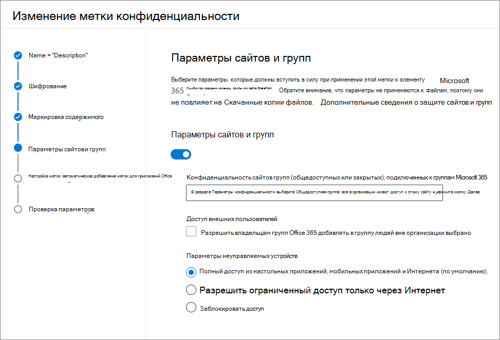

# <a name="use-sensitivity-labels-to-protect-content-in-microsoft-teams-microsoft-365-groups-and-sharepoint-sites"></a><span data-ttu-id="07eb4-103">Используйте метки конфиденциальности, чтобы защитить контент в Microsoft Teams, в группах Microsoft 365 и на сайтах SharePoint.</span><span class="sxs-lookup"><span data-stu-id="07eb4-103">Use sensitivity labels to protect content in Microsoft Teams, Microsoft 365 groups, and SharePoint sites</span></span>

><span data-ttu-id="07eb4-104">*[Руководство по лицензированию Microsoft 365 для обеспечения безопасности и соответствия требованиям](https://aka.ms/ComplianceSD).*</span><span class="sxs-lookup"><span data-stu-id="07eb4-104">*[Microsoft 365 licensing guidance for security & compliance](https://aka.ms/ComplianceSD).*</span></span>

<span data-ttu-id="07eb4-105">Можно использовать [метки конфиденциальности](sensitivity-labels.md) не только для классификации и защиты документов и сообщений электронной почты, но и для защиты содержимого в следующих контейнерах: сайты Microsoft Teams, группы Microsoft 365 ([ранее — группы Office 365](https://techcommunity.microsoft.com/t5/microsoft-365-blog/office-365-groups-will-become-microsoft-365-groups/ba-p/1303601)), сайты SharePoint.</span><span class="sxs-lookup"><span data-stu-id="07eb4-105">In addition to using [sensitivity labels](sensitivity-labels.md) to classify and protect documents and emails, you can also use sensitivity labels to protect content in the following containers: Microsoft Teams sites, Microsoft 365 groups ([formerly Office 365 groups](https://techcommunity.microsoft.com/t5/microsoft-365-blog/office-365-groups-will-become-microsoft-365-groups/ba-p/1303601)), and SharePoint sites.</span></span> <span data-ttu-id="07eb4-106">Для этой классификации и защиты на уровне контейнеров используйте следующие параметры меток:</span><span class="sxs-lookup"><span data-stu-id="07eb4-106">For this container-level classification and protection, use the following label settings:</span></span>

- <span data-ttu-id="07eb4-107">Конфиденциальность сайтов групп (общедоступных или закрытых), подключенных к группам Microsoft 365</span><span class="sxs-lookup"><span data-stu-id="07eb4-107">Privacy (public or private) of Microsoft 365 group-connected teams sites</span></span>
- <span data-ttu-id="07eb4-108">Доступ внешних пользователей</span><span class="sxs-lookup"><span data-stu-id="07eb4-108">External users access</span></span>
- <span data-ttu-id="07eb4-109">Доступ с неуправляемых устройств</span><span class="sxs-lookup"><span data-stu-id="07eb4-109">Access from unmanaged devices</span></span> 

<span data-ttu-id="07eb4-110">При применении этой метки конфиденциальности к поддерживаемому контейнеру эта метка автоматически применяет параметры классификации и защиты к подключенному сайту или группе.</span><span class="sxs-lookup"><span data-stu-id="07eb4-110">When you apply this sensitivity label to a supported container, the label automatically applies the classification and protection settings to the connected site or group.</span></span>

<span data-ttu-id="07eb4-111">Тем не менее, содержимое этих контейнеров не наследует метки классификации и параметры, такие как наглядная маркировка или шифрование.</span><span class="sxs-lookup"><span data-stu-id="07eb4-111">Content in these containers however, do not inherit the labels for the classification and settings such as visual markings, or encryption.</span></span> <span data-ttu-id="07eb4-112">Необходимо [включить метки конфиденциальности для файлов Office в SharePoint и OneDrive](sensitivity-labels-sharepoint-onedrive-files.md), чтобы пользователи могли маркировать свои документы на веб-сайтах SharePoint и сайтах команд.</span><span class="sxs-lookup"><span data-stu-id="07eb4-112">So that users can label their documents in SharePoint sites or team sites, make sure you've [enabled sensitivity labels for Office files in SharePoint and OneDrive](sensitivity-labels-sharepoint-onedrive-files.md).</span></span>

> [!NOTE]
> <span data-ttu-id="07eb4-113">Метки конфиденциальности для контейнеров не поддерживаются в сетях доставки содержимого (CDN) Office 365.</span><span class="sxs-lookup"><span data-stu-id="07eb4-113">Sensitivity labels for containers aren't supported with Office 365 Content Delivery Networks (CDNs).</span></span>

## <a name="using-sensitivity-labels-for-microsoft-teams-microsoft-365-groups-and-sharepoint-sites"></a><span data-ttu-id="07eb4-114">Использование меток конфиденциальности для Microsoft Teams, групп Microsoft 365 и сайтов SharePoint</span><span class="sxs-lookup"><span data-stu-id="07eb4-114">Using sensitivity labels for Microsoft Teams, Microsoft 365 groups, and SharePoint sites</span></span>

<span data-ttu-id="07eb4-115">Перед включением меток конфиденциальности для контейнеров и настройки новых параметров меток конфиденциальности пользователи могут просмотреть и применить метки конфиденциальности в своих приложениях.</span><span class="sxs-lookup"><span data-stu-id="07eb4-115">Before you enable sensitivity labels for containers and configure sensitivity labels for the new settings, users can see and apply sensitivity labels in their apps.</span></span> <span data-ttu-id="07eb4-116">Например, в Word:</span><span class="sxs-lookup"><span data-stu-id="07eb4-116">For example, from Word:</span></span>


<span data-ttu-id="07eb4-118">После включения и настройки меток конфиденциальности для контейнеров пользователи также смогут просматривать и применять метки конфиденциальности к сайтам команд Microsoft Teams, группам Microsoft 365 и сайтам SharePoint.</span><span class="sxs-lookup"><span data-stu-id="07eb4-118">After you enable and configure sensitivity labels for containers, users can additionally see and apply sensitivity labels to Microsoft team sites, Microsoft 365 groups, and SharePoint sites.</span></span> <span data-ttu-id="07eb4-119">Например, при создании нового сайта группы в SharePoint:</span><span class="sxs-lookup"><span data-stu-id="07eb4-119">For example, when you create a new team site from SharePoint:</span></span>


## <a name="how-to-enable-sensitivity-labels-for-containers-and-synchronize-labels"></a><span data-ttu-id="07eb4-121">Включение меток конфиденциальности для контейнеров и синхронизация меток</span><span class="sxs-lookup"><span data-stu-id="07eb4-121">How to enable sensitivity labels for containers and synchronize labels</span></span>

1. <span data-ttu-id="07eb4-122">Эта функция использует функциональность Azure AD, поэтому для включения поддержки меток конфиденциальности инструкциям из документации Azure AD: [Назначение меток конфиденциальности группам Microsoft 365 в Azure Active Directory](https://docs.microsoft.com/azure/active-directory/users-groups-roles/groups-assign-sensitivity-labels).</span><span class="sxs-lookup"><span data-stu-id="07eb4-122">Because this feature uses Azure AD functionality, follow the instructions from the Azure AD documentation to enable sensitivity label support: [Assign sensitivity labels to Microsoft 365 groups in Azure Active Directory](https://docs.microsoft.com/azure/active-directory/users-groups-roles/groups-assign-sensitivity-labels).</span></span>

2. <span data-ttu-id="07eb4-123">Теперь нужно синхронизировать метки конфиденциальности с Azure AD.</span><span class="sxs-lookup"><span data-stu-id="07eb4-123">You now need to synchronize your sensitivity labels to Azure AD.</span></span> <span data-ttu-id="07eb4-124">Сначала [подключитесь к PowerShell Центра безопасности и соответствия требованиям Office 365](/powershell/exchange/office-365-scc/connect-to-scc-powershell/connect-to-scc-powershell).</span><span class="sxs-lookup"><span data-stu-id="07eb4-124">First, [connect to Office 365 Security & Compliance Center PowerShell](/powershell/exchange/office-365-scc/connect-to-scc-powershell/connect-to-scc-powershell).</span></span> 
    
    <span data-ttu-id="07eb4-125">Например, в сеансе PowerShell, который вы запускаете как администратор, войдите в систему с помощью учетной записи глобального администратора.</span><span class="sxs-lookup"><span data-stu-id="07eb4-125">For example, in a PowerShell session that you run as administrator, sign in with a global administrator account:</span></span>
    
    ```powershell
    Set-ExecutionPolicy RemoteSigned
    $UserCredential = Get-Credential
    $Session = New-PSSession -ConfigurationName Microsoft.Exchange -ConnectionUri https://ps.compliance.protection.outlook.com/powershell-liveid/ -Credential $UserCredential -Authentication Basic -AllowRedirection
    Import-PSSession $Session -DisableNameChecking
    ```

3. <span data-ttu-id="07eb4-126">Затем выполните следующую команду, чтобы можно было использовать метки конфиденциальности с группами Microsoft 365:</span><span class="sxs-lookup"><span data-stu-id="07eb4-126">Then run the following command to ensure your sensitivity labels can be used with Microsoft 365 groups:</span></span>
    
    ```powershell
    Execute-AzureAdLabelSync
    ```

## <a name="how-to-configure-site-and-group-settings"></a><span data-ttu-id="07eb4-127">Настройка параметров сайтов и групп</span><span class="sxs-lookup"><span data-stu-id="07eb4-127">How to configure site and group settings</span></span>

<span data-ttu-id="07eb4-128">Теперь вы можете создавать или изменять метки конфиденциальности, которые должны быть доступны для сайтов и групп.</span><span class="sxs-lookup"><span data-stu-id="07eb4-128">You're now ready to create or edit sensitivity labels that you want to be available for sites and groups.</span></span> <span data-ttu-id="07eb4-129">При включении меток конфиденциальности для контейнеров в мастерах присвоения меток конфиденциальности появится новая страница: **Параметры сайтов и групп**.</span><span class="sxs-lookup"><span data-stu-id="07eb4-129">Enabling sensitivity labels for containers makes a new page visible in the sensitivity labeling wizards: **Site and group settings**</span></span>

<span data-ttu-id="07eb4-130">Если вам нужна помощь по созданию или изменению метки конфиденциальности, см. инструкции в статье [Создание и настройка меток конфиденциальности](create-sensitivity-labels.md#create-and-configure-sensitivity-labels).</span><span class="sxs-lookup"><span data-stu-id="07eb4-130">If you need help with creating or editing a sensitivity label, see the instructions from [Create and configure sensitivity labels](create-sensitivity-labels.md#create-and-configure-sensitivity-labels).</span></span>

<span data-ttu-id="07eb4-131">На этой новой странице **Параметры сайта и группы** настройте параметры:</span><span class="sxs-lookup"><span data-stu-id="07eb4-131">On this new **Site and group settings** page, configure the settings:</span></span>

- <span data-ttu-id="07eb4-132">**Конфиденциальность сайтов команд, подключенных к группам Office 365**. Сохраняйте стандартное значение **Общедоступный. Это означает, что любой пользователь из организации может получить доступ к сайту**, если вы хотите, чтобы любой пользователь в организации имел доступ к сайту команды или к группе, к которым применена эта метка.</span><span class="sxs-lookup"><span data-stu-id="07eb4-132">**Privacy of Office 365 group-connected teams sites**: Keep the default of **Public - anyone in the organization can access the site** if you want anyone in your organization to access the team site or group where this label is applied.</span></span>
    
    <span data-ttu-id="07eb4-133">Если вы хотите предоставить доступ только утвержденным пользователям в организации, выберите **Закрытый**.</span><span class="sxs-lookup"><span data-stu-id="07eb4-133">Select **Private** if you want access to be restricted to only approved members in your organization.</span></span>
    
    <span data-ttu-id="07eb4-134">Выберите **Отсутствует – позволить пользователю выбрать, кто имеет доступ к сайту**, если вы хотите защитить контент в контейнере с помощью метки конфиденциальности, но при этом разрешить пользователям самим настраивать параметры конфиденциальности.</span><span class="sxs-lookup"><span data-stu-id="07eb4-134">Select **None - let user chose who can access the site** when you want to protect content in the container by using the sensitivity label, but still let users configure the privacy setting themselves.</span></span>
    
    <span data-ttu-id="07eb4-135">Параметры **Общедоступный** или **Закрытый** устанавливают и блокируют параметр конфиденциальности при применении этой метки к контейнеру.</span><span class="sxs-lookup"><span data-stu-id="07eb4-135">The settings of **Public** or **Private** set and lock the privacy setting when you apply this label to the container.</span></span> <span data-ttu-id="07eb4-136">Выбранный вами параметр заменяет все прежние параметры конфиденциальности, которые могли быть настроены для команды или группы, и блокирует значение конфиденциальности: теперь его можно будет изменить только после удаления метки конфиденциальности из контейнера.</span><span class="sxs-lookup"><span data-stu-id="07eb4-136">Your chosen setting replaces any previous privacy setting that might be configured for the team or group, and locks the privacy value so it can be changed only by first removing the sensitivity label from the container.</span></span> <span data-ttu-id="07eb4-137">После удаления метки чувствительности настройки конфиденциальности из метки остаются, и пользователи теперь могут изменить их снова.</span><span class="sxs-lookup"><span data-stu-id="07eb4-137">After you remove the sensitivity label, the privacy setting from the label remains and users can now change it again.</span></span>

- <span data-ttu-id="07eb4-138">**Доступ внешних пользователей**. Определяет, может ли владелец группы [добавлять гостей в группу](/office365/admin/create-groups/manage-guest-access-in-groups).</span><span class="sxs-lookup"><span data-stu-id="07eb4-138">**External users access**: Control whether the group owner can [add guests to the group](/office365/admin/create-groups/manage-guest-access-in-groups).</span></span>

- <span data-ttu-id="07eb4-139">**Неуправляемые устройства**. Для [неуправляемых устройств](/sharepoint/control-access-from-unmanaged-devices) можно разрешить полный доступ, доступ только через Интернет или полностью заблокировать доступ.</span><span class="sxs-lookup"><span data-stu-id="07eb4-139">**Unmanaged devices**: For [unmanaged devices](/sharepoint/control-access-from-unmanaged-devices), allow full access, web only access, or block access completely.</span></span> <span data-ttu-id="07eb4-140">Если вы настроили этот параметр на уровне клиента или для определенного сайта, указываемый здесь параметр будет применен, только если он более строгий.</span><span class="sxs-lookup"><span data-stu-id="07eb4-140">If you have configured this setting at the tenant level or for a specific site, the setting you specify here will be applied only if it's more restrictive.</span></span>



> [!IMPORTANT]
> <span data-ttu-id="07eb4-142">Когда вы применяете метку к команде, группе или сайту, в силу вступают только эти параметры сайта и группы.</span><span class="sxs-lookup"><span data-stu-id="07eb4-142">Only these site and group settings take effect when you apply the label to a team, group, or site.</span></span> <span data-ttu-id="07eb4-143">Другие параметры метки, например шифрование и маркировка контента, не применяются к содержимому в команде, группе или на сайте.</span><span class="sxs-lookup"><span data-stu-id="07eb4-143">Other label settings, such as encryption and content marking, aren't applied to the content within the team, group, or site.</span></span>
> 
> <span data-ttu-id="07eb4-144">Постепенное развертывание для арендаторов: только ярлыки с настройками сайта и группы будут доступны для выбора при создании пользователями групп, групп и сайтов.</span><span class="sxs-lookup"><span data-stu-id="07eb4-144">Gradually rolling out to tenants: Only labels with the site and group settings will be available to select when users create teams, groups, and sites.</span></span> <span data-ttu-id="07eb4-145">Если в настоящее время вы можете применить метку к контейнеру, когда для метки не включены настройки сайта и группы, к контейнеру применяется только имя метки.</span><span class="sxs-lookup"><span data-stu-id="07eb4-145">If you can currently apply a label to a container when the label doesn't have the site and group settings enabled, only the label name is applied to the container.</span></span>

<span data-ttu-id="07eb4-146">Если метка конфиденциальности еще не опубликована, опубликуйте ее, [добавив в политику меток конфиденциальности](create-sensitivity-labels.md#publish-sensitivity-labels-by-creating-a-label-policy).</span><span class="sxs-lookup"><span data-stu-id="07eb4-146">If your sensitivity label isn't already published, now publish it by [adding it to a sensitivity label policy](create-sensitivity-labels.md#publish-sensitivity-labels-by-creating-a-label-policy).</span></span> <span data-ttu-id="07eb4-147">Пользователи, которым назначена политика меток конфиденциальности, включающая эту метку, смогут выбирать ее для сайтов и групп.</span><span class="sxs-lookup"><span data-stu-id="07eb4-147">The users who are assigned a sensitivity label policy that includes this label will be able to select it for sites and groups.</span></span>

<span data-ttu-id="07eb4-148">Из политики меток только параметр политики **Применить эту метку по умолчанию к документам**, и электронная почта применима при применении этой метки к контейнерам.</span><span class="sxs-lookup"><span data-stu-id="07eb4-148">From the label policy, only the policy setting **Apply this label by default to documents and email** is applicable when you apply this label to containers.</span></span> <span data-ttu-id="07eb4-149">Другие параметры политики не применяются, включая обязательную маркировку, требующую обоснования пользователя и ссылку на пользовательскую страницу справки.</span><span class="sxs-lookup"><span data-stu-id="07eb4-149">Other policy settings are not applied, which include mandatory labeling, requiring user justification, and a link to the custom help page.</span></span>

## <a name="sensitivity-label-management"></a><span data-ttu-id="07eb4-150">Управление метками конфиденциальности</span><span class="sxs-lookup"><span data-stu-id="07eb4-150">Sensitivity label management</span></span>

<span data-ttu-id="07eb4-151">При создании, изменении и удалении меток конфиденциальности, настроенных для сайтов и групп, используйте приведенные ниже рекомендации.</span><span class="sxs-lookup"><span data-stu-id="07eb4-151">Use the following guidance for when you create, modify, or delete sensitivity labels that are configured for sites and groups.</span></span>

### <a name="creating-and-publishing-labels-that-are-configured-for-sites-and-groups"></a><span data-ttu-id="07eb4-152">Создание и публикация меток, настроенных для сайтов и групп</span><span class="sxs-lookup"><span data-stu-id="07eb4-152">Creating and publishing labels that are configured for sites and groups</span></span>

<span data-ttu-id="07eb4-153">После создания и публикации метки может потребоваться час, чтобы она стала видимой для пользователей команд, групп и сайтов.</span><span class="sxs-lookup"><span data-stu-id="07eb4-153">When a new sensitivity label is created and published, it's visible for users in teams, groups, and sites within one hour.</span></span> <span data-ttu-id="07eb4-154">Однако если изменить существующую метку, может потребоваться до 24 часов.</span><span class="sxs-lookup"><span data-stu-id="07eb4-154">However, if you modify an existing label, allow up to 24 hours.</span></span> <span data-ttu-id="07eb4-155">Используйте следующие рекомендации, чтобы опубликовать метку для пользователей, если метка настроена для параметров сайта и группы:</span><span class="sxs-lookup"><span data-stu-id="07eb4-155">Use the following guidance to publish a label for your users when that label is configured for site and group settings:</span></span>

1. <span data-ttu-id="07eb4-156">После создания и настройки метки конфиденциальности добавьте эту метку в политику меток, которая применяется только к нескольким тестовым пользователям.</span><span class="sxs-lookup"><span data-stu-id="07eb4-156">After you create and configure the sensitivity label, add this label to a label policy that applies to just a few test users.</span></span>

2. <span data-ttu-id="07eb4-157">Подождите, пока изменение не будет реплицировано.</span><span class="sxs-lookup"><span data-stu-id="07eb4-157">Wait for the change to replicate:</span></span>
    - <span data-ttu-id="07eb4-158">Новая метка: подождите один час.</span><span class="sxs-lookup"><span data-stu-id="07eb4-158">New label: Wait for one hour.</span></span>
    - <span data-ttu-id="07eb4-159">Существующая метка: подождите 24 часа.</span><span class="sxs-lookup"><span data-stu-id="07eb4-159">Existing label: Wait for 24 hours.</span></span>

3. <span data-ttu-id="07eb4-160">После этого периода ожидания используйте одну из тестовых учетных записей пользователей для создания команды, группы Microsoft 365 или сайта SharePoint с меткой, созданной на шаге 1.</span><span class="sxs-lookup"><span data-stu-id="07eb4-160">After this wait period, use one of the test user accounts to create a team, Microsoft 365 group, or SharePoint site with the label that you created in step 1.</span></span>

4. <span data-ttu-id="07eb4-161">Если в ходе этой операции создания не возникают ошибки, можно безопасно опубликовать метку для всех пользователей в клиенте.</span><span class="sxs-lookup"><span data-stu-id="07eb4-161">If there are no errors during this creation operation, you know it's safe to publish the label to all users in your tenant.</span></span>

### <a name="modifying-published-labels-that-are-configured-for-sites-and-groups"></a><span data-ttu-id="07eb4-162">Изменение опубликованных меток, настроенных для сайтов и групп</span><span class="sxs-lookup"><span data-stu-id="07eb4-162">Modifying published labels that are configured for sites and groups</span></span>

<span data-ttu-id="07eb4-163">Рекомендуется не изменять параметры сайта и группы для метки конфиденциальности после ее применения к командам, группам или сайтам.</span><span class="sxs-lookup"><span data-stu-id="07eb4-163">As a best practice, don't change the site and group settings for a sensitivity label after the label has been applied to teams, groups, or sites.</span></span> <span data-ttu-id="07eb4-164">Если изменить параметры, то необходимо помнить, что репликация изменений для всех контейнеров, к которым применена эта метка, может занять до 24 часов.</span><span class="sxs-lookup"><span data-stu-id="07eb4-164">If you do, remember to wait for 24 hours for the changes to replicate to all containers that have the label applied.</span></span> 

<span data-ttu-id="07eb4-165">Кроме того, если изменения затрагивают параметр **Доступ внешних пользователей**:</span><span class="sxs-lookup"><span data-stu-id="07eb4-165">In addition, if your changes include the **External users access** setting:</span></span>

- <span data-ttu-id="07eb4-166">Новый параметр применяется к новым пользователям, но не применяется к существующим пользователям.</span><span class="sxs-lookup"><span data-stu-id="07eb4-166">The new setting applies to new users but not to existing users.</span></span> <span data-ttu-id="07eb4-167">Например, если ранее был выбран этот параметр, в результате чего гостевые пользователи получали доступ к сайту, эти гостевые пользователи по-прежнему смогут получать доступ к сайту после очистки этого параметра в конфигурации метки.</span><span class="sxs-lookup"><span data-stu-id="07eb4-167">For example, if this setting was previously selected and as a result, guest users accessed the site, these guest users can still access the site after this setting is cleared in the label configuration.</span></span>

- <span data-ttu-id="07eb4-168">Параметры конфиденциальности для свойств группы hiddenMembership и roleEnabled не обновляются.</span><span class="sxs-lookup"><span data-stu-id="07eb4-168">The privacy settings for the group properties hiddenMembership and roleEnabled aren't updated.</span></span>


### <a name="deleting-published-labels-that-are-configured-for-sites-and-groups"></a><span data-ttu-id="07eb4-169">Удаление опубликованных наклеек, настроенных для сайтов и групп</span><span class="sxs-lookup"><span data-stu-id="07eb4-169">Deleting published labels that are configured for sites and groups</span></span>

<span data-ttu-id="07eb4-170">Если удалить метку чувствительности с включенными настройками сайта и группы, а эта метка включена в одну или несколько политик меток, в результате могут возникнуть ошибки при создании новых команд, групп и сайтов.</span><span class="sxs-lookup"><span data-stu-id="07eb4-170">If you delete a sensitivity label that has the site and group settings enabled, and that label is included in one or more label policies, this action can result in creation failures for new teams, groups, and sites.</span></span> <span data-ttu-id="07eb4-171">Чтобы избежать этой ситуации, используйте следующее руководство:</span><span class="sxs-lookup"><span data-stu-id="07eb4-171">To avoid this situation, use the following guidance:</span></span>

1. <span data-ttu-id="07eb4-172">Удалите метку конфиденциальности из всех политик меток, содержащих ее.</span><span class="sxs-lookup"><span data-stu-id="07eb4-172">Remove the sensitivity label from all label policies that include the label.</span></span>

2. <span data-ttu-id="07eb4-173">Подождите один час.</span><span class="sxs-lookup"><span data-stu-id="07eb4-173">Wait for one hour.</span></span>

3. <span data-ttu-id="07eb4-174">После этого периода ожидания попробуйте создать команду, группу или сайт и убедитесь, что метка больше не отображается.</span><span class="sxs-lookup"><span data-stu-id="07eb4-174">After this wait period, try creating a team, group, or site and confirm that the label is no longer visible.</span></span>

4. <span data-ttu-id="07eb4-175">Если метка конфиденциальности не отображается, теперь ее можно безопасно удалить ее.</span><span class="sxs-lookup"><span data-stu-id="07eb4-175">If the sensitivity label isn't visible, you can now safely delete the label.</span></span>

## <a name="how-to-apply-sensitivity-labels-to-containers"></a><span data-ttu-id="07eb4-176">Применение меток конфиденциальности к контейнерам</span><span class="sxs-lookup"><span data-stu-id="07eb4-176">How to apply sensitivity labels to containers</span></span>

<span data-ttu-id="07eb4-177">Теперь вы готовы к применению одной или нескольких меток конфиденциальности к следующим контейнерам:</span><span class="sxs-lookup"><span data-stu-id="07eb4-177">You're now ready to apply the sensitivity label or labels to the following containers:</span></span>

- [<span data-ttu-id="07eb4-178">Группы Microsoft 365 в Azure AD</span><span class="sxs-lookup"><span data-stu-id="07eb4-178">Microsoft 365 group in Azure AD</span></span>](#apply-sensitivity-labels-to-microsoft-365-groups)
- [<span data-ttu-id="07eb4-179">Сайт команды Microsoft Teams</span><span class="sxs-lookup"><span data-stu-id="07eb4-179">Microsoft Teams team site</span></span>](#apply-a-sensitivity-label-to-a-new-team)
- [<span data-ttu-id="07eb4-180">Группа Microsoft 365 в Outlook в Интернете</span><span class="sxs-lookup"><span data-stu-id="07eb4-180">Microsoft 365 group in Outlook on the web</span></span>](#apply-a-sensitivity-label-to-a-new-group-in-outlook-on-the-web)
- [<span data-ttu-id="07eb4-181">Сайт SharePoint</span><span class="sxs-lookup"><span data-stu-id="07eb4-181">SharePoint site</span></span>](#apply-a-sensitivity-label-to-a-new-site)

<span data-ttu-id="07eb4-182">При необходимости можно использовать PowerShell для [применения метки конфиденциальности к нескольким сайтам](#use-powershell-to-apply-a-sensitivity-label-to-multiple-sites).</span><span class="sxs-lookup"><span data-stu-id="07eb4-182">You can use PowerShell if you need to [apply a sensitivity label to multiple sites](#use-powershell-to-apply-a-sensitivity-label-to-multiple-sites).</span></span>

### <a name="apply-sensitivity-labels-to-microsoft-365-groups"></a><span data-ttu-id="07eb4-183">Применение меток конфиденциальности к группам Microsoft 365</span><span class="sxs-lookup"><span data-stu-id="07eb4-183">Apply sensitivity labels to Microsoft 365 groups</span></span>

<span data-ttu-id="07eb4-184">Теперь вы можете применить метки или метку конфиденциальности к группам Microsoft 365.</span><span class="sxs-lookup"><span data-stu-id="07eb4-184">You're now ready to apply the sensitivity label or labels to Microsoft 365 groups.</span></span> <span data-ttu-id="07eb4-185">Инструкции см. в документации Azure AD:</span><span class="sxs-lookup"><span data-stu-id="07eb4-185">Return to the Azure AD documentation for instructions:</span></span>

- [<span data-ttu-id="07eb4-186">Назначение метки новой группе на портале Azure</span><span class="sxs-lookup"><span data-stu-id="07eb4-186">Assign a label to a new group in Azure portal</span></span>](https://docs.microsoft.com/azure/active-directory/users-groups-roles/groups-assign-sensitivity-labels#assign-a-label-to-a-new-group-in-azure-portal)

-  [<span data-ttu-id="07eb4-187">Назначение метки существующей группе на портале Azure</span><span class="sxs-lookup"><span data-stu-id="07eb4-187">Assign a label to an existing group in Azure portal</span></span>](https://docs.microsoft.com/azure/active-directory/users-groups-roles/groups-assign-sensitivity-labels#assign-a-label-to-an-existing-group-in-azure-portal)

-  <span data-ttu-id="07eb4-188">[Удаление метки из существующей группы на портале Azure](https://docs.microsoft.com/azure/active-directory/users-groups-roles/groups-assign-sensitivity-labels#remove-a-label-from-an-existing-group-in-azure-portal)</span><span class="sxs-lookup"><span data-stu-id="07eb4-188">[Remove a label from an existing group in Azure portal](https://docs.microsoft.com/azure/active-directory/users-groups-roles/groups-assign-sensitivity-labels#remove-a-label-from-an-existing-group-in-azure-portal).</span></span>

### <a name="apply-a-sensitivity-label-to-a-new-team"></a><span data-ttu-id="07eb4-189">Применение метки конфиденциальности к новой команде</span><span class="sxs-lookup"><span data-stu-id="07eb4-189">Apply a sensitivity label to a new team</span></span>

<span data-ttu-id="07eb4-190">Пользователи могут выбирать метки конфиденциальности при создании новых команд в Microsoft Teams.</span><span class="sxs-lookup"><span data-stu-id="07eb4-190">Users can select sensitivity labels when they create new teams in Microsoft Teams.</span></span> <span data-ttu-id="07eb4-191">При выборе метки в раскрывающемся списке **Чувствительность** параметр конфиденциальности может измениться, чтобы отразить конфигурацию метки.</span><span class="sxs-lookup"><span data-stu-id="07eb4-191">When they select the label from the **Sensitivity** dropdown, the privacy setting might change to reflect the label configuration.</span></span> <span data-ttu-id="07eb4-192">В зависимости от параметра доступа внешних пользователей, выбранного для метки, пользователи могут или не могут добавлять в команду людей из-за пределов организации.</span><span class="sxs-lookup"><span data-stu-id="07eb4-192">Depending on the external users access setting you selected for the label, users can or can't add people outside the organization to the team.</span></span>

[<span data-ttu-id="07eb4-193">Дополнительные сведения о метках конфиденциальности для Teams</span><span class="sxs-lookup"><span data-stu-id="07eb4-193">Learn more about sensitivity labels for Teams</span></span>](https://docs.microsoft.com/microsoftteams/sensitivity-labels)


<span data-ttu-id="07eb4-195">После создания команды метка конфиденциальности отображается в правом верхнем углу всех каналов.</span><span class="sxs-lookup"><span data-stu-id="07eb4-195">After you create the team, the sensitivity label appears in the upper-right corner of all channels.</span></span>


<span data-ttu-id="07eb4-197">Служба автоматически применяет такую же метку конфиденциальности к группе Microsoft 365 и подключенному сайту команды SharePoint.</span><span class="sxs-lookup"><span data-stu-id="07eb4-197">The service automatically applies the same sensitivity label to the Microsoft 365 group and the connected SharePoint team site.</span></span>

### <a name="apply-a-sensitivity-label-to-a-new-group-in-outlook-on-the-web"></a><span data-ttu-id="07eb4-198">Применение метки конфиденциальности к новой группе в Outlook в Интернете</span><span class="sxs-lookup"><span data-stu-id="07eb4-198">Apply a sensitivity label to a new group in Outlook on the web</span></span>

<span data-ttu-id="07eb4-199">В Outlook в Интернете при создании группы можно выбрать или изменить параметр **Конфиденциальность** для опубликованных меток:</span><span class="sxs-lookup"><span data-stu-id="07eb4-199">In Outlook on the web, when you create a new group, you can select or change the **Sensitivity** option for published labels:</span></span>


### <a name="apply-a-sensitivity-label-to-a-new-site"></a><span data-ttu-id="07eb4-201">Применение метки конфиденциальности к новому сайту</span><span class="sxs-lookup"><span data-stu-id="07eb4-201">Apply a sensitivity label to a new site</span></span>

<span data-ttu-id="07eb4-202">Администраторы и конечные пользователи могут выбирать метки чувствительности [при создании современных сайтов групп и сайтов связи](/sharepoint/create-site-collection) и расширять **дополнительные параметры**:</span><span class="sxs-lookup"><span data-stu-id="07eb4-202">Admins and end users can select sensitivity labels when they [create modern team sites and communication sites](/sharepoint/create-site-collection), and expand **Advanced settings**:</span></span>


<span data-ttu-id="07eb4-204">В раскрывающемся списке отображаются имена меток для выбора, а значок справки отображает все имена меток с их подсказкой, которая может помочь пользователям определить правильную метку для применения.</span><span class="sxs-lookup"><span data-stu-id="07eb4-204">The dropdown box displays the label names for the selection, and the help icon displays all the label names with their tooltip, which can help users determine the correct label to apply.</span></span>

<span data-ttu-id="07eb4-205">Когда метка применяется, и пользователи переходят на сайт, они видят название метки и применяемые политики.</span><span class="sxs-lookup"><span data-stu-id="07eb4-205">When the label is applied, and users browse to the site, they see the name of the label and applied policies.</span></span> <span data-ttu-id="07eb4-206">Например, этот сайт был помечен как **конфиденциальный**, а для параметра конфиденциальности установлено значение **Личное**:</span><span class="sxs-lookup"><span data-stu-id="07eb4-206">For example, this site has been labeled as **Confidential**, and the privacy setting is set to **Private**:</span></span>


### <a name="use-powershell-to-apply-a-sensitivity-label-to-multiple-sites"></a><span data-ttu-id="07eb4-208">Использование PowerShell для применения метки конфиденциальности к нескольким сайтам</span><span class="sxs-lookup"><span data-stu-id="07eb4-208">Use PowerShell to apply a sensitivity label to multiple sites</span></span>

<span data-ttu-id="07eb4-209">Можно использовать командлеты [Set-SPOSite](/powershell/module/sharepoint-online/set-sposite?view=sharepoint-ps) и [Set-SPOTenant](/powershell/module/sharepoint-online/set-spotenant?view=sharepoint-ps) с параметром *SensitivityLabel* из текущей командной консоли SharePoint Online для применения метки конфиденциальности к нескольким сайтам.</span><span class="sxs-lookup"><span data-stu-id="07eb4-209">You can use the [Set-SPOSite](/powershell/module/sharepoint-online/set-sposite?view=sharepoint-ps) and [Set-SPOTenant](/powershell/module/sharepoint-online/set-spotenant?view=sharepoint-ps) cmdlet with the *SensitivityLabel* parameter from the current SharePoint Online Management Shell to apply a sensitivity label to many sites.</span></span> <span data-ttu-id="07eb4-210">Это касается любых семейств веб-сайтов SharePoint и сайтов OneDrive.</span><span class="sxs-lookup"><span data-stu-id="07eb4-210">The sites can be any SharePoint site collection, or a OneDrive site.</span></span>

<span data-ttu-id="07eb4-211">Убедитесь, что используется командная консоль SharePoint Online версии 16.0.19418.12000 или более поздней.</span><span class="sxs-lookup"><span data-stu-id="07eb4-211">Make sure you have version 16.0.19418.12000 or later of the SharePoint Online Management Shell.</span></span>

1. <span data-ttu-id="07eb4-212">Откройте сеанс PowerShell с параметром **Запуск от имени администратора**.</span><span class="sxs-lookup"><span data-stu-id="07eb4-212">Open a PowerShell session with the **Run as Administrator** option.</span></span>

2. <span data-ttu-id="07eb4-213">Если вы не знаете GUID метки: [установите подключение к PowerShell Центра безопасности и соответствия требованиям Office 365](https://docs.microsoft.com/powershell/exchange/office-365-scc/connect-to-scc-powershell/connect-to-scc-powershell?view=exchange-ps) и получите список меток конфиденциальности и их идентификаторов GUID.</span><span class="sxs-lookup"><span data-stu-id="07eb4-213">If you don't know your label GUID: [Connect to Office 365 Security & Compliance Center PowerShell](https://docs.microsoft.com/powershell/exchange/office-365-scc/connect-to-scc-powershell/connect-to-scc-powershell?view=exchange-ps) and get the list of sensitivity labels and their GUIDs.</span></span>
    
    ```powershell
    Get-Label |ft Name, Guid
    ```

3. <span data-ttu-id="07eb4-214">Теперь [установите подключение к Exchange Online PowerShell](https://docs.microsoft.com/powershell/exchange/exchange-online/connect-to-exchange-online-powershell/connect-to-exchange-online-powershell?view=exchange-ps) и сохраните GUID метки в качестве переменной.</span><span class="sxs-lookup"><span data-stu-id="07eb4-214">Now [connect to Exchange Online PowerShell](https://docs.microsoft.com/powershell/exchange/exchange-online/connect-to-exchange-online-powershell/connect-to-exchange-online-powershell?view=exchange-ps) and store your label GUID as a variable.</span></span> <span data-ttu-id="07eb4-215">Пример.</span><span class="sxs-lookup"><span data-stu-id="07eb4-215">For example:</span></span> 
    
    ```powershell
    $Id = [GUID]("e48058ea-98e8-4940-8db0-ba1310fd955e")
    ```

4. <span data-ttu-id="07eb4-216">Создайте новую переменную, идентифицирующую несколько сайтов, обладающих общей идентификационной строкой в URL-адресах.</span><span class="sxs-lookup"><span data-stu-id="07eb4-216">Create a new variable that identifies multiple sites that have an identifying string in common in their URL.</span></span> <span data-ttu-id="07eb4-217">Пример.</span><span class="sxs-lookup"><span data-stu-id="07eb4-217">For example:</span></span>
    
    ```powershell
    $sites = Get-SPOSite -IncludePersonalSite $true -Limit all -Filter "Url -like 'documents" 
    ```

5. <span data-ttu-id="07eb4-218">Выполните следующую команду для применения метки к этим сайтам.</span><span class="sxs-lookup"><span data-stu-id="07eb4-218">Run the following command to apply the label to these sites.</span></span> <span data-ttu-id="07eb4-219">С помощью наших примеров:</span><span class="sxs-lookup"><span data-stu-id="07eb4-219">Using our examples:</span></span>
    
    ```powershell
    $sites | ForEach-Object {Set-SpoTenant $_.url -SensitivityLabel $Id}
    ```

<span data-ttu-id="07eb4-220">Чтобы применить разные метки к разным сайтам, повторите следующую команду для каждого сайта: `Set-SPOSite -Identity <URL> -SensitivityLabel "<labelguid>"`</span><span class="sxs-lookup"><span data-stu-id="07eb4-220">To apply different labels to different sites, repeat the following command for each site: `Set-SPOSite -Identity <URL> -SensitivityLabel "<labelguid>"`</span></span>

## <a name="view-and-manage-sensitivity-labels-in-the-sharepoint-admin-center"></a><span data-ttu-id="07eb4-221">Просмотр и управление метками конфиденциальности в Центре администрирования SharePoint</span><span class="sxs-lookup"><span data-stu-id="07eb4-221">View and manage sensitivity labels in the SharePoint admin center</span></span>

<span data-ttu-id="07eb4-222">Для просмотра, сортировки и поиска примененных меток конфиденциальности используйте страницу **Активные сайты** в новом Центре администрирования SharePoint.</span><span class="sxs-lookup"><span data-stu-id="07eb4-222">To view, sort, and search the applied sensitivity labels, use the **Active sites** page in the new SharePoint admin center.</span></span> <span data-ttu-id="07eb4-223">Возможно, сначала потребуется добавить столбец **Конфиденциальность**:</span><span class="sxs-lookup"><span data-stu-id="07eb4-223">You might need to first add the **Sensitivity** column:</span></span>


<span data-ttu-id="07eb4-225">Дополнительные сведения об управлении сайтами на странице "Активные сайты" и сведения о добавлении столбцов см. в статье [Управление сайтами в новом Центре администрирования SharePoint](/sharepoint/manage-sites-in-new-admin-center).</span><span class="sxs-lookup"><span data-stu-id="07eb4-225">For more information about managing sites from the Active sites page, including how to add a column, see [Manage sites in the new SharePoint admin center](/sharepoint/manage-sites-in-new-admin-center).</span></span>

<span data-ttu-id="07eb4-226">На этой странице также можно изменить и применить метку:</span><span class="sxs-lookup"><span data-stu-id="07eb4-226">You can also change and apply a label from this page:</span></span>

1. <span data-ttu-id="07eb4-227">Выберите имя сайта, чтобы открыть панель сведений.</span><span class="sxs-lookup"><span data-stu-id="07eb4-227">Select the site name to open the details pane.</span></span>

2. <span data-ttu-id="07eb4-228">Перейдите на вкладку **Политики**, выберите **Изменить** для параметра **Конфиденциальность**.</span><span class="sxs-lookup"><span data-stu-id="07eb4-228">Select the **Policies** tab, and then select **Edit** for the **Sensitivity** setting.</span></span>

3. <span data-ttu-id="07eb4-229">В области **Изменение параметра конфиденциальности** выберите метку конфиденциальности, которую нужно применить к сайту, и нажмите кнопку **Сохранить**.</span><span class="sxs-lookup"><span data-stu-id="07eb4-229">From the **Edit sensitivity setting** pane, select the sensitivity label you want to apply to the site, and then select **Save**.</span></span>

## <a name="support-for-sensitivity-labels"></a><span data-ttu-id="07eb4-230">Поддержка меток конфиденциальности</span><span class="sxs-lookup"><span data-stu-id="07eb4-230">Support for sensitivity labels</span></span>

<span data-ttu-id="07eb4-231">Следующие приложения и службы поддерживают метки конфиденциальности, настроенные для параметров сайтов и групп:</span><span class="sxs-lookup"><span data-stu-id="07eb4-231">The following apps and services support sensitivity labels configured for sites and group settings:</span></span>

- <span data-ttu-id="07eb4-232">Центры администрирования:</span><span class="sxs-lookup"><span data-stu-id="07eb4-232">Admin centers:</span></span>
    - <span data-ttu-id="07eb4-233">Центр администрирования SharePoint</span><span class="sxs-lookup"><span data-stu-id="07eb4-233">SharePoint admin center</span></span>
    - <span data-ttu-id="07eb4-234">Портал Azure Active Directory</span><span class="sxs-lookup"><span data-stu-id="07eb4-234">Azure Active Directory portal</span></span>
    - <span data-ttu-id="07eb4-235">Центр соответствия требованиям Microsoft 365, Центр безопасности Microsoft 365, Центр безопасности и соответствия требованиям Office 365.</span><span class="sxs-lookup"><span data-stu-id="07eb4-235">Microsoft 365 compliance center, Microsoft 365 security center, Office 365 Security & Compliance Center</span></span>

- <span data-ttu-id="07eb4-236">Пользовательские приложения и службы:</span><span class="sxs-lookup"><span data-stu-id="07eb4-236">User apps and services:</span></span>
    - <span data-ttu-id="07eb4-237">SharePoint</span><span class="sxs-lookup"><span data-stu-id="07eb4-237">SharePoint</span></span>
    - <span data-ttu-id="07eb4-238">Teams</span><span class="sxs-lookup"><span data-stu-id="07eb4-238">Teams</span></span>
    - <span data-ttu-id="07eb4-239">Outlook в Интернете и для Windows, MacOS, iOS и Android</span><span class="sxs-lookup"><span data-stu-id="07eb4-239">Outlook on the web and for Windows, MacOS, iOS, and Android</span></span>
    - <span data-ttu-id="07eb4-240">Forms</span><span class="sxs-lookup"><span data-stu-id="07eb4-240">Forms</span></span>
    - <span data-ttu-id="07eb4-241">Stream</span><span class="sxs-lookup"><span data-stu-id="07eb4-241">Stream</span></span>

<span data-ttu-id="07eb4-242">Следующие приложения и службы в настоящее время не поддерживают метки конфиденциальности, настроенные для параметров сайтов и групп:</span><span class="sxs-lookup"><span data-stu-id="07eb4-242">The following apps and services don't currently support sensitivity labels configured for sites and group settings:</span></span>

- <span data-ttu-id="07eb4-243">Центры администрирования:</span><span class="sxs-lookup"><span data-stu-id="07eb4-243">Admin centers:</span></span>
    - <span data-ttu-id="07eb4-244">Центр администрирования Microsoft 365</span><span class="sxs-lookup"><span data-stu-id="07eb4-244">Microsoft 365 admin center</span></span>
    - <span data-ttu-id="07eb4-245">Центр администрирования Teams</span><span class="sxs-lookup"><span data-stu-id="07eb4-245">Teams admin center</span></span>
    - <span data-ttu-id="07eb4-246">Центр администрирования Exchange</span><span class="sxs-lookup"><span data-stu-id="07eb4-246">Exchange admin center</span></span>

- <span data-ttu-id="07eb4-247">Пользовательские приложения и службы:</span><span class="sxs-lookup"><span data-stu-id="07eb4-247">User apps and services:</span></span>
    - <span data-ttu-id="07eb4-248">Dynamics 365</span><span class="sxs-lookup"><span data-stu-id="07eb4-248">Dynamics 365</span></span>
    - <span data-ttu-id="07eb4-249">Yammer</span><span class="sxs-lookup"><span data-stu-id="07eb4-249">Yammer</span></span>
    - <span data-ttu-id="07eb4-250">Планировщик</span><span class="sxs-lookup"><span data-stu-id="07eb4-250">Planner</span></span>
    - <span data-ttu-id="07eb4-251">Project</span><span class="sxs-lookup"><span data-stu-id="07eb4-251">Project</span></span>
    - <span data-ttu-id="07eb4-252">PowerBI</span><span class="sxs-lookup"><span data-stu-id="07eb4-252">PowerBI</span></span>

## <a name="classic-azure-ad-group-classification"></a><span data-ttu-id="07eb4-253">Классическая классификация групп Azure AD</span><span class="sxs-lookup"><span data-stu-id="07eb4-253">Classic Azure AD group classification</span></span>

<span data-ttu-id="07eb4-254">Microsoft 365 больше не поддерживает прежние классификации для новых групп Microsoft 365 и веб-сайтов SharePoint после включения меток конфиденциальности для контейнеров.</span><span class="sxs-lookup"><span data-stu-id="07eb4-254">Microsoft 365 no longer supports the old classifications for new Microsoft 365 groups and SharePoint sites after you enable sensitivity labels for containers.</span></span> <span data-ttu-id="07eb4-255">Тем не менее, в существующих группах и сайтах, поддерживающих метки конфиденциальности, будут по-прежнему отображаться прежние значения классификаций, пока вы не преобразуете их в метки конфиденциальности.</span><span class="sxs-lookup"><span data-stu-id="07eb4-255">However, existing groups and sites that support sensitivity labels still display the old classification values until you convert them to use sensitivity labels.</span></span>

<span data-ttu-id="07eb4-256">В качестве примера использования старой классификации групп для SharePoint см. статью [Классификация "современных" сайтов SharePoint](https://docs.microsoft.com/sharepoint/dev/solution-guidance/modern-experience-site-classification).</span><span class="sxs-lookup"><span data-stu-id="07eb4-256">As an example of how you might have used the old group classification for SharePoint, see [SharePoint "modern" sites classification](https://docs.microsoft.com/sharepoint/dev/solution-guidance/modern-experience-site-classification).</span></span>

<span data-ttu-id="07eb4-257">Эти классификации были настроены с помощью Azure AD PowerShell или основной библиотеки PnP и определяют значения параметра `ClassificationList`.</span><span class="sxs-lookup"><span data-stu-id="07eb4-257">These classifications were configured by using Azure AD PowerShell or the PnP Core library and defining values for the `ClassificationList` setting.</span></span> <span data-ttu-id="07eb4-258">Если в вашем клиенте определены значения классификации, они отображаются при выполнении следующей команды из [модуля AzureADPreview PowerShell](https://www.powershellgallery.com/packages/AzureADPreview):</span><span class="sxs-lookup"><span data-stu-id="07eb4-258">If your tenant has classification values defined, they are shown when you run the following command from the [AzureADPreview PowerShell module](https://www.powershellgallery.com/packages/AzureADPreview):</span></span>

```powershell
   ($setting["ClassificationList"])
```

<span data-ttu-id="07eb4-259">Чтобы преобразовать старые классификации для использования меток конфиденциальности, выполните одно из следующих действий:</span><span class="sxs-lookup"><span data-stu-id="07eb4-259">To convert your old classifications to sensitivity labels, do one of the following:</span></span>

- <span data-ttu-id="07eb4-260">Используйте существующие метки. Укажите нужные параметры меток для сайтов и групп, изменив опубликованные метки конфиденциальности.</span><span class="sxs-lookup"><span data-stu-id="07eb4-260">Use existing labels: Specify the label settings you want for sites and groups by editing existing sensitivity labels that are already published.</span></span>

- <span data-ttu-id="07eb4-261">Создайте новые метки. Укажите нужные параметры меток для сайтов и групп, создав и опубликовав новые метки конфиденциальности с такими же именами, как в существующих классификациях.</span><span class="sxs-lookup"><span data-stu-id="07eb4-261">Create new labels: Specify the label settings you want for sites and groups by creating and publishing new sensitivity labels that have the same names as your existing classifications.</span></span>

<span data-ttu-id="07eb4-262">Затем:</span><span class="sxs-lookup"><span data-stu-id="07eb4-262">Then:</span></span> 

1. <span data-ttu-id="07eb4-263">Используйте PowerShell, чтобы применить метки конфиденциальности к существующим группам Microsoft 365 и сайтам SharePoint с помощью сопоставления имен.</span><span class="sxs-lookup"><span data-stu-id="07eb4-263">Use PowerShell to apply the sensitivity labels to existing Microsoft 365 groups and SharePoint sites by using name mapping.</span></span> <span data-ttu-id="07eb4-264">Соответствующие инструкции см. в следующем разделе.</span><span class="sxs-lookup"><span data-stu-id="07eb4-264">See the next section for instructions.</span></span>

2. <span data-ttu-id="07eb4-265">Удалите старые классификации из существующих групп и сайтов.</span><span class="sxs-lookup"><span data-stu-id="07eb4-265">Remove the old classifications from the existing groups and sites.</span></span>

<span data-ttu-id="07eb4-266">Хотя вы не можете запретить пользователям создавать группы в приложениях и службах, которые пока не поддерживают метки конфиденциальности, вы можете запустить повторяющийся скрипт PowerShell для поиска новых групп, созданных пользователями со старыми классификациями, и их преобразования для использования меток конфиденциальности.</span><span class="sxs-lookup"><span data-stu-id="07eb4-266">Although you can't prevent users from creating new groups in apps and services that don't yet support sensitivity labels, you can run a recurring PowerShell script to look for new groups that users have created with the old classifications, and convert these to use sensitivity labels.</span></span> 

<span data-ttu-id="07eb4-267">Сведения об одновременном использовании меток конфиденциальности и классификаций Azure AD для сайтов и групп см. в статье [Классификация Azure Active Directory и метки конфиденциальности для групп Microsoft 365](migrate-aad-classification-sensitivity-labels.md).</span><span class="sxs-lookup"><span data-stu-id="07eb4-267">To help you manage the coexistence of sensitivity labels and Azure AD classifications for sites and groups, see [Azure Active Directory classification and sensitivity labels for Microsoft 365 groups](migrate-aad-classification-sensitivity-labels.md).</span></span>

#### <a name="use-powershell-to-convert-classifications-for-microsoft-365-groups-to-sensitivity-labels"></a><span data-ttu-id="07eb4-268">Преобразование классификаций для групп Microsoft 365 в метки конфиденциальности с помощью PowerShell</span><span class="sxs-lookup"><span data-stu-id="07eb4-268">Use PowerShell to convert classifications for Microsoft 365 groups to sensitivity labels</span></span>

1. <span data-ttu-id="07eb4-269">Сначала [подключитесь к PowerShell Центра безопасности и соответствия требованиям Office 365](/powershell/exchange/office-365-scc/connect-to-scc-powershell/connect-to-scc-powershell).</span><span class="sxs-lookup"><span data-stu-id="07eb4-269">First, [connect to Office 365 Security & Compliance Center PowerShell](/powershell/exchange/office-365-scc/connect-to-scc-powershell/connect-to-scc-powershell).</span></span> 
    
    <span data-ttu-id="07eb4-270">Например, в сеансе PowerShell, который вы запускаете как администратор, войдите в систему с помощью учетной записи глобального администратора.</span><span class="sxs-lookup"><span data-stu-id="07eb4-270">For example, in a PowerShell session that you run as administrator, sign in with a global administrator account:</span></span>
    
    ```powershell
    Set-ExecutionPolicy RemoteSigned
    $UserCredential = Get-Credential
    $Session = New-PSSession -ConfigurationName Microsoft.Exchange -ConnectionUri https://ps.compliance.protection.outlook.com/powershell-liveid/ -Credential $UserCredential -Authentication Basic -AllowRedirection
    Import-PSSession $Session -DisableNameChecking
    ```

2. <span data-ttu-id="07eb4-271">Получите список меток конфиденциальности с их GUID с помощью командлета [Get-Label](https://docs.microsoft.com/powershell/module/exchange/get-label?view=exchange-ps).</span><span class="sxs-lookup"><span data-stu-id="07eb4-271">Get the list of sensitivity labels and their GUIDs by using the [Get-Label](https://docs.microsoft.com/powershell/module/exchange/get-label?view=exchange-ps) cmdlet:</span></span>
    
    ```powershell
    Get-Label |ft Name, Guid
    ```

3. <span data-ttu-id="07eb4-272">Запишите GUID для меток конфиденциальности, которые нужно применить к группам Microsoft 365.</span><span class="sxs-lookup"><span data-stu-id="07eb4-272">Make a note of the GUIDs for the sensitivity labels you want to apply to your Microsoft 365 groups.</span></span>

4. <span data-ttu-id="07eb4-273">Теперь [подключитесь к PowerShell Exchange Online](https://docs.microsoft.com/powershell/exchange/exchange-online/connect-to-exchange-online-powershell/connect-to-exchange-online-powershell?view=exchange-ps).</span><span class="sxs-lookup"><span data-stu-id="07eb4-273">Now [connect to Exchange Online PowerShell](https://docs.microsoft.com/powershell/exchange/exchange-online/connect-to-exchange-online-powershell/connect-to-exchange-online-powershell?view=exchange-ps).</span></span>
    
    <span data-ttu-id="07eb4-274">Например:</span><span class="sxs-lookup"><span data-stu-id="07eb4-274">For example:</span></span>
    
    ```powershell
    $UserCredential = Get-Credential
    $Session = New-PSSession -ConfigurationName Microsoft.Exchange -ConnectionUri https://outlook.office365.com/powershell-liveid/ -Credential $UserCredential -Authentication Basic -AllowRedirection
    Import-PSSession $Session
    ```

5. <span data-ttu-id="07eb4-275">Используйте следующую команду в качестве примера, чтобы получить список групп, использующих в настоящее время классификацию General (Общее).</span><span class="sxs-lookup"><span data-stu-id="07eb4-275">Use the following command as an example to get the list of groups that currently have the classification of "General":</span></span>

   ```PowerShell
   $Groups= Get-UnifiedGroup | Where {$_.classification -eq "General"}
   ```

6. <span data-ttu-id="07eb4-276">Для каждой группы добавьте GUID новой метки конфиденциальности.</span><span class="sxs-lookup"><span data-stu-id="07eb4-276">For each group, add the new sensitivity label GUID.</span></span> <span data-ttu-id="07eb4-277">Например,</span><span class="sxs-lookup"><span data-stu-id="07eb4-277">For example:</span></span>

    ```PowerShell
    foreach ($g in $groups)
    {Set-UnifiedGroup -Identity $g.Identity -SensitivityLabelId "457fa763-7c59-461c-b402-ad1ac6b703cc"}
    ```

7. <span data-ttu-id="07eb4-278">Повторите действия 5 и 6 для остальных категорий групп.</span><span class="sxs-lookup"><span data-stu-id="07eb4-278">Repeat steps 5 and 6 for your remaining group classifications.</span></span>

## <a name="auditing-sensitivity-label-activities"></a><span data-ttu-id="07eb4-279">Аудит действий с метками конфиденциальности</span><span class="sxs-lookup"><span data-stu-id="07eb4-279">Auditing sensitivity label activities</span></span>

<span data-ttu-id="07eb4-280">Если пользователь отправляет документ на сайт, защищенный с помощью метки конфиденциальности, и метка конфиденциальности документа имеет [более высокий приоритет](sensitivity-labels.md#label-priority-order-matters), чем метка конфиденциальности, примененная к сайту, это действие не блокируется.</span><span class="sxs-lookup"><span data-stu-id="07eb4-280">If somebody uploads a document to a site that's protected with a sensitivity label and their document has a [higher priority](sensitivity-labels.md#label-priority-order-matters) sensitivity label than the sensitivity label applied to the site, this action isn't blocked.</span></span> <span data-ttu-id="07eb4-281">Например, вы применили метку **Общее** к сайту SharePoint, а другой пользователь отправляет на этот сайт документ с меткой **Конфиденциально**.</span><span class="sxs-lookup"><span data-stu-id="07eb4-281">For example, you've applied the **General** label to a SharePoint site, and somebody uploads to this site a document labeled **Confidential**.</span></span> <span data-ttu-id="07eb4-282">Так как метка конфиденциальности с более высоким приоритетом определяет более конфиденциальное содержимое, чем содержимое с меткой меньшего приоритета, эта ситуация может являться проблемой безопасности.</span><span class="sxs-lookup"><span data-stu-id="07eb4-282">Because a sensitivity label with a higher priority identifies content that is more sensitivity than content that has a lower priority order, this situation could be a security concern.</span></span>

<span data-ttu-id="07eb4-283">Хотя действие не блокируется, оно подвергается аудиту и автоматически создает письмо для пользователя, отправившего документ, и для администратора сайта.</span><span class="sxs-lookup"><span data-stu-id="07eb4-283">Although the action isn't blocked, it is audited and automatically generates an email to the person who uploaded the document and the site administrator.</span></span> <span data-ttu-id="07eb4-284">В результате пользователь и администраторы могут определить документы с таким несоответствием приоритетов меток и принять необходимые меры.</span><span class="sxs-lookup"><span data-stu-id="07eb4-284">As a result, both the user and administrators can identify documents that have this misalignment of label priority and take action if needed.</span></span> <span data-ttu-id="07eb4-285">Например, удалить или переместить отправленный документ с сайта.</span><span class="sxs-lookup"><span data-stu-id="07eb4-285">For example, delete or move the uploaded document from the site.</span></span> 

<span data-ttu-id="07eb4-286">Проблема безопасности не возникает, если метка конфиденциальности документа имеет более низкий приоритет, чем метка конфиденциальности, примененная к сайту.</span><span class="sxs-lookup"><span data-stu-id="07eb4-286">It wouldn't be a security concern if the document has a lower priority sensitivity label than the sensitivity label applied to the site.</span></span> <span data-ttu-id="07eb4-287">Например, документ с меткой **Общее** отправляется на сайт с меткой **Конфиденциально**.</span><span class="sxs-lookup"><span data-stu-id="07eb4-287">For example, a document labeled **General** is uploaded to a site labeled **Confidential**.</span></span> <span data-ttu-id="07eb4-288">В этом сценарии событие аудита и письмо не формируются.</span><span class="sxs-lookup"><span data-stu-id="07eb4-288">In this scenario, an auditing event and email aren't generated.</span></span>

<span data-ttu-id="07eb4-289">Чтобы найти это событие в журнале аудита, выполните поиск по запросу **Обнаружено несоответствие конфиденциальности документа** в категории **Действия с файлами и страницами**.</span><span class="sxs-lookup"><span data-stu-id="07eb4-289">To search the audit log for this event, look for **Detected document sensitivity mismatch** from the **File and page activities** category.</span></span> 

<span data-ttu-id="07eb4-290">Автоматически созданное письмо получает тему **Обнаружена несовместимая метка конфиденциальности**, а текст письма разъясняет несоответствие примененных меток и содержит ссылку на отправленный документ и сайт.</span><span class="sxs-lookup"><span data-stu-id="07eb4-290">The automatically generated email has the subject **Incompatible sensitivity label detected** and the email message explains the labeling mismatch with a link to the uploaded document and site.</span></span> <span data-ttu-id="07eb4-291">В нем также содержится ссылка на документацию, объясняющую, как пользователи могут изменить метку конфиденциальности.</span><span class="sxs-lookup"><span data-stu-id="07eb4-291">It also contains a documentation link that explains how users can change the sensitivity label.</span></span> <span data-ttu-id="07eb4-292">В настоящее время эти автоматические письма нельзя отключить или настроить.</span><span class="sxs-lookup"><span data-stu-id="07eb4-292">Currently, these automated emails cannot be disabled or customized.</span></span>

<span data-ttu-id="07eb4-293">Когда кто-нибудь добавляет или удаляет метку конфиденциальности на сайте или в группе, такие действия также подвергаются аудиту, но без автоматического создания письма.</span><span class="sxs-lookup"><span data-stu-id="07eb4-293">When somebody adds or removes a sensitivity label to or from a site or group, these activities are also audited but without automatically generating an email.</span></span> 

<span data-ttu-id="07eb4-294">Все эти события аудита можно найти в категории [Действия с метками конфиденциальности](search-the-audit-log-in-security-and-compliance.md#sensitivity-label-activities).</span><span class="sxs-lookup"><span data-stu-id="07eb4-294">All these auditing events can be found in the [Sensitivity label activities](search-the-audit-log-in-security-and-compliance.md#sensitivity-label-activities) category.</span></span> <span data-ttu-id="07eb4-295">Инструкции по поиску в журнале аудита см. в статье [Поиск по журналу аудита в Центре безопасности и соответствия требованиям](search-the-audit-log-in-security-and-compliance.md).</span><span class="sxs-lookup"><span data-stu-id="07eb4-295">For instructions to search the audit log, see [Search the audit log in the Security & Compliance Center](search-the-audit-log-in-security-and-compliance.md).</span></span>

## <a name="how-to-disable-sensitivity-labels-for-containers"></a><span data-ttu-id="07eb4-296">Отключение меток конфиденциальности для контейнеров</span><span class="sxs-lookup"><span data-stu-id="07eb4-296">How to disable sensitivity labels for containers</span></span>

<span data-ttu-id="07eb4-297">Можно отключить метки конфиденциальности для Microsoft Teams, групп Microsoft 365 и сайтов SharePoint, выполнив те же инструкции из раздела [Включение поддержки меток конфиденциальности в PowerShell](https://docs.microsoft.com/azure/active-directory/users-groups-roles/groups-assign-sensitivity-labels#enable-sensitivity-label-support-in-powershell).</span><span class="sxs-lookup"><span data-stu-id="07eb4-297">You can turn off sensitivity labels for Microsoft Teams, Microsoft 365 groups, and SharePoint sites by using the same instructions from [Enable sensitivity label support in PowerShell](https://docs.microsoft.com/azure/active-directory/users-groups-roles/groups-assign-sensitivity-labels#enable-sensitivity-label-support-in-powershell).</span></span> <span data-ttu-id="07eb4-298">Чтобы отключить эту функцию, на шаге 5 укажите `$setting["EnableMIPLabels"] = "False"`.</span><span class="sxs-lookup"><span data-stu-id="07eb4-298">However, to disable the feature, in step 5, specify `$setting["EnableMIPLabels"] = "False"`.</span></span>

<span data-ttu-id="07eb4-299">После выполнения этого действия будет скрыта страница **Параметры сайтов и групп** при создании или изменении меток конфиденциальности, а также изменяется свойство, используемое контейнерами для конфигурации.</span><span class="sxs-lookup"><span data-stu-id="07eb4-299">In addition to hiding the **Sites and group settings** page when you create or edit sensitivity labels, this action reverts which property the containers use for their configuration.</span></span> <span data-ttu-id="07eb4-300">При включении меток конфиденциальности для Microsoft Teams, групп Microsoft 365 и веб-сайтов SharePoint используемое свойство **Классификация** (для [классификации групп Azure AD](#classic-azure-ad-group-classification)) изменяется на **Конфиденциальность**.</span><span class="sxs-lookup"><span data-stu-id="07eb4-300">Enabling sensitivity labels for Microsoft Teams, Microsoft 365 groups, and SharePoint sites switches the property used from **Classification** (used for [Azure AD group classification](#classic-azure-ad-group-classification)) to **Sensitivity**.</span></span> <span data-ttu-id="07eb4-301">При отключении меток конфиденциальности для контейнеров свойство "Конфиденциальность" игнорируется, снова используется свойство "Классификация".</span><span class="sxs-lookup"><span data-stu-id="07eb4-301">When you disable sensitivity labels for containers, the containers ignore the Sensitivity property and use the Classification property again.</span></span>

<span data-ttu-id="07eb4-302">Это означает, что все параметры меток сайтов и групп, примененных ранее к контейнерам, не будут принудительно применяться; метки не будут отображаться для контейнеров.</span><span class="sxs-lookup"><span data-stu-id="07eb4-302">This means that any label settings from sites and groups previously applied to containers won't be enforced, and containers no longer display the labels.</span></span>

<span data-ttu-id="07eb4-303">Если к этим контейнерам применены значения классификации Azure AD, то контейнеры снова переключаются на использование классификации.</span><span class="sxs-lookup"><span data-stu-id="07eb4-303">If these containers have Azure AD classification values applied to them, the containers revert to using the classifications again.</span></span> <span data-ttu-id="07eb4-304">Обратите внимание, что у всех новых сайтов и групп, созданных после включения этой функции, не будет отображаться метка и не будет классификации.</span><span class="sxs-lookup"><span data-stu-id="07eb4-304">Be aware that any new sites or groups that were created after enabling the feature won't display a label or have a classification.</span></span> <span data-ttu-id="07eb4-305">Теперь можно применять значения классификации для этих контейнеров и для всех новых контейнеров.</span><span class="sxs-lookup"><span data-stu-id="07eb4-305">For these containers, and any new containers, you can now apply classification values.</span></span> <span data-ttu-id="07eb4-306">Дополнительные сведения см. в статьях [Классификация "современных" сайтов SharePoint ](https://docs.microsoft.com/sharepoint/dev/solution-guidance/modern-experience-site-classification) и [Создание классификаций для групп Office в вашей организации](https://docs.microsoft.com/office365/enterprise/powershell/manage-office-365-groups-with-powershell).</span><span class="sxs-lookup"><span data-stu-id="07eb4-306">For more information, see [SharePoint "modern" sites classification](https://docs.microsoft.com/sharepoint/dev/solution-guidance/modern-experience-site-classification) and [Create classifications for Office groups in your organization](https://docs.microsoft.com/office365/enterprise/powershell/manage-office-365-groups-with-powershell).</span></span>

## <a name="additional-resources"></a><span data-ttu-id="07eb4-307">Дополнительные ресурсы</span><span class="sxs-lookup"><span data-stu-id="07eb4-307">Additional resources</span></span>

<span data-ttu-id="07eb4-308">Просмотрите запись вебинара и ответы на вопросы об [использовании меток конфиденциальности в Microsoft Teams, группах Office 365 и сайтах SharePoint Online](https://techcommunity.microsoft.com/t5/security-privacy-and-compliance/using-sensitivity-labels-with-microsoft-teams-o365-groups-and/ba-p/1221885#M1380).</span><span class="sxs-lookup"><span data-stu-id="07eb4-308">See the webinar recording and answered questions for [Using Sensitivity labels with Microsoft Teams, O365 Groups and SharePoint Online sites](https://techcommunity.microsoft.com/t5/security-privacy-and-compliance/using-sensitivity-labels-with-microsoft-teams-o365-groups-and/ba-p/1221885#M1380).</span></span>

<span data-ttu-id="07eb4-309">Этот веб-семинар был записан, когда описываемая функция еще находилась на стадии предварительной версии, поэтому пользовательский интерфейс может немного отличаться.</span><span class="sxs-lookup"><span data-stu-id="07eb4-309">This webinar was recorded when the feature was still in preview, so you might notice some discrepancies in the UI.</span></span> <span data-ttu-id="07eb4-310">Тем не менее, информация об этой функции по-прежнему точная, а все новые возможности задокументированы на этой страницы.</span><span class="sxs-lookup"><span data-stu-id="07eb4-310">However, the information for this feature is still accurate, with any new capabilities documented on this page.</span></span>
