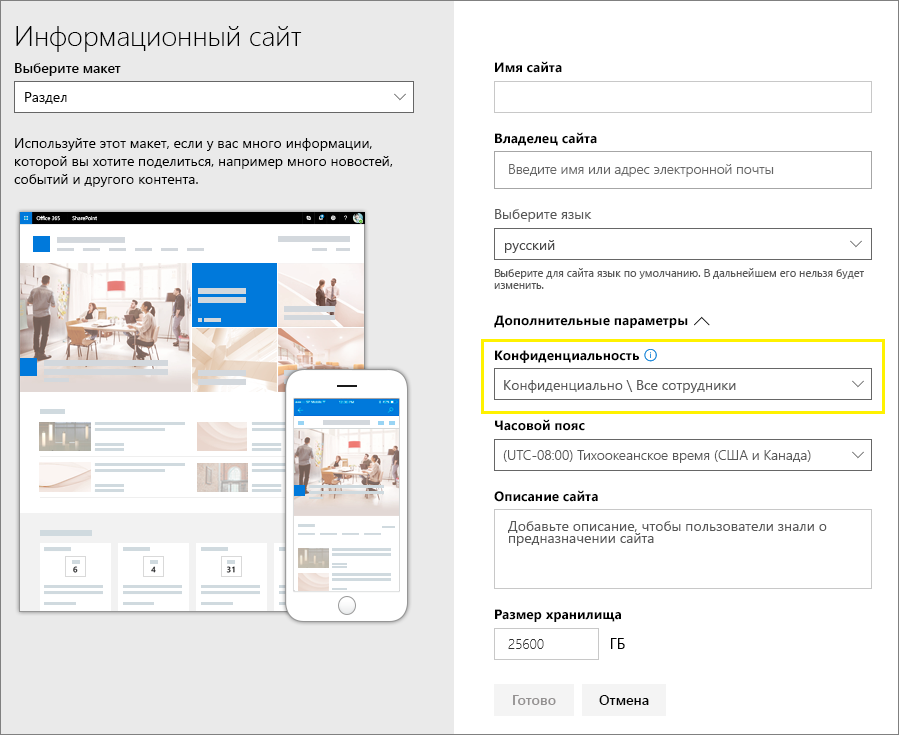

# <a name="use-sensitivity-labels-with-microsoft-teams-office-365-groups-and-sharepoint-sites-public-preview"></a><span data-ttu-id="34feb-103">Использование меток конфиденциальности в Microsoft Teams, группах Office 365 и сайтах SharePoint (общедоступная предварительная версия)</span><span class="sxs-lookup"><span data-stu-id="34feb-103">Use sensitivity labels with Microsoft Teams, Office 365 groups, and SharePoint sites (public preview)</span></span>

<span data-ttu-id="34feb-104">При создании меток конфиденциальности в [Центре соответствия требованиям Microsoft 365](https://protection.office.com/) вы можете применить их к следующим контейнерам: Microsoft Teams, группы Office 365 и сайты SharePoint.</span><span class="sxs-lookup"><span data-stu-id="34feb-104">When you create sensitivity labels in the [Microsoft 365 compliance center](https://protection.office.com/), you can now apply them to the following containers: Microsoft Teams, Office 365 groups, and SharePoint sites.</span></span> <span data-ttu-id="34feb-105">С помощью настроек меток можно управлять следующими параметрами для контейнеров:</span><span class="sxs-lookup"><span data-stu-id="34feb-105">Use label settings to control the following options for these containers:</span></span>

- <span data-ttu-id="34feb-106">Конфиденциальность сайтов групп (общедоступных или закрытых), подключенных к группам Office 365</span><span class="sxs-lookup"><span data-stu-id="34feb-106">Privacy (public or private) of Office 365 group-connected teams sites</span></span>
- <span data-ttu-id="34feb-107">Доступ внешних пользователей</span><span class="sxs-lookup"><span data-stu-id="34feb-107">External users access</span></span>
- <span data-ttu-id="34feb-108">Доступ с неуправляемых устройств</span><span class="sxs-lookup"><span data-stu-id="34feb-108">Access from unmanaged devices</span></span> 

<span data-ttu-id="34feb-109">Когда вы применяете эту метку к одному из поддерживаемых контейнеров, она автоматически применяет настроенные параметры к подключенному сайту SharePoint или сайту группы.</span><span class="sxs-lookup"><span data-stu-id="34feb-109">When you apply this label to one of the supported containers, the label automatically applies the configured options to the connected SharePoint site or team site.</span></span> 

<span data-ttu-id="34feb-110">Однако содержимое таких контейнеров не наследует метки для таких параметров, как имя метки, наглядная маркировка или шифрование.</span><span class="sxs-lookup"><span data-stu-id="34feb-110">Content in those containers however, do not inherit the labels for settings such as the label name, visual markings, or encryption.</span></span> <span data-ttu-id="34feb-111">Чтобы пометить файлы на сайтах SharePoint или сайтах групп, [включите метки конфиденциальности для файлов Office в SharePoint и OneDrive](sensitivity-labels-sharepoint-onedrive-files.md).</span><span class="sxs-lookup"><span data-stu-id="34feb-111">To label files in SharePoint sites or team sites, [enable sensitivity labels for Office files in SharePoint and OneDrive](sensitivity-labels-sharepoint-onedrive-files.md).</span></span>

## <a name="about-the-public-preview-for-microsoft-teams-office-365-groups-and-sharepoint-sites"></a><span data-ttu-id="34feb-112">Сведения об общедоступной предварительной версии для Microsoft Teams, групп Office 365 и сайтов SharePoint</span><span class="sxs-lookup"><span data-stu-id="34feb-112">About the public preview for Microsoft Teams, Office 365 groups, and SharePoint sites</span></span>

<span data-ttu-id="34feb-113">Метки конфиденциальности для Microsoft Teams, групп Office 365 и сайтов SharePoint постепенно разворачиваются в клиентах и могут быть изменены до окончательного выпуска.</span><span class="sxs-lookup"><span data-stu-id="34feb-113">Sensitivity labels for Microsoft Teams, Office 365 groups, and SharePoint sites are gradually rolling out to tenants and might change before final release.</span></span> <span data-ttu-id="34feb-114">Эта общедоступная предварительная версия не работает в сетях доставки содержимого Office 365 (CDN).</span><span class="sxs-lookup"><span data-stu-id="34feb-114">This public preview doesn't work with Office 365 Content Delivery Networks (CDNs).</span></span>

<span data-ttu-id="34feb-115">До включения этой предварительной версии и настройки новых параметров меток конфиденциальности пользователи могут просматривать и применять метки конфиденциальности в своих приложениях.</span><span class="sxs-lookup"><span data-stu-id="34feb-115">Before you enable this preview and configure sensitivity labels for the new settings, users can see and apply sensitivity labels in their apps.</span></span> <span data-ttu-id="34feb-116">Например, в Word:</span><span class="sxs-lookup"><span data-stu-id="34feb-116">For example, from Word:</span></span>


<span data-ttu-id="34feb-118">После включения и настройки этой предварительной версии пользователи смогут дополнительно просматривать и применять метки конфиденциальности к Microsoft Teams, группам Office 365 и сайтам SharePoint.</span><span class="sxs-lookup"><span data-stu-id="34feb-118">After you enable and configure this preview, users can additionally see and apply sensitivity labels to Microsoft Teams, Office 365 groups, and SharePoint sites.</span></span> <span data-ttu-id="34feb-119">Например, при создании нового сайта группы в SharePoint:</span><span class="sxs-lookup"><span data-stu-id="34feb-119">For example, when you create a new team site from SharePoint:</span></span>


## <a name="enable-this-preview-and-synchronize-labels"></a><span data-ttu-id="34feb-121">Включение этой предварительной версии и синхронизация меток</span><span class="sxs-lookup"><span data-stu-id="34feb-121">Enable this preview and synchronize labels</span></span>

1. <span data-ttu-id="34feb-122">Так как эта функция использует возможности Azure AD, следуйте инструкциям из документации Azure AD, чтобы включить предварительную версию: [Назначение меток конфиденциальности группам Office 365 в Azure Active Directory (предварительная версия)](https://docs.microsoft.com/azure/active-directory/users-groups-roles/groups-assign-sensitivity-labels).</span><span class="sxs-lookup"><span data-stu-id="34feb-122">Because this feature uses Azure AD functionality, follow the instructions in the Azure AD documentation to enable the preview: [Assign sensitivity labels to Office 365 groups in Azure Active Directory (preview)](https://docs.microsoft.com/azure/active-directory/users-groups-roles/groups-assign-sensitivity-labels).</span></span>

2. <span data-ttu-id="34feb-123">В сеансе PowerShell подключитесь к Центру безопасности и соответствия требованиям с помощью рабочей или учебной учетной записи с правами глобального администратора.</span><span class="sxs-lookup"><span data-stu-id="34feb-123">In a PowerShell session, connect to the Security & Compliance Center by using a work or school account that has global admin privileges.</span></span> <span data-ttu-id="34feb-124">Инструкции см. в статье [Подключение к PowerShell Центра безопасности и соответствия требованиям Office 365](/powershell/exchange/office-365-scc/connect-to-scc-powershell/connect-to-scc-powershell).</span><span class="sxs-lookup"><span data-stu-id="34feb-124">For instructions, see [Connect to Office 365 Security & Compliance Center PowerShell](/powershell/exchange/office-365-scc/connect-to-scc-powershell/connect-to-scc-powershell).</span></span>

3. <span data-ttu-id="34feb-125">Выполните следующие команды для синхронизации ваших меток с Azure AD, чтобы их можно было использовать с группами Office 365:</span><span class="sxs-lookup"><span data-stu-id="34feb-125">Run the following commands to synchronize your labels to Azure AD, so that they can be used with Office 365 groups:</span></span>
    
    ```powershell
    Set-ExecutionPolicy RemoteSigned
    $UserCredential = Get-Credential
    $Session = New-PSSession -ConfigurationName Microsoft.Exchange -ConnectionUri https://ps.compliance.protection.outlook.com/powershell-liveid/ -Credential $UserCredential -Authentication Basic -AllowRedirection
    Import-PSSession $Session -DisableNameChecking
    Execute-AzureAdLabelSync
    ```

## <a name="how-to-configure-site-and-group-settings-when-you-create-or-edit-sensitivity-labels"></a><span data-ttu-id="34feb-126">Настройка параметров сайта и группы при создании или изменении меток конфиденциальности</span><span class="sxs-lookup"><span data-stu-id="34feb-126">How to configure site and group settings when you create or edit sensitivity labels</span></span>

<span data-ttu-id="34feb-127">Теперь вы можете создавать или изменять метки конфиденциальности, которые должны быть доступны для сайтов и групп.</span><span class="sxs-lookup"><span data-stu-id="34feb-127">You're now ready to create or edit sensitivity labels that you want to be available for sites and groups.</span></span> <span data-ttu-id="34feb-128">При включении предварительной версии в мастере присвоения меток конфиденциальности появится новая страница: **Параметры сайта и группы**.</span><span class="sxs-lookup"><span data-stu-id="34feb-128">Enabling the preview makes a new page visible in the sensitivity labeling wizards: **Site and group settings**</span></span>

<span data-ttu-id="34feb-129">Если вам нужна помощь по созданию или изменению метки конфиденциальности, см. инструкции в статье [Создание и настройка меток конфиденциальности](create-sensitivity-labels.md#create-and-configure-sensitivity-labels).</span><span class="sxs-lookup"><span data-stu-id="34feb-129">If you need help with creating or editing a sensitivity label, see the instructions from [Create and configure sensitivity labels](create-sensitivity-labels.md#create-and-configure-sensitivity-labels).</span></span>

<span data-ttu-id="34feb-130">На этой новой странице **Параметры сайта и группы** настройте параметры:</span><span class="sxs-lookup"><span data-stu-id="34feb-130">On this new **Site and group settings** page, configure the settings:</span></span>

- <span data-ttu-id="34feb-131">**Конфиденциальность сайтов групп, подключенных к группам Office 365**. Автоматически выбирается стандартное значение **Общедоступный**. Это означает, что любой пользователь из организации может получить доступ к сайту группы, к которому применена эта метка.</span><span class="sxs-lookup"><span data-stu-id="34feb-131">**Privacy of Office 365 group-connected teams sites**: The default setting of **Public** is automatically selected, which means anyone in your organization can access the team site where this label is applied.</span></span> <span data-ttu-id="34feb-132">Выберите параметр **Закрытый**, если вы хотите, чтобы только утвержденные участники вашей организации имели доступ к сайту группы.</span><span class="sxs-lookup"><span data-stu-id="34feb-132">Select **Private** when you want only approved members in your organization to access the group's team site.</span></span> 
    
    <span data-ttu-id="34feb-133">Выбранный параметр заменяет предыдущий параметр конфиденциальности, который мог быть настроен для группы, и блокирует значение конфиденциальности, чтобы его можно было изменить только после удаления метки конфиденциальности с сайта команды или группы.</span><span class="sxs-lookup"><span data-stu-id="34feb-133">The setting selected replaces a previous privacy setting that might be configured for the group, and locks the privacy value so it can be changed only by first removing the sensitivity label from the team site or group.</span></span> <span data-ttu-id="34feb-134">После удаления метки конфиденциальности параметр конфиденциальности из метки сохраняется, и вы можете изменить его при необходимости.</span><span class="sxs-lookup"><span data-stu-id="34feb-134">After you remove the sensitivity label, the privacy setting from the label remains and you can now change it if necessary.</span></span>

- <span data-ttu-id="34feb-135">**Доступ внешних пользователей**. Определяет, может ли владелец группы [добавлять гостей в группу](/office365/admin/create-groups/manage-guest-access-in-groups).</span><span class="sxs-lookup"><span data-stu-id="34feb-135">**External users access**: Control whether the group owner can [add guests to the group](/office365/admin/create-groups/manage-guest-access-in-groups).</span></span>

- <span data-ttu-id="34feb-136">**Неуправляемые устройства**. Для [неуправляемых устройств](/sharepoint/control-access-from-unmanaged-devices) можно разрешить полный доступ, доступ только через Интернет или полностью заблокировать доступ.</span><span class="sxs-lookup"><span data-stu-id="34feb-136">**Unmanaged devices**: For [unmanaged devices](/sharepoint/control-access-from-unmanaged-devices), allow full access, web only access, or block access completely.</span></span> 


> [!IMPORTANT]
> <span data-ttu-id="34feb-138">Когда вы применяете метку к команде, группе или сайту, в силу вступают только эти параметры сайта и группы.</span><span class="sxs-lookup"><span data-stu-id="34feb-138">Only these site and group settings take effect when you apply a label to a team, group, or site.</span></span> <span data-ttu-id="34feb-139">Другие параметры метки, например шифрование и маркировка контента, не применяются к содержимому в команде, группе или на сайте.</span><span class="sxs-lookup"><span data-stu-id="34feb-139">Other label settings, such as encryption and content marking, aren't applied to the content within the team, group, or site.</span></span>
> 
> <span data-ttu-id="34feb-140">Аналогичным образом, если вы создаете метку и не включаете эти параметры сайта и группы, метка по-прежнему будет доступна при создании пользователями команд, групп и сайтов, но будет применяться только имя метки.</span><span class="sxs-lookup"><span data-stu-id="34feb-140">Similarly, if you create a label and don't turn on these site and group settings, the label will still be available when users create teams, groups, and sites, but only the label name will be applied.</span></span>

<span data-ttu-id="34feb-141">Если метка конфиденциальности еще не опубликована, опубликуйте ее, [добавив в политику меток конфиденциальности](create-sensitivity-labels.md#publish-sensitivity-labels-by-creating-a-label-policy).</span><span class="sxs-lookup"><span data-stu-id="34feb-141">If your sensitivity label isn't already published, now publish it by [adding it to a sensitivity label policy](create-sensitivity-labels.md#publish-sensitivity-labels-by-creating-a-label-policy).</span></span> <span data-ttu-id="34feb-142">Пользователи, которым назначена политика меток конфиденциальности, включающая эту метку, смогут выбирать ее для сайтов и групп.</span><span class="sxs-lookup"><span data-stu-id="34feb-142">The users who are assigned a sensitivity label policy that includes this label will be able to select it for sites and groups.</span></span>

## <a name="sensitivity-label-management"></a><span data-ttu-id="34feb-143">Управление метками конфиденциальности</span><span class="sxs-lookup"><span data-stu-id="34feb-143">Sensitivity label management</span></span>

> [!WARNING]
> <span data-ttu-id="34feb-144">Создание, изменение и удаление меток конфиденциальности, используемых для Microsoft Teams, групп Office 365 и сайтов SharePoint, требует тщательной координации с политиками публикации меток для пользователей.</span><span class="sxs-lookup"><span data-stu-id="34feb-144">Creating, modifying, and deleting sensitivity labels that you use for Microsoft Teams, Office 365 groups, and SharePoint sites requires careful coordination with publishing label policies to users.</span></span> 

<span data-ttu-id="34feb-145">Чтобы избежать создания ошибок для сайтов и групп, которые могут повлиять на всех пользователей, воспользуйтесь следующим руководством.</span><span class="sxs-lookup"><span data-stu-id="34feb-145">Avoid creation errors for sites and groups that can affect all users by using the following guidance.</span></span>

<span data-ttu-id="34feb-146">**Создание и публикация меток**</span><span class="sxs-lookup"><span data-stu-id="34feb-146">**Creating and publishing labels:**</span></span>

<span data-ttu-id="34feb-147">После создания и публикации метки может потребоваться до 24 часов, чтобы она стала видимой для пользователей команд, групп и сайтов.</span><span class="sxs-lookup"><span data-stu-id="34feb-147">After a sensitivity label is created and published, it can take up to 24 hours for the label to become visible for users in teams, groups, and sites.</span></span> <span data-ttu-id="34feb-148">Чтобы опубликовать метку для всех пользователей в клиенте, используйте следующие действия:</span><span class="sxs-lookup"><span data-stu-id="34feb-148">Use the following steps to publish a label for all users in the tenant:</span></span>

1. <span data-ttu-id="34feb-149">Создайте метку конфиденциальности и опубликуйте ее лишь для нескольких учетных записей пользователей в клиенте.</span><span class="sxs-lookup"><span data-stu-id="34feb-149">Create the sensitivity label and publish it for just a few user accounts in the tenant.</span></span>

2. <span data-ttu-id="34feb-150">Подождите 24 часа.</span><span class="sxs-lookup"><span data-stu-id="34feb-150">Wait for 24 hours.</span></span>

3. <span data-ttu-id="34feb-151">После 24-часового ожидания используйте одну из учетных записей пользователя, указанных в действии 1, чтобы создать команду, группу Office 365 или сайт SharePoint с меткой, созданной в действии 1.</span><span class="sxs-lookup"><span data-stu-id="34feb-151">After this 24 hours wait, use one of the user accounts you specified in step 1 to create a team, Office 365 group, or SharePoint site with the label that you created in step 1.</span></span>

4. <span data-ttu-id="34feb-152">Если в действии 3 операции создания не возникают ошибки, опубликуйте метку для всех пользователей в клиенте.</span><span class="sxs-lookup"><span data-stu-id="34feb-152">If there are no errors during the creation operation for step 3, publish the label for all users in your tenant.</span></span> <span data-ttu-id="34feb-153">При возникновении ошибок обратитесь в [службу поддержки Майкрософт](https://docs.microsoft.com/office365/admin/contact-support-for-business-products).</span><span class="sxs-lookup"><span data-stu-id="34feb-153">If there are errors, contact [Microsoft Support](https://docs.microsoft.com/office365/admin/contact-support-for-business-products).</span></span>

<span data-ttu-id="34feb-154">**Изменение и удаление опубликованных меток**</span><span class="sxs-lookup"><span data-stu-id="34feb-154">**Modifying and deleting published labels:**</span></span>

<span data-ttu-id="34feb-155">Если вы изменяете или удаляете метку конфиденциальности, относящуюся к одной или нескольким политикам меток, эти действия могут привести к сбоям при создании любых команд, групп и сайтов.</span><span class="sxs-lookup"><span data-stu-id="34feb-155">If you modify or delete a sensitivity label that is included in one or more label policies, these actions can result in creation failures for all teams, groups, and sites.</span></span> <span data-ttu-id="34feb-156">Чтобы избежать этой ситуации, используйте следующее руководство:</span><span class="sxs-lookup"><span data-stu-id="34feb-156">To avoid this situation, use the following guidance:</span></span>

1. <span data-ttu-id="34feb-157">Удалите метку конфиденциальности из всех политик меток, содержащих ее.</span><span class="sxs-lookup"><span data-stu-id="34feb-157">Remove the sensitivity label from all label policies that include the label.</span></span>

2. <span data-ttu-id="34feb-158">Подождите 48 часов.</span><span class="sxs-lookup"><span data-stu-id="34feb-158">Wait for 48 hours.</span></span>

3. <span data-ttu-id="34feb-159">После 48-часового ожидания попробуйте создать команду, группу или сайт и убедитесь, что метка больше не отображается.</span><span class="sxs-lookup"><span data-stu-id="34feb-159">After the 48 hours wait, try creating a team, group, or site and confirm that the label is no longer visible.</span></span>

4. <span data-ttu-id="34feb-160">Если метка конфиденциальности не отображается, вы можете безопасно изменить или удалить ее.</span><span class="sxs-lookup"><span data-stu-id="34feb-160">If the sensitivity label isn't visible, you can now safely modify or delete the label.</span></span> <span data-ttu-id="34feb-161">Если метка по-прежнему отображается, обратитесь в [службу поддержки Майкрософт](https://docs.microsoft.com/office365/admin/contact-support-for-business-products).</span><span class="sxs-lookup"><span data-stu-id="34feb-161">If the label is still visible, contact [Microsoft Support](https://docs.microsoft.com/office365/admin/contact-support-for-business-products).</span></span>

## <a name="assign-sensitivity-labels-to-office-365-groups"></a><span data-ttu-id="34feb-162">Назначение меток конфиденциальности группам Office 365</span><span class="sxs-lookup"><span data-stu-id="34feb-162">Assign sensitivity labels to Office 365 groups</span></span>

<span data-ttu-id="34feb-163">Теперь вы можете применить метку или метки конфиденциальности к группам Office 365.</span><span class="sxs-lookup"><span data-stu-id="34feb-163">You're now ready to apply the sensitivity label or labels to Office 365 groups.</span></span> <span data-ttu-id="34feb-164">Инструкции см. в документации Azure AD:</span><span class="sxs-lookup"><span data-stu-id="34feb-164">Return to the Azure AD documentation for instructions:</span></span>

- [<span data-ttu-id="34feb-165">Назначение метки новой группе на портале Azure</span><span class="sxs-lookup"><span data-stu-id="34feb-165">Assign a label to a new group in Azure portal</span></span>](https://docs.microsoft.com/azure/active-directory/users-groups-roles/groups-assign-sensitivity-labels#assign-a-label-to-a-new-group-in-azure-portal)

-  [<span data-ttu-id="34feb-166">Назначение метки существующей группе на портале Azure</span><span class="sxs-lookup"><span data-stu-id="34feb-166">Assign a label to an existing group in Azure portal</span></span>](https://docs.microsoft.com/azure/active-directory/users-groups-roles/groups-assign-sensitivity-labels#assign-a-label-to-an-existing-group-in-azure-portal)

-  <span data-ttu-id="34feb-167">[Удаление метки из существующей группы на портале Azure](https://docs.microsoft.com/azure/active-directory/users-groups-roles/groups-assign-sensitivity-labels#remove-a-label-from-an-existing-group-in-azure-portal)</span><span class="sxs-lookup"><span data-stu-id="34feb-167">[Remove a label from an existing group in Azure portal](https://docs.microsoft.com/azure/active-directory/users-groups-roles/groups-assign-sensitivity-labels#remove-a-label-from-an-existing-group-in-azure-portal).</span></span>

## <a name="apply-a-sensitivity-label-to-a-new-team"></a><span data-ttu-id="34feb-168">Применение метки конфиденциальности к новой команде</span><span class="sxs-lookup"><span data-stu-id="34feb-168">Apply a sensitivity label to a new team</span></span>

<span data-ttu-id="34feb-169">Пользователи могут выбирать метки конфиденциальности при создании новых команд в Microsoft Teams.</span><span class="sxs-lookup"><span data-stu-id="34feb-169">Users can select sensitivity labels when they create new teams in Microsoft Teams.</span></span> <span data-ttu-id="34feb-170">При выборе метки конфиденциальности параметры конфиденциальности изменяются по мере необходимости.</span><span class="sxs-lookup"><span data-stu-id="34feb-170">When they select the sensitivity level, the privacy setting changes as necessary.</span></span> <span data-ttu-id="34feb-171">В зависимости от параметра доступа внешних пользователей, выбранного для метки, пользователи могут или не могут добавлять в команду людей из-за пределов организации.</span><span class="sxs-lookup"><span data-stu-id="34feb-171">Depending on the external users access setting you selected for the label, users can or can't add people outside the organization to the team.</span></span>

[<span data-ttu-id="34feb-172">Дополнительные сведения о метках конфиденциальности для Teams</span><span class="sxs-lookup"><span data-stu-id="34feb-172">Learn more about sensitivity labels for Teams</span></span>](https://docs.microsoft.com/microsoftteams/sensitivity-labels)


<span data-ttu-id="34feb-174">После создания команды метка конфиденциальности отображается в правом верхнем углу всех каналов.</span><span class="sxs-lookup"><span data-stu-id="34feb-174">After you create the team, the sensitivity label appears in the upper-right corner of all channels.</span></span>


<span data-ttu-id="34feb-176">Служба автоматически применяет такую же метку конфиденциальности к группе Office 365 и подключенному сайту группы SharePoint.</span><span class="sxs-lookup"><span data-stu-id="34feb-176">The service automatically applies the same sensitivity label to the Office 365 group and the connected SharePoint team site.</span></span>

## <a name="apply-a-sensitivity-label-to-a-new-group-in-outlook-on-the-web"></a><span data-ttu-id="34feb-177">Применение метки конфиденциальности к новой группе в Outlook в Интернете</span><span class="sxs-lookup"><span data-stu-id="34feb-177">Apply a sensitivity label to a new group in Outlook on the web</span></span>

<span data-ttu-id="34feb-178">В Outlook в Интернете при создании группы можно выбрать или изменить параметр **Конфиденциальность** для опубликованных меток:</span><span class="sxs-lookup"><span data-stu-id="34feb-178">In Outlook on the web, when you create a new group, you can select or change the **Sensitivity** option for published labels:</span></span>


## <a name="apply-a-sensitivity-label-to-a-new-site"></a><span data-ttu-id="34feb-180">Применение метки конфиденциальности к новому сайту</span><span class="sxs-lookup"><span data-stu-id="34feb-180">Apply a sensitivity label to a new site</span></span>

<span data-ttu-id="34feb-181">Администраторы и конечные пользователи могут выбирать метки конфиденциальности при [создании современных сайтов групп и информационных сайтов](/sharepoint/create-site-collection).</span><span class="sxs-lookup"><span data-stu-id="34feb-181">Admins and end users can select sensitivity labels when they [create modern team sites and communication sites](/sharepoint/create-site-collection).</span></span>

<span data-ttu-id="34feb-182">Когда пользователи создают современный сайт группы или информационный сайт, метка конфиденциальности уже выбрана по умолчанию.</span><span class="sxs-lookup"><span data-stu-id="34feb-182">When users create modern team and communication sites, a sensitivity label is already selected by default.</span></span> <span data-ttu-id="34feb-183">Пользователи могут щелкнуть значок справки, чтобы узнать больше о метках.</span><span class="sxs-lookup"><span data-stu-id="34feb-183">Users can select the help icon to learn more about the labels.</span></span>



<span data-ttu-id="34feb-185">Когда пользователь переходит на сайт, он может увидеть имя метки и примененные политики.</span><span class="sxs-lookup"><span data-stu-id="34feb-185">When users browse to the site, they can see the name of the label and applied policies.</span></span>


## <a name="view-sensitivity-labels-in-the-sharepoint-admin-center"></a><span data-ttu-id="34feb-187">Просмотр меток конфиденциальности в Центре администрирования SharePoint</span><span class="sxs-lookup"><span data-stu-id="34feb-187">View sensitivity labels in the SharePoint admin center</span></span>

<span data-ttu-id="34feb-188">Чтобы просмотреть примененные метки конфиденциальности, используйте страницу **Активные сайты** в новом Центре администрирования SharePoint.</span><span class="sxs-lookup"><span data-stu-id="34feb-188">To view the applied sensitivity labels, use the **Active sites** page in the new SharePoint admin center.</span></span> <span data-ttu-id="34feb-189">Возможно, сначала потребуется добавить столбец **Конфиденциальность**:</span><span class="sxs-lookup"><span data-stu-id="34feb-189">You might need to first add the **Sensitivity** column:</span></span>


<span data-ttu-id="34feb-191">[Дополнительные сведения об управлении сайтами в новом Центре администрирования SharePoint](/sharepoint/manage-sites-in-new-admin-center).</span><span class="sxs-lookup"><span data-stu-id="34feb-191">[Learn more about managing sites in the new SharePoint admin center](/sharepoint/manage-sites-in-new-admin-center).</span></span>

## <a name="change-site-and-group-settings-for-a-label"></a><span data-ttu-id="34feb-192">Изменение параметров сайта и группы для метки</span><span class="sxs-lookup"><span data-stu-id="34feb-192">Change site and group settings for a label</span></span>

<span data-ttu-id="34feb-193">Когда осуществляется изменение параметров сайта и группы для метки, требуется выполнить следующие команды PowerShell, чтобы ваши команды, сайты и группы могли использовать новые параметры.</span><span class="sxs-lookup"><span data-stu-id="34feb-193">Whenever you make a change to site and group settings for a label, you must run the following PowerShell commands so that your teams, sites, and groups can use the new settings.</span></span> <span data-ttu-id="34feb-194">Рекомендуется не изменять параметры сайта и группы для метки после применения метки к нескольким командам, группам или сайтам.</span><span class="sxs-lookup"><span data-stu-id="34feb-194">As a best practice, don't the change site and group settings for a label after you've applied the label to several teams, groups, or sites.</span></span>

1. <span data-ttu-id="34feb-195">Выполните следующие команды, чтобы подключиться к PowerShell Центра безопасности и соответствия требованиям Office 365 и получить список меток конфиденциальности и их идентификаторы GUID.</span><span class="sxs-lookup"><span data-stu-id="34feb-195">Run the following commands to connect to Office 365 Security & Compliance Center PowerShell and get the list of sensitivity labels and their GUIDs.</span></span>
    
    ```powershell
    Set-ExecutionPolicy RemoteSigned
    $UserCredential = Get-Credential
    $Session = New-PSSession -ConfigurationName Microsoft.Exchange -ConnectionUri https://ps.compliance.protection.outlook.com/powershell-liveid -Authentication Basic -AllowRedirection -Credential $UserCredential
    Import-PSSession $Session
    Get-Label |ft Name, Guid
    ```

2. <span data-ttu-id="34feb-196">Запишите GUID для измененных меток.</span><span class="sxs-lookup"><span data-stu-id="34feb-196">Make a note of the GUID for the label or labels you have changed.</span></span>

3. <span data-ttu-id="34feb-197">Подключитесь к Exchange Online PowerShell и выполните командлет Get-UnifiedGroup, указав GUID метки вместо GUID примера "e48058ea-98e8-4940-8db0-ba1310fd955e":</span><span class="sxs-lookup"><span data-stu-id="34feb-197">Now connect to Exchange Online PowerShell and run the Get-UnifiedGroup cmdlet, specifying your label GUID in place of the example GUID of "e48058ea-98e8-4940-8db0-ba1310fd955e":</span></span> 
    
    ```powershell
    Set-ExecutionPolicy RemoteSigned
    $UserCredential = Get-Credential
    $Session = New-PSSession -ConfigurationName Microsoft.Exchange -ConnectionUri https://outlook.office365.com/powershell-liveid/ -Credential $UserCredential -Authentication Basic -AllowRedirection
    Import-PSSession $Session
    $Groups= Get-UnifiedGroup | Where {$_.SensitivityLabel  -eq "e48058ea-98e8-4940-8db0-ba1310fd955e"}
    ```

4. <span data-ttu-id="34feb-198">Для каждой группы повторно примените метку конфиденциальности, указав GUID метки вместо GUID примера "e48058ea-98e8-4940-8db0-ba1310fd955e":</span><span class="sxs-lookup"><span data-stu-id="34feb-198">For each group, reapply the sensitivity label, specifying your label GUID in place of the example GUID of "e48058ea-98e8-4940-8db0-ba1310fd955e":</span></span>
    
    ```powershell
    foreach ($g in $groups)
    {Set-UnifiedGroup -Identity $g.Identity -SensitivityLabelId "e48058ea-98e8-4940-8db0-ba1310fd955e"}
    ```

## <a name="support-for-the-sensitivity-labels"></a><span data-ttu-id="34feb-199">Поддержка меток конфиденциальности</span><span class="sxs-lookup"><span data-stu-id="34feb-199">Support for the sensitivity labels</span></span>

<span data-ttu-id="34feb-200">Вы можете использовать метки конфиденциальности, настроенные для параметров сайта и группы, в следующих приложениях и службах:</span><span class="sxs-lookup"><span data-stu-id="34feb-200">You can use the sensitivity labels that you've configured for site and group settings with the following apps and services:</span></span>

- <span data-ttu-id="34feb-201">SharePoint Online</span><span class="sxs-lookup"><span data-stu-id="34feb-201">SharePoint Online</span></span>
- <span data-ttu-id="34feb-202">Teams</span><span class="sxs-lookup"><span data-stu-id="34feb-202">Teams</span></span>
- <span data-ttu-id="34feb-203">Outlook в Интернете</span><span class="sxs-lookup"><span data-stu-id="34feb-203">Outlook on the web</span></span>
- <span data-ttu-id="34feb-204">Центр администрирования SharePoint</span><span class="sxs-lookup"><span data-stu-id="34feb-204">SharePoint admin center</span></span>
- <span data-ttu-id="34feb-205">Центр администрирования Azure AD</span><span class="sxs-lookup"><span data-stu-id="34feb-205">Azure AD admin center</span></span>

<span data-ttu-id="34feb-206">Другие приложения и службы, в которых пока нельзя использовать метки конфиденциальности, настроенные для параметров сайта и группы, включают:</span><span class="sxs-lookup"><span data-stu-id="34feb-206">Other apps and services that you can't currently use the sensitivity labels that you've configured for site and group settings include:</span></span>

- <span data-ttu-id="34feb-207">Outlook для Mac</span><span class="sxs-lookup"><span data-stu-id="34feb-207">Outlook for the Mac</span></span>
- <span data-ttu-id="34feb-208">Outlook Mobile</span><span class="sxs-lookup"><span data-stu-id="34feb-208">Outlook mobile</span></span>
- <span data-ttu-id="34feb-209">Классическая версия Outlook для Windows</span><span class="sxs-lookup"><span data-stu-id="34feb-209">Outlook desktop for Windows</span></span>
- <span data-ttu-id="34feb-210">Forms</span><span class="sxs-lookup"><span data-stu-id="34feb-210">Forms</span></span>
- <span data-ttu-id="34feb-211">Dynamics 365</span><span class="sxs-lookup"><span data-stu-id="34feb-211">Dynamics 365</span></span>
- <span data-ttu-id="34feb-212">Yammer</span><span class="sxs-lookup"><span data-stu-id="34feb-212">Yammer</span></span>
- <span data-ttu-id="34feb-213">Stream</span><span class="sxs-lookup"><span data-stu-id="34feb-213">Stream</span></span>
- <span data-ttu-id="34feb-214">Планировщик</span><span class="sxs-lookup"><span data-stu-id="34feb-214">Planner</span></span>
- <span data-ttu-id="34feb-215">Project</span><span class="sxs-lookup"><span data-stu-id="34feb-215">Project</span></span>
- <span data-ttu-id="34feb-216">PowerBI</span><span class="sxs-lookup"><span data-stu-id="34feb-216">PowerBI</span></span>
- <span data-ttu-id="34feb-217">Центр администрирования Teams</span><span class="sxs-lookup"><span data-stu-id="34feb-217">Teams admin center</span></span>
- <span data-ttu-id="34feb-218">Центр администрирования Microsoft 365</span><span class="sxs-lookup"><span data-stu-id="34feb-218">Microsoft 365 admin center</span></span>
- <span data-ttu-id="34feb-219">Центр администрирования Exchange</span><span class="sxs-lookup"><span data-stu-id="34feb-219">Exchange admin center</span></span>


## <a name="classic-azure-ad-site-classification"></a><span data-ttu-id="34feb-220">Классическая классификация сайтов Azure AD</span><span class="sxs-lookup"><span data-stu-id="34feb-220">Classic Azure AD site classification</span></span>

<span data-ttu-id="34feb-221">Если вы включите эту предварительную версию, Office 365 больше не будет поддерживать старые классификации для новых групп и сайтов SharePoint.</span><span class="sxs-lookup"><span data-stu-id="34feb-221">Office 365 no longer supports the old classifications for new groups and SharePoint sites when you enable this preview.</span></span> <span data-ttu-id="34feb-222">Однако существующие группы и сайты по-прежнему будут отображать старые классификации, если их не преобразовать для использования меток конфиденциальности.</span><span class="sxs-lookup"><span data-stu-id="34feb-222">However, existing groups and sites still display the old classifications unless you convert them to use sensitivity labels.</span></span> <span data-ttu-id="34feb-223">Старые классификации включают классификацию "современных" сайтов, которую вы настроили, с помощью Azure AD PowerShell или основной библиотеки PnP, определяющей значения параметра `ClassificationList`.</span><span class="sxs-lookup"><span data-stu-id="34feb-223">Old classifications include the "modern" sites classification you set up, possibly through Azure AD PowerShell or the PnP Core library, that defined values for the `ClassificationList` setting.</span></span>

<span data-ttu-id="34feb-224">Например, в PowerShell:</span><span class="sxs-lookup"><span data-stu-id="34feb-224">For example, in PowerShell:</span></span>

```powershell
   ($setting["ClassificationList"])
```

<span data-ttu-id="34feb-225">Дополнительные сведения о старом методе классификации см. в статье [Классификация "современных" сайтов SharePoint](https://docs.microsoft.com/sharepoint/dev/solution-guidance/modern-experience-site-classification).</span><span class="sxs-lookup"><span data-stu-id="34feb-225">For more information about the old classification method, see [SharePoint "modern" sites classification](https://docs.microsoft.com/sharepoint/dev/solution-guidance/modern-experience-site-classification).</span></span>

<span data-ttu-id="34feb-226">Чтобы преобразовать старые классификации для использования меток конфиденциальности, выполните одно из следующих действий:</span><span class="sxs-lookup"><span data-stu-id="34feb-226">To convert your old classifications to sensitivity labels, do one of the following:</span></span>

- <span data-ttu-id="34feb-227">Используйте существующие метки. Укажите нужные параметры меток для сайтов и групп, изменив опубликованные метки конфиденциальности.</span><span class="sxs-lookup"><span data-stu-id="34feb-227">Use existing labels: Specify the label settings you want for sites and groups by editing existing sensitivity labels that are already published.</span></span>

- <span data-ttu-id="34feb-228">Создайте новые метки. Укажите нужные параметры меток для сайтов и групп, создав и опубликовав новые метки конфиденциальности с такими же именами, как в существующих классификациях.</span><span class="sxs-lookup"><span data-stu-id="34feb-228">Create new labels: Specify the label settings you want for sites and groups by creating and publishing new sensitivity labels that have the same names as your existing classifications.</span></span>

<span data-ttu-id="34feb-229">Затем:</span><span class="sxs-lookup"><span data-stu-id="34feb-229">Then:</span></span> 

1. <span data-ttu-id="34feb-230">Используйте PowerShell, чтобы применить метки конфиденциальности к существующим группам Office 365 и сайтам SharePoint с помощью сопоставления имен.</span><span class="sxs-lookup"><span data-stu-id="34feb-230">Use PowerShell to apply the sensitivity labels to existing Office 365 groups and SharePoint sites by using name mapping.</span></span> <span data-ttu-id="34feb-231">Соответствующие инструкции см. в следующем разделе.</span><span class="sxs-lookup"><span data-stu-id="34feb-231">See the next section for instructions.</span></span>

2. <span data-ttu-id="34feb-232">Удалите старые классификации из существующих групп и сайтов.</span><span class="sxs-lookup"><span data-stu-id="34feb-232">Remove the old classifications from the existing groups and sites.</span></span>

<span data-ttu-id="34feb-233">Хотя вы не можете запретить пользователям создавать группы в приложениях и службах, которые пока не поддерживают метки конфиденциальности, вы можете запустить повторяющийся скрипт PowerShell для поиска новых групп, созданных пользователями со старыми классификациями, и их преобразования для использования меток конфиденциальности.</span><span class="sxs-lookup"><span data-stu-id="34feb-233">Although you can't prevent users from creating new groups in apps and services that don't yet support sensitivity labels, you can run a recurring PowerShell script to look for new groups that users have created with the old classifications, and convert these to use sensitivity labels.</span></span> 

#### <a name="use-powershell-to-convert-classifications-for-office-365-groups-to-sensitivity-labels"></a><span data-ttu-id="34feb-234">Преобразование классификаций для групп Office 365 в метки конфиденциальности с помощью PowerShell</span><span class="sxs-lookup"><span data-stu-id="34feb-234">Use PowerShell to convert classifications for Office 365 groups to sensitivity labels</span></span>

1. <span data-ttu-id="34feb-235">Убедитесь, что вы используете командную консоль SharePoint Online версии 16.0.19418.12000 или более поздней.</span><span class="sxs-lookup"><span data-stu-id="34feb-235">Ensure that you're running SharePoint Online Management Shell version 16.0.19418.12000 or above.</span></span> <span data-ttu-id="34feb-236">Если вы уже используете последнюю версию, перейдите к шагу 4.</span><span class="sxs-lookup"><span data-stu-id="34feb-236">If you already have the latest version, skip to step 4.</span></span>

2. <span data-ttu-id="34feb-237">Если у вас установлена предыдущая версия командной консоли SharePoint Online из коллекции PowerShell, вы можете обновить модуль, выполнив следующий командлет.</span><span class="sxs-lookup"><span data-stu-id="34feb-237">If you have installed a previous version of the SharePoint Online Management Shell from PowerShell gallery, you can update the module by running the following cmdlet.</span></span>
    
    ```PowerShell
    Update-Module -Name Microsoft.Online.SharePoint.PowerShell
    ```

3. <span data-ttu-id="34feb-238">Если у вас установлена предыдущая версия командной консоли SharePoint Online из Центра загрузки Майкрософт, перейдите к разделу **Установка и удаление программ** и удалите командную консоль SharePoint Online.</span><span class="sxs-lookup"><span data-stu-id="34feb-238">If you have installed a previous version of the SharePoint Online Management Shell from the Microsoft Download Center, go to **Add or remove programs** and uninstall the SharePoint Online Management Shell.</span></span> <span data-ttu-id="34feb-239">Затем установите последнюю версию командной консоли SharePoint Online из [Центра загрузки](https://go.microsoft.com/fwlink/p/?LinkId=255251).</span><span class="sxs-lookup"><span data-stu-id="34feb-239">Then, install the latest SharePoint Online Management Shell from the [Download Center](https://go.microsoft.com/fwlink/p/?LinkId=255251).</span></span>

4. <span data-ttu-id="34feb-240">Используя рабочую или учебную учетную запись с правами глобального администратора или администратора SharePoint в Office 365, подключитесь к командной консоли SharePoint Online.</span><span class="sxs-lookup"><span data-stu-id="34feb-240">Using a work or school account that has global administrator or SharePoint admin privileges in Office 365, connect to SharePoint Online Management Shell.</span></span> <span data-ttu-id="34feb-241">Сведения о том, как это сделать, см. в статье [Начало работы с командной консолью SharePoint Online](/powershell/sharepoint/sharepoint-online/connect-sharepoint-online).</span><span class="sxs-lookup"><span data-stu-id="34feb-241">To learn how, see [Getting started with SharePoint Online Management Shell](/powershell/sharepoint/sharepoint-online/connect-sharepoint-online).</span></span>

5. <span data-ttu-id="34feb-242">Чтобы получить список меток конфиденциальности и их GUID, выполните следующие команды.</span><span class="sxs-lookup"><span data-stu-id="34feb-242">Run the following commands to get the list of sensitivity labels and their GUIDs.</span></span>

    ```PowerShell
    Set-ExecutionPolicy RemoteSigned
    $UserCredential = Get-Credential
    $Session = New-PSSession -ConfigurationName Microsoft.Exchange -ConnectionUri https://ps.compliance.protection.outlook.com/powershell-liveid -Authentication Basic -AllowRedirection -Credential $UserCredential
    Import-PSSession $Session
    Get-Label |ft Name, Guid  
    ```

6. <span data-ttu-id="34feb-243">Запишите GUID для меток конфиденциальности, которые нужно применить к группам Office 365.</span><span class="sxs-lookup"><span data-stu-id="34feb-243">Make a note of the GUIDs for the sensitivity labels you want to apply to your Office 365 groups.</span></span>

7. <span data-ttu-id="34feb-244">Используйте следующую команду в качестве примера, чтобы получить список групп, использующих в настоящее время классификацию General (Общее).</span><span class="sxs-lookup"><span data-stu-id="34feb-244">Use the following command as an example to get the list of groups that currently have the classification of "General":</span></span>

   ```PowerShell
   $Groups= Get-UnifiedGroup | Where {$_.classification -eq "General"}
   ```

6. <span data-ttu-id="34feb-245">Для каждой группы добавьте GUID новой метки конфиденциальности.</span><span class="sxs-lookup"><span data-stu-id="34feb-245">For each group, add the new sensitivity label GUID.</span></span> <span data-ttu-id="34feb-246">Например:</span><span class="sxs-lookup"><span data-stu-id="34feb-246">For example:</span></span>

    ```PowerShell
    foreach ($g in $groups)
    {Set-UnifiedGroup -Identity $g.Identity -SensitivityLabelId "457fa763-7c59-461c-b402-ad1ac6b703cc"}
    ```

## <a name="auditing-sensitivity-label-activities"></a><span data-ttu-id="34feb-247">Аудит действий с метками конфиденциальности</span><span class="sxs-lookup"><span data-stu-id="34feb-247">Auditing sensitivity label activities</span></span>

<span data-ttu-id="34feb-248">Если пользователь отправляет документ на сайт, защищенный с помощью метки конфиденциальности, и метка конфиденциальности документа имеет [более высокий приоритет](sensitivity-labels.md#label-priority-order-matters), чем метка конфиденциальности, примененная к сайту, это действие не блокируется.</span><span class="sxs-lookup"><span data-stu-id="34feb-248">If somebody uploads a document to a site that's protected with a sensitivity label and their document has a [higher priority](sensitivity-labels.md#label-priority-order-matters) sensitivity label than the sensitivity label applied to the site, this action isn't blocked.</span></span> <span data-ttu-id="34feb-249">Например, вы применили метку **Общее** к сайту SharePoint, а другой пользователь отправляет на этот сайт документ с меткой **Конфиденциально**.</span><span class="sxs-lookup"><span data-stu-id="34feb-249">For example, you've applied the **General** label to a SharePoint site, and somebody uploads to this site a document labeled **Confidential**.</span></span> <span data-ttu-id="34feb-250">Так как метка конфиденциальности с более высоким приоритетом определяет более конфиденциальное содержимое, чем содержимое с меткой меньшего приоритета, эта ситуация может являться проблемой безопасности.</span><span class="sxs-lookup"><span data-stu-id="34feb-250">Because a sensitivity label with a higher priority identifies content that is more sensitivity than content that has a lower priority order, this situation could be a security concern.</span></span>

<span data-ttu-id="34feb-251">Хотя действие не блокируется, оно подвергается аудиту, чтобы вы могли определить документы с таким несоответствием приоритетов меток и принять необходимые меры.</span><span class="sxs-lookup"><span data-stu-id="34feb-251">Although the action isn't blocked, it is audited, so you can identify documents that have this misalignment of label priority and take action if needed.</span></span> <span data-ttu-id="34feb-252">Например, удалить или переместить отправленный документ с сайта.</span><span class="sxs-lookup"><span data-stu-id="34feb-252">For example, delete or move the uploaded document from the site.</span></span> 

<span data-ttu-id="34feb-253">Проблема безопасности не возникает, если метка конфиденциальности документа имеет более низкий приоритет, чем метка конфиденциальности, примененная к сайту.</span><span class="sxs-lookup"><span data-stu-id="34feb-253">It wouldn't be a security concern if the document has a lower priority sensitivity label than the sensitivity label applied to the site.</span></span> <span data-ttu-id="34feb-254">Например, документ с меткой **Общее** отправляется на сайт с меткой **Конфиденциально**.</span><span class="sxs-lookup"><span data-stu-id="34feb-254">For example, a document labeled **General** is uploaded to a site labeled **Confidential**.</span></span> <span data-ttu-id="34feb-255">В этом сценарии событие аудита не создается.</span><span class="sxs-lookup"><span data-stu-id="34feb-255">In this scenario, an auditing event isn't generated.</span></span>

<span data-ttu-id="34feb-256">Чтобы найти это событие в журнале аудита, выполните поиск по запросу **Обнаружено несоответствие конфиденциальности документа** в категории **Действия с файлами и страницами**.</span><span class="sxs-lookup"><span data-stu-id="34feb-256">To search the audit log for this event, look for **Detected document sensitivity mismatch** from the **File and page activities** category.</span></span> 

<span data-ttu-id="34feb-257">Когда кто-нибудь добавляет или удаляет метку конфиденциальности на сайте или в группе, такие действия также подвергаются аудиту.</span><span class="sxs-lookup"><span data-stu-id="34feb-257">When somebody adds or removes a sensitivity label to or from a site or group, these activities are also audited.</span></span> <span data-ttu-id="34feb-258">Эти события можно найти в категории [Действия с метками конфиденциальности](search-the-audit-log-in-security-and-compliance.md#sensitivity-label-activities).</span><span class="sxs-lookup"><span data-stu-id="34feb-258">These events can be found in the [Sensitivity label activities](search-the-audit-log-in-security-and-compliance.md#sensitivity-label-activities) category.</span></span> 

<span data-ttu-id="34feb-259">Инструкции по поиску в журнале аудита см. в статье [Поиск по журналу аудита в Центре безопасности и соответствия требованиям](search-the-audit-log-in-security-and-compliance.md).</span><span class="sxs-lookup"><span data-stu-id="34feb-259">For instructions to search the audit log, see [Search the audit log in the Security & Compliance Center](search-the-audit-log-in-security-and-compliance.md).</span></span>

## <a name="troubleshoot-sensitivity-label-deployment"></a><span data-ttu-id="34feb-260">Устранение неполадок при развертывании меток конфиденциальности</span><span class="sxs-lookup"><span data-stu-id="34feb-260">Troubleshoot sensitivity label deployment</span></span>

<span data-ttu-id="34feb-261">Возникают проблемы с метками конфиденциальности для Microsoft Teams, групп Office 365 и сайтов SharePoint?</span><span class="sxs-lookup"><span data-stu-id="34feb-261">Having problems with sensitivity labels for Microsoft Teams, Office 365 groups, and SharePoint sites?</span></span> <span data-ttu-id="34feb-262">Проверьте следующее:</span><span class="sxs-lookup"><span data-stu-id="34feb-262">Check the following:</span></span>

### <a name="labels-not-visible-after-publishing"></a><span data-ttu-id="34feb-263">Метки не отображаются после публикации</span><span class="sxs-lookup"><span data-stu-id="34feb-263">Labels not visible after publishing</span></span>
<span data-ttu-id="34feb-264">Если вы столкнулись с проблемами при создании команды или группы Office 365 после включения этих параметров или изменения описания метки конфиденциальности, подождите несколько часов после сохранения изменений метки и вновь попробуйте создать команду или группу.</span><span class="sxs-lookup"><span data-stu-id="34feb-264">If you experience issues when you create a team or Office 365 group after you enable these settings or modify a sensitivity label's description, wait a few hours after saving the label changes, and then try to create the team or group again.</span></span> <span data-ttu-id="34feb-265">Сведения см. в разделе [Планирование развертывания после создания или изменения метки конфиденциальности](sensitivity-labels-sharepoint-onedrive-files.md#schedule-roll-out-after-you-create-or-change-a-sensitivity-label).</span><span class="sxs-lookup"><span data-stu-id="34feb-265">For information, see [Schedule roll-out after you create or change a sensitivity label](sensitivity-labels-sharepoint-onedrive-files.md#schedule-roll-out-after-you-create-or-change-a-sensitivity-label).</span></span>

<span data-ttu-id="34feb-266">Если вы по-прежнему не видите новую метку конфиденциальности в SharePoint Online, обратитесь в [службу поддержки Майкрософт](https://docs.microsoft.com/office365/admin/contact-support-for-business-products).</span><span class="sxs-lookup"><span data-stu-id="34feb-266">If you are still not able to see the new sensitivity label from SharePoint Online, contact [Microsoft Support](https://docs.microsoft.com/office365/admin/contact-support-for-business-products).</span></span>

### <a name="team-group-or-sharepoint-site-creation-errors"></a><span data-ttu-id="34feb-267">Ошибки при создании команды, группы или сайта SharePoint</span><span class="sxs-lookup"><span data-stu-id="34feb-267">Team, group, or SharePoint site creation errors</span></span>
<span data-ttu-id="34feb-268">Если у вас возникают ошибки создания при использовании предварительной версии, у вас есть два варианта:</span><span class="sxs-lookup"><span data-stu-id="34feb-268">If you experience creation errors during the public preview, you have two options:</span></span>

- <span data-ttu-id="34feb-269">Убедитесь, что метки конфиденциальности не являются обязательными для каждого пользователя.</span><span class="sxs-lookup"><span data-stu-id="34feb-269">Ensure that sensitivity labels are not mandatory for any user.</span></span>

- <span data-ttu-id="34feb-270">Вы можете отключить метки конфиденциальности для Microsoft Teams, групп Office 365 и сайтов SharePoint, выполнив те же инструкции из раздела [Включение поддержки меток конфиденциальности в PowerShell](https://docs.microsoft.com/azure/active-directory/users-groups-roles/groups-assign-sensitivity-labels#enable-sensitivity-label-support-in-powershell).</span><span class="sxs-lookup"><span data-stu-id="34feb-270">You can turn off sensitivity labels for Microsoft Teams, Office 365 groups, and SharePoint sites by using the same instructions from [Enable sensitivity label support in PowerShell](https://docs.microsoft.com/azure/active-directory/users-groups-roles/groups-assign-sensitivity-labels#enable-sensitivity-label-support-in-powershell).</span></span> <span data-ttu-id="34feb-271">Но чтобы отключить предварительную версию на шаге 5, отключите функцию с помощью `$setting["EnableMIPLabels"] = "False"`.</span><span class="sxs-lookup"><span data-stu-id="34feb-271">However, to disable the preview, in step 5, disable the feature by using `$setting["EnableMIPLabels"] = "False"`.</span></span>

