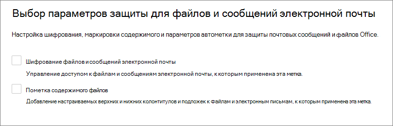

# Сведения о метках конфиденциальности

>*[Руководство по лицензированию Microsoft 365 для обеспечения безопасности и соответствия требованиям](/office365/servicedescriptions/microsoft-365-service-descriptions/microsoft-365-tenantlevel-services-licensing-guidance/microsoft-365-security-compliance-licensing-guidance).*

> [!NOTE]
> Если вы ищете информацию о меток конфиденциальности, которые видны в приложениях Office, обратитесь к статье [Применение меток конфиденциальности к файлам и электронной почте в Office](https://support.microsoft.com/topic/apply-sensitivity-labels-to-your-files-and-email-in-office-2f96e7cd-d5a4-403b-8bd7-4cc636bae0f9).
>
> Сведения на этой странице предназначены для ИТ-администраторов, которые могут создавать и настраивать эти метки.

Для выполнения задач пользователи совместно работают с другими людьми внутри и вне организации. Это означает, что контент покидает границы брандмауэра — он может перемещаться куда угодно на устройствах, в приложениях и службах. Необходимо, что его перемещение было безопасным и защищенным в согласии с бизнес-политикой и политикой соответствия требованиям вашей организации.

Метки конфиденциальности из решения Microsoft Information Protection позволяют классифицировать и защищать данные вашей организации, при этом следя за тем, чтобы не пострадали производительность пользователей и их способность к взаимодействию.

Пример меток конфиденциальности, доступных в Excel на вкладке **Главная** ленты. В этом примере примененная метка отображается в строке состояния.

Чтобы применить метки конфиденциальности, пользователи должны войти с помощью своей рабочей или учебной учетной записи Microsoft 365.

> [!NOTE]
> Метки конфиденциальности теперь поддерживаются в клиентах государственных организаций США:
> - Для сред GCC и GCC High: заметки о выпуске [Office для Windows](/officeupdates/current-channel#version-2101-january-26) и [Office для Mac](/officeupdates/release-notes-office-for-mac#feature-updates-2)
> - Для сред Министерства обороны США: заметки о выпуске [Office для Windows](/officeupdates/current-channel#version-2103-march-30)
>
> Если вы используете клиент и сканер унифицированных меток Azure Information Protection для этих сред, см. статью [Описание службы Azure Information Protection ценовой категории "Премиум" для государственных организаций](/enterprise-mobility-security/solutions/ems-aip-premium-govt-service-description).

Вы можете использовать метки конфиденциальности для указанных ниже целей.
  
- **Предоставление параметров защиты, включающих шифрование и применение меток к содержимому.** Например, при применении метки "Конфиденциально" к документу или сообщению электронной почты производится шифрование содержимого и добавляется водяной знак "Конфиденциально". Применение метки включает как водяной знак, так и верхний и нижний колонтитулы, а шифрование может ограничивать действия, которые могут производить с содержимым авторизованные пользователи.

- **Защита контента в приложениях Office на различных платформах и устройствах.** Поддерживается в Word, Excel, PowerPoint и Outlook из числа классических приложений Office и приложений Office для Интернета. Поддерживается в Windows, macOS, iOS и Android.

- **Защитить контент в сторонних приложениях и службах** с помощью Microsoft Cloud App Security. С помощью Cloud App Security можно определять, классифицировать, помечать и защищать контент в сторонних приложениях и службах, таких как SalesForce, Box или DropBox, даже в том случае, если стороннее приложение или служба не считывает или не поддерживает метки конфиденциальности.

- **Защита контейнеров**, включающих Teams, Группы Microsoft 365 и сайты SharePoint. Например, можно настроить параметры конфиденциальности, доступ внешних пользователей и внешний общий доступ, а также доступ с неуправляемых устройств.

- **Расширение сферы действия меток конфиденциальности на Power BI**: при включении этой возможности можно применять и просматривать метки в Power BI, а также защищать данные при их сохранении вне этой службы.

- **Расширить применение меток конфиденциальности на ресурсы в Azure Purview**. Если вы включите эту возможность (сейчас доступную в предварительной версии), вы сможете применять метки конфиденциальности к таким ресурсам, как столбцы SQL, файлы в хранилище BLOB-объектов Azure и т. д. 

- **Расширить применение меток конфиденциальности для сторонних приложений и служб**. С помощью пакета SDK Microsoft Information Protection сторонние приложения могут считывать метки конфиденциальности и применять параметры защиты.

- **Классификация контента без использования параметров защиты.** Можно также применить метку просто по результатам классификации содержимого. Это предоставляет пользователям визуальное отображение классификации названий меток в организации, а также возможность применения меток для создания отчетов об использовании и просмотра данных о действиях с конфиденциальным содержимым. На основе этих сведений вы всегда сможете впоследствии применить необходимые параметры защиты.

Во всех этих случаях метки конфиденциальности Microsoft 365 помогут вам правильно обращаться с каждым типом содержимого. С помощью меток конфиденциальности можно классифицировать данные в масштабах организации и на основе этой классификации применять параметры защиты.

Дополнительные сведения об этих и других сценариях, поддерживаемых метками конфиденциальности, см. в статье [Распространенные сценарии для меток конфиденциальности](get-started-with-sensitivity-labels.md#common-scenarios-for-sensitivity-labels). Постоянно разрабатываются новые возможности, поддерживаемые метками конфиденциальности, поэтому целесообразно просматривать [Дорожную карту Microsoft 365](https://aka.ms/MIPC/Roadmap).

## Что такое метка конфиденциальности

Метка конфиденциальности, назначенная содержимому, похожа на поставленную печать со следующими свойствами.

- **Возможность настройки.** Для конфиденциального содержимого различных уровней в организации можно создавать категории, предназначенные для удовлетворения конкретных потребностей организации и ее бизнеса. Например, "Личное", "Общедоступное", "Общее", "Конфиденциальное" и "Строго конфиденциальное".

- **Обычный текст.** Так как метка сохранена в метаданных файлов и сообщений электронной почты в виде обычного текста, сторонние приложения и службы могут считывать ее и при необходимости применять собственные защитные действия.

- **Постоянство.** Так как метка сохранена в метаданных файлов и сообщений электронной почты, она доступна вместе с содержимым, куда бы оно ни записывалось и где бы ни хранилось. Уникальная идентичность метки становится основой применения и обеспечения выполнения настроенных политик.

Для пользователей метка конфиденциальности в используемых приложениях выглядит как тег и может быть легко интегрирована в их рабочий процесс.

К каждому элементу, поддерживающему метки конфиденциальности, можно применить одну такую метку. К документам и сообщениям электронной почты можно применить как метку конфиденциальности, так и [метку хранения](retention.md#retention-labels).

> [!div class="mx-imgBorder"]
> 

## Возможности меток конфиденциальности

После присвоения метки конфиденциальности сообщению электронной почты или документу, к контенту применяются параметры защиты для этой метки. Метки конфиденциальности можно настроить для выполнения следующих действий:

- **Шифрование** сообщений электронной почты для предотвращения доступа к данным со стороны неавторизованных пользователей. Дополнительно можно выбрать, какие пользователи или группы обладают разрешением на выполнение определенных действий и на какой срок. Например, можно позволить всем пользователям в вашей организации изменять документ, а некоторой группе в другой организации — только просматривать его. Кроме того, вместо разрешений, определяемых администратором, вы можете позволить пользователям назначать разрешения контенту, когда они применяют метку. 
    
    Дополнительные сведения о параметрах **шифрования** при создании или изменении метки конфиденциальности см. в статье [Ограничение доступа к содержимому с помощью шифрования в метках конфиденциальности](encryption-sensitivity-labels.md).

- **Помечать контент** при использовании приложений Office, добавляя подложки, верхние или нижние колонтитулы в электронные сообщения или документы с примененными метками. Подложки можно использовать для документов, но не для сообщений электронной почты. Пример заголовка и подложки:
    
    
    
    Необходимо проверять, когда применяются маркировки содержимого? См. [Когда приложения Office применяют маркировку содержимого и шифрование](sensitivity-labels-office-apps.md#when-office-apps-apply-content-marking-and-encryption).
    
    Некоторые, но не все приложения поддерживают динамическую маркировку с помощью переменных. Например, вставьте имя метки или документа в верхний колонтитул, нижний колонтитул или на водяной знак. Дополнительные сведения см. в статье [Динамическая маркировка с помощью переменных](sensitivity-labels-office-apps.md#dynamic-markings-with-variables).
    
    Длина строк: Длина водяных знаков не должна превышать 255 символов. Колонтитулы ограничиваются 1024 знаками за исключением приложения Excel. В Excel общее ограничение для колонтитулов составляет 255 знаков, но оно включает невидимые знаки, например коды форматирования. При достижении этого ограничения введенная строка не отображается в Excel.

- **Защищайте содержимое в контейнерах, таких как сайты и группы**, включив [использование меток конфиденциальности с Microsoft Teams, группами Microsoft 365 и сайтами SharePoint](sensitivity-labels-teams-groups-sites.md).
    
    Если не включить эту функцию, настройки параметров защиты для групп и сайтов будут недоступны. Такая конфигурация меток не приводит к автоматической маркировке документов или сообщений электронной почты, а защищает содержимое, управляя доступом к контейнеру, в котором оно хранится. Эти параметры включают параметры конфиденциальности, доступ внешних пользователей и внешний общий доступ, а также доступ с неуправляемых устройств.

- **Применять метку автоматически в файлах и электронных сообщениях или рекомендовать метку.** Выберите способ определения конфиденциальной информации вы хотите пометить, и метка может быть применена автоматически, или вы можете предложить пользователям применить метку, которую вы рекомендуете. Если вы порекомендуете метку, в подсказке отобразится любой текст, который вы выберете. Например,
    
    
    
    Дополнительные сведения о параметрах **автоматического применения меток в файлах и электронных сообщениях** при создании или изменении метки конфиденциальности см. в статье [Автоматическое применение метки конфиденциальности к содержимому](apply-sensitivity-label-automatically.md) для приложений Office, и в статье [Автоматическое применение меток к данным в Azure Purview](/azure/purview/create-sensitivity-label).

### Области меток

При создании метки конфиденциальности вам будет предложено настроить область метки, чтобы определить две вещи:
- Параметры меток, которые можно будет настроить для этой метки
- Место, где метка будет отображаться

Эта конфигурация области позволяет создавать метки конфиденциальности, которые предназначены только для документов и сообщений электронной почты и которые не могут быть выбраны для контейнеров. И точно также — метки конфиденциальности, которые предназначены только для контейнеров и которые не могут быть выбраны для документов и сообщений электронной почты. Новая возможность (сейчас доступная в предварительной версии) — теперь вы можете также выбрать область для ресурсов Azure Purview:

По умолчанию область **Файлы и сообщения электронной почты** всегда выбрана. Другие области выбираются по умолчанию, если включены соответствующие компоненты для вашего клиента:

- **Группы и сайты**: [Включение меток конфиденциальности для контейнеров и синхронизация меток](sensitivity-labels-teams-groups-sites.md#how-to-enable-sensitivity-labels-for-containers-and-synchronize-labels)

- **Ресурсы Azure Purview (предварительная версия)**: [Автоматическое применение меток к содержимому в Azure Purview](/azure/purview/create-sensitivity-label)

Если вы измените параметры по умолчанию, чтобы были выбраны не все области, вы увидите первую страницу параметров конфигурации для областей, которые вы не выбрали, но их нельзя будет настроить. Например, если область для файлов и сообщений электронной почты не выбрана, параметры на следующей странице будут недоступны:

Для страниц с недоступными параметрами, нажмите **Далее**, чтобы продолжать. Или нажмите **Назад**, чтобы изменить область метки.

### Приоритет метки (важен порядок)

При создании меток конфиденциальности в Центре администрирования они отображаются в списке на вкладке **Конфиденциальность** страницы **Метки**. В этом списке важен порядок меток, поскольку он отражает их приоритет. Необходимо, чтобы самые строгие метки конфиденциальности (например, "Строго конфиденциально") отображались в **нижней части** списка, а наименее ограничивающие метки конфиденциальности (например, "Общедоступно") — в **верхней**.

К элементу, такому как документ, сообщение электронной почты или контейнер, можно применить только одну метку конфиденциальности. Если вы настраиваете параметр, требующий от пользователей предоставить обоснование для изменения метки на более низкий уровень классификации, порядок этого списка определяет более низкие классификации. Однако этот параметр неприменим к подчиненным меткам.

При этом порядок подчиненных меток используется при [автоматическом присвоении меток](apply-sensitivity-label-automatically.md). Если вы настраиваете метки для автоматического применения или в качестве рекомендации, несколько совпадений могут соответствовать нескольким меткам. Чтобы определить рекомендуемую или применяемую метку, используется порядок меток: выбирается последняя метка конфиденциальности, а затем последняя подчиненная метка, если применимо.

### Подчиненные метки (метки группирования)

С помощью подчиненных меток можно группировать одну или несколько меток под родительской меткой, которая видна пользователю в приложении Office. Например, в разделе "Конфиденциально" ваша организация может использовать несколько разных меток для определенных типов этой классификации. В этом примере родительская метка "Конфиденциально" — это простая текстовая подпись без параметров защиты. Она имеет подчиненные метки, поэтому ее нельзя применять к содержимому. Вместо этого пользователям необходимо выбрать раздел "Конфиденциально", чтобы просмотреть подчиненные метки, после чего они смогут выбрать подчиненную метку для применения к содержимому.

Подчиненные метки — это простой способ представления меток пользователю в логических группах. Подчиненные метки не наследуют параметры родительской метки. Когда вы публикуете подчиненную метку для пользователя, он может применить эту подчиненную метку к контенту, но не может применить только родительскую метку.

Не выбирайте родительскую метку в качестве метки по умолчанию и не настраивайте ее для автоматического применения (или в качестве рекомендуемой). В противном случае родительская метка не будет применяться к содержимому.

Пример отображения подчиненных меток для пользователей:

### Изменение и удаление метки конфиденциальности

Если вы удаляете метку конфиденциальности в Центре администрирования, метка не удаляется автоматически из контента, и к нему по-прежнему применяются параметры защиты, присвоенные меткой.

Если вы изменяете метку конфиденциальности, к контенту применяется та версия метки, которая была ему присвоена.

## Возможности политик меток

После создания меток конфиденциальности вам нужно опубликовать их, чтобы сделать их доступными для пользователей и служб в организации. Метки конфиденциальности можно применять к документам Office и сообщениям электронной почты, а также другим элементам, поддерживающим метки конфиденциальности. 

В отличие от меток хранения, которые публикуются для расположений, таких как все почтовые ящики Exchange, метки конфиденциальности публикуются для пользователей или групп. Приложения, поддерживающие метки конфиденциальности, смогут отображать их для этих пользователей и групп в виде примененных меток или меток, которые можно применить.

При настройке метки конфиденциальности есть следующие возможности.

- **Выбирать, какие пользователи и группы видят метки.** Метки можно публиковать для определенного пользователя или группы безопасности с поддержкой почты, группы рассылки или группы Microsoft 365 (которые могут использовать [динамическое членство](/azure/active-directory/users-groups-roles/groups-create-rule)) в Azure AD.

- **Укажите метку по умолчанию** для новых документов, сообщений электронной почты без меток и новых контейнеров (если вы [включили метки конфиденциальности для Microsoft Teams, групп Microsoft 365 и сайтов SharePoint](sensitivity-labels-teams-groups-sites.md)). Вы можете указать одинаковые метки для всех трех типов элементов или разные метки. Если вы указали метку по умолчанию для документов, клиент унифицированных меток Azure Information Protection также применяет эту метку к существующим документам без меток. Пользователи всегда могут изменить метку по умолчанию, если она не подходит для их документа или электронной почты.
    
    Рекомендуется применять стандартную метку, чтобы установить базовый уровень параметров защиты, которые нужно применять ко всему содержимому. Но без обучения пользователей и других элементов управления этот параметр также может приводить к неправильному применению метки. Обычно в качестве стандартной метки для документов не рекомендуется выбирать метку, применяющую шифрование. Например, многим организациям требуется отправлять документы и делиться ими с внешними пользователям, у которых могут отсутствовать приложения, поддерживающие шифрование, или учетная запись с возможностью авторизации. Дополнительные сведения об этом сценарии см. в разделе [Совместное использование зашифрованных документов с внешними пользователями](sensitivity-labels-office-apps.md#sharing-encrypted-documents-with-external-users).

- **Требовать обоснования для изменения метки.** Если пользователь пытается удалить метку или заменить ее меткой низшего порядка, вы можете требовать, чтобы пользователь предоставил обоснование для выполнения этого действия. Например, пользователь открывает документ с пометкой «Конфиденциально» (номер заказа 3) и заменяет этот ярлык на документ с именем «Публичный» (номер заказа 1). Для приложений Office запрос на обоснование запускается один раз в сеансе приложения при использовании встроенных меток и для каждого файла при использовании клиента унифицированных меток Azure Information Protection. Администраторы могут ознакомиться с обоснованием и изменением метки в [обозревателе действий](data-classification-activity-explorer.md).

    

- **Требовать, чтобы пользователи присваивали метки** документам и сообщениям электронной почты, только документам и контейнерам. Также называемые обязательным применением меток, эти параметры обеспечивают обязательное применение меток, перед тем как пользователи смогут сохранять документы и отправлять письма, а также создавать новые группы или сайты.
    
    Для документов и сообщений электронной почты метка может присваиваться вручную пользователем, автоматически в результате применения настроенного условия или назначаться по умолчанию (вариант применения метки по умолчанию описан выше). Пример запроса, отображаемого в Outlook, когда пользователь должен назначить метку:

    
    
    Дополнительные сведения об обязательном применении меток см. в разделе [Требование применения пользователями метки к их электронной почте и документам](sensitivity-labels-office-apps.md#require-users-to-apply-a-label-to-their-email-and-documents).
    
    Назначать метку контейнерам необходимо при создании группы или сайта.
    
    Рекомендуется использовать этот параметр, чтобы расширить применение меток. Но без обучения пользователей эти параметры могут приводить к неправильному применению метки. Кроме того, если не настроена соответствующая метка по умолчанию, обязательное применение меток может раздражать пользователей частыми запросами.

- **Предоставить справочную ссылку на специальную страницу справки.** Если пользователи не уверены, что означают метки конфиденциальности или как их следует применять, вы можете предоставить URL-адрес с дополнительными сведениями, который отображается в нижней части меню **метки конфиденциальности** в приложениях Office:

    

После создания политики меток, назначающей метки конфиденциальности пользователям и группам, эти метки начнут отображаться в приложениях Office пользователей. Репликация последних изменений в организации может занять до 24 часов.

Количество меток конфиденциальности, которые можно создать и опубликовать, не ограничено за одним исключением: если метка обеспечивает применение шифрования с указанием пользователей и разрешений, в этой конфигурации поддерживается не более 500 меток. Но чтобы снизить административную нагрузку и сложность для пользователей, рекомендуется свести число меток к минимуму. Доказано значительное снижение эффективности реальных развертываний, если пользователи применяют более пяти основных меток или более пяти подчиненных меток для каждой основной метки.

### Приоритет политики меток (важен порядок)

Чтобы сделать метки конфиденциальности доступными для пользователей, нужно опубликовать метки в политике меток конфиденциальности, список которых отображается на вкладке **Политики конфиденциальности** на странице **Политики меток**. Для политик меток конфиденциальности, как и для меток конфиденциальности, важен порядок (см. раздел [Приоритет метки (важен порядок)](#label-priority-order-matters)), так как приоритет зависит от порядка. Политика меток с низшим приоритетом отображается **сверху**, а политика меток с высшим приоритетом отображается **снизу**.

Политика меток состоит из следующих элементов:

- Набор меток.
- Пользователи и группы, которым будет назначена политика с метками.
- Область политики и параметры политики для этой области (например, метка по умолчанию для файлов и сообщений электронной почты).

Можно включить одного пользователя в несколько политик меток. Этот пользователь получит все метки конфиденциальности и параметры этих политик. При конфликте параметров из нескольких политик применяется параметр политики с высшим приоритетом (с низшей позицией). Другими словами, для всех параметров работает наивысший приоритет.

Если вы не видите ожидаемые для пользователя или группы метку или параметр политики меток, проверьте порядок сортировки политик меток конфиденциальности. Возможно, потребуется переместить политику вниз. Чтобы изменить порядок политик меток, выберите политику меток конфиденциальности, нажмите многоточие справа и выберите **Вниз** или **Вверх**.

> [!NOTE]
> Помните, что при конфликте параметров для пользователя, которому назначено несколько политик, применяется параметр политики с наивысшим приоритетом (с низшей позицией).

## Метки конфиденциальной информации и Azure Information Protection

При использовании меток конфиденциальности в Приложениях Microsoft 365 на компьютерах с Windows вы можете использовать клиент Azure Information Protection или применять метки, встроенные в Office.

По умолчанию встроенные метки отключены в этих приложениях, если установлен клиент Azure Information Protection. Дополнительные сведения, включая информацию об изменении этого поведения по умолчанию, см. в разделе [Встроенный клиент меток Office и клиент Azure Information Protection](sensitivity-labels-office-apps.md#office-built-in-labeling-client-and-the-azure-information-protection-client).

Даже если вы используете встроенные метки в приложениях Office, вы можете также применять клиент унифицированных меток Azure Information Protection с метками конфиденциальности для следующего:

- сканер для обнаружения конфиденциальной информации, хранящейся в локальной среде, с последующим применением метки к этому содержимому (при необходимости);

- контекстные параметры в проводнике, чтобы пользователи могли применять метки ко всем типам файлов;

- средство просмотра зашифрованных файлов: текстовых, изображений или PDF-документов;

- модуль PowerShell для поиска конфиденциальной информации в локальных файлах и применение или удаление меток и шифрования из этих файлов.

Если вы впервые используете Azure Information Protection или являетесь действующим пользователем Azure Information Protection, который недавно перенес свои метки, см. раздел [Выбор решения для применения меток в Windows](/azure/information-protection/rms-client/use-client#choose-your-windows-labeling-solution) в документации по Azure Information Protection.

### Метки Azure Information Protection

> [!NOTE]
> Управление метками для службы Azure Information Protection на портале Microsoft Azure больше не поддерживается, начиная с **31 марта 2021 г.** Дополнительные сведения см. в официальном [уведомлении о прекращении поддержки](https://techcommunity.microsoft.com/t5/azure-information-protection/announcing-timelines-for-sunsetting-label-management-in-the/ba-p/1226179).

Если ваш клиент еще не использует [единую платформу меток](/azure/information-protection/faqs#how-can-i-determine-if-my-tenant-is-on-the-unified-labeling-platform), необходимо сначала активировать унифицированные метки, прежде чем использовать метки конфиденциальности. Дополнительные сведения об этом процессе см. в статье [Перенос меток Azure Information Protection на платформу унифицированных меток конфиденциальности](/azure/information-protection/configure-policy-migrate-labels). 

## Метки конфиденциальности и SDK Microsoft Information Protection

Так как метка конфиденциальности сохранена в метаданных документа, сторонние приложения и службы могут считывать ее оттуда и записывать туда, чтобы дополнять реализованные в вашей среде метки. Кроме того, разработчики программного обеспечения могут использовать пакет [SDK защиты информации (Майкрософт)](/information-protection/develop/overview#microsoft-information-protection-sdk), чтобы полностью поддерживать возможности меток и шифрования на разных платформах. Дополнительные сведения см. в [объявлении об общедоступности в блоге Tech Community](https://techcommunity.microsoft.com/t5/Microsoft-Information-Protection/Microsoft-Information-Protection-SDK-Now-Generally-Available/ba-p/263144). 

Вы также можете ознакомиться с [решениями партнеров с интегрированной службой защиты информации (Майкрософт)](https://techcommunity.microsoft.com/t5/Azure-Information-Protection/Microsoft-Information-Protection-showcases-integrated-partner/ba-p/262657).

## Инструкции по развертыванию

Руководство по планированию развертывания, включающее сведения о лицензировании, разрешения, стратегию развертывания, список поддерживаемых сценариев и документацию конечного пользователя, см. в статье [Начало работы с метками конфиденциальности](get-started-with-sensitivity-labels.md).

Сведения о том, как использовать метки конфиденциальности в соответствии с требованиями к конфиденциальности данных, см. в разделе [Развертывание защиты информации в соответствии с требованиями к конфиденциальности данных в Microsoft 365](../solutions/information-protection-deploy.md)  (aka.ms/m365dataprivacy).