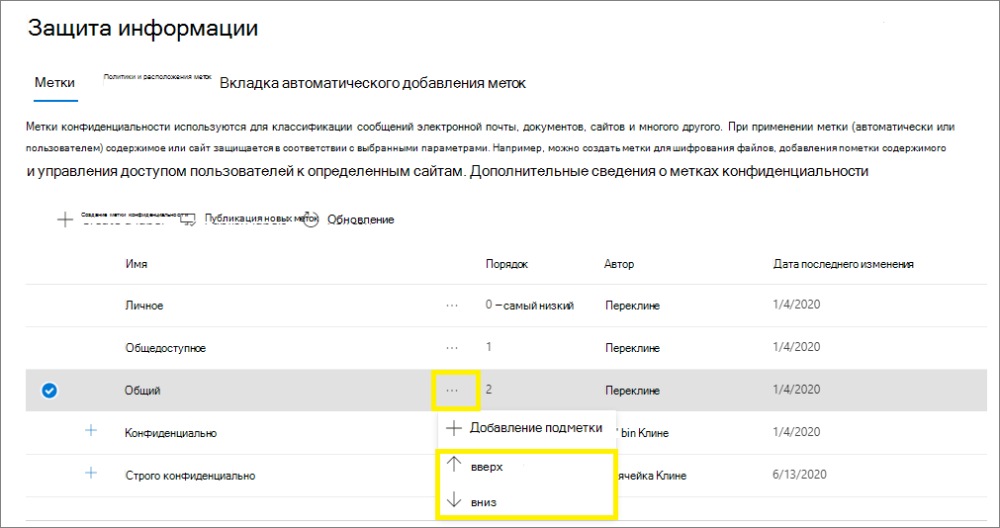
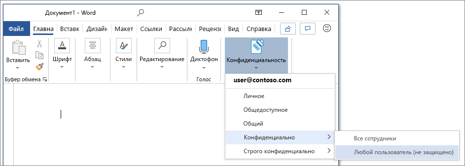
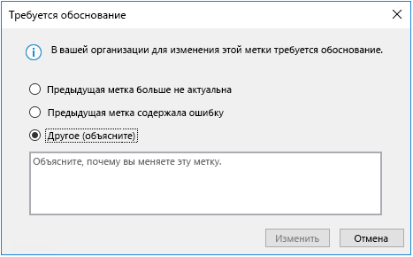
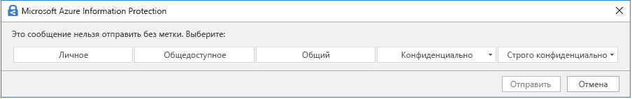
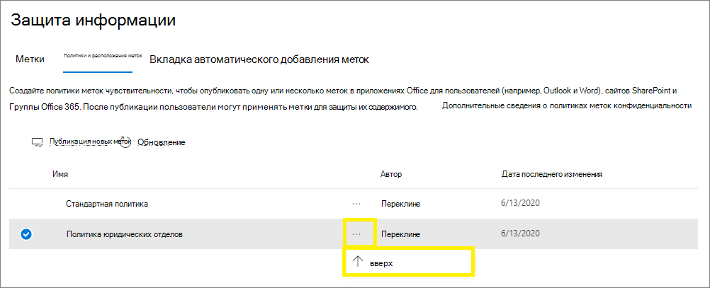

# Сведения о метках конфиденциальности

>*[Руководство по лицензированию Microsoft 365 для обеспечения безопасности и соответствия требованиям](https://aka.ms/ComplianceSD).*

Для выполнения задач пользователи совместно работают с другими людьми внутри и вне организации. Это означает, что контент покидает границы брандмауэра — он может перемещаться куда угодно на устройствах, в приложениях и службах. Необходимо, что его перемещение было безопасным и защищенным в согласии с бизнес-политикой и политикой соответствия требованиям вашей организации.

Метки конфиденциальности с платформы Microsoft Information Protection позволяют классифицировать и защищать данные вашей организации, при этом следя за тем, чтобы не пострадали производительность пользователей и их способность к сотрудничеству.

Пример меток конфиденциальности, доступных в Excel на вкладке **Главная** ленты. В этом примере примененная метка отображается в строке состояния.

Метки конфиденциальности поддерживаются для клиентов только в глобальном (общедоступном) облаке. В настоящее время метки конфиденциальности не поддерживаются для клиентов в других облаках, например [национальных облаках](https://docs.microsoft.com/azure/active-directory/develop/authentication-national-cloud).

> [!NOTE]
> Метки конфиденциальности пока недоступны для организаций, имеющих право на использование облака сообщества для государственных организаций США (GCC).

Чтобы метки конфиденциальности, пользователи должны войти в Office со своей рабочей или учебной учетной записью.

Вы можете использовать метки конфиденциальности для указанных ниже целей.
  
- **Применять параметры защиты, такие как шифрование или подложки для контента с метками.** Например, пользователи могут применять метку "Конфиденциально" к документу или электронному сообщению, и эта метка может зашифровать контент и применить подложку "Конфиденциально".

- **Защита контента в приложениях Office на различных платформах и устройствах.** Список поддерживаемых приложений см. в статье [Использование меток конфиденциальности в приложениях Office](sensitivity-labels-office-apps.md).

- **Защитить контент в сторонних приложениях и службах** с помощью Microsoft Cloud App Security. С помощью Cloud App Security можно определять, классифицировать, помечать и защищать контент в сторонних приложениях и службах, таких как SalesForce, Box или DropBox, даже в том случае, если стороннее приложение или служба не считывает или не поддерживает метки конфиденциальности.

- **Расширить применение меток конфиденциальности для сторонних приложений и служб**. С помощью пакета SDK Microsoft Information Protection сторонние приложения могут считывать метки конфиденциальности и применять параметры защиты.

- **Классификация контента без использования параметров защиты.** Вы можете просто назначить классификацию (например, стикер) контенту, которая будет сохраняться и перемещаться вместе с контентом при его использовании и передаче. Вы можете использовать эту классификацию, чтобы создавать отчеты об использовании, и для просмотра данных о действиях над конфиденциальным контентом. На основе этих сведений вы всегда сможете впоследствии применить необходимые параметры защиты.

Во всех этих случаях метки конфиденциальности Microsoft 365 помогут вам обращаться с каждым типом содержимого так, как он того требует. С помощью меток конфиденциальности вы можете классифицировать данные в масштабах организации и на основе этой классификации применять параметры защиты.

## Что такое метка конфиденциальности

Метка конфиденциальности, назначенная документу или электронному сообщению, похожа на печать, примененную к контенту, со следующими свойствами:

- **Настраиваемость.** Можно создавать категории для разных уровней конфиденциального контента в вашей организации, например личного, общедоступного, общего, конфиденциально и строго конфиденциального.

- **Обычный текст.** Так как метка сохранена в метаданных контента в виде обычного текста, сторонние приложения и службы могут считывать ее и применять собственные защитные действия при необходимости.

- **Постоянство.** После применения метки конфиденциальности к контенту она сохраняется в метаданных электронного письма или документа. Это означает, что метка перемещается с контентом, включая параметры защиты, и эти данные становятся основой для применения и внедрения политик.

В приложениях Office метка конфиденциальности отображается для пользователей как тег в сообщении электронной почты или документе.

К каждому элементу контента может применяться одна метка конфиденциальности. К элементу может быть применена одна метка конфиденциальности и одна [метка хранения](labels.md) одновременно.

> [!div class="mx-imgBorder"]
> 

## Возможности меток конфиденциальности

> [!NOTE]
> В дополнение к применению меток к сообщениям электронной почты и документам в приложениях Office метки конфиденциальности теперь также доступны в следующих общедоступных предварительных версиях.
> 
> - [Включение меток конфиденциальности для файлов Office в SharePoint и OneDrive (общедоступная предварительная версия)](sensitivity-labels-sharepoint-onedrive-files.md)
> - [Использование меток конфиденциальности в Microsoft Teams, группах Office 365 и SharePoint (общедоступная предварительная версия)](sensitivity-labels-teams-groups-sites.md)

После присвоения метки конфиденциальности сообщению электронной почты или документу, к контенту применяются любые параметры защиты, настроенные для этой метки. С помощью метки конфиденциальности вы можете:

- **Шифровать** только сообщения электронной почты или сообщения электронной почты и документы. Вы можете выбрать, какие пользователи или группы получат разрешения на выполнение определенных действий и на какой срок. Например, вы можете разрешить пользователям в определенной группе другой организации просматривать контент только через 7 дней после присвоения метки контенту. Кроме того, вместо разрешений, определяемых администратором, вы можете позволить пользователям назначать разрешения контенту, когда они применяют метку. 
    
    Дополнительные сведения о параметрах **шифрования** при создании или изменении метки конфиденциальности см. в статье [Ограничение доступа к содержимому с помощью шифрования в метках конфиденциальности](encryption-sensitivity-labels.md).

- **Помечать контент** при использовании приложений Office, добавляя подложки, верхние или нижние колонтитулы в электронные сообщения или документы с примененными метками. Подложки можно использовать для документов, но не для сообщений электронной почты. Пример заголовка и подложки:
    
    
    
    Необходимо проверять, когда применяются маркировки содержимого? Дополнительные сведения см. в статье [Когда Office 365 применяет маркировку и шифрование содержимого](sensitivity-labels-office-apps.md#when-office-365-applies-content-marking-and-encryption)
    
    Длина строк: Длина водяных знаков не должна превышать 255 символов. Колонтитулы ограничиваются 1024 знаками за исключением приложения Excel. В Excel общее ограничение для колонтитулов составляет 255 знаков, но оно включает невидимые знаки, например коды форматирования. При достижении этого ограничения введенная строка не отображается в Excel.

- **Защищайте содержимое в контейнерах, таких как сайты и группы**, когда вы выбираете предварительный просмотр, чтобы [использовать метки чувствительности с командами Microsoft, группами Office 365 и сайтами SharePoint (публичный предварительный просмотр)](sensitivity-labels-teams-groups-sites.md).
    
    Параметры конфигурации для **Параметров сайта и группы** не отображаются, пока вы не включите предварительный просмотр. Имейте в виду, что такая конфигурация меток не приводит к автоматической маркировке документов, а настройки меток защищают содержимое, контролируя доступ к контейнеру, в котором хранятся документы. Эти параметры включают уровень конфиденциальности, может ли владелец группы Office 365 добавлять гостей в группу, а также уровень доступа, предоставленного неуправляемому устройству.

- **Применять метку автоматически в приложениях Office или рекомендовать метку.** Вы можете выбрать, какие типы конфиденциальной информации вы хотите пометить, и метка может быть применена автоматически, или вы можете предложить пользователям применить метку, которую вы рекомендуете. Если вы порекомендуете метку, в подсказке отобразится любой текст, который вы выберете. Например,
    
    
    
    Дополнительные сведения о параметрах **автоматического применения меток в приложениях Office** при создании или изменении метки конфиденциальности см. в статье [Автоматическое применение метки конфиденциальности к содержимому](apply-sensitivity-label-automatically.md).

### Приоритет метки (важен порядок)

При создании меток конфиденциальности в Центре администрирования они отображаются в списке на вкладке **Конфиденциальность** страницы **Метки**. В этом списке важен порядок меток, поскольку он отражает их приоритет. Необходимо, чтобы самые строгие метки конфиденциальности (например, "Строго конфиденциально") отображались в **нижней части** списка, а наименее ограничивающие метки конфиденциальности (например, "Общедоступно") — в **верхней**.

К документу или сообщению электронной почты можно применить только одну метку конфиденциальности. Если вы настраиваете параметр, требующий от пользователей предоставить обоснование для изменения метки на более низкий уровень классификации, порядок этого списка определяет более низкие классификации. Однако этот параметр неприменим к подчиненным меткам.

При этом порядок подчиненных меток используется при [автоматическом присвоении меток](apply-sensitivity-label-automatically.md). Если вы настраиваете метки для автоматического применения или в качестве рекомендации, несколько совпадений могут соответствовать нескольким меткам. Чтобы определить рекомендуемую или применяемую метку, используется порядок меток: выбирается последняя метка конфиденциальности, а затем последняя подчиненная метка, если применимо.

### Подчиненные метки (метки группирования)

С помощью подчиненных меток вы можете группировать одну или несколько меток под родительской меткой, которая видна пользователю в приложении Office. Например, для метки "Конфиденциально" в вашей организации может использоваться несколько разных меток для определенных типов этой классификации. В этом примере родительская метка "Конфиденциально" — это простая текстовая метка без параметров защиты. Она включает подчиненные метки, поэтому ее нельзя применять к содержимому. Вместо этого пользователям необходимо выбрать метку "Конфиденциально", чтобы просмотреть подчиненные метки, после чего они смогут выбрать подчиненную метку для применения к содержимому.

Подчиненные метки — это простой способ представления меток пользователю в логических группах. Подчиненные метки не наследуют параметры родительской метки. Когда вы публикуете подчиненную метку для пользователя, он может применить эту подчиненную метку к контенту, но не может применить только родительскую метку.

Не выбирайте родительскую метку в качестве метки по умолчанию и не настраивайте ее для автоматического применения (или в качестве рекомендуемой). В противном случае родительская метка не будет применяться к содержимому.

Пример отображения подчиненных меток для пользователей:

### Изменение и удаление метки конфиденциальности

Если вы удаляете метку конфиденциальности в Центре администрирования, метка не удаляется автоматически из контента, и к нему по-прежнему применяются параметры защиты, присвоенные меткой.

Если вы изменяете метку конфиденциальности, к контенту применяется та версия метки, которая была ему присвоена.

## Возможности политик меток

После создания меток конфиденциальности вам нужно опубликовать их, чтобы сделать их доступными для пользователей и служб в организации. После этого метки конфиденциальности можно применять к документам и сообщениям электронной почты. В отличие от меток хранения, которые публикуются для расположений, таких как все почтовые ящики Exchange, метки конфиденциальности публикуются для пользователей или групп. После этого для этих пользователей и групп в приложениях Office появляются метки конфиденциальности.

С помощью политики меток вы можете:

- **Выбирать, какие пользователи и группы видят метки.** Метки могут публиковаться для любой группы безопасности с поддержкой электронной почты, группы Office 365 или динамической группы рассылки.

- **Применять метку по умолчанию** ко всем новым документам и сообщениям электронной почты, созданным пользователями и группами, включенными в политику меток. Этот параметр также применяется к контейнерам, если вы [включили метки чувствительности для Microsoft Teams, групп Office 365 и сайтов SharePoint](sensitivity-labels-teams-groups-sites.md). Пользователи всегда могут изменить метку по умолчанию, если она не подходит для их документа или электронной почты. Рекомендуется применять стандартную метку, чтобы установить базовый уровень параметров защиты, которые нужно применять ко всему содержимому. Но без обучения пользователей и других элементов управления этот параметр также может приводить к неправильному применению метки. 

- **Требовать обоснования для изменения метки.** Если пользователь пытается удалить метку или заменить ее меткой с номером более низкого порядка, вы можете потребовать, чтобы пользователь предоставил обоснование для выполнения этого действия. Например, пользователь открывает документ с пометкой «Конфиденциально» (номер заказа 3) и заменяет этот ярлык на документ с именем «Публичный» (номер заказа 1). В настоящее время причина не отправляется в [аналитические данные о метках](label-analytics.md) для проверки администратором. Однако [клиент унифицированных меток Azure Information Protection](https://docs.microsoft.com/azure/information-protection/rms-client/aip-clientv2) отправляет эту информацию в [средство аналитики Azure Information Protection](https://docs.microsoft.com/azure/information-protection/reports-aip).

    

- **Требовать от пользователей применения метки к их почте и документам.** Также называется обязательным применением меток. Вы можете требовать обязательное применение меток, перед тем как пользователи смогут сохранять документы и отправлять письма. Используйте этот параметр, чтобы расширить применение меток. Метка может присваиваться вручную пользователем, автоматически в результате применения настроенного условия или назначаться по умолчанию (вариант применения метки по умолчанию описан выше). Запрос, отображаемый в Outlook, когда пользователь должен назначить метку:

    
    
    > [!NOTE]
    > Обязательное применение меток требует подписки на Azure Information Protection. Чтобы использовать эту функцию, необходимо установить [клиент унифицированных меток Azure Information Protection](https://docs.microsoft.com/azure/information-protection/rms-client/install-unifiedlabelingclient-app). Этот клиент работает только в Windows, поэтому эта функция еще не поддерживается на устройствах Mac, на базе iOS и Android.

- **Предоставить справочную ссылку на специальную страницу справки.** Если пользователи не знают точно, что означают метки конфиденциальности или как их следует применять, вы можете предоставить URL-адрес дополнительных сведений, который отображается в нижней части меню **Метка конфиденциальности** в приложениях Office:

    

После создания политики меток, назначающей метки конфиденциальности пользователям и группам, для отображения меток для пользователей в приложениях Office может потребоваться до 24 часов.

Количество меток конфиденциальности, которые можно создать и опубликовать, не ограничено за одним исключением: если метка обеспечивает применение шифрования, поддерживается не более 500 меток. Но чтобы снизить административную нагрузку и сложность для пользователей, рекомендуется свести число меток к минимуму. Доказано значительное снижение эффективности реальных развертываний, если пользователи применяют более пяти основных меток или более пяти подчиненных меток для каждой основной метки.

### Приоритет политики меток (важен порядок)

Чтобы сделать метки конфиденциальности доступными для пользователей, нужно опубликовать метки в политике меток конфиденциальности, список которых отображается на вкладке **Политики конфиденциальности** на странице **Политики меток**. Для политик меток конфиденциальности, как и для меток конфиденциальности, важен порядок (см. раздел [Приоритет метки (важен порядок)](#label-priority-order-matters)), так как приоритет зависит от порядка. Политика меток с низшим приоритетом отображается **сверху**, а политика меток с высшим приоритетом отображается **снизу**.

Политика меток состоит из следующих элементов:

- Набор меток.
- Область действия политики меток, то есть пользователи и группы, включенные в эту политику.
- Параметры политики меток, описанные выше (метка по умолчанию, обоснование, обязательная метка, ссылка на справку).

Можно включить одного пользователя в несколько политик меток. Этот пользователь будет видеть все метки конфиденциальности этих политик. При этом пользователь получает параметры политики только для меток с высшим приоритетом.

Если вы не видите для пользователя или группы ожидаемую метку или параметр политики меток и уже прошло 24 часа, проверьте порядок политик меток конфиденциальности. Чтобы изменить порядок политик меток, выберите политику меток конфиденциальности, нажмите многоточие справа и выберите **Вниз** или **Вверх**.

Если вы используете метки хранения в дополнение к меткам конфиденциальности, важно помнить, что приоритеты важны для политик меток конфиденциальности, но не для [политик меток хранения](labels.md#the-principles-of-retention-or-what-takes-precedence).

## Метки конфиденциальной информации и Azure Information Protection

Если вы развернули метки с помощью Azure Information Protection, перед применением меток конфиденциальности воспользуйтесь следующими разделами.

### Метки Azure Information Protection

> [!NOTE]
> Управление метками для службы Azure Information Protection на портале Azure перестанет поддерживаться **31 марта 2021 г.** Дополнительные сведения см. в официальном [уведомлении о прекращении поддержки](https://techcommunity.microsoft.com/t5/azure-information-protection/announcing-timelines-for-sunsetting-label-management-in-the/ba-p/1226179).

Если вы используете метки Azure Information Protection, так как ваш клиент еще не применяет [платформу унифицированных меток](https://docs.microsoft.com/azure/information-protection/faqs#how-can-i-determine-if-my-tenant-is-on-the-unified-labeling-platform), рекомендуется избегать создания меток конфиденциальности до активации унифицированных меток. В этом сценарии на портале Azure отображаются метки Azure Information Protection, а не метки конфиденциальности. Эти метки можно использовать в клиенте Azure Information Protection (классическая версия) на компьютерах с Windows, но нельзя использовать на устройствах под управлением macOS, iOS и Android. Чтобы устранить эту проблему, [выполните миграцию этих меток](/azure/information-protection/configure-policy-migrate-labels) в метки конфиденциальности. 

Метаданные, применяемые обоими наборами меток, совместимы, поэтому вам не придется изменять метки документов и сообщений электронной почты после завершения миграции.

### Клиенты Azure Information Protection

При использовании меток конфиденциальности в приложениях Office 365 профессиональный плюс на компьютерах с Windows вы можете использовать клиент Azure Information Protection или применять метки, встроенные в Office.

По умолчанию встроенные метки отключены в этих приложениях, если установлен клиент Azure Information Protection. Дополнительные сведения, включая информацию об изменении этого поведения по умолчанию, см. в разделе [Встроенный клиент меток Office и клиент Azure Information Protection](sensitivity-labels-office-apps.md#office-built-in-labeling-client-and-the-azure-information-protection-client).

Даже если вы используете встроенные метки в приложениях Office, вы можете также применять клиент унифицированных меток Azure Information Protection с метками конфиденциальности для следующего:

- сканер для обнаружения конфиденциальной информации, хранящейся в локальной среде, с последующим применением метки к этому содержимому (при необходимости);

- контекстные параметры в проводнике, чтобы пользователи могли применять метки ко всем типам файлов;

- средство просмотра зашифрованных файлов: текстовых, изображений или PDF-документов;

- модуль PowerShell для поиска конфиденциальной информации в локальных файлах и применение или удаление меток и шифрования из этих файлов.

Если вы впервые используете Azure Information Protection или являетесь действующим пользователем Azure Information Protection, который только что перенес свои метки, см. раздел [Выберите, какой клиент меток следует использовать для компьютеров Windows](https://docs.microsoft.com/azure/information-protection/rms-client/use-client#choose-which-labeling-client-to-use-for-windows-computers) в документации по Azure Information Protection.

## Метки конфиденциальности и Microsoft Cloud App Security

С помощью Cloud App Security (CAS) можно обнаруживать, классифицировать, помечать и защищать контент в сторонних приложениях и службах, таких как SalesForce, Box или Dropbox. 

Cloud App Security поддерживает как метки Azure Information Protection, так и метки конфиденциальности:

- Если в центрах администрирования меток [опубликована](create-sensitivity-labels.md#publish-sensitivity-labels-by-creating-a-label-policy) одна или несколько меток конфиденциальности хотя бы для одного пользователя, используются метки конфиденциальности.

- Если в центрах администрирования меток не опубликованы метки конфиденциальности, используются метки Azure Information Protection.

Инструкции по использованию Cloud App Security с этими метками см. в статье [Интеграция Azure Information Protection](https://docs.microsoft.com/cloud-app-security/azip-integration).

## Метки конфиденциальности и SDK Microsoft Information Protection

Так как метка конфиденциальности сохранена в метаданных или документе в виде обычного текста, сторонние приложения и службы могут считывать и записывать ее в этих метаданных меток, чтобы дополнять ваши развернутые метки. Кроме того, разработчики программного обеспечения могут использовать пакет [SDK защиты информации (Майкрософт)](https://docs.microsoft.com/information-protection/develop/overview#microsoft-information-protection-sdk), чтобы полностью поддерживать возможности меток и шифрования на разных платформах. Дополнительные сведения см. в [объявлении об общедоступности в блоге Tech Community](https://techcommunity.microsoft.com/t5/Microsoft-Information-Protection/Microsoft-Information-Protection-SDK-Now-Generally-Available/ba-p/263144). 

Вы также можете ознакомиться с [решениями партнеров с интегрированной службой защиты информации (Майкрософт)](https://techcommunity.microsoft.com/t5/Azure-Information-Protection/Microsoft-Information-Protection-showcases-integrated-partner/ba-p/262657).

## Инструкции по развертыванию

См. статью [Начало работы с метками конфиденциальности](get-started-with-sensitivity-labels.md).

