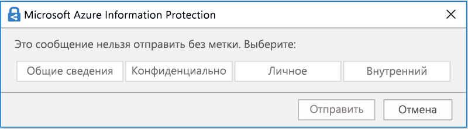

# Обзор меток конфиденциальности

Для выполнения задач пользователи совместно работают с другими людьми внутри и вне организации. Это означает, что контент покидает границы брандмауэра — он может перемещаться на устройствах, в приложениях и службах. Его перемещение необходимо обеспечивать безопасным и защищенным способом, который соответствует деятельности вашей организации и политикам соответствия требованиям.

С помощью меток конфиденциальности вы можете классифицировать и защищать конфиденциальное содержимое, не мешая совместной работе и производительности пользователей.

Пример меток конфиденциальности:

Метки конфиденциальности поддерживаются для клиентов только в глобальном (общедоступном) облаке. В настоящее время метки конфиденциальности не поддерживаются для клиентов в других облаках, например [национальных облаках](https://docs.microsoft.com/azure/active-directory/develop/authentication-national-cloud).

Чтобы метки конфиденциальности, пользователи должны войти в Office со своей рабочей или учебной учетной записью.

Вы можете использовать метки конфиденциальности для указанных ниже целей.
  
- **Применять параметры защиты, такие как шифрование или подложки для контента с метками.** Например, пользователи могут применять метку "Конфиденциально" к документу или электронному сообщению, и эта метка может зашифровать контент и применить подложку "Конфиденциально".

- **Защита контента в приложениях Office на различных платформах и устройствах.** Список поддерживаемых приложений см. в статье [Метки конфиденциальности в приложениях Office](sensitivity-labels-office-apps.md).

- **Запретить конфиденциальному контенту покидать вашу организацию на устройствах под управлением Windows**, используя защиту конечных точек в Microsoft Intune. После применения метки конфиденциальности к контенту, расположенному на устройстве с Windows, защита конечных точек позволяет предотвратить копирование контента в сторонние приложения, например Twitter или Gmail, или копирование на съемный носитель, например USB-накопитель.

- **Защитить контент в сторонних приложениях и службах** с помощью Microsoft Cloud App Security. С помощью Cloud App Security можно определять, классифицировать, помечать и защищать контент в сторонних приложениях и службах, таких как SalesForce, Box или DropBox, даже в том случае, если стороннее приложение или служба не считывает или не поддерживает метки конфиденциальности.

- **Расширить применение меток конфиденциальности для сторонних приложений и служб.** С помощью пакета SDK Microsoft Information Protection сторонние приложения на [этих платформах](https://docs.microsoft.com/information-protection/develop/overview#microsoft-information-protection-sdk) могут считывать метки конфиденциальности и применять параметры защиты.

- **Классификация контента без использования параметров защиты.** Вы можете просто назначить классификацию (например, стикер) контенту, которая будет сохраняться и перемещаться вместе с контентом при его использовании и передаче. Вы можете использовать эту классификацию, чтобы создавать отчеты об использовании, и для просмотра данных о действиях над конфиденциальным контентом. На основе этих сведений вы всегда сможете впоследствии применить необходимые параметры защиты.

Во всех этих случаях метки конфиденциальности Office 365 помогут вам обращаться с каждым типом содержимого так, как он того требует. С помощью меток конфиденциальности вы можете классифицировать данные в масштабах организации и на основе этой классификации применять параметры защиты.
  
Метки конфиденциальности создаются в Центре соответствия требованиям Microsoft 365, Центре безопасности Microsoft 365 и Центре безопасности и соответствия требованиям Office 365 в разделе **Классификация** > **Метки конфиденциальности**. Эти метки конфиденциальности могут использоваться в Azure Information Protection, приложениях Office и службах Office 365.

Для клиентов Azure Information Protection можно использовать свои метки Azure Information Protection в других центрах администрирования, которые будут синхронизированы с порталом Azure, если вы решите выполнить дополнительную или расширенную настройку. Метки Azure Information Protection и метки конфиденциальности Office 365 полностью совместимы друг с другом. Это означает, например, что при наличии контента с меткой Azure Information Protection вам не потребуется изменять классификацию или метку вашего контента.

## Что такое метка конфиденциальности

Метка конфиденциальности, назначенная документу или электронному сообщению, похожа на печать, примененную к контенту, со следующими свойствами:

- **Настраиваемость.** Можно создавать категории для разных уровней конфиденциального контента в вашей организации, например личного, общедоступного, общего, конфиденциально и строго конфиденциального.

- **Обычный текст.** Так как метка сохранена в метаданных контента в виде обычного текста, сторонние приложения и службы могут считывать ее и применять собственные защитные действия при необходимости.

- **Постоянство.** После применения метки конфиденциальности к контенту она сохраняется в метаданных электронного письма или документа. Это означает, что метка перемещается с контентом, включая параметры защиты, и эти данные становятся основой для применения и внедрения политик.

В приложениях Office метка конфиденциальности отображается для пользователей как тег в сообщении электронной почты или документе.

К каждому элементу контента может применяться одна метка конфиденциальности. К элементу может быть применена одна метка конфиденциальности и одна [метка хранения](labels.md) одновременно.

## Возможности меток конфиденциальности

В дополнение к электронной почте и документам метки конфиденциальности доступны в нескольких выпусках общедоступной предварительной версии. Дополнительные сведения о возможностях применения меток конфиденциальности для файлов, команд, групп и сайтов см. в следующих статьях:

- [Включение меток конфиденциальности для файлов Office в SharePoint и OneDrive (общедоступная предварительная версия)](sensitivity-labels-sharepoint-onedrive-files.md)

- [Использование меток конфиденциальности в Microsoft Teams, группах Office 365 и SharePoint (общедоступная предварительная версия)](sensitivity-labels-teams-groups-sites.md)

После присвоения метки конфиденциальности сообщению электронной почты или документу, к контенту применяются любые параметры защиты, настроенные для этой метки. С помощью метки конфиденциальности вы можете:

- **Шифровать** только сообщения электронной почты или сообщения электронной почты и документы. Вы можете выбрать, какие пользователи или группы получат разрешения на выполнение определенных действий и на какой срок. Например, вы можете разрешить пользователям в определенном домене за пределами вашей организации просматривать контент только через 7 дней после присвоения метки контенту. Кроме того, вместо самостоятельного назначения разрешений вы можете позволить пользователям назначать разрешения контенту, когда они применяют метку. Дополнительные сведения см. в статье [Ограничение доступа к содержимому с помощью шифрования в метках конфиденциальности](encryption-sensitivity-labels.md).

- **Помечать контент**, добавляя настраиваемые подложки, верхние или нижние колонтитулы в электронные сообщения или документы с примененными метками. Подложки применяются только к документам, а не электронной почте, и их длина ограничена 255 знаками. Кроме того, верхние и нижние колонтитулы ограничиваются 1024 знаками (за исключением Excel, где ограничение составляет не более 255 знаков или менее, в зависимости от того, содержит ли документ другие верхние или нижние колонтитулы и прочие факторы).

    

- **Предотвращение потери данных** путем включения Endpoint Protection в Intune. При скачивании конфиденциального содержимого можно обеспечить предотвращение потери данных на устройствах с Windows. Например, вы не можете скопировать содержимое с меткой в Dropbox, Gmail или USB-накопитель. Перед тем как ваши метки конфиденциальности смогут использовать Windows Information Protection (WIP), необходимо сначала создать политику защиты приложений на портале Azure. Дополнительные сведения см. в статье [Как Windows Information Protection защищает файлы с меткой конфиденциальности](https://docs.microsoft.com/windows/security/information-protection/windows-information-protection/how-wip-works-with-labels?branch=vsts17546553).

- **Автоматически присваивать метку содержимому с конфиденциальной информацией.** Вы можете выбрать, какие типы конфиденциальной информации нужно помечать. Метку можно присваивать автоматически, или можно отображать для пользователей запрос на присвоение рекомендуемой метки. Если вы рекомендуете метку, текст запроса может быть любым. Дополнительные сведения см. в статье [Автоматическое применение метки конфиденциальности к содержимому](apply-sensitivity-label-automatically.md).

    

Все эти параметры доступны при создании метки конфиденциальности:

### Приоритет метки (важен порядок)

При создании меток конфиденциальности в Центре администрирования они отображаются в списке на вкладке **Конфиденциальность** страницы **Метки**. В этом списке важен порядок меток, поскольку он отражает их приоритет. Необходимо, чтобы самые строгие метки конфиденциальности (например, "Строго конфиденциально") отображались в **нижней части** списка, а наименее ограничивающие метки конфиденциальности (например, "Общедоступно") — в **верхней**.

К документу или сообщению электронной почты можно применить только одну метку конфиденциальности. Если вы требуете от своих пользователей предоставить обоснование для изменения метки на более низкий уровень классификации, порядок этого списка определяет более низкие классификации.

Приоритет метки также применяется к подчиненным меткам.

### Подчиненные метки (метки группирования)

С помощью подчиненных меток вы можете группировать одну или несколько меток под родительской меткой, которая видна пользователю в приложении Office. Например, для метки "Конфиденциально" в вашей организации может использоваться несколько разных меток для определенных типов этой классификации. В этом примере родительская метка "Конфиденциально" — это простая текстовая метка без параметров защиты, поэтому ее нельзя применять к содержимому. Вместо этого пользователям необходимо выбрать метку "Конфиденциально", чтобы просмотреть подчиненные метки, после чего они смогут выбрать подчиненную метку для применения к содержимому.

Подчиненные метки — это простой способ представления меток пользователю в логических группах. Подчиненные метки не наследуют параметры родительской метки. Когда вы публикуете подчиненную метку для пользователя, он может применить эту подчиненную метку к контенту, но не может применить только родительскую метку.

Не следует выбирать родительскую метку в качестве используемой по умолчанию или настраивать ее на автоматическое применение или в качестве рекомендуемой, так как родительская метка не применяется к содержимому в приложениях Office, использующих клиент унифицированных меток Azure Information Protection.

Пример отображения подчиненных меток для пользователей:

### Изменение и удаление метки конфиденциальности

Если вы удаляете метку конфиденциальности, метка не удаляется из контента, и к содержимому по-прежнему применяются параметры защиты.

Если вы изменяете метку конфиденциальности, к контенту применяется та версия метки, которая была ему присвоена.

## Возможности политик меток

После создания меток конфиденциальности вам нужно опубликовать их, чтобы сделать их доступными для пользователей организации, которые затем смогут применять метки к контенту. В отличие от меток хранения, которые публикуются для расположений, таких как все почтовые ящики Exchange, метки конфиденциальности публикуются для пользователей или групп. После этого для этих пользователей и групп в приложениях Office появляются метки конфиденциальности.

С помощью политики меток вы можете:

- **Выбирать, какие пользователи и группы видят метки.** Метки могут публиковаться для любой группы безопасности с поддержкой электронной почты, группы рассылки, группы Office 365 или динамической группы рассылки.

- **Применять метку по умолчанию** ко всем новым документам и электронным сообщениям, создаваемым пользователями и группами, включенными в политику меток. Эта метка по умолчанию может задавать базовый уровень параметров защиты, которые нужно применять ко всему контенту.

- **Требование обоснования для изменения метки.** Если содержимое помечено как конфиденциальное и пользователь хочет удалить эту метку или заменить ее меткой с более низким уровнем классификации, например, меткой с наименованием “общедоступная”. Вы можете потребовать, чтобы пользователь предоставил обоснование при выполнении этого действия. В настоящее время причина не отправляется в [аналитические данные о метках](label-analytics.md) для проверки администратором. Однако [клиент унифицированных меток Azure Information Protection](https://docs.microsoft.com/azure/information-protection/rms-client/aip-clientv2) отправляет эту информацию в [средство аналитики Azure Information Protection](https://docs.microsoft.com/azure/information-protection/reports-aip).

    

- **Требовать от пользователей применения метки к их почте и документам.** Если нужно помечать все содержимое пользователя, вы можете потребовать обязательное применение меток ко всем сохраняемым документам и отправляемым письмам. Метка может присваиваться вручную пользователем, автоматически в результате применения условия или назначаться по умолчанию (вариант применения метки по умолчанию описан выше). Ниже представлен запрос, отображаемый в Outlook, когда пользователь должен назначить метку.

    > [!NOTE]
    > Обязательное назначение меток требует подписки на Azure Information Protection. Чтобы использовать эту функцию, необходимо скачать и установить либо [клиент Azure Information Protection](https://www.microsoft.com/download/details.aspx?id=53018) либо последнюю версию [клиента унифицированных меток Azure Information Protection](https://docs.microsoft.com/azure/information-protection/rms-client/install-unifiedlabelingclient-app). Кроме того, клиент выполняется только в Windows, поэтому эта функция еще не поддерживается на устройствах Mac, на базе iOS и Android.

    

- **Предоставление ссылки на страницу настраиваемой справки.** Если пользователи не уверены, что означают метки конфиденциальности или как их следует применять, вы можете предоставить URL-адрес с дополнительными сведениями, который отображается в нижней части меню **Метки конфиденциальности** в приложениях Office.

    

После создания политики меток и назначения меток конфиденциальности пользователям и группам эти метки станут доступны для сотрудников в приложениях Office через час или меньше.

Количество меток конфиденциальности, которые можно создать и опубликовать, не ограничено за одним исключением: если метка обеспечивает применение шифрования, поддерживается не более 500 меток. Но чтобы снизить административную нагрузку и сложность для пользователей, рекомендуется свести число меток к минимуму. Доказано значительное снижение эффективности реальных развертываний, если пользователи применяют более пяти основных меток или более пяти подчиненных меток для каждой основной метки.

### Приоритет политики меток (важен порядок)

Чтобы сделать метки конфиденциальности доступными для пользователей, нужно опубликовать метки в политике меток конфиденциальности, список которых отображается на вкладке **Политики конфиденциальности** на странице **Политики меток**. Для политик меток конфиденциальности, как и для меток конфиденциальности, важен порядок (см. раздел [Приоритет метки (важен порядок)](#label-priority-order-matters)), так как приоритет зависит от порядка. Политика меток с низшим приоритетом отображается **сверху**, а политика меток с высшим приоритетом отображается **снизу**.

Политика меток состоит из следующих элементов:

- Набор меток.
- Область действия политики меток, то есть пользователи и группы, включенные в эту политику.
- Параметры политики меток, описанные выше (метка по умолчанию, обоснование, обязательная метка, ссылка на справку).

Можно включить одного пользователя в несколько политик меток. Этот пользователь будет видеть все метки конфиденциальности этих политик. При этом пользователь увидит параметры политики только для меток с высшим приоритетом.

Если пользователь или группа в вашей организации не видят нужный вариант в политике меток, например, метку по умолчанию или обязательную метку, проверьте порядок политик меток конфиденциальности. Чтобы изменить порядок политик меток, выберите политику меток конфиденциальности, нажмите многоточие справа и выберите **Вниз** или **Вверх**.

Приоритет важен для политик меток конфиденциальности, но **не** имеет значения для политик меток хранения. Как описано в разделе [Принципы хранения: как определяется приоритет?](labels.md#the-principles-of-retention-or-what-takes-precedence), для одного и того же контента может действовать несколько политик хранения.

## Инструкции по началу работы с метками конфиденциальности

Начало работы с метками конфиденциальности — это быстрый процесс, представленный ниже.

1. **Определение меток.** Сначала нужно установить таксономию для определения разных уровней конфиденциального контента. Следует использовать общие имена или термины, которые понятны пользователям. Например, можно начать с таких меток, как "Личное", "Общедоступно", "Общее", "Конфиденциально" и "Строго конфиденциально". С помощью подчиненных меток можно группировать похожие метки по категории. Кроме того, при создании метки требуется подсказка, которая отображается в приложениях Office, когда пользователь наводит указатель на параметр метки на ленте.

2. **Определение возможностей каждой метки.** После этого настройте параметры защиты, которые нужно связать с каждой меткой. Например, для контента низкого уровня конфиденциальности (например, метка "Общее") может просто применяться верхний или нижний колонтитул, а для контента высокого уровня конфиденциальности (например, метка "Конфиденциально") — подложка, шифрование и WIP, чтобы обеспечить доступ только привилегированным пользователям.

3. **Определение получателей меток.** После определения меток вашей организации, опубликуйте их в политике меток, которая определяет, какие пользователи и группы видят эти метки. Отдельная метка пригодна для повторного использования, после определения ее можно включить в несколько политик меток, назначенных разным пользователям. Но для назначения метки контенту необходимо сначала ее опубликовать, чтобы она стала доступной в приложениях Office и других службах. В самом начале работы можно освоить метки конфиденциальности, назначая их лишь нескольким пользователям.

Ниже показан основной процесс действий администратора, пользователя и приложения Office по присвоению меток конфиденциальности.

## Где могут отображаться метки конфиденциальности

Метки конфиденциальности отображаются в пользовательском интерфейсе приложений Office. Чтобы просмотреть текущую доступность встроенных меток для конкретных приложений и платформ, используйте следующие таблицы:

- [Поддержка возможностей меток конфиденциальности в Word, Excel и PowerPoint](sensitivity-labels-office-apps.md#support-for-sensitivity-label-capabilities-in-word-excel-and-powerpoint)

- [Поддержка возможностей меток конфиденциальности в Outlook](sensitivity-labels-office-apps.md#support-for-sensitivity-label-capabilities-in-outlook)

Если вы используете клиент унифицированных меток Azure Information Protection для компьютеров с Windows, для меток конфиденциальности доступны дополнительные возможности. Дополнительные сведения см. в разделе [Сравнение клиентов присвоения меток для компьютеров с Windows](https://docs.microsoft.com/azure/information-protection/rms-client/use-client#compare-the-labeling-clients-for-windows-computers).

### Приложения Office в Windows

В приложениях Office на устройствах под управлением Windows метки конфиденциальности отображаются на кнопке **Конфиденциальность** вкладки **Главная** на ленте. 

При использовании встроенных меток примененная метка также отображается в строке состояния в нижней части окна:

### Приложения Office в Интернете

Сведения об использовании меток конфиденциальности с приложениями Office в Интернете см. в статье [Применение меток конфиденциальности к документам и электронной почте в Office — Интернет](https://support.office.com/article/2f96e7cd-d5a4-403b-8bd7-4cc636bae0f9).

### Приложения Office в Mac

В приложениях Office на устройствах Mac метки конфиденциальности отображаются на кнопке **Конфиденциальность** вкладки **Главная** на ленте. Примененная метка также отображается в строке состояния в нижней части окна:

### Приложения Office в iOS

В приложениях Office на устройствах iOS метки конфиденциальности отображаются на кнопке **Конфиденциальность** вкладки **Главная** на ленте. Примененная метка также отображается в строке состояния в нижней части окна:

### Приложения Office в Android

В приложениях Office на устройствах Android метки конфиденциальности отображаются на кнопке **Конфиденциальность** вкладки **Главная** на ленте. Примененная метка также отображается в строке состояния в нижней части окна:

### Дополнительные сведения о метках конфиденциальности в приложениях Office

- [Применение меток конфиденциальности к документам и сообщениям электронной почты в Office](https://support.office.com/article/apply-sensitivity-labels-to-your-documents-and-email-within-office-2f96e7cd-d5a4-403b-8bd7-4cc636bae0f9)
- [Известные проблемы при присваивании меток конфиденциальности файлам Office](https://support.office.com/article/known-issues-when-you-apply-sensitivity-labels-to-your-office-files-b169d687-2bbd-4e21-a440-7da1b2743edc)
- [Метки конфиденциальности в приложениях Office](sensitivity-labels-office-apps.md)

## Как метки конфиденциальности взаимодействуют с существующими метками Azure Information Protection

Пользователи службы Azure Information Protection могут классифицировать и помечать контент в Windows с помощью клиента унифицированных меток Azure Information Protection. Существующие метки Azure Information Protection легко взаимодействуют с новыми метками конфиденциальности, называемыми унифицированными метками. Это означает, что вы можете:

- сохранить существующие метки Azure Information Protection в документах и электронных сообщениях;
- сохранить существующую конфигурацию меток Azure Information Protection.

Если вы используете метки Azure Information Protection, так как ваш клиент еще не применяет [платформу унифицированных меток](https://docs.microsoft.com/azure/information-protection/faqs#how-can-i-determine-if-my-tenant-is-on-the-unified-labeling-platform), рекомендуется избегать создания новых меток в других центрах администрирования до активации унифицированных меток. Дополнительные сведения об этом процессе см. в статье [Способ переноса меток Azure Information Protection в платформу унифицированных меток конфиденциальности](https://docs.microsoft.com/azure/information-protection/configure-policy-migrate-labels). 

> [!NOTE]
> Управление метками для службы Azure Information Protection на портале Azure перестанет поддерживаться **31 марта 2021**. Дополнительные сведения см. в официальном [уведомлении о прекращении поддержки](https://techcommunity.microsoft.com/t5/azure-information-protection/deprecation-notice-azure-information-protection-classic-client/ba-p/1092108).

## Метки конфиденциальности и клиент Azure Information Protection

Приложения Office 365 профессиональный плюс автоматически отключают встроенное присвоение меток конфиденциальности в приложениях Office для Windows, если у вас установлен клиент Azure Information Protection.
Сведения об изменении этого поведения по умолчанию, чтобы вы могли использовать встроенные метки, см. в разделе [О встроенном клиенте добавления меток в Office](sensitivity-labels-office-apps.md#about-the-office-built-in-labeling-client).

## Защита контента на устройствах с Windows с помощью защиты конечных точек в Microsoft Intune

При создании метки конфиденциальности имеется возможность сообщить Windows, что файлы с этой меткой должны быть защищены от утечки данных при хранении на устройствах с Windows. Эта возможность обеспечивает распространение или копирование контента с этой меткой только в разрешенные расположения, даже если он хранится в конечной точке. По сути, включение этого параметра для меток конфиденциальности сообщает Windows, что это дополнительные важные данные, требующие дополнительных ограничений использования.

Если вы включите этот параметр, Windows сможет считывать и распознавать метки конфиденциальности в документах, действовать в соответствии с ними, а также автоматически применять Windows Information Protection (WIP) для контента, независимо от способа его получения на устройстве под управлением Windows. Это позволяет защищать файлы с метками от случайной утечки, независимо от того, применяется ли шифрование.

Например, Windows может распознать, что документ Word, хранящийся на компьютере пользователя, содержит присвоенную метку "Конфиденциально", и WIP может применить политику защиты приложений, чтобы запретить копирование или отправку данных с этого устройства в любые нерабочие расположения (например, в личное хранилище OneDrive, личные почтовые учетные записи, социальные сети или USB-накопители).

Если пользователь попытается отправить контент с меткой в личную учетную запись Gmail, появится следующее сообщение.

Если пользователь попытается сохранить контент с меткой на USB-накопителе, появится следующее сообщение.

### Важные предварительные условия для использования WIP

Прежде чем метки конфиденциальности смогут использовать WIP, требуется выполнить предварительные условия, описанные в статье [Как Windows Information Protection защищает файлы с метками конфиденциальности](https://docs.microsoft.com/windows/security/information-protection/windows-information-protection/how-wip-works-with-labels?branch=vsts17546553). В ней описаны следующие предварительные условия.

- Подтверждение использования операционной системы Windows 10 версии 1809 или более поздней версии.
- [Настройка защиты Advanced Threat Protection в Защитнике Windows (ATP в Защитнике Windows)](https://docs.microsoft.com/windows/security/threat-protection/), которая проверяет контент на наличие метки и применяет соответствующую защиту WIP. ATP выполняет некоторые действия независимо от WIP, например сообщает об аномалиях.
- Создание политики Windows Information Protection (WIP), применяемой к устройствам конечных точек. Это можно выполнить в любом из этих расположений:

  - [Создание политики Windows Information Protection (WIP) с использованием MDM с помощью портала Azure для Microsoft Intune](https://docs.microsoft.com/windows/security/information-protection/windows-information-protection/create-wip-policy-using-intune-azure)
  - [Создание и развертывание политики Windows Information Protection (WIP) с помощью System Center Configuration Manager](https://docs.microsoft.com/windows/security/information-protection/windows-information-protection/create-wip-policy-using-sccm)

## Защита содержимого в сторонних приложениях и службах с помощью Microsoft Cloud App Security

Защитите содержимое в сторонних приложениях и службах, используя Cloud App Security (CAS). С помощью CAS можно определять, классифицировать, помечать и защищать контент в сторонних приложениях и службах, таких как SalesForce, Box или Dropbox. Например, Dropbox может не распознать метку конфиденциальности, но служба CAS обеспечит защиту помеченного контента в этом расположении.

Дополнительные сведения см. в статье [Автоматическое применение меток классификации Azure Information Protection](https://docs.microsoft.com/cloud-app-security/use-case-information-protection).

### Важные предварительные условия для использования CAS

Прежде чем метки конфиденциальности смогут использовать CAS, требуется выполнить предварительные условия, описанные в статье [Автоматическое применение меток классификации Azure Information Protection](https://docs.microsoft.com/cloud-app-security/use-case-information-protection). В ней описаны следующие предварительные условия:

- [Включение Cloud App Security и Azure Information Protection](https://docs.microsoft.com/cloud-app-security/azip-integration) для вашего клиента.
- [Подключение приложения](https://docs.microsoft.com/cloud-app-security/enable-instant-visibility-protection-and-governance-actions-for-your-apps) к Cloud App Security.

## Расширение применения меток конфиденциальности для сторонних приложений и служб с помощью SDK Microsoft Information Protection

Поскольку метка конфиденциальности сохраняется как обычный текст в метаданных документа, сторонние приложения и службы могут поддерживать определение и защиту контента, содержащего такую метку. Поддержка в других приложениях и службах всегда расширяется.

С помощью [SDK Microsoft Information Protection](https://docs.microsoft.com/information-protection/develop/) сторонние приложения и службы могут считывать и применять метки конфиденциальности и защиту для документов. Пакет SDK поддерживает приложения на [этих платформах](https://docs.microsoft.com/information-protection/develop/overview#microsoft-information-protection-sdk).

С помощью пакета SDK можно помечать и защищать контент способом, совместимым с другими приложениями и службами Microsoft Information Protection, такими как приложения Office, службы Office 365, сканер Azure Information Protection, Microsoft Cloud App Security и несколько других решений партнеров. Для примера можно ознакомиться с [поддержкой меток конфиденциальности в Adobe Acrobat](https://techcommunity.microsoft.com/t5/Azure-Information-Protection/Starting-October-use-Adobe-Acrobat-Reader-for-PDFs-protected-by/ba-p/262738).

Дополнительные сведения о пакете SDK Microsoft Information Protection см. в [сообщении блога Tech Community](https://techcommunity.microsoft.com/t5/Microsoft-Information-Protection/Microsoft-Information-Protection-SDK-Now-Generally-Available/ba-p/263144). Вы также можете ознакомиться с [решениями партнеров с интегрированной защитой информации Microsoft](https://techcommunity.microsoft.com/t5/Azure-Information-Protection/Microsoft-Information-Protection-showcases-integrated-partner/ba-p/262657).

## Разрешения, необходимые для создания меток конфиденциальности

Участникам вашей команды по обеспечению соответствия требованиям, создающим метки конфиденциальности, необходимы разрешения на доступ к Центру соответствия требованиям Microsoft 365, Центру безопасности Microsoft 365 или Центру безопасности и соответствия требованиям Office 365. По умолчанию администратор клиента имеет доступ к этим Центрам администрирования и может предоставлять доступ ответственным за обеспечение соответствия требованиям, не предоставляя им все разрешения администратора клиента. Для предоставления такого делегированного ограниченного административного доступа перейдите на страницу **Разрешения** в одном из этих Центров администрирования и добавьте участников в группу ролей **Администратор соответствия требованиям** или **Администратор безопасности**.

Дополнительные сведения см. в статье [Предоставление пользователям доступа к Центру безопасности и соответствия требованиям Office 365](https://docs.microsoft.com/microsoft-365/security/office-365-security/grant-access-to-the-security-and-compliance-center).

Эти разрешения необходимы только для создания и применения меток и соответствующей политики. Для применения политики не требуется доступ к контенту.