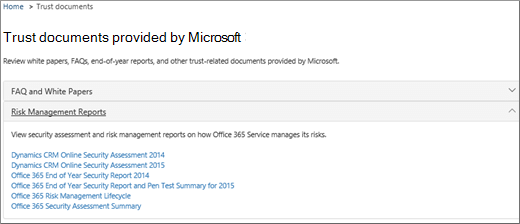
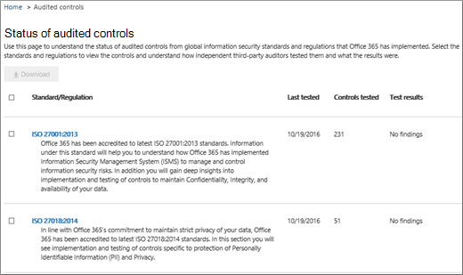

# Контроль качества обслуживания в Центре безопасности и соответствия требованиямService assurance in the Security & Compliance Center

Используйте службу обеспечения в Центре & безопасности для доступа к документам, описывая различные темы, в том числе:Use Service assurance in the Security & Compliance Center to access documents that describe a variety of topics, including: 
  
- Методы безопасности Майкрософт для данных клиентов, хранимые в Office 365.Microsoft security practices for customer data that is stored in Office 365. 
    
- Независимые сторонние отчеты аудита Office 365.Independent third-party audit reports of Office 365. 
    
- Сведения о реализации и тестировании для элементов управления безопасностью, конфиденциальностью и соответствия требованиям, которые Office 365 для защиты данных.Implementation and testing details for security, privacy, and compliance controls that Office 365 uses to protect your data. 
    
Вы также можете узнать, Office 365 помочь клиентам соблюдать стандарты, законы и правила в различных отраслях, например:You can also find out how Office 365 can help customers comply with standards, laws, and regulations across industries, such as the:
  
-  Международная организация по стандартизации (ISO) 27001 и 27018International Organization for Standardization (ISO) 27001 and 27018 
    
- Акт 1996 года о передаче и защите данных учреждений здравоохранения (HIPAA)Health Insurance Portability and Accountability Act of 1996 (HIPAA)
    
- требованиям Федеральной программы управления рисками и авторизацией (FedRAMP);Federal Risk and Authorization Management Program (FedRAMP)
    
## Кто получить доступ к Office 365 службы и каким образом?Who can access Office 365 Service assurance, and how?

 **Новые клиенты и** клиенты, оценивающие онлайн-службы Microsoft, могут получить доступ к гарантии службы, которая включается в Office 365 корпоративный E3 и E5 (как пробные, так и платные подписки).**New customers, and customers evaluating Microsoft online services** can access Service assurance which is included with Office 365 Enterprise E3 and E5 plans (both trial and paid subscriptions). Если у вас нет одного из этих планов и вы хотите попробовать службу обеспечения, вы можете зарегистрироваться для пробного Office 365 корпоративный [E5](https://go.microsoft.com/fwlink/p/?LinkID=698279).If you don't have one of these plans and want to try Service assurance, you can [sign-up for a trial of Office 365 Enterprise E5](https://go.microsoft.com/fwlink/p/?LinkID=698279).
  
 **Участники подписки O365** могут получить доступ к разделу обеспечения службы в центре защиты Office 365 по умолчанию.**O365 Subscription Members** can access the Service assurance section in the Office 365 Protection Center by default. Служба обеспечения предоставляет отчеты и документы, описывая методы безопасности Корпорации Майкрософт для данных клиентов, хранимых в Office 365.Service assurance provides reports and documents that describe Microsoft's security practices for customer data that's stored in Office 365. Она также предоставляет независимые сторонние отчеты о аудите по Office 365.It also provides independent third-party audit reports on Office 365.
 
## Выбор отраслевых и региональных параметровChoose your industry and regional settings

При первом доступе к гарантии службы первым шагом является настройка отраслевых и региональных параметров.When you access Service assurance for the first time, the first step is to configure your industry and regional settings. Вы можете изменить эти настройки в любое время.You can change these settings at any time. Настройка этих параметров позволяет службе обеспечения предоставить вам контент, который наиболее актуален для вашей организации.Configuring these settings enables Service assurance to provide you with content that is most relevant to your organization. Настройка параметров отрасли и региона:To configure your industry and region settings:
  
1. После доступа к гарантии **службы выберите Параметры** и отображает страницы параметров региона и отрасли, как показано на следующем скриншоте.After you access Service assurance, select **Settings** and the Region and industry settings page displays as shown in the following screenshot. 
    
    
  
2. На странице **Параметры** выберите стрелку вниз рядом с **Областью** и проверьте соответствующие регионы для организации.On the **Settings** page, select the down arrow next to **Region** and check the appropriate regions for your organization. 
    
3. Выберите стрелку вниз рядом с **индустрией** и проверьте соответствующие отрасли для организации.Select the down arrow next to **Industry** and check the appropriate industries for your organization. 
    
4. После выбора регионов и отраслей выберите **Сохранить**.Once you have selected regions and industries, select **Save**.
    
## Поиск, проверка и загрузка контента соответствия требованиям и доверияFind, review, and download compliance and trust content

Чтобы просмотреть и скачать контент, выберите параметр из области навигации:To review and download content, select an option from the navigation pane:
  
- **Отчеты о соответствии** требованиям, чтобы просмотреть независимые аудиты и оценки Office 365 и других облачных служб Майкрософт, как показано на следующем снимке экрана.**Compliance reports** to view independent audits and assessments of Office 365 and other Microsoft cloud services as shown in the following screen shot. 
    
    
  
- **Доверяйте** документам, чтобы просмотреть сведения о том, как Office 365 майкрософт, как показано на следующем снимке экрана.**Trust documents** to view information about how Microsoft operates Office 365 as shown in the following screen shot. 
    
    
  
- **Проверенные элементы** управления, чтобы просмотреть сведения о том, Office 365 элементы управления соответствуют требованиям безопасности, соответствия требованиям и конфиденциальности, как показано на следующем снимке экрана.**Audited controls** to view information about how Office 365 controls meet security, compliance, and privacy requirements, as shown in the following screen shot. 
    
    
  
Выберите отчет, который необходимо скачать, и выберите **Сохранить,** чтобы скачать его на компьютер.Select the report you want to download, and select **Save** to download it to your computer. Для проверенных элементов управления выберите нужный отчет, а затем выберите **Скачать**.For Audited controls, select the report you want and then select **Download**. В таблице ниже описываются отчеты, которые можно найти на каждой странице обеспечения службы.The table below describes the reports you can find on each Service assurance page. 
  
> [!NOTE]
> Отчеты и документы по обеспечению безопасности служб доступны для скачивания не менее 12 месяцев после публикации или до тех пор, пока не станет доступна новая версия документа.Service assurance reports and documents are available to download for at least twelve months after publishing or until a new version of the document becomes available. 
  
|**Страница обеспечения службы****Service assurance page**|**Доступное содержимое****Content available**|**Описание****Description**|
|:-----|:-----|:-----|
|Отчеты о соответствии требованиямCompliance reports    | FedRampFedRamp     Оценка GRCGRC Assessment     ISOISO     SOC/SSAESOC/SSAE    |Используйте отчеты о соответствии требованиям служб для проверки аудита, выполняемого сторонними независимыми аудиторами Office 365 service Delivery Operations.Use service compliance reports to review audit assessments performed by third-party independent auditors of Office 365 Service Delivery Operations.    |
|Документы о защите данныхTrust documents    | Задаваемые и белые документыFAQ and White Papers     Отчеты по управлению рискамиRisk Management Reports    |Для проверки и оценки рисков используйте белые документы, часто задаваемые сведения, отчеты за конец года и другие ресурсы Microsoft Confidential, доступные вам в соответствии с соглашением о неразглашении.Use white papers, FAQs, end-of-year reports and other Microsoft Confidential resources that are made available to you under non-disclosure agreement for your review / risk assessments.    |
|Проверенные элементы управленияAudited controls    |Глобальные стандарты и правила, Office 365 реализованы.Global standards and regulations that Office 365 has implemented.    | Справка по оценке рисков при оценке, использовании или использовании Office 365 служб.Help with risk-assessment when you're evaluating, onboarding, or using Office 365 services. Узнать:Find out:     - Соответствие Office 365 требованиям безопасности, соответствия требованиям и требованиям конфиденциальности.- How Office 365 controls meet security, compliance, and privacy requirements.   - О тестировании элементов управления в Office 365, результатах этих тестов и их завершении.-  About testing of controls in Office 365, results of these tests, and when they were completed.    |
   
В зависимости от конкретной настройки параметры, включенные в представление, могут иметь некоторые различия.Depending on your specific set-up, options included in your view might have some differences.
    
## Справка по обеспечению службыGet help with Service assurance

[Обращение в службу поддержки продуктов для бизнеса. Справка для администраторов](../business-video/get-help-support.md).[Contact support for business products - Admin Help](../business-video/get-help-support.md).
  
## Вопросы и ответыFrequently Asked Questions

 **Почему я получаю ошибку, говоря, что документы из службы гарантии повреждены?****Why am I getting an error saying that documents from Service assurance are corrupted?**
  
Большинство документов по обеспечению безопасности службы находятся в формате PDF.Most Service assurance documents are in PDF format. Выберите **Сохранить,** чтобы сохранить эти файлы, а затем открыть их с локального компьютера.Choose **Save** to save these files to, and then open them up from, your local computer.