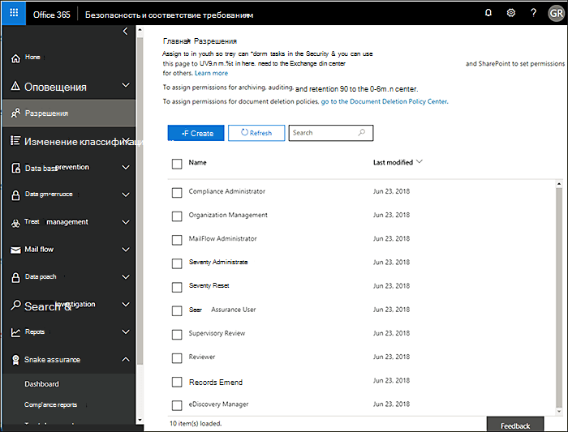
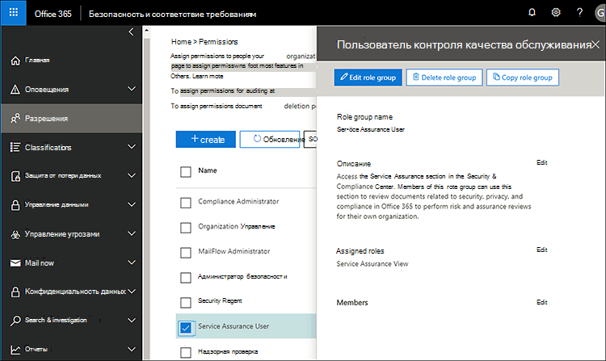

# Гарантия обслуживания в центре безопасности & соответствия требованиямService assurance in the Security & Compliance Center

Используйте службу Assurance в центре безопасности & соответствия требованиям, чтобы получить доступ к документам, описывающим различные темы, в том числе:Use Service assurance in the Security & Compliance Center to access documents that describe a variety of topics, including: 
  
- Методы безопасности Майкрософт для данных клиентов, хранящиеся в Office 365.Microsoft security practices for customer data that is stored in Office 365. 
    
- Независимые сторонние отчеты аудита Office 365.Independent third-party audit reports of Office 365. 
    
- Сведения о реализации и тестировании элементов управления для безопасности, конфиденциальности и соответствия требованиям, которые Office 365 использует для защиты данных.Implementation and testing details for security, privacy, and compliance controls that Office 365 uses to protect your data. 
    
Вы также можете узнать, как Office 365 может помочь клиентам соблюдать стандарты, законы и нормативные требования в отраслях, например:You can also find out how Office 365 can help customers comply with standards, laws, and regulations across industries, such as the:
  
-  Международная организация по стандартизации (ISO) 27001 и 27018International Organization for Standardization (ISO) 27001 and 27018 
    
- Акт 1996 года о передаче и защите данных учреждений здравоохранения (HIPAA)Health Insurance Portability and Accountability Act of 1996 (HIPAA)
    
- требованиям Федеральной программы управления рисками и авторизацией (FedRAMP);Federal Risk and Authorization Management Program (FedRAMP)
    
## Кто может получить доступ к службе Office 365 Service Assurance и как?Who can access Office 365 Service assurance, and how?

 **Новые клиенты и клиенты, оценивающие Microsoft Online Services,** могут получить доступ к службе контроля, входящей в состав планов Office 365 Enterprise E3 и "версия" (пробные и платные подписки).**New customers, and customers evaluating Microsoft online services** can access Service assurance which is included with Office 365 Enterprise E3 and E5 plans (both trial and paid subscriptions). Если у вас нет одного из этих планов и вы хотите попробовать службу Software Assurance, вы можете [зарегистрироваться в пробной версии Office 365 корпоративный](https://go.microsoft.com/fwlink/p/?LinkID=698279)"~".If you don't have one of these plans and want to try Service assurance, you can [sign-up for a trial of Office 365 Enterprise E5](https://go.microsoft.com/fwlink/p/?LinkID=698279). 
  
 **Существующие клиенты Microsoft 365 для бизнеса** могут получить доступ к службе Software Assurance.**Existing customers of Microsoft 365 for business** can access Service assurance. Если вы являетесь глобальным администратором (иногда именуемым администратором компании) для вашей организации, у вас уже есть доступ к службе Software Assurance, и вы можете использовать другие возможности.If you're the global admin (sometimes called company administrator) for your organization, you'll already have access to Service assurance, and you can onboard others. Если вы не являетесь глобальным администратором вашей организации и вам нужен доступ к службе Software Assurance, попросите администратора добавить вас в группу ролей "гарантия обслуживания".If you're not the global admin for your organization, and you need access to Service assurance, ask your admin to add you to the Service Assurance User role group. 
  
 **Участники подписки O365** могут получить доступ к разделу "гарантия обслуживания" в центре защиты Office365, если доступ к данным на основе ролей службы не был реализован в вашей подписке.**O365 Subscription Members** can access the Service assurance section in the Office365 Protection Center by default if Service assurance roles-based access has not been implemented in your subscription. Служба гарантии предоставляет отчеты и документы, которые описывают методы обеспечения безопасности Майкрософт для данных клиентов, хранящихся в Office 365.Service assurance provides reports and documents that describe Microsoft's security practices for customer data that's stored in Office 365. Кроме того, он предоставляет независимые сторонние отчеты аудита в Office 365.It also provides independent third-party audit reports on Office 365. 
  
> [!NOTE]
> Если ваша организация реализовала доступ на основе ролей на основе ролей в вашей подписке на Microsoft 365 (то есть если ваша организация предоставила доступ к настраиваемым отчетам), а вы хотите получить доступ к службе технической поддержки, но она не включена в область слева центра безопасности & соответствия требованиям, обратитесь к администратору Office 365, чтобы добавить вас в группу ролей "обслуживание" на странице **разрешений** .If your company has implemented Service Assurance Roles-Based Access in your Microsoft 365 Subscription (which could be if your organization has been provided access to custom reports), and you need access to Service assurance but it is not included in the left pane of the Security & Compliance Center, ask your Office 365 administrator to add you to the Service Assurance User role group on the **Permissions** page. Для получения дополнительных сведений обратитесь к статье дополнительные пользователи или группы, которые являются специалистами по обслуживанию.For more information, see Onboard other Service assurance users or groups. 
  
 **Пользователи, подготовленные к работе на основе ролей в службах Assurance** Если в вашей компании реализован доступ на основе ролей на основе ролей, вы можете предоставить доступ к гарантии безопасности всем сотрудникам системы безопасности и соответствия требованиям, в том числе информационную безопасность, управление рисками, соответствие требованиям, а также вести аудит команд и сотрудников в вашей организации.**Service assurance roles-based access-provisioned users** If your company has implemented Service assurance roles-based access, you can provide Service assurance access to all security and compliance personnel including information security, risk management, compliance, and audit teams and personnel within your organization. Дополнительные сведения см. в статье [Прочие пользователи или группы, которые](service-assurance.md#addother)являются специалистами службы.For details, see [Onboard other Service assurance users or groups](service-assurance.md#addother).
  
Чтобы получить доступ к службе, можно воспользоваться центром безопасности & соответствия требованиям.Service assurance is accessible by using the Security & Compliance Center. Вот как это сделать.Here's how to get to there.
  
1. Перейдите по ссылке [https://protection.office.com](https://protection.office.com).Go to [https://protection.office.com](https://protection.office.com).
    
2. Выполните вход с помощью рабочей или учебной учетной записи.Sign in using your work or school account. 
    
3. В левой области выберите пункт **гарантия обслуживания**.In the left pane, select **Service assurance**. Затем [выберите параметры отрасли и региональных стандартов](service-assurance.md#Chooseyourindustryregional) , а также [других пользователей или групп гарантии на обслуживание](service-assurance.md#addother).Next, [Choose your industry and regional settings](service-assurance.md#Chooseyourindustryregional) and [Onboard other Service assurance users or groups](service-assurance.md#addother).
    
    > [!NOTE]
    > Если вам необходим доступ к службе Assurance и она не включена в левой области центра безопасности & соответствия требованиям, обратитесь к администратору Office 365, чтобы добавить вас в группу ролей User Assurance на странице " **разрешения** ".If you need access to Service assurance, and it's not included in the left pane of the Security & Compliance Center, ask your Office 365 administrator to add you to the Service Assurance User role group on the **Permissions** page. 
  
## Выбор параметров отрасли и региональных стандартовChoose your industry and regional settings

Когда вы впервые получите доступ к службе Software Assurance, первый шаг — настройка промышленных и региональных параметров.When you access Service assurance for the first time, the first step is to configure your industry and regional settings. Вы можете изменить эти настройки в любое время.You can change these settings at any time. Настройка этих параметров позволяет обеспечить гарантию предоставления контента, наиболее релевантного для Организации.Configuring these settings enables Service assurance to provide you with content that is most relevant to your organization. Чтобы настроить параметры отрасли и региона:To configure your industry and region settings:
  
1. Когда вы получите доступ к службе контроля, выберите **Параметры** , а затем отобразите страницу "регион и отраслевые параметры", как показано на следующем снимке экрана.After you access Service assurance, select **Settings** and the Region and industry settings page displays as shown in the following screenshot. 
    
    
  
2. На странице **Параметры** щелкните стрелку вниз рядом с полем **регион** и проверьте соответствующие регионы в Организации.On the **Settings** page, select the down arrow next to **Region** and check the appropriate regions for your organization. 
    
3. Нажмите стрелку вниз рядом с элементом **отрасли** и проверьте соответствующие отрасли для вашей организации.Select the down arrow next to **Industry** and check the appropriate industries for your organization. 
    
4. После выбора областей и отраслей нажмите кнопку **сохранить**.Once you have selected regions and industries, select **Save**.
    
## Поиск, просмотр и загрузка соответствия требованиям и контенту доверияFind, review, and download compliance and trust content

Чтобы просмотреть и скачать контент, выберите параметр в области навигации:To review and download content, select an option from the navigation pane:
  
- **Отчеты о соответствии** для просмотра независимых аудиторий и оценок Office 365 и других облачных служб Майкрософт, как показано на следующем снимке экрана.**Compliance reports** to view independent audits and assessments of Office 365 and other Microsoft cloud services as shown in the following screen shot. 
    
    
  
- **Доверять документам** , чтобы просмотреть сведения о том, как корпорация Майкрософт работает с Office 365, как показано на следующем снимке экрана.**Trust documents** to view information about how Microsoft operates Office 365 as shown in the following screen shot. 
    
    
  
- **Аудит элементов управления** для просмотра сведений о том, как элементы управления Office 365 соответствуют требованиям безопасности, соответствия требованиям и конфиденциальности, как показано на следующем снимке экрана.**Audited controls** to view information about how Office 365 controls meet security, compliance, and privacy requirements, as shown in the following screen shot. 
    
    
  
Выберите отчет, который требуется скачать, и нажмите кнопку **сохранить** , чтобы скачать его на компьютер.Select the report you want to download, and select **Save** to download it to your computer. Для элементов управления, для которых ведется аудит, выберите нужный отчет и нажмите кнопку **скачать**.For Audited controls, select the report you want and then select **Download**. В приведенной ниже таблице описаны отчеты, которые можно найти на каждой странице обслуживания.The table below describes the reports you can find on each Service assurance page. 
  
> [!NOTE]
> Отчеты и документы гарантии службы можно загружать в течение не менее чем двенадцати месяцев после публикации или до тех пор, пока не станет доступна новая версия документа.Service assurance reports and documents are available to download for at least twelve months after publishing or until a new version of the document becomes available. 
  
|**Страница "гарантия обслуживания"****Service assurance page**|**Контент доступен****Content available**|**Описание****Description**|
|:-----|:-----|:-----|
|Отчеты о соответствииCompliance reports    | FedRampFedRamp     Оценка ГРКGRC Assessment     ISOISO     SOC/ССАЕSOC/SSAE    |Используйте отчеты о соответствии служб для просмотра оценок аудита, выполняемых сторонними независимыми аудиториями операций по доставке службы Office 365.Use service compliance reports to review audit assessments performed by third-party independent auditors of Office 365 Service Delivery Operations.    |
|Документы о защите данныхTrust documents    | Часто задаваемые вопросы и технические документыFAQ and White Papers     Отчеты об управлении рискамиRisk Management Reports    |Используйте официальные документы, часто задаваемые вопросы, отчеты о конце года и другие конфиденциальные ресурсы корпорации Майкрософт, которые предоставляются под соглашением о недоразглашении для оценки.Use white papers, FAQs, end-of-year reports and other Microsoft Confidential resources that are made available to you under non-disclosure agreement for your review / risk assessments.    |
|Элементы, для которых ведется аудитAudited controls    |Глобальные стандарты и нормативы, реализованные в Office 365.Global standards and regulations that Office 365 has implemented.    | Помощь в оценке риска при оценке, входящей миграции или использовании служб Office 365.Help with risk-assessment when you're evaluating, onboarding, or using Office 365 services. Узнать:Find out:     — Как элементы управления Office 365 соответствуют требованиям безопасности, соответствия требованиям и конфиденциальности.- How Office 365 controls meet security, compliance, and privacy requirements.   — Сведения о тестировании элементов управления в Office 365, результаты этих тестов и время их выполнения.-  About testing of controls in Office 365, results of these tests, and when they were completed.    |
   
В зависимости от конкретной настройки параметры, включенные в представление, могут иметь некоторые различия.Depending on your specific set-up, options included in your view might have some differences.
  
## Встроенные пользователи или группы, которые являются специалистами службыOnboard other Service assurance users or groups

Для доступа к отчетам по умолчанию, которые обычно доступны для всех облачных подписок Майкрософт, не требуется реализовывать модель доступа на основе ролей службы "гарантия", и вы можете пропустить этот шаг.For accessing default reports that are generally available across all Microsoft Cloud subscriptions, you don't need to implement the Service Assurance roles-based access model and you can skip this step. Тем не менее, если в Организации предоставлен доступ к настраиваемым отчетам, добавьте других пользователей или группы в роли гарантии службы.However, if your organization has been provided access to custom reports then please add other users or groups to the Service Assurance roles. Чтобы добавить пользователей или группы, выполните указанные ниже действия.To add other users or groups:
  
1. В центре безопасности & соответствие требованиям выберите **разрешения** в левой области, как показано на следующем снимке экрана.In the Security & Compliance Center, select **Permissions** in the left pane as shown in the following screenshot. 
    
    
  
2. В правой области выберите **пользователь Assurance**и выберите команду **изменить группу ролей**, а затем в разделе **Участники** нажмите кнопку **изменить** , чтобы добавить участников в роль пользователя "гарантия службы", как показано на следующем снимке экрана.In the right pane, select **Service Assurance User**, and then select **Edit Role Group**, and under the **Members** section, select **Edit** to add members to the Service Assurance User role as shown in the following screenshot. 
    
    
  
3. В следующем диалоговом окне найдите и выберите пользователей или группы, которым требуется доступ к отчетам о соответствии служб и доверию, а затем нажмите кнопку **Добавить** для каждого выбранного варианта и нажмите **X** в правом верхнем углу области, когда закончите.In the next dialog box, search for and choose individuals or groups that need to view Service assurance compliance reports and trust resources, then select **Add** for each selection you make and click the **X** in the upper right corner of the pane when you're finished. 
    
    
  
4. Каждый пользователь или группа, добавленные в роль пользователя "гарантия обслуживания", теперь могут найти сведения об обслуживании и отчетах по загрузке и другие документы в центре безопасности & соответствия требованиям.Every user or group that you added to the Service Assurance User role can now find Service assurance and download reports and other documents in the Security & Compliance Center.
    
Вернитесь на страницу **разрешений** в любое время, чтобы добавить дополнительных пользователей, или удалите существующие.Return to the **Permissions** page at any time to add more users, or remove existing ones. 
  
## Получение справки о гарантии на обслуживаниеGet help with Service assurance

[Обратитесь в службу поддержки для бизнес-продуктов: Справка для администраторов](https://support.office.com/article/32a17ca7-6fa0-4870-8a8d-e25ba4ccfd4b).[Contact support for business products - Admin Help](https://support.office.com/article/32a17ca7-6fa0-4870-8a8d-e25ba4ccfd4b).
  
## Вопросы и ответыFrequently Asked Questions

 **Почему я получаю сообщение об ошибке, сообщающее, что документы из службы Software Assurance повреждены?****Why am I getting an error saying that documents from Service assurance are corrupted?**
  
Большинство документов по обслуживанию службы представлены в формате PDF.Most Service assurance documents are in PDF format. Нажмите кнопку **сохранить** , чтобы сохранить эти файлы, а затем откройте их с локального компьютера.Choose **Save** to save these files to, and then open them up from, your local computer. 
