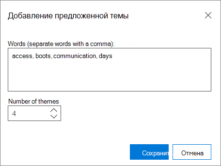

# Настройка параметров анализа в Advanced eDiscovery (классическая)Set Analyze options in Advanced eDiscovery (classic)

> [!NOTE]
> Чтобы можно было использовать Advanced eDiscovery, требуется подписка на Office 365 E3 с надстройкой Advanced Compliance или E5 для организации. Если у вас этого плана нет и вы хотите попробовать Advanced eDiscovery, можете [зарегистрироваться для получения пробной версии Office 365 корпоративный E5](https://go.microsoft.com/fwlink/p/?LinkID=698279).Advanced eDiscovery requires an Office 365 E3 with the Advanced Compliance add-on or an E5 subscription for your organization. If you don't have that plan and want to try Advanced eDiscovery, you can [sign up for a trial of Office 365 Enterprise E5](https://go.microsoft.com/fwlink/p/?LinkID=698279). 
  
В Advanced eDiscovery установите параметры анализа перед запуском "Анализ".In Advanced eDiscovery, set the Analyze options prior to running Analyze.
  
## Настройка параметров анализаSet Analyze options

Откройте **"Подготовка \> к анализу** \> **установки".**Open **Prepare \> Analyze** \> **Setup**. Отобразилось следующее окно.The following window is displayed.
  

  
 **Почти дубликаты и потоки электронной почты** Если вы хотите запустить анализ, поимите этот ящик.**Near-duplicates and email threads** Check this box if you want to run the analysis. Этот параметр выбран по умолчанию.It is selected by default. 
  
 **Сходство документов** Введите пороговое значение почти дубликатов или примите значение по умолчанию 65%.**Document similarity** Enter the Near-duplicates threshold value or accept the default of 65%. 
  
 **Темы** В этом поле можно обработать все файлы и назначить им темы.**Themes** Check this box to process all files and assign themes to them. По умолчанию этот ящик не выбран.By default, this check box is not selected. Если вы хотите выполнить обработку тем, введите следующие параметры.Enter the following options if you want to perform Themes processing.
  
- **Максимальное количество тем** Введите или выберите значение для количества создавайте темы.**Max number of themes** Enter or select a value for the number of themes to create. По умолчанию используется значение 200.The default is 200. 
    
    > [!NOTE]
    > Увеличение числа тем влияет на производительность, а также на возможность обобщения темы.Increasing the number of themes affects performance, as well as the ability of a theme to generalize. Чем больше тем, тем более детализированной они являются.The higher the number of themes, the more granular they are. Например, если набор из 50 тем включает тему, например "Федерация, юные, клипы, "Lakers"; 300 тем могут включать отдельные темы: "Музыка", "Клиперы", "Lakers".For example, if a set of 50 themes include a theme such as "Basketball, Spurs, Clippers, Lakers"; 300 themes may include separate themes: "Spurs", "Clippers", "Lakers". Если вы не знаете тему "Федерация" и используете эту функцию для ECA, может оказаться полезной тема "Висячай".If you had no awareness of the theme "Basketball" and use this feature for ECA, seeing the theme "Basketball" could be useful. Но если в обработке слишком много тем, возможно, вы никогда не увидите слово "Федерация" и не знаете, что "Стиминги" и "Клиперы" — это хорошие темы для просмотра, а не элементы, которые находятся в загрузке и используются для использования в качестве стрижков.But, if the processing had too many themes, you may never see the word "Basketball" and may not know that Spurs and Clippers are good Basketball themes to review, rather than items that go on boots and used for hair. 
  
- **Рекомендуемые темы** Вы можете предложить слова темы для управления обработкой тем.**Suggested themes** You can suggest theme words to control Themes processing. Advanced eDiscovery сосредоточится на этих предлагаемых словах и попытается создать одну или несколько релевантной темы на основе параметров "Максимальное количество тем".Advanced eDiscovery will focus on these suggested words and try to create one or more relevant themes, based on the "Max number of themes" settings. 
    
    Например, если предлагаемым словом является "компьютер", а вы указали "2" как "Максимальное число тем", Advanced eDiscovery попытается создать две темы, которые относятся к слову "компьютер".For example, if the suggested word is "computer", and you specified "2" as the "Max number of Themes", Advanced eDiscovery will try to generate two themes that relate to the word "computer". Эти две темы могут быть, например, "программное обеспечение компьютера" и "компьютерное оборудование".The two themes might be "computer software" and "computer hardware", for example. 
    
    
  
1. Чтобы просмотреть, добавить или изменить предложенные темы, нажмите кнопку **"Изменить".**To view, add, or edit suggested themes, click **Modify**.
    
2. На панели **"Предложенные темы"** щелкните **значок** "Добавить  тему.In the **Suggested themes** panel, click the **Add**  icon to add a theme. В области **"Добавить предложенную тему"** добавьте слова, разделенные запятой.In the **Add suggested theme** panel, add the words, separated by commas. 
    
3. In **Number of themes**, select a value to determine the number of themes Advanced eDiscovery will try to generate for these words (default is 1 theme).In **Number of themes**, select a value to determine the number of themes Advanced eDiscovery will try to generate for these words (default is 1 theme).
    
4. Нажмите **кнопку** "Сохранить", а затем закроем диалог.Click **Save** and then close the dialogue. 
    
    > [!NOTE]
    > Общее количество тем включает рекомендуемые темы.The total number of themes includes Suggested Themes. Общее число предлагаемых тем не может превышать общее число тем.The total Suggested Themes cannot exceed the total themes. Если по отношению к общему объему тем имеется много рекомендуемых тем, система обнаружит только несколько "новых" тем, так как большая часть тем будет выделена для рекомендуемых тем.If there are many Suggested Themes relative to the total themes, only a few "novel" themes will be detected by the system because most of the themes will be dedicated to Suggested Themes. 
  
- **Режим** В выпадаемом списке выберите параметр **"Темы":****Mode** From the drop-down list, select a **Themes** option: 
    
  - **Создание и применение модели:** вычисляет темы по моделям из сегмента файлов, а затем распределяет файлы между ними.**Create and apply model**: Calculates themes by models from a segment of the files and then distributes files among them.
    
  - **Create model**: Calculates a themes model from a segment of the files.**Create model**: Calculates a themes model from a segment of the files. Процесс применения деления файлов делается отдельно в другое время.The Apply process of dividing files is done separately at another time.
    
  - **Модель применения:** этот параметр отображается, только если модель была создана ранее и еще не применена.**Apply model**: This option is only shown if a model was created previously and not yet applied. При этом файлы будут делиться на основе тем.This will divide the files based on the themes.
    
Можно также настроить [игнорирование текста и](set-ignore-text-in-advanced-ediscovery.md) установить [дополнительные](set-analyze-advanced-settings-in-advanced-ediscovery.md) параметры анализа.You can also [set ignore text](set-ignore-text-in-advanced-ediscovery.md) and [set Analyze advanced settings](set-analyze-advanced-settings-in-advanced-ediscovery.md) for Analyze. 
  
После настройки этих параметров нажмите кнопку **"Анализ** для запуска".After you've set these options, click **Analyze** to run. [Отображаются результаты анализа](view-analyze-results-in-advanced-ediscovery.md) представления.[View Analyze results](view-analyze-results-in-advanced-ediscovery.md) are displayed. 
  
## Связанные статьиRelated topics

[Advanced eDiscovery (классическая версия)Advanced eDiscovery (classic)](office-365-advanced-ediscovery.md)
  
[Понимание сходства документовUnderstanding document similarity](understand-document-similarity-in-advanced-ediscovery.md)
  
[Настройка игнорирования текста Set Ignore text ](set-ignore-text-in-advanced-ediscovery.md)
  
[Настройка дополнительных параметров на вкладке "Анализ"Set Analyze advanced settings](set-analyze-advanced-settings-in-advanced-ediscovery.md)
  
[Просмотр результатов анализаView Analyze results](view-analyze-results-in-advanced-ediscovery.md)

