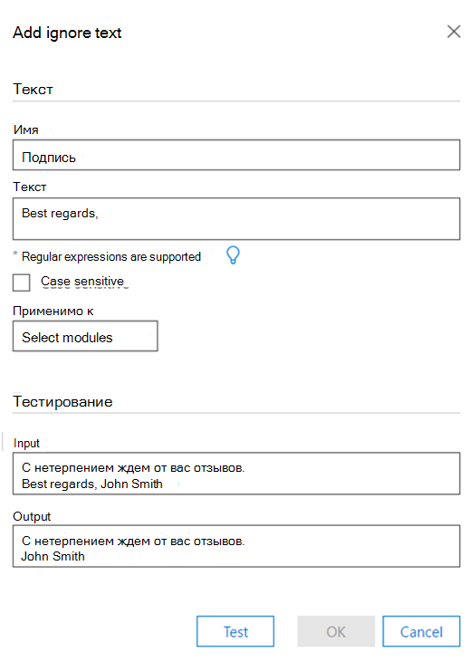
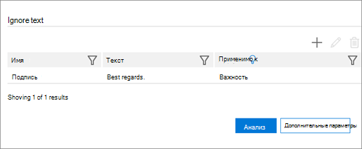

# Настройка параметра "Игнорировать текст" для анализа в Advanced eDiscovery (классическая)

> [!NOTE]
> Чтобы можно было использовать Advanced eDiscovery, требуется подписка на Office 365 E3 с надстройкой Advanced Compliance или E5 для организации. Если у вас этого плана нет и вы хотите попробовать Advanced eDiscovery, можете [зарегистрироваться для получения пробной версии Office 365 корпоративный E5](https://go.microsoft.com/fwlink/p/?LinkID=698279). 
  
Функция "Игнорировать текст" может применяться к всем или любым из следующих модулей Advanced eDiscovery: анализ (почти дубликаты, потоки электронной почты, темы) и релевантность. Пропущенный текст не будет отображаться в файлах, отображаемом в релевантности, а анализ и вычисления отклонят пропущенный текст.
  
Если функция "Игнорировать текст" ранее была определена для уже запускаемого модуля, параметр "Игнорировать текст" теперь будет защищен от изменения. Тем не менее, функцию "Игнорировать текст" для модуля релевантности можно изменить в любое время.
  
## Как применяются фильтры игнорирования текста

Несколько фильтров ignore Text применяются в том порядке, в который они были введены. Чтобы изменить порядок их применении, их необходимо удалить и повторно ввели в нужном порядке.
  
Например, если текстовое содержимое имеет следующий текст: "BOB BOB ALICEРОВОГО СИБ", примеры записей ignore Text и результаты, полученные этими записями:

|**Игнорирование текстовых записей**   |**Results**   |
|:-----|:-----|
|"ALICE", "BOB ALICE"    |"DAVE DAVE"    |
|"ALICE", "BOB ALICE ALICE ALICE ALICE"    |"BOB BOB DAVE"    |
   
Вторая запись "Игнорировать текст" не реализована, так как строка не найдена после первого обращения к тексту игнорирования.
  
## Использование регулярных выражений при определении игнорирования текста

Регулярные выражения поддерживаются для использования при определении игнорирования текста. Ниже примеры синтаксиса регулярных выражений и их использования.
  
- Чтобы удалить (игнорировать) текст из begin до конца строки:
    
     `Begin(.*)$`
    
    где "Begin" — это начальный вхождение этой строки в строке.
    
    Например, для следующего текста:
    
    **"Это первое предложение и первая строка**
    
    **Это второе предложение и вторая строка"**
    
    Регулярное выражение сначала(. \* ) $ приведет к:
    
    **"Это**
    
    **Это второе предложение и вторая строка"**
    
- Чтобы удалить заявления об отказе и юридические заявления, автоматически вставляемые в конце потока электронной почты:
    
     `Begin(.|\s)*End`
    
    где "Begin" и "End" — это уникальные строки в начале и конце текстового абзаца. 
    
    Например, следующее регулярное выражение удаляет заявления об отказе и юридические заявления, которые находились в потоке электронной почты между строками Begin и End:
    
    **Это сообщение содержит конфиденциальную информацию (.| \s) \* Если требуется проверка, запросим версию жесткого копирования**
    
- Чтобы удалить заявление об отказе (включая специальные символы): 
    
    Например, для следующего текста (с заявлением об отказе, представленным здесь x's): 
    
    **/\*\ Это сообщение содержит конфиденциальную информацию. xxxx xxxx**
    
    **xxxx xxxx xxxx xxxx xxxx xxxx xxxx xxxx**
    
    **Xxxx xxxx Если требуется проверка, запросив версию жесткого копирования. /\*\**
    
    Регулярное выражение для удаления вышеуказанного заявление об отказе должно быть: 
    
    **\/\\*\\Это сообщение содержит конфиденциальную \. информацию (.| \s) \* Если требуется проверка, запросим версию жесткого копирования \.\/\\*\\**
    
- Правила регулярных выражений:
    
  - Перед любыми символами, которые не являются частью алфавита, кроме пробелов, "_" и "-", должны предшествовать символы " \" .
    
  - Обычное поле eExpression может иметь неограниченную длину.
    
> [!TIP]
> Пояснения и подробный синтаксис регулярных выражений см. в кратком справочнике по языку [регулярных выражений.](https://msdn.microsoft.com/library/az24scfc%28v=vs.110%29.aspx) 
  
## Определение правила "Игнорировать текст"

1. На **вкладке "Управление \> \> анализом параметров"** в разделе "Игнорировать текст" щелкните значок, чтобы добавить  **+** правило. 
    
2. В **диалоговом** окте "Добавить игнорировать текст" в поле **"Имя"** введите имя правила "Игнорировать текст". 
    
    
  
3. В **текстовом** поле введите текст, который будет игнорироваться. Текстовое поле допускает неограниченное количество символов. 
    
    > [!TIP]
    > Как показано в окне выше, щелкните **световой** шарик, чтобы увидеть общие рекомендации по синтаксис для правила "Игнорировать текст". 
  
4. При **желании, в поле "С** конфиденциальным делом" выберите нужный. 
    
5. В **списке "Применить к"** выберите модули Advanced eDiscovery, в которых необходимо применить определение. 
    
6. Если вы хотите запустить тест для примера текста, введите пример текста в текстовое поле ввода и нажмите кнопку **"Тест".**  Результаты отображаются в текстовом поле **вывода.** 
    
7. Нажмите **кнопку "ОК",** чтобы сохранить правило "Игнорировать текст". Отобразилось определенное правило "Игнорировать текст". 
    
    
  
## См. также

[Advanced eDiscovery (классическая версия)](office-365-advanced-ediscovery.md)
  
[Понимание сходства документов](understand-document-similarity-in-advanced-ediscovery.md)
  
[Настройка параметров анализа](set-analyze-options-in-advanced-ediscovery.md)
  
[Настройка дополнительных параметров анализа](set-analyze-advanced-settings-in-advanced-ediscovery.md)
  
[Просмотр результатов анализа](view-analyze-results-in-advanced-ediscovery.md)

