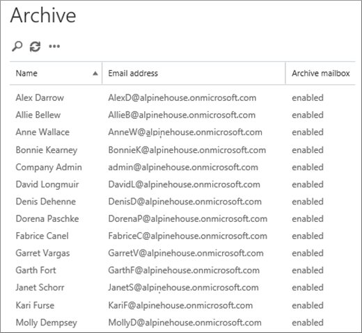
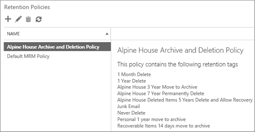

# <a name="set-up-an-archive-and-deletion-policy-for-mailboxes-in-your-organization"></a>Настройка политики архивации и удаления для почтовых ящиков в организации

В Microsoft 365 администраторы могут создать политику архивации и удаления, которая автоматически перемещает элементы в архивный почтовый ящик пользователя и автоматически удаляет элементы из почтового ящика. Для этого администратор создает политику хранения, назначенную почтовым ящикам, и перемещает элементы в архивный почтовый ящик пользователя через определенный период времени, а также удаляет элементы из почтового ящика после достижения определенного срока хранения. Фактические правила, которые определяют, какие элементы перемещаются или удаляются и когда это происходит, называются тегами хранения. Теги хранения связаны с политикой хранения, которая, в свою очередь, назначена почтовому ящику пользователя. Тег хранения применяет параметры хранения к отдельным сообщениям и папок в почтовом ящике пользователя. Он определяет, как долго сообщение остается в почтовом ящике и какие действия будут предприняты по достижении заданного периода хранения. Когда срок хранения сообщения достигает, оно либо перемещается в архивный почтовый ящик пользователя, либо удаляется.
  
В этой статье будет настроена политика архива и хранения для вымышленной организации с именем "Ингли Ул". Настройка этой политики включает следующие задачи:
  
- Включение архивного почтового ящика для каждого пользователя в организации. Это дает пользователям дополнительное хранилище почтовых ящиков и является обязательной для перемещения элементов в архивный почтовый ящик политикой хранения. Это также позволяет пользователю хранить архивные данные путем перемещения элементов в архивный почтовый ящик.

- Создание трех пользовательских тегов хранения, которые делают следующее:

  - Автоматически перемещает элементы трех лет в архивный почтовый ящик пользователя. Перемещение элементов в архивный почтовый ящик освободит место в основном почтовом ящике пользователя.

  - Автоматически удаляет элементы 5-летней давности из папки "Удаленные". Это также освободит место в основном почтовом ящике пользователя. При необходимости у пользователя будет возможность восстановить эти элементы. Дополнительные сведения см. в сноске в [разделе](#more-information) "Дополнительные сведения". 

  - Автоматически (и окончательно) удаляет элементы 7-летней давности из основного и архивного почтовых ящиков. Из-за нормативных требований некоторые организации обязаны хранить электронную почту в течение определенного периода времени. По истечении этого периода организации может потребоваться окончательно удалить эти элементы из почтовых ящиков пользователей.

- Создание новой политики хранения и добавление в нее новых пользовательских тегов хранения. Кроме того, вы также добавим встроенные теги хранения в новую политику хранения. К ним относятся личные теги, которые пользователи могут назначать для элементов в их почтовых ящиках. Вы также добавим тег хранения, который перемещает элементы из папки "Элементы с возможностью восстановления" в основном почтовом ящике пользователя в папку "Элементы с возможностью восстановления" в архивном почтовом ящике. Это помогает освободить место в папке "Элементы с восстановления" пользователя, когда его почтовый ящик помещается на удержание.

Чтобы настроить политику архивации и удаления для почтовых ящиков в своей организации, выполните некоторые или все действия, определенные в этой статье. Рекомендуется протестировать этот процесс на нескольких почтовых ящиках перед его реализацией во всех почтовых ящиках в организации.
  
## <a name="before-you-set-up-an-archive-and-deletion-policy"></a>Перед настройками политики архивации и удаления

- Для выполнения действий, которые необходимо выполнить в этой теме, необходимо быть глобальным администратором в организации. 

- При создании новой учетной записи пользователя и назначении ему лицензии на Exchange Online для пользователя автоматически создается почтовый ящик. После создания почтового ящика ему автоматически будет назначена политика хранения по умолчанию с именем Default MRM Policy. В этой статье мы создадим новую политику хранения, а затем назначим ее почтовым ящикам пользователей, заменив политику mrM по умолчанию. Почтовому ящику может быть назначена только одна политика хранения одновременно.

- Дополнительные информацию о тегах хранения и политиках хранения в Exchange Online см. в тегах хранения [и политиках хранения.](https://go.microsoft.com/fwlink/p/?LinkId=404424)

## <a name="step-1-enable-archive-mailboxes-for-users"></a>Шаг 1. Включить архивные почтовые ящики для пользователей

Первый шаг — включить архивный почтовый ящик для каждого пользователя в организации. Архивный почтовый ящик пользователя должен быть включен, чтобы тег хранения с действием хранения "Переместить в архив" можно было переместить элемент по истечении срока хранения.
  
> [!NOTE]
> Архивные почтовые ящики можно включить в любое время во время этого процесса, если они включены в определенный момент перед завершением процесса. Если архивный почтовый ящик не включен, никакие действия с элементами с назначенной политикой архивации или удаления не принимаются.
  
1. Перейдите по ссылке [https://protection.office.com](https://protection.office.com).

2. Во входе с помощью учетной записи глобального администратора.
    
3. В Центре безопасности & соответствия требованиям перейдите в **архив управления** \> **сведениями.**

    Отображается список почтовых ящиков в организации, а также включен или отключен соответствующий архивный почтовый ящик.

4. Выберите все почтовые ящики, щелкнув первый из них в списке, удерживая клавишу **SHIFT** и щелкнув последний из них в списке.

    > [!TIP]
    > На этом этапе предполагается, что архивные почтовые ящики не включены. Если у вас есть почтовые ящики с включенным архивом, удерживайте клавишу **CTRL** и щелкните каждый почтовый ящик с отключенным архивным почтовым ящиком. Кроме того,  можно щелкнуть заглавную строку столбца архивного почтового ящика, чтобы отсортировать строки в зависимости от того, включен или отключен архивный почтовый ящик, чтобы упростить выбор почтовых ящиков.
  
5. В области сведений в области массовой **правки нажмите** кнопку **"Включить".**

    Отображается предупреждение о том, что элементы старше двух лет будут перемещены в новый архивный почтовый ящик. Это происходит потому, что политика хранения по умолчанию, которая назначена новому почтовому ящику пользователя при его создания, имеет тег политики по умолчанию архива с сроком хранения 2 года. Срок хранения настраиваемого тега политики по умолчанию архива, который вы создадим на шаге 2, составляет 3 года. Это означает, что элементы старше 3 лет будут перемещены в архивный почтовый ящик.

6. Нажмите **кнопку** "Да", чтобы закрыть предупреждение и запустить процесс, чтобы включить архивный почтовый ящик для каждого выбранного почтового ящика.

7. После завершения процесса нажмите кнопку **"Обновить",**  **"Архив".**

    Архивный почтовый ящик включен для всех пользователей в организации.

    

## <a name="step-2-create-new-retention-tags-for-the-archive-and-deletion-policies"></a>Шаг 2. Создание новых тегов хранения для политик архивации и удаления

На этом этапе вы создадим три пользовательских тега хранения, которые были описаны ранее.
  
- 3 года перемещения в архив (настраиваемая политика архивов)

- 7-летнее окончательное удаление (настраиваемая политика удаления)

- 5 лет удаления и восстановления (настраиваемый тег для папки "Удаленные")

Чтобы создать новые теги хранения, используйте Центр администрирования Exchange (EAC) в организации Exchange Online. Не забудьте использовать классическую версию EAC.
  
1. Войдите в учетные данные [https://admin.protection.outlook.com/ecp/](https://admin.protection.outlook.com/ecp/) и войдите в нее.
  
2. В EAC перейдите к тегам хранения **для управления**  >  **соответствием требованиям**

    Отображается список тегов хранения для организации.

### <a name="create-a-custom-archive-default-policy-tag"></a>Создание настраиваемого тега политики по умолчанию для архива
  
Сначала необходимо создать настраиваемый тег политики по умолчанию (DPT) архива, который будет перемещать элементы в архивный почтовый ящик через 3 года.
  
1. На странице **"Теги хранения"** щелкните значок "Новый тег" и выберите автоматически примененный для всего почтового ящика   **(по умолчанию).**

2. На странице **"Новый тег", автоматически применяемый** к всему почтовому ящику (по умолчанию), заполнять следующие поля: 

    
  
   1. **Имя** Введите имя нового тега хранения. 

   2. **Действие хранения** Выберите **пункт "Переместить в архив",** чтобы переместить элементы в архивный почтовый ящик по истечении срока хранения.

   3. **Период хранения** Выберите, **когда элемент достигнет следующего возраста (в днях)** и введите срок хранения. В этом сценарии элементы будут перемещены в архивный почтовый ящик через 1095 дней (3 года).

   4. **Комментарий** (необязательно) Введите комментарий, поясняет назначение настраиваемого тега хранения.

3. Нажмите **кнопку** "Сохранить", чтобы создать настраиваемый архив DPT.

    Новый тег DPT архива отображается в списке тегов хранения.

### <a name="create-a-custom-deletion-default-policy-tag"></a>Создание настраиваемого тега политики удаления по умолчанию
  
Далее вы создадим другой пользовательский DPT, но это будет политика удаления, которая окончательно удаляет элементы через 7 лет.
  
1. На странице **"Теги хранения"** щелкните значок "Новый тег" и выберите автоматически примененный для всего почтового ящика   **(по умолчанию).**

2. На странице **"Новый тег", автоматически применяемый** к всему почтовому ящику (по умолчанию), заполнять следующие поля: 

    
  
   1. **Имя** Введите имя нового тега хранения. 

   2. **Действие хранения** Выберите **пункт "Окончательно** удалить", чтобы удалить элементы из почтового ящика по истечении срока хранения.

   3. **Период хранения** Выберите, **когда элемент достигнет следующего возраста (в днях)** и введите срок хранения. В этом сценарии элементы будут стерт через 2555 дней (7 лет).

   4. **Комментарий** (необязательно) Введите комментарий, поясняет назначение настраиваемого тега хранения. 

3. Нажмите **кнопку** "Сохранить", чтобы создать пользовательский DPT удаления. 

    Новый тег DPT удаления отображается в списке тегов хранения.

### <a name="create-a-custom-retention-policy-tag-for-the-deleted-items-folder"></a>Создание настраиваемого тега политики хранения для папки "Удаленные"
  
Последним созданным тегом хранения является настраиваемый тег политики хранения (RPT) для папки "Удаленные". Этот тег удаляет элементы в папке "Удаленные" через 5 лет и предоставляет период восстановления, в течение который пользователи могут восстановить элемент с помощью средства восстановления удаленных элементов.
  
1. На странице **"Теги хранения"** щелкните значок "Новый тег" и выберите автоматически примененный к папке   **умолчанию.**

2. На странице **"Новый тег",** автоматически применяемом к папке по умолчанию, заполните следующие поля:

    
  
   1. **Имя** Введите имя нового тега хранения. 

   2. **Применив этот тег к следующей папке по умолчанию** В выпадаемом списке выберите **"Удаленные".**

   3. **Действие хранения** Выберите **"Удалить"** и "Разрешить восстановление", чтобы удалить элементы по истечении срока хранения, но разрешить пользователям восстанавливать удаленный элемент в течение периода хранения удаленных элементов (по умолчанию он составляет 14 дней).

   4. **Период хранения** Выберите, **когда элемент достигнет следующего возраста (в днях)** и введите срок хранения. В этом сценарии элементы будут удалены через 1825 дней (5 лет).

   5. **Комментарий** (необязательно) Введите комментарий, поясняет назначение настраиваемого тега хранения. 

3. Нажмите **кнопку** "Сохранить", чтобы создать настраиваемый RPT для папки "Удаленные".

    Новый тег RPT отображается в списке тегов хранения.

## <a name="step-3-create-a-new-retention-policy"></a>Шаг 3. Создание новой политики хранения

После создания пользовательских тегов хранения необходимо создать новую политику хранения и добавить теги хранения. Вы добавим три пользовательских тега хранения, созданных на шаге 2, и встроенные теги, упомянутые в первом разделе. В шаге 4 вы назначите эту новую политику хранения почтовым ящикам пользователей.
  
1. В EAC перейдите к политикам хранения **для** управления  >  **соответствием** требованиям.

2. На странице **"Политики хранения"** щелкните **значок "Новый**  .

3. В поле **"Имя"** введите имя новой политики хранения; например, политика **архивации и удаления** в Регинах.

4. В **тегах хранения** щелкните **значок "Добавить**  новый".

    Отображается список тегов хранения в организации. Обратите внимание, что отображаются настраиваемые теги, созданные на шаге 2.

5. Добавьте 9 тегов хранения, которые выделены на следующем снимке экрана (эти теги более подробно описаны в разделе ["Дополнительные сведения").](#more-information) Чтобы добавить тег хранения, выберите его и нажмите кнопку **"Добавить".**

    
  
    > [!TIP]
    > Можно выбрать несколько тегов хранения, удерживая клавишу **CTRL** и щелкнув каждый тег. 
  
6. После того как вы добавили теги хранения, нажмите кнопку **ОК.**

7. На странице **"Создание политики хранения"** нажмите кнопку **"Сохранить",** чтобы создать новую политику.

    Новая политика хранения отображается в списке. Выберите его, чтобы отобразить связанные с ней теги хранения в области сведений.

    
  
## <a name="step-4-assign-the-new-retention-policy-to-user-mailboxes"></a>Шаг 4. Назначение новой политики хранения почтовым ящикам пользователей

При создания нового почтового ящика ему по умолчанию назначена политика хранения с именем Default MRM Policy. На этом этапе вы замените эту политику хранения (так как почтовому ящику может быть назначена только одна политика хранения), назначив новую политику хранения, созданную на шаге 3, почтовым ящикам пользователей в организации. На этом этапе предполагается, что вы назначите новую политику всем почтовым ящикам в организации.
  
1. В EAC перейдите к   >  **почтовым ящикам получателей.**

    Отображается список всех почтовых ящиков пользователей в организации.

2. Выберите все почтовые ящики, щелкнув первый из них в списке, удерживая клавишу **SHIFT** и щелкнув последний из них в списке. 

3. В области сведений в правой части EAC в области "Массовое изменение" **щелкните** **"Дополнительные параметры".**

4. В разделе **Политика хранения** щелкните **Обновить**.

5. На странице **"Массовое** назначение  политики хранения" в выпадаемом списке "Выберите политику хранения" выберите политику хранения, созданную на шаге 3; например, политика **архива и хранения в 1999 г.**

6. Нажмите **кнопку** "Сохранить", чтобы сохранить новое назначение политики хранения.

7. Чтобы убедиться, что почтовым ящикам назначена новая политика хранения, можно сделать следующее:

   1. Выберите почтовый ящик на странице **"Почтовые ящики"** и нажмите кнопку   "Изменить".

   2. На странице свойств почтового ящика для выбранного пользователя щелкните **"Функции почтового ящика".**

   Имя новой политики, назначенной почтовому ящику,  отображается в выпадаемом списке политики хранения.

## <a name="optional-step-5-run-the-managed-folder-assistant-to-apply-the-new-settings"></a>(Необязательно) Шаг 5. Запуск помощника для управляемых папок для применения новых параметров

После применения новой политики хранения к почтовым ящикам в шаге 4 может занять до 7 дней в Exchange Online, чтобы новые параметры хранения были применены к почтовым ящикам. Это вызвано тем,  что процесс, называемый помощником для управляемых папок, обрабатывает почтовые ящики не реже одного раза в 7 дней. Вместо того чтобы ждать запуска помощника для управляемых папок, вы можете принудительно выполнить это, задав в Exchange Online PowerShell управляемый запуск управляемой **папкиAssistant.**

 **Что происходит при запуске помощника для управляемых папок?** Он применяет параметры в политике хранения, проверяя элементы в почтовом ящике и определяя, подлежат ли они хранению. Затем он помечает элементы, к хранимые с помощью соответствующего тега хранения, а затем принимает указанное действие хранения для элементов, срок хранения для элементов с возрастом хранения.
  
Вот как подключиться к Exchange Online PowerShell, а затем запустить помощник для управляемых папок в каждом почтовом ящике в организации.

1. [Подключение к PowerShell для Exchange Online](https://go.microsoft.com/fwlink/p/?LinkId=517283).
  
2. Чтобы запустить помощник для управляемых папок для всех почтовых ящиков пользователей в организации, запустите следующие две команды.

    ```powershell
    $Mailboxes = Get-Mailbox -ResultSize Unlimited -Filter {RecipientTypeDetails -eq "UserMailbox"}
    ```

    ```powershell
    $Mailboxes.Identity | Start-ManagedFolderAssistant
    ```

Вот и все! Вы настроили политику архивации и удаления для организации "Регина- house".

> [!NOTE]
> Как было сказано ранее, помощник для управляемых папок обрабатывает почтовые ящики не реже одного раза в 7 дней. Поэтому помощник по обработке управляемых папок может обрабатывать почтовый ящик чаще. Кроме того, администраторы не могут предсказать, когда почтовый ящик будет обработан помощником для управляемых папок в следующий раз. Это одна из причин, по которой вы можете запустить его вручную. Однако если необходимо временно запретить помощнику для управляемых папок применять новые параметры хранения к почтовому ящику, можно выполнить команду, чтобы временно отключить обработку почтового ящика помощником для управляемых `Set-Mailbox -ElcProcessingDisabled $true` папок. Чтобы повторно включить помощник для управляемых папок для почтового ящика, запустите `Set-Mailbox -ElcProcessingDisabled $false` команду. Наконец, если у пользователя почтового ящика отключена учетная запись, мы не будем обрабатывать элементы перемещения в архив для этого почтового ящика.
  
## <a name="optional-step-6-make-the-new-retention-policy-the-default-for-your-organization"></a>(Необязательно) Шаг 6. Сделайте новую политику хранения политикой по умолчанию для организации

В шаге 4 необходимо назначить новую политику хранения существующим почтовым ящикам. Но вы можете настроить Exchange Online так, чтобы новая политика хранения была назначена новым почтовым ящикам, которые будут созданы в будущем. Это можно сделать с помощью Exchange Online PowerShell для обновления плана почтовых ящиков организации по умолчанию. План *почтового ящика* — это шаблон, который автоматически настраивает свойства новых почтовых ящиков.  На этом необязательном шаге можно заменить текущую политику хранения, назначенную плану почтовых ящиков (по умолчанию это политика MRM по умолчанию) политикой хранения, созданной на шаге 3. После обновления плана почтовых ящиков новая политика хранения будет назначена новым почтовым ящикам.

1. [Подключение к PowerShell для Exchange Online](https://go.microsoft.com/fwlink/p/?LinkId=517283).

2. Чтобы отобразить сведения о планах почтовых ящиков в организации, запустите следующую команду.

    ```powershell
    Get-MailboxPlan | Format-Table DisplayName,RetentionPolicy,IsDefault
    ```

    Обратите внимание на план почтового ящика, установленный по умолчанию.

3. Запустите следующую команду, чтобы назначить новую политику хранения, созданную на шаге 3 (например, "Архив и политика хранения в Евлийском архиве и политике хранения"), плану почтового ящика по умолчанию. В этом примере предполагается, что план почтовых ящиков по умолчанию называется **ExchangeOnlineEnterprise.**

    ```powershell
    Set-MailboxPlan "ExchangeOnlineEnterprise" -RetentionPolicy "Alpine House Archive and Retention Policy"
    ```

4. Чтобы убедиться, что политика хранения, назначенная плану почтовых ящиков по умолчанию, изменена, можно повторно использовать команду на шаге 2.

## <a name="more-information"></a>Дополнительные сведения

- Как рассчитывается срок хранения? Срок хранения элементов почтового ящика рассчитывается с даты доставки или создания таких элементов, как черновики сообщений, которые не отправляются, но создаются пользователем. Когда помощник для управляемых папок обрабатывает элементы в почтовом ящике, он помечает дату начала и дату окончания срока хранения для всех элементов, которые имеют теги хранения с действием хранения Удалить и разрешить восстановление или Удалить навсегда. Элементы с архивным тегом помечаются датой перемещения. 

- В следующей таблице приводится более подробная информация о каждом теге хранения, добавленного в настраиваемую политику хранения, созданную с помощью действий, которые были предприняты в этом разделе.

    | Тег хранения | Что делает этот тег | Встроенные или настраиваемые? | Тип |
    |:-----|:-----|:-----|:-----|
    |3 года, 3 года, 3 года, перемещение в архив  <br/> |Перемещает элементы со сроком давности 1095 дней (3 года) в архивный почтовый ящик.  <br/> |Настраиваемый [(см. шаг 2. Создание новых](#step-2-create-new-retention-tags-for-the-archive-and-deletion-policies)тегов хранения для политик архивации и удаления)  <br/> |Тег политики по умолчанию (архив); Этот тег автоматически применяется для всего почтового ящика.  <br/> |
    |7-летнее окончательное удаление в 12-летнем Евлийском  <br/> |Окончательно удаляет элементы основного или архивного почтового ящика, когда им 7 лет.  <br/> |Настраиваемый [(см. шаг 2. Создание новых](#step-2-create-new-retention-tags-for-the-archive-and-deletion-policies)тегов хранения для политик архивации и удаления)  <br/> |Тег политики по умолчанию (удаление); Этот тег автоматически применяется для всего почтового ящика.  <br/> |
    |5 лет, в течение 5 лет после удаления и восстановления в Евлии  <br/> |Удаляет элементы из папки "Удаленные" 5 лет. Пользователи могут восстановить эти элементы в течение 14 дней после их удаления.<sup>\*</sup> <br/> |Настраиваемый [(см. шаг 2. Создание новых](#step-2-create-new-retention-tags-for-the-archive-and-deletion-policies)тегов хранения для политик архивации и удаления)  <br/> |Тег политики хранения (удаленные элементы); Этот тег автоматически применяется к элементов в папке "Удаленные".  <br/> |
    |Элементы с возможностью восстановления через 14 дней перемещаются в архив  <br/> |Перемещает элементы, которые были в папке "Элементы с возможностью восстановления" в течение 14 дней, в папку "Элементы с возможностью восстановления" в архивном почтовом ящике.  <br/> |Встроенные  <br/> |Тег политики хранения (элементы для восстановления); Этот тег автоматически применяется к элементов в папке "Элементы с возможностью восстановления".  <br/> |
    |Нежеланая почта  <br/> |Окончательно удаляет элементы, которые были в папке нежелательной почты в течение 30 дней. Пользователи могут восстановить эти элементы в течение 14 дней после их удаления.<sup>\*</sup> <br/> |Встроенные  <br/> |Тег политики хранения (нежела та же почта); Этот тег автоматически применяется к элементу в папке нежелательной почты.  <br/> |
    |Удалять через 1 месяц  <br/> |Окончательно удаляет элементы, которые находятся в течение 30 дней. Пользователи могут восстановить эти элементы в течение 14 дней после их удаления.<sup>\*</sup> <br/> |Встроенные  <br/> |Личное; Этот тег может применяться пользователями.  <br/> |
    |Удалять через 1 год  <br/> |Окончательно удаляет элементы, которые находятся в течение 365 дней. Пользователи могут восстановить эти элементы в течение 14 дней после их удаления.<sup>\*</sup> <br/> |Встроенные  <br/> |Личное; Этот тег может применяться пользователями.  <br/> |
    |Никогда не удалять  <br/> |Этот тег предотвращает удаление элементов политикой хранения.  <br/> |Встроенные  <br/> |Личное; Этот тег может применяться пользователями.  <br/> |
    |Личный тег. Перемещать элементы в архив через 1 год  <br/> |Перемещает элементы в архивный почтовый ящик через 1 год.  <br/> |Встроенные  <br/> |Личное; Этот тег может применяться пользователями.  <br/> |

    > <sup>\*</sup> Пользователи могут использовать средство восстановления удаленных элементов в Outlook и Outlook в Интернете (прежнее название — Outlook Web App) для восстановления удаленного элемента в течение периода хранения удаленных элементов, который по умолчанию составляет 14 дней в Exchange Online. Администратор может использовать Windows PowerShell увеличить срок хранения удаленных элементов до 30 дней. Дополнительные сведения см. в статье "Восстановление удаленных элементов в Outlook для [Windows"](https://support.office.com/article/49e81f3c-c8f4-4426-a0b9-c0fd751d48ce) и изменение срока хранения удаленных элементов для почтового ящика [в Exchange Online](https://www.microsoft.com/?ref=go)
  
- Использование тега хранения "Элементы с возможностью восстановления **через 14** дней" "Переместить в архив" позволяет освободить место в папке "Элементы с возможностью восстановления" в основном почтовом ящике пользователя. Это полезно, когда почтовый ящик пользователя помещается на удержание, что означает, что почтовый ящик пользователя не удаляется окончательно. Без перемещения элементов в архивный почтовый ящик можно достичь квоты хранилища для папки "Элементы с возможностью восстановления" в основном почтовом ящике. Дополнительные сведения об этом и о том, как избежать этого, см. в под вопросе "Увеличение квоты элементов для восстановления" для почтовых ящиков на [удержании.](https://go.microsoft.com/fwlink/p/?LinkId=786479)
