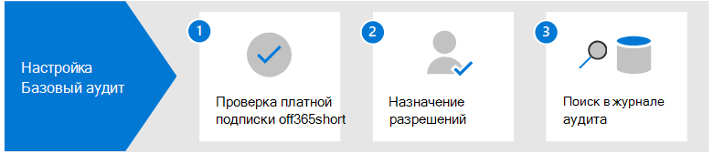

# Настройка базового аудита в Microsoft 365

Базовый аудит Microsoft 365 позволяет искать записи аудита для действий, выполняемых в различных службах Microsoft 365 пользователями и администраторами. Так как базовый аудит включен по умолчанию для большинства Microsoft 365 и Office 365 организаций, для поиска журнала аудита необходимо сделать только несколько вещей.

В этой статье обсуждаются следующие действия, необходимые для настройка базового аудита.

Эти действия включают обеспечение надлежащих организационных подписок и лицензирования пользователей, необходимых для создания и сохранения записей аудита, а также назначения разрешений членам группы операций безопасности, ИТ,соответствия требованиям и юридических групп, чтобы можно было искать журнал аудита.

Дополнительные сведения см. в [элементарной проверке в Microsoft 365.](auditing-solutions-overview.md#basic-audit)

## Шаг 1. Проверка подписки на организацию и лицензирования пользователей

Для лицензирования базового аудита требуется соответствующая подписка организации, которая предоставляет доступ к средству поиска журналов аудита и лицензированию для каждого пользователя, необходимому для входа и сохранения записей аудита.

Когда проверяемое действие выполняется пользователем или администратором, запись аудита создается и сохраняется в журнале аудита для вашей организации. В basic Audit записи аудита сохраняются и в журнале аудита можно искать в течение 90 дней.

Список требований к подписке и лицензированию для базового аудита см. в [Microsoft 365.](auditing-solutions-overview.md#licensing-requirements)

## Шаг 2. Назначение разрешений для поиска журнала аудита

Администраторам и членам групп расследований необходимо View-Only журналы аудита или журналы аудита в Exchange Online для поиска журнала аудита. Эти роли по умолчанию назначены группам ролей "Управление соответствием" и "Управление организацией" на странице **Разрешения** в Центре администрирования Exchange. Глобальные администраторы в Office 365 и Microsoft 365 автоматически добавляются в качестве членов группы ролей управления организацией в Exchange Online. Чтобы предоставить пользователю возможность поиска в журнале аудита с минимальным уровнем привилегий, вы можете создать пользовательскую группу ролей в Exchange Online, добавить роль «Журналы аудита только для просмотра» или «Журналы аудита», а затем добавить пользователя в качестве члена группы. новая ролевая группа. Дополнительные сведения см. в статье [Управление группами ролей в Exchange Online](/Exchange/permissions-exo/role-groups).

На следующем скриншоте показаны две роли, связанные с аудитом, которые назначены группе ролей управления организацией в центре администрирования Exchange организации.

## Шаг 3. Поиск журнала аудита

Теперь вы готовы к поиску журнала аудита в центре Microsoft 365 соответствия требованиям.

1. Перейдите и войдите в учетную запись, которая была <https://compliance.microsoft.com> назначена соответствующие разрешения аудита.

2. В левой области навигации центра Microsoft 365 нажмите кнопку **Показать** все и нажмите **кнопку Аудит**.

3. На странице **Аудит** настройте поиск с помощью следующих условий на вкладке **Поиск.** 

   

   1. **Диапазон дат и времени.** Выберите диапазон дат и времени, чтобы просмотреть события, которые произошли за этот период. Дата и время представлены по местному времени. Последние семь дней выбираются по умолчанию.
  
   2. **Действия**. Выберите действия для поиска. Используйте поле поиска для поиска действий для добавления в список. Неполный список проверенных действий см. в [перечне проверенных действий.](search-the-audit-log-in-security-and-compliance.md#audited-activities) Оставьте это поле пустым, чтобы вернуть записи для всех проверенных действий.
  
   3. **Пользователи**.  Щелкните в этом поле и начните вводить имя пользователей, чтобы отобразить результаты поиска. Записи журнала аудита для выбранных действий, выполняемые выбранными пользователями в этом поле, отображаются в списке результатов. Чтобы получить результаты для всех пользователей (и учетных записей служб) в организации, оставьте это поле пустым.
  
   4. **Файл, папка или сайт.** Введите некоторое или все имя файла или папки для поиска действий, связанных с файлом папки, содержащем указанное ключевое слово. Также можно указать URL-адрес файла или папки. Если используется URL-адрес файла или папки, убедитесь, что введите полный URL-адрес или введите часть URL-адреса, не включайте специальные символы или пробелы. Чтобы получить результаты для всех файлов и папок в организации, оставьте это поле пустым.

4. Нажмите **кнопку Поиск** для запуска поиска.

На новой странице отображается запущен поиск журнала аудита. После завершения поиска на странице отображаются записи аудита. Щелкните запись, чтобы отобразить страницу с подробными свойствами.

Дополнительные инструкции см. в [журнале поиска аудита в центре соответствия](search-the-audit-log-in-security-and-compliance.md)требованиям.
