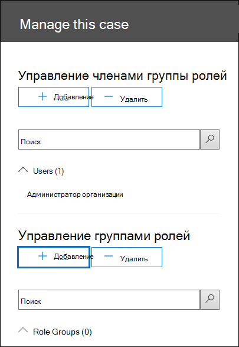

# <a name="set-up-compliance-boundaries-for-ediscovery-investigations"></a><span data-ttu-id="49e9b-103">Настройка границ соответствия для исследований обнаружения электронных данных</span><span class="sxs-lookup"><span data-stu-id="49e9b-103">Set up compliance boundaries for eDiscovery investigations</span></span>

<span data-ttu-id="49e9b-104">Рекомендации, приведенные в этой статье, можно применять при использовании базового обнаружения электронных данных или расширенного обнаружения электронных данных для управления расследованиям.</span><span class="sxs-lookup"><span data-stu-id="49e9b-104">The guidance in this article can be applied when using either Core eDiscovery or Advanced eDiscovery to manage investigations.</span></span>

<span data-ttu-id="49e9b-105">Границы соответствия требованиям создают логические границы в пределах организации, которые управляют расположениями содержимого пользователя (например, почтовыми ящиками, учетными записями OneDrive и сайтами SharePoint), которые руководители обнаружения электронных данных могут выполнять поиск.</span><span class="sxs-lookup"><span data-stu-id="49e9b-105">Compliance boundaries create logical boundaries within an organization that control the user content locations (such as mailboxes, OneDrive accounts, and SharePoint sites) that eDiscovery managers can search.</span></span> <span data-ttu-id="49e9b-106">Кроме того, границы соответствия требованиям контролируют, кто может получить доступ к делам eDiscovery, используемым для управления юридическим, человеческим персоналом или другим расследованиям в Организации.</span><span class="sxs-lookup"><span data-stu-id="49e9b-106">Also, compliance boundaries control who can access eDiscovery cases used to manage the legal, human resources, or other investigations within your organization.</span></span> <span data-ttu-id="49e9b-107">Потребность в границах соответствия требованиям часто требуется для многопользовательских компаний, которые должны учитывать географические платы и нормативы, а также для государственных учреждений, которые часто делятся на различные учреждения.</span><span class="sxs-lookup"><span data-stu-id="49e9b-107">The need for compliance boundaries is often necessary for multi-national corporations that have to respect geographical boarders and regulations and for governments, which are often divided into different agencies.</span></span> <span data-ttu-id="49e9b-108">В Microsoft 365 ограничения на соответствие требованиям обеспечивают соблюдение этих требований при выполнении поиска контента и управлении расследованиями с использованием eDiscovery.</span><span class="sxs-lookup"><span data-stu-id="49e9b-108">In Microsoft 365, compliance boundaries help you meet these requirements when performing content searches and managing investigations with eDiscovery cases.</span></span>
  
<span data-ttu-id="49e9b-109">Мы используем пример на приведенном ниже рисунке, чтобы объяснить, как работают границы соответствия требованиям.</span><span class="sxs-lookup"><span data-stu-id="49e9b-109">We use the example in the following illustration to explain how compliance boundaries work.</span></span>
  

  
<span data-ttu-id="49e9b-111">В этом примере Contoso LTD — это организация, состоящая из двух дочерних компаний, четвертого кофе и Coho Winery.</span><span class="sxs-lookup"><span data-stu-id="49e9b-111">In this example, Contoso LTD is an organization that consists of two subsidiaries, Fourth Coffee and Coho Winery.</span></span> <span data-ttu-id="49e9b-112">Для бизнеса необходимо, чтобы диспетчеры обнаружения электронных данных и исследования могли выполнять поиск только в почтовых ящиках Exchange, учетных записях OneDrive и сайтах SharePoint в их компетентном органе.</span><span class="sxs-lookup"><span data-stu-id="49e9b-112">The business requires that eDiscovery mangers and investigators can only search the Exchange mailboxes, OneDrive accounts, and SharePoint sites in their agency.</span></span> <span data-ttu-id="49e9b-113">Кроме того, менеджеры обнаружения и обнаружения электронных данных могут видеть только случаи обнаружения электронных данных в их агентствох, и они могут получать доступ только к тем случаям, в которых они являются участниками.</span><span class="sxs-lookup"><span data-stu-id="49e9b-113">Also, eDiscovery managers and investigators can only see eDiscovery cases in their agency, and they can only access the cases that they're a member of.</span></span> <span data-ttu-id="49e9b-114">Вот как границы соответствия требованиям соответствуют этим требованиям.</span><span class="sxs-lookup"><span data-stu-id="49e9b-114">Here's how compliance boundaries meet these requirements.</span></span>
  
- <span data-ttu-id="49e9b-115">Функции фильтрации разрешений поиска в поиске контента управляют расположением контента, в котором руководители обнаружения и обнаружения электронных данных могут выполнять поиск.</span><span class="sxs-lookup"><span data-stu-id="49e9b-115">The search permissions filtering functionality in Content Search controls the content locations that eDiscovery managers and investigators can search.</span></span> <span data-ttu-id="49e9b-116">Это означает, что менеджеры по обнаружению электронных данных и средства исследования в четвертом агентстве могут искать только расположения контента в четвертом представительстве кофе.</span><span class="sxs-lookup"><span data-stu-id="49e9b-116">This means eDiscovery managers and investigators in the Fourth Coffee agency can only search content locations in the Fourth Coffee subsidiary.</span></span> <span data-ttu-id="49e9b-117">Одно и то же ограничение распространяется на дочернюю компанию Coho Winery.</span><span class="sxs-lookup"><span data-stu-id="49e9b-117">The same restriction applies to the Coho Winery subsidiary.</span></span>

    <span data-ttu-id="49e9b-118">Группы ролей контролируют, кто может видеть случаи обнаружения электронных данных в центре безопасности & соответствия требованиям.</span><span class="sxs-lookup"><span data-stu-id="49e9b-118">Role groups control who can see the eDiscovery cases in the Security & Compliance Center.</span></span> <span data-ttu-id="49e9b-119">Это означает, что менеджеры по обнаружению электронных данных и изучению могут видеть только случаи обнаружения электронных данных в их компетентности.</span><span class="sxs-lookup"><span data-stu-id="49e9b-119">This means that eDiscovery managers and investigators can only see the eDiscovery cases in their agency.</span></span>

- <span data-ttu-id="49e9b-120">Группы ролей также контролируют, кто может назначать участников для случая обнаружения электронных данных.</span><span class="sxs-lookup"><span data-stu-id="49e9b-120">Role groups also control who can assign members to an eDiscovery case.</span></span> <span data-ttu-id="49e9b-121">Это означает, что менеджеры обнаружения электронных данных и средства исследования могут назначать участников только тем случаям, в которых они сами являются.</span><span class="sxs-lookup"><span data-stu-id="49e9b-121">This means eDiscovery managers and investigators can only assign members to cases that they themselves are a member of.</span></span>

<span data-ttu-id="49e9b-122">Вот процесс настройки границ соответствия требованиям:</span><span class="sxs-lookup"><span data-stu-id="49e9b-122">Here's the process for setting up compliance boundaries:</span></span>
  
[<span data-ttu-id="49e9b-123">Шаг 1: определение атрибута пользователя для определения ваших учреждений</span><span class="sxs-lookup"><span data-stu-id="49e9b-123">Step 1: Identify a user attribute to define your agencies</span></span>](#step-1-identify-a-user-attribute-to-define-your-agencies)

[<span data-ttu-id="49e9b-124">Шаг 2: Отправьте запрос в службу поддержки Майкрософт, чтобы синхронизировать атрибут пользователя с учетными записями OneDrive</span><span class="sxs-lookup"><span data-stu-id="49e9b-124">Step 2: File a request with Microsoft Support to synchronize the user attribute to OneDrive accounts</span></span>](#step-2-file-a-request-with-microsoft-support-to-synchronize-the-user-attribute-to-onedrive-accounts)

[<span data-ttu-id="49e9b-125">Шаг 3: создание группы ролей для каждого агентства</span><span class="sxs-lookup"><span data-stu-id="49e9b-125">Step 3: Create a role group for each agency</span></span>](#step-3-create-a-role-group-for-each-agency)

[<span data-ttu-id="49e9b-126">Шаг 4: Создание фильтра разрешений поиска для применения границы соответствия требованиям</span><span class="sxs-lookup"><span data-stu-id="49e9b-126">Step 4: Create a search permissions filter to enforce the compliance boundary</span></span>](#step-4-create-a-search-permissions-filter-to-enforce-the-compliance-boundary)

[<span data-ttu-id="49e9b-127">Шаг 5: создание дела обнаружения электронных данных для расследования внутри агентств</span><span class="sxs-lookup"><span data-stu-id="49e9b-127">Step 5: Create an eDiscovery case for an intra-agency investigations</span></span>](#step-5-create-an-ediscovery-case-for-intra-agency-investigations)

## <a name="before-you-set-up-compliance-boundaries"></a><span data-ttu-id="49e9b-128">Перед настройкой границ соответствия требованиям</span><span class="sxs-lookup"><span data-stu-id="49e9b-128">Before you set up compliance boundaries</span></span>

<span data-ttu-id="49e9b-129">Необходимо выполнить следующие предварительные требования перед тем, как атрибут Azure Active Directory (Azure AD), который вы намерены выполнить синхронизацию (на шаге 1), можно будет успешно синхронизировать с учетной записью пользователя OneDrive (на этапе 2):</span><span class="sxs-lookup"><span data-stu-id="49e9b-129">You have to meet the following prerequisites before the Azure Active Directory (Azure AD) attribute that you identity (in Step 1) can be successfully synched to a user's OneDrive account (in Step 2):</span></span>

- <span data-ttu-id="49e9b-130">Пользователям должна быть назначена лицензия на Exchange Online и лицензия SharePoint Online.</span><span class="sxs-lookup"><span data-stu-id="49e9b-130">Users must be assigned an Exchange Online license and a SharePoint Online license.</span></span>

- <span data-ttu-id="49e9b-131">Размер почтовых ящиков пользователей должен быть не менее 10 МБ.</span><span class="sxs-lookup"><span data-stu-id="49e9b-131">User mailboxes must be at least 10 MB in size.</span></span> <span data-ttu-id="49e9b-132">Если размер почтового ящика пользователя составляет менее 10 МБ, то атрибут, используемый для определения ваших учреждений, не будет синхронизирован с учетной записью пользователя в OneDrive.</span><span class="sxs-lookup"><span data-stu-id="49e9b-132">If a user's mailbox is less than 10 MB, the attribute used to define your agencies won't be synched to the user's OneDrive account.</span></span>

- <span data-ttu-id="49e9b-133">Границы соответствия требованиям и атрибуты, используемые для создания фильтров разрешений поиска, требуют синхронизации атрибутов Azure Active Directory (Azure AD) с почтовыми ящиками пользователей.</span><span class="sxs-lookup"><span data-stu-id="49e9b-133">Compliance boundaries and the attributes used to create search permissions filters require that Azure Active Directory (Azure AD) attributes are synchronized to user mailboxes.</span></span> <span data-ttu-id="49e9b-134">Чтобы убедиться, что атрибуты, которые вы хотите использовать, синхронизированы, выполните командлет [Get-User](https://docs.microsoft.com/powershell/module/exchange/get-user) в Exchange Online PowerShell.</span><span class="sxs-lookup"><span data-stu-id="49e9b-134">To verify that the attributes that you want to use have been synchronized, run the [Get-User](https://docs.microsoft.com/powershell/module/exchange/get-user) cmdlet in Exchange Online PowerShell.</span></span> <span data-ttu-id="49e9b-135">Выходные данные этого командлета отображают атрибуты Azure AD, синхронизированные с Exchange Online.</span><span class="sxs-lookup"><span data-stu-id="49e9b-135">The output of this cmdlet displays the Azure AD attributes synchronized to Exchange Online.</span></span>

## <a name="step-1-identify-a-user-attribute-to-define-your-agencies"></a><span data-ttu-id="49e9b-136">Шаг 1: определение атрибута пользователя для определения ваших учреждений</span><span class="sxs-lookup"><span data-stu-id="49e9b-136">Step 1: Identify a user attribute to define your agencies</span></span>

<span data-ttu-id="49e9b-137">Первый шаг — выбрать атрибут Azure AD, который будет использоваться для определения ваших учреждений.</span><span class="sxs-lookup"><span data-stu-id="49e9b-137">The first step is to choose an Azure AD attribute to use that will define your agencies.</span></span> <span data-ttu-id="49e9b-138">Этот атрибут используется для создания фильтра разрешений поиска, ограничивающего диспетчером обнаружения электронных данных поиском только расположений контента пользователей, которым назначено конкретное значение для этого атрибута.</span><span class="sxs-lookup"><span data-stu-id="49e9b-138">This attribute is used to create the search permissions filter that limits an eDiscovery manager to search only the content locations of users who are assigned a specific value for this attribute.</span></span> <span data-ttu-id="49e9b-139">Например, предположим, что компания Contoso решает использовать атрибут **Department** .</span><span class="sxs-lookup"><span data-stu-id="49e9b-139">For example, let's say Contoso decides to use the **Department** attribute.</span></span> <span data-ttu-id="49e9b-140">Значение этого атрибута для пользователей в четвертом представительстве кофе будет равно  `FourthCoffee`  , а значение для пользователей в Coho Wineryной дочерней компании будет `CohoWinery` .</span><span class="sxs-lookup"><span data-stu-id="49e9b-140">The value for this attribute for users in the Fourth Coffee subsidiary would be  `FourthCoffee`  and the value for users in Coho Winery subsidiary would be `CohoWinery`.</span></span> <span data-ttu-id="49e9b-141">На шаге 4 вы используете эту  `attribute:value`  комбинацию (например, *Department: FourthCoffee*), чтобы ограничить места для пользователей, которые руководители обнаружения электронных данных могут выполнять поиск.</span><span class="sxs-lookup"><span data-stu-id="49e9b-141">In Step 4, you use this  `attribute:value`  pair (for example, *Department:FourthCoffee*) to limit the user content locations that eDiscovery managers can search.</span></span> 
  
<span data-ttu-id="49e9b-142">Ниже приведен список пользовательских атрибутов Azure AD, которые можно использовать для разграничения соответствия требованиям:</span><span class="sxs-lookup"><span data-stu-id="49e9b-142">Here's a list of Azure AD user attributes that you can use for compliance boundaries:</span></span>
  
- <span data-ttu-id="49e9b-143">Company</span><span class="sxs-lookup"><span data-stu-id="49e9b-143">Company</span></span>

- <span data-ttu-id="49e9b-144">CustomAttribute1 — CustomAttribute15</span><span class="sxs-lookup"><span data-stu-id="49e9b-144">CustomAttribute1 - CustomAttribute15</span></span>

- <span data-ttu-id="49e9b-145">Отдел</span><span class="sxs-lookup"><span data-stu-id="49e9b-145">Department</span></span>

- <span data-ttu-id="49e9b-146">Кабинет</span><span class="sxs-lookup"><span data-stu-id="49e9b-146">Office</span></span>

- <span data-ttu-id="49e9b-147">C (двухбуквенный код страны) <sup>\*</sup></span><span class="sxs-lookup"><span data-stu-id="49e9b-147">C (Two-letter country code) <sup>\*</sup></span></span>

  > [!NOTE]
  > <span data-ttu-id="49e9b-148"><sup>\*</sup> Этот атрибут сопоставляется со свойством CountryOrRegion, которое возвращается при выполнении командлета **Get-User** в Exchange Online PowerShell.</span><span class="sxs-lookup"><span data-stu-id="49e9b-148"><sup>\*</sup> This attribute maps to the CountryOrRegion property that is returned by running the **Get-User** cmdlet in Exchange Online PowerShell.</span></span> <span data-ttu-id="49e9b-149">Командлет возвращает локализованное название страны, которое преобразуется из кода страны из двух букв.</span><span class="sxs-lookup"><span data-stu-id="49e9b-149">The cmdlet returns the localized country name, which is translated from the two-letter country code.</span></span> <span data-ttu-id="49e9b-150">Для получения дополнительных сведений обратитесь к описанию параметра CountryOrRegion в статье [Set – User](https://docs.microsoft.com/powershell/module/exchange/set-user) Reference Reference.</span><span class="sxs-lookup"><span data-stu-id="49e9b-150">For more information, see the CountryOrRegion parameter description in the [Set-User](https://docs.microsoft.com/powershell/module/exchange/set-user) cmdlet reference article.</span></span>

<span data-ttu-id="49e9b-151">Хотя доступны дополнительные атрибуты пользователей, особенно для почтовых ящиков Exchange, перечисленные выше атрибуты являются единственными, которые в настоящее время поддерживаются в OneDrive.</span><span class="sxs-lookup"><span data-stu-id="49e9b-151">Although more user attributes are available, particularly for Exchange mailboxes, the attributes listed above are the only ones currently supported by OneDrive.</span></span>
  
## <a name="step-2-file-a-request-with-microsoft-support-to-synchronize-the-user-attribute-to-onedrive-accounts"></a><span data-ttu-id="49e9b-152">Шаг 2: Отправьте запрос в службу поддержки Майкрософт, чтобы синхронизировать атрибут пользователя с учетными записями OneDrive</span><span class="sxs-lookup"><span data-stu-id="49e9b-152">Step 2: File a request with Microsoft Support to synchronize the user attribute to OneDrive accounts</span></span>

<span data-ttu-id="49e9b-153">Следующий шаг — файл запроса со службой поддержки Майкрософт, чтобы синхронизировать атрибут Azure AD, выбранный на шаге 1, со всеми учетными записями OneDrive в Организации.</span><span class="sxs-lookup"><span data-stu-id="49e9b-153">The next step is to file a request with Microsoft Support to synchronize the Azure AD attribute that you chose in Step 1 to all OneDrive accounts in your organization.</span></span> <span data-ttu-id="49e9b-154">После выполнения этой синхронизации атрибут (и его значение), выбранный на шаге 1, будет сопоставлен с скрытым управляемым свойством с именем `ComplianceAttribute` .</span><span class="sxs-lookup"><span data-stu-id="49e9b-154">After this synchronization occurs, the attribute (and its value) that you chose in Step 1 will be mapped to a hidden managed property named `ComplianceAttribute`.</span></span> <span data-ttu-id="49e9b-155">Этот атрибут используется для создания фильтра разрешений поиска для OneDrive в действии 4.</span><span class="sxs-lookup"><span data-stu-id="49e9b-155">You use this attribute to create the search permissions filter for OneDrive in Step 4.</span></span>
  
<span data-ttu-id="49e9b-156">Если вы отправите запрос в службу поддержки Майкрософт, включите следующие сведения:</span><span class="sxs-lookup"><span data-stu-id="49e9b-156">Include the following information when you submit the request to Microsoft support:</span></span>
  
- <span data-ttu-id="49e9b-157">Доменное имя Организации по умолчанию</span><span class="sxs-lookup"><span data-stu-id="49e9b-157">The default domain name of your organization</span></span>

- <span data-ttu-id="49e9b-158">Имя атрибута Azure AD (из шага 1)</span><span class="sxs-lookup"><span data-stu-id="49e9b-158">The name of the Azure AD attribute (from Step 1)</span></span>

- <span data-ttu-id="49e9b-159">Следующий заголовок или описание назначения запроса поддержки: "включить синхронизацию OneDrive для бизнеса с Azure AD для фильтров безопасности соответствия".</span><span class="sxs-lookup"><span data-stu-id="49e9b-159">The following title or description of the purpose of the support request: "Enable OneDrive for Business Synchronization with Azure AD for Compliance Security Filters".</span></span> <span data-ttu-id="49e9b-160">Это помогает отправить запрос в группу инженера обнаружения электронных данных, которая реализует запрос.</span><span class="sxs-lookup"><span data-stu-id="49e9b-160">This helps route the request to the eDiscovery engineering team who implements the request.</span></span>

<span data-ttu-id="49e9b-161">После внесения изменений и синхронизации атрибута с OneDrive служба поддержки Майкрософт отправляет вам номер сборки, в котором было внесено изменение, и оценочная Дата развертывания.</span><span class="sxs-lookup"><span data-stu-id="49e9b-161">After the engineering change is made and the attribute is synchronized to OneDrive, Microsoft Support will send you the build number that the change was made in and an estimated deployment date.</span></span> <span data-ttu-id="49e9b-162">После того как вы отправите запрос на поддержку, процесс развертывания обычно занимает 4 – 6 недель.</span><span class="sxs-lookup"><span data-stu-id="49e9b-162">The deployment process usually takes 4–6 weeks after you submit the support request.</span></span>
  
> [!IMPORTANT]
> <span data-ttu-id="49e9b-163">Вы можете выполнить шаг 3 до этапа 5 перед развертыванием этого изменения атрибута.</span><span class="sxs-lookup"><span data-stu-id="49e9b-163">You can complete Step 3 through Step 5 before this attribute change is deployed.</span></span> <span data-ttu-id="49e9b-164">Но при выполнении поиска контента не возвращаются документы из учетных записей OneDrive, указанных в фильтре разрешений поиска до тех пор, пока не будет развернута Синхронизация атрибутов.</span><span class="sxs-lookup"><span data-stu-id="49e9b-164">But running content searches won't return documents from OneDrive accounts that are specified in a search permissions filter until after the attribute synch is deployed.</span></span>
  
## <a name="step-3-create-a-role-group-for-each-agency"></a><span data-ttu-id="49e9b-165">Шаг 3: создание группы ролей для каждого агентства</span><span class="sxs-lookup"><span data-stu-id="49e9b-165">Step 3: Create a role group for each agency</span></span>

<span data-ttu-id="49e9b-166">Следующий шаг состоит в создании групп ролей в центре безопасности & соответствия требованиям, которые будут соответствовать вашим учреждениям.</span><span class="sxs-lookup"><span data-stu-id="49e9b-166">The next step is to create the role groups in the Security & Compliance Center that will align with your agencies.</span></span> <span data-ttu-id="49e9b-167">Рекомендуется создать группу ролей, скопировав встроенную группу "руководители обнаружения электронных данных", добавив соответствующие элементы и удалив роли, которые могут быть неприменимы к вашим потребностям.</span><span class="sxs-lookup"><span data-stu-id="49e9b-167">We recommend that you create a role group by copying the built-in eDiscovery Managers group, adding the appropriate members, and removing roles that may not be applicable to your needs.</span></span> <span data-ttu-id="49e9b-168">Дополнительные сведения о ролях, связанных с обнаружением электронных данных, приведены [в статье назначение разрешений обнаружения электронных данных в центре безопасности Office 365 & соответствия требованиям](assign-ediscovery-permissions.md).</span><span class="sxs-lookup"><span data-stu-id="49e9b-168">For more information about eDiscovery-related roles, see [Assign eDiscovery permissions in the Office‍ 365 Security & Compliance Center](assign-ediscovery-permissions.md).</span></span>
  
<span data-ttu-id="49e9b-169">Чтобы создать группы ролей, перейдите на страницу **разрешения** в центре безопасности & соответствия требованиям и создайте группу ролей для каждой команды в каждом агентстве, которая будет использовать границы соответствия требованиям и случаи обнаружения электронных данных для управления расследованиями.</span><span class="sxs-lookup"><span data-stu-id="49e9b-169">To create the role groups, go to the **Permissions** page in the Security & Compliance Center and create a role group for each team in each agency that will use compliance boundaries and eDiscovery cases to manage investigations.</span></span> 
  
<span data-ttu-id="49e9b-170">С помощью сценария "границы соответствия требованиям Contoso" необходимо создать четыре группы ролей и добавить в каждую из них соответствующие элементы.</span><span class="sxs-lookup"><span data-stu-id="49e9b-170">Using the Contoso compliance boundaries scenario, four role groups need to be created and the appropriate members added to each one.</span></span>
  
- <span data-ttu-id="49e9b-171">Четвертые менеджеры обнаружения электронных данных в кафе</span><span class="sxs-lookup"><span data-stu-id="49e9b-171">Fourth Coffee eDiscovery Managers</span></span>

- <span data-ttu-id="49e9b-172">Четвертые исследования</span><span class="sxs-lookup"><span data-stu-id="49e9b-172">Fourth Coffee Investigators</span></span>

- <span data-ttu-id="49e9b-173">Менеджеры обнаружения электронных данных Coho Winery</span><span class="sxs-lookup"><span data-stu-id="49e9b-173">Coho Winery eDiscovery Managers</span></span>

- <span data-ttu-id="49e9b-174">Coho Winery</span><span class="sxs-lookup"><span data-stu-id="49e9b-174">Coho Winery Investigators</span></span>
  
## <a name="step-4-create-a-search-permissions-filter-to-enforce-the-compliance-boundary"></a><span data-ttu-id="49e9b-175">Шаг 4: Создание фильтра разрешений поиска для применения границы соответствия требованиям</span><span class="sxs-lookup"><span data-stu-id="49e9b-175">Step 4: Create a search permissions filter to enforce the compliance boundary</span></span>

<span data-ttu-id="49e9b-176">После создания групп ролей для каждого агентства следующим шагом является создание фильтров разрешений поиска, которые связывают каждую группу ролей с определенным агентством, и определяет саму границу соответствия.</span><span class="sxs-lookup"><span data-stu-id="49e9b-176">After you've created role groups for each agency, the next step is to create the search permissions filters that associate each role group to its specific agency and defines the compliance boundary itself.</span></span> <span data-ttu-id="49e9b-177">Необходимо создать один фильтр разрешений поиска для каждого агентства.</span><span class="sxs-lookup"><span data-stu-id="49e9b-177">You need to create one search permissions filter for each agency.</span></span> <span data-ttu-id="49e9b-178">Дополнительные сведения о создании фильтров разрешений безопасности приведены в разделе [Настройка фильтрации разрешений для поиска контента](permissions-filtering-for-content-search.md).</span><span class="sxs-lookup"><span data-stu-id="49e9b-178">For more information about creating security permissions filters, see [Configure permissions filtering for Content Search](permissions-filtering-for-content-search.md).</span></span>
  
<span data-ttu-id="49e9b-179">Ниже приведен синтаксис, который используется для создания фильтра разрешений поиска, используемого для границ соответствия требованиям.</span><span class="sxs-lookup"><span data-stu-id="49e9b-179">Here's the syntax that's used to create a search permissions filter used for compliance boundaries.</span></span>

```powershell
New-ComplianceSecurityFilter -FilterName <name of filter> -Users <role groups> -Filters "Mailbox_<ComplianceAttribute>  -eq '<AttributeVale> '", "Site_<ComplianceAttribute>  -eq '<AttributeValue>' -or Site_Path -like '<SharePointURL>*'" -Action <Action >
```

<span data-ttu-id="49e9b-180">Ниже приведено описание каждого параметра в команде.</span><span class="sxs-lookup"><span data-stu-id="49e9b-180">Here's a description of each parameter in the command:</span></span>
  
- <span data-ttu-id="49e9b-181">`FilterName`: Задает имя фильтра.</span><span class="sxs-lookup"><span data-stu-id="49e9b-181">`FilterName`: Specifies the name of the filter.</span></span> <span data-ttu-id="49e9b-182">Используйте имя, описывающее или идентифицирующее агентство, в котором используется фильтр.</span><span class="sxs-lookup"><span data-stu-id="49e9b-182">Use a name that describes or identifies the agency that the filter is used in.</span></span>

- <span data-ttu-id="49e9b-183">`Users`: Указывает пользователей или группы, которые получают этот фильтр, примененный к выполняемым действиям при поиске контента.</span><span class="sxs-lookup"><span data-stu-id="49e9b-183">`Users`: Specifies the users or groups who get this filter applied to the Content Search actions they perform.</span></span> <span data-ttu-id="49e9b-184">Для границ соответствия этот параметр указывает группы ролей (которые вы создали на шаге 3) в агентство, для которого создается фильтр.</span><span class="sxs-lookup"><span data-stu-id="49e9b-184">For compliance boundaries, this parameter specifies the role groups (that you created in Step 3) in the agency that you're creating the filter for.</span></span> <span data-ttu-id="49e9b-185">Примечание Это многозначный параметр, чтобы можно было включить одну или несколько групп ролей, разделив их запятыми.</span><span class="sxs-lookup"><span data-stu-id="49e9b-185">Note this is a multi-value parameter so you can include one or more role groups, separated by commas.</span></span>

- <span data-ttu-id="49e9b-186">`Filters`: Задает критерии поиска для фильтра.</span><span class="sxs-lookup"><span data-stu-id="49e9b-186">`Filters`: Specifies the search criteria for the filter.</span></span> <span data-ttu-id="49e9b-187">Для границ соответствия необходимо определить следующие фильтры.</span><span class="sxs-lookup"><span data-stu-id="49e9b-187">For the compliance boundaries, you define the following filters.</span></span> <span data-ttu-id="49e9b-188">Каждый из них применяется к расположению содержимого.</span><span class="sxs-lookup"><span data-stu-id="49e9b-188">Each one applies to a content location.</span></span> 

    - <span data-ttu-id="49e9b-189">`Mailbox`: Указывает почтовые ящики, которые могут выполнять поиск групп ролей, определенных в  `Users` параметре.</span><span class="sxs-lookup"><span data-stu-id="49e9b-189">`Mailbox`: Specifies the mailboxes that the role groups defined in the  `Users` parameter can search.</span></span> <span data-ttu-id="49e9b-190">Для границ соответствия  *комплианцеаттрибуте*  — это тот же атрибут, который был определен в шаге 1, и  *AttributeValue*  указывает агентство.</span><span class="sxs-lookup"><span data-stu-id="49e9b-190">For compliance boundaries,  *ComplianceAttribute*  is the same attribute that you identified in Step 1 and  *AttributeValue*  specifies the agency.</span></span> <span data-ttu-id="49e9b-191">Этот фильтр позволяет членам группы ролей искать только почтовые ящики в определенном агентство; Пример: `"Mailbox_Department -eq 'FourthCoffee'"` .</span><span class="sxs-lookup"><span data-stu-id="49e9b-191">This filter allows members of the role group to search only the mailboxes in a specific agency; for example, `"Mailbox_Department -eq 'FourthCoffee'"`.</span></span> 

    - <span data-ttu-id="49e9b-192">`Site`: Указывает учетные записи OneDrive, которые могут выполнять поиск групп ролей, определенных в `Users` параметре.</span><span class="sxs-lookup"><span data-stu-id="49e9b-192">`Site`: Specifies the OneDrive accounts that the role groups defined in the `Users` parameter can search.</span></span> <span data-ttu-id="49e9b-193">Для фильтра OneDrive используйте собственно строку  `ComplianceAttribute` .</span><span class="sxs-lookup"><span data-stu-id="49e9b-193">For the OneDrive filter, use the actual string  `ComplianceAttribute`.</span></span> <span data-ttu-id="49e9b-194">Это сопоставлено с тем же атрибутом, который был определен в действии 1 и синхронизировано с учетными записями OneDrive в результате запроса на получение поддержки, отправленного в шаге 2. *AttributeValue*  указывает агентство.</span><span class="sxs-lookup"><span data-stu-id="49e9b-194">This maps to the same attribute that you identified in Step 1 and that's synchronized to OneDrive accounts as a result of the support request that you submitted in Step 2; *AttributeValue*  specifies the agency.</span></span> <span data-ttu-id="49e9b-195">Этот фильтр позволяет членам группы ролей искать только учетные записи OneDrive в определенном агентство; Пример:  `"Site_ComplianceAttribute -eq 'FourthCoffee'"` .</span><span class="sxs-lookup"><span data-stu-id="49e9b-195">This filter allows members of the role group to search only the OneDrive accounts in a specific agency; for example,  `"Site_ComplianceAttribute -eq 'FourthCoffee'"`.</span></span>

    - <span data-ttu-id="49e9b-196">`Site_Path`: Указывает сайты SharePoint, которые могут выполнять поиск в группах ролей, определенных в  `Users` параметре.</span><span class="sxs-lookup"><span data-stu-id="49e9b-196">`Site_Path`: Specifies the SharePoint sites that the role groups defined in the  `Users` parameter can search.</span></span> <span data-ttu-id="49e9b-197">*SharePointURL* указывает сайты в агентстве, которые могут выполнять поиск участниками группы ролей.</span><span class="sxs-lookup"><span data-stu-id="49e9b-197">The  *SharePointURL*  specifies the sites in the agency that members of the role group can search.</span></span> <span data-ttu-id="49e9b-198">Пример: `"Site_Path -like 'https://contoso.sharepoint.com/sites/FourthCoffee*'"`.</span><span class="sxs-lookup"><span data-stu-id="49e9b-198">For example,  `"Site_Path -like 'https://contoso.sharepoint.com/sites/FourthCoffee*'"`.</span></span> <span data-ttu-id="49e9b-199">Обратите внимание на то, что `Site` `Site_Path` фильтры соединены оператором **или** .</span><span class="sxs-lookup"><span data-stu-id="49e9b-199">Notice the `Site` and `Site_Path` filters are connected by an **-or** operator.</span></span>

     > [!NOTE]
     > <span data-ttu-id="49e9b-200">Синтаксис `Filters` параметра включает *список "фильтры*".</span><span class="sxs-lookup"><span data-stu-id="49e9b-200">The syntax for the `Filters` parameter includes a *filters list*.</span></span> <span data-ttu-id="49e9b-201">Список фильтров это фильтр, включающий фильтр почтовых ящиков и фильтр сайтов, разделенный запятыми.</span><span class="sxs-lookup"><span data-stu-id="49e9b-201">A filters list is a filter that includes a mailbox filter and a site filter separated by a comma.</span></span> <span data-ttu-id="49e9b-202">Обратите внимание, что в предыдущем примере запятая разделяет **Mailbox_ComplianceAttribute** и **Site_ComplianceAttribute**: `-Filters "Mailbox_<ComplianceAttribute>  -eq '<AttributeVale> '", "Site_ComplianceAttribute  -eq '<AttributeValue>' -or Site_Path -like '<SharePointURL>*'"` .</span><span class="sxs-lookup"><span data-stu-id="49e9b-202">In the previous example, notice that a comma separates **Mailbox_ComplianceAttribute** and **Site_ComplianceAttribute**: `-Filters "Mailbox_<ComplianceAttribute>  -eq '<AttributeVale> '", "Site_ComplianceAttribute  -eq '<AttributeValue>' -or Site_Path -like '<SharePointURL>*'"`.</span></span> <span data-ttu-id="49e9b-203">Когда этот фильтр обрабатывается во время выполнения поиска контента, в списке фильтры создаются два фильтра разрешений на поиск: один фильтр почтовых ящиков и один фильтр сайта.</span><span class="sxs-lookup"><span data-stu-id="49e9b-203">When this filter is processed during the running of a content search, two search permissions filters are created from the filters list: one mailbox filter and one site filter.</span></span> <span data-ttu-id="49e9b-204">Альтернативой использованию списка фильтров является создание двух отдельных фильтров разрешений поиска для каждого агентства: один фильтр разрешений на поиск для атрибута почтовых ящиков и один фильтр для атрибутов сайта.</span><span class="sxs-lookup"><span data-stu-id="49e9b-204">An alternative to using a filters list would be to create two separate search permissions filters for each agency: one search permissions filter for the mailbox attribute and one filter for the site attributes.</span></span> <span data-ttu-id="49e9b-205">В обоих случаях результаты будут одинаковыми.</span><span class="sxs-lookup"><span data-stu-id="49e9b-205">In either case, the results will be the same.</span></span> <span data-ttu-id="49e9b-206">Использование списка фильтров или создание отдельных фильтров разрешений на поиск зависит от предпочтения.</span><span class="sxs-lookup"><span data-stu-id="49e9b-206">Using a filters list or creating separate search permissions filters is a matter of preference.</span></span>

- <span data-ttu-id="49e9b-207">`Action`: Указывает тип действия поиска соответствия, к которому применяется фильтр.</span><span class="sxs-lookup"><span data-stu-id="49e9b-207">`Action`: Specifies the type of Compliance Search action that the filter is applied to.</span></span> <span data-ttu-id="49e9b-208">Например,  `-Action Search` Фильтр применяется только в том случае, когда члены группы ролей, определенные в `Users` параметре, выполняют поиск контента.</span><span class="sxs-lookup"><span data-stu-id="49e9b-208">For example,  `-Action Search` would only apply the filter when members of the role group defined in the `Users` parameter run a content search.</span></span> <span data-ttu-id="49e9b-209">В этом случае фильтр не будет применен при экспорте результатов поиска.</span><span class="sxs-lookup"><span data-stu-id="49e9b-209">In this case, the filter wouldn't be applied when exporting search results.</span></span> <span data-ttu-id="49e9b-210">Для обеспечения соответствия требованиям примените  `-Action All` фильтр ко всем действиям поиска.</span><span class="sxs-lookup"><span data-stu-id="49e9b-210">For compliance boundaries, use  `-Action All` so the filter applies to all search actions.</span></span> 

    <span data-ttu-id="49e9b-211">Список действий по поиску контента представлен в разделе "New – ComplianceSecurityFilter" в разделе [Настройка фильтрации разрешений для поиска контента](permissions-filtering-for-content-search.md#new-compliancesecurityfilter).</span><span class="sxs-lookup"><span data-stu-id="49e9b-211">For a list of the Content Search actions, see the "New-ComplianceSecurityFilter" section in [Configure permissions filtering for Content Search](permissions-filtering-for-content-search.md#new-compliancesecurityfilter).</span></span>

<span data-ttu-id="49e9b-212">Ниже приведены примеры двух фильтров разрешений поиска, которые будут созданы для поддержки сценария "границы соответствия требованиям Contoso".</span><span class="sxs-lookup"><span data-stu-id="49e9b-212">Here are examples of the two search permissions filters that would be created to support the Contoso compliance boundaries scenario.</span></span> <span data-ttu-id="49e9b-213">В обоих примерах используется список фильтров с разделителями-запятыми, в котором фильтры почтовых ящиков и сайтов включаются в один фильтр разрешений поиска и разделяются запятыми.</span><span class="sxs-lookup"><span data-stu-id="49e9b-213">Both of these examples include a comma-separated filters list, in which the mailbox and site filters are included in the same search permissions filter and are separated by a comma.</span></span>
  
### <a name="fourth-coffee"></a><span data-ttu-id="49e9b-214">Четвертый кофе</span><span class="sxs-lookup"><span data-stu-id="49e9b-214">Fourth Coffee</span></span>

```powershell
New-ComplianceSecurityFilter -FilterName "Fourth Coffee Security Filter" -Users "Fourth Coffee eDiscovery Managers", "Fourth Coffee Investigators" -Filters "Mailbox_Department -eq 'FourthCoffee'", "Site_ComplianceAttribute -eq 'FourthCoffee' -or Site_Path -like 'https://contoso.sharepoint.com/sites/FourthCoffee*'" -Action ALL
```

### <a name="coho-winery"></a><span data-ttu-id="49e9b-215">Coho Winery</span><span class="sxs-lookup"><span data-stu-id="49e9b-215">Coho Winery</span></span>

```powershell
New-ComplianceSecurityFilter -FilterName "Coho Winery Security Filter" -Users "Coho Winery eDiscovery Managers", "Coho Winery Investigators" -Filters "Mailbox_Department -eq 'CohoWinery'", "Site_ComplianceAttribute -eq 'CohoWinery' -or Site_Path -like 'https://contoso.sharepoint.com/sites/CohoWinery*'" -Action ALL
```

## <a name="step-5-create-an-ediscovery-case-for-intra-agency-investigations"></a><span data-ttu-id="49e9b-216">Шаг 5: создание дела обнаружения электронных данных для расследования внутри агентств</span><span class="sxs-lookup"><span data-stu-id="49e9b-216">Step 5: Create an eDiscovery case for intra-agency investigations</span></span>

<span data-ttu-id="49e9b-217">Последним шагом является создание дела обнаружения электронных данных в центре безопасности & соответствия требованиям, а затем Добавление группы ролей, созданной на шаге 3, в качестве участника этого дела.</span><span class="sxs-lookup"><span data-stu-id="49e9b-217">The final step is to create a eDiscovery case in the Security & Compliance Center and then add the role group that you created in Step 3 as a member of the case.</span></span> <span data-ttu-id="49e9b-218">Это приводит к двум важным характеристикам использования границ соответствия требованиям:</span><span class="sxs-lookup"><span data-stu-id="49e9b-218">This results in two important characteristics of using compliance boundaries:</span></span>
  
- <span data-ttu-id="49e9b-219">Только участники группы ролей, добавленные в обращение, смогут просматривать и получать доступ к делам в центре безопасности & соответствия требованиям.</span><span class="sxs-lookup"><span data-stu-id="49e9b-219">Only members of the role group added to the case will be able to see and access the case in the Security & Compliance Center.</span></span> <span data-ttu-id="49e9b-220">Например, если четвертая группа ролей в кафе является единственным участником, то участники четвертой группы ролей "кафе eDiscovery" (или члены любой другой группы ролей) не смогут просматривать обращение и получать к нему доступ.</span><span class="sxs-lookup"><span data-stu-id="49e9b-220">For example, if the Fourth Coffee Investigators role group is the only member of a case, then members of the Fourth Coffee eDiscovery Managers role group (or members of any other role group) won't be able to see or access the case.</span></span>

- <span data-ttu-id="49e9b-221">Когда участник группы ролей, назначенный для обращения, выполняет поиск, связанный с этим обращением, он будет иметь возможность выполнять поиск в расположениях контента в рамках своего агентства (которое определяется фильтром разрешений поиска, созданным на шаге 4).</span><span class="sxs-lookup"><span data-stu-id="49e9b-221">When a member of the role group assigned to a case runs a search associated with the case, they will only be able to search the content locations within their agency (which is defined by the search permissions filter that you created in Step 4.)</span></span>

<span data-ttu-id="49e9b-222">Чтобы создать обращение и назначить элементы:</span><span class="sxs-lookup"><span data-stu-id="49e9b-222">To create a case and assign members:</span></span>

1. <span data-ttu-id="49e9b-223">Перейдите на страницу **обнаружения электронных** данных или **расширенного обнаружения электронных** данных в центре безопасности & соответствия требованиям и создайте обращение.</span><span class="sxs-lookup"><span data-stu-id="49e9b-223">Go to the **eDiscovery** or **Advanced eDiscovery** page in the Security & Compliance Center and create a case.</span></span>

2. <span data-ttu-id="49e9b-224">В списке вариантов обнаружения электронных данных щелкните имя созданного вами случая.</span><span class="sxs-lookup"><span data-stu-id="49e9b-224">In the list of eDiscovery cases, click the name of the case you created.</span></span>

3. <span data-ttu-id="49e9b-225">На всплывающей странице **Управление этим обращением** в разделе **Управление группами ролей** нажмите кнопку  **Добавить**.</span><span class="sxs-lookup"><span data-stu-id="49e9b-225">In the **Manage this case** flyout page, under **Manage role groups**, click  **Add**.</span></span>

    
  
4. <span data-ttu-id="49e9b-227">В списке групп ролей выберите одну из групп ролей, созданных на шаге 3, и нажмите кнопку **Добавить**.</span><span class="sxs-lookup"><span data-stu-id="49e9b-227">In the list of role groups, select one of the role groups that you created in Step 3, and click **Add**.</span></span>

5. <span data-ttu-id="49e9b-228">В всплывающем окне **Управление этим обращением** нажмите кнопку **сохранить** , чтобы сохранить изменения.</span><span class="sxs-lookup"><span data-stu-id="49e9b-228">Click **Save** on the **Manage this case** flyout to save the change.</span></span>

## <a name="searching-and-exporting-content-in-multi-geo-environments"></a><span data-ttu-id="49e9b-229">Поиск и экспорт контента в средах с поддержкой нескольких регионов</span><span class="sxs-lookup"><span data-stu-id="49e9b-229">Searching and exporting content in Multi-Geo environments</span></span>

<span data-ttu-id="49e9b-230">Фильтры разрешений поиска также позволяют контролировать место маршрутизации контента для экспорта и то, какой центр обработки данных может выполнять поиск при поиске расположений содержимого в [среде SharePoint с поддержкой нескольких регионов](https://go.microsoft.com/fwlink/?linkid=860840).</span><span class="sxs-lookup"><span data-stu-id="49e9b-230">Search permissions filters also let you control where content is routed for export and which datacenter can be searched when searching content locations in a [SharePoint Multi-Geo environment](https://go.microsoft.com/fwlink/?linkid=860840).</span></span>
  
- <span data-ttu-id="49e9b-231">**Экспорт результатов поиска:** Вы можете экспортировать результаты поиска из почтовых ящиков Exchange, сайтов SharePoint и учетных записей OneDrive из определенного центра обработки данных.</span><span class="sxs-lookup"><span data-stu-id="49e9b-231">**Export search results:** You can export the search results from Exchange mailboxes, SharePoint sites, and OneDrive accounts from a specific datacenter.</span></span> <span data-ttu-id="49e9b-232">Это означает, что вы можете указать расположение центра обработки данных, из которого будут экспортироваться результаты поиска.</span><span class="sxs-lookup"><span data-stu-id="49e9b-232">This means that you can specify the datacenter location that search results will be exported from.</span></span>

    <span data-ttu-id="49e9b-233">Используйте параметр **Region** для командлетов **New/ComplianceSecurityFilter** или **Set – ComplianceSecurityFilter** , чтобы создать или изменить центр обработки данных, через который будет маршрутизироваться экспорт.</span><span class="sxs-lookup"><span data-stu-id="49e9b-233">Use the **Region** parameter for **New-ComplianceSecurityFilter** or **Set-ComplianceSecurityFilter** cmdlets to create or change which datacenter the export will be routed through.</span></span>
  
    |<span data-ttu-id="49e9b-234">**Значение параметра**</span><span class="sxs-lookup"><span data-stu-id="49e9b-234">**Parameter value**</span></span>|<span data-ttu-id="49e9b-235">**Расположение центра обработки данных**</span><span class="sxs-lookup"><span data-stu-id="49e9b-235">**Datacenter location**</span></span>|
    |:-----|:-----|
    |<span data-ttu-id="49e9b-236">NAM</span><span class="sxs-lookup"><span data-stu-id="49e9b-236">NAM</span></span>  <br/> |<span data-ttu-id="49e9b-237">Северная Америка (центры обработки данных в США)</span><span class="sxs-lookup"><span data-stu-id="49e9b-237">North American (datacenters are in the US)</span></span>  <br/> |
    |<span data-ttu-id="49e9b-238">EUR</span><span class="sxs-lookup"><span data-stu-id="49e9b-238">EUR</span></span>  <br/> |<span data-ttu-id="49e9b-239">Европа</span><span class="sxs-lookup"><span data-stu-id="49e9b-239">Europe</span></span>  <br/> |
    |<span data-ttu-id="49e9b-240">APC</span><span class="sxs-lookup"><span data-stu-id="49e9b-240">APC</span></span>  <br/> |<span data-ttu-id="49e9b-241">Азиатско-Тихоокеанский регион</span><span class="sxs-lookup"><span data-stu-id="49e9b-241">Asia Pacific</span></span>  <br/> |
    |<span data-ttu-id="49e9b-242">CAN</span><span class="sxs-lookup"><span data-stu-id="49e9b-242">CAN</span></span> <br/> |<span data-ttu-id="49e9b-243">Канада</span><span class="sxs-lookup"><span data-stu-id="49e9b-243">Canada</span></span>|
    |||

- <span data-ttu-id="49e9b-244">**Поиск по маршруту контента:** Вы можете маршрутизировать поиск контента сайтов SharePoint и учетных записей OneDrive в вспомогательный центр обработки данных.</span><span class="sxs-lookup"><span data-stu-id="49e9b-244">**Route content searches:** You can route the content searches of SharePoint sites and OneDrive accounts to a satellite datacenter.</span></span> <span data-ttu-id="49e9b-245">Это означает, что вы можете указать расположение центра обработки данных, в котором будет выполняться поиск.</span><span class="sxs-lookup"><span data-stu-id="49e9b-245">This means you can specify the datacenter location where searches will be run.</span></span>

    <span data-ttu-id="49e9b-246">Используйте одно из следующих значений параметра **Region** для управления расположением центра обработки данных, в котором будут выполняться запросы при поиске на сайтах SharePoint и в учетных записях OneDrive.</span><span class="sxs-lookup"><span data-stu-id="49e9b-246">Use one of the following values for the **Region** parameter to control the datacenter location that searches will run in when searching SharePoint sites and OneDrive accounts.</span></span> 
  
    |<span data-ttu-id="49e9b-247">**Значение параметра**</span><span class="sxs-lookup"><span data-stu-id="49e9b-247">**Parameter value**</span></span>|<span data-ttu-id="49e9b-248">**Расположения для маршрутизации центров обработки данных для SharePoint**</span><span class="sxs-lookup"><span data-stu-id="49e9b-248">**Datacenter routing locations for SharePoint**</span></span>|
    |:-----|:-----|
    |<span data-ttu-id="49e9b-249">NAM</span><span class="sxs-lookup"><span data-stu-id="49e9b-249">NAM</span></span>  <br/> |<span data-ttu-id="49e9b-250">Россия</span><span class="sxs-lookup"><span data-stu-id="49e9b-250">US</span></span>  <br/> |
    |<span data-ttu-id="49e9b-251">EUR</span><span class="sxs-lookup"><span data-stu-id="49e9b-251">EUR</span></span>  <br/> |<span data-ttu-id="49e9b-252">Европа</span><span class="sxs-lookup"><span data-stu-id="49e9b-252">Europe</span></span>  <br/> |
    |<span data-ttu-id="49e9b-253">APC</span><span class="sxs-lookup"><span data-stu-id="49e9b-253">APC</span></span>  <br/> |<span data-ttu-id="49e9b-254">Азиатско-Тихоокеанский регион</span><span class="sxs-lookup"><span data-stu-id="49e9b-254">Asia Pacific</span></span>  <br/> |
    |<span data-ttu-id="49e9b-255">CAN</span><span class="sxs-lookup"><span data-stu-id="49e9b-255">CAN</span></span>  <br/> |<span data-ttu-id="49e9b-256">Россия</span><span class="sxs-lookup"><span data-stu-id="49e9b-256">US</span></span>  <br/> |
    |<span data-ttu-id="49e9b-257">AUS</span><span class="sxs-lookup"><span data-stu-id="49e9b-257">AUS</span></span>  <br/> |<span data-ttu-id="49e9b-258">Азиатско-Тихоокеанский регион</span><span class="sxs-lookup"><span data-stu-id="49e9b-258">Asia Pacific</span></span>  <br/> |
    |<span data-ttu-id="49e9b-259">KOR</span><span class="sxs-lookup"><span data-stu-id="49e9b-259">KOR</span></span>  <br/> |<span data-ttu-id="49e9b-260">Центр обработки данных по умолчанию для Организации</span><span class="sxs-lookup"><span data-stu-id="49e9b-260">The organization's default datacenter</span></span>  <br/> |
    |<span data-ttu-id="49e9b-261">GBR</span><span class="sxs-lookup"><span data-stu-id="49e9b-261">GBR</span></span>  <br/> |<span data-ttu-id="49e9b-262">Европа</span><span class="sxs-lookup"><span data-stu-id="49e9b-262">Europe</span></span>  <br/> |
    |<span data-ttu-id="49e9b-263">JPN</span><span class="sxs-lookup"><span data-stu-id="49e9b-263">JPN</span></span>  <br/> |<span data-ttu-id="49e9b-264">Азиатско-Тихоокеанский регион</span><span class="sxs-lookup"><span data-stu-id="49e9b-264">Asia Pacific</span></span>  <br/> |
    |<span data-ttu-id="49e9b-265">IND</span><span class="sxs-lookup"><span data-stu-id="49e9b-265">IND</span></span>  <br/> |<span data-ttu-id="49e9b-266">Азиатско-Тихоокеанский регион</span><span class="sxs-lookup"><span data-stu-id="49e9b-266">Asia Pacific</span></span>  <br/> |
    |<span data-ttu-id="49e9b-267">Лам</span><span class="sxs-lookup"><span data-stu-id="49e9b-267">LAM</span></span>  <br/> |<span data-ttu-id="49e9b-268">Россия</span><span class="sxs-lookup"><span data-stu-id="49e9b-268">US</span></span>  <br/> |
    |<span data-ttu-id="49e9b-269">Протокол</span><span class="sxs-lookup"><span data-stu-id="49e9b-269">NOR</span></span>  <br/> |<span data-ttu-id="49e9b-270">Европа</span><span class="sxs-lookup"><span data-stu-id="49e9b-270">Europe</span></span> |
    |<span data-ttu-id="49e9b-271">бра</span><span class="sxs-lookup"><span data-stu-id="49e9b-271">BRA</span></span>  <br/> |<span data-ttu-id="49e9b-272">Центры обработки данных для Северной Америки</span><span class="sxs-lookup"><span data-stu-id="49e9b-272">North American datacenters</span></span> |
    |||

   <span data-ttu-id="49e9b-273">Если вы не укажете параметр **Region** для фильтра разрешений поиска, будет выполнен поиск основной области SharePoint организации.</span><span class="sxs-lookup"><span data-stu-id="49e9b-273">If you don't specify the **Region** parameter for a search permissions filter, the organization's primary SharePoint region will be searched.</span></span> <span data-ttu-id="49e9b-274">Результаты поиска экспортируются в ближайший центр обработки данных.</span><span class="sxs-lookup"><span data-stu-id="49e9b-274">Search results are exported to the closest datacenter.</span></span>

   <span data-ttu-id="49e9b-275">Чтобы упростить концепцию, параметр **Region** управляет центром обработки данных, который используется для поиска контента в SharePoint и OneDrive.</span><span class="sxs-lookup"><span data-stu-id="49e9b-275">To simplify the concept, the **Region** parameter controls the datacenter that is used to search for content in SharePoint and OneDrive.</span></span> <span data-ttu-id="49e9b-276">Это не относится к поиску контента в Exchange, так как поиск контента Exchange не ограничен географическим расположением центров обработки данных.</span><span class="sxs-lookup"><span data-stu-id="49e9b-276">This doesn't apply to searching for content in Exchange because Exchange content searches aren't bound by the geographic location of datacenters.</span></span> <span data-ttu-id="49e9b-277">Кроме того, одно и то же значение параметра **Region** также может диктовать центр обработки данных, с помощью которого экспортируется маршрутизация.</span><span class="sxs-lookup"><span data-stu-id="49e9b-277">Also, the same **Region** parameter value may also dictate the datacenter that exports are routed through.</span></span> <span data-ttu-id="49e9b-278">Часто это необходимо для управления перемещением данных между географическими географическими платами.</span><span class="sxs-lookup"><span data-stu-id="49e9b-278">This is often necessary to control the movement of data across geographic boarders.</span></span>

> [!NOTE]
> <span data-ttu-id="49e9b-279">Если вы используете Расширенное обнаружение электронных данных, параметр **Region** не управляет областью, из которой выполняется экспорт данных.</span><span class="sxs-lookup"><span data-stu-id="49e9b-279">If you're using Advanced eDiscovery, the **Region** parameter doesn't control the region that data is exported from.</span></span> <span data-ttu-id="49e9b-280">Данные экспортируются из основного центра данных Организации.</span><span class="sxs-lookup"><span data-stu-id="49e9b-280">Data is exported from the organization's primary datacenter.</span></span> <span data-ttu-id="49e9b-281">Кроме того, поиск контента в SharePoint и OneDrive не ограничен географическим расположением центров обработки данных.</span><span class="sxs-lookup"><span data-stu-id="49e9b-281">Also, searching for content in SharePoint and OneDrive isn't bound by the geographic location of datacenters.</span></span> <span data-ttu-id="49e9b-282">Поиск выполняется во всех центрах обработки данных.</span><span class="sxs-lookup"><span data-stu-id="49e9b-282">All datacenters are searched.</span></span> <span data-ttu-id="49e9b-283">Дополнительные сведения о Advanced eDiscovery приведены [в статье обзор расширенного решения обнаружения электронных данных в Microsoft 365](overview-ediscovery-20.md).</span><span class="sxs-lookup"><span data-stu-id="49e9b-283">For more information about Advanced eDiscovery, see [Overview of the Advanced eDiscovery solution in Microsoft 365](overview-ediscovery-20.md).</span></span>

<span data-ttu-id="49e9b-284">Ниже приведены примеры использования параметра **Region** при создании фильтров разрешений поиска для границ соответствия требованиям.</span><span class="sxs-lookup"><span data-stu-id="49e9b-284">Here are examples of using the **Region** parameter when creating search permission filters for compliance boundaries.</span></span> <span data-ttu-id="49e9b-285">Предполагается, что Четвертый филиал компании находится в Северной Америке, а Coho Winery — в Европе.</span><span class="sxs-lookup"><span data-stu-id="49e9b-285">This assumes that the Fourth Coffee subsidiary is located in North America and that Coho Winery is in Europe.</span></span> 
  
```powershell
New-ComplianceSecurityFilter -FilterName "Fourth Coffee Security Filter" -Users "Fourth Coffee eDiscovery Managers", "Fourth Coffee Investigators" -Filters "Mailbox_Department -eq 'FourthCoffee'", "Site_Department -eq 'FourthCoffee' -or Site_Path -like 'https://contoso.sharepoint.com/sites/FourthCoffee*'" -Action ALL -Region NAM
```

```powershell
New-ComplianceSecurityFilter -FilterName "Coho Winery Security Filter" -Users "Coho Winery eDiscovery Managers", "Coho Winery Investigators" -Filters "Mailbox_Department -eq 'CohoWinery'", "Site_Department -eq 'CohoWinery' -or Site_Path -like 'https://contoso.sharepoint.com/sites/CohoWinery*'" -Action ALL -Region EUR
```

<span data-ttu-id="49e9b-286">При поиске и экспорте контента в средах с поддержкой нескольких регионов учитывайте следующие моменты.</span><span class="sxs-lookup"><span data-stu-id="49e9b-286">Keep the following things in mind when searching and exporting content in multi-geo environments.</span></span>
  
- <span data-ttu-id="49e9b-287">Параметр **Регион** не управляет поиском в почтовых ящиках Exchange.</span><span class="sxs-lookup"><span data-stu-id="49e9b-287">The **Region** parameter doesn't control searches of Exchange mailboxes.</span></span> <span data-ttu-id="49e9b-288">При поиске в почтовых ящиках будут выполняться поиск во всех центрах обработки данных.</span><span class="sxs-lookup"><span data-stu-id="49e9b-288">All datacenters will be searched when you search mailboxes.</span></span> <span data-ttu-id="49e9b-289">Чтобы ограничить область поиска почтовых ящиков Exchange, используйте параметр **Filters** при создании или изменении фильтра разрешений поиска.</span><span class="sxs-lookup"><span data-stu-id="49e9b-289">To limit the scope of which Exchange mailboxes are searched, use the **Filters** parameter when creating or changing a search permissions filter.</span></span> 

- <span data-ttu-id="49e9b-290">Если диспетчер обнаружения электронных данных необходим для поиска в нескольких регионах SharePoint, необходимо создать другую учетную запись пользователя для этого диспетчера eDiscovery, чтобы указать область, в которой находятся сайты SharePoint или учетные записи OneDrive.</span><span class="sxs-lookup"><span data-stu-id="49e9b-290">If it's necessary for an eDiscovery Manager to search across multiple SharePoint regions, you need to create a different user account for that eDiscovery manager to use in the search permissions filter to specify the region where the SharePoint sites or OneDrive accounts are located.</span></span> <span data-ttu-id="49e9b-291">Дополнительные сведения об этом можно найти в разделе "поиск контента в среде с поддержкой нескольких регионов SharePoint" в разделе [Поиск контента](content-search.md#searching-for-content-in-a-sharepoint-multi-geo-environment).</span><span class="sxs-lookup"><span data-stu-id="49e9b-291">For more information about setting this up, see the "Searching for content in a SharePoint Multi-Geo environment" section in [Content Search](content-search.md#searching-for-content-in-a-sharepoint-multi-geo-environment).</span></span>

- <span data-ttu-id="49e9b-292">При поиске контента в SharePoint и OneDrive параметр **Region** указывает, что выполняется поиск в основном или вспомогательном расположении, в котором диспетчер обнаружения электронных данных будет проводить расследования обнаружения электронных данных.</span><span class="sxs-lookup"><span data-stu-id="49e9b-292">When searching for content in SharePoint and OneDrive, the **Region** parameter directs searches to either the primary or satellite location where the eDiscovery manager will conduct eDiscovery investigations.</span></span> <span data-ttu-id="49e9b-293">Если диспетчер обнаружения электронных данных выполняет поиск в сайтах SharePoint и OneDrive за пределами области, указанной в фильтре разрешений поиска, результаты поиска не возвращаются.</span><span class="sxs-lookup"><span data-stu-id="49e9b-293">If an eDiscovery manager searches SharePoint and OneDrive sites outside of the region that's specified in the search permissions filter, no search results are returned.</span></span>

- <span data-ttu-id="49e9b-294">При экспорте результатов поиска содержимое из всех расположений контента (включая Exchange, Skype для бизнеса, SharePoint, OneDrive и другие службы, которые можно искать с помощью средства поиска контента), передаются в расположение хранилища Azure в центре данных, заданном параметром **Region** .</span><span class="sxs-lookup"><span data-stu-id="49e9b-294">When exporting search results, content from all content locations (including Exchange, Skype for Business, SharePoint, OneDrive, and other services that you can search by using the Content Search tool) are uploaded to the Azure Storage location in the datacenter that's specified by the **Region** parameter.</span></span> <span data-ttu-id="49e9b-295">Это помогает организациям оставаться в пределах соответствия требованиям, не позволяя экспортировать контент через контролируемые границы.</span><span class="sxs-lookup"><span data-stu-id="49e9b-295">This helps organizations stay within compliance by not allowing content to be exported across controlled borders.</span></span> <span data-ttu-id="49e9b-296">Если в фильтре разрешений поиска область не указана, содержимое будет отправлено в основной центр данных Организации.</span><span class="sxs-lookup"><span data-stu-id="49e9b-296">If no region is specified in the search permissions filter, content is uploaded to the organization's primary datacenter.</span></span>

- <span data-ttu-id="49e9b-297">Вы можете изменить существующий фильтр разрешений поиска, чтобы добавить или изменить область, выполнив следующую команду:</span><span class="sxs-lookup"><span data-stu-id="49e9b-297">You can edit an existing search permissions filter to add or change the region by running the following command:</span></span>

    ```powershell
    Set-ComplianceSecurityFilter -FilterName <Filter name>  -Region <Region>
    ```

## <a name="using-compliance-boundaries-for-sharepoint-hub-sites"></a><span data-ttu-id="49e9b-298">Использование ограничений соответствия требованиям для центральных сайтов SharePoint</span><span class="sxs-lookup"><span data-stu-id="49e9b-298">Using compliance boundaries for SharePoint hub sites</span></span>

<span data-ttu-id="49e9b-299">[Центральные сайты SharePoint](https://docs.microsoft.com/sharepoint/dev/features/hub-site/hub-site-overview) часто доравниваются с теми же географическими регионами или организациями, которые следуют за границами соответствия eDiscovery.</span><span class="sxs-lookup"><span data-stu-id="49e9b-299">[SharePoint hub sites](https://docs.microsoft.com/sharepoint/dev/features/hub-site/hub-site-overview) often align with the same geographical or agency boundaries that eDiscovery compliance boundaries follow.</span></span> <span data-ttu-id="49e9b-300">Это означает, что вы можете использовать свойство идентификатора сайта центрального сайта для создания границы соответствия требованиям.</span><span class="sxs-lookup"><span data-stu-id="49e9b-300">That means you can use the site ID property of the hub site to create a compliance boundary.</span></span> <span data-ttu-id="49e9b-301">Для этого используйте командлет [Get-SPOHubSite](https://docs.microsoft.com/powershell/module/sharepoint-online/get-spohubsite#examples) в SharePoint Online PowerShell, чтобы получить идентификатор сайта для центрального сайта, а затем используйте это значение для свойства Department ID, чтобы создать фильтр разрешений поиска.</span><span class="sxs-lookup"><span data-stu-id="49e9b-301">To do this, use the [Get-SPOHubSite](https://docs.microsoft.com/powershell/module/sharepoint-online/get-spohubsite#examples) cmdlet in SharePoint Online PowerShell to obtain the SiteId for the hub site and then use this value for the department ID property to create a search permissions filter.</span></span>

<span data-ttu-id="49e9b-302">Используйте следующий синтаксис, чтобы создать фильтр разрешений поиска для центрального сайта SharePoint:</span><span class="sxs-lookup"><span data-stu-id="49e9b-302">Use the following syntax to create a search permissions filter for a SharePoint hub site:</span></span>

```powershell
New-ComplianceSecurityFilter -FilterName <Filter Name> -Users <User or Group> -Filters "Site_Departmentid -eq '{SiteId of hub site}'" -Action ALL
```

<span data-ttu-id="49e9b-303">Ниже приведен пример создания фильтра разрешений поиска для центрального сайта для Coho Winery агентств:</span><span class="sxs-lookup"><span data-stu-id="49e9b-303">Here's an example of creating a search permissions filter for a hub site for the Coho Winery agency:</span></span>

```powershell
New-ComplianceSecurityFilter -FilterName "Coho Winery Hub Site Security Filter" -Users "Coho Winery eDiscovery Managers", "Coho Winery Investigators" -Filters "Site_Departmentid -eq '44252d09-62c4-4913-9eb0-a2a8b8d7f863'" -Action ALL
```

## <a name="compliance-boundary-limitations"></a><span data-ttu-id="49e9b-304">Ограничения на границы соответствия требованиям</span><span class="sxs-lookup"><span data-stu-id="49e9b-304">Compliance boundary limitations</span></span>

<span data-ttu-id="49e9b-305">При управлении делами обнаружения электронных данных и расследования на соответствие требованиям необходимо учитывать следующие ограничения.</span><span class="sxs-lookup"><span data-stu-id="49e9b-305">Keep the following limitations in mind when managing eDiscovery cases and investigations that use of compliance boundaries.</span></span>
  
- <span data-ttu-id="49e9b-306">При создании и выполнении поиска вы можете выбрать расположения контента, которые находятся за пресроком вашего агентства.</span><span class="sxs-lookup"><span data-stu-id="49e9b-306">When creating and running a search, you can select content locations that are outside of your agency.</span></span> <span data-ttu-id="49e9b-307">Однако из-за фильтра разрешений на поиск контент из этих расположений не включается в результаты поиска.</span><span class="sxs-lookup"><span data-stu-id="49e9b-307">However, because of the search permissions filter, content from those locations isn't included in the search results.</span></span>

- <span data-ttu-id="49e9b-308">Границы соответствия требованиям не применяются к удержаниям в случаях обнаружения электронных данных.</span><span class="sxs-lookup"><span data-stu-id="49e9b-308">Compliance boundaries don't apply to holds in eDiscovery cases.</span></span> <span data-ttu-id="49e9b-309">Это означает, что менеджер обнаружения электронных данных в одном агентстве может помещать пользователя в другое агентство по удержанию.</span><span class="sxs-lookup"><span data-stu-id="49e9b-309">That means an eDiscovery manager in one agency can place a user in a different agency on hold.</span></span> <span data-ttu-id="49e9b-310">Однако граница соответствия будет применена, если диспетчер обнаружения электронных данных просматривает расположения содержимого пользователя, который был включен в удержание.</span><span class="sxs-lookup"><span data-stu-id="49e9b-310">However, the compliance boundary will be enforced if the eDiscovery manager searches the content locations of the user who was placed on hold.</span></span> <span data-ttu-id="49e9b-311">Это означает, что диспетчер обнаружения электронных данных не сможет выполнять поиск в расположении контента пользователя, несмотря на то, что они смогли поместить пользователя на удержание.</span><span class="sxs-lookup"><span data-stu-id="49e9b-311">That means the eDiscovery manager won't be able search the user's content locations, even though they were able to place the user on hold.</span></span>

    <span data-ttu-id="49e9b-312">Кроме того, статистика удержания будет применяться только к расположениям контента в агентстве.</span><span class="sxs-lookup"><span data-stu-id="49e9b-312">Also, hold statistics will only apply to content locations in the agency.</span></span>

- <span data-ttu-id="49e9b-313">Фильтры разрешений на поиск не применяются к общедоступным папкам Exchange.</span><span class="sxs-lookup"><span data-stu-id="49e9b-313">Search permissions filters aren't applied to Exchange public folders.</span></span>

## <a name="more-information"></a><span data-ttu-id="49e9b-314">Дополнительные сведения</span><span class="sxs-lookup"><span data-stu-id="49e9b-314">More information</span></span>

- <span data-ttu-id="49e9b-315">Если почтовый ящик перестает быть лицензированным или обратимо удален, атрибуты Azure AD больше не синхронизируются с почтовым ящиком.</span><span class="sxs-lookup"><span data-stu-id="49e9b-315">If a mailbox is de-licensed or soft-deleted, Azure AD attributes are no longer synchronized to the mailbox.</span></span> <span data-ttu-id="49e9b-316">Если при удалении почтового ящика было включено удержание, то содержимое, сохраненное в почтовом ящике, по-прежнему будет подчиняться условиям соответствия требованиям или фильтром разрешений поиска на основе времени последней синхронизации атрибутов Azure AD до удаления почтового ящика.</span><span class="sxs-lookup"><span data-stu-id="49e9b-316">If a hold was placed on the mailbox when it was deleted, the content preserved in the mailbox is still subject to a compliance boundary or search permissions filter based on the last time the Azure AD attributes were synchronized before the mailbox was deleted.</span></span> 

    <span data-ttu-id="49e9b-317">Кроме того, синхронизация между почтовым ящиком пользователя и учетной записью OneDrive прекращается, если почтовый ящик является нелицензированным или обратимо удален.</span><span class="sxs-lookup"><span data-stu-id="49e9b-317">Additionally, the synchronization between the user's mailbox and OneDrive account will cease if the mailbox is de-licensed or soft-deleted.</span></span> <span data-ttu-id="49e9b-318">Будет действовать Последнее отмеченное значение атрибута соответствия для учетной записи OneDrive.</span><span class="sxs-lookup"><span data-stu-id="49e9b-318">The last stamped value of the compliance attribute for the OneDrive account will remain in effect.</span></span>

- <span data-ttu-id="49e9b-319">Атрибут соответствия синхронизируется из почтового ящика Exchange пользователя в свою учетную запись OneDrive каждые семь дней.</span><span class="sxs-lookup"><span data-stu-id="49e9b-319">The compliance attribute is synchronized from a user's Exchange mailbox to their OneDrive account every seven days.</span></span> <span data-ttu-id="49e9b-320">Как было сказано ранее, эта синхронизация выполняется только в том случае, если пользователю назначена лицензия на Exchange Online и SharePoint Online, а почтовый ящик пользователя — не менее 10 МБ.</span><span class="sxs-lookup"><span data-stu-id="49e9b-320">As previously stated, this synchronization only occurs when the user is assigned both an Exchange Online and SharePoint Online license and the user's mailbox is at least 10 MB.</span></span>

- <span data-ttu-id="49e9b-321">Если для почтового ящика пользователя и учетной записи OneDrive применяются ограничения на соответствие требованиям и фильтры поиска, рекомендуем не удалять почтовый ящик пользователя, а не учетную запись OneDrive.</span><span class="sxs-lookup"><span data-stu-id="49e9b-321">If compliance boundaries and search permissions filters implemented for both a user's mailbox and OneDrive account, then we recommend that you don't delete a user's mailbox and not their OneDrive account.</span></span> <span data-ttu-id="49e9b-322">Другими словами, при удалении почтового ящика пользователя также следует удалить учетную запись OneDrive пользователя.</span><span class="sxs-lookup"><span data-stu-id="49e9b-322">In other words, if you delete a user's mailbox, you should also remove the user's OneDrive account.</span></span>

- <span data-ttu-id="49e9b-323">Существуют ситуации (например, возврат сотрудника), где у пользователя могут быть две или более учетных записей OneDrive.</span><span class="sxs-lookup"><span data-stu-id="49e9b-323">There are situations (such as a returning employee) where a user might have two or more OneDrive accounts.</span></span> <span data-ttu-id="49e9b-324">В этих случаях будет выполнена синхронизация только основной учетной записи OneDrive, связанной с пользователем в Azure AD.</span><span class="sxs-lookup"><span data-stu-id="49e9b-324">In these cases, only the primary OneDrive account associated with the user in Azure AD will be synchronized.</span></span>

- <span data-ttu-id="49e9b-325">Ограничения на соответствие требованиям и фильтры для разрешений поиска зависят от атрибутов, которые отмечаются на контенте в Exchange, OneDrive и SharePoint, а также при последующей индексации этого помеченного содержимого.</span><span class="sxs-lookup"><span data-stu-id="49e9b-325">Compliance boundaries and search permissions filters depend on attributes being stamped on content in Exchange, OneDrive, and SharePoint and the subsequent indexing of this stamped content.</span></span> 

- <span data-ttu-id="49e9b-326">Мы не рекомендуем использовать фильтры исключения (например, использовать `-not()` в фильтре разрешений поиска) для границы соответствия, основанной на контенте.</span><span class="sxs-lookup"><span data-stu-id="49e9b-326">We don't recommend using exclusion filters (such as using `-not()` in a search permissions filter) for a content-based compliance boundary.</span></span> <span data-ttu-id="49e9b-327">Использование фильтра исключения может привести к непредвиденным результатам, если содержимое с последними обновленными атрибутами не было проиндексировано.</span><span class="sxs-lookup"><span data-stu-id="49e9b-327">Using an exclusion filter can have unexpected results if content with recently updated attributes hasn't been indexed.</span></span> 

## <a name="frequently-asked-questions"></a><span data-ttu-id="49e9b-328">Вопросы и ответы</span><span class="sxs-lookup"><span data-stu-id="49e9b-328">Frequently asked questions</span></span>

<span data-ttu-id="49e9b-329">**Кто может создавать фильтры разрешений поиска и управлять ими (с помощью командлетов New-ComplianceSecurityFilter и Set-ComplianceSecurityFilter)?**</span><span class="sxs-lookup"><span data-stu-id="49e9b-329">**Who can create and manage search permissions filters (using New-ComplianceSecurityFilter and Set-ComplianceSecurityFilter cmdlets)?**</span></span>
  
<span data-ttu-id="49e9b-330">Для создания, просмотра и изменения фильтров разрешений на поиск необходимо быть членом группы ролей "Управление организацией" в центре безопасности & соответствия требованиям.</span><span class="sxs-lookup"><span data-stu-id="49e9b-330">To create, view, and modify search permissions filters, you have to be a member of the Organization Management role group in the Security & Compliance Center.</span></span>
  
<span data-ttu-id="49e9b-331">**Если диспетчер обнаружения электронных данных назначен нескольким группам ролей, которые охватывают несколько агентств, как они выполняют поиск контента в одном органе или на другом?**</span><span class="sxs-lookup"><span data-stu-id="49e9b-331">**If an eDiscovery manager is assigned to more than one role group that spans multiple agencies, how do they search for content in one agency or the other?**</span></span>
  
<span data-ttu-id="49e9b-332">Диспетчер обнаружения электронных данных может добавлять параметры в запрос поиска, которые ограничивают поиск определенным агентством.</span><span class="sxs-lookup"><span data-stu-id="49e9b-332">The eDiscovery manager can add parameters to their search query that restrict the search to a specific agency.</span></span> <span data-ttu-id="49e9b-333">Например, если в Организации указано свойство **CustomAttribute10** для различения учреждений, они могут добавлять в поисковый запрос следующий код для поиска в почтовых ящиках и в учетных записях OneDrive в определенном учреждении:  `CustomAttribute10:<value> AND Site_ComplianceAttribute:<value>` .</span><span class="sxs-lookup"><span data-stu-id="49e9b-333">For example, if an organization has specified the **CustomAttribute10** property to differentiate agencies, they can append the following to their search query to search mailboxes and OneDrive accounts in a specific agency:  `CustomAttribute10:<value> AND Site_ComplianceAttribute:<value>`.</span></span>
  
<span data-ttu-id="49e9b-334">**Что произойдет, если изменяется значение атрибута, используемого в качестве атрибута соответствия в фильтре разрешений поиска?**</span><span class="sxs-lookup"><span data-stu-id="49e9b-334">**What happens if the value of the attribute that's used as the compliance attribute in a search permissions filter is changed?**</span></span>
  
<span data-ttu-id="49e9b-335">Для применения фильтра разрешений поиска к границе соответствия при изменении значения атрибута, используемого в фильтре, требуется до трех дней.</span><span class="sxs-lookup"><span data-stu-id="49e9b-335">It takes up to three days for a search permissions filter to enforce the compliance boundary if the value of the attribute that's used in the filter is changed.</span></span> <span data-ttu-id="49e9b-336">Например, в сценарии Contoso Предположим, что пользователь в четвертом агентстве кофе переносится в агентство по Coho Winery.</span><span class="sxs-lookup"><span data-stu-id="49e9b-336">For example, in the Contoso scenario let's say that a user in the Fourth Coffee agency is transferred to the Coho Winery agency.</span></span> <span data-ttu-id="49e9b-337">В результате значение атрибута **Department** объекта User изменяется с *FourthCoffee* на *коховинери*.</span><span class="sxs-lookup"><span data-stu-id="49e9b-337">As a result, the value of the **Department** attribute on the user object is changed from *FourthCoffee* to *CohoWinery*.</span></span> <span data-ttu-id="49e9b-338">В этом случае четвертые обнаружения электронных данных и инвесторов будут получать результаты поиска для этого пользователя в течение трех дней после изменения атрибута.</span><span class="sxs-lookup"><span data-stu-id="49e9b-338">In this situation, Fourth Coffee eDiscovery and investors will get search results for that user for up three days after the attribute is changed.</span></span> <span data-ttu-id="49e9b-339">Аналогичным образом, Coho Winery обнаружения электронных данных и изучает результаты поиска для пользователя занимает до трех дней.</span><span class="sxs-lookup"><span data-stu-id="49e9b-339">Similarly, it takes up to three days before Coho Winery eDiscovery managers and investigators get search results for the user.</span></span>
  
<span data-ttu-id="49e9b-340">**Может в диспетчере обнаружения электронных данных просматриваться содержимое на основе двух разных ограничений соответствия требованиям?**</span><span class="sxs-lookup"><span data-stu-id="49e9b-340">**Can an eDiscovery manager see content from two separate compliance boundaries?**</span></span>
  
<span data-ttu-id="49e9b-341">Да, это можно сделать при поиске в почтовых ящиках Exchange, добавив диспетчер обнаружения электронных данных в группы ролей, которые имеют видимость для обоих учреждений.</span><span class="sxs-lookup"><span data-stu-id="49e9b-341">Yes, this can be done when searching Exchange mailboxes by adding the eDiscovery manager to role groups that have visibility to both agencies.</span></span> <span data-ttu-id="49e9b-342">Однако при поиске на сайтах SharePoint и в учетных записях OneDrive диспетчер обнаружения электронных данных может выполнять поиск контента в разных границах, только если они находятся в одном регионе или в географическом расположении.</span><span class="sxs-lookup"><span data-stu-id="49e9b-342">However when searching SharePoint sites and OneDrive accounts, an eDiscovery manager can search for content in different compliance boundaries only if the agencies are in the same region or geo location.</span></span> <span data-ttu-id="49e9b-343">**Примечание:** Это ограничение для сайтов не применяется в Advanced eDiscovery, так как поиск контента в SharePoint и OneDrive не связан с географическим расположением.</span><span class="sxs-lookup"><span data-stu-id="49e9b-343">**Note:** This limitation for sites doesn't apply in Advanced eDiscovery because searching for content in SharePoint and OneDrive isn't bound by geographic location.</span></span>
  
<span data-ttu-id="49e9b-344">**Работают ли фильтры разрешений поиска с удержаниями обнаружения электронных данных, политиками хранения Microsoft 365 или DLP?**</span><span class="sxs-lookup"><span data-stu-id="49e9b-344">**Do search permissions filters work for eDiscovery case holds, Microsoft 365 retention policies, or DLP?**</span></span>
  
<span data-ttu-id="49e9b-345">Нет, не на данный момент.</span><span class="sxs-lookup"><span data-stu-id="49e9b-345">No, not at this time.</span></span>
  
<span data-ttu-id="49e9b-346">**Если указать регион для управления экспортом контента, но у меня нет организации SharePoint в этом регионе, можно ли по-прежнему выполнять поиск в SharePoint?**</span><span class="sxs-lookup"><span data-stu-id="49e9b-346">**If I specify a region to control where content is exported, but I don't have a SharePoint organization in that region, can I still search SharePoint?**</span></span>
  
<span data-ttu-id="49e9b-347">Если область, указанная в фильтре разрешений поиска, отсутствует в Организации, будет выполняться поиск по области по умолчанию.</span><span class="sxs-lookup"><span data-stu-id="49e9b-347">If the region specified in the search permissions filter doesn't exist in your organization, the default region will be searched.</span></span>
  
<span data-ttu-id="49e9b-348">**Каково максимальное число фильтров разрешений поиска, которые могут быть созданы в Организации?**</span><span class="sxs-lookup"><span data-stu-id="49e9b-348">**What is the maximum number of search permissions filters that can be created in an organization?**</span></span>
  
<span data-ttu-id="49e9b-349">Количество фильтров разрешений поиска, которые могут быть созданы в Организации, не ограничено.</span><span class="sxs-lookup"><span data-stu-id="49e9b-349">There is no limit to the number of search permissions filters that can be created in an organization.</span></span> <span data-ttu-id="49e9b-350">Однако производительность поиска окажет влияние на более 100 фильтров разрешений поиска.</span><span class="sxs-lookup"><span data-stu-id="49e9b-350">However, search performance will be impacted when there are more than 100 search permissions filters.</span></span> <span data-ttu-id="49e9b-351">Чтобы максимально уменьшить количество фильтров разрешений поиска в Организации, создайте фильтры, которые объединяют правила для Exchange, SharePoint и OneDrive в один фильтр разрешений поиска везде, где это возможно.</span><span class="sxs-lookup"><span data-stu-id="49e9b-351">To keep the number of search permissions filters in your organization as small as possible, create filters that combine rules for Exchange, SharePoint, and OneDrive into a single search permissions filter whenever possible.</span></span>
