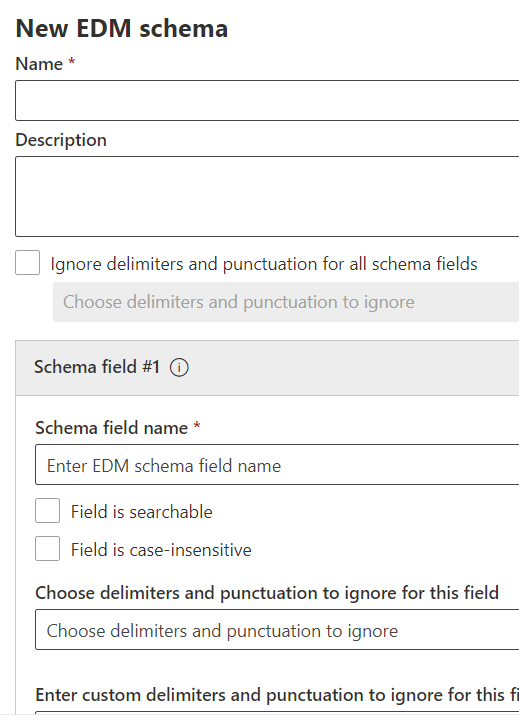

# Использование мастера для схемы точного соответствия данных и типа конфиденциальной информации

[Создание пользовательского типа конфиденциальной информации с помощью классификации на основе точного совпадения данных (EDM)](create-custom-sensitive-information-types-with-exact-data-match-based-classification.md) выполняется в несколько шагов.  Вы можете использовать этот мастер для создания файлов шаблона схемы и типа конфиденциальной информации (SIT) (пакет правил), чтобы упростить процесс.

> [!NOTE]
> Мастер схемы точного соответствия данных и типа конфиденциальной информации доступен только для облаков World Wide и GCC.

Этот мастер можно использовать вместо перечисленных ниже.

- [Определение схемы для базы данных конфиденциальной информации](create-custom-sensitive-information-types-with-exact-data-match-based-classification.md#define-the-schema-for-your-database-of-sensitive-information)
- [Настройка шаблона (пакета правил)](create-custom-sensitive-information-types-with-exact-data-match-based-classification.md#set-up-a-rule-package)

Шаги в [части 1: "Настройка классификации на основе EDM"](create-custom-sensitive-information-types-with-exact-data-match-based-classification.md#part-1-set-up-edm-based-classification).

## Необходимые условия

1. Ознакомьтесь с пошаговыми инструкциями по созданию настраиваемого типа конфиденциальной информации с помощью [быстрого обзора рабочего процесса](create-custom-sensitive-information-types-with-exact-data-match-based-classification.md#the-work-flow-at-a-glance) EDM.

2. Выполните действия в сохранить конфиденциальные данные [в .csv или в формате TSV](create-custom-sensitive-information-types-with-exact-data-match-based-classification.md#save-sensitive-data-in-csv-or-tsv-format).

## Использование мастера схемы точного соответствия данных и шаблона типа конфиденциальной информации

1. В центре Соответствия требованиям Microsoft 365 для вашего клиента перейдите к пункту **Классификация данных** > **Точное соответствие данных**.

2. Выберите **Создание схемы EDM**, чтобы открыть всплывающее окно конфигурации мастера схемы.

3. Введите соответствующее **Имя** и **Описание**.

4. Если вы хотите такое **поведение,** выберите игнорировать делимитеры и пунктуацию для всех полей схемы. Дополнительные сведения о настройке EDM для игнорирования делимитеров или делимитеров см. в примере Создание настраиваемого типа конфиденциальной информации с помощью классификации точного совпадения данных [(EDM).](create-custom-sensitive-information-types-with-exact-data-match-based-classification.md)

5. Введите нужные значения в **Поле схемы 1** и при необходимости добавьте дополнительные поля. 

> [!IMPORTANT]
> От одного до пяти полей схемы нужно указать как доступные для поиска.

6. Нажмите кнопку "Сохранить". После этого схема будет указана в списке.

7. Выберите **Типы конфиденциальной информации EDM** и **Создать тип конфиденциальной информации EDM**, чтобы открыть мастер настройки типов конфиденциальной информации.

8. Нажмите **Выбрать существующую схему EDM** и выберите схему, созданную при выполнении шагов 2–6 из списка.

9. Нажмите **Далее** и выберите **Создать шаблон**.

10. Выберите **Доверительный уровень** и **Основной элемент**.  Дополнительные сведения о настройке шаблона см. в статье [Создание пользовательского типа конфиденциальной информации в Центре соответствия требованиям](create-a-custom-sensitive-information-type.md)

11.  Выберите **Тип конфиденциальной информации основного элемента** для ассоциации. Дополнительные сведения о доступных типах конфиденциальной информации см. в статье [Определения сущностей типов конфиденциальной информации](sensitive-information-type-entity-definitions.md).

12. Нажмите кнопку **Готово**.

13. Выберите необходимый **Доверительный уровень и расстояние между символами**.  Это значение будет использоваться по умолчанию для всех типов конфиденциальной информации EDM

13. Выберите **Создать шаблон,** если вы хотите создать дополнительные шаблоны для конфиденциального типа информации EDM.

14. Нажмите **Далее**, введите **Имя** и **Описание для администраторов**.

15. Проверьте информацию и нажмите **Отправить**.

Чтобы удалить или изменить шаблон типа конфиденциальной информации, выберите его, после чего на экран будут выведены элементы управления для изменения и удаления.

> [!IMPORTANT]
> Чтобы удалить схему, уже связанную с типом конфиденциальной информации EDM, нужно сначала удалить тип конфиденциальной информации, после чего можно будет удалить схему.

## Этапы создания публикации

После использования этого мастера для создания файлов схемы и шаблона EDM (пакета правил) необходимо выполнить шаги, описанные в [ части 2: "Хеширование и отправка конфиденциальных данных"](create-custom-sensitive-information-types-with-exact-data-match-based-classification.md#part-2-hash-and-upload-the-sensitive-data), затем можно будет применять пользовательский тип конфиденциальных данных EDM.

После проверки правильной загрузки таблицы конфиденциальной информации можно проверить ее правильность.

1. Open **Compliance Center** Data  >  **classification** Sensitive Information  >  **Types**.
2. Выберите EDM SIT из списка, а затем **выберите Тест** в области вылетов. 
3. Upload элемент, содержащий данные, которые необходимо обнаружить, например создать элемент, содержащий некоторые данные в таблице конфиденциальной информации. Если в схеме используется настраиваемая функция совпадения для определения проигнорированых делимитеров, убедитесь, что элемент содержит примеры с этими делимитерами и без них.
4. После отправки и сканирования файла проверьте совпадения в EDM SIT.
5. Если **функция Test** в SIT обнаруживает совпадение, убедитесь, что она не обрезка или извлечение некорректно. Например, извлекая только подстройку полной строки, которая должна быть обнаружена, или взяв только первое слово в строке с несколькими словами или включив дополнительные символы или символы в извлечении. См. [регулярный язык выражения — быстрая ссылка](/dotnet/standard/base-types/regular-expression-language-quick-reference) для ссылки на регулярный язык выражения. 

### Устранение неполадок

Если вы не найдете совпадений, попробуйте следующее:
- Подтверждение правильной загрузки конфиденциальных данных с помощью команд, которые указаны в руководстве по отправке конфиденциальных данных с помощью [средства EDM.](create-custom-sensitive-information-types-with-exact-data-match-based-classification.md)
- Убедитесь, что примеры, которые вы ввели в элемент, присутствуют в таблице конфиденциальной информации и правильно ли игнорируются делимитеры.
- **Проверьте** sit, который использовался при настройке основного элемента в каждом из шаблонов. Это подтвердит, что SIT может соответствовать примерам элемента. 
  -  Если выбранный элемент SIT для основного элемента типа EDM не находит совпадений в элементе или находит меньше совпадений, чем ожидалось, проверьте, поддерживает ли он сепараторы и делимитеры, которые существуют в содержимом. Обязательно включите проигнорированые делимитеры, определенные в схеме. 
  -  Если функция **Test** вообще не обнаруживает контент, проверьте, включает ли выбранный sit требования к дополнительным ключевым словам или другим проверкам. Для встроенных СИТ  см. определения сущности типов конфиденциальной информации для проверки минимальных требований к каждому типу.
