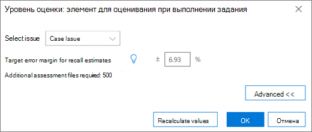
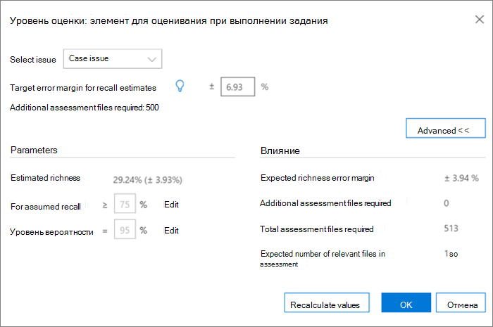
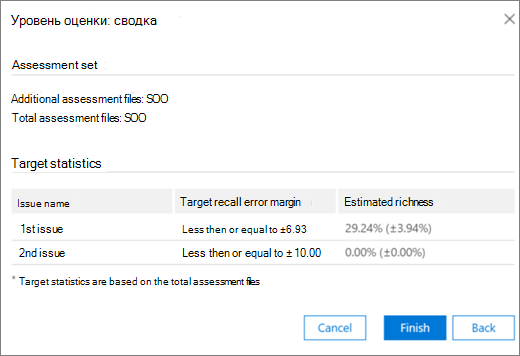

# Добавление тегов и оценка в Advanced eDiscovery (классическая)

> [!NOTE]
> Чтобы можно было использовать Advanced eDiscovery, требуется подписка на Office 365 E3 с надстройкой Advanced Compliance или E5 для организации. Если у вас этого плана нет и вы хотите попробовать Advanced eDiscovery, можете [зарегистрироваться для получения пробной версии Office 365 корпоративный E5](https://go.microsoft.com/fwlink/p/?LinkID=698279). 
  
В этом разделе описывается процедура модуля оценки релевантности Advanced eDiscovery. 
  
## Обучение и анализ оценок

1. На **вкладке \> "Отслеживание** релевантности" **щелкните "Оценка",** чтобы начать оценку дела. 
    
    Например, в этой процедуре создается пример набора оценки из  500 файлов и отображается вкладка "Тег", которая содержит панель тегов, отображаемую содержимое файла и другие параметры маркировки. 
    
    
  
2. Просмотрите каждый файл в примере, определите релевантность файла для каждого случая и помечайте файл с помощью  кнопок "Релевантность" (R), "Не релевантно" (NR) и "Пропустить" на панели тегов. 
    
    > [!NOTE]
    >  Для оценки требуется 500 файлов с тегами. Если файлы "пропущены", вы получите дополнительные файлы для тегов. 
  
3. После пометки всех файлов в примере нажмите кнопку **"Вычислить".** 
    
    Текущее поле ошибки и насыщенность оценки вычисляются и отображаются на вкладке **"Отслеживание** релевантности" с расширенными сведениями для каждого вопроса, как показано ниже. Дополнительные сведения об этом диалоговом окте описаны в разделе "Оценка результатов оценки". 
    
    
  
    > [!TIP]
    > По умолчанию рекомендуется перейти к следующему шагу по умолчанию после завершения индикатора хода выполнения оценки для проблемы, указывающее, что образец оценки был проанализироваен и помечены достаточные релевантные файлы. > противном случае, если вы  хотите просмотреть результаты вкладки "Отслеживание"  и контролировать поле ошибки и следующий шаг, нажмите кнопку "Изменить рядом с следующим шагом", выберите "Продолжить оценку" **и** нажмите кнопку "ОК".  
  
1. Щелкните **"Изменить"**  справа от окна оценки, чтобы просмотреть и указать параметры оценки для каждого вопроса. Отображается **диалоговое окно** уровня оценки для каждой проблемы, как показано в следующем примере: 
    
    
  
    Следующие параметры для проблемы вычисляются и отображаются в диалоговом оке **уровня** оценки: 
    
    **Целевое поле ошибки для** оценки отзывов: на основе этого значения вычисляется предполагаемое количество дополнительных файлов, необходимых для проверки. Поле, используемая для отзыва, превышает 75 % и имеет уровень достоверности 95 %. 
    
    **Необходимы дополнительные файлы** оценки: указывает, сколько еще файлов необходимо, если текущие требования к полям ошибок не выполнены. 
    
2. Чтобы изменить текущее поле ошибки и увидеть влияние разных полей ошибок (на проблему):
    
1. В **списке "Выбор проблем"** выберите проблему. 
    
2. В **поле целевой ошибки для оценок отзыва** введите новое значение.
    
3. Щелкните **"Update values" (Обновить),** чтобы увидеть влияние изменений. 
    
3. Щелкните **"Дополнительно"** **в** диалоговом окте "Уровень оценки", чтобы увидеть следующие дополнительные параметры и сведения: 
    
    
  
    **Примерная насыщенность:** предполагаемый объем в соответствии с текущими результатами оценки
    
    **Для предполагается, что** отзыв: по умолчанию целевое поле ошибки применяется к отзыву выше 75 %. Нажмите **кнопку** "Изменить", чтобы изменить этот параметр и управлять полем ошибки для другого диапазона значений отзыва. 
    
    **Уровень уверенности:** по умолчанию рекомендуемое поле ошибки для уверенности составляет 95 %. Если **вы** хотите изменить этот параметр, нажмите кнопку "Изменить". 
    
    **Ожидаемое поле** ошибки "Насыщенность": с учетом обновленных значений это ожидаемая погрешность этого значения после просмотра всех дополнительных файлов оценки.
    
    **Необходимы дополнительные файлы** оценки: с учетом обновленных значений количество дополнительных файлов оценки, которые необходимо просмотреть для достижения целевого значения.
    
    **Общее количество необходимых файлов** оценки: с учетом обновленных значений общее количество файлов оценки, необходимых для проверки.
    
    **Ожидаемое количество соответствующих** файлов в оценке: с учетом обновленных значений ожидаемое количество соответствующих файлов во всей оценке после проверки всех дополнительных файлов оценки.
    
4. Щелкните **"Пересчитать значения",** если параметры изменены. Когда все будет готово, если есть одна проблема, нажмите  кнопку "ОК", чтобы сохранить изменения (или "Далее" при нескольких проблемах, которые необходимо просмотреть или изменить, а затем **— "Готово").**  
    
    Если имеется несколько проблем, после проверки или корректировки  всех проблем отображается диалоговое окно сводки, как показано в следующем примере. 
    
    
  
    После успешного завершения оценки переходите к следующему этапу обучения релевантности.
    
## Просмотр результатов оценки

После маркировки примера оценки результаты оценки вычисляются и отображаются на вкладке "Отслеживание релевантности".
  
На экране расширенной дорожки отображаются следующие результаты: 
  
- Текущая поле ошибки оценки при отзыве
    
- Примерная насыщенность
    
- Необходимы дополнительные файлы оценки (для проверки)
    
Поле текущей ошибки оценки — это поле ошибки, рекомендованные Advanced eDiscovery. Число, отображаемого для "Необходимы дополнительных файлов оценки", соответствует этой рекомендации.
  
Индикатор хода выполнения оценки показывает уровень завершения оценки с учетом текущего поля ошибки. Когда оценка будет проведена, пользователь помечет еще один пример оценки.
  
Когда индикатор хода оценки показывает, что оценка завершена, это означает, что образец оценки был завершен и помечены достаточно релевантные файлы. 
  
На развернутом экране "Track" показаны рекомендуемый следующий шаг, статистика оценки и доступ к подробным результатам.
  
Если уровень насыщенности очень низкий, количество дополнительных файлов оценки, необходимых для достижения минимального количества релевантных файлов для получения полезной статистики, очень высок. Advanced eDiscovery затем рекомендует двигаться к обучению. Индикатор хода выполнения оценки будет затенен, и статистика не будет доступна. 
  
В отсутствие статистически основанной на статистике стабилизации будут результаты с более низким уровнем точности и достоверности. Однако эти результаты можно использовать для поиска соответствующих файлов, если вам не нужно знать процент найденных релевантных файлов. Аналогичным образом это состояние можно использовать для обучения проблем с низкой насыщенностью, где результаты релевантности могут ускорить доступ к файлам, относячим к определенной проблеме.
  
> [!TIP]
> На вкладке  **"Отслеживание \>** релевантности" доступны следующие параметры просмотра: > Рекомендуемый следующий шаг, например следующий **шаг:** можно обойти теги (для каждого вопроса), нажав кнопку "Изменить" справа, а затем выбрав другой шаг на следующем шаге.  Когда индикатор хода выполнения оценки не будет завершен, рекомендуется использовать оценку, чтобы пометить дополнительные файлы оценки и повысить точность статистики. > Вы можете изменить поле ошибки и оценить ее влияние, нажав кнопку **"Изменить"** и в диалоговом окнах уровня оценки, изменив поле целевой ошибки для оценок отзыва и щелкнув "Обновить **значения".**   Кроме того, в этом диалоговом оке можно просмотреть дополнительные параметры, нажав кнопку **"Дополнительные".** > Вы можете просмотреть дополнительную статистику об уровне оценки и их влияние, нажав кнопку **"Просмотреть".** В диалоговом окте "Подробные результаты" статистика доступна по каждой проблеме, если имеется не менее 500 помеченных файлов оценки, а не менее 18 файлов помечены как релевантные для проблемы. 
  