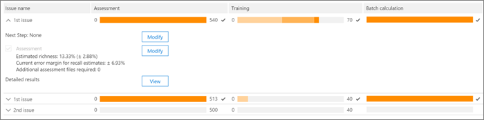

# Добавление тегов и оценка в модуле релевантности в Advanced eDiscoveryTagging and Assessment in the Relevance module in Advanced eDiscovery
  
В этом разделе описывается процедура оценки в модуле релевантности в Advanced eDiscovery.This section describes the procedure for Assessment in the Relevance module in Advanced eDiscovery.
  
## Обучение и анализ оценокPerforming Assessment training and analysis

1. На **вкладке \> "Отслеживание** релевантности" **щелкните "Оценка",** чтобы начать оценку дела.In the **Relevance \> Track** tab, click **Assessment** to start case assessment.

    Например, в этой процедуре создается пример набора оценки из  500 файлов и отображается вкладка "Тег", которая содержит панель тегов, отображаемую содержимое файла и другие параметры маркировки.For example purposes in this procedure, a sample assessment set of 500 files is created and the **Tag** tab is displayed, which contains the Tagging panel, displayed file content and other tagging options. 

    
  
2. Просмотрите каждый файл в примере, определите релевантность файла для каждого случая и помечайте файл с помощью  кнопок "Релевантность" (R), "Не релевантно" (NR) и "Пропустить" на панели тегов.Review each file in the sample, determine the file's relevance for each case issue, and tag the file using the Relevance (R), Not relevant (NR) and Skip buttons in the **Tagging panel** pane. 

    > [!NOTE]
    >  Для оценки требуется 500 файлов с тегами.Assessment requires 500 tagged files. Если файлы "пропущены", вы получите дополнительные файлы для тегов.If files are "skipped", you will receive more files to tag. 
  
3. После пометки всех файлов в примере нажмите кнопку **"Вычислить".**After tagging all files in the sample, click **Calculate**.

    Текущее поле ошибки и насыщенность оценки вычисляются и отображаются на вкладке **"Отслеживание** релевантности" с расширенными сведениями для каждого вопроса, как показано ниже.The Assessment current error margin and richness are calculated and displayed in the **Relevance Track** tab, with expanded details per issue, as shown below. Дополнительные сведения об этом диалоговом оке описаны в разделе ["Оценка результатов](#reviewing-assessment-results) оценки".More details about this dialog are described in the [Reviewing assessment results](#reviewing-assessment-results) section.

    
  
    > [!TIP]
    > По умолчанию рекомендуется перейти к следующему шагу по умолчанию после завершения индикатора хода выполнения оценки для проблемы, указывающее, что образец оценки был проанализироваен и помечены достаточные релевантные файлы.By default, we recommend that you proceed to the default Next step when the Assessment progress indicator for the issue has completed, indicating that the assessment sample was reviewed and sufficient relevant files were tagged. > противном случае, если вы  хотите просмотреть результаты вкладки "Отслеживание"  и контролировать поле ошибки и следующий шаг, нажмите кнопку "Изменить рядом с следующим шагом", выберите "Продолжить оценку" **и** нажмите кнопку "ОК". > Otherwise, if you want to view the **Track** tab results and control the margin of error and the next step, click **Modify** adjacent to **Next Step**, select **Continue assessment**, and then click **OK**.
  
4. Щелкните **"Изменить"**  справа от окна оценки, чтобы просмотреть и указать параметры оценки для каждого вопроса.Click **Modify** to the right of the **Assessment** check box to view and specify assessment parameters per issue. Отображается **диалоговое окно** уровня оценки для каждой проблемы, как показано в следующем примере:An **Assessment level** dialog for each issue is displayed, as shown in the following example: 

    
  
    Следующие параметры для проблемы вычисляются и отображаются в диалоговом **оке уровня** оценки:The following parameters for the issue are calculated and displayed in the **Assessment level** dialog: 

    **Целевое поле ошибки для** оценки отзывов: на основе этого значения вычисляется предполагаемое количество дополнительных файлов, необходимых для проверки.**Target error margin for recall estimates**: Based on this value, the estimated number of additional files necessary to review is calculated. Поле, используемая для отзыва, превышает 75 % и имеет уровень достоверности 95 %.The margin used for recall is greater than 75% and with a 95% confidence level.

    **Необходимы дополнительные файлы** оценки: указывает, сколько еще файлов необходимо, если текущие требования к полям ошибок не выполнены.**Additional assessment files required**: Indicates how many more files are necessary if the current error margin's requirements have not been met. 

5. Чтобы изменить текущее поле ошибки и увидеть влияние разных полей ошибок (на проблему):To adjust the current error margin and see the effect of different error margins (per issue):

6. В **списке "Выбор проблем"** выберите проблему.In the **Select issue** list, select an issue. 

7. В **поле целевой ошибки для оценок отзыва** введите новое значение.In **Target error margin for recall estimates**, enter a new value.

8. Щелкните **"Update values" (Обновить),** чтобы увидеть влияние изменений.Click **Update values** to see the impact of the adjustments. 

9. Щелкните **"Дополнительно"** в диалоговом окте "Уровень оценки", чтобы увидеть следующие дополнительные параметры и сведения: Click **Advanced** in the **Assessment level** dialog to see the following additional parameters and details: 

    
  
    - **Примерная насыщенность:** предполагаемый объем в соответствии с текущими результатами оценки**Estimated richness**: Estimated richness according to the current assessment results

    - **Для предполагается, что** отзыв: по умолчанию целевое поле ошибки применяется к отзыву выше 75 %.**For assumed recall**: By default, the target error margin applies to recall above 75%. Нажмите **кнопку** "Изменить", чтобы изменить этот параметр и управлять полем ошибки для другого диапазона значений отзыва.Click **Edit** if you want to change this parameter and control the margin of error on a different range of recall values. 

    - **Уровень уверенности:** по умолчанию рекомендуемое поле ошибки для уверенности составляет 95 %.**Confidence level**: By default, the recommended error margin for confidence is 95%. Если **вы** хотите изменить этот параметр, нажмите кнопку "Изменить".Click **Edit** if you want to change this parameter.

    - **Ожидаемое поле** ошибки "Насыщенность": с учетом обновленных значений это ожидаемое поле ошибки разности после проверки всех дополнительных файлов оценки.**Expected richness error margin**: Given the updated values, this is the expected margin of error of the richness, after all additional assessment files are reviewed.

    - **Необходимы дополнительные файлы** оценки: с учетом обновленных значений, количество дополнительных файлов оценки, которые необходимо просмотреть для достижения целевого значения.**Additional assessment files required**: Given the updated values, the number of additional assessment files that need to be reviewed to reach the target.

    - **Общее количество необходимых файлов** оценки: с учетом обновленных значений общее количество файлов оценки, необходимых для проверки.**Total assessment files required**: Given the updated values, total assessment files required for review.

    - **Ожидаемое количество соответствующих** файлов в оценке: с учетом обновленных значений ожидаемое количество соответствующих файлов во всей оценке после проверки всех дополнительных файлов оценки.**Expected number of relevant files in assessment**: Given the updated values, the expected number of relevant files in the entire assessment after all additional assessment files are reviewed.

10. Щелкните **"Пересчитать значения",** если параметры изменены.Click **Recalculate values**, if parameters are changed. Когда все будет готово, если есть одна проблема, нажмите  кнопку "ОК", чтобы сохранить изменения (или "Далее", если есть несколько проблем, которые необходимо просмотреть или изменить, а затем **готово).** When you're done, if there is one issue, click **OK** to save the changes (or **Next** when there are multiple issues to review or modify and then **Finish**). 

    Если имеется несколько проблем, после проверки или корректировки  всех проблем отображается диалоговое окно сводки, как показано в следующем примере.When there are multiple issues, after all issues have been reviewed or adjusted, an **Assessment level: summary** dialog is displayed, as shown in the following example. 

    
  
    После успешного завершения оценки переходите к следующему этапу обучения релевантности.On successful completion of assessment, proceed to the next stage in Relevance training.

## Просмотр результатов оценкиReviewing assessment results

После маркировки примера оценки результаты оценки вычисляются и отображаются на вкладке "Отслеживание релевантности".After an Assessment sample is tagged, the assessment results are calculated and displayed in the Relevance Track tab.
  
На экране расширенной дорожки отображаются следующие результаты:The following results are displayed in the expanded Track display:
  
- Текущая поле ошибки оценки при отзывеAssessment current error margin for recall estimates

- Примерная насыщенностьEstimated richness

- Необходимы дополнительные файлы оценки (для проверки)Additional assessment files required (for review)

Поле текущей ошибки оценки — это поле ошибки, рекомендованные Advanced eDiscovery.The Assessment current error margin is the error margin recommended by Advanced eDiscovery. Число, отображаемого для "Необходимы дополнительных файлов оценки", соответствует этой рекомендации.The number displayed for the "Additional assessment files required" corresponds to that recommendation.
  
Индикатор хода выполнения оценки показывает уровень завершения оценки с учетом текущего поля ошибки.The Assessment progress indicator shows the level of completion of the assessment, given the current error margin. Когда оценка будет проведена, пользователь помечет еще один пример оценки.When assessment is underway, the user will tag another assessment sample.
  
Когда индикатор хода выполнения оценки показывает, что оценка завершена, это означает, что проверка примера оценки завершена, а соответствующие файлы были помечены.When the assessment progress indicator shows assessment as complete, that means the assessment sample review was completed and sufficient relevant files were tagged. 
  
На развернутом экране "Track" показаны рекомендуемый следующий шаг, статистика оценки и доступ к подробным результатам.The expanded Track display shows the recommended next step, the assessment statistics, and access to detailed results.
  
Если уровень насыщенности очень низкий, количество дополнительных файлов оценки, необходимых для достижения минимального количества релевантных файлов для получения полезной статистики, очень высок.When richness is very low, the number of additional assessment files needed to reach a minimal number of relevant files to produce useful statistics is very high. Advanced eDiscovery затем рекомендует двигаться к обучению.Advanced eDiscovery will then recommend moving on to training. Индикатор хода выполнения оценки будет затенен, и статистика не будет доступна.The assessment progress indicator will be shaded, and no statistics will be available.
  
В отсутствие статистически основанной на статистике стабилизации будут результаты с более низким уровнем точности и достоверности.In the absence of statistically based stabilization, there will be results with a lower level of accuracy and confidence level. Однако эти результаты можно использовать для поиска соответствующих файлов, если вам не нужно знать процент найденных релевантных файлов.However, these results can be used to find relevant files when you do not need to know the percentage of relevant files found. Аналогичным образом это состояние можно использовать для обучения проблем с низкой насыщенностью, где результаты релевантности могут ускорить доступ к файлам, относячим к определенной проблеме.Similarly, this status can be used to train issues with low richness, where Relevance scores can accelerate access to files relevant to a specific issue.
  
> [!TIP]
> На **вкладке \> "Отслеживание** релевантности" отображаются проблемы, доступные следующие параметры просмотра:In the **Relevance \> Track** tab, expanded issue display, the following viewing options are available: 
> 
> Рекомендуемый следующий шаг, например следующий **шаг:** добавление тегов можно обойти (для каждого вопроса), нажав кнопку **"Изменить"** справа, а затем выбрав другой шаг на следующем **шаге.**The recommended next step, such as **Next step: Tagging** can be bypassed (per issue) by clicking the **Modify** button to its right, and then selecting an different step in the **Next step**. Когда индикатор хода выполнения оценки не будет завершен, рекомендуется использовать оценку, чтобы пометить дополнительные файлы оценки и повысить точность статистики.When the assessment progress indicator has not completed, assessment will be the next recommended option, to tag more assessment files and increase statistics accuracy. 
> 
> Вы можете изменить поле ошибки и оценить ее влияние, нажав кнопку  **"Изменить"** и в диалоговом окнах уровня оценки, изменив поле целевой ошибки для оценок отзыва и щелкнув "Обновить **значения".**You can change the error margin and assess its impact, by clicking **Modify**, and in the **Assessment level dialog**, changing the **Target error margin for recall estimates**, and clicking **Update values**. Кроме того, в этом диалоговом оке можно просмотреть дополнительные параметры, нажав кнопку **"Дополнительные".**Also, in this dialog, you can view advanced options, by clicking **Advanced**. 
> 
> Вы можете просмотреть дополнительную статистику уровня оценки и ее влияние, нажав кнопку **"Просмотреть".**You can view additional assessment level statistics and their impact by clicking **View**. В диалоговом окте "Подробные результаты" статистика доступна по каждой проблеме, если имеется не менее 500 помеченных файлов оценки, а не менее 18 файлов помечены как релевантные для проблемы.In the displayed Detail results dialog, statistics are available per issue, when there are at least 500 tagged assessment files and at least 18 files are tagged as Relevant for the issue. 
