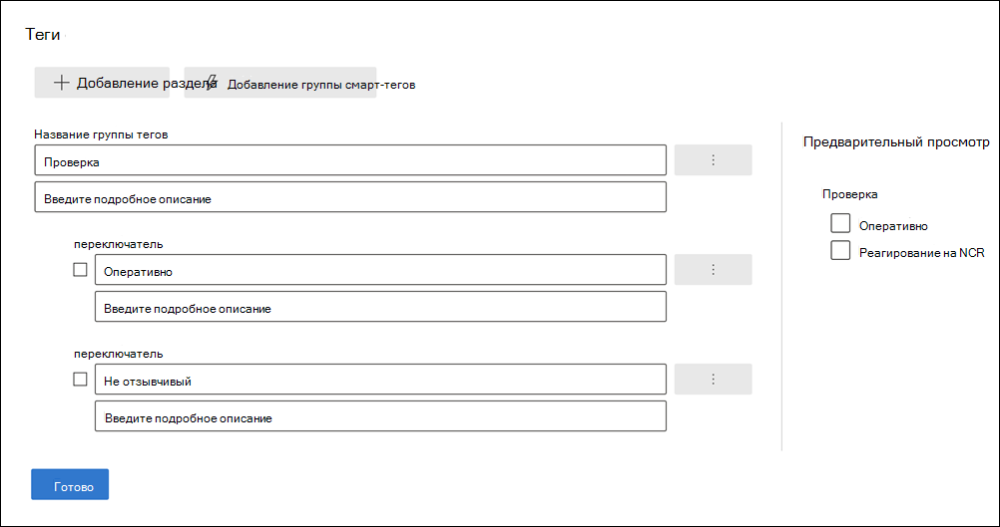
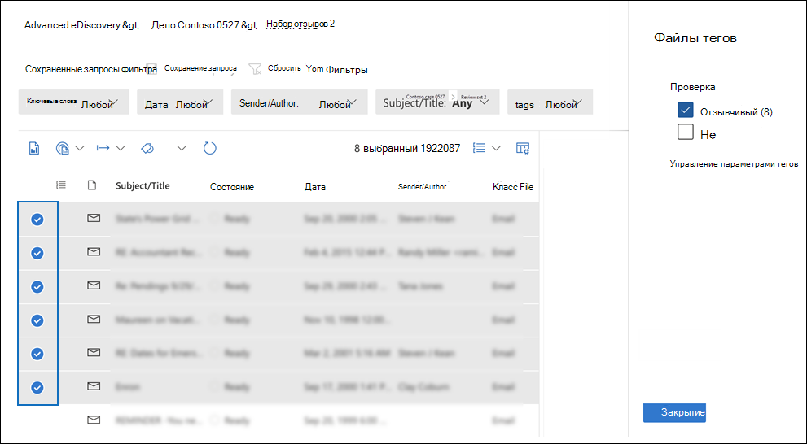
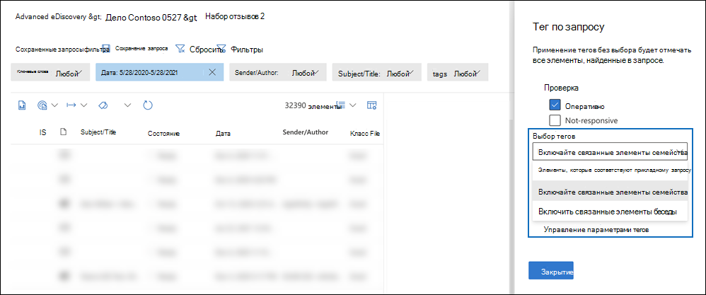
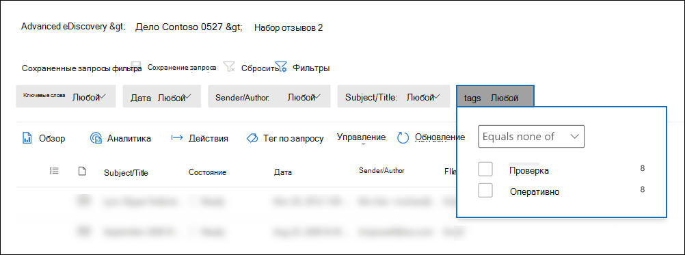

# Тег документов в наборе обзоров в Advanced eDiscovery

Организация контента в наборе обзоров имеет важное значение для завершения различных процессов в процессе электронного разбора. К ним относятся:

- Вычисливание ненужного контента

- Определение соответствующего контента

- Определение контента, которое должно быть рассмотрено экспертом или адвокатом

Когда эксперты, адвокаты или другие пользователи проверяют содержимое в наборе отзывов, их мнения, связанные с содержимым, могут быть запечатлены с помощью тегов. Например, если цель состоит в том, чтобы отослать ненужный контент, пользователь может тегировать документы тегом "не реагируя". После проверки и метки контента можно создать поиск набора обзоров, чтобы исключить любой контент, помеченный как "не отзывчивый". Этот процесс устраняет неотвратимый контент из следующих действий рабочего процесса eDiscovery. Панель тегов в наборе отзывов может быть настроена для каждого случая, чтобы теги поддержали предполагаемый рабочий процесс проверки для этого случая.

> [!NOTE]
> Область тегов — это Advanced eDiscovery случае. Это означает, что в случае может быть только один набор тегов, которые рецензенты могут использовать для тегов документов набора обзоров. Вы не можете настроить другой набор тегов для использования в различных наборах отзывов в одном случае.

## Типы тегов

Advanced eDiscovery содержит два типа тегов:

- **Теги выбора:** ограничивает рецензентов выбором одного тега в группе. Эти типы тегов могут быть полезны для того, чтобы рецензенты не выбирали конфликтующие теги, такие как "отзывчивый" и "не отзывчивый". Отдельные теги выбора отображаются в качестве кнопок радио.

- **Несколько тегов выбора.** Разрешить просмотрениям выбирать несколько тегов в группе. Эти типы тегов отображаются как почтовые ящики.

## Структура тегов

Помимо типов тегов можно использовать структуру организации тегов в панели тегов, чтобы сделать документы тегов более понятными. Теги сгруппировали по разделам. Набор просмотреть поиск поддерживает возможность поиска по тегам и по разделу тегов. Это означает, что вы можете создать поиск набора отзывов для получения документов с тегами любого тега в разделе.

Далее можно организовать теги, вложенные в раздел. Например, если цель заключается в определении и теге привилегированного контента, вложение можно использовать, чтобы понять, что рецензент может пометить документ как "Привилегированный" и выбрать тип привилегии, проверив соответствующий вложенный тег.

## Создание тегов

Прежде чем применять теги к документам в наборе отзывов, необходимо создать структуру тегов.

1. Откройте набор отзывов и перейдите к панели команд и выберите **Тег по запросу.**

2. В панели тегов выберите **Параметры Управления тегами**

3. Выберите **раздел Добавить тег**.

4. Введите название группы тегов и необязательный описание, а затем нажмите **кнопку Сохранить**.

5. Выберите тройное меню выпадаемой точки рядом с заголовком группы тегов и нажмите **кнопку Добавить шажок** или **добавить параметр**.

6. Введите имя и описание для почтового ящика или кнопки параметра.

7. Повторите этот процесс, чтобы создать новые разделы тегов, параметры тегов и почтовые ящики.

   

## Применение тегов

С помощью структуры тегов рецензенты могут применять теги к документам в наборе обзоров. Существует два различных способа применения тегов:

- Файлы тегов

- Тег по запросу

### Файлы тегов

Выберите один элемент или несколько элементов в наборе отзывов, вы можете применить теги к их выбору, щелкнув файлы **тегов** в панели команд. На панели тегов можно выбрать тег, который автоматически применяется к выбранным документам.

> [!NOTE]
> Теги будут применяться только к выбранным пунктам в списке элементов.

### Тег по запросу

Пометка по запросу позволяет применять теги для всех элементов, отображающихся в фильтровом запросе, который в настоящее время применяется в наборе обзоров.

1. Отойдите от всех элементов в наборе отзывов и перейдите в командную планку и выберите **Тег по запросу.**

2. На панели тегов выберите тег, который необходимо применить.

3. В **отсеве выбора тегов** существует три параметра, которые диктуют, к как можно применить тег.

   - **Элементы, которые соответствуют прикладному запросу.** Применяет теги к определенным пунктам, которые соответствуют условиям запроса фильтра.

   - **Включайте** связанные элементы семейства: применяет теги к определенным пунктам, которые соответствуют условиям запроса фильтра и связанным с ними семейным элементам. *Элементы семейства* — это элементы с одинаковым значением метаданных FamilyId.  

   - **Включайте** связанные элементы беседы: применяет теги к пунктам, которые соответствуют условиям запроса фильтра и связанным с ними предметам беседы. *Элементы беседы* — это элементы, которые имеют одинаковые значения метаданных ConversationId.

   

4. Нажмите **кнопку Пуск пометки задания,** чтобы вызвать задание пометки.

## Фильтр тегов

Используйте фильтр тегов в наборе обзоров, чтобы быстро найти или исключить элементы из результатов запроса в зависимости от того, как помечен элемент. 

1. Выберите **фильтры** для расширения панели фильтров.

2. Выберите и **расширь свойства Item.**

3. Прокрутите вниз, чтобы найти фильтр с именем **Тег,** выберите почтовый ящик, а затем нажмите кнопку **Готово**.

4. Чтобы включить или исключить элементы с определенным тегом из запроса, сделайте одно из следующих элементов:

   - **Включите** элементы: Выберите значение тега и **выберите Равное любое из** в меню отсев.

      Или

   - **Исключить элементы.** Выберите значение тега и выберите **Равно ни одного из** в выпадаемом меню.

     

> [!NOTE]
> Обязательно обновите страницу, чтобы фильтр тегов отображал последние изменения в структуре тегов.
