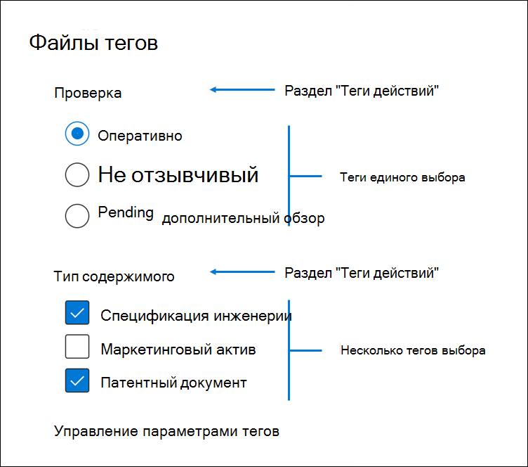

# Пометка документов в наборе для проверки в Advanced eDiscoveryTag documents in a review set in Advanced eDiscovery

Организация контента в наборе для проверки важна для выполнения различных процессов в процессе eDiscovery.Organizing content in a review set is important to complete various workflows in the eDiscovery process. К ним относятся:This includes:

- Отсчитывание ненужного содержимогоCulling unnecessary content

- Определение релевантной информацииIdentifying relevant content
 
- Определение контента, который должен просмотреть эксперт или адвокатIdentifying content that must be reviewed by an expert or an attorney

Когда эксперты, адвокаты или другие пользователи просматривают содержимое в наборе для проверки, их мнение, связанное с содержимым, можно фиксировать с помощью тегов.When experts, attorneys, or other users review content in a review set, their opinions related to the content can be captured by using tags. Например, если целью является отоимствовать ненужное содержимое, пользователь может пометить документы тегом, например "не отвечать".For example, if the intent is to cull unnecessary content, a user can tag documents with a tag such as "non-responsive". После проверки и маркировки контента можно создать поиск в наборе для проверки, чтобы исключить любой контент, помеченный как "неотвечивая", что исключает этот контент из следующих действий рабочего процесса eDiscovery.After content has been reviewed and tagged, a review set search can be created to exclude any content tagged as "non-responsive", which eliminates this content from the next steps in the eDiscovery workflow. Панель тегов можно настроить для каждого случая, чтобы теги могли поддерживать рабочий процесс проверки.The tag panel can be customized for every case so that the tags can support the intended review workflow.

## Типы теговTag types

Advanced eDiscovery предоставляет два типа тегов:Advanced eDiscovery provides two types of tags:

- **Теги единого выбора—** ограничивает пользователей выбором одного тега в группе.**Single choice tags** - Restricts users to select a single tag within a group. Это может быть полезно, чтобы пользователи не выбирали конфликтующие теги, такие как "отзывчивый" и "не реагирующий".This can be useful to ensure users don't select conflicting tags such as "responsive" and "non-responsive". Они будут отображаться в качестве кнопок.These will appear as radio buttons.

- **Несколько тегов выбора** — разрешить пользователям выбирать несколько тегов в группе.**Multiple choice tags** - Allow users to select multiple tags within a group. Они будут отображаться в качестве контрольных тона.These will appear as checkboxes.

## Структура теговTag structure

Помимо типов тегов, структуру организации тегов в области тегов можно использовать, чтобы сделать документы тегов более интуитивно понятными.In addition to the tag types, the structure of how tags are organized in the tag panel can be used to make tagging documents more intuitive. Теги сгруппировали по разделам.Tags are grouped by sections. Поиск в наборе для проверки поддерживает возможность поиска по тегам и разделам тегов.Review set search supports the ability to search by tag and by tag section. Это означает, что вы можете создать поиск в наборе для проверки, чтобы получить документы, помеченные любым тегом в разделе.This means you can create a review set search to retrieve documents tagged with any tag in a section.

Теги могут быть более уорганизованы путем их вложения в раздел.Tags can be further organized by nesting them within a section. Например, если целью является идентификация и пометка привилегированного содержимого, можно использовать вложенные данные, чтобы понять, что пользователь может пометить документ как "Привилегированный" и выбрать тип привилегий, проверив соответствующий вложенный тег.For example, if the intent is to identify and tag privileged content, nesting can be used to make it clear that a user can tag a document as "Privileged" and select the type of privilege by checking the appropriate nested tag.

## Применение теговApplying tags

Существует несколько способов применения тега к содержимому.There are several ways to apply a tag to content.

### Добавление тегов к одному документуTagging a single document

При просмотре документа в наборе для проверки можно отобразить теги, которые может использовать проверка, щелкнув панель **тегов.**When viewing a document in a review set, you can display the tags that a review can use by clicking **Tagging panel**.

Это позволит применять теги к документу, отображаемму в представлении.This will enable you to apply tags to the document displayed in the viewer.

### Массовое добавление теговBulk tagging

Массовое добавление тегов можно сделать путем выбора нескольких файлов в сетке результатов, а затем с помощью тегов на панели тегов аналогично пометке отдельных документов. Bulk tagging can be done by selecting multiple files in the results grid and then using the tags in the **Tagging panel** similar to tagging single documents. Массовое разметку можно сделать, выбрав теги дважды; При первом щелчке тег будет применяться, а второй выбор обеспечит очистку тега для всех выбранных файлов.Bulk un-tagging can be done by selecting tags twice; the first click will apply the tag, and the second selection will ensure that tag is cleared for all selected files.

> [!NOTE]
> При массовом присвоении тегов на панели тегов отображается количество файлов, помеченных для каждого тега на панели.When bulk tagging, the tagging panel will display a count of files that are tagged for each tag in the panel.

### Добавление тегов на других панелях проверкиTagging in other review panels

При просмотре документов можно использовать другие панели проверки для просмотра других характеристик документов в сетке результатов.When reviewing documents, you can use the other review panels to review other characteristics of documents in the results grid. Это включает просмотр других связанных документов, потоков электронной почты, почти дубликатов и дубликатов hash.This includes reviewing other related documents, email threads, near duplicates, and hash duplicates. Например, при просмотре связанных документов (с помощью  панели проверки семейства документов) можно значительно сократить время проверки путем массовой маркировки связанных документов.For example, when you're reviewing related documents (by using the **Document family** review panel), you can significantly reduce review time by bulk tagging related documents. Например, если в сообщении электронной почты есть несколько вложений и вы хотите убедиться, что все семейство помечено согласованно.For example, if an email message has several attachments and you want to ensure that the entire family is tagged consistently.

Например, вот как отобразить панель **тегов** при использовании панели проверки семейства документов: For example, here's how to display the **Tagging panel** when using the **Document family** review panel:

1. Открыв панель проверки для выбранного документа (например, отображая список  связанного контента  на панели проверки семейства документов, щелкните "Пометить документы" в панели проверки семейства документов.With the review panel open for a selected document (for example, displaying the list of related content in the **Document family** review panel, click **Tag documents** under the document family review panel.

   Панель тегов отображается как всплывающее окно.The tagging panel is displayed as a pop-up window.

2. Выберите один или несколько тегов, чтобы применить выбранный документ.Choose one or more tags to apply the selected document. 

3. Чтобы пометить все документы,  выберите все документы на панели семейства документов, щелкните "Тег документов" и выберите теги, которые будут применяться для всего семейства документов.To tag all documents, select all documents in the **Document family** panel, click **Tag documents**, and then choose the tags to apply to the entire family of documents.

