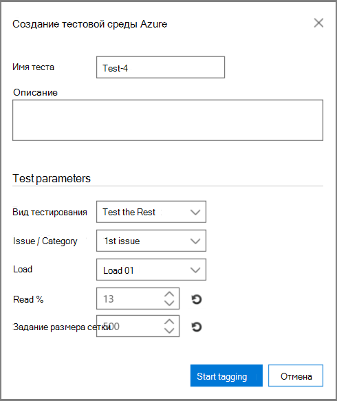

# Тестирование анализа релевантности в Advanced eDiscovery (классическая)

> [!NOTE]
> Чтобы можно было использовать Advanced eDiscovery, требуется подписка на Office 365 E3 с надстройкой Advanced Compliance или E5 для организации. Если у вас этого плана нет и вы хотите попробовать Advanced eDiscovery, можете [зарегистрироваться для получения пробной версии Office 365 корпоративный E5](https://go.microsoft.com/fwlink/p/?LinkID=698279). 
  
Вкладка "Тестирование" в Advanced eDiscovery позволяет тестировать, сравнивать и проверять общее качество обработки. Эти тесты выполняются после пакетного вычисления. Помечая файлы в коллекции, эксперт принимает окончательное решение о том, действительно ли каждый помеченный файл относится к делу. 
  
В сценариях с одним и несколькими вопросами тесты обычно выполняются для каждого вопроса. Результаты можно просмотреть после каждого теста, а результаты тестирования можно переработать с помощью указанных примеров тестовых файлов.
  
## Тестирование остальных

Тест "Тестирование rest" используется для проверки решений по выбору, например для проверки только файлов, которые выше определенной оценки релевантности на основе окончательных результатов Advanced eDiscovery. Эксперт проверяет пример файлов в выбранной оценке вырезания, чтобы оценить количество соответствующих файлов в этом наборе.
  
Этот тест предоставляет статистику и сравнение между набором "Проверка" и "Тестирование для остальной части". Результаты набора для проверки вычисляются по релевантности во время обучения. Результаты включают вычисления на основе параметров и входных параметров, например:
  
- Протестировать статистику по количеству файлов в примере и определить соответствующие файлы. 
    
- Табличные сравнения параметров Population в наборе "Проверка" и "Rest", например количество файлов, предполагаемое количество соответствующих файлов, предполагаемое значение параметров и средние затраты на поиск дополнительного релевантного файла. Параметры затрат могут быть заданы администратором.
    
1. Откройте **вкладку \> "Проверка релевантности".** 
    
2. На **вкладке "Тестирование"** нажмите **кнопку "Новый тест".** **Отобразилось** диалоговое окно создания тестов, как показано в следующем примере. 
    
    
  
3. In **Test name**, and **Description**, type the name and description.
    
4. In the **Test type** list, select Test **the Rest**
    
5. В **списке "Проблема/ Категория"** выберите имя проблемы. 
    
6. В **списке загрузки** выберите загрузку. 
    
7. В **%чтения** примите значение по умолчанию или выберите значение для оценки релевантности вырезания. 
    
8. В **значении "Установить размер"** или примите значение по умолчанию. Обратите внимание, что значки восстановления восстановят значения по умолчанию.
    
9. Нажмите **кнопку "Начать добавление тегов"**. Создается тестовый пример.
    
10. Просмотрите и помечайте каждый из файлов на вкладке **"Тег \>** релевантности", а затем нажмите кнопку **"Вычислить".**
    
11. На вкладке "Тестирование" можно щелкнуть **"Просмотреть результаты",** чтобы просмотреть результаты тестирования. Пример показан на следующем рисунке. 
    
    
  
На рисунке выше  раздел "Примеры параметров" таблицы содержит сведения о количестве файлов в примере, отмеченном экспертом, и количестве соответствующих файлов, найденных в этом примере. 
  
В разделе параметров **Population** таблицы содержатся результаты тестирования, включая набор "Проверка" с набором проверки файлов с показателем ниже выбранного вырезания и "Остальной" — с количеством файлов, набрав на баллов больше выбранного. Для каждого из них отображаются следующие результаты: 
  
- Включает файлы с %- Указано вырезание
    
- Общее количество файлов 
    
- Предполагаемое количество соответствующих файлов 
    
- Примерная насыщенность 
    
- Средняя стоимость проверки при поиске другого релевантного файла
    
## Тестирование среза

Тест "Тестирование фрагмента" выполняет тестирование, аналогичное тесту "Тестирование остального", но к сегменту набора файлов, указанному в %чтения релевантности.
  
1. Откройте **вкладку \> "Проверка релевантности".** 
    
2. На **вкладке "Тестирование"** нажмите **кнопку "Новый тест".** **Отобразилось** диалоговое окно "Создание теста". 
    
3. Введите **сведения** в **области**"Имя теста" и "Описание".
    
4. В **списке тестового** типа выберите **"Тестирование фрагмента".**
    
5. В **списке проблем** выберите имя проблемы. 
    
6. В **списке загрузки** выберите загрузку. 
    
7. В **%чтения между** значениями примите значения низкого и высокого диапазона по умолчанию или выберите значения для оценки релевантности вырезания. 
    
8. В **области "Установить размер"** выберите значение или примите значение по умолчанию.
    
    Значки восстановления восстановят значение по умолчанию.
    
9. Нажмите **кнопку "Начать добавление тегов"**. Создается тестовый пример.
    
10. Просмотрите и помечайте каждый из файлов на вкладке **"Тег \>** релевантности", а затем нажмите кнопку **"Вычислить".** 
    
11. На вкладке "Тестирование" можно щелкнуть **"Просмотреть результаты",** чтобы просмотреть результаты тестирования. 
    
## См. также

[Advanced eDiscovery (классическая версия)](office-365-advanced-ediscovery.md)
  
[Понимание оценки релевантности](assessment-in-relevance-in-advanced-ediscovery.md)
  
[Добавление тегов и оценка](tagging-and-assessment-in-advanced-ediscovery.md)
  
[Обучение тегам и релевантности](tagging-and-relevance-training-in-advanced-ediscovery.md)
  
[Отслеживание анализа релевантности](track-relevance-analysis-in-advanced-ediscovery.md)
  
[Выбор на основе результатов](decision-based-on-the-results-in-advanced-ediscovery.md)

