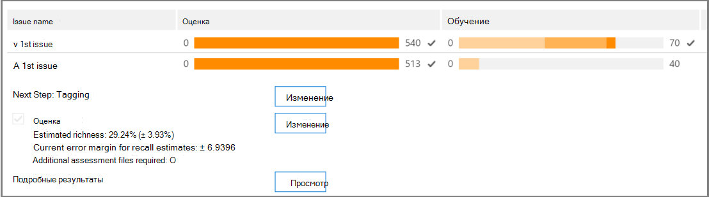
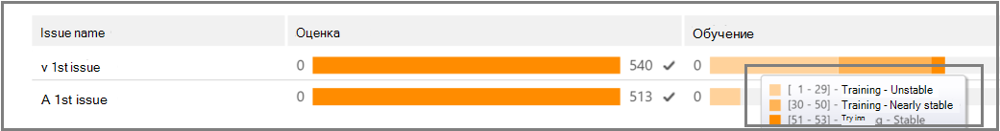
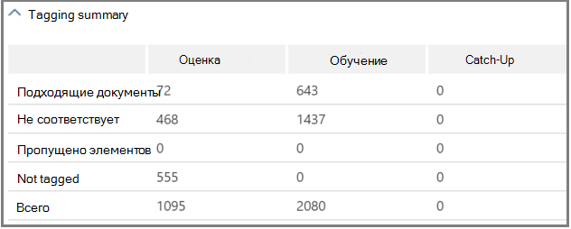

# Отслеживание анализа релевантности в Advanced eDiscovery
  
В Advanced eDiscovery вкладка "Отслеживание релевантности" отображает вычисляемую действительность обучения релевантности, выполненного на вкладке "Тег", и указывает на следующий шаг, выполняемый в процессе итеративного обучения релевантности. 
  
## Отслеживание состояния обучения релевантности

1. Просмотреть следующие сведения в отслеживании релевантности для проблем с  делом, как показано в следующем примере диалоговое окно "Имя проблемы" ниже.

   - **Оценка**: этот индикатор хода выполнения показывает, в какой степени обучение релевантности, выполненного до этого момента, достигло целевого значения оценки с точки зрения полей ошибок. Также отображаются результаты обучения релевантности.

   - **Обучение**: этот индикатор хода выполнения с цветом и подсказка для средства указывает стабильность результатов обучения релевантности и числовую шкалу, показывающая количество примеров обучения релевантности, помеченных для каждой проблемы. Эксперт отслеживает ход выполнения итеративного процесса обучения релевантности. 
  
   - **Пакетное вычисление**: этот индикатор хода выполнения предоставляет сведения о завершении пакетного вычисления.
  
   - **Следующий шаг:** отображает рекомендации по следующему шагу. 
  
    В этом примере показана успешно завершенная оценка проблемы, обозначенная индикатором хода выполнения цвета и закладкой. Маркировка ведется, но этот случай по-прежнему считается нестабильным (состояние стабильности также отображается в подсказке). Следующий шаг — "Обучение". 
  
    
  
    В расширенном представлении отображаются дополнительные сведения и параметры. Отображаемая текущая поле ошибки — это поле ошибки отзыва в текущем состоянии оценки с учетом существующих (уже помеченных) файлов оценки.
  
    > [!NOTE]
    >  Этап оценки можно обойти, с  помощью каждого из них с помощью каждого из них с помощью этого контрольного окна, а затем для "всех проблем". Однако в результате статистики по этой проблеме не будет. > можно **только** перед выполнением оценки. Если в ситуации имеется несколько проблем, оценка пропускается только в том случае, если для каждой проблемы был сдан этот контроль 
  
    Если оценка не завершена с помощью первого примера набора файлов, оценка может быть следующим шагом для маркировки дополнительных файлов.
  
    В  \> **средстве "Отслеживание** релевантности" индикатор хода обучения и подсказка указывают предполагаемое количество дополнительных примеров, необходимых для достижения стабильности. В этой оценке содержится руководство по дополнительному обучению.
  
    
  
2. Когда вы пометите теги и, если вам нужно продолжить обучение, щелкните **"Обучение".** Другой пример набора файлов создается из загруженного набора файлов для дополнительного обучения. Затем вы вернетесь на вкладку "Тег", чтобы пометить и обучить дополнительные файлы.

### Достижение стабильных уровней обучения

После получения стабильного уровня обучения файлы оценки готовы к пакетным вычислениям advanced eDiscovery.
  
> [!NOTE]
> Обычно после трех стабильных учебных примеров следующим шагом является "Пакетное вычисление". Могут быть исключения, например, при внесении изменений в теги файлов из предыдущих примеров или при добавлении файлов с заме женой. 
  
### Выполнение пакетных вычислений

Пакетное вычисление выполняется в качестве следующего шага после успешного завершения обучения (когда на панели хода выполнения отображается стабильное состояние обучения, в подсказке инструмента отображается контрольный знак и стабильное состояние).) Пакетное вычисление применяет знания, полученные в ходе обучения релевантности, ко всем файлам, чтобы оценить релевантность файлов и назначить оценки релевантности.
  
Если имеется несколько проблем, для каждой проблемы делается пакетное вычисление. Во время пакетного вычисления ход выполнения отслеживается при обработке всех файлов. 
  
Далее рекомендуется использовать значение "None", которое указывает на то, что на данном этапе не требуется дополнительное обучение релевантности. Следующий этап — вкладка **"Выбор \> релевантности".** 
  
Если после пакетного вычисления необходимо импортировать новые файлы, администратор может добавить импортируемые файлы в новую нагрузку.
  
> [!NOTE]
> Если вы **нажмете** кнопку "Отмена" во время пакетного вычисления, процесс сохранит выполненные. Если вы снова запустите пакетное вычисление, процесс продолжится с последней выполненной точки. 
  
### Оценка согласованности тегов

Если в тегах файлов имеются несоответствия, это может повлиять на анализ. Процесс согласованности тегов Advanced eDiscovery можно использовать, если результаты не являются оптимальными или не уверены в согласованности. Возвращается список возможных файлов с несогласованными тегами, которые при необходимости можно просмотреть и повторно использовать.
  
> [!NOTE]
> После семи или более учебных кругов после оценки  можно просмотреть согласованность тегов в ходе обучения релевантности отслеживания вопросов с \>  \>  \>  \> **подробными результатами.** Этот обзор делается по одной проблеме за раз.
  
1. В **\> отслеживании релевантности** разо расширении строки проблемы.
  
2. Справа от шага **"Далее" нажмите** кнопку **"Изменить".**
  
3. Выберите **несоответствия тегов** в качестве следующего **шага** после семи учебных примеров и нажмите кнопку **"ОК".**
  
4. Выберите **несоответствия тегов.** На **вкладке** "Тег" откроется список несоответствий, которые необходимо переустановить.
  
5. Нажмите **кнопку "Расчет",** чтобы отправить изменения. Следующий шаг после разметки несоответствий — "Обучение". 
  
## Просмотр и использование результатов релевантности

На **вкладке \> "Отслеживание** релевантности" разйдите по строке проблемы и нажмите кнопку "Просмотреть" рядом с подробными **результатами.** Отображаются области подробных результатов, как показано и описано ниже.
  

  
### Сводка по тегам

 В приведенной ниже  примере сводка по тегам отображает итоги для каждого процесса маркировки файлов оценки, обучения и перенаверки.
  

  
### Ключевые слова

Ключевое слово — это уникальная строка, слово, фраза или последовательность слов в файле, идентифицированных Advanced eDiscovery как важный индикатор релевантнсти файла. В столбцах "Включить" перечислены ключевые слова и веса в файлах, помеченных как релевантные, а в столбцах "Исключить" перечислены ключевые слова и веса в файлах, помеченных как не релевантные.
  
Advanced eDiscovery назначает отрицательные или положительные значения веса ключевых слов. Чем выше вес, тем выше вероятность того, что файлу, в котором отображается ключевое слово, будет присвоена более высокая релевантность во время пакетного вычисления.
  
Список ключевых слов Advanced eDiscovery можно использовать для дополнения списка, составленного экспертом, или в качестве косвенной проверки на санацию в любой момент процесса проверки файлов.
  
### Ход обучения

В **области "Ход** обучения" содержится график хода обучения и индикатор качества, как показано в примере ниже.
  

  
**Индикатор качества обучения:** отображает оценку согласованности тегов следующим образом:
  
- **Хороший:** файлы помечены согласованно. (Отображается зеленый свет)
  
- **Средний:** некоторые файлы могут быть помечены несогласованно. (Желтый свет отображается)

- **Предупреждение:** многие файлы могут быть помечены несогласованно. (Отображается красный свет)

**График хода обучения:** показывает степень стабильности обучения релевантности после многих циклов обучения релевантности по сравнению со значением F-measure. По мере перемещения слева направо по графику интервал уверенности сужается и используется наряду с F-мерой с помощью релевантности Advanced eDiscovery для определения стабильности при оптимизации результатов обучения релевантности.
  
> [!NOTE]
> Релевантность использует F2, метрику F-measure, в которой при отзыве вес в два раза превышает точность. Для случаев с высоким уровнем насыщенности (более 25 %) релевантность использует F1 (соотношение 1:1). Коэффициент F-мер можно настроить в **дополнительных** параметрах настройки \> **релевантности.**
  
### Результаты пакетного вычисления

В **области результатов** пакетного вычисления содержится количество файлов, которые были очислены за релевантность следующим образом: 
  
- **Success**
  
- **Пустой:** не содержит текста, например, только пробелы/вкладки
  
- **Failed**: Due to excessive size or could not be read
  
- **Ignored**: Due to excessive size
  
- **Nebulous**: содержит бессмысленный текст или функции, релевантные для проблемы
  
> [!NOTE]
> Пустой, неудачный, игнорируемый или неблоковый будет иметь значение релевантности -1.
  
### Статистика обучения

В **области статистики** "Обучение" отображаются статистика и графики, основанные на результатах обучения релевантности advanced eDiscovery. 
  

  
В этом представлении показаны следующие данные:
  
- **Соотношение отзывов и отзывов:** сравнение результатов в соответствии с результатами релевантности в гипотетически линейном обзоре. Отзыв оценивается с учетом набора размеров набора для проверки.
  
- **Параметры:** накопительная вычисляемая статистика, относящуюся к набору проверки по отношению к совокупности файлов в целом.
  
- **Review**: Percentage of files to review based on this cutoff.
  
- **Отзыв:** процент релевантного файла в наборе для проверки. 
  
- **Распределение по оценке релевантности:** файлы на темно-сером дисплее слева находятся ниже оценки вырезания. Подсказка отображает показатель релевантности и соответствующий процент файлов в наборе файлов для проверки по отношению к общему объему файлов.
