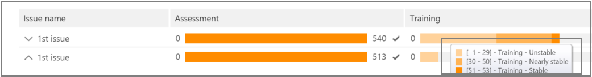

# Отслеживание анализа релевантности в Advanced eDiscovery (классическая)Track Relevance analysis in Advanced eDiscovery (classic)

> [!NOTE]
> Чтобы можно было использовать Advanced eDiscovery, требуется подписка на Office 365 E3 с надстройкой Advanced Compliance или E5 для организации. Если у вас этого плана нет и вы хотите попробовать Advanced eDiscovery, можете [зарегистрироваться для получения пробной версии Office 365 корпоративный E5](https://go.microsoft.com/fwlink/p/?LinkID=698279).Advanced eDiscovery requires an Office 365 E3 with the Advanced Compliance add-on or an E5 subscription for your organization. If you don't have that plan and want to try Advanced eDiscovery, you can [sign up for a trial of Office 365 Enterprise E5](https://go.microsoft.com/fwlink/p/?LinkID=698279). 
  
В Advanced eDiscovery вкладка "Отслеживание релевантности" отображает вычисляемую действительность обучения релевантности, выполненного на вкладке "Тег", и указывает на следующий шаг, выполняемый в процессе итеративного обучения релевантности.In Advanced eDiscovery, the Relevance Track tab displays the calculated validity of the Relevance training performed in the Tag tab and indicates the next step to take in the iterative training process in Relevance. 
  
## Отслеживание состояния обучения релевантностиTracking Relevance training status

1. Просмотреть следующие сведения в отслеживании релевантности для проблем с  делом, как показано в следующем примере диалоговое окно "Имя проблемы" ниже.View the following details in Relevance Track for the case issues, as shown in the following example of an **Issue name** dialog below. 
    
  - **Оценка**: этот индикатор хода выполнения показывает, в какой степени обучение релевантности, выполненного до этого момента, достигло целевого показателя оценки с точки зрения полей ошибок.**Assessment**: This progress indicator shows to what degree the Relevance training performed to this point has achieved the assessment target in terms of margin of error. Также отображаются результаты обучения релевантности.The richness of the Relevance training results is also displayed. 
    
  - **Обучение**: этот индикатор хода выполнения с кодом цвета и отображение подсказки по инструменту указывает стабильность результатов обучения релевантности и числовую шкалу, показывающая количество примеров обучения релевантности, помеченных для каждой проблемы.**Training**: This color-coded progress indicator and tool-tip display indicates the Relevance training results stability and a numeric scale showing the number of Relevance training samples tagged for each issue. Эксперт отслеживает ход выполнения итеративного процесса обучения релевантности.The expert monitors the progress of the iterative Relevance training process. 
    
  - **Пакетное вычисление**: этот индикатор хода выполнения предоставляет сведения о завершении пакетного вычисления.**Batch calculation**: This progress indicator provides information about the completion of Batch calculation.
    
  - **Следующий шаг:** отображает рекомендации по следующему шагу.**Next step**: Displays the recommendation for the next step to be performed. 
    
    В этом примере показана успешно завершенная оценка проблемы, обозначенная индикатором хода выполнения цвета и закладкой.In the example, a successfully completed Assessment for an issue is shown, indicated by the completed color progress indicator and the checkmark. Маркировка ведется, но этот случай по-прежнему считается нестабильным (состояние стабильности также отображается в подсказке).Tagging is underway, but the case is still considered unstable (stability status also shown in a tool-tip). Следующий шаг — "Обучение".The next step recommendation is "Training". 
    
    
  
    В расширенном представлении отображаются дополнительные сведения и параметры.The expanded view displays additional information and options. Отображаемая текущая поле ошибки — это поле ошибки отзыва в текущем состоянии оценки с учетом существующих (уже помеченных) файлов оценки.The displayed current error margin is the error margin of the recall in the current state of assessment, given the existing (already tagged) assessment files.
    
    > [!NOTE]
    >  Этап оценки можно обойти, с  помощью каждого из них с помощью каждого из них с помощью этого контрольного окна, а затем для "всех проблем".The Assessment stage can be bypassed by clearing the **Assessment** check box per issue and then for "all issues". Однако в результате статистика по этой проблеме не будет.However, as a result, there will be no statistics for this issue. > можно **только** перед выполнением оценки.> Clearing the **Assessment** check box can only be done before assessment is performed. Если в ситуации имеется несколько проблем, оценка пропускается только в том случае, если для каждой проблемы не задан этот контрольWhere multiple issues exist in a case, assessment is bypassed only if the check box is cleared for each issue 
  
    Если оценка не завершена с помощью первого примера набора файлов, оценка может быть следующим шагом для маркировки дополнительных файлов.When assessment is not completed with the first sample set of files, assessment might be the next step for tagging more files. 
    
    В  \> **средстве "Отслеживание** релевантности" индикатор хода обучения и подсказка указывают предполагаемое количество дополнительных примеров, необходимых для достижения стабильности.In **Relevance** \> **Track**, the training progress indicator and tool-tip indicate the estimated number of additional samples needed to reach stability. В этой оценке содержится руководство по дополнительному обучению.This estimate provides a guideline for the additional training needed.
    
    
  
2. Когда вы помечаем теги и хотите продолжить обучение, щелкните **"Обучение".**When you're done tagging and if you need to continue training, click **Training**. Другой пример набора файлов создается из загруженного набора файлов для дополнительного обучения.Another sample set of files is generated from the loaded file set for additional training. Затем вы вернетесь на вкладку "Тег", чтобы пометить и обучить дополнительные файлы.You are then returned to the Tag tab to tag and train more files.
    
### Достижение стабильных уровней обученияReaching stable training levels

После того как файлы оценки пройдют стабильный уровень обучения, Advanced eDiscovery будет готов к пакетным вычислениям.After the assessment files have attained a stable level of training, Advanced eDiscovery is ready for Batch calculation.
  
> [!NOTE]
> Обычно после трех стабильных учебных примеров следующим шагом является "Пакетное вычисление".Usually, after three stable training samples, the next step is "Batch calculation". Могут быть исключения, например, при внесении изменений в теги файлов из предыдущих примеров или при добавлении файлов с заме женой.There may be exceptions, for example, when there were changes to the tagging of files from earlier samples or when seed files were added. 
  
### Выполнение пакетных вычисленийPerforming Batch calculation

Пакетное вычисление выполняется в качестве следующего шага после успешного завершения обучения (когда на панели хода выполнения отображается стабильное состояние обучения, в подсказке инструмента отображается контрольный знак и стабильное состояние).) Пакетное вычисление применяет знания, полученные в ходе обучения релевантности, ко всем файлам, чтобы оценить релевантность файлов и назначить оценки релевантности.Batch calculation is executed as the next step after training is successfully completed (when a stable training status is shown by the progress bar, a checkmark and stable status in the tool-tip.) Batch calculation applies the knowledge acquired during the Relevance training to the entire file population, to assess the files' relevance and to assign Relevance scores.
  
Если имеется несколько проблем, для каждой проблемы делается пакетное вычисление.When there is more than one issue, Batch calculation is done per issue. Во время пакетного вычисления ход выполнения отслеживается при обработке всех файлов.During Batch calculation, progress is monitored while processing all of the files. 
  
Далее рекомендуется использовать значение "None", которое указывает на то, что на данном этапе не требуется дополнительное обучение релевантности.Here, the recommended next step is "None", which indicates that no additional iterative Relevance training is required at this point. Следующий этап — вкладка **"Выбор \> релевантности".**The next phase is the **Relevance \> Decide** tab. 
  
Если после пакетного вычисления необходимо импортировать новые файлы, администратор может добавить импортируемые файлы в новую нагрузку.If you want to import new files after Batch calculation, the administrator can add the imported files to a new load.
  
> [!NOTE]
> При **нажатии** кнопки "Отмена" во время пакетного вычисления процесс сохраняет уже выполненное.If you click **Cancel** during Batch calculation, the process saves what was already executed. Если вы снова запустите пакетное вычисление, процесс продолжится с последней выполненной точки.If you run Batch calculation again, the process will continue from the last executed point. 
  
### Оценка согласованности теговAssessing tagging consistency

Если в тегах файлов имеются несоответствия, это может повлиять на анализ.If there are inconsistencies in file tagging, it can affect the analysis. Процесс согласованности тегов Advanced eDiscovery можно использовать, если результаты не являются оптимальными или не уверены в согласованности.The Advanced eDiscovery tagging consistency process can be used when results are not optimal or consistency is in doubt. Возвращается список возможных файлов с несогласованным тегом, которые при необходимости можно просмотреть и повторно пометить.A list of possible inconsistently tagged files is returned, and they can be reviewed and re-tagged, as necessary.
  
> [!NOTE]
> После семи или более учебных кругов после оценки  можно просмотреть согласованность тегов в ходе обучения релевантности отслеживания вопросов с \>  \>  \>  \> **подробными результатами.**After seven or more training rounds following assessment, tagging consistency can be viewed in **Relevance** \> **Track** \> **Issue** \> **Detailed results** \> **Training progress**. Этот обзор делается по одной проблеме за раз.This review is done for one issue at a time. 
  
1. В **\> отслеживании релевантности** разоширйте строку проблемы.In **Relevance \> Track**, expand an issue's row.
    
2. Справа от следующего **шага нажмите** кнопку **"Изменить".**To the right of **Next step**, click **Modify**.
    
3. Выберите **несоответствия тегов** в качестве следующего **шага** после семи учебных примеров и нажмите кнопку **"ОК".**Select **Tag inconsistencies** as the **Next step** option, after seven training samples and click **OK**.
    
4. Выберите **несоответствия тегов.**Select **Tag inconsistencies**. На **вкладке** "Тег" откроется список несоответствий для повторного тега при необходимости.The **Tag** tab opens displaying a list of the inconsistencies to re-tag as necessary. 
    
5. Нажмите **кнопку "Расчет",** чтобы отправить изменения.Click **Calculate** to submit the changes. Следующий шаг после разметки несоответствий — "Обучение".The next step after tagging inconsistencies is "Training". 
    
## Просмотр и использование результатов релевантностиViewing and using Relevance results

На **вкладке \> "Отслеживание** релевантности" разйдите по строке проблемы и нажмите кнопку "Просмотреть" рядом с подробными **результатами.**In the **Relevance \> Track** tab, expand an issue's row, and next to **Detailed results**, click **View**. Отображаются области подробных результатов, как показано и описано ниже.The Detailed results panes are displayed, as shown and described below.
  

  
### Сводка по тегамTagging summary

 В приведенной ниже  примере сводка по тегам отображает итоги для каждого процесса маркировки файлов оценки, обучения и перенаверки.In the example shown below, the **Tagging summary** displays totals for each of Assessment, Training, and Catch-up file tagging processes. 
  

  
### Ключевые словаKeywords

Ключевое слово — это уникальная строка, слово, фраза или последовательность слов в файле, идентифицированных Advanced eDiscovery как важный индикатор релевантнсти файла.A keyword is a unique string, word, phrase, or sequence of words in a file identified by Advanced eDiscovery as a significant indicator of whether a file is relevant. В столбцах "Включить" перечислены ключевые слова и веса в файлах, помеченных как релевантные, а в столбцах "Исключить" перечислены ключевые слова и веса в файлах, помеченных как не релевантные.The "Include" columns list keyword and weights in files tagged as Relevant, and the "Exclude" columns lists keywords and weights in files tagged as Not relevant.
  
Advanced eDiscovery назначает отрицательные или положительные значения веса ключевых слов.Advanced eDiscovery assigns negative or positive keyword weight values. Чем выше вес, тем выше вероятность того, что файлу, в котором отображается ключевое слово, будет присвоена более высокая релевантность во время пакетного вычисления.The higher the weight, the higher the likelihood that a file in which the keyword appears is assigned a higher Relevance score during Batch calculation. 
  
Список ключевых слов Advanced eDiscovery можно использовать для дополнения списка, составленного экспертом, или в качестве косвенной проверки на санацию в любой момент процесса проверки файлов.The Advanced eDiscovery list of keywords can be used to supplement a list built by an expert or as an indirect sanity check at any point in the file review process.
  
### Ход обученияTraining progress

В **области "Ход** обучения" содержится график хода обучения и индикатор качества, как показано в примере ниже.The **Training Progress** pane includes a training progress graph and quality indicator display, as shown in the example below. 
  

  
 **Индикатор качества обучения:** отображает оценку согласованности тегов следующим образом:**Training quality indicator**: Displays the rating of the tagging consistency as follows:
  
- **Хороший:** файлы помечены согласованно.**Good**: Files are tagged consistently. (Отображается зеленый свет)(Green light displayed)
    
- **Средний:** некоторые файлы могут быть помечены несогласованно.**Medium**: Some files may be tagged inconsistently. (Желтый свет отображается)(Yellow light displayed)
    
- **Предупреждение:** многие файлы могут быть помечены несогласованно.**Warning**: Many files may be tagged inconsistently. (Отображается красный свет)(Red light displayed)
    
 **График хода обучения:** показывает степень стабильности обучения релевантности после ряда циклов обучения релевантности по сравнению со значением F-measure.**Training progress graph**: Shows the degree of Relevance training stability after a number of Relevance training cycles in comparison to the F-measure value. По мере перемещения слева направо по графику интервал уверенности сужается и используется наряду с F-мерой с помощью релевантности Advanced eDiscovery для определения стабильности при оптимизации результатов обучения релевантности.As we move from the left to the right across the graph, the confidence interval narrows and is used, along with the F-measure, by Advanced eDiscovery Relevance to determine stability when the Relevance training results are optimized.
  
> [!NOTE]
> Релевантность использует F2, метрику F-measure, в которой при отзыве вес в два раза превышает точность.Relevance uses F2, an F-measure metric where Recall receives twice as much weight as Precision. Для случаев с высоким уровнем насыщенности (более 25 %) релевантность использует F1 (соотношение 1:1).For cases with high richness (over 25%), Relevance uses F1 (1:1 ratio). Коэффициент F-мер можно настроить в **дополнительных** параметрах настройки \> **релевантности.**The F-measure ratio can be configured in **Relevance setup** \> **Advanced settings**. 
  
### Результаты пакетного вычисленияBatch calculation results

В **области результатов** пакетного вычисления содержится количество файлов, которые были очислены за релевантность следующим образом:The **Batch calculation results** pane includes the number of files that were scored for Relevance, as follows: 
  
- **Success****Success**
    
- **Пустой:** не содержит текста, например, только пробелы/вкладки**Empty**: Contains no text, for example, only spaces/tabs
    
- **Failed**: Due to excessive size or could not be read**Failed**: Due to excessive size or could not be read
    
- **Ignored**: Due to excessive size**Ignored**: Due to excessive size
    
- **Nebulous**: содержит бессмысленный текст или функции, релевантные для проблемы**Nebulous**: Contains meaningless text or no features relevant to the issue
    
> [!NOTE]
> Пустой, неудачный, игнорируемый или неблоковый будет иметь значение релевантности -1.Empty, Failed, Ignored, or Nebulous will receive a Relevance score of -1. 
  
### Статистика обученияTraining statistics

В **области статистики** "Обучение" отображаются статистика и графики, основанные на результатах обучения релевантности advanced eDiscovery.The **Training statistics** pane displays statistics and graphs based on results from Advanced eDiscovery Relevance training. 
  

  
В этом представлении показаны следующие данные:This view shows the following:
  
- **Соотношение отзывов и отзывов:** сравнение результатов в соответствии с результатами релевантности в гипотетически линейном обзоре.**Review-recall ratio**: Comparison of results according to Relevance scores in a hypothetically linear review. Отзыв оценивается с учетом набора размеров набора для проверки.Recall is estimated given the review set size set.
    
- **Параметры:** накопительная вычисляемая статистика, относящуюся к набору проверки по отношению к совокупности файлов для всего дела.**Parameters**: Cumulative calculated statistics pertaining to the review set in relation to the file population for the entire case.
    
- **Review**: Percentage of files to review based on this cutoff.**Review**: Percentage of files to review based on this cutoff.
    
- **Отзыв:** процент релевантного файла в наборе для проверки.**Recall**: Percentage of Relevant files in the review set. 
    
- **Распределение по оценке релевантности:** файлы на темно-сером дисплее слева находятся ниже оценки вырезания.**Distribution by relevance score**: Files in the dark gray display to the left are below the cutoff score. Подсказка отображает показатель релевантности и соответствующий процент файлов в наборе файлов для проверки по отношению к общему объему файлов.A tool-tip displays the Relevance score and the related percentage of files in the review file set in relation to the total files.
