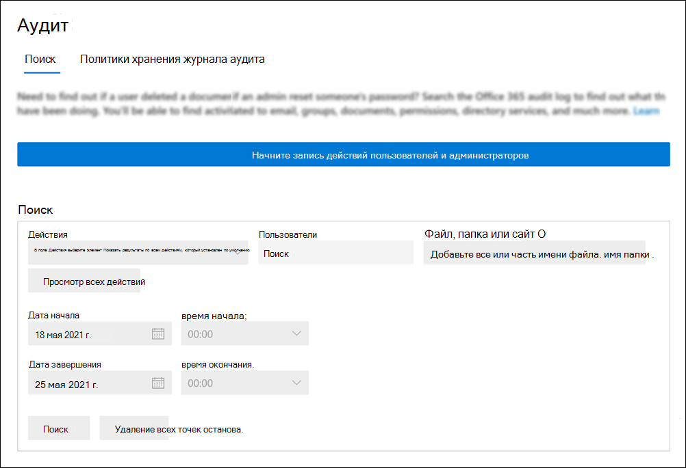

# <a name="turn-auditing-on-or-off"></a>Включение и отключение аудита

По умолчанию ведение журналов аудита включено для организаций, использующих Microsoft 365 и Office 365 корпоративный. Сюда также входят организации с подпиской E3/G3 или E5/G5. При включенном аудите в центре соответствия требованиям действия пользователя и администратора организации записывают в журнал аудита и сохраняются в течение 90 дней и до одного года в зависимости от лицензии, назначенной пользователям. Однако у вашей организации могут быть причины, по которой вы не хотите записывать и хранить данные журнала аудита. В этих случаях глобальный администратор может принять решение отключить аудит в Microsoft 365.

> [!IMPORTANT]
> Если вы отключите аудит в Microsoft 365, вы не можете использовать API Office 365 управления или Azure Sentinel для доступа к данным аудита для вашей организации. Отключение аудита, следуя шагам в этой статье, означает, что результаты не будут возвращены при поиске журнала аудита с помощью Центра соответствия требованиям безопасности & или при запуске **cmdlet Search-UnifiedAuditLog** в Exchange Online PowerShell. Это также означает, что журналы аудита не будут доступны через API Office 365 управления или Azure Sentinel.
  
## <a name="before-you-turn-auditing-on-or-off"></a>Прежде чем включить аудит или отключить

- Для того чтобы включить или отключить аудит в Exchange Online организации, необходимо Exchange Online роли Microsoft 365 журналов аудита. По умолчанию эта роль назначена группам ролей управления соответствием требованиям и организации на странице **Permissions** в центре администрирования Exchange. Глобальные администраторы в Microsoft 365 являются членами группы ролей управления организацией в Exchange Online. 

    > [!NOTE]
    > Пользователям должны быть назначены разрешения в Exchange Online, чтобы включить или отключить аудит. Если назначить пользователям роль журналов аудита на странице **Разрешения** в Центре соответствия требованиям & безопасности, они не смогут включить или отключить аудит. Это потому, что в основном cmdlet является Exchange Online PowerShell.

- Пошаговая инструкция по поиску журнала аудита см. в журнале Search [the audit log in the Security & Compliance Center.](search-the-audit-log-in-security-and-compliance.md) Дополнительные сведения об API Microsoft 365 управления см. в Microsoft 365 [API](/office/office-365-management-api/get-started-with-office-365-management-apis)управления.

- Чтобы убедиться, что аудит включен, можно выполнить следующую команду в Exchange Online PowerShell:

    ```powershell
    Get-AdminAuditLogConfig | FL UnifiedAuditLogIngestionEnabled
    ```

    Значение свойства  `True`  _UnifiedAuditLogIngestionEnabled_ указывает, что аудит включен. 

## <a name="turn-on-auditing"></a>Включи аудит

Если аудит не включен для организации, его можно включить в центре соответствия требованиям или с помощью Exchange Online PowerShell. Может потребоваться несколько часов после того, как вы включит аудит, прежде чем вы сможете возвращать результаты при поиске журнала аудита.
  
### <a name="use-the-compliance-center-to-turn-on-auditing"></a>Используйте центр соответствия требованиям, чтобы включить аудит

1. Перейдите на <https://compliance.microsoft.com> и войдите.

2. В левой области навигации Центр соответствия требованиям Microsoft 365 нажмите кнопку **Показать** все, а затем нажмите **аудит**.

   Если аудит не включен для вашей организации, отображается баннер, в результате чего начинается запись действий пользователя и администратора.

   

3. Нажмите **кнопку Начните запись пользователя и баннера действий администратора.**

   На то, чтобы изменение вступает в силу, может потребоваться до 60 минут.

### <a name="use-powershell-to-turn-on-auditing"></a>Чтобы включить аудит, используйте PowerShell

1. [Подключение к PowerShell Exchange Online](/powershell/exchange/connect-to-exchange-online-powershell)

2. Запустите следующую команду PowerShell, чтобы включить аудит в Office 365.

    ```powershell
    Set-AdminAuditLogConfig -UnifiedAuditLogIngestionEnabled $true
    ```

    Отображается сообщение о том, что для в действие изменения может потребоваться до 60 минут.
  
## <a name="turn-off-auditing"></a>Отключение аудита

Чтобы отключить аудит Exchange Online PowerShell, необходимо использовать Exchange Online PowerShell.
  
1. [Подключение к PowerShell Exchange Online](/powershell/exchange/connect-to-exchange-online-powershell)

2. Запустите следующую команду PowerShell, чтобы отключить аудит.

    ```powershell
    Set-AdminAuditLogConfig -UnifiedAuditLogIngestionEnabled $false
    ```

3. Через некоторое время убедитесь, что аудит отключен (отключен). Это можно сделать двумя способами:

    - В Exchange Online PowerShell запустите следующую команду:

      ```powershell
      Get-AdminAuditLogConfig | FL UnifiedAuditLogIngestionEnabled
      ```

      Значение свойства  `False`  _UnifiedAuditLogIngestionEnabled_ указывает на отключение аудита.

    - Перейдите на **страницу Аудит** в Центр соответствия требованиям Microsoft 365.

      Если аудит не включен для вашей организации, отображается баннер, в результате чего начинается запись действий пользователя и администратора.
