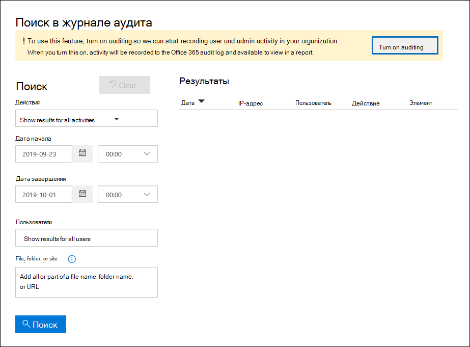

# <a name="turn-audit-log-search-on-or-off"></a>Включение и отключение поиска в журнале аудита

По умолчанию ведение журналов аудита включено для организаций, использующих Microsoft 365 и Office 365 корпоративный. Сюда также входят организации с подпиской E3/G3 или E5/G5. При включенном поиске журнала аудита в центре соответствия требованиям действия пользователя и администратора организации записывают в журнал аудита и сохраняются в течение 90 дней и до одного года в зависимости от лицензии, назначенной пользователям. Однако у вашей организации могут быть причины, по которой вы не хотите записывать и хранить данные журнала аудита. В этих случаях глобальный администратор может принять решение отключить аудит в Microsoft 365.

> [!IMPORTANT]
> Если вы отключите поиск журнала аудита в Microsoft 365, вы не сможете использовать API управления Office 365 или Azure Sentinel для доступа к данным аудита для вашей организации. Отключение поиска журнала аудита, следуя шагам в этой статье, означает, что результаты не будут возвращены при поиске журнала аудита с помощью Центра соответствия требованиям безопасности & или при запуске **cmdlet Search-UnifiedAuditLog** в Exchange Online PowerShell. Это также означает, что журналы аудита не будут доступны через API управления Office 365 или Azure Sentinel.
  
## <a name="before-you-turn-audit-log-search-on-or-off"></a>Прежде чем включить или отключить поиск журнала аудита

- Для того чтобы включить или отключить поиск журналов аудита в организации Microsoft 365, вам необходимо получить роль журналов аудита в Exchange Online. По умолчанию эта роль назначена группам ролей управления соответствием требованиям и организации на странице **Permissions** в центре администрирования Exchange. Глобальные администраторы в Microsoft 365 являются членами группы ролей управления организацией в Exchange Online. 
    
    > [!NOTE]
    > Пользователям должны быть назначены разрешения в Exchange Online, чтобы включить или отключить поиск журнала аудита. Если назначить пользователям роль журналов аудита на странице **Разрешения** в Центре соответствия требованиям & безопасности, они не смогут включить или отключить поиск журнала аудита. Это потому, что в основном cmdlet является Exchange Online PowerShell cmdlet. 
    
- Пошаговая инструкция по поиску журнала аудита см. в журнале Search [the audit log in the Security & Compliance Center.](search-the-audit-log-in-security-and-compliance.md) Дополнительные сведения об API управления Microsoft 365 см. в руб. Начало работы с API управления [Microsoft 365.](/office/office-365-management-api/get-started-with-office-365-management-apis)

- Чтобы убедиться, что поиск в журнале аудита включен, можно выполнить следующую команду в Exchange Online PowerShell:

    ```powershell
    Get-AdminAuditLogConfig | FL UnifiedAuditLogIngestionEnabled
    ```

    Значение свойства  `True`  _UnifiedAuditLogIngestionEnabled_ указывает на то, что поиск журнала аудита включен. 
    
## <a name="turn-on-audit-log-search"></a>Включив поиск журнала аудита

Если поиск журнала аудита не включен для организации, его можно включить в центре соответствия требованиям или с помощью Exchange Online PowerShell. После включив поиск журнала аудита, может потребоваться несколько часов, прежде чем вы сможете возвращать результаты при поиске журнала аудита.
  
### <a name="use-the-compliance-center-to-turn-on-audit-log-search"></a>Используйте центр соответствия требованиям, чтобы включить поиск журналов аудита

1. [Перейдите в центр соответствия требованиям и](https://protection.office.com) войдите.

2. В центре соответствия требованиям перейдите к **поиску**  >  **журнала аудита поиска.**

   Если в организации не включен поиск журнала аудита, отображается баннер, включающий проверку для записи действий пользователя и администратора.

3. Нажмите **кнопку Включить аудит.**

    
  
    Баннер обновляется, чтобы сказать, что журнал аудита готовится и что вы можете искать действия пользователя и администратора в течение нескольких часов.

### <a name="use-powershell-to-turn-on-audit-log-search"></a>Чтобы включить поиск журнала аудита, используйте PowerShell

1. [Подключение к PowerShell Exchange Online](/powershell/exchange/connect-to-exchange-online-powershell)

2. Запустите следующую команду PowerShell, чтобы включить поиск журнала аудита в Office 365.

    ```powershell
    Set-AdminAuditLogConfig -UnifiedAuditLogIngestionEnabled $true
    ```

    Отображается сообщение о том, что для в действие изменения может потребоваться до 60 минут.
  
## <a name="turn-off-audit-log-search"></a>Отключение поиска журнала аудита

Чтобы отключить поиск журнала аудита, необходимо использовать Exchange Online PowerShell.
  
1. [Подключение к PowerShell Exchange Online](/powershell/exchange/connect-to-exchange-online-powershell)

2. Запустите следующую команду PowerShell, чтобы отключить поиск журнала аудита.

    ```powershell
    Set-AdminAuditLogConfig -UnifiedAuditLogIngestionEnabled $false
    ```

3. Через некоторое время убедитесь, что поиск журнала аудита отключен (отключен). Это можно сделать двумя способами:

    - В Exchange Online PowerShell запустите следующую команду:

      ```powershell
      Get-AdminAuditLogConfig | FL UnifiedAuditLogIngestionEnabled
      ```

      Значение свойства  `False`  _UnifiedAuditLogIngestionEnabled_ указывает на отключение поиска журнала аудита. 

    - В центре [соответствия требованиям](https://protection.office.com)перейдите к поиску журнала  \> **аудита поиска.**

      В баннере отображается надпись о том, что для записи действий пользователя и администратора необходимо включить аудит.