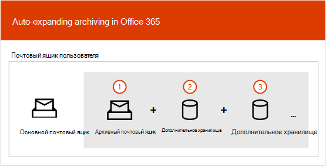
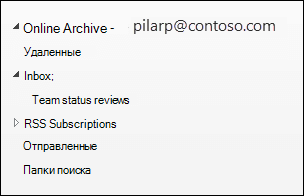
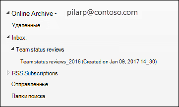

# Общие сведения о неограниченной архивацииOverview of unlimited archiving

В Office 365 архивные почтовые ящики предоставляют пользователям дополнительное место в хранилище почтовых ящиков.In Office 365, archive mailboxes provide users with additional mailbox storage space. После включения архивного почтового ящика пользователя доступно до 100 ГБ дополнительного хранилища.After a user's archive mailbox is enabled, up to 100 GB of additional storage is available. В прошлом, когда была достигнута квота хранилища в 100 ГБ, организациям приходилось обращаться в корпорацию Майкрософт, чтобы запросить дополнительное место для архивного почтового ящика.In the past, when the 100-GB storage quota was reached, organizations had to contact Microsoft to request additional storage space for an archive mailbox. Это больше не так.That's no longer the case.

Функция неограниченной архивирования в Microsoft 365 (называемая функцией архивирования с автоматическим *расширением)* предоставляет дополнительное хранилище в архивных почтовых ящиках.The unlimited archiving feature in Microsoft 365 (called *auto-expanding archiving*) provides additional storage in archive mailboxes. Когда квота хранилища в архивном почтовом ящике достигается, Microsoft 365 автоматически увеличивает размер архива, что означает, что у пользователей не будет места на хранилище почтовых ящиков, а администраторам не придется запрашивать дополнительное хранилище для архивных почтовых ящиков.When the storage quota in the archive mailbox is reached, Microsoft 365 automatically increases the size of the archive, which means that users won't run out of mailbox storage space and administrators won't have to request additional storage for archive mailboxes.

Пошаговая инструкция по включению автоматического расширения архива см. в подзаговоре ["Включение неограниченной архивной архива".](enable-unlimited-archiving.md)For step-by-step instructions for turning on auto-expanding archiving, see [Enable unlimited archiving](enable-unlimited-archiving.md).

> [!NOTE]
> Автоматически расширяющиеся архивы также доступны для общих почтовых ящиков.Auto-expanding archiving also supports shared mailboxes. Чтобы включить архив для общего почтового ящика, необходима лицензия exchange Online (план 2) или Exchange Online (план 1) с архивация на базе Exchange Online лицензии.To enable the archive for a shared mailbox, an Exchange Online Plan 2 license or an Exchange Online Plan 1 license with an Exchange Online Archiving license is required.

## Как работает автоматическое расширение архиваHow auto-expanding archiving works

Как объяснялось ранее, при включаемом архивном почтовом ящике пользователя создается дополнительное место в хранилище почтовых ящиков.As previously explained, additional mailbox storage space is created when a user's archive mailbox is enabled. Если включено автоматическое расширение архива, Microsoft 365 периодически проверяет размер архивного почтового ящика.When auto-expanding archiving is enabled, Microsoft 365 periodically checks the size of the archive mailbox. Когда архивный почтовый ящик близко к предельному объему хранилища, Microsoft 365 автоматически создает дополнительное место для архива.When an archive mailbox gets close to its storage limit, Microsoft 365 automatically creates additional storage space for the archive. Если пользователю не место в этом дополнительном хранилище, Microsoft 365 добавляет больше места в архив пользователя.If the user runs out of this additional storage space, Microsoft 365 adds more storage space to the user's archive. Этот процесс происходит автоматически, что означает, что администраторам не нужно запрашивать дополнительное архивное хранилище или управлять архивативам с автоматическим расширением.This process happens automatically, which means administrators don't have to request additional archive storage or manage auto-expanding archiving.

Ниже представлен краткий обзор процесса.Here's a quick overview of the process.

1. Архивная архива включена для почтового ящика пользователя или общего почтового ящика.Archiving is enabled for a user mailbox or a shared mailbox. Создается архивный почтовый ящик с объемом хранилища 100 ГБ, а квота предупреждения для архивного почтового ящика составляет 90 ГБ.An archive mailbox with 100 GB of storage space is created, and the warning quota for the archive mailbox is set to 90 GB.

2. Администратор включает автоматическое расширение архива для почтового ящика.An administrator enables auto-expanding archiving for the mailbox. Когда архивный почтовый ящик (включая папку "Элементы с возможностью восстановления") достигает 90 ГБ, он преобразуется в архив с автоматическим расширением, а Microsoft 365 добавляет в него место.When the archive mailbox (including the Recoverable Items folder) reaches 90 GB, it's converted to an auto-expanding archive, and Microsoft 365 adds storage space to the archive. Подготовка дополнительного пространства для хранения может занять до 30 дней.It can take up to 30 days for the additional storage space to be provisioned.

   > [!NOTE]
   > Если почтовый ящик помещен на удержание или назначен политике хранения, квота хранилища для архивного почтового ящика увеличивается до 110 ГБ при включенной автоматическом расширении архивирования.If a mailbox is placed on hold or assigned to a retention policy, the storage quota for the archive mailbox is increased to 110 GB when auto-expanding archiving is enabled. Аналогичным образом, квота предупреждения для архива увеличена до 100 ГБ.Similarly, the archive warning quota is increased to 100 GB.

3. При необходимости Microsoft 365 автоматически добавляет больше места в хранилище.Microsoft 365 automatically adds more storage space when necessary.

> [!IMPORTANT]
> Архив автоматического расширения поддерживается только для почтовых ящиков, используемых для отдельных пользователей (или общих почтовых ящиков) с скоростью роста не более 1 ГБ в день.Auto-expanding archive is only supported for mailboxes used for individual users (or shared mailboxes) with a growth rate that doesn't exceed 1 GB per day. Архивный почтовый ящик пользователя предназначен только для этого пользователя.A user's archive mailbox is intended for just that user. Использование журналов, правил транспорта или правил автоматической пересылки для копирования сообщений в архивный почтовый ящик запрещено.Using journaling, transport rules, or auto-forwarding rules to copy messages to an archive mailbox is not permitted. Корпорация Майкрософт оставляет за собой право отказать в неограниченном архиве в тех случаях, когда архивный почтовый ящик пользователя используется для хранения архивных данных других пользователей или в других случаях ненадлежащего использования.Microsoft reserves the right to deny unlimited archiving in instances where a user's archive mailbox is used to store archive data for other users or in other cases of the inappropriate use.

## Что перемещается в дополнительное архивное хранилище?What gets moved to the additional archive storage space?

Для эффективного использования автоматически расширяемого архивного хранилища папки могут быть перемещены.To make efficient use of auto-expanding archive storage, folders may get moved. Microsoft 365 определяет, какие папки перемещаются при добавлении дополнительного хранилища в архив.Microsoft 365 determines which folders get moved when additional storage is added to the archive. Иногда при перемещении папки автоматически создается одна или несколько вложенных папок, а элементы из исходной папки распространяются в эти папки для упрощения процесса перемещения.Sometimes when a folder is moved, one or more subfolders are automatically created and items from the original folder are distributed to these folders to facilitate the moving process. При просмотре архивной части списка папок в Outlook эти вложенные папки отображаются под исходной папкой.When viewing the archive portion of the folder list in Outlook, these subfolders are displayed under the original folder.  Соглашение об именах, которое Microsoft 365 использует для именования этих ветвей, _yyyy (создается на **\<folder name\> MMM dd, y h_mm)**, где:The naming convention that Microsoft 365 uses to name these subfolders is **\<folder name\>_yyyy (Created on mmm dd, yyyy h_mm)**, where:

- **yyy —** это год, в который были получены сообщения в папке.**yyyy** is the year the messages in the folder were received.

- **mmm dd, y h_m** — это дата и время создания подкапки в Office 365 в формате UTC в зависимости от часовой пояс пользователя и региональных параметров в Outlook.**mmm dd, yyyy h_m** is the date and time that the subfolder was created by Office 365, in UTC format, based on the user's time zone and regional settings in Outlook.

На следующих снимках экрана список папок показывается до и после того, как сообщения перемещаются в архив с автоматическим расширением.The following screenshots show a folder list before and after messages are moved to an auto-expanded archive.

 **Перед добавлением дополнительного хранилища****Before additional storage is added**

 **После того как будет добавлено дополнительное хранилище****After additional storage is added**

> [!NOTE]
> Как было описано выше, Microsoft 365 перемещает элементы во вудерки (и именует их с использованием описанного выше соглашения об именовом имени) для распространения контента в вспомогательный архив.As previously described, Microsoft 365 moves items to subfolders (and names them using the naming convention described above) to help distribute content to an auxiliary archive. Но перемещение элементов во вудерки может не всегда иметь дело.But moving items to subfolders may not always be the case. Иногда в вспомогательный архив может быть перемещена вся папка.Sometimes an entire folder may be moved to an auxiliary archive. В этом случае папка сохранит свое исходное имя.In this case, the folder will retain its original name.  В списке папок в Outlook не будет видно, что папка была перемещена в вспомогательный архив.It won't be apparent in the folder list in Outlook that the folder was moved to an auxiliary archive.

## Требования Outlook для доступа к элементов в архиве с автоматическим расширениемOutlook requirements for accessing items in an auto-expanded archive

Для доступа к сообщениям, хранимым в архиве с автоматическим расширением, пользователям необходимо использовать один из следующих клиентов Outlook:To access messages that are stored in an auto-expanded archive, users have to use one of the following Outlook clients:

- Outlook 2016 или Outlook 2019 для WindowsOutlook 2016 or Outlook 2019 for Windows

- Outlook в ИнтернетеOutlook on the web

- Outlook 2016 или Outlook 2019 для MacOutlook 2016 or Outlook 2019 for Mac

Ниже учесть некоторые моменты, которые следует учитывать при использовании Outlook или Outlook в Интернете для доступа к сообщениям, хранимым в архиве с автоматическим расширением.Here are some things to consider when using Outlook or Outlook on the web to access messages stored in an auto-expanded archive.

- Вы можете получить доступ к любой папке в архивном почтовом ящике, включая те, которые были перемещены в автоматически расширяемую область хранения.You can access any folder in your archive mailbox, including ones that were moved to the auto-expanded storage area.

- В Outlook в Интернете доступен поиск архива с автоматическим расширением.Search for auto-expanded archiving is available in Outlook for the web. Как и в оперативном архиве, вы можете искать элементы, которые были перемещены в дополнительную область хранения, только выяя текущую папку.Similar to Online Archive, you can search for items that were moved to an additional storage area only by searching the current folder itself. Это означает, что необходимо выбрать архивную папку в списке папок, а затем выбрать одну папку в качестве области поиска.This means that you must select the archive folder in the folder list, and then select a single folder as your search scope. Аналогичным образом, если папка в автоматически расширенной области хранения содержит вложенные папки, необходимо искать каждую вложенную папку отдельно.Similarly, if a folder in an auto-expanded storage area contains subfolders, you must search each subfolder separately.
- Автоматически расширенный поиск в архиве доступен в outlook Desktop в current Channel (предварительная версия).Auto-expanded archive search is available in Outlook Desktop in Current Channel (Preview). В этой предварительной версии доступна область текущего почтового ящика, что позволяет искать в архиве с автоматическим расширением.Within this preview, the Current Mailbox scope is available, thus allowing you to search the auto-expanded archive. Дополнительные сведения об этом и других функций поддержки Поиска (Майкрософт) см. в сведениях о том, как Outlook для Windows, подключенный к [Exchange Online, использует Поиск (Майкрософт).](https://techcommunity.microsoft.com/t5/outlook-global-customer-service/how-outlook-for-windows-connected-to-exchange-online-utilizes/ba-p/1715045)For more information about this and other Microsoft Search support features, see [How Outlook for Windows connected to Exchange Online utilizes Microsoft Search](https://techcommunity.microsoft.com/t5/outlook-global-customer-service/how-outlook-for-windows-connected-to-exchange-online-utilizes/ba-p/1715045). 

- Количество элементов в Outlook и количество просмотров и непрочитанные (в Outlook и Outlook в Интернете) в автоматически расширяемом архиве могут быть не точными.Item counts in Outlook and Read/Unread counts (in Outlook and Outlook on the web) in an auto-expanded archive might not be accurate.

- Вы можете удалить элементы во вложенной папке, которая указывает на автоматически расширяемую область хранения, но сама папка не может быть удалена.You can delete items in a subfolder that points to an auto-expanded storage area, but the folder itself can't be deleted.

- Функцию восстановления удаленных элементов нельзя использовать для восстановления элемента, удаленного из автоматически расширяемого хранилища.You can't use the Recover Deleted Items feature to recover an item that was deleted from an auto-expanded storage area.

## Автоматическое расширение архива и других функций соответствия требованиямAuto-expanding archiving and other compliance features

В этом разделе поясняется функциональность между автоматически расширяемой архиватива и другими функциями обеспечения соответствия требованиям и управления данными.This section explains the functionality between auto-expanding archiving and other compliance and data governance features.

- **EDiscovery:** При использовании средства eDiscovery, такого как поиск контента или In-Place eDiscovery, поиск также ведется в дополнительных областях хранения в архиве с автоматическим расширением.**eDiscovery:** When you use an eDiscovery tool, such as Content Search or In-Place eDiscovery, the additional storage areas in an auto-expanded archive are also searched.

- **Хранение:** Когда вы помещаете почтовый ящик на удержание с помощью таких средств, как хранение для судебного разбирательства в Exchange Online или удержание дел eDiscovery и политики хранения в Центре безопасности и соответствия требованиям, контент, расположенный в архиве с автоматическим расширением, также помещается на удержание.**Retention:** When you put a mailbox on hold by using tools such as Litigation Hold in Exchange Online or eDiscovery case holds and retention policies in the security and compliance center, content located in an auto-expanded archive is also placed on hold.

- **Управление записями сообщений (MRM):** Если вы используете политики удаления mrm в Exchange Online для окончательного удаления элементов почтовых ящиков с истекшим сроком действия, элементы с истекшим сроком действия, расположенные в архиве с автоматическим расширением, также будут удалены.**Messaging records management (MRM):** If you use MRM deletion policies in Exchange Online to permanently delete expired mailbox items, expired items located in the auto-expanded archive will also be deleted.

- **Служба импорта:** Службу импорта Office 365 можно использовать для импорта PST-файлов в автоматически расширяемой архив пользователя.**Import service:** You can use the Office 365 Import service to import PST files to a user's auto-expanded archive. В архивный почтовый ящик пользователя можно импортировать до 100 ГБ данных из PST-файлов.You can import up to 100 GB of data from PST files to the user's archive mailbox.

## Дополнительные сведенияMore information

Дополнительные технические сведения об автоматическом расширении архивов см. в microsoft [365: auto-Expanding Archives FAQ.](https://techcommunity.microsoft.com/t5/exchange-team-blog/office-365-auto-expanding-archives-faq/ba-p/607784)For more technical details about auto-expanding archiving, see [Microsoft 365: Auto-Expanding Archives FAQ](https://techcommunity.microsoft.com/t5/exchange-team-blog/office-365-auto-expanding-archives-faq/ba-p/607784).
