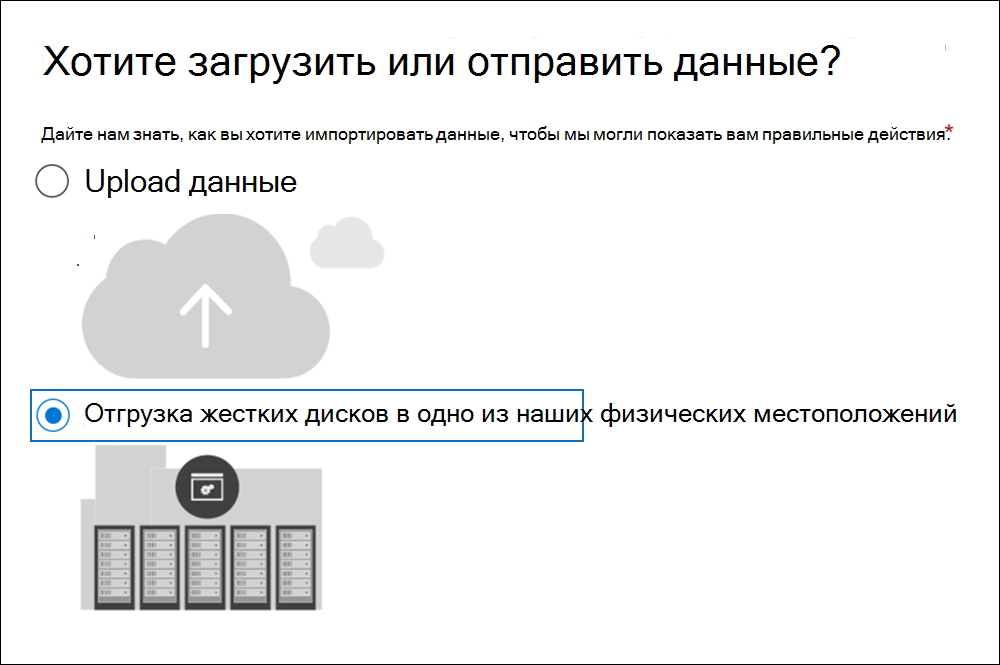
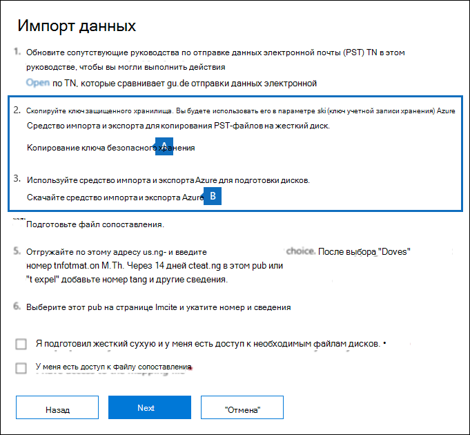
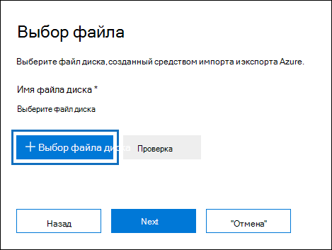
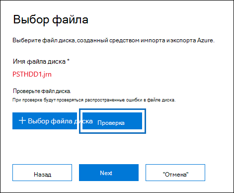

# <a name="use-drive-shipping-to-import-your-organizations-pst-files"></a><span data-ttu-id="d3eb2-103">Использование доставки дисков для импорта PST-файлов организации</span><span class="sxs-lookup"><span data-stu-id="d3eb2-103">Use drive shipping to import your organization's PST files</span></span>

<span data-ttu-id="d3eb2-104">**Эта статья для администраторов. Вы пытаетесь импортировать PST-файлы в собственный почтовый ящик? См. [импорт электронной почты, контактов и календаря из Outlook PST-файла](https://go.microsoft.com/fwlink/p/?LinkID=785075)**</span><span class="sxs-lookup"><span data-stu-id="d3eb2-104">**This article is for administrators. Are you trying to import PST files to your own mailbox? See [Import email, contacts, and calendar from an Outlook .pst file](https://go.microsoft.com/fwlink/p/?LinkID=785075)**</span></span>
   
<span data-ttu-id="d3eb2-105">Используйте службу Office 365 импорта и доставку на массовый импорт PST-файлов в почтовые ящики пользователей.</span><span class="sxs-lookup"><span data-stu-id="d3eb2-105">Use the Office 365 Import service and drive shipping to bulk-import PST files to user mailboxes.</span></span> <span data-ttu-id="d3eb2-106">Под отправкой жестких дисков имеется в виду следующее: вы копируете PST-файлы на жесткие диски, а затем отправляете эти диски в корпорацию Майкрософт.</span><span class="sxs-lookup"><span data-stu-id="d3eb2-106">Drive shipping means that you copy the PST files to a hard disk drive and then physically ship the drive to Microsoft.</span></span> <span data-ttu-id="d3eb2-107">Когда Microsoft получает жесткий диск, персонал центра обработки данных копирует данные с жесткого диска в область хранения в облаке Майкрософт.</span><span class="sxs-lookup"><span data-stu-id="d3eb2-107">When Microsoft receives your hard drive, data center personnel copies the data from the hard drive to a storage area in the Microsoft cloud.</span></span> <span data-ttu-id="d3eb2-108">Затем у вас есть возможность обрезать данные PST, импортируемые в целевые почтовые ящики, установив фильтры, которые контролируют импортируемые данные.</span><span class="sxs-lookup"><span data-stu-id="d3eb2-108">Then you have the opportunity to trim the PST data that's imported to the target mailboxes by setting filters that control what data gets imported.</span></span> <span data-ttu-id="d3eb2-109">После запуска задания импорта служба импорта импортирует данные PST из области хранения в почтовые ящики пользователей.</span><span class="sxs-lookup"><span data-stu-id="d3eb2-109">After you start the import job, the Import service imports the PST data from the storage area to user mailboxes.</span></span> <span data-ttu-id="d3eb2-110">Использование доставки диска для импорта PST-файлов в почтовые ящики пользователей — это один из способов переноса электронной почты организации на Office 365.</span><span class="sxs-lookup"><span data-stu-id="d3eb2-110">Using drive shipping to import PST files to user mailboxes is one way to migrate your organization's email to Office 365.</span></span>
  
<span data-ttu-id="d3eb2-111">Вот действия, необходимые для использования доставки дисков для импорта PST-файлов для Microsoft 365 почтовых ящиков:</span><span class="sxs-lookup"><span data-stu-id="d3eb2-111">Here are the steps required to use drive shipping to import PST files to Microsoft 365 mailboxes:</span></span>
  
[<span data-ttu-id="d3eb2-112">Шаг 1. Скачайте безопасный ключ хранения и средство импорта PST</span><span class="sxs-lookup"><span data-stu-id="d3eb2-112">Step 1: Download the secure storage key and PST Import tool</span></span>](#step-1-download-the-secure-storage-key-and-pst-import-tool)

[<span data-ttu-id="d3eb2-113">Шаг 2. Скопируйте PST-файлы на жесткий диск</span><span class="sxs-lookup"><span data-stu-id="d3eb2-113">Step 2: Copy the PST files to the hard drive</span></span>](#step-2-copy-the-pst-files-to-the-hard-drive)

[<span data-ttu-id="d3eb2-114">Шаг 3. Создание файла сопоставления импорта PST</span><span class="sxs-lookup"><span data-stu-id="d3eb2-114">Step 3: Create the PST Import mapping file</span></span>](#step-3-create-the-pst-import-mapping-file)

<span data-ttu-id="d3eb2-115">[Действие 4. В Office 365 создайте задание на импорт PST-файлов](#step-4-create-a-pst-import-job-in-office-365).</span><span class="sxs-lookup"><span data-stu-id="d3eb2-115">[Step 4: Create a PST Import job in Office 365](#step-4-create-a-pst-import-job-in-office-365)</span></span>

<span data-ttu-id="d3eb2-116">[Действие 5. Отправьте жесткие диски в корпорацию Майкрософт](#step-5-ship-the-hard-drive-to-microsoft).</span><span class="sxs-lookup"><span data-stu-id="d3eb2-116">[Step 5: Ship the hard drive to Microsoft](#step-5-ship-the-hard-drive-to-microsoft)</span></span>

[<span data-ttu-id="d3eb2-117">Шаг 6. Фильтрация данных и запуск задания импорта PST-файлов</span><span class="sxs-lookup"><span data-stu-id="d3eb2-117">Step 6: Filter data and start the PST Import job</span></span>](#step-6-filter-data-and-start-the-pst-import-job)
  
> [!IMPORTANT]
> <span data-ttu-id="d3eb2-118">Для загрузки безопасного ключа хранилища и средства импорта необходимо выполнить шаг 1 один раз.</span><span class="sxs-lookup"><span data-stu-id="d3eb2-118">You have to perform Step 1 once to down load the secure storage key and the import tool.</span></span> <span data-ttu-id="d3eb2-119">После выполнения этих действий выполните шаг 2—шаг 6 каждый раз, когда вы хотите отогнать жесткий диск в Корпорацию Майкрософт.</span><span class="sxs-lookup"><span data-stu-id="d3eb2-119">After you perform these steps, follow Step 2 through Step 6 each time you want to ship a hard drive to Microsoft.</span></span> 
  
<span data-ttu-id="d3eb2-120">Часто задаваемые вопросы об использовании доставки дисков для импорта PST-файлов для Office 365 см. в часто задаваемой информации об использовании доставки дисков для импорта [PST-файлов.](./faqimporting-pst-files-to-office-365.yml#using-drive-shipping-to-import-pst-files)</span><span class="sxs-lookup"><span data-stu-id="d3eb2-120">For frequently asked questions about using drive shipping to import PST files to Office 365, see [FAQs for using drive shipping to import PST files](./faqimporting-pst-files-to-office-365.yml#using-drive-shipping-to-import-pst-files).</span></span> 
  
## <a name="before-you-import-pst-files"></a><span data-ttu-id="d3eb2-121">Перед импортом PST-файлов</span><span class="sxs-lookup"><span data-stu-id="d3eb2-121">Before you import PST files</span></span>

- <span data-ttu-id="d3eb2-122">Для импорта файлов PST в почтовые ящики Microsoft 365 необходимо назначить роль экспорта-импорта почтовых ящиков в Exchange Online.</span><span class="sxs-lookup"><span data-stu-id="d3eb2-122">You have to be assigned the Mailbox Import Export role in Exchange Online to import PST files to Microsoft 365 mailboxes.</span></span> <span data-ttu-id="d3eb2-123">По умолчанию эта роль не назначена ни одной группе ролей в Exchange Online.</span><span class="sxs-lookup"><span data-stu-id="d3eb2-123">By default, this role isn't assigned to any role group in Exchange Online.</span></span> <span data-ttu-id="d3eb2-124">Вы можете добавить роль "Импорт и экспорт почтовых ящиков" в группу ролей "Управление организацией".</span><span class="sxs-lookup"><span data-stu-id="d3eb2-124">You can add the Mailbox Import Export role to the Organization Management role group.</span></span> <span data-ttu-id="d3eb2-125">Кроме того, вы можете создать группу ролей, назначить ей роль "Импорт и экспорт почтовых ящиков" и добавить себя в качестве участника группы.</span><span class="sxs-lookup"><span data-stu-id="d3eb2-125">Or you can create a role group, assign the Mailbox Import Export role, and then add yourself as a member.</span></span> <span data-ttu-id="d3eb2-126">Дополнительные сведения см. в разделах "Добавление роли в группу ролей" или "Создание группы ролей" статьи [Управление группами ролей](/Exchange/permissions-exo/role-groups).</span><span class="sxs-lookup"><span data-stu-id="d3eb2-126">For more information, see the "Add a role to a role group" or the "Create a role group" sections in [Manage role groups](/Exchange/permissions-exo/role-groups).</span></span>
    
    <span data-ttu-id="d3eb2-127">Кроме того, чтобы создать задания импорта в Центре безопасности и соответствия требованиям, должно выполняться одно из следующих условий:</span><span class="sxs-lookup"><span data-stu-id="d3eb2-127">Additionally, to create import jobs in the Security & Compliance Center, one of the following must be true:</span></span>
    
  - <span data-ttu-id="d3eb2-128">Вам должна быть назначена роль "Получатели почты" в Exchange Online.</span><span class="sxs-lookup"><span data-stu-id="d3eb2-128">You have to be assigned the Mail Recipients role in Exchange Online.</span></span> <span data-ttu-id="d3eb2-129">По умолчанию эта роль назначается группам ролей "Управление организацией" и "Управление получателями".</span><span class="sxs-lookup"><span data-stu-id="d3eb2-129">By default, this role is assigned to the Organization Management and Recipient Management roles groups.</span></span>
    
    <span data-ttu-id="d3eb2-130">или</span><span class="sxs-lookup"><span data-stu-id="d3eb2-130">Or</span></span>
    
  - <span data-ttu-id="d3eb2-131">Вы должны быть глобальным администратором в своей организации.</span><span class="sxs-lookup"><span data-stu-id="d3eb2-131">You have to be a global administrator in your organization.</span></span>
    
    > [!TIP]
    > <span data-ttu-id="d3eb2-132">Рекомендуется создать новую группу ролей в Exchange Online, предназначенную специально для импорта PST-файлов в Office 365.</span><span class="sxs-lookup"><span data-stu-id="d3eb2-132">Consider creating a new role group in Exchange Online that's specifically intended for importing PST files to Office 365.</span></span> <span data-ttu-id="d3eb2-133">Для минимального уровня прав, необходимого для импорта PST-файлов, назначьте роли "Импорт и экспорт почтовых ящиков" и "Получатели почты" новой группе ролей, а затем добавьте участников.</span><span class="sxs-lookup"><span data-stu-id="d3eb2-133">For the minimum level of privileges required to import PST files, assign the Mailbox Import Export and Mail Recipients roles to the new role group, and then add members.</span></span> 
  
- <span data-ttu-id="d3eb2-134">PST-файлы, которые вы хотите скопировать на жесткие диски, должны храниться на файловом сервере или в общей папке в вашей организации.</span><span class="sxs-lookup"><span data-stu-id="d3eb2-134">You need to store the PST files that you want to copy to a hard drive on a file server or shared folder in your organization.</span></span> <span data-ttu-id="d3eb2-135">На шаге 2 вы запустите средство экспорта импорта Azure (WAImportExport.exe), которое копирует файлы PST, хранимые на этом файловом сервере или общей папке, на жесткий диск.</span><span class="sxs-lookup"><span data-stu-id="d3eb2-135">In Step 2, you run the Azure Import Export tool (WAImportExport.exe) that copies the PST files that are stored on this file server or shared folder to the hard drive.</span></span>

- <span data-ttu-id="d3eb2-136">Крупные PST-файлы могут повлиять на скорость импорта PST.</span><span class="sxs-lookup"><span data-stu-id="d3eb2-136">Large PST files may impact the performance of the PST import process.</span></span> <span data-ttu-id="d3eb2-137">Поэтому рекомендуется, чтобы каждый PST-файл, который вы скопируете на жесткий диск в шаге 2, не должен быть больше 20 ГБ.</span><span class="sxs-lookup"><span data-stu-id="d3eb2-137">So we recommend that each PST file you copy to the hard drive in Step 2 should be no larger than 20 GB.</span></span>
    
- <span data-ttu-id="d3eb2-138">Только 2,5-дюймовые твердотопливные диски (SSD) или 2,5-дюймовые или 3,5-дюймовые жесткие диски SATA II/III поддерживаются для использования в службе импорта Office 365.</span><span class="sxs-lookup"><span data-stu-id="d3eb2-138">Only 2.5-inch solid-state drives (SSDs) or 2.5-inch or 3.5-inch SATA II/III internal hard drives are supported for use with the Office 365 Import service.</span></span> <span data-ttu-id="d3eb2-139">емкостью до 10 ТБ.</span><span class="sxs-lookup"><span data-stu-id="d3eb2-139">You can use hard drives up to 10 TB.</span></span> <span data-ttu-id="d3eb2-140">При выполнении заданий импорта на каждом жестком диске будет обрабатываться только первый том данных.</span><span class="sxs-lookup"><span data-stu-id="d3eb2-140">For import jobs, only the first data volume on the hard drive will be processed.</span></span> <span data-ttu-id="d3eb2-141">Тома должны быть отформатированы в файловой системе NTFS.</span><span class="sxs-lookup"><span data-stu-id="d3eb2-141">The data volume must be formatted with NTFS.</span></span> <span data-ttu-id="d3eb2-142">При копировании данных на жесткий диск можно прикрепить их непосредственно с помощью 2,5-дюймового SSD или 2,5-дюймового или 3,5-дюймового соединителя SATA II/III или можно прикрепить его внешне с помощью внешнего 2,5-дюймового SSD или 2,5-дюймового или 3,5-дюймового USB-адаптора SATA II/III.</span><span class="sxs-lookup"><span data-stu-id="d3eb2-142">When copying data to a hard drive, you can attach it directly using a 2.5-inch SSD or 2.5-inch or 3.5-inch SATA II/III connector or you can attach it externally using an external 2.5-inch SSD or 2.5-inch or 3.5-inch SATA II/III USB adaptor.</span></span>
    
    > [!IMPORTANT]
    > <span data-ttu-id="d3eb2-143">Внешние жесткие диски со встроенным USB-адаптером не поддерживаются службой импорта Office 365.</span><span class="sxs-lookup"><span data-stu-id="d3eb2-143">External hard drives that come with an built-in USB adaptor aren't supported by the Office 365 Import service.</span></span> <span data-ttu-id="d3eb2-144">Кроме того, невозможно использовать диск в корпусе внешнего жесткого диска.</span><span class="sxs-lookup"><span data-stu-id="d3eb2-144">Additionally, the disk inside the casing of an external hard drive can't be used.</span></span> <span data-ttu-id="d3eb2-145">Не отправляйте внешние жесткие диски.</span><span class="sxs-lookup"><span data-stu-id="d3eb2-145">Please don't ship external hard drives.</span></span> 
  
- <span data-ttu-id="d3eb2-146">Жесткие диски, на которые вы копируете PST-файлы, должны быть зашифрован с помощью технологии BitLocker.</span><span class="sxs-lookup"><span data-stu-id="d3eb2-146">The hard drive that you copy the PST files to must be encrypted with BitLocker.</span></span> <span data-ttu-id="d3eb2-147">Средство WAImportExport.exe, которое вы запустите в действии 2, поможет вам настроить BitLocker.</span><span class="sxs-lookup"><span data-stu-id="d3eb2-147">The WAImportExport.exe tool that you run in Step 2 will help you set up BitLocker.</span></span> <span data-ttu-id="d3eb2-148">Кроме того, BitLocker ключ шифрования, который сотрудники центра обработки данных Майкрософт используют для доступа к диску для отправки PST-файлов в служба хранилища Azure области в облаке Майкрософт.</span><span class="sxs-lookup"><span data-stu-id="d3eb2-148">It also generates a BitLocker encryption key that Microsoft data center personnel use to access the drive to upload the PST files to the Azure Storage area in the Microsoft cloud.</span></span>
    
- <span data-ttu-id="d3eb2-149">Доставка диска доступна через microsoft Соглашение Enterprise (EA).</span><span class="sxs-lookup"><span data-stu-id="d3eb2-149">Drive shipping is available through a Microsoft Enterprise Agreement (EA).</span></span> <span data-ttu-id="d3eb2-150">Она недоступна при наличии соглашения об использовании товаров и услуг корпорации Майкрософт.</span><span class="sxs-lookup"><span data-stu-id="d3eb2-150">Drive shipping isn't available through a Microsoft Products and Services Agreement (MPSA).</span></span>
    
- <span data-ttu-id="d3eb2-151">Стоимость импорта PST-файлов для Microsoft 365 почтовых ящиков с помощью доставки диска составляет $2 USD за ГБ данных.</span><span class="sxs-lookup"><span data-stu-id="d3eb2-151">The cost to import PST files to Microsoft 365 mailboxes using drive shipping is $2 USD per GB of data.</span></span> <span data-ttu-id="d3eb2-152">Например, если отправляется жесткий диск, который содержит PST-файлы объемом 1000 ГБ (1 ТБ), это будет стоить 2000 долларов США.</span><span class="sxs-lookup"><span data-stu-id="d3eb2-152">For example, if you ship a hard drive that contains 1,000 GB (1 TB) of PST files, the cost is $2,000 USD.</span></span> <span data-ttu-id="d3eb2-153">Вы можете оплатить комиссию за импорт файлов одному из наших партнеров.</span><span class="sxs-lookup"><span data-stu-id="d3eb2-153">You can work with a partner to pay the import fee.</span></span> <span data-ttu-id="d3eb2-154">Сведения о поиске партнера см. в разделе [Поиск партнера или торгового посредника Microsoft](../admin/manage/find-your-partner-or-reseller.md).</span><span class="sxs-lookup"><span data-stu-id="d3eb2-154">For information about finding a partner, see [Find your Microsoft partner or reseller](../admin/manage/find-your-partner-or-reseller.md).</span></span>
    
- <span data-ttu-id="d3eb2-155">У вас или у вашей организации должна быть учетная запись в службах FedEx или DHL. </span><span class="sxs-lookup"><span data-stu-id="d3eb2-155">You or your organization must have an account with FedEx or DHL.</span></span>
    
  - <span data-ttu-id="d3eb2-156">Организации в США, Бразилии и Европе должны иметь учетные записи FedEx.</span><span class="sxs-lookup"><span data-stu-id="d3eb2-156">Organizations in the United States, Brazil, and Europe must have FedEx accounts.</span></span>
    
  - <span data-ttu-id="d3eb2-157">Организации в Восточной Азии, Юго-Восточной Азии, Японии, Республике Корея и Австралии должны иметь учетные записи DHL.</span><span class="sxs-lookup"><span data-stu-id="d3eb2-157">Organizations in East Asia, Southeast Asia, Japan, Republic of Korea, and Australia must have DHL accounts.</span></span>
    
    <span data-ttu-id="d3eb2-158">Корпорация Майкрософт использует (и взимает) эту учетную запись, чтобы вернуть жесткий диск.</span><span class="sxs-lookup"><span data-stu-id="d3eb2-158">Microsoft uses (and charges) this account to return the hard drive back to you.</span></span>
    
- <span data-ttu-id="d3eb2-159">Жесткий диск, который вы отгрузите Корпорации Майкрософт, может пересекать международные границы.</span><span class="sxs-lookup"><span data-stu-id="d3eb2-159">The hard drive that you ship to Microsoft may cross international borders.</span></span> <span data-ttu-id="d3eb2-160">В этом случае вы несете ответственность за то, чтобы жесткий диск и данные, которые он содержит, импортируются и/или экспортируются в соответствии с применимыми законами.</span><span class="sxs-lookup"><span data-stu-id="d3eb2-160">In this case, you're responsible for ensuring that the hard drive and the data it contains are imported and/or exported in accordance with the applicable laws.</span></span> <span data-ttu-id="d3eb2-161">Перед отправкой жестких дисков проконсультируйтесь со специалистами и убедитесь, что их можно законным образом доставить в один из центров обработки данных корпорации Майкрософт.</span><span class="sxs-lookup"><span data-stu-id="d3eb2-161">Before shipping a hard drive, check with your advisors to verify that your drive and data can legally be shipped to the identified Microsoft data center.</span></span> <span data-ttu-id="d3eb2-162">Это помогает обеспечить своевременное обеспечение своевременного достижения майкрософт.</span><span class="sxs-lookup"><span data-stu-id="d3eb2-162">This helps to ensure that it reaches Microsoft in a timely manner.</span></span>
    
- <span data-ttu-id="d3eb2-163">Во время выполнения этой процедуры необходимо скопировать и сохранить ключ защищенного хранилища и ключ шифрования BitLocker.</span><span class="sxs-lookup"><span data-stu-id="d3eb2-163">This procedure involves copying and saving a secure storage key and a BitLocker encryption key.</span></span> <span data-ttu-id="d3eb2-164">Необходимо защитить эти ключи так же надежно, как вы защищаете пароли и прочую информацию, связанную с обеспечением безопасности.</span><span class="sxs-lookup"><span data-stu-id="d3eb2-164">Be sure to take precautions to protect these keys like you would protect passwords or other security-related information.</span></span> <span data-ttu-id="d3eb2-165">Например, можно сохранить эти ключи в документе Microsoft Word, защищенном паролем, или на зашифрованном USB-накопителе.</span><span class="sxs-lookup"><span data-stu-id="d3eb2-165">For example, you might save them to a password-protected Microsoft Word document or save them to an encrypted USB drive.</span></span> <span data-ttu-id="d3eb2-166">Пример этих [ключей](#more-information) см. в разделе Дополнительные сведения.</span><span class="sxs-lookup"><span data-stu-id="d3eb2-166">See the [More information](#more-information) section for an example of these keys.</span></span> 
    
- <span data-ttu-id="d3eb2-167">После импорта PST-файлов в Microsoft 365 почтовый ящик параметр хранения для почтового ящика включен на неопределенный срок.</span><span class="sxs-lookup"><span data-stu-id="d3eb2-167">After PST files are imported to a Microsoft 365 mailbox, the retention hold setting for the mailbox is turned on for an indefinite duration.</span></span> <span data-ttu-id="d3eb2-168">Это означает, что политика хранения, назначенная почтовому ящику, не будет обрабатываться, пока вы не отключите приостановку хранения или не назначите дату выполнения.</span><span class="sxs-lookup"><span data-stu-id="d3eb2-168">This means that the retention policy assigned to the mailbox won't be processed until you turn off the retention hold or set a date to turn off the hold.</span></span> <span data-ttu-id="d3eb2-169">Почему мы это делаем?</span><span class="sxs-lookup"><span data-stu-id="d3eb2-169">Why do we do this?</span></span> <span data-ttu-id="d3eb2-170">Старые сообщения при импорте в почтовый ящик могут удаляться без возможности восстановления, так как их срок хранения, заданный в параметрах хранения почтового ящика, закончился.</span><span class="sxs-lookup"><span data-stu-id="d3eb2-170">If messages imported to a mailbox are old, they might be permanently deleted (purged) because their retention period has expired based on the retention settings configured for the mailbox.</span></span> <span data-ttu-id="d3eb2-171">Приостановка хранения дает владельцу почтового ящика время для управления импортированными сообщениями или предоставляет вам время на изменение параметров хранения для почтового ящика.</span><span class="sxs-lookup"><span data-stu-id="d3eb2-171">Placing the mailbox on retention hold gives the mailbox owner time to manage these newly imported messages or give you time to change the retention settings for the mailbox.</span></span> <span data-ttu-id="d3eb2-172">Дополнительные [сведения см. в](#more-information) разделе Дополнительные сведения о предложениях по управлению удержанием хранения.</span><span class="sxs-lookup"><span data-stu-id="d3eb2-172">See the [More information](#more-information) section for suggestions about managing the retention hold.</span></span> 
    
- <span data-ttu-id="d3eb2-173">По умолчанию максимальный размер сообщения, которое может получить почтовый ящик Microsoft 365, составляет 35 МБ.</span><span class="sxs-lookup"><span data-stu-id="d3eb2-173">By default, the maximum message size that can be received by a Microsoft 365 mailbox is 35 MB.</span></span> <span data-ttu-id="d3eb2-174">Это обусловлено тем, что значение по умолчанию для свойства *MaxReceiveSize* почтового ящика равно 35 МБ.</span><span class="sxs-lookup"><span data-stu-id="d3eb2-174">That's because the default value for the  *MaxReceiveSize*  property for a mailbox is set to 35 MB.</span></span> <span data-ttu-id="d3eb2-175">Тем не менее, максимальный размер сообщения в Microsoft 365 ограничен 150 МБ.</span><span class="sxs-lookup"><span data-stu-id="d3eb2-175">However, the limit for the maximum message receive size in Microsoft 365 is 150 MB.</span></span> <span data-ttu-id="d3eb2-176">Поэтому при импорте PST-файла, содержащего элемент размером более 35 МБ, служба импорта Office 365 автоматически меняет значение свойства *MaxReceiveSize* целевого почтового ящика на 150 МБ.</span><span class="sxs-lookup"><span data-stu-id="d3eb2-176">So if you import a PST file that contains an item larger than 35 MB, the Office 365 Import service we will automatically change the value of the  *MaxReceiveSize*  property on the target mailbox to 150 MB.</span></span> <span data-ttu-id="d3eb2-177">Это позволяет импортировать в почтовые ящики пользователей сообщения размером до 150 МБ.</span><span class="sxs-lookup"><span data-stu-id="d3eb2-177">This allows messages up to 150 MB to be imported to user mailboxes.</span></span> 
    
    > [!TIP]
    > <span data-ttu-id="d3eb2-178">Чтобы определить размер сообщения для почтового ящика, можно выполнить в Exchange Online PowerShell следующую команду: `Get-Mailbox <user mailbox> | FL MaxReceiveSize`.</span><span class="sxs-lookup"><span data-stu-id="d3eb2-178">To identify the message receive size for a mailbox, you can run this command in Exchange Online PowerShell:  `Get-Mailbox <user mailbox> | FL MaxReceiveSize`.</span></span> 
  
- <span data-ttu-id="d3eb2-179">PST-файлы можно импортировать в неактивный почтовый ящик Office 365.</span><span class="sxs-lookup"><span data-stu-id="d3eb2-179">You can import PST files to an inactive mailbox in Office 365.</span></span> <span data-ttu-id="d3eb2-180">Для этого нужно указать GUID неактивного почтового ящика в параметре `Mailbox` файла сопоставления для импорта PST-файлов.</span><span class="sxs-lookup"><span data-stu-id="d3eb2-180">You do this by specifying the GUID of the inactive mailbox in the  `Mailbox` parameter in the PST Import mapping file.</span></span> <span data-ttu-id="d3eb2-181">Дополнительные сведения см. в шаге [3. Создание файла сопоставления импорта PST.](#step-3-create-the-pst-import-mapping-file)</span><span class="sxs-lookup"><span data-stu-id="d3eb2-181">See [Step 3: Create the PST Import mapping file](#step-3-create-the-pst-import-mapping-file) for more information.</span></span> 
    
- <span data-ttu-id="d3eb2-182">В гибридной среде Exchange вы можете импортировать PST-файлы в облачный архивный почтовый ящик пользователя, основной почтовый ящик которого является локальным.</span><span class="sxs-lookup"><span data-stu-id="d3eb2-182">In an Exchange hybrid deployment, you can import PST files to a cloud-based archive mailbox for a user whose primary mailbox is on-premises.</span></span> <span data-ttu-id="d3eb2-183">Для этого выполните следующие действия в файле сопоставления для импорта PST-файлов:</span><span class="sxs-lookup"><span data-stu-id="d3eb2-183">You do this by doing the following in the PST Import mapping file:</span></span>
    
  - <span data-ttu-id="d3eb2-184">Укажите адрес электронной почты для локального почтового ящика пользователя в параметре `Mailbox`.</span><span class="sxs-lookup"><span data-stu-id="d3eb2-184">Specify the email address for the user's on-premises mailbox in the  `Mailbox` parameter.</span></span> 
    
  - <span data-ttu-id="d3eb2-185">Укажите значение **TRUE** для параметра `IsArchive`.</span><span class="sxs-lookup"><span data-stu-id="d3eb2-185">Specify the **TRUE** value in the  `IsArchive` parameter.</span></span> 
    
    <span data-ttu-id="d3eb2-186">Дополнительные сведения см. в шаге [3. Создание файла сопоставления импорта PST.](#step-3-create-the-pst-import-mapping-file)</span><span class="sxs-lookup"><span data-stu-id="d3eb2-186">See [Step 3: Create the PST Import mapping file](#step-3-create-the-pst-import-mapping-file) for more information.</span></span> 

## <a name="step-1-download-the-secure-storage-key-and-pst-import-tool"></a><span data-ttu-id="d3eb2-187">Шаг 1. Скачайте безопасный ключ хранения и средство импорта PST</span><span class="sxs-lookup"><span data-stu-id="d3eb2-187">Step 1: Download the secure storage key and PST Import tool</span></span>

<span data-ttu-id="d3eb2-188">Первым шагом является скачивание безопасного ключа хранения и средства, которое используется в шаге 2 для копирования PST-файлов на жесткий диск.</span><span class="sxs-lookup"><span data-stu-id="d3eb2-188">The first step is to download the secure storage key and the tool and that you use in Step 2 to copy PST files to the hard drive.</span></span>
  
> [!IMPORTANT]
> <span data-ttu-id="d3eb2-189">Для успешного импорта PST-файлов с помощью метода доставки дисков необходимо использовать azure импорт и экспорт версии 1 (WAimportExportV1).</span><span class="sxs-lookup"><span data-stu-id="d3eb2-189">You have to use Azure Import/Export tool version 1 (WAimportExportV1) to successfully import PST files by using the drive shipping method.</span></span> <span data-ttu-id="d3eb2-190">Версия 2 средства импорт и экспорт Azure не поддерживается, и его использование приведет к неправильной подготовке жесткого диска для задания импорта.</span><span class="sxs-lookup"><span data-stu-id="d3eb2-190">Version 2 of the Azure Import/Export tool isn't supported and using it will result in incorrectly preparing the hard drive for the import job.</span></span> <span data-ttu-id="d3eb2-191">Не забудьте скачать импорт и экспорт Azure из Центра & безопасности, следуя процедурам на этом шаге.</span><span class="sxs-lookup"><span data-stu-id="d3eb2-191">Be sure to download the Azure Import/Export tool from the Security & Compliance Center by following the procedures in this step.</span></span> 
  
1. <span data-ttu-id="d3eb2-192">Перейдите в [https://protection.office.com/](https://protection.office.com/) и войдите в систему, используя учетные данные для учетной записи администратора в вашей организации.</span><span class="sxs-lookup"><span data-stu-id="d3eb2-192">Go to [https://protection.office.com/](https://protection.office.com/) and sign in using the credentials for an administrator account in your organization.</span></span> 
    
2. <span data-ttu-id="d3eb2-193">В левой области Центра безопасности и соответствия требованиям выберите **Управление информацией** \> **Импорт** \> **Импорт PST-файлов**.</span><span class="sxs-lookup"><span data-stu-id="d3eb2-193">In the left pane of the Security & Compliance Center, click **Information governance** \> **Import** \> **Import PST files**.</span></span>
    
    > [!NOTE]
    > <span data-ttu-id="d3eb2-194">Как уже говорилось ранее, вам должны быть назначены соответствующие разрешения для доступа к странице Импорт в Центре & безопасности. </span><span class="sxs-lookup"><span data-stu-id="d3eb2-194">As previously stated, you have to be assigned the appropriate permissions to access the **Import** page in the Security & Compliance Center.</span></span> 
  
3. <span data-ttu-id="d3eb2-195">На странице **Импорт PST-файлов** нажмите  **Новое задание импорта**.</span><span class="sxs-lookup"><span data-stu-id="d3eb2-195">On the **Import PST files** page, click  **New import job**.</span></span>
    
4. <span data-ttu-id="d3eb2-196">В мастере импортных рабочих мест введите имя задания импорта PST и нажмите кнопку **Далее**.</span><span class="sxs-lookup"><span data-stu-id="d3eb2-196">In the import job wizard, type a name for the PST import job, and then click **Next**.</span></span> <span data-ttu-id="d3eb2-197">Используйте строчные буквы, числа, дефисы и символы подчеркивания.</span><span class="sxs-lookup"><span data-stu-id="d3eb2-197">Use lowercase letters, numbers, hyphens, and underscores.</span></span> <span data-ttu-id="d3eb2-198">Имя не должно содержать заглавных букв и пробелов.</span><span class="sxs-lookup"><span data-stu-id="d3eb2-198">You can't use uppercase letters or include spaces in the name.</span></span>
    
5. <span data-ttu-id="d3eb2-199">На странице **Выберите тип задания** импорта нажмите **кнопку** Отгрузить жесткие диски в одно из наших физических местоположений, а затем нажмите **кнопку Далее**.</span><span class="sxs-lookup"><span data-stu-id="d3eb2-199">On the **Choose import job type** page, click **Ship hard drives to one of our physical locations** and then click **Next**.</span></span>
    
    
  
6. <span data-ttu-id="d3eb2-201">На странице **Импорт данных** выполните следующие два действия.</span><span class="sxs-lookup"><span data-stu-id="d3eb2-201">On the **Import data** page, do the following two things:</span></span> 
    
    
  
    <span data-ttu-id="d3eb2-203">а.</span><span class="sxs-lookup"><span data-stu-id="d3eb2-203">a.</span></span> <span data-ttu-id="d3eb2-204">На шаге 2 щелкните **Скопируйте ключ безопасного хранения.**</span><span class="sxs-lookup"><span data-stu-id="d3eb2-204">In step 2, click **Copy the secure storage key**.</span></span> <span data-ttu-id="d3eb2-205">После отображения ключа хранения щелкните **Скопируйте** буфер обмена, а затем вклеите его и сохраните в файле, чтобы вы могли получить к нему доступ позже.</span><span class="sxs-lookup"><span data-stu-id="d3eb2-205">After the storage key is displayed, click **Copy to clipboard** and then paste it and save it to a file so you can access it later.</span></span>
    
    <span data-ttu-id="d3eb2-206">б.</span><span class="sxs-lookup"><span data-stu-id="d3eb2-206">b.</span></span> <span data-ttu-id="d3eb2-207">В шаге 3 **скачайте** средство Azure импорт и экспорт для загрузки и установки средства Azure импорт и экспорт (версия 1).</span><span class="sxs-lookup"><span data-stu-id="d3eb2-207">In step 3, **Download the Azure Import/Export tool** to download and install the Azure Import/Export (version 1) tool.</span></span>
    
    - <span data-ttu-id="d3eb2-208">В всплывающее окно щелкните **Сохранить** сохранение, чтобы сохранить WaImportExportV1.zip файл в папку \>  на локальном компьютере.</span><span class="sxs-lookup"><span data-stu-id="d3eb2-208">In the pop-up window, click **Save** \> **Save as** to save the WaImportExportV1.zip file to a folder on your local computer.</span></span> 
    
    - <span data-ttu-id="d3eb2-209">Извлечение WaImportExportV1.zip файла.</span><span class="sxs-lookup"><span data-stu-id="d3eb2-209">Extract the WaImportExportV1.zip file.</span></span>
    
7. <span data-ttu-id="d3eb2-210">Щелкните **Отмена,** чтобы закрыть мастера.</span><span class="sxs-lookup"><span data-stu-id="d3eb2-210">Click **Cancel** to close the wizard.</span></span> 
    
    <span data-ttu-id="d3eb2-211">При создании задания  импорта на шаге 4 возвращаешься на страницу Импорт в центре & безопасности.</span><span class="sxs-lookup"><span data-stu-id="d3eb2-211">You come back to the **Import** page in the Security & Compliance Center when you create the import job in Step 4.</span></span> 

## <a name="step-2-copy-the-pst-files-to-the-hard-drive"></a><span data-ttu-id="d3eb2-212">Шаг 2. Скопируйте PST-файлы на жесткий диск</span><span class="sxs-lookup"><span data-stu-id="d3eb2-212">Step 2: Copy the PST files to the hard drive</span></span>

<span data-ttu-id="d3eb2-213">Далее необходимо с помощью средства WAImportExport.exe скопировать PST-файлы на жесткие диски.</span><span class="sxs-lookup"><span data-stu-id="d3eb2-213">The next step is to use the WAImportExport.exe tool to copy PST files to the hard drive.</span></span> <span data-ttu-id="d3eb2-214">Это средство шифрует жесткие диски с помощью технологии BitLocker, копирует на них PST-файлы и создает файл журнала, в котором хранятся сведения о процессе копирования.</span><span class="sxs-lookup"><span data-stu-id="d3eb2-214">This tool encrypts the hard drive with BitLocker, copies the PSTs to the hard drive, and creates a journal file that stores information about the copy process.</span></span> <span data-ttu-id="d3eb2-215">Чтобы выполнить это действие, необходимо, чтобы PST-файлы хранились в файловом ресурсе или на файловом сервере в вашей организации.</span><span class="sxs-lookup"><span data-stu-id="d3eb2-215">To complete this step, the PST files have to be located in a file share or file server in your organization.</span></span> <span data-ttu-id="d3eb2-216">В описанной ниже процедуре такое расположение называется исходным каталогом.</span><span class="sxs-lookup"><span data-stu-id="d3eb2-216">This is known as the source directory in the following procedure.</span></span> 

 <span data-ttu-id="d3eb2-217">Как уже говорилось ранее, каждый PST-файл, который вы скопируете на жесткий диск, не должен быть больше 20 ГБ.</span><span class="sxs-lookup"><span data-stu-id="d3eb2-217">As previously stated, each PST file that you copy to the hard drive should be no larger than 20 GB.</span></span> <span data-ttu-id="d3eb2-218">PST-файлы размером более 20 ГБ могут повлиять на скорость импорта PST, запускаемого на шаге 6.</span><span class="sxs-lookup"><span data-stu-id="d3eb2-218">PST files larger than 20 GB may impact the performance of the PST import process that you start in Step 6.</span></span>
  
> [!IMPORTANT]
> <span data-ttu-id="d3eb2-219">После того как средство WAImportExport.exe будет в первый раз запущено для жесткого диска, при каждом последующем запуске необходимо будет использовать другой синтаксис.</span><span class="sxs-lookup"><span data-stu-id="d3eb2-219">After you run the WAImportExport.exe tool the first time for a hard drive, you have to use a different syntax each time after that.</span></span> <span data-ttu-id="d3eb2-220">Этот синтаксис объясняется в шаге 4 этой процедуры для копирования PST-файлов на жесткий диск.</span><span class="sxs-lookup"><span data-stu-id="d3eb2-220">This syntax is explained in step 4 of this procedure to copy PST files to the hard drive.</span></span> 
  
1. <span data-ttu-id="d3eb2-221">Откройте окно командной строки на локальном компьютере.</span><span class="sxs-lookup"><span data-stu-id="d3eb2-221">Open a Command Prompt on your local computer.</span></span>
    
    > [!TIP]
    > <span data-ttu-id="d3eb2-p126">Если вы запустите командную строку с правами администратора (выбрав "Запуск от имени администратора"), то в окне командной строки будут отображаться сообщения об ошибках. Это помогает устранить проблемы, возникающие при работе средства WAImportExport.exe.</span><span class="sxs-lookup"><span data-stu-id="d3eb2-p126">If you run the command prompt as an administrator (by selecting "Run as administrator" when you open it) error messages will be displayed in the command prompt window. This can help you troubleshoot problems running the WAImportExport.exe tool.</span></span> 
  
2. <span data-ttu-id="d3eb2-224">Перейдите в каталог, в который вы установили средство WAImportExport.exe в действии 1.</span><span class="sxs-lookup"><span data-stu-id="d3eb2-224">Go to the directory where you installed the WAImportExport.exe tool in Step 1.</span></span>
    
3. <span data-ttu-id="d3eb2-225">При первом использовании средства WAImportExport.exe для копирования PST-файлов на жесткие диски выполните указанную ниже команду.</span><span class="sxs-lookup"><span data-stu-id="d3eb2-225">Run the following command the first time that you use the WAImportExport.exe to copy PST files to a hard drive.</span></span>

    ```powershell
    WAImportExport.exe PrepImport /j:<Name of journal file> /t:<Drive letter> /id:<Name of session> /srcdir:<Location of PST files> /dstdir:<PST file path> /sk:<Storage account key> /blobtype:BlockBlob /encrypt /logdir:<Log file location>
    ```

    <span data-ttu-id="d3eb2-226">В таблице ниже перечислены необходимые параметры и значения для них.</span><span class="sxs-lookup"><span data-stu-id="d3eb2-226">The following table describes the parameters and their required values.</span></span>
    
    |<span data-ttu-id="d3eb2-227">**Параметр**</span><span class="sxs-lookup"><span data-stu-id="d3eb2-227">**Parameter**</span></span>|<span data-ttu-id="d3eb2-228">**Описание**</span><span class="sxs-lookup"><span data-stu-id="d3eb2-228">**Description**</span></span>|<span data-ttu-id="d3eb2-229">**Пример**</span><span class="sxs-lookup"><span data-stu-id="d3eb2-229">**Example**</span></span>|
    |:-----|:-----|:-----|
    | `/j:` <br/> |<span data-ttu-id="d3eb2-p127">Указывает имя файла журнала. Этот файл сохраняется в той же папке, в которой расположено средство WAImportExport.exe. Для каждого жесткого диска, отправляемого в корпорацию Майкрософт, должен быть отдельный файл журнала. При каждом запуске средства WAImportTool.exe для копирования PST-файлов на жесткий диск в файл журнала для этого диска будут добавлены соответствующие сведения. 
</span><span class="sxs-lookup"><span data-stu-id="d3eb2-p127">Specifies the name of the journal file. This file is saved to the same folder where the WAImportExport.exe tool is located. Each hard drive you ship to Microsoft must have one journal file. Every time you run the WAImportTool.exe to copy PST files to a hard drive, information will be appended to the journal file for that drive.</span></span>  <br/> <span data-ttu-id="d3eb2-234">Сотрудники центра обработки данных Майкрософт используют сведения в файле журнала, чтобы связать жесткий диск с заданием импорта, которое создается в шаге 4, и загрузить PST-файлы в область служба хранилища Azure в облаке Майкрософт.</span><span class="sxs-lookup"><span data-stu-id="d3eb2-234">Microsoft data center personnel use the information in the journal file to associate the hard drive with the import job that you create in Step 4, and to upload the PST files to the Azure Storage area in the Microsoft cloud.</span></span>  <br/> | `/j:PSTHDD1.jrn` <br/> |
    | `/t:` <br/> |<span data-ttu-id="d3eb2-235">Задает букву диска для жесткого диска при его подключении к локальному компьютеру.</span><span class="sxs-lookup"><span data-stu-id="d3eb2-235">Specifies the drive letter of the hard drive when it's connected to your local computer.</span></span>  <br/> | `/t:h` <br/> |
    | `/id:` <br/> |<span data-ttu-id="d3eb2-p128">Задает имя сеанса копирования. Сеанс — это каждый запуск средства WAImportExport.exe для копирования файлов на жесткие диски. PST-файлы копируются в папку, в качестве имени которой используется имя сеанса, заданное этим параметром. </span><span class="sxs-lookup"><span data-stu-id="d3eb2-p128">Specifies the name of the copy session. A session is defined as each time you run the WAImportExport.exe tool to copy files to the hard drive. The PST files are copied to a folder named with the session name specified by this parameter.</span></span>  <br/> | `/id:driveship1` <br/> |
    | `/srcdir:` <br/> |<span data-ttu-id="d3eb2-239">Задает исходный каталог в вашей организации, содержащий PST-файлы, которые необходимо скопировать во время сеанса.</span><span class="sxs-lookup"><span data-stu-id="d3eb2-239">Specifies the source directory in your organization that contains the PST files that will be copied during the session.</span></span> <span data-ttu-id="d3eb2-240">Обязательно заключите значение этого параметра в кавычки (" ").</span><span class="sxs-lookup"><span data-stu-id="d3eb2-240">Be sure to surround the value of this parameter with double-quotation marks (" ").</span></span>  <br/> | `/srcdir:"\\FILESERVER01\PSTs"` <br/> |
    | `/dstdir:` <br/> |<span data-ttu-id="d3eb2-241">Указывает каталог назначения в области служба хранилища Azure в облаке Майкрософт, куда будут загружены PSTs.</span><span class="sxs-lookup"><span data-stu-id="d3eb2-241">Specifies the destination directory in the Azure Storage area in the Microsoft cloud where the PSTs will be uploaded.</span></span> <span data-ttu-id="d3eb2-242">Необходимо использовать значение  `ingestiondata/` .</span><span class="sxs-lookup"><span data-stu-id="d3eb2-242">You must use the value  `ingestiondata/`.</span></span> <span data-ttu-id="d3eb2-243">Обязательно заключите значение этого параметра в кавычки (" ").</span><span class="sxs-lookup"><span data-stu-id="d3eb2-243">Be sure to surround the value of this parameter with double-quotation marks (" ").</span></span>  <br/> <span data-ttu-id="d3eb2-244">Кроме того, можно добавить дополнительный путь к значению этого параметра.</span><span class="sxs-lookup"><span data-stu-id="d3eb2-244">Optionally, you can also add an extra file path to the value of this parameter.</span></span> <span data-ttu-id="d3eb2-245">Например, можно использовать путь файла каталога источника на жестком диске (преобразован в формат URL-адреса), который указан в  `/srcdir:` параметре.</span><span class="sxs-lookup"><span data-stu-id="d3eb2-245">For example, you can use the file path of the source directory on the hard drive (converted to a URL format), which is specified in the  `/srcdir:` parameter.</span></span> <span data-ttu-id="d3eb2-246">Например,  `\\FILESERVER01\PSTs` изменено на  `FILESERVER01/PSTs` .</span><span class="sxs-lookup"><span data-stu-id="d3eb2-246">For example,  `\\FILESERVER01\PSTs` is changed to  `FILESERVER01/PSTs`.</span></span> <span data-ttu-id="d3eb2-247">В этом случае необходимо включить в  `ingestiondata` путь файла.</span><span class="sxs-lookup"><span data-stu-id="d3eb2-247">In this case, you still must include  `ingestiondata` in the file path.</span></span> <span data-ttu-id="d3eb2-248">Таким образом, в этом примере значение для  `/dstdir:` параметра будет  `"ingestiondata/FILESERVER01/PSTs"` .</span><span class="sxs-lookup"><span data-stu-id="d3eb2-248">So in this example, the value for the  `/dstdir:` parameter would be  `"ingestiondata/FILESERVER01/PSTs"`.</span></span>  <br/> <span data-ttu-id="d3eb2-249">Одна из причин добавления дополнительного пути файла — это если у вас есть psTs-файлы с одним и тем же иным инаумным файлом.</span><span class="sxs-lookup"><span data-stu-id="d3eb2-249">One reason to add the additional file path is if you have PSTs files with the same filename.</span></span>  <br/> <span data-ttu-id="d3eb2-250">> [!NOTE]> Если вы включаете необязательное имя пути, пространство имен для PST-файла после его отправки в область служба хранилища Azure включает имя пути и имя PST-файла; например, `FILESERVER01/PSTs/annb.pst` .</span><span class="sxs-lookup"><span data-stu-id="d3eb2-250">> [!NOTE]> If you include the optional pathname, the namespace for a PST file after it's uploaded to the Azure Storage area includes the pathname and the name of the PST file; for example,  `FILESERVER01/PSTs/annb.pst`.</span></span> <span data-ttu-id="d3eb2-251">Если вы не включаете имя пути, пространство имен — это только имя файла PST; например  `annb.pst` .</span><span class="sxs-lookup"><span data-stu-id="d3eb2-251">If you don't include a pathname, the namespace is only the PST filename; for example  `annb.pst`.</span></span>           | `/dstdir:"ingestiondata/"` <br/> <span data-ttu-id="d3eb2-252">Или</span><span class="sxs-lookup"><span data-stu-id="d3eb2-252">Or</span></span>  <br/>  `/dstdir:"ingestiondata/FILESERVER01/PSTs"` <br/> |
    | `/sk:` <br/> |<span data-ttu-id="d3eb2-253">Задает ключ учетной записи хранения, который вы получили в действии 1.</span><span class="sxs-lookup"><span data-stu-id="d3eb2-253">Specifies the storage account key that you obtained in Step 1.</span></span> <span data-ttu-id="d3eb2-254">Обязательно заключите значение этого параметра в кавычки (" ").</span><span class="sxs-lookup"><span data-stu-id="d3eb2-254">Be sure to surround the value of this parameter with double-quotation marks (" ").</span></span>  <br/> | `"yaNIIs9Uy5g25Yoak+LlSHfqVBGOeNwjqtBEBGqRMoidq6/e5k/VPkjOXdDIXJHxHvNoNoFH5NcVUJXHwu9ZxQ=="` <br/> |
    | `/blobtype:` <br/> |Указывает тип blobs в области служба хранилища Azure для импорта PST-файлов. Для импорта PST-файлов используйте значение **BlockBlob**. <span data-ttu-id="d3eb2-257">Это обязательный параметр.</span><span class="sxs-lookup"><span data-stu-id="d3eb2-257">This parameter is required.</span></span>   <br/> | `/blobtype:BlockBlob` <br/> |
    | `/encrypt` <br/> |<span data-ttu-id="d3eb2-p135">Этот параметр включает шифрование BitLocker для жесткого диска. Этот параметр является обязательным при первом запуске средства WAImportExport.exe.  </span><span class="sxs-lookup"><span data-stu-id="d3eb2-p135">This switch turns on BitLocker for the hard drive. This parameter is required the first time you run the WAImportExport.exe tool.  </span></span><br/> <span data-ttu-id="d3eb2-260">Ключ BitLocker скопируется в файл журнала и файл журнала, созданный при использовании `/logfile:` параметра.</span><span class="sxs-lookup"><span data-stu-id="d3eb2-260">The BitLocker encryption key is copied to the journal file and the log file that is created if you use the  `/logfile:` parameter.</span></span> <span data-ttu-id="d3eb2-261">Как было сказано ранее, файл журнала хранится в той же папке, в которой расположено средство WAImportExport.exe.</span><span class="sxs-lookup"><span data-stu-id="d3eb2-261">As previously explained, the journal file is saved to the same folder where the WAImportExport.exe tool is located.</span></span>  <br/> | `/encrypt` <br/> |
    | `/logdir:` <br/> |<span data-ttu-id="d3eb2-262">Этот дополнительный параметр указывает папку для сохранения файлов журналов.</span><span class="sxs-lookup"><span data-stu-id="d3eb2-262">This optional parameter specifies a folder to save log files to.</span></span> <span data-ttu-id="d3eb2-263">Если не указано, файлы журнала сохраняются в той же папке, в которой WAImportExport.exe находится средство.</span><span class="sxs-lookup"><span data-stu-id="d3eb2-263">If not specified, the log files are saved to the same folder where the WAImportExport.exe tool is located.</span></span> <span data-ttu-id="d3eb2-264">Обязательно заключите значение этого параметра в кавычки (" ").</span><span class="sxs-lookup"><span data-stu-id="d3eb2-264">Be sure to surround the value of this parameter with double-quotation marks (" ").</span></span>  <br/> | `/logdir:"c:\users\admin\desktop\PstImportLogs"` <br/> |
   
    <span data-ttu-id="d3eb2-265">Вот пример синтаксиса для средства WAImportExport.exe, в котором использованы действительные значения для каждого параметра:</span><span class="sxs-lookup"><span data-stu-id="d3eb2-265">Here's an example of the syntax for the WAImportExport.exe tool using actual values for each parameter:</span></span>
    
    ```powershell
    WAImportExport.exe PrepImport /j:PSTHDD1.jrn /t:f /id:driveship1 /srcdir:"\\FILESERVER01\PSTs" /dstdir:"ingestiondata/" /sk:"yaNIIs9Uy5g25Yoak+LlSHfqVBGOeNwjqtBEBGqRMoidq6/e5k/VPkjOXdDIXJHxHvNoNoFH5NcVUJXHwu9ZxQ==" blobtype:BlockBlob /encrypt /logdir:"c:\users\admin\desktop\PstImportLogs"
    ```

    <span data-ttu-id="d3eb2-p138">После запуска команды будут отображаться сообщения о состоянии, показывающие ход копирования PST-файлов на жесткий диск. В окончательном сообщении о состоянии будет отображено общее количество успешно скопированных файлов. </span><span class="sxs-lookup"><span data-stu-id="d3eb2-p138">After you run the command, status messages are displayed that show the progress of copying the PST files to the hard drive. A final status message shows the total number of files that were successfully copied.</span></span>
    
4. <span data-ttu-id="d3eb2-268">Выполняйте эту команду при каждом последующем запуске средства WAImportExport.exe для копирования PST-файлов на тот же жесткий диск.</span><span class="sxs-lookup"><span data-stu-id="d3eb2-268">Run this command each subsequent time you run the WAImportExport.ext tool to copy PST files to the same hard drive.</span></span>

    ```powershell
    WAImportExport.exe PrepImport /j:<Name of journal file> /id:<Name of new session> /srcdir:<Location of PST files> /dstdir:<PST file path> /blobtype:BlockBlob 
    ```

    <span data-ttu-id="d3eb2-269">Вот пример синтаксиса для запуска последующих сеансов копирования PST-файлов на тот же жесткий диск.  </span><span class="sxs-lookup"><span data-stu-id="d3eb2-269">Here's an example of the syntax for running subsequent sessions to copy PST files to the same hard drive.</span></span>

    ```powershell
    WAImportExport.exe PrepImport /j:PSTHDD1.jrn /id:driveship2 /srcdir:"\\FILESERVER01\PSTs\SecondBatch" /dstdir:"ingestiondata/" /blobtype:BlockBlob
    ```

## <a name="step-3-create-the-pst-import-mapping-file"></a><span data-ttu-id="d3eb2-270">Шаг 3. Создание файла сопоставления импорта PST</span><span class="sxs-lookup"><span data-stu-id="d3eb2-270">Step 3: Create the PST Import mapping file</span></span>

<span data-ttu-id="d3eb2-271">После того как сотрудники центра обработки данных Майкрософт загрузят PST-файлы с жесткого диска в область служба хранилища Azure, служба импорта будет использовать сведения в файле сопоставления импорта PST, который является разделенным запятой значением (CSV), в котором указывается, в какие почтовые ящики пользователей импортируется PST-файлы.</span><span class="sxs-lookup"><span data-stu-id="d3eb2-271">After Microsoft data center personnel upload the PST files from the hard drive to the Azure Storage area, the Import service will use the information in the PST Import mapping file, which is a comma-separated value (CSV) file, that specifies which user mailboxes the PST files are imported to.</span></span> <span data-ttu-id="d3eb2-272">Вы отправите этот CSV-файл в следующем действии, когда будете создавать задание на импорт PST-файлов.</span><span class="sxs-lookup"><span data-stu-id="d3eb2-272">You will submit this CSV file in the next step when you create a PST Import job.</span></span>
  
1. <span data-ttu-id="d3eb2-273">[Скачайте файл сопоставления для импорта PST-файлов](https://go.microsoft.com/fwlink/p/?LinkId=544717).</span><span class="sxs-lookup"><span data-stu-id="d3eb2-273">[Download a copy of the PST Import mapping file](https://go.microsoft.com/fwlink/p/?LinkId=544717).</span></span>
    
2. <span data-ttu-id="d3eb2-p140">Откройте или сохраните этот CSV-файл на локальный компьютер. В примере ниже показан готовый файл сопоставления для импорта PST-файлов (открытый в Блокноте). Для редактирования CSV-файла намного удобнее использовать Microsoft Excel.</span><span class="sxs-lookup"><span data-stu-id="d3eb2-p140">Open or save the CSV file to your local computer. The following example shows a completed PST Import mapping file (opened in NotePad). It's much easier to use Microsoft Excel to edit the CSV file.</span></span>

    ```text
    Workload,FilePath,Name,Mailbox,IsArchive,TargetRootFolder,ContentCodePage,SPFileContainer,SPManifestContainer,SPSiteUrl
    Exchange,FILESERVER01/PSTs,annb.pst,annb@contoso.onmicrosoft.com,FALSE,/,,,,
    Exchange,FILESERVER01/PSTs,annb_archive.pst,annb@contoso.onmicrosoft.com,TRUE,/ImportedPst,,,,
    Exchange,FILESERVER01/PSTs,donh.pst,donh@contoso.onmicrosoft.com,FALSE,/,,,,
    Exchange,FILESERVER01/PSTs,donh_archive.pst,donh@contoso.onmicrosoft.com,TRUE,/ImportedPst,,,,
    Exchange,FILESERVER01/PSTs,pilarp.pst,pilarp@contoso.onmicrosoft.com,FALSE,/,,,,
    Exchange,FILESERVER01/PSTs,pilarp_archive.pst,pilarp@contoso.onmicrosoft.com,TRUE,/ImportedPst,,,,
    Exchange,,tonyk.pst,tonyk@contoso.onmicrosoft.com,FALSE,/,,,,
    Exchange,,tonyk_archive.pst,tonyk@contoso.onmicrosoft.com,TRUE,,,,,
    Exchange,,zrinkam.pst,zrinkam@contoso.onmicrosoft.com,FALSE,/,,,,
    Exchange,,zrinkam_archive.pst,zrinkam@contoso.onmicrosoft.com,TRUE,,,,,
    ```

    <span data-ttu-id="d3eb2-277">В первой строке (строке заголовков) CSV-файла перечислены параметры, которые будут использоваться службой импорта PST-файлов для импорта PST-файлов в почтовые ящики пользователей.</span><span class="sxs-lookup"><span data-stu-id="d3eb2-277">The first row, or header row, of the CSV file lists the parameters that will be used by the PST Import service to import the PST files to user mailboxes.</span></span> <span data-ttu-id="d3eb2-278">Имена параметров отделяются друг от друга запятыми.</span><span class="sxs-lookup"><span data-stu-id="d3eb2-278">Each parameter name is separated by a comma.</span></span> <span data-ttu-id="d3eb2-279">Каждая строка, расположенная под строкой заголовков, содержит значения для импорта PST-файла в определенный почтовый ящик.</span><span class="sxs-lookup"><span data-stu-id="d3eb2-279">Each row under the header row represents the parameter values for importing a PST file to a specific mailbox.</span></span> <span data-ttu-id="d3eb2-280">Для каждого PST-файла, который был скопирован на жесткий диск, требуется строка.</span><span class="sxs-lookup"><span data-stu-id="d3eb2-280">You need a row for each PST file that was copied to the hard drive.</span></span> <span data-ttu-id="d3eb2-281">Не забудьте заменить данные-заполнители в файле сопоставления действительными данными.</span><span class="sxs-lookup"><span data-stu-id="d3eb2-281">Be sure to replace the placeholder data in the mapping file with your actual data.</span></span>

    > [!NOTE]
    > <span data-ttu-id="d3eb2-282">Не изменяйте ничего в строке заголовков, в том числе параметры SharePoint. Они будут проигнорированы в процессе импорта PST-файлов.</span><span class="sxs-lookup"><span data-stu-id="d3eb2-282">Don't change anything in the header row, including the SharePoint parameters; they will be ignored during the PST Import process.</span></span> 
  
3. <span data-ttu-id="d3eb2-283">Для заполнения CSV-файла необходимой информацией воспользуйтесь сведениями из таблицы ниже.</span><span class="sxs-lookup"><span data-stu-id="d3eb2-283">Use the information in the following table to populate the CSV file with the required information.</span></span>
    
    |<span data-ttu-id="d3eb2-284">**Параметр**</span><span class="sxs-lookup"><span data-stu-id="d3eb2-284">**Parameter**</span></span>|<span data-ttu-id="d3eb2-285">**Описание**</span><span class="sxs-lookup"><span data-stu-id="d3eb2-285">**Description**</span></span>|<span data-ttu-id="d3eb2-286">**Пример**</span><span class="sxs-lookup"><span data-stu-id="d3eb2-286">**Example**</span></span>|
    |:-----|:-----|:-----|
    | `Workload` <br/> |<span data-ttu-id="d3eb2-287">Определяет сервис, в который будут импортированы данные.</span><span class="sxs-lookup"><span data-stu-id="d3eb2-287">Specifies the service that data will be imported to.</span></span> <span data-ttu-id="d3eb2-288">Для импорта PST-файлов в почтовые ящики пользователей укажите `Exchange`.</span><span class="sxs-lookup"><span data-stu-id="d3eb2-288">To import PST files to user mailboxes, use  `Exchange`.</span></span>  <br/> | `Exchange` <br/> |
    | `FilePath` <br/> | <span data-ttu-id="d3eb2-289">Указывает расположение папки в области служба хранилища Azure, в которую будут скопированы PST-файлы при отправке жесткого диска в Корпорацию Майкрософт.</span><span class="sxs-lookup"><span data-stu-id="d3eb2-289">Specifies the folder location in the Azure Storage area that PST files will be copied to when the hard drive is shipped to Microsoft.</span></span>  <br/>  <span data-ttu-id="d3eb2-290">То, что вы добавляете в этом столбце в CSV-файле, зависит от того, что вы указали для параметра  `/dstdir:` на предыдущем шаге.</span><span class="sxs-lookup"><span data-stu-id="d3eb2-290">What you add in this column in the CSV file depends on what you specified in for the  `/dstdir:` parameter in the previous step.</span></span> <span data-ttu-id="d3eb2-291">Если у вас есть подмостки на месте источника, то значение параметра должно содержать относительный путь для подмостков; `FilePath` например, /folder1/user1/.</span><span class="sxs-lookup"><span data-stu-id="d3eb2-291">If you have subfolders on the source location, then the value in the `FilePath` parameter must contain the relative path for the subfolder; for example, /folder1/user1/.</span></span>  <br/>  <span data-ttu-id="d3eb2-292">Если  `/dstdir:"ingestiondata/"` используется, оставьте этот параметр пустым в CSV-файле.</span><span class="sxs-lookup"><span data-stu-id="d3eb2-292">If you used  `/dstdir:"ingestiondata/"`, then leave this parameter blank in the CSV file.</span></span>  <br/>  <span data-ttu-id="d3eb2-293">Если вы включили необязательное имя пути для значения параметра (например, затем используйте это имя пути (не включая "ingestiondata") для этого параметра в  `/dstdir:`  `/dstdir:"ingestiondata/FILESERVER01/PSTs"` CSV-файле.</span><span class="sxs-lookup"><span data-stu-id="d3eb2-293">If you included an optional pathname for the value of the  `/dstdir:` parameter (for example,  `/dstdir:"ingestiondata/FILESERVER01/PSTs"`, then use that pathname (not including "ingestiondata") for this parameter in the CSV file.</span></span> <span data-ttu-id="d3eb2-294">Значение этого параметра нужно указывать с учетом регистра.</span><span class="sxs-lookup"><span data-stu-id="d3eb2-294">The value for this parameter is case-sensitive.</span></span>  <br/>  <span data-ttu-id="d3eb2-295">В любом случае *не* включайте "ingestiondata" в значение параметра `FilePath`.</span><span class="sxs-lookup"><span data-stu-id="d3eb2-295">Either way,  *don't*  include "ingestiondata" in the value for the  `FilePath` parameter.</span></span> <span data-ttu-id="d3eb2-296">Оставьте этот параметр пустым или укажите только необязательное имя пути.</span><span class="sxs-lookup"><span data-stu-id="d3eb2-296">Leave this parameter blank or specify only the optional pathname.</span></span>  <br/> <span data-ttu-id="d3eb2-297">> [!IMPORTANT]> случае для имени пути файла должен быть тот же случай, который вы указали в параметре  `/dstdir:` на предыдущем шаге.</span><span class="sxs-lookup"><span data-stu-id="d3eb2-297">> [!IMPORTANT]>  The case for the file path name must be the same case that you specified in the  `/dstdir:` parameter in the previous step.</span></span> <span data-ttu-id="d3eb2-298">Например, если на предыдущем шаге используется имя подмостков, а затем используется в параметре  `"ingestiondata/FILESERVER01/PSTs"`  `fileserver01/psts` в  `FilePath` CSV-файле, импорт PST-файла не удастся.</span><span class="sxs-lookup"><span data-stu-id="d3eb2-298">For example, if you used  `"ingestiondata/FILESERVER01/PSTs"` for the subfolder name in the previous step, but then used  `fileserver01/psts` in the  `FilePath` parameter in CSV file, the import for the PST file will fail.</span></span> <span data-ttu-id="d3eb2-299">Используйте одинаковый регистр в обоих случаях.</span><span class="sxs-lookup"><span data-stu-id="d3eb2-299">Be sure to use the same case in both instances.</span></span>           |<span data-ttu-id="d3eb2-300">(Оставьте пустым)</span><span class="sxs-lookup"><span data-stu-id="d3eb2-300">(leave blank)</span></span>  <br/> <span data-ttu-id="d3eb2-301">или</span><span class="sxs-lookup"><span data-stu-id="d3eb2-301">Or</span></span>  <br/>  `FILESERVER01/PSTs` <br/> |
    | `Name` <br/> |<span data-ttu-id="d3eb2-302">Указывает имя PST-файла, который будет импортирован в почтовый ящик пользователя.</span><span class="sxs-lookup"><span data-stu-id="d3eb2-302">Specifies the name of the PST file that will be imported to the user mailbox.</span></span> <span data-ttu-id="d3eb2-303">Значение этого параметра нужно указывать с учетом регистра.</span><span class="sxs-lookup"><span data-stu-id="d3eb2-303">The value for this parameter is case-sensitive.</span></span>  <br/> <span data-ttu-id="d3eb2-304">> [!IMPORTANT]> случае, когда имя файла PST в CSV-файле должно быть таким же, как файл PST, который был загружен в расположение служба хранилища Azure в шаге 2.</span><span class="sxs-lookup"><span data-stu-id="d3eb2-304">> [!IMPORTANT]> The case for the PST file name in the CSV file must be the same as the PST file that was uploaded to the Azure Storage location in Step 2.</span></span> <span data-ttu-id="d3eb2-305">Например, если вы указали `annb.pst` для параметра `Name` в CSV-файле, а сам файл называется `AnnB.pst`, импорт PST-файла завершится сбоем.</span><span class="sxs-lookup"><span data-stu-id="d3eb2-305">For example, if you use  `annb.pst` in the  `Name` parameter in the CSV file, but the name of the actual PST file is  `AnnB.pst`, the import for that PST file will fail.</span></span> <span data-ttu-id="d3eb2-306">Убедитесь, что для имени PST-файла в CSV-файле используется тот же регистр, что и для имени самого PST-файла.</span><span class="sxs-lookup"><span data-stu-id="d3eb2-306">Be sure that the name of the PST in the CSV file uses the same case as the actual PST file.</span></span>           | `annb.pst` <br/> |
    | `Mailbox` <br/> |<span data-ttu-id="d3eb2-307">Указывает электронный адрес почтового ящика, в который будет импортирован PST-файл.</span><span class="sxs-lookup"><span data-stu-id="d3eb2-307">Specifies the email address of the mailbox that the PST file will be imported to.</span></span> <span data-ttu-id="d3eb2-308">Указать общедоступную папку невозможно, так как служба импорта PST не поддерживает импорт PST-файлов в общедоступные папки.</span><span class="sxs-lookup"><span data-stu-id="d3eb2-308">You can't specify a public folder because the PST Import Service doesn't support importing PST files to public folders.</span></span>  <br/> <span data-ttu-id="d3eb2-309">Для импорта PST-файла в неактивный почтовый ящик необходимо указать GUID почтового ящика для этого параметра.</span><span class="sxs-lookup"><span data-stu-id="d3eb2-309">To import a PST file to an inactive mailbox, you have to specify the mailbox GUID for this parameter.</span></span> <span data-ttu-id="d3eb2-310">Чтобы получить этот GUID, выполните в Exchange Online следующую команду PowerShell: `Get-Mailbox <identity of inactive mailbox> -InactiveMailboxOnly | FL Guid`</span><span class="sxs-lookup"><span data-stu-id="d3eb2-310">To obtain this GUID, run the following PowerShell command in Exchange Online:  `Get-Mailbox <identity of inactive mailbox> -InactiveMailboxOnly | FL Guid`</span></span> <br/> <span data-ttu-id="d3eb2-311">> [!NOTE]> Иногда у вас может быть несколько почтовых ящиков с одним и тем же адресом электронной почты, где один почтовый ящик является активным почтовым ящиком, а другой — в состоянии мягкого удаления (или неактивности).</span><span class="sxs-lookup"><span data-stu-id="d3eb2-311">> [!NOTE]> Sometimes, you may have multiple mailboxes with the same email address, where one mailbox is an active mailbox and the other mailbox is in a soft-deleted (or inactive) state.</span></span> <span data-ttu-id="d3eb2-312">В этих ситуациях требуется указать GUID почтового ящика, в который нужно импортировать PST-файл.</span><span class="sxs-lookup"><span data-stu-id="d3eb2-312">In these situations, you have to specify the mailbox GUID to uniquely identify the mailbox to import the PST file to.</span></span> <span data-ttu-id="d3eb2-313">Чтобы получить этот GUID, выполните следующую команду PowerShell: `Get-Mailbox <identity of active mailbox> | FL Guid`.</span><span class="sxs-lookup"><span data-stu-id="d3eb2-313">To obtain this GUID for active mailboxes, run the following PowerShell command:  `Get-Mailbox <identity of active mailbox> | FL Guid`.</span></span> <span data-ttu-id="d3eb2-314">Чтобы получить GUID для удаленных (или неактивных) почтовых ящиков, запустите эту команду:  `Get-Mailbox <identity of soft-deleted or inactive mailbox> -SoftDeletedMailbox | FL Guid` .</span><span class="sxs-lookup"><span data-stu-id="d3eb2-314">To obtain the GUID for soft-deleted (or inactive) mailboxes, run this command:  `Get-Mailbox <identity of soft-deleted or inactive mailbox> -SoftDeletedMailbox | FL Guid`.</span></span>           | `annb@contoso.onmicrosoft.com` <br/> <span data-ttu-id="d3eb2-315">или</span><span class="sxs-lookup"><span data-stu-id="d3eb2-315">Or</span></span>  <br/>  `2d7a87fe-d6a2-40cc-8aff-1ebea80d4ae7` <br/> |
    | `IsArchive` <br/> | <span data-ttu-id="d3eb2-316">Указывает, следует ли импортировать PST-файл в архивный почтовый ящик пользователя.</span><span class="sxs-lookup"><span data-stu-id="d3eb2-316">Specifies whether to import the PST file to the user's archive mailbox.</span></span> <span data-ttu-id="d3eb2-317">Возможны два варианта:</span><span class="sxs-lookup"><span data-stu-id="d3eb2-317">There are two options:</span></span>  <br/> <span data-ttu-id="d3eb2-318">**FALSE** Импортирует PST-файл в основной почтовый ящик пользователя.</span><span class="sxs-lookup"><span data-stu-id="d3eb2-318">**FALSE** Imports the PST file to the user's primary mailbox.</span></span>  <br/> <span data-ttu-id="d3eb2-319">**TRUE** Импортирует PST-файл в архивный почтовый ящик пользователя.</span><span class="sxs-lookup"><span data-stu-id="d3eb2-319">**TRUE** Imports the PST file to the user's archive mailbox.</span></span> <span data-ttu-id="d3eb2-320">При этом предполагается, что [архивный почтовый ящик пользователя включен](enable-archive-mailboxes.md).</span><span class="sxs-lookup"><span data-stu-id="d3eb2-320">This assumes that the [user's archive mailbox is enabled](enable-archive-mailboxes.md).</span></span> <span data-ttu-id="d3eb2-321">Если для этого параметра задано значение `TRUE` и архивный почтовый ящик не включен, импорт для этого пользователя завершится ошибкой.</span><span class="sxs-lookup"><span data-stu-id="d3eb2-321">If you set this parameter to  `TRUE` and the user's archive mailbox isn't enabled, the import for that user will fail.</span></span> <span data-ttu-id="d3eb2-322">В случае сбоя импорта для одного пользователя (например, если для него отключен архив и для данного свойства установлено значение `TRUE`) остальные пользователи, для которых выполняется импорт, не будут затронуты.</span><span class="sxs-lookup"><span data-stu-id="d3eb2-322">If an import fails for one user (because their archive isn't enabled and this property is set to  `TRUE`), the other users in the import job won't be affected.</span></span>  <br/>  <span data-ttu-id="d3eb2-323">Если этот параметр оставлен пустым, PST-файл импортируется в основной почтовый ящик пользователя.</span><span class="sxs-lookup"><span data-stu-id="d3eb2-323">If you leave this parameter blank, the PST file is imported to the user's primary mailbox.</span></span>  <br/> <span data-ttu-id="d3eb2-324">**Примечание.** Чтобы импортировать PST-файл в облачный архивный почтовый ящик пользователя, основной почтовый ящик которого является локальным, просто укажите `TRUE` для этого параметра и задайте адрес электронной почты локального почтового ящика для параметра `Mailbox`.</span><span class="sxs-lookup"><span data-stu-id="d3eb2-324">**Note:** To import a PST file to a cloud-based archive mailbox for a user whose primary mailbox is on-premises, just specify  `TRUE` for this parameter and specify the email address for the user's on-premises mailbox for the  `Mailbox` parameter.</span></span>  <br/> | `FALSE` <br/> <span data-ttu-id="d3eb2-325">или</span><span class="sxs-lookup"><span data-stu-id="d3eb2-325">Or</span></span>  <br/>  `TRUE` <br/> |
    | `TargetRootFolder` <br/> | <span data-ttu-id="d3eb2-326">Указывает папку почтового ящика, в которую импортируется PST-файл.</span><span class="sxs-lookup"><span data-stu-id="d3eb2-326">Specifies the mailbox folder that the PST file is imported to.</span></span>  <br/>  <span data-ttu-id="d3eb2-327">Если оставить этот параметр пустым, PST будет импортироваться в новую папку с именем **Imported,** расположенную на корневом уровне почтового ящика (на том же уровне, что и папка "Входящие" и другие папки почтовых ящиков по умолчанию).</span><span class="sxs-lookup"><span data-stu-id="d3eb2-327">If you leave this parameter blank, the PST will be imported to a new folder named **Imported** located at the root level of the mailbox (the same level as the Inbox folder and the other default mailbox folders).</span></span>  <br/>  <span data-ttu-id="d3eb2-328">Если указать, элементы в PST-файле будут импортироваться непосредственно в папку  `/` "Входящие" пользователя.</span><span class="sxs-lookup"><span data-stu-id="d3eb2-328">If you specify  `/`, items in the PST file will be imported directly in to the user's Inbox folder.</span></span>  <br/>  <span data-ttu-id="d3eb2-329">Если  `/<foldername>` указать, элементы в PST-файле будут импортироваться в папку с именем  *\<foldername\>* .</span><span class="sxs-lookup"><span data-stu-id="d3eb2-329">If you specify  `/<foldername>`, items in the PST file will be imported to a folder named  *\<foldername\>*.</span></span> <span data-ttu-id="d3eb2-330">Например, если указан параметр `/ImportedPst`, элементы будут импортированы в папку с именем **ImportedPst**.</span><span class="sxs-lookup"><span data-stu-id="d3eb2-330">For example, if you use  `/ImportedPst`, items would be imported to a folder named **ImportedPst**.</span></span> <span data-ttu-id="d3eb2-331">Эта папка будет расположена в почтовом ящике пользователя на том же уровне, что и папка "Входящие".</span><span class="sxs-lookup"><span data-stu-id="d3eb2-331">This folder will be located in the user's mailbox at the same level as the Inbox folder.</span></span>  <br/> |<span data-ttu-id="d3eb2-332">(Оставьте пустым)</span><span class="sxs-lookup"><span data-stu-id="d3eb2-332">(leave blank)</span></span>  <br/> <span data-ttu-id="d3eb2-333">или</span><span class="sxs-lookup"><span data-stu-id="d3eb2-333">Or</span></span>  <br/>  `/` <br/> <span data-ttu-id="d3eb2-334">или</span><span class="sxs-lookup"><span data-stu-id="d3eb2-334">Or</span></span>  <br/>  `/ImportedPst` <br/> |
    | `ContentCodePage` <br/> |<span data-ttu-id="d3eb2-335">Этот необязательный параметр задает числовое значение кодовой страницы, которую следует использовать для импорта PST-файлов в формате ANSI.</span><span class="sxs-lookup"><span data-stu-id="d3eb2-335">This optional parameter specifies a numeric value for the code page to use for importing PST files in the ANSI file format.</span></span> <span data-ttu-id="d3eb2-336">Этот параметр применяется при импорте PST-файлов на китайском, японском и корейском языках, так как в них обычно используется двухбайтовая кодировка (DBCS).</span><span class="sxs-lookup"><span data-stu-id="d3eb2-336">This parameter is used for importing PST files from Chinese, Japanese, and Korean (CJK) organizations because these languages typically use a double byte character set (DBCS) for character encoding.</span></span> <span data-ttu-id="d3eb2-337">Если не использовать этот параметр, названия папок почтовых ящиков могут быть искажены после импорта.</span><span class="sxs-lookup"><span data-stu-id="d3eb2-337">If this parameter isn't used to import PST files for languages that use DBCS for mailbox folder names, the folder names are often garbled after they're imported.</span></span>  <br/> <span data-ttu-id="d3eb2-338">Список поддерживаемых значений для этого параметра см. в статье [Идентификаторы кодовых страниц](/windows/win32/intl/code-page-identifiers).</span><span class="sxs-lookup"><span data-stu-id="d3eb2-338">For a list of supported values to use for this parameter, see [Code Page Identifiers](/windows/win32/intl/code-page-identifiers).</span></span>  <br/> <span data-ttu-id="d3eb2-339">> [!NOTE]> как уже говорилось, это необязательный параметр, и его необязательно включать в CSV-файл.</span><span class="sxs-lookup"><span data-stu-id="d3eb2-339">> [!NOTE]> As previously stated, this is an optional parameter and you don't have to include it in the CSV file.</span></span> <span data-ttu-id="d3eb2-340">Кроме того, вы можете добавить его и оставить поле пустым для одной или нескольких строк.</span><span class="sxs-lookup"><span data-stu-id="d3eb2-340">Or you can include it and leave the value blank for one or more rows.</span></span>           |<span data-ttu-id="d3eb2-341">(Оставьте пустым)</span><span class="sxs-lookup"><span data-stu-id="d3eb2-341">(leave blank)</span></span>  <br/> <span data-ttu-id="d3eb2-342">Или</span><span class="sxs-lookup"><span data-stu-id="d3eb2-342">Or</span></span>  <br/>  <span data-ttu-id="d3eb2-343">`932` (идентификатор кодовой страницы для японского языка ANSI/OEM)</span><span class="sxs-lookup"><span data-stu-id="d3eb2-343">`932` (which is the code page identifier for ANSI/OEM Japanese)</span></span>  <br/> |
    | `SPFileContainer` <br/> |<span data-ttu-id="d3eb2-344">При импорте PST-файлов оставьте этот параметр пустым.</span><span class="sxs-lookup"><span data-stu-id="d3eb2-344">For PST Import, leave this parameter blank.</span></span>  <br/> |<span data-ttu-id="d3eb2-345">Неприменимо</span><span class="sxs-lookup"><span data-stu-id="d3eb2-345">Not applicable</span></span>  <br/> |
    | `SPManifestContainer` <br/> |<span data-ttu-id="d3eb2-346">При импорте PST-файлов оставьте этот параметр пустым.</span><span class="sxs-lookup"><span data-stu-id="d3eb2-346">For PST Import, leave this parameter blank.</span></span>  <br/> |<span data-ttu-id="d3eb2-347">Неприменимо</span><span class="sxs-lookup"><span data-stu-id="d3eb2-347">Not applicable</span></span>  <br/> |
    | `SPSiteUrl` <br/> |<span data-ttu-id="d3eb2-348">При импорте PST-файлов оставьте этот параметр пустым.</span><span class="sxs-lookup"><span data-stu-id="d3eb2-348">For PST Import, leave this parameter blank.</span></span>  <br/> |<span data-ttu-id="d3eb2-349">Неприменимо</span><span class="sxs-lookup"><span data-stu-id="d3eb2-349">Not applicable</span></span>  <br/> |

## <a name="step-4-create-a-pst-import-job-in-office-365"></a><span data-ttu-id="d3eb2-350">Действие 4. В Office 365 создайте задание на импорт PST-файлов.</span><span class="sxs-lookup"><span data-stu-id="d3eb2-350">Step 4: Create a PST Import job in Office 365</span></span>

<span data-ttu-id="d3eb2-351">Далее потребуется создать задание на импорт PST-файлов в службе импорта в Office 365.</span><span class="sxs-lookup"><span data-stu-id="d3eb2-351">The next step is to create the PST Import job in the Import service in Office 365.</span></span> <span data-ttu-id="d3eb2-352">Как уже объяснялось ранее, вы представляете файл сопоставления импорта PST, созданный в шаге 3.</span><span class="sxs-lookup"><span data-stu-id="d3eb2-352">As previously explained, you submit the PST Import mapping file that you created in Step 3.</span></span> <span data-ttu-id="d3eb2-353">После создания задания служба импорта будет использовать сведения в файле сопоставления для импорта PST-файлов в указанный почтовый ящик пользователя после копирования PST-файлов с жесткого диска в область служба хранилища Azure и при создании и запуске задания импорта.</span><span class="sxs-lookup"><span data-stu-id="d3eb2-353">After you create the job, the Import service will use the information in the mapping file to import the PST files to the specified user mailbox after the PST files are copied from the hard drive to the Azure Storage area and you create and start the import job.</span></span>
  
1. <span data-ttu-id="d3eb2-354">Перейдите в [https://protection.office.com](https://protection.office.com) и войдите в систему, используя учетные данные для учетной записи администратора в вашей организации.</span><span class="sxs-lookup"><span data-stu-id="d3eb2-354">Go to [https://protection.office.com](https://protection.office.com) and sign in using the credentials for an administrator account in your organization.</span></span> 
    
2. <span data-ttu-id="d3eb2-355">В левой области Центра безопасности и соответствия требованиям выберите **Управление информацией** \> **Импорт** \> **Импорт PST-файлов**.</span><span class="sxs-lookup"><span data-stu-id="d3eb2-355">In the left pane of the Security & Compliance Center, click **Information governance** \> **Import** \> **Import PST files**.</span></span>
    
3. <span data-ttu-id="d3eb2-356">На странице **Импорт PST-файлов** нажмите  **Новое задание импорта**.</span><span class="sxs-lookup"><span data-stu-id="d3eb2-356">On the **Import PST files** page, click  **New import job**.</span></span>
    
    > [!NOTE]
    > <span data-ttu-id="d3eb2-357">Как уже говорилось ранее, вам должны быть назначены соответствующие разрешения для доступа к странице Импорт в Центре & безопасности. </span><span class="sxs-lookup"><span data-stu-id="d3eb2-357">As previously stated, you have to be assigned the appropriate permissions to access the **Import** page in the Security & Compliance Center.</span></span> 
  
4. <span data-ttu-id="d3eb2-358">Введите имя для задания импорта PST-файлов и нажмите кнопку **Далее**.</span><span class="sxs-lookup"><span data-stu-id="d3eb2-358">Type a name for the PST import job, and then click **Next**.</span></span> <span data-ttu-id="d3eb2-359">Используйте строчные буквы, числа, дефисы и символы подчеркивания.</span><span class="sxs-lookup"><span data-stu-id="d3eb2-359">Use lowercase letters, numbers, hyphens, and underscores.</span></span> <span data-ttu-id="d3eb2-360">Имя не должно содержать заглавных букв и пробелов.</span><span class="sxs-lookup"><span data-stu-id="d3eb2-360">You can't use uppercase letters or include spaces in the name.</span></span>
    
5. <span data-ttu-id="d3eb2-361">На странице **Выберите тип задания** импорта нажмите **кнопку** Отгрузить жесткие диски в одно из наших физических местоположений, а затем нажмите **кнопку Далее**.</span><span class="sxs-lookup"><span data-stu-id="d3eb2-361">On the **Choose import job type** page, click **Ship hard drives to one of our physical locations** and then click **Next**.</span></span>
    
    
  
6. <span data-ttu-id="d3eb2-363">На шаге 6  нажмите кнопку Я подготовил жесткие диски и  получить доступ к необходимым файлам журнала дисков, и у меня есть доступ к флажкам картографического файла, а затем нажмите **кнопку Далее**.</span><span class="sxs-lookup"><span data-stu-id="d3eb2-363">In step 6, click the **I've prepared my hard drives and have access to the necessary drive journal files** and **I have access to the mapping file** check boxes, and then click **Next**.</span></span>
    
    
  
7. <span data-ttu-id="d3eb2-365">На странице **Выберите файл диска** нажмите **выберите** файл диска, а затем перейдите в ту же папку, в которой WAImportExport.exe находится средство.</span><span class="sxs-lookup"><span data-stu-id="d3eb2-365">On the **Select the drive file** page, click **Select drive file**, and then go to the same folder where the WAImportExport.exe tool is located.</span></span> <span data-ttu-id="d3eb2-366">Файл журнала, созданный в действии 2, был скопирован в эту папку.</span><span class="sxs-lookup"><span data-stu-id="d3eb2-366">The journal file that was created in Step 2 was copied to this folder.</span></span>
    
    
  
8. <span data-ttu-id="d3eb2-368">Выберите файл журнала; например, `PSTHDD1.jrn` .</span><span class="sxs-lookup"><span data-stu-id="d3eb2-368">Select the journal file; for example, `PSTHDD1.jrn`.</span></span>
    
    > [!TIP]
    > <span data-ttu-id="d3eb2-369">Когда вы запустили WAImportExport.exe в шаге 2, имя файла журнала было задано  `/j:` параметром.</span><span class="sxs-lookup"><span data-stu-id="d3eb2-369">When you ran the WAImportExport.exe tool in Step 2, the name of the journal file was specified by the  `/j:` parameter.</span></span> 
  
9. <span data-ttu-id="d3eb2-370">После того как имя файла диска появится под именем **файла Drive,** щелкните **Проверка,** чтобы проверить файл диска на ошибки.</span><span class="sxs-lookup"><span data-stu-id="d3eb2-370">After the name of the drive file appears under **Drive file name**, click **Validate** to check your drive file for errors.</span></span> 
    
    
  
    <span data-ttu-id="d3eb2-372">Файл диска должен быть успешно проверен для создания задания импорта PST.</span><span class="sxs-lookup"><span data-stu-id="d3eb2-372">The drive file has to be successfully validated to create a PST Import job.</span></span> <span data-ttu-id="d3eb2-373">Обратите внимание, что имя файла становится зеленым после успешной проверки.</span><span class="sxs-lookup"><span data-stu-id="d3eb2-373">Note that the file name is changed to green after it's successfully validated.</span></span> <span data-ttu-id="d3eb2-374">Если проверка завершилась сбоем, щелкните ссылку **Просмотреть журнал**.</span><span class="sxs-lookup"><span data-stu-id="d3eb2-374">If the validation fails, click the **View log** link.</span></span> <span data-ttu-id="d3eb2-375">Открывается отчет об ошибке проверки с сообщением об ошибке с информацией о причине сбой файла.</span><span class="sxs-lookup"><span data-stu-id="d3eb2-375">A validation error report is opened, with an error message with information about why the file failed.</span></span> 
    
    > [!NOTE]
    > <span data-ttu-id="d3eb2-376">Необходимо добавить и проверить файл журнала для каждого жесткого диска, который вы отгрузите в Корпорацию Майкрософт.</span><span class="sxs-lookup"><span data-stu-id="d3eb2-376">You must add and validate a journal file for each hard drive you ship to Microsoft.</span></span> 
  
10. <span data-ttu-id="d3eb2-377">После добавления и проверки файла журнала для каждого жесткого диска, который вы отгружает в Microsoft, нажмите **кнопку Далее**.</span><span class="sxs-lookup"><span data-stu-id="d3eb2-377">After adding and validating a journal file for each hard drive that you ship to Microsoft, click **Next**.</span></span>
    
11. <span data-ttu-id="d3eb2-378">Нажмите  **сопоставления Значки** Выберите, чтобы отправить файл сопоставления импорта PST, созданный в шаге 3.</span><span class="sxs-lookup"><span data-stu-id="d3eb2-378">Click  **Select mapping file** to submit the PST Import mapping file that you created in Step 3.</span></span> 
    
    
  
12. <span data-ttu-id="d3eb2-380">Когда имя CSV-файла появится в разделе **Имя файла сопоставления**, выберите его и щелкните **Проверить**, чтобы проверить CSV-файл на наличие ошибок.</span><span class="sxs-lookup"><span data-stu-id="d3eb2-380">After the name of the CSV file appears under **Mapping file name**, click **Validate** to check your CSV file for errors.</span></span> 
    
    
  
    <span data-ttu-id="d3eb2-382">Чтобы можно было создать задание импорта PST-файлов, CSV-файл должен успешно пройти проверку.</span><span class="sxs-lookup"><span data-stu-id="d3eb2-382">The CSV file has to be successfully validated to create a PST Import job.</span></span> <span data-ttu-id="d3eb2-383">Обратите внимание, что имя файла становится зеленым после успешной проверки.</span><span class="sxs-lookup"><span data-stu-id="d3eb2-383">Note that the file name is changed to green after it's successfully validated.</span></span> <span data-ttu-id="d3eb2-384">Если проверка завершилась сбоем, щелкните ссылку **Просмотреть журнал**.</span><span class="sxs-lookup"><span data-stu-id="d3eb2-384">If the validation fails, click the **View log** link.</span></span> <span data-ttu-id="d3eb2-385">Откроется журнал ошибок, в котором для каждой строки со сбоем будет соответствующее сообщение об ошибке.</span><span class="sxs-lookup"><span data-stu-id="d3eb2-385">A validation error report is opened, with an error message for each row in the file that failed.</span></span> 
    
13. <span data-ttu-id="d3eb2-386">После успешной проверки файла сопоставления PST нажмите **кнопку Далее**.</span><span class="sxs-lookup"><span data-stu-id="d3eb2-386">After the PST mapping file is successfully validated, click **Next**.</span></span>
    
14. <span data-ttu-id="d3eb2-387">На странице **Предоставление контактной информации** введите контактные данные в соответствующих полях.</span><span class="sxs-lookup"><span data-stu-id="d3eb2-387">On the **Provide contact information** page, type your contact information in the applicable boxes.</span></span> 
    
    <span data-ttu-id="d3eb2-388">Отображается адрес расположения Microsoft, в которое вы отгрузите жесткие диски.</span><span class="sxs-lookup"><span data-stu-id="d3eb2-388">The address for the Microsoft location that you ship your hard drives to is displayed.</span></span> <span data-ttu-id="d3eb2-389">Этот адрес создается автоматически в зависимости от расположения центра обработки данных Майкрософт.</span><span class="sxs-lookup"><span data-stu-id="d3eb2-389">This address is auto-generated based on your Microsoft datacenter location.</span></span> <span data-ttu-id="d3eb2-390">Скопируйте этот адрес в файл или сделайте снимок экрана.</span><span class="sxs-lookup"><span data-stu-id="d3eb2-390">Copy this address to a file or take a screenshot.</span></span>
    
15. <span data-ttu-id="d3eb2-391">Ознакомьтесь с документом "Условия и условия", щелкните почтовый ящик и нажмите **кнопку Сохранить** для отправки задания импорта.</span><span class="sxs-lookup"><span data-stu-id="d3eb2-391">Read the terms and conditions document, click the checkbox, and then click **Save** to submit the import job.</span></span> 
    
    <span data-ttu-id="d3eb2-392">После успешного создания задания импорта отображается страница состояния, которая объясняет следующие действия процесса доставки диска.</span><span class="sxs-lookup"><span data-stu-id="d3eb2-392">When the import job is successfully created, a status page is displayed that explains the next steps of the drive shipping process.</span></span>
    
16. <span data-ttu-id="d3eb2-393">На странице **Импорт PST-файлов** нажмите кнопку Обновить значок Обновление, чтобы отобразить новое задание импорта доставки дисков в   списке импортных заданий.</span><span class="sxs-lookup"><span data-stu-id="d3eb2-393">On the **Import PST files** page, click  **Refresh** to displayed the new drive shipping import job in the list of import jobs.</span></span> <span data-ttu-id="d3eb2-394">Состояние задано **в ожидании номера отслеживания.**</span><span class="sxs-lookup"><span data-stu-id="d3eb2-394">The status is set to **Waiting for tracking number**.</span></span> <span data-ttu-id="d3eb2-395">Вы также можете щелкнуть задание импорта, чтобы отобразить страницу вылетов состояния, которая содержит более подробные сведения о заданиях импорта.</span><span class="sxs-lookup"><span data-stu-id="d3eb2-395">You can also click the import job to display the status flyout page, which contains more detailed information about the import job.</span></span>
 
## <a name="step-5-ship-the-hard-drive-to-microsoft"></a><span data-ttu-id="d3eb2-396">Действие 5. Отправьте жесткие диски в корпорацию Майкрософт.</span><span class="sxs-lookup"><span data-stu-id="d3eb2-396">Step 5: Ship the hard drive to Microsoft</span></span>

<span data-ttu-id="d3eb2-397">Следующий шаг — отправка жесткого диска в Корпорацию Майкрософт, а затем предоставление номера отслеживания для отправки и возврата данных о доставке для задания доставки диска.</span><span class="sxs-lookup"><span data-stu-id="d3eb2-397">The next step is to ship the hard drive to Microsoft, and then provide the tracking number for the shipment and return shipment information for the drive shipping job.</span></span> <span data-ttu-id="d3eb2-398">После того как диск будет получен корпорацией Майкрософт, персонал центра обработки данных будет загружать свои PST-файлы в область служба хранилища Azure для организации.</span><span class="sxs-lookup"><span data-stu-id="d3eb2-398">After the drive is received by Microsoft, it will take between 7 and 10 business days for data center personnel to upload your PST files to the Azure Storage area for your organization.</span></span>
  
> [!NOTE]
> <span data-ttu-id="d3eb2-399">Если вы не предоставите номер отслеживания и не возвращаете данные о доставке в течение 14 дней после создания задания импорта, срок действия задания импорта истекает.</span><span class="sxs-lookup"><span data-stu-id="d3eb2-399">If you don't provide the tracking number and return shipment information within 14 days of creating the import job, the import job will be expired.</span></span> <span data-ttu-id="d3eb2-400">Если это произойдет, вам придется создать новое задание импорта доставки дисков (см. шаг [4. Создание](#step-4-create-a-pst-import-job-in-office-365)задания импорта PST в Office 365) и повторно отправить файл диска и файл сопоставления импорта PST.</span><span class="sxs-lookup"><span data-stu-id="d3eb2-400">If this happens, you'll have to create a new drive shipping import job (see [Step 4: Create a PST Import job in Office 365](#step-4-create-a-pst-import-job-in-office-365)) and re-submit the drive file and the PST import mapping file.</span></span> 
  
### <a name="ship-the-hard-drive"></a><span data-ttu-id="d3eb2-401">Отправка жестких дисков</span><span class="sxs-lookup"><span data-stu-id="d3eb2-401">Ship the hard drive</span></span>

<span data-ttu-id="d3eb2-402">При отправке жестких дисков в корпорацию Майкрософт имейте в виду следующее:</span><span class="sxs-lookup"><span data-stu-id="d3eb2-402">Keep the following things in mind when you ship hard drives to Microsoft:</span></span>
  
- <span data-ttu-id="d3eb2-403">Не отгрузка адаптеров SATA-to-USB; вам нужно только отгрузка жесткого диска.</span><span class="sxs-lookup"><span data-stu-id="d3eb2-403">Don't ship the SATA-to-USB adapter; you only have to ship the hard drive.</span></span>
    
- <span data-ttu-id="d3eb2-404">убедитесь, что диски упакованы должным образом (например, в антистатический пакет или воздушно-пузырьковую пленку);</span><span class="sxs-lookup"><span data-stu-id="d3eb2-404">Package the hard drive properly; for example, use an anti-static bag or bubble wrap.</span></span>
    
- <span data-ttu-id="d3eb2-405">самостоятельно выберите поставщика почтовых услуг для доставки жестких дисков в корпорацию Майкрософт;</span><span class="sxs-lookup"><span data-stu-id="d3eb2-405">Use a delivery carrier of your choice to ship the hard drive to Microsoft.</span></span>
    
- <span data-ttu-id="d3eb2-406">Отгрузка жесткого диска на адрес расположения Майкрософт, отображаемого при создания задания импорта в шаге 4.</span><span class="sxs-lookup"><span data-stu-id="d3eb2-406">Ship the hard drive to the address for the Microsoft location that was displayed when you created the import job in Step 4.</span></span> <span data-ttu-id="d3eb2-407">Обязательно включай в адрес Office 365 службу импорта.</span><span class="sxs-lookup"><span data-stu-id="d3eb2-407">Be sure to include "Office 365 Import Service" in the ship-to address.</span></span>
    
- <span data-ttu-id="d3eb2-p167">после отправки жестких дисков запишите название поставщика почтовых услуг и номер для отслеживания отправления. Эти данные потребуются вам в следующем действии.</span><span class="sxs-lookup"><span data-stu-id="d3eb2-p167">After you ship the hard drive, be sure to write down the name of the delivery carrier and the tracking number. You'll provide these in the next step.</span></span>
    
### <a name="enter-the-tracking-number-and-other-shipping-information"></a><span data-ttu-id="d3eb2-410">Ввод номера для отслеживания и других сведениях об отправленных дисках</span><span class="sxs-lookup"><span data-stu-id="d3eb2-410">Enter the tracking number and other shipping information</span></span>

<span data-ttu-id="d3eb2-411">После отправки жестких дисков в корпорацию Майкрософт выполните указанную ниже процедуру на странице службы импорта.</span><span class="sxs-lookup"><span data-stu-id="d3eb2-411">After you've shipped the hard drive to Microsoft, complete the following procedure on the Import service page.</span></span>
  
1. <span data-ttu-id="d3eb2-412">Перейдите в [https://protection.office.com](https://protection.office.com) и войдите в систему, используя учетные данные для учетной записи администратора в вашей организации.</span><span class="sxs-lookup"><span data-stu-id="d3eb2-412">Go to [https://protection.office.com](https://protection.office.com) and sign in using the credentials for an administrator account in your organization.</span></span> 
    
2. <span data-ttu-id="d3eb2-413">В левой области нажмите кнопку **Управление информацией > импортировать > PST-файлы**.</span><span class="sxs-lookup"><span data-stu-id="d3eb2-413">In the left pane, click **Information governance > Import > Import PST files**.</span></span>
    
3. <span data-ttu-id="d3eb2-414">На странице **Импорт PST-файлов** щелкните задание для отправки диска, для чего необходимо ввести номер отслеживания.</span><span class="sxs-lookup"><span data-stu-id="d3eb2-414">On the **Import PST files** page, click the job for the drive shipment that you want to enter the tracking number for.</span></span> 
    
4. <span data-ttu-id="d3eb2-415">На странице вылет состояния щелкните **введите номер отслеживания**.</span><span class="sxs-lookup"><span data-stu-id="d3eb2-415">On the status flyout page, click **Enter tracking number**.</span></span>
    
5. <span data-ttu-id="d3eb2-416">Укажите следующие данные об отправленных жестких дисках:</span><span class="sxs-lookup"><span data-stu-id="d3eb2-416">Provide the following shipping information:</span></span>
    
1. <span data-ttu-id="d3eb2-417">**Переносчик доставки** Введите имя перевозчика доставки, который использовался для доставки жесткого диска в Корпорацию Майкрософт.</span><span class="sxs-lookup"><span data-stu-id="d3eb2-417">**Delivery carrier** Type the name of the delivery carrier that you used to ship the hard drive to Microsoft.</span></span> 
    
2. <span data-ttu-id="d3eb2-418">**Число отслеживания** Введите номер отслеживания для отправки жесткого диска.</span><span class="sxs-lookup"><span data-stu-id="d3eb2-418">**Tracking number** Type the tracking number for the hard drive shipment.</span></span> 
    
3. <span data-ttu-id="d3eb2-419">**Номер учетной записи оператора возврата** Введите номер учетной записи организации для оператора, перечисленного в **статье Return carrier.**</span><span class="sxs-lookup"><span data-stu-id="d3eb2-419">**Return carrier account number** Type your organization's account number for the carrier that listed under **Return carrier**.</span></span> <span data-ttu-id="d3eb2-420">Корпорация Майкрософт использует (и взимает) эту учетную запись для отгрузки жесткого диска к вам.</span><span class="sxs-lookup"><span data-stu-id="d3eb2-420">Microsoft uses (and charges) this account to ship your hard drive back to you.</span></span> <span data-ttu-id="d3eb2-421">Организации в США и Европе должны иметь учетную запись в FedEx.</span><span class="sxs-lookup"><span data-stu-id="d3eb2-421">Organizations in the USA and Europe, must have an account with FedEx.</span></span> <span data-ttu-id="d3eb2-422">У организаций в Азии и остальном мире должна быть учетная запись в службе DHL.</span><span class="sxs-lookup"><span data-stu-id="d3eb2-422">Organizations in Asia and the rest of the world, must have an account with DHL.</span></span>
    
6. <span data-ttu-id="d3eb2-423">Щелкните **Сохранить**, чтобы сохранить эти сведения для задания на импорт.</span><span class="sxs-lookup"><span data-stu-id="d3eb2-423">Click **Save** to save this information for the import job.</span></span> 
    
    <span data-ttu-id="d3eb2-424">На странице **Импорт PST-файлов** нажмите кнопку Обновить значок Обновление, чтобы обновить сведения для задания импорта доставки   дисков.</span><span class="sxs-lookup"><span data-stu-id="d3eb2-424">On the **Import PST files** page, click  **Refresh** to update the information for your drive shipping import job.</span></span> <span data-ttu-id="d3eb2-425">Обратите внимание, что теперь у задания на импорт будет состояние **Диски в пути**.</span><span class="sxs-lookup"><span data-stu-id="d3eb2-425">Notice that status is now set to **Drives in transit**.</span></span>

## <a name="step-6-filter-data-and-start-the-pst-import-job"></a><span data-ttu-id="d3eb2-426">Шаг 6. Фильтрация данных и запуск задания импорта PST-файлов</span><span class="sxs-lookup"><span data-stu-id="d3eb2-426">Step 6: Filter data and start the PST Import job</span></span>

<span data-ttu-id="d3eb2-427">После того, как жесткий диск будет получен Корпорацией Майкрософт, состояние задания импорта на странице Файлы **PST** импорта изменится на **полученные диски.**</span><span class="sxs-lookup"><span data-stu-id="d3eb2-427">After your hard drive is received by Microsoft, the status for the import job on the **Import PST files** page will change to **Drives received**.</span></span> <span data-ttu-id="d3eb2-428">Сотрудники центра обработки данных используют сведения в файле журнала для отправки PST-файлов в область служба хранилища Azure организации.</span><span class="sxs-lookup"><span data-stu-id="d3eb2-428">Data center personnel use the information in the journal file to upload your PST files to the Azure Storage area for your organization.</span></span> <span data-ttu-id="d3eb2-429">На этом этапе состояние изменяется в **импорте в процессе выполнения.**</span><span class="sxs-lookup"><span data-stu-id="d3eb2-429">At this point, the status changes to **Import in-progress**.</span></span> <span data-ttu-id="d3eb2-430">Как уже говорилось ранее, после получения жесткого диска для загрузки PST-файлов может занять от 7 до 10 бизнес-дней.</span><span class="sxs-lookup"><span data-stu-id="d3eb2-430">As previously stated, it will take between 7 and 10 business days after receiving your hard drive to upload the PST files.</span></span>
  
<span data-ttu-id="d3eb2-431">После загрузки PST-файлов в Azure состояние будет изменено на **"Анализ в процессе".**</span><span class="sxs-lookup"><span data-stu-id="d3eb2-431">After PST files are uploaded to Azure, the status is changed to **Analysis in progress**.</span></span> <span data-ttu-id="d3eb2-432">Это означает, Microsoft 365 анализ данных в PST-файлах (безопасным и безопасным образом) для определения возраста элементов и различных типов сообщений, включенных в файлы PST.</span><span class="sxs-lookup"><span data-stu-id="d3eb2-432">This indicates that Microsoft 365 is analyzing the data in the PST files (in a safe and secure manner) to identify the age of the items and the different message types included in the PST files.</span></span> <span data-ttu-id="d3eb2-433">Когда анализ завершен и данные будут готовы к импорту, состояние задания импорта будет изменено на **завершенный анализ.**</span><span class="sxs-lookup"><span data-stu-id="d3eb2-433">When the analysis is completed and the data is ready to import, the status for the import job is changed to **Analysis completed**.</span></span> <span data-ttu-id="d3eb2-434">На этом этапе у вас есть возможность импортировать все данные, содержащиеся в файлах PST, или можно обрезать импортируемые данные, установив фильтры, которые контролируют импортируемые данные.</span><span class="sxs-lookup"><span data-stu-id="d3eb2-434">At this point, you have the option to import all the data contained in the PST files or you can trim the data that's imported by setting filters that control what data gets imported.</span></span>
  
1. <span data-ttu-id="d3eb2-435">Перейдите в [https://protection.office.com](https://protection.office.com) и войдите в систему, используя учетные данные для учетной записи администратора в вашей организации.</span><span class="sxs-lookup"><span data-stu-id="d3eb2-435">Go to [https://protection.office.com](https://protection.office.com) and sign in using the credentials for an administrator account in your organization.</span></span> 
    
2. <span data-ttu-id="d3eb2-436">В левой области нажмите кнопку **Управление данными** \>  \> **импортировать PST-файлы** импорта .</span><span class="sxs-lookup"><span data-stu-id="d3eb2-436">In the left pane, click **Information governance** \> **Import** \> **Import PST files**.</span></span>
    
3. <span data-ttu-id="d3eb2-437">На странице **Импорт PST-файлов** нажмите **кнопку Готово** импортировать Office 365 для задания импорта, созданного в шаге 4.</span><span class="sxs-lookup"><span data-stu-id="d3eb2-437">On the **Import PST files** page, click **Ready to import to Office 365** for the import job that you created in Step 4.</span></span> 
    
    
  
    <span data-ttu-id="d3eb2-439">Появится страница со сведениями о PST-файлах и другой информацией о задании импорта.</span><span class="sxs-lookup"><span data-stu-id="d3eb2-439">A fly out page is displayed with information about the PST files and other information about the import job.</span></span>
    
4. <span data-ttu-id="d3eb2-440">Нажмите **кнопку Импорт Office 365**.</span><span class="sxs-lookup"><span data-stu-id="d3eb2-440">Click **Import to Office 365**.</span></span>
    
5. <span data-ttu-id="d3eb2-441">Откроется страница **Отфильтровать данные**.</span><span class="sxs-lookup"><span data-stu-id="d3eb2-441">The **Filter your data** page is displayed.</span></span> <span data-ttu-id="d3eb2-442">На ней представлены результаты анализа PST-файлов, выполненного в Office 365, в том числе сведения о возрасте данных.</span><span class="sxs-lookup"><span data-stu-id="d3eb2-442">It contains the data insights resulting from the analysis performed on the PST files by Office 365, including information about the age of the data.</span></span> <span data-ttu-id="d3eb2-443">На этом этапе вы можете отфильтровать данные или импортировать их все.</span><span class="sxs-lookup"><span data-stu-id="d3eb2-443">At this point, you have the option to filter the data that will be imported or import all the data as is.</span></span> 
    
    
  
6. <span data-ttu-id="d3eb2-445">Выполните одно из указанных ниже действий.</span><span class="sxs-lookup"><span data-stu-id="d3eb2-445">Do one of the following:</span></span>
    
    <span data-ttu-id="d3eb2-446">а.</span><span class="sxs-lookup"><span data-stu-id="d3eb2-446">a.</span></span> <span data-ttu-id="d3eb2-447">Чтобы ограничить объем импортируемых данных, щелкните **Да, я хочу отфильтровать данные перед импортом**.</span><span class="sxs-lookup"><span data-stu-id="d3eb2-447">To trim the data that you import, click **Yes, I want to filter it before importing**.</span></span>
    
    <span data-ttu-id="d3eb2-448">Пошаговые инструкции по фильтрации данных в PST-файлах и запуску задания импорта можно найти [здесь](filter-data-when-importing-pst-files.md).</span><span class="sxs-lookup"><span data-stu-id="d3eb2-448">For detailed step-by-step instructions about filtering the data in the PST files and then starting the import job, see [Filter data when importing PST files to Office 365](filter-data-when-importing-pst-files.md).</span></span>
    
    <span data-ttu-id="d3eb2-449">или</span><span class="sxs-lookup"><span data-stu-id="d3eb2-449">Or</span></span>
    
    <span data-ttu-id="d3eb2-450">б.</span><span class="sxs-lookup"><span data-stu-id="d3eb2-450">b.</span></span> <span data-ttu-id="d3eb2-451">Чтобы импортировать все данные из PST-файлов, щелкните **Нет, импортировать все**, а затем нажмите кнопку **Далее**.</span><span class="sxs-lookup"><span data-stu-id="d3eb2-451">To import all data in the PST files, click **No, I want to import everything,** and click **Next**.</span></span>
    
7. <span data-ttu-id="d3eb2-452">Если вы решили импортировать все данные, нажмите кнопку **Импорт данных**, чтобы запустить задание импорта.</span><span class="sxs-lookup"><span data-stu-id="d3eb2-452">If you chose to import all the data, click **Import data** to start the import job.</span></span> 
    
    <span data-ttu-id="d3eb2-453">Состояние задания импорта отображается на странице **Файлы импортных PST.**</span><span class="sxs-lookup"><span data-stu-id="d3eb2-453">The status of the import job is displayed on the **Import PST files** page.</span></span> <span data-ttu-id="d3eb2-454">Щелкните  **Обновить**, чтобы обновить данные, отображаемые в столбце **Состояние**.</span><span class="sxs-lookup"><span data-stu-id="d3eb2-454">Click  **Refresh** to update the status information that's displayed in the **Status** column.</span></span> <span data-ttu-id="d3eb2-455">Щелкните задание импорта, чтобы открыть всплывающее окно, в котором отображаются сведения о состоянии каждого импортируемого PST-файла.</span><span class="sxs-lookup"><span data-stu-id="d3eb2-455">Click the import job to display the status flyout page, which displays status information about each PST file being imported.</span></span> <span data-ttu-id="d3eb2-456">По завершении импорта PST-файлов в почтовые ящики пользователей состояние задания на импорт изменится на **Завершено**.</span><span class="sxs-lookup"><span data-stu-id="d3eb2-456">When the import is complete and PST files have been imported to user mailboxes, the status will be changed to **Completed**.</span></span>

## <a name="view-a-list-of-the-pst-files-uploaded-to-microsoft-365"></a><span data-ttu-id="d3eb2-457">Просмотр списка файлов PST, загруженных в Microsoft 365</span><span class="sxs-lookup"><span data-stu-id="d3eb2-457">View a list of the PST files uploaded to Microsoft 365</span></span>

<span data-ttu-id="d3eb2-458">Вы можете установить и использовать Обозреватель службы хранилища Microsoft Azure (который является бесплатным средством с открытым исходным кодом) для просмотра списка файлов PST, которые мы загружены (сотрудниками центра обработки данных Майкрософт) в область служба хранилища Azure для вашей организации.</span><span class="sxs-lookup"><span data-stu-id="d3eb2-458">You can install and use the Microsoft Azure Storage Explorer (which is a free, open-source tool) to view the list of the PST files that we're uploaded (by Microsoft data center personnel) to the Azure Storage area for your organization.</span></span> <span data-ttu-id="d3eb2-459">Это можно сделать, чтобы убедиться, что файлы PST с жестких дисков, отправленных в Корпорацию Майкрософт, были успешно загружены в область служба хранилища Azure.</span><span class="sxs-lookup"><span data-stu-id="d3eb2-459">You can do this to verify that PST files from the hard drives that you sent to Microsoft were successfully uploaded to the Azure Storage area.</span></span>
  
<span data-ttu-id="d3eb2-460">В настоящее время доступна предварительная версия обозревателя службы хранилища Microsoft Azure.</span><span class="sxs-lookup"><span data-stu-id="d3eb2-460">The Microsoft Azure Storage Explorer is in Preview.</span></span>
  
 <span data-ttu-id="d3eb2-461">**Важно:** Вы не можете использовать Обозреватель службы хранилища Azure для загрузки или изменения PST-файлов.</span><span class="sxs-lookup"><span data-stu-id="d3eb2-461">**Important:** You can't use the Azure Storage Explorer to upload or modify PST files.</span></span> <span data-ttu-id="d3eb2-462">Единственный поддерживаемый метод импорта PST-файлов для Microsoft 365 — это использование AzCopy.</span><span class="sxs-lookup"><span data-stu-id="d3eb2-462">The only supported method for importing PST files to Microsoft 365 is to use AzCopy.</span></span> <span data-ttu-id="d3eb2-463">Кроме того, PST-файлы, отправленные в большой двоичный объект Azure, нельзя удалить.</span><span class="sxs-lookup"><span data-stu-id="d3eb2-463">Also, you can't delete PST files that you've uploaded to the Azure blob.</span></span> <span data-ttu-id="d3eb2-464">Если вы пытаетесь удалить PST-файл, вы получите ошибку из-за того, что у вас нет необходимых разрешений.</span><span class="sxs-lookup"><span data-stu-id="d3eb2-464">If you try to delete a PST file, you receive an error about not having the required permissions.</span></span> <span data-ttu-id="d3eb2-465">Все PST-файлы автоматически удаляются из служба хранилища Azure области.</span><span class="sxs-lookup"><span data-stu-id="d3eb2-465">All PST files are automatically deleted from your Azure Storage area.</span></span> <span data-ttu-id="d3eb2-466">Если не существует рабочих мест импорта, все файлы PST в контейнере \*\* ingestiondata \*\* удаляются через 30 дней после создания последнего задания импорта.</span><span class="sxs-lookup"><span data-stu-id="d3eb2-466">If there are no import jobs in progress, then all PST files in the \*\* ingestiondata \*\* container are deleted 30 days after the most recent import job was created.</span></span> 
  
<span data-ttu-id="d3eb2-467">Чтобы установить обозреватель службы хранилища Microsoft Azure и подключиться к хранилищу Azure, выполните следующие действия.</span><span class="sxs-lookup"><span data-stu-id="d3eb2-467">To install the Azure Storage Explorer and connect to your Azure Storage area:</span></span>
  
1. <span data-ttu-id="d3eb2-468">Выполните следующие действия, чтобы получить URL-адрес подписи общего доступа (SAS) для вашей организации.</span><span class="sxs-lookup"><span data-stu-id="d3eb2-468">Perform the following steps to get the Shared Access Signature (SAS) URL for your organization.</span></span> <span data-ttu-id="d3eb2-469">Этот URL-адрес является сочетанием сетевого URL-адреса для служба хранилища Azure в облаке Microsoft для организации и ключа SAS.</span><span class="sxs-lookup"><span data-stu-id="d3eb2-469">This URL is a combination of the network URL for the Azure Storage location in the Microsoft cloud for your organization and an SAS key.</span></span> <span data-ttu-id="d3eb2-470">Этот ключ предоставляет вам необходимые разрешения для доступа к служба хранилища Azure расположения организации.</span><span class="sxs-lookup"><span data-stu-id="d3eb2-470">This key provides you with the necessary permissions to access your organization's Azure Storage location.</span></span>
    
1. <span data-ttu-id="d3eb2-471">Перейдите в [https://protection.office.com/](https://protection.office.com/) и войдите в систему, используя учетные данные для учетной записи администратора в вашей организации.</span><span class="sxs-lookup"><span data-stu-id="d3eb2-471">Go to [https://protection.office.com/](https://protection.office.com/) and sign in using the credentials for an administrator account in your organization.</span></span> 
    
2. <span data-ttu-id="d3eb2-472">В левой области Центра безопасности и соответствия требованиям выберите **Управление информацией > Импорт > Импорт PST-файлов**.</span><span class="sxs-lookup"><span data-stu-id="d3eb2-472">In the left pane of the Security & Compliance Center, click **Information governance > Import > Import PST files**.</span></span>
    
3. <span data-ttu-id="d3eb2-473">На странице **Импорт PST-файлов** нажмите  **Новое задание импорта**.</span><span class="sxs-lookup"><span data-stu-id="d3eb2-473">On the **Import PST files** page, click  **New import job**.</span></span>
    
4. <span data-ttu-id="d3eb2-474">В мастере импортных рабочих мест введите имя задания импорта PST и нажмите кнопку **Далее**.</span><span class="sxs-lookup"><span data-stu-id="d3eb2-474">In the import job wizard, type a name for the PST import job, and then click **Next**.</span></span> <span data-ttu-id="d3eb2-475">Используйте строчные буквы, числа, дефисы и символы подчеркивания.</span><span class="sxs-lookup"><span data-stu-id="d3eb2-475">Use lowercase letters, numbers, hyphens, and underscores.</span></span> <span data-ttu-id="d3eb2-476">Имя не должно содержать заглавных букв и пробелов.</span><span class="sxs-lookup"><span data-stu-id="d3eb2-476">You can't use uppercase letters or include spaces in the name.</span></span>
    
5. <span data-ttu-id="d3eb2-477">На странице **Выбор типа** задания импорта щелкните **Upload данные,** а затем нажмите **кнопку Далее**.</span><span class="sxs-lookup"><span data-stu-id="d3eb2-477">On the **Choose import job type** page, click **Upload your data**, and then click **Next**.</span></span>
    
6. <span data-ttu-id="d3eb2-478">На шаге 2 щелкните ссылку **Отображение URL-адреса SAS для отправки данных по сети**.</span><span class="sxs-lookup"><span data-stu-id="d3eb2-478">In step 2, click **Show network upload SAS URL**.</span></span>
    
7. <span data-ttu-id="d3eb2-479">После отображения URL-адреса скопируйте его и сохраните в файле.</span><span class="sxs-lookup"><span data-stu-id="d3eb2-479">After the URL is displayed, copy it and save it to a file.</span></span> <span data-ttu-id="d3eb2-480">Убедитесь, что вы скопировали весь URL-адрес.</span><span class="sxs-lookup"><span data-stu-id="d3eb2-480">Be sure to copy the entire URL.</span></span>
    
    > [!IMPORTANT]
    > <span data-ttu-id="d3eb2-481">Примите меры предосторожности, чтобы защитить URL-адрес SAS.</span><span class="sxs-lookup"><span data-stu-id="d3eb2-481">Be sure to take precautions to protect the SAS URL.</span></span> <span data-ttu-id="d3eb2-482">Это может быть использовано любыми для доступа к области хранения Azure для вашей организации.</span><span class="sxs-lookup"><span data-stu-id="d3eb2-482">This can be used by anyone to access the Azure storage area for your organization.</span></span> 
  
8. <span data-ttu-id="d3eb2-483">Щелкните **Отмена,** чтобы закрыть мастера импортных рабочих мест.</span><span class="sxs-lookup"><span data-stu-id="d3eb2-483">Click **Cancel** to close the import job wizard.</span></span> 
    
2. <span data-ttu-id="d3eb2-484">Скачайте и установите [обозреватель службы хранилища Microsoft Azure](https://go.microsoft.com/fwlink/p/?LinkId=544842).</span><span class="sxs-lookup"><span data-stu-id="d3eb2-484">Download and install the [Microsoft Azure Storage Explorer tool](https://go.microsoft.com/fwlink/p/?LinkId=544842).</span></span>
    
3. <span data-ttu-id="d3eb2-485">Запустите обозреватель службы хранилища Microsoft Azure, щелкните правой кнопкой мыши пункт **Учетные записи хранения** в левой области, а затем выберите команду **Подключиться к хранилищу Azure**.</span><span class="sxs-lookup"><span data-stu-id="d3eb2-485">Start the Microsoft Azure Storage Explorer, right-click **Storage Accounts** in the left pane, and then click **Connect to Azure Storage**.</span></span>
    
    
  
4. <span data-ttu-id="d3eb2-487">Щелкните **Использовать URI подписанного URL-адреса (SAS) или строку подключения** и нажмите кнопку **Далее**.</span><span class="sxs-lookup"><span data-stu-id="d3eb2-487">Click **Use a shared access signature (SAS) URI or connection string** and click **Next**.</span></span>
    
5. <span data-ttu-id="d3eb2-488">Нажмите **кнопку Использовать URI SAS,** вклеить URL-адрес SAS, полученный в шаге 1 в поле под **URI,** а затем нажмите **кнопку Далее**.</span><span class="sxs-lookup"><span data-stu-id="d3eb2-488">Click **Use a SAS URI**, paste the SAS URL that you obtained in step 1 in to in the box under **URI**, and then click **Next**.</span></span>
    
6. <span data-ttu-id="d3eb2-489">На странице **Сводка подключения** просмотрите сведения о подключении и нажмите кнопку **Подключиться**.</span><span class="sxs-lookup"><span data-stu-id="d3eb2-489">On the **Connection summary** page, you can review the connection information, and then click **Connect**.</span></span>
    
    <span data-ttu-id="d3eb2-490">Открывается контейнер **ingestiondata**.</span><span class="sxs-lookup"><span data-stu-id="d3eb2-490">The **ingestiondata** container is opened.</span></span> <span data-ttu-id="d3eb2-491">Он содержит PST-файлы с жесткого диска.</span><span class="sxs-lookup"><span data-stu-id="d3eb2-491">It contains the PST files from your hard drive.</span></span> <span data-ttu-id="d3eb2-492">Контейнер **ingestiondata** находится в разделе **Учетные записи хранения** \> **(службы, подключенные к SAS)** \> **Контейнер BLOB-объектов**.</span><span class="sxs-lookup"><span data-stu-id="d3eb2-492">The **ingestiondata** container is located under **Storage Accounts** \> **(SAS-Attached Services)** \> **Blob Containers**.</span></span>
    
    
  
7. <span data-ttu-id="d3eb2-494">После завершения работы с обозревателем службы хранилища Microsoft Azure щелкните правой кнопкой элемент **ingestiondata** и выберите пункт **Отсоединить**, чтобы отключиться от хранилища Azure.</span><span class="sxs-lookup"><span data-stu-id="d3eb2-494">When you're finished using the Microsoft Azure Storage Explorer, right-click **ingestiondata**, and then click **Detach** to disconnect from your Azure Storage area.</span></span> <span data-ttu-id="d3eb2-495">В противном случае при следующей попытке подключиться произойдет ошибка.</span><span class="sxs-lookup"><span data-stu-id="d3eb2-495">Otherwise, you'll receive an error the next time you try to attach.</span></span> 
    
    

## <a name="troubleshooting-tips"></a><span data-ttu-id="d3eb2-497">Советы по устранению неполадок</span><span class="sxs-lookup"><span data-stu-id="d3eb2-497">Troubleshooting tips</span></span>

- <span data-ttu-id="d3eb2-498">**Что произойдет в случае сбой задания импорта из-за ошибок в файле сопоставления CSV импорта PST?**</span><span class="sxs-lookup"><span data-stu-id="d3eb2-498">**What happens if the import job fails because of errors in the PST Import CSV mapping file?**</span></span> <span data-ttu-id="d3eb2-499">Если задание импорта не удается из-за ошибок в файле сопоставления, для создания задания импорта не нужно перенаправить жесткий диск в Корпорацию Майкрософт.</span><span class="sxs-lookup"><span data-stu-id="d3eb2-499">If an import job fails because of errors in the mapping file, you don't have to reship the hard drive to Microsoft to create an import job.</span></span> <span data-ttu-id="d3eb2-500">Это потому, что файлы PST с жесткого диска, который вы отправили для импортной работы доставки диска, уже были загружены в область служба хранилища Azure для вашей организации.</span><span class="sxs-lookup"><span data-stu-id="d3eb2-500">That's because the PST files from the hard drive that you submitted for the drive shipping import job have already been uploaded to the Azure Storage area for your organization.</span></span> <span data-ttu-id="d3eb2-501">В этом случае необходимо устранить ошибки в файле сопоставления CSV импорта PST, а затем создать новое задание импорта "сетевой загрузки" и отправить пересмотренный файл сопоставления CSV.</span><span class="sxs-lookup"><span data-stu-id="d3eb2-501">In this case, you only have to fix the errors in the PST Import CSV mapping file, and then create a new "network upload" import job and submit the revised CSV mapping file.</span></span> <span data-ttu-id="d3eb2-502">Чтобы создать и запустить новую работу по импорту сетевой загрузки, см. в разделе Шаг 5: Создание задания импорта PST в Microsoft 365 и шаг [6:](use-network-upload-to-import-pst-files.md#step-6-filter-data-and-start-the-pst-import-job) Фильтрация данных и запуск задания импорта PST в разделе "Использование сетевой загрузки для импорта [PST-файлов](use-network-upload-to-import-pst-files.md#step-5-create-a-pst-import-job) в Office 365".</span><span class="sxs-lookup"><span data-stu-id="d3eb2-502">To create and start a new network upload import job, see [Step 5: Create a PST Import job in Microsoft 365](use-network-upload-to-import-pst-files.md#step-5-create-a-pst-import-job) and [Step 6: Filter data and start the PST Import job](use-network-upload-to-import-pst-files.md#step-6-filter-data-and-start-the-pst-import-job) in the topic "Use network upload to import PST files to Office 365."</span></span> 
    
    > [!NOTE]
    > <span data-ttu-id="d3eb2-503">Чтобы устранить неполадки в файле сопоставления CSV импорта [PST,](#view-a-list-of-the-pst-files-uploaded-to-microsoft-365) используйте средство Обозреватель службы хранилища Azure для просмотра структуры папок в контейнере **ingestiondata** для PST-файлов с жесткого диска, которые были загружены в хранилище Azure.</span><span class="sxs-lookup"><span data-stu-id="d3eb2-503">To help you troubleshoot the PST Import CSV mapping file, use the [Azure Storage Explorer](#view-a-list-of-the-pst-files-uploaded-to-microsoft-365) tool to view the folder structure in the **ingestiondata** container for the PST files from your hard drive that were uploaded to the Azure storage area.</span></span> <span data-ttu-id="d3eb2-504">Ошибки сопоставления файлов обычно вызваны неправильным значением в параметре FilePath.</span><span class="sxs-lookup"><span data-stu-id="d3eb2-504">Mapping file errors are typically caused by an incorrect value in the FilePath parameter.</span></span> <span data-ttu-id="d3eb2-505">Этот параметр указывает расположение PST-файла в области хранения Azure.</span><span class="sxs-lookup"><span data-stu-id="d3eb2-505">This parameter specifies the location of a PST file in the Azure storage area.</span></span> <span data-ttu-id="d3eb2-506">Описание параметра FilePath в таблице в [шаге 3](#step-3-create-the-pst-import-mapping-file).</span><span class="sxs-lookup"><span data-stu-id="d3eb2-506">See the description of the FilePath parameter in table in [Step 3](#step-3-create-the-pst-import-mapping-file).</span></span> <span data-ttu-id="d3eb2-507">Как объяснялось ранее, расположение PST-файлов в области хранения Azure было задано параметром при WAImportExport.exe в  `/dstdir:` [шаге 2](#step-2-copy-the-pst-files-to-the-hard-drive).</span><span class="sxs-lookup"><span data-stu-id="d3eb2-507">As previously explained, the location of PST files in the Azure storage area was specified by the  `/dstdir:` parameter when you ran the WAImportExport.exe tool in [Step 2](#step-2-copy-the-pst-files-to-the-hard-drive).</span></span> 
  
## <a name="more-information"></a><span data-ttu-id="d3eb2-508">Дополнительные сведения</span><span class="sxs-lookup"><span data-stu-id="d3eb2-508">More information</span></span>

- <span data-ttu-id="d3eb2-509">Доставка диска — это эффективный способ импорта больших объемов архивных данных Microsoft 365, чтобы воспользоваться функциями соответствия требованиям, доступными для вашей организации.</span><span class="sxs-lookup"><span data-stu-id="d3eb2-509">Drive shipping is an effective way to import large amounts of archival messaging data to Microsoft 365 to take advantage of the compliance features that are available to your organization.</span></span> <span data-ttu-id="d3eb2-510">После импорта архивных данных в почтовые ящики пользователей можно:</span><span class="sxs-lookup"><span data-stu-id="d3eb2-510">After archival data is imported to user mailboxes, you can:</span></span>
    
  - <span data-ttu-id="d3eb2-511">Включить [](enable-unlimited-archiving.md) [архивные почтовые ящики](enable-archive-mailboxes.md) и автоматическое расширение архивирования, чтобы предоставить пользователям больше места для хранения данных.</span><span class="sxs-lookup"><span data-stu-id="d3eb2-511">Enable [archive mailboxes](enable-archive-mailboxes.md) and [auto-expanding archiving](enable-unlimited-archiving.md) to give users more mailbox storage space for the data.</span></span> 
    
  - <span data-ttu-id="d3eb2-512">Поместите почтовые ящики в [удержание судебного разбирательства,](./create-a-litigation-hold.md) чтобы сохранить данные.</span><span class="sxs-lookup"><span data-stu-id="d3eb2-512">Place mailboxes on [Litigation Hold](./create-a-litigation-hold.md) to retain the data.</span></span> 
    
  - <span data-ttu-id="d3eb2-513">Для [поиска](search-for-content.md) данных используйте средства электронного поиска Майкрософт.</span><span class="sxs-lookup"><span data-stu-id="d3eb2-513">Use Microsoft [eDiscovery tools](search-for-content.md) to search the data.</span></span> 
    
  - <span data-ttu-id="d3eb2-514">Применяйте [Microsoft 365](retention.md) политики хранения, чтобы контролировать, как долго сохраняются данные и какие действия необходимо принять по истечении срока хранения.</span><span class="sxs-lookup"><span data-stu-id="d3eb2-514">Apply [Microsoft 365 retention policies](retention.md) to control how long the data is retained, and what action to take after the retention period expires.</span></span> 
    
  - <span data-ttu-id="d3eb2-515">Поиск журнала [аудита событий,](search-the-audit-log-in-security-and-compliance.md) связанных с данными.</span><span class="sxs-lookup"><span data-stu-id="d3eb2-515">Search the [audit log](search-the-audit-log-in-security-and-compliance.md) for events related to this data.</span></span> 
    
  - <span data-ttu-id="d3eb2-516">Импорт данных для [неактивных почтовых ящиков в](create-and-manage-inactive-mailboxes.md) архив данных для целей соответствия требованиям.</span><span class="sxs-lookup"><span data-stu-id="d3eb2-516">Import data to [inactive mailboxes](create-and-manage-inactive-mailboxes.md) to archive data for compliance purposes.</span></span> 
    
  - <span data-ttu-id="d3eb2-517">Защитите организацию [от потери конфиденциальной](dlp-learn-about-dlp.md) информации.</span><span class="sxs-lookup"><span data-stu-id="d3eb2-517">Protect your organization against [data loss](dlp-learn-about-dlp.md) of sensitive information.</span></span> 
    
- <span data-ttu-id="d3eb2-p187">Ниже показаны примеры ключа учетной записи защищенного хранилища и ключа шифрования BitLocker. В этом примере также показан синтаксис команды WAImportExport.exe, которую необходимо запустить для копирования PST-файлов на жесткий диск. Необходимо защитить эти ключи так же, как вы защищаете пароли и другую информацию, связанную с обеспечением безопасности.</span><span class="sxs-lookup"><span data-stu-id="d3eb2-p187">Here's an example of the secure storage account key and a BitLocker encryption key. This example also contains the syntax for the WAImportExport.exe command that you run to copy PST files to a hard drive. Be sure to take precautions to protect these just like you would protect passwords or other security-related information.</span></span>
    

    ```text
    Secure storage account key: 

    yaNIIs9Uy5g25Yoak+LlSHfqVBGOeNwjqtBEBGqRMoidq6/e5k/VPkjOXdDIXJHxHvNoNoFH5NcVUJXHwu9ZxQ==

    BitLocker encryption key:

    397386-221353-718905-535249-156728-127017-683716-083391

  COMMAND SYNTAX

  First time:

  WAImportExport.exe PrepImport /j:<Name of journal file> /t:<Drive letter> /id:<Name of session> /srcdir:<Location of PST files> /dstdir:<PST file path> /sk:<Storage account key> /blobtype:BlockBlob /encrypt /logdir:<Log file location>

  Subsequent times:

  WAImportExport.exe PrepImport /j:<Name of journal file> /id:<Name of new session> /srcdir:<Location of PST files> /dstdir:<PST file path> /blobtype:BlockBlob 

  EXAMPLES

  First time:

  WAImportExport.exe PrepImport /j:PSTHDD1.jrn /t:f /id:driveship1 /srcdir:"\\FILESERVER1\PSTs" /dstdir:"ingestiondata/" /sk:"yaNIIs9Uy5g25Yoak+LlSHfqVBGOeNwjqtBEBGqRMoidq6/e5k/VPkjOXdDIXJHxHvNoNoFH5NcVUJXHwu9ZxQ==" /blobtype:BlockBlob /encrypt /logdir:"c:\users\admin\desktop\PstImportLogs"

  Subsequent times:

  WAImportExport.exe PrepImport /j:PSTHDD1.jrn /id:driveship2 /srcdir:"\\FILESERVER1\PSTs\SecondBatch" /dstdir:"ingestiondata/" /blobtype:BlockBlob
    ```

- <span data-ttu-id="d3eb2-521">Как упоминалось выше, служба импорта Office 365 включает параметр приостановки хранения (на неопределенное время) после импорта PST-файлов в почтовый ящик.</span><span class="sxs-lookup"><span data-stu-id="d3eb2-521">As previously explained, the Office 365 Import service turns on the retention hold setting (for an indefinite duration) after PST files are imported to a mailbox.</span></span> <span data-ttu-id="d3eb2-522">Это означает, что свойство  *RentionHoldEnabled*  задано таким образом, чтобы политика хранения, назначенная почтовому ящику, не  `True` обрабатывалась.</span><span class="sxs-lookup"><span data-stu-id="d3eb2-522">This means the  *RentionHoldEnabled*  property is set to  `True` so that the retention policy assigned to the mailbox won't be processed.</span></span> <span data-ttu-id="d3eb2-523">Это предоставляет владельцу почтового ящика время управлять только что импортированными сообщениями, не давая политике удаления или архивации удалить или архивировать более старые сообщения.</span><span class="sxs-lookup"><span data-stu-id="d3eb2-523">This gives the mailbox owner time to manage the newly imported messages by preventing a deletion or archive policy from deleting or archiving older messages.</span></span> <span data-ttu-id="d3eb2-524">Вот как можно управлять приостановкой хранения:</span><span class="sxs-lookup"><span data-stu-id="d3eb2-524">Here are some steps you can take to manage this retention hold:</span></span> 
    
  - <span data-ttu-id="d3eb2-525">Через определенный период времени можно отключить удержание хранения, заключив  `Set-Mailbox -RetentionHoldEnabled $false` команду.</span><span class="sxs-lookup"><span data-stu-id="d3eb2-525">After a certain period of time, you can turn off the retention hold by running the  `Set-Mailbox -RetentionHoldEnabled $false` command.</span></span> <span data-ttu-id="d3eb2-526">Инструкции для этого см. в статье [Включение функции приостановки хранения для почтового ящика](/exchange/security-and-compliance/messaging-records-management/mailbox-retention-hold).</span><span class="sxs-lookup"><span data-stu-id="d3eb2-526">For instructions, see [Place a mailbox on retention hold](/exchange/security-and-compliance/messaging-records-management/mailbox-retention-hold).</span></span>
    
  - <span data-ttu-id="d3eb2-527">Приостановку хранения можно настроить таким образом, чтобы она отключилась в определенную дату.</span><span class="sxs-lookup"><span data-stu-id="d3eb2-527">You can configure the retention hold so that it's turned off on some date in the future.</span></span> <span data-ttu-id="d3eb2-528">Вы делаете это, запуская  `Set-Mailbox -EndDateForRetentionHold <date>` команду.</span><span class="sxs-lookup"><span data-stu-id="d3eb2-528">You do this by running the  `Set-Mailbox -EndDateForRetentionHold <date>` command.</span></span> <span data-ttu-id="d3eb2-529">Например, если предположить, что сегодняшняя дата 1 июня 2016 г. и вы хотите отключить удержание хранения через 30 дней, вы запустите следующую команду:  `Set-Mailbox -EndDateForRetentionHold 7/1/2016` .</span><span class="sxs-lookup"><span data-stu-id="d3eb2-529">For example, assuming that today's date is June 1, 2016 and you want the retention hold turned off in 30 days, you would run the following command:  `Set-Mailbox -EndDateForRetentionHold 7/1/2016`.</span></span> <span data-ttu-id="d3eb2-530">В этом сценарии свойство  *RentionHoldEnabled*  будет задано  *true*.</span><span class="sxs-lookup"><span data-stu-id="d3eb2-530">In this scenario, you would leave the  *RentionHoldEnabled*  property set to  *True*.</span></span> <span data-ttu-id="d3eb2-531">Дополнительные сведения см. в статье [Set-Mailbox](/powershell/module/exchange/set-mailbox).</span><span class="sxs-lookup"><span data-stu-id="d3eb2-531">For more information, see [Set-Mailbox](/powershell/module/exchange/set-mailbox).</span></span>
    
  - <span data-ttu-id="d3eb2-532">Параметры назначенной почтовому ящику политики хранения можно изменить таким образом, чтобы более старые из импортированных элементов не удалялись и не перемещались в архивный почтовый ящик пользователя сразу.</span><span class="sxs-lookup"><span data-stu-id="d3eb2-532">You can change the settings for the retention policy that's assigned to the mailbox so that older items that were imported won't be immediately deleted or moved to the user's archive mailbox.</span></span> <span data-ttu-id="d3eb2-533">Например, можно продлить срок хранения для назначенной почтовому ящику политики удаления или архивации.</span><span class="sxs-lookup"><span data-stu-id="d3eb2-533">For example, you could lengthen the retention age for a deletion or archive policy that's assigned to the mailbox.</span></span> <span data-ttu-id="d3eb2-534">В таком случае после того, как вы измените параметры политики хранения, нужно отключить приостановку хранения в почтовом ящике.</span><span class="sxs-lookup"><span data-stu-id="d3eb2-534">In this scenario, you would turn off the retention hold on the mailbox after you changed the settings of the retention policy.</span></span> <span data-ttu-id="d3eb2-535">Для получения дополнительной информации см. [Настройка политики архивирования и удаления для почтовых ящиков в вашей организации](set-up-an-archive-and-deletion-policy-for-mailboxes.md).</span><span class="sxs-lookup"><span data-stu-id="d3eb2-535">For more information, see [Set up an archive and deletion policy for mailboxes in your organization](set-up-an-archive-and-deletion-policy-for-mailboxes.md).</span></span>
    

