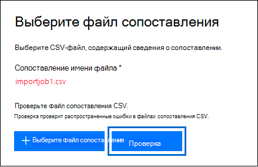

# <a name="use-drive-shipping-to-import-your-organizations-pst-files-to-office-365"></a>Использование доставки дисков для импорта PST-файлов Организации в Office 365

**Эта статья предназначена для администраторов. Вы пытаетесь импортировать PST-файлы в свой почтовый ящик? [В разделе Импорт электронной почты, контактов и календаря из PST-файла Outlook](https://go.microsoft.com/fwlink/p/?LinkID=785075)**
   
Используйте службу импорта Office 365 и доставку дисков для массового импорта PST-файлов в почтовые ящики пользователей. Под отправкой жестких дисков имеется в виду следующее: вы копируете PST-файлы на жесткие диски, а затем отправляете эти диски в корпорацию Майкрософт. Когда корпорация Майкрософт получает жесткий диск, персонал центра обработки данных копирует данные с жесткого диска в область хранения в облаке Майкрософт. После этого вы можете обрезать данные PST, импортированные в целевые почтовые ящики, настроив фильтры, которые контролируют импортируемые данные. После запуска задания импорта служба импорта импортирует данные PST из области хранения в почтовые ящики пользователей. Использование доставки дисков для импорта PST-файлов в почтовые ящики пользователей — это один из способов переноса электронной почты организации в Office 365.
  
Ниже приведены действия, необходимые для импорта PST-файлов в почтовые ящики Office 365, с помощью доставки дисков:
  
[Шаг 1: Скачайте ключ безопасного хранения и средство импорта PST-файлов](#step-1-download-the-secure-storage-key-and-pst-import-tool)

[Шаг 2: копирование PST-файлов на жесткий диск](#step-2-copy-the-pst-files-to-the-hard-drive)

[Шаг 3: создание файла сопоставления для импорта PST-файлов](#step-3-create-the-pst-import-mapping-file)

[Действие 4. В Office 365 создайте задание на импорт PST-файлов](#step-4-create-a-pst-import-job-in-office-365).

[Действие 5. Отправьте жесткие диски в корпорацию Майкрософт](#step-5-ship-the-hard-drive-to-microsoft).

[Шаг 6. Фильтрация данных и запуск задания импорта PST-файлов](#step-6-filter-data-and-start-the-pst-import-job)
  
> [!IMPORTANT]
> Необходимо выполнить шаг 1 один раз, чтобы загрузить ключ безопасного хранения и средство импорта. После выполнения этих действий выполните действия 2 – 6 для каждого подотчетного жесткого диска в корпорацию Майкрософт. 
  
Часто задаваемые вопросы об использовании доставки дисков для импорта PST-файлов в Office 365 приведены в статье [вопросы и ответы по использованию функции доставки дисков для импорта PST-файлов](faqimporting-pst-files-to-office-365.md#using-drive-shipping-to-import-pst-files). 
  
## <a name="before-you-begin"></a>Перед началом работы

- Чтобы вы могли импортировать PST-файлы в почтовые ящики Office 365, вам должна быть назначена роль "Импорт и экспорт почтовых ящиков" в Exchange Online. По умолчанию эта роль не назначена ни одной группе ролей в Exchange Online. Вы можете добавить роль "Импорт и экспорт почтовых ящиков" в группу ролей "Управление организацией". Кроме того, вы можете создать группу ролей, назначить ей роль "Импорт и экспорт почтовых ящиков" и добавить себя в качестве участника группы. Дополнительные сведения см. в разделах "Добавление роли в группу ролей" или "Создание группы ролей" статьи [Управление группами ролей](https://go.microsoft.com/fwlink/p/?LinkId=730688).
    
    Кроме того, чтобы создать задания импорта в Центре безопасности и соответствия требованиям, должно выполняться одно из следующих условий:
    
  - Вам должна быть назначена роль "Получатели почты" в Exchange Online. По умолчанию эта роль назначается группам ролей "Управление организацией" и "Управление получателями".
    
    или
    
  - Вы должны быть глобальным администратором в своей организации Office 365.
    
    > [!TIP]
    > Рекомендуется создать новую группу ролей в Exchange Online, предназначенную специально для импорта PST-файлов в Office 365. Для минимального уровня прав, необходимого для импорта PST-файлов, назначьте роли "Импорт и экспорт почтовых ящиков" и "Получатели почты" новой группе ролей, а затем добавьте участников. 
  
- PST-файлы, которые вы хотите скопировать на жесткие диски, должны храниться на файловом сервере или в общей папке в вашей организации. На шаге 2 вы запустите средство импорта и экспорта Azure (WAImportExport. exe), которое копирует PST-файлы, хранящиеся на этом файловом сервере или в общей папке, на жесткий диск.

- Крупные PST-файлы могут повлиять на скорость импорта PST. Поэтому мы рекомендуем, чтобы каждый PST-файл, который вы копируете на жесткий диск на этапе 2, не превышал 20 ГБ.
    
- Для службы импорта Office 365 поддерживаются 2,5 только диски с твердотельными накопителями (SSDs) или 2,5 дюйма или 3,5-дюймовых жестких дисков SATA II/III. емкостью до 10 ТБ. При выполнении заданий импорта на каждом жестком диске будет обрабатываться только первый том данных. Тома должны быть отформатированы в файловой системе NTFS. При копировании данных на жесткий диск вы можете присоединить его непосредственно с помощью соединителя 2,5-дюймовый SSD или 2,5-дюймовый или 3,5-дюймовый разъем SATA II/III, либо можно присоединить его извне с помощью 2,5 внешнего жесткого или 2,5-дюймового твердотельного накопителя или USB II/3-дюймовых USB-адаптеров.
    
    > [!IMPORTANT]
    > Внешние жесткие диски со встроенным USB-адаптером не поддерживаются службой импорта Office 365. Кроме того, невозможно использовать диск в корпусе внешнего жесткого диска. Не отправляйте внешние жесткие диски. 
  
- Жесткие диски, на которые вы копируете PST-файлы, должны быть зашифрован с помощью технологии BitLocker. Средство WAImportExport.exe, которое вы запустите в действии 2, поможет вам настроить BitLocker. Кроме того, он создает ключ шифрования BitLocker, который персонал центра обработки данных Майкрософт использует для доступа к диску для отправки PST-файлов в область хранилища Azure в облаке Майкрософт.
    
- Доставка дисков доступна через корпоративное соглашение Майкрософт (EA). Она недоступна при наличии соглашения об использовании товаров и услуг корпорации Майкрософт.
    
- Затраты на импорт PST-файлов в почтовые ящики Office 365 с использованием доставки дисков составляет $2 долларов США на ГБ данных. Например, если отправляется жесткий диск, который содержит PST-файлы объемом 1000 ГБ (1 ТБ), это будет стоить 2000 долларов США. Вы можете оплатить комиссию за импорт файлов одному из наших партнеров. Сведения о том, как найти партнера, см. в статье [Поиск торгового посредника или партнера Office 365](https://go.microsoft.com/fwlink/p/?LinkId=785197).
    
- У вас или у вашей организации должна быть учетная запись в службах FedEx или DHL. 
    
  - Организации в Соединенных Штатах Америки, Бразилии и Европе должны иметь учетные записи Федекс.
    
  - Организации в Восточной Азии, юго юго Азии, Японии, Республика Корея и Австралии должны иметь учетные записи DHL.
    
    Корпорация Майкрософт использует эту учетную запись для возвращения жесткого диска обратно.
    
- Жесткий диск, который вы отправляете в корпорацию Майкрософт, может пересекать международные границы. В этом случае вы несете ответственность за то, чтобы жесткий диск и содержащиеся в нем данные были импортированы и/или экспортированы в соответствии с применимым законодательством. Перед отправкой жестких дисков проконсультируйтесь со специалистами и убедитесь, что их можно законным образом доставить в один из центров обработки данных корпорации Майкрософт. Это помогает обеспечить своевременную доставку корпорации Майкрософт.
    
- Во время выполнения этой процедуры необходимо скопировать и сохранить ключ защищенного хранилища и ключ шифрования BitLocker. Необходимо защитить эти ключи так же надежно, как вы защищаете пароли и прочую информацию, связанную с обеспечением безопасности. Например, можно сохранить эти ключи в документе Microsoft Word, защищенном паролем, или на зашифрованном USB-накопителе. В разделе [Дополнительные сведения](#more-information) вы найдете пример этих разделов. 
    
- После импорта PST-файлов в почтовый ящик Office 365 параметр приостановки хранения для этого почтового ящика включается на неопределенное время. Это означает, что политика хранения, назначенная почтовому ящику, не будет обрабатываться, пока вы не отключите приостановку хранения или не назначите дату выполнения. Почему мы это делаем? Старые сообщения при импорте в почтовый ящик могут удаляться без возможности восстановления, так как их срок хранения, заданный в параметрах хранения почтового ящика, закончился. Приостановка хранения дает владельцу почтового ящика время для управления импортированными сообщениями или предоставляет вам время на изменение параметров хранения для почтового ящика. В разделе [More Information](#more-information) представлены рекомендации по управлению удержанием хранения. 
    
- По умолчанию максимальный размер сообщений, которые можно получить с помощью почтового ящика Office 365, составляет 35 МБ. Это обусловлено тем, что значение по умолчанию для свойства *MaxReceiveSize* почтового ящика равно 35 МБ. Однако максимальный размер получаемого сообщения в Office 365 составляет 150 МБ. Поэтому при импорте PST-файла, содержащего элемент размером более 35 МБ, служба импорта Office 365 автоматически меняет значение свойства *MaxReceiveSize* целевого почтового ящика на 150 МБ. Это позволяет импортировать в почтовые ящики пользователей сообщения размером до 150 МБ. 
    
    > [!TIP]
    > Чтобы определить размер сообщения для почтового ящика, можно выполнить в Exchange Online PowerShell следующую команду: `Get-Mailbox <user mailbox> | FL MaxReceiveSize`. 
  
- PST-файлы можно импортировать в неактивный почтовый ящик Office 365. Для этого нужно указать GUID неактивного почтового ящика в параметре `Mailbox` файла сопоставления для импорта PST-файлов. Для получения дополнительных сведений см. [Шаг 3: создание файла сопоставления для импорта PST-файлов](#step-3-create-the-pst-import-mapping-file) . 
    
- В гибридной среде Exchange вы можете импортировать PST-файлы в облачный архивный почтовый ящик пользователя, основной почтовый ящик которого является локальным. Для этого выполните следующие действия в файле сопоставления для импорта PST-файлов:
    
  - Укажите адрес электронной почты для локального почтового ящика пользователя в параметре `Mailbox`. 
    
  - Укажите значение **TRUE** для параметра `IsArchive`. 
    
    Для получения дополнительных сведений см. [Шаг 3: создание файла сопоставления для импорта PST-файлов](#step-3-create-the-pst-import-mapping-file) . 

## <a name="step-1-download-the-secure-storage-key-and-pst-import-tool"></a>Шаг 1: Скачайте ключ безопасного хранения и средство импорта PST-файлов

Первый шаг — скачать ключ безопасного хранения и инструмент, а также использовать его на шаге 2 для копирования PST-файлов на жесткий диск.
  
> [!IMPORTANT]
> Для успешного импорта PST-файлов с помощью метода доставки диска необходимо использовать средство импорта и экспорта Azure версии 1 (WAimportExportV1). Версия 2 средства импорта и экспорта Azure не поддерживается, и его использование приведет к неправильной подготовке жесткого диска для задания импорта. Обязательно Скачайте средство импорта и экспорта Azure из центра безопасности & соответствия требованиям, выполнив процедуры, описанные в этом шаге. 
  
1. Откройте страницу [https://protection.office.com/](https://protection.office.com/) и войдите с данными учетной записи администратора вашей организации Office 365. 
    
2. В левой области Центра безопасности и соответствия требованиям выберите **Управление информацией** \> **Импорт** \> **Импорт PST-файлов**.
    
    > [!NOTE]
    > Как было сказано ранее, вам должны быть назначены соответствующие разрешения на доступ к странице " **Импорт** " в центре безопасности & соответствия требованиям. 
  
3. На странице **Импорт PST-файлов** нажмите  **Новое задание импорта**.
    
4. В мастере импорта заданий введите имя задания импорта PST-файлов, а затем нажмите кнопку **Далее**. Используйте строчные буквы, числа, дефисы и символы подчеркивания. Имя не должно содержать заглавных букв и пробелов.
    
5. На странице " **Выбор типа задания импорта** " выберите пункт **отгрузить жесткие диски в одно из физических расположений** , а затем нажмите кнопку **Далее**.
    
    
  
6. На странице **Импорт данных** выполните следующие два действия. 
    
    
  
    а. В шаге 2 щелкните **Копировать ключ безопасного хранения**. После отображения ключа хранилища нажмите кнопку **Копировать в буфер обмена** , а затем вставьте его и сохраните в файл, чтобы получить к нему доступ позже.
    
    б. На шаге 3 **Скачайте средство импорта и экспорта Azure** , чтобы скачать и установить средство импорта и экспорта Azure (версия 1).
    
    - Во всплывающем окне нажмите **сохранить** \> **Сохранить как** , чтобы сохранить файл WaImportExportV1. zip в папку на локальном компьютере. 
    
    - Извлеките файл WaImportExportV1. zip.
    
7. Нажмите кнопку **Отмена** , чтобы закрыть мастер. 
    
    Вернитесь на страницу **Импорт** в центре безопасности & соответствия требованиям при создании задания импорта на шаге 4. 

## <a name="step-2-copy-the-pst-files-to-the-hard-drive"></a>Шаг 2: копирование PST-файлов на жесткий диск

Далее необходимо с помощью средства WAImportExport.exe скопировать PST-файлы на жесткие диски. Это средство шифрует жесткие диски с помощью технологии BitLocker, копирует на них PST-файлы и создает файл журнала, в котором хранятся сведения о процессе копирования. Чтобы выполнить это действие, необходимо, чтобы PST-файлы хранились в файловом ресурсе или на файловом сервере в вашей организации. В описанной ниже процедуре такое расположение называется исходным каталогом. 

 Как было сказано ранее, каждый PST-файл, который вы копируете на жесткий диск, должен быть не более 20 ГБ. PST-файлы размером более 20 ГБ могут повлиять на скорость импорта PST, запускаемого на шаге 6.
  
> [!IMPORTANT]
> После того как средство WAImportExport.exe будет в первый раз запущено для жесткого диска, при каждом последующем запуске необходимо будет использовать другой синтаксис. Этот синтаксис описан в шаге 4 этой процедуры для копирования PST-файлов на жесткий диск. 
  
1. Откройте окно командной строки на локальном компьютере.
    
    > [!TIP]
    > Если вы запустите командную строку с правами администратора (выбрав "Запуск от имени администратора"), то в окне командной строки будут отображаться сообщения об ошибках. Это помогает устранить проблемы, возникающие при работе средства WAImportExport.exe. 
  
2. Перейдите в каталог, в который вы установили средство WAImportExport.exe в действии 1.
    
3. При первом использовании средства WAImportExport.exe для копирования PST-файлов на жесткие диски выполните указанную ниже команду.

    ```powershell
    WAImportExport.exe PrepImport /j:<Name of journal file> /t:<Drive letter> /id:<Name of session> /srcdir:<Location of PST files> /dstdir:<PST file path> /sk:<Storage account key> /blobtype:BlockBlob /encrypt /logdir:<Log file location>
    ```

    В таблице ниже перечислены необходимые параметры и значения для них.
    
    |**Параметр**|**Описание**|**Пример**|
    |:-----|:-----|:-----|
    | `/j:` <br/> |Указывает имя файла журнала. Этот файл сохраняется в той же папке, в которой расположено средство WAImportExport.exe. Для каждого жесткого диска, отправляемого в корпорацию Майкрософт, должен быть отдельный файл журнала. При каждом запуске средства WAImportTool.exe для копирования PST-файлов на жесткий диск в файл журнала для этого диска будут добавлены соответствующие сведения.  <br/> Сотрудники центра обработки данных Майкрософт используют сведения, содержащиеся в файле журнала, для связи жесткого диска с заданием импорта, созданным на шаге 4, и для отправки PST-файлов в область хранилища Azure в облаке Майкрософт.  <br/> | `/j:PSTHDD1.jrn` <br/> |
    | `/t:` <br/> |Задает букву диска для жесткого диска при его подключении к локальному компьютеру.  <br/> | `/t:h` <br/> |
    | `/id:` <br/> |Задает имя сеанса копирования. Сеанс — это каждый запуск средства WAImportExport.exe для копирования файлов на жесткие диски. PST-файлы копируются в папку, в качестве имени которой используется имя сеанса, заданное этим параметром.   <br/> | `/id:driveship1` <br/> |
    | `/srcdir:` <br/> |Задает исходный каталог в вашей организации, содержащий PST-файлы, которые необходимо скопировать во время сеанса. Обязательно заключите значение этого параметра в кавычки (" ").  <br/> | `/srcdir:"\\FILESERVER01\PSTs"` <br/> |
    | `/dstdir:` <br/> |Указывает конечный каталог в области хранилища Azure в облаке Майкрософт, в котором будут отправлены PST. Необходимо использовать значение `ingestiondata/`. Обязательно заключите значение этого параметра в кавычки (" ").  <br/> При необходимости вы также можете добавить дополнительный путь к файлу для значения этого параметра. Например, можно использовать путь к исходному каталогу на жестком диске (преобразованный в формат URL), который указан в `/srcdir:` параметре. Например, `\\FILESERVER01\PSTs` изменяется на `FILESERVER01/PSTs`. В этом случае все равно необходимо включить `ingestiondata` в путь к файлу. Таким образом, в этом примере значение `/dstdir:` параметра будет иметь `"ingestiondata/FILESERVER01/PSTs"`значение.  <br/> Одна из причин добавить дополнительный путь к файлу — если у вас есть файлы PST с одинаковым именем файла.  <br/> > [!NOTE]> если указать необязательный путь, то пространство имен для PST-файла после его отправки в область хранилища Azure включает путь и имя PST-файла; Пример: `FILESERVER01/PSTs/annb.pst`. Если путь не указан, пространство имен будет иметь только имя PST-файла. например `annb.pst`:.           | `/dstdir:"ingestiondata/"` <br/> или  <br/>  `/dstdir:"ingestiondata/FILESERVER01/PSTs"` <br/> |
    | `/sk:` <br/> |Задает ключ учетной записи хранения, который вы получили в действии 1. Обязательно заключите значение этого параметра в кавычки (" ").  <br/> | `"yaNIIs9Uy5g25Yoak+LlSHfqVBGOeNwjqtBEBGqRMoidq6/e5k/VPkjOXdDIXJHxHvNoNoFH5NcVUJXHwu9ZxQ=="` <br/> |
    | `/blobtype:` <br/> |Указывает тип больших двоичных объектов в области хранилища Azure для импорта PST-файлов в. Для импорта PST-файлов используется значение **блоккблоб**. Это обязательный параметр.   <br/> | `/blobtype:BlockBlob` <br/> |
    | `/encrypt` <br/> |Этот параметр включает шифрование BitLocker для жесткого диска. Этот параметр является обязательным при первом запуске средства WAImportExport.exe.  <br/> Ключ шифрования BitLocker копируется в файл журнала и файл журнала, созданный при использовании `/logfile:` параметра. Как было сказано ранее, файл журнала хранится в той же папке, в которой расположено средство WAImportExport.exe.  <br/> | `/encrypt` <br/> |
    | `/logdir:` <br/> |Этот дополнительный параметр указывает папку для сохранения файлов журналов. Если этот параметр не указан, файлы журнала сохраняются в той же папке, где размещается средство WAImportExport. exe. Обязательно заключите значение этого параметра в кавычки (" ").  <br/> | `/logdir:"c:\users\admin\desktop\PstImportLogs"` <br/> |
   
    Вот пример синтаксиса для средства WAImportExport.exe, в котором использованы действительные значения для каждого параметра:
    
    ```powershell
    WAImportExport.exe PrepImport /j:PSTHDD1.jrn /t:f /id:driveship1 /srcdir:"\\FILESERVER01\PSTs" /dstdir:"ingestiondata/" /sk:"yaNIIs9Uy5g25Yoak+LlSHfqVBGOeNwjqtBEBGqRMoidq6/e5k/VPkjOXdDIXJHxHvNoNoFH5NcVUJXHwu9ZxQ==" blobtype:BlockBlob /encrypt /logdir:"c:\users\admin\desktop\PstImportLogs"
    ```

    После запуска команды будут отображаться сообщения о состоянии, показывающие ход копирования PST-файлов на жесткий диск. В окончательном сообщении о состоянии будет отображено общее количество успешно скопированных файлов. 
    
4. Выполняйте эту команду при каждом последующем запуске средства WAImportExport.exe для копирования PST-файлов на тот же жесткий диск.

    ```powershell
    WAImportExport.exe PrepImport /j:<Name of journal file> /id:<Name of new session> /srcdir:<Location of PST files> /dstdir:<PST file path> /blobtype:BlockBlob 
    ```

    Вот пример синтаксиса для запуска последующих сеансов копирования PST-файлов на тот же жесткий диск.  

    ```powershell
    WAImportExport.exe PrepImport /j:PSTHDD1.jrn /id:driveship2 /srcdir:"\\FILESERVER01\PSTs\SecondBatch" /dstdir:"ingestiondata/" /blobtype:BlockBlob
    ```

## <a name="step-3-create-the-pst-import-mapping-file"></a>Шаг 3: создание файла сопоставления для импорта PST-файлов

Когда сотрудники центра обработки данных Майкрософт отправляют PST-файлы с жесткого диска в область хранилища Azure, служба импорта будет использовать сведения из файла сопоставления импорта PST-файлов, который представляет собой файл данных с разделителями-запятыми (CSV), который указывает, какие почтовые ящики пользователей PST-файлы импортируются в. Вы отправите этот CSV-файл в следующем действии, когда будете создавать задание на импорт PST-файлов.
  
1. [Скачайте файл сопоставления для импорта PST-файлов](https://go.microsoft.com/fwlink/p/?LinkId=544717).
    
2. Откройте или сохраните этот CSV-файл на локальный компьютер. В примере ниже показан готовый файл сопоставления для импорта PST-файлов (открытый в Блокноте). Для редактирования CSV-файла намного удобнее использовать Microsoft Excel.

    ```text
    Workload,FilePath,Name,Mailbox,IsArchive,TargetRootFolder,ContentCodePage,SPFileContainer,SPManifestContainer,SPSiteUrl
    Exchange,FILESERVER01/PSTs,annb.pst,annb@contoso.onmicrosoft.com,FALSE,/,,,,
    Exchange,FILESERVER01/PSTs,annb_archive.pst,annb@contoso.onmicrosoft.com,TRUE,/ImportedPst,,,,
    Exchange,FILESERVER01/PSTs,donh.pst,donh@contoso.onmicrosoft.com,FALSE,/,,,,
    Exchange,FILESERVER01/PSTs,donh_archive.pst,donh@contoso.onmicrosoft.com,TRUE,/ImportedPst,,,,
    Exchange,FILESERVER01/PSTs,pilarp.pst,pilarp@contoso.onmicrosoft.com,FALSE,/,,,,
    Exchange,FILESERVER01/PSTs,pilarp_archive.pst,pilarp@contoso.onmicrosoft.com,TRUE,/ImportedPst,,,,
    Exchange,,tonyk.pst,tonyk@contoso.onmicrosoft.com,FALSE,/,,,,
    Exchange,,tonyk_archive.pst,tonyk@contoso.onmicrosoft.com,TRUE,,,,,
    Exchange,,zrinkam.pst,zrinkam@contoso.onmicrosoft.com,FALSE,/,,,,
    Exchange,,zrinkam_archive.pst,zrinkam@contoso.onmicrosoft.com,TRUE,,,,,
    ```

    В первой строке (строке заголовков) CSV-файла перечислены параметры, которые будут использоваться службой импорта PST-файлов для импорта PST-файлов в почтовые ящики пользователей. Имена параметров отделяются друг от друга запятыми. Каждая строка, расположенная под строкой заголовков, содержит значения для импорта PST-файла в определенный почтовый ящик. Необходима строка для каждого PST-файла, который был скопирован на жесткий диск. Не забудьте заменить данные-заполнители в файле сопоставления действительными данными.

    > [!NOTE]
    > Не изменяйте ничего в строке заголовков, в том числе параметры SharePoint. Они будут проигнорированы в процессе импорта PST-файлов. 
  
3. Для заполнения CSV-файла необходимой информацией воспользуйтесь сведениями из таблицы ниже.
    
    |**Параметр**|**Описание**|**Пример**|
    |:-----|:-----|:-----|
    | `Workload` <br/> |Указывает службу Office 365, в которую будут импортированы данные. Для импорта PST-файлов в почтовые ящики пользователей укажите `Exchange`.  <br/> | `Exchange` <br/> |
    | `FilePath` <br/> | Указывает расположение папки в области хранилища Azure, в которую будут скопированы PST-файлы при отгрузке жесткого диска в корпорацию Майкрософт.  <br/>  Элементы, которые вы добавляете в этот столбец в CSV-файле, зависят от того `/dstdir:` , что указано в параметре на предыдущем шаге. Если у вас есть вложенные папки в исходном расположении, то значение `FilePath` параметра должно содержать относительный путь для вложенной папки; Например,/Folder1/User1/.  <br/>  Если вы использовали `/dstdir:"ingestiondata/"`, то в CSV-файле оставьте этот параметр пустым.  <br/>  Если вы включили необязательный путь к значению `/dstdir:` параметра (например `/dstdir:"ingestiondata/FILESERVER01/PSTs"`, затем используйте этот путь (не включая "ingestiondata") для этого параметра в CSV-файле. Значение этого параметра нужно указывать с учетом регистра.  <br/>  В любом случае *не* включайте "ingestiondata" в значение параметра `FilePath`. Оставьте этот параметр пустым или укажите только необязательный путь.  <br/> > [!IMPORTANT]> регистр для имени пути к файлу должен совпадать с регистром, указанным в `/dstdir:` параметре на предыдущем шаге. Например, если `"ingestiondata/FILESERVER01/PSTs"` имя вложенной папки на предыдущем шаге `fileserver01/psts` использовалось в `FilePath` параметре в CSV-файле, импорт для PST-файла завершится с ошибками. Используйте одинаковый регистр в обоих случаях.           |(Оставьте пустым)  <br/> или  <br/>  `FILESERVER01/PSTs` <br/> |
    | `Name` <br/> |Указывает имя PST-файла, который будет импортирован в почтовый ящик пользователя. Значение этого параметра нужно указывать с учетом регистра.  <br/> > [!IMPORTANT]> регистр имени PST-файла в CSV-файле должен совпадать с PST-файлом, который был отправлен в место хранения Azure на шаге 2. Например, если вы указали `annb.pst` для параметра `Name` в CSV-файле, а сам файл называется `AnnB.pst`, импорт PST-файла завершится сбоем. Убедитесь, что для имени PST-файла в CSV-файле используется тот же регистр, что и для имени самого PST-файла.           | `annb.pst` <br/> |
    | `Mailbox` <br/> |Указывает электронный адрес почтового ящика, в который будет импортирован PST-файл. Указать общедоступную папку невозможно, так как служба импорта PST не поддерживает импорт PST-файлов в общедоступные папки.  <br/> Для импорта PST-файла в неактивный почтовый ящик необходимо указать GUID почтового ящика для этого параметра. Чтобы получить этот GUID, выполните в Exchange Online следующую команду PowerShell: `Get-Mailbox <identity of inactive mailbox> -InactiveMailboxOnly | FL Guid` <br/> > [!NOTE]> иногда может существовать несколько почтовых ящиков с одним адресом электронной почты, где один почтовый ящик является активным и другой почтовый ящик находится в обратимо удаленном (или неактивном) состоянии. В этих ситуациях требуется указать GUID почтового ящика, в который нужно импортировать PST-файл. Чтобы получить этот GUID, выполните следующую команду PowerShell: `Get-Mailbox <identity of active mailbox> | FL Guid`. Чтобы получить GUID для обратимо удаленных (или неактивных) почтовых ящиков, `Get-Mailbox <identity of soft-deleted or inactive mailbox> -SoftDeletedMailbox | FL Guid`выполните следующую команду:.           | `annb@contoso.onmicrosoft.com` <br/> или  <br/>  `2d7a87fe-d6a2-40cc-8aff-1ebea80d4ae7` <br/> |
    | `IsArchive` <br/> | Указывает, следует ли импортировать PST-файл в архивный почтовый ящик пользователя. Возможны два варианта:  <br/> **False (ложь** ) Импортирует PST-файл в основной почтовый ящик пользователя.  <br/> **Значение true** Импортирует PST-файл в архивный почтовый ящик пользователя. При этом предполагается, что [архивный почтовый ящик пользователя включен](enable-archive-mailboxes.md). Если для этого параметра задано значение `TRUE` и архивный почтовый ящик не включен, импорт для этого пользователя завершится ошибкой. В случае сбоя импорта для одного пользователя (например, если для него отключен архив и для данного свойства установлено значение `TRUE`) остальные пользователи, для которых выполняется импорт, не будут затронуты.  <br/>  Если этот параметр оставлен пустым, PST-файл импортируется в основной почтовый ящик пользователя.  <br/> **Примечание.** Чтобы импортировать PST-файл в облачный архивный почтовый ящик пользователя, основной почтовый ящик которого является локальным, просто укажите `TRUE` для этого параметра и задайте адрес электронной почты локального почтового ящика для параметра `Mailbox`.  <br/> | `FALSE` <br/> или  <br/>  `TRUE` <br/> |
    | `TargetRootFolder` <br/> | Указывает папку почтового ящика, в которую импортируется PST-файл.  <br/>  Если оставить этот параметр пустым, то PST-файл будет импортироваться в новую папку с именем **importd** , расположенную на корневом уровне почтового ящика (то же, что и папка "Входящие", а также другие папки почтовых ящиков по умолчанию).  <br/>  Если указать `/`, элементы в PST-файле будут импортироваться непосредственно в папку "Входящие" пользователя.  <br/>  Если указать `/<foldername>`, элементы в PST-файле будут импортированы в папку с именем * \<имя_папки\>*. Например, если указан параметр `/ImportedPst`, элементы будут импортированы в папку с именем **ImportedPst**. Эта папка будет расположена в почтовом ящике пользователя на том же уровне, что и папка "Входящие".  <br/> |(Оставьте пустым)  <br/> Или  <br/>  `/` <br/> или  <br/>  `/ImportedPst` <br/> |
    | `ContentCodePage` <br/> |Этот необязательный параметр задает числовое значение кодовой страницы, которую следует использовать для импорта PST-файлов в формате ANSI. Этот параметр применяется при импорте PST-файлов на китайском, японском и корейском языках, так как в них обычно используется двухбайтовая кодировка (DBCS). Если не использовать этот параметр, названия папок почтовых ящиков могут быть искажены после импорта.  <br/> Список поддерживаемых значений для этого параметра см. в статье [Идентификаторы кодовых страниц](https://go.microsoft.com/fwlink/p/?LinkId=328514).  <br/> > [!NOTE]>, как было сказано ранее, это необязательный параметр, который не нужно включать в CSV-файл. Кроме того, вы можете добавить его и оставить поле пустым для одной или нескольких строк.           |(Оставьте пустым)  <br/> Или  <br/>  `932` (идентификатор кодовой страницы для японского языка ANSI/OEM)  <br/> |
    | `SPFileContainer` <br/> |При импорте PST-файлов оставьте этот параметр пустым.  <br/> |Неприменимо  <br/> |
    | `SPManifestContainer` <br/> |При импорте PST-файлов оставьте этот параметр пустым.  <br/> |Неприменимо  <br/> |
    | `SPSiteUrl` <br/> |При импорте PST-файлов оставьте этот параметр пустым.  <br/> |Неприменимо  <br/> |

## <a name="step-4-create-a-pst-import-job-in-office-365"></a>Действие 4. В Office 365 создайте задание на импорт PST-файлов.

Далее потребуется создать задание на импорт PST-файлов в службе импорта в Office 365. Как было сказано выше, вы отправите файл сопоставления PST-импорта, созданный на шаге 3. После создания задания служба импорта будет использовать сведения из файла сопоставления для импорта PST-файлов в указанный почтовый ящик пользователя после того, как PST-файлы будут скопированы с жесткого диска в область хранилища Azure, и вы создадите задание импорта и начнете его.
  
1. Откройте страницу [https://protection.office.com](https://protection.office.com) и войдите с данными учетной записи администратора вашей организации Office 365. 
    
2. В левой области Центра безопасности и соответствия требованиям выберите **Управление информацией** \> **Импорт** \> **Импорт PST-файлов**.
    
3. На странице **Импорт PST-файлов** нажмите  **Новое задание импорта**.
    
    > [!NOTE]
    > Как было сказано ранее, вам должны быть назначены соответствующие разрешения на доступ к странице " **Импорт** " в центре безопасности & соответствия требованиям. 
  
4. Введите имя для задания импорта PST-файлов и нажмите кнопку **Далее**. Используйте строчные буквы, числа, дефисы и символы подчеркивания. Имя не должно содержать заглавных букв и пробелов.
    
5. На странице " **Выбор типа задания импорта** " выберите пункт **отгрузить жесткие диски в одно из физических расположений** , а затем нажмите кнопку **Далее**.
    
    
  
6. На шаге 6 выберите **подготовленные жесткие диски и получите доступ к необходимым файлам журнала диска** , и **у меня есть доступ к файлам сопоставлений** , а затем нажмите кнопку **Далее**.
    
    
  
7. На странице **Выбор файла диска** щелкните **Выбор файла диска**, а затем перейдите в ту же папку, где находится средство WAImportExport. exe. Файл журнала, созданный в действии 2, был скопирован в эту папку.
    
    
  
8. Выберите файл журнала; Пример: `PSTHDD1.jrn`.
    
    > [!TIP]
    > Когда вы запустили средство WAImportExport. exe на этапе 2, имя файла журнала было указано `/j:` параметром. 
  
9. После того как имя файла диска появится в разделе **имя файла диска**, нажмите кнопку **проверить** , чтобы проверить наличие ошибок в файле диска. 
    
    
  
    Для создания задания импорта PST необходимо успешно проверить файл на диске. Обратите внимание, что имя файла становится зеленым после успешной проверки. Если проверка завершилась сбоем, щелкните ссылку **Просмотреть журнал**. Откроется отчет об ошибке проверки с сообщением об ошибке со сведениями о причине сбоя файла. 
    
    > [!NOTE]
    > Необходимо добавить и проверить файл журнала для каждого жесткого диска, который вы отправите в корпорацию Майкрософт. 
  
10. После добавления и проверки файла журнала для каждого жесткого диска, который вы отправите в корпорацию Майкрософт, нажмите кнопку **Далее**.
    
11. Нажмите  значок **выберите файл сопоставления** , чтобы передать файл сопоставления PST-импорта, созданный на шаге 3. 
    
    
  
12. Когда имя CSV-файла появится в разделе **Имя файла сопоставления**, выберите его и щелкните **Проверить**, чтобы проверить CSV-файл на наличие ошибок. 
    
    
  
    Чтобы можно было создать задание импорта PST-файлов, CSV-файл должен успешно пройти проверку. Обратите внимание, что имя файла становится зеленым после успешной проверки. Если проверка завершилась сбоем, щелкните ссылку **Просмотреть журнал**. Откроется журнал ошибок, в котором для каждой строки со сбоем будет соответствующее сообщение об ошибке. 
    
13. После успешной проверки файла сопоставления PST нажмите кнопку **Далее**.
    
14. На странице **предоставление контактной информации** введите контактные данные в соответствующие поля. 
    
    Отображается адрес расположения Майкрософт, в котором вы отправите жесткие диски. Этот адрес создается автоматически на основе расположения центра обработки данных Office 365. Скопируйте этот адрес в файл или сделайте снимок экрана.
    
15. Прочитайте документ условия, установите флажок, а затем нажмите кнопку **сохранить** , чтобы передать задание импорта. 
    
    После успешного создания задания импорта отображается страница состояния, в которой объясняются следующие этапы процесса доставки диска.
    
16. На странице " **Импорт PST-файлов** "  значок **Обновить** , чтобы отображалось новое задание импорта доставки дисков в списке заданий импорта. Состояние имеет значение **Ожидание номера отслеживания**. Вы также можете щелкнуть задание импорта, чтобы отобразить всплывающую страницу состояния, которая содержит более подробные сведения о задании импорта.
 
## <a name="step-5-ship-the-hard-drive-to-microsoft"></a>Действие 5. Отправьте жесткие диски в корпорацию Майкрософт.

Следующий шаг — отгрузка жесткого диска в корпорацию Майкрософт, а затем укажите номер для отслеживания информации об отгрузке и возврате для задания по доставке дисков. После получения диска корпорацией Майкрософт он займет от 7 до 10 рабочих дней, пока сотрудники центра обработки данных не загружают PST-файлы в область хранилища Azure для вашей организации.
  
> [!NOTE]
> Если вы не задаете номер отслеживания и возвращаете сведения об отгрузке в течение 14 дней после создания задания импорта, срок действия задания импорта истечет. В этом случае необходимо создать новое задание импорта доставки дисков (см [. шаг 4: создание задания импорта PST-файлов в Office 365](#step-4-create-a-pst-import-job-in-office-365)), а также повторное отправку файла и файла сопоставления для импорта PST-файлов. 
  
### <a name="ship-the-hard-drive"></a>Отправка жестких дисков

При отправке жестких дисков в корпорацию Майкрософт имейте в виду следующее:
  
- Не допускайте адаптер с ИНТЕРФЕЙСом SATA (SATA); требуется только отгрузка жесткого диска.
    
- убедитесь, что диски упакованы должным образом (например, в антистатический пакет или воздушно-пузырьковую пленку);
    
- самостоятельно выберите поставщика почтовых услуг для доставки жестких дисков в корпорацию Майкрософт;
    
- Отгрузите жесткий диск к адресу, который отображался при создании задания импорта на шаге 4. Не забудьте включить службу импорта Office 365 в адрес поставки.
    
- после отправки жестких дисков запишите название поставщика почтовых услуг и номер для отслеживания отправления. Эти данные потребуются вам в следующем действии.
    
### <a name="enter-the-tracking-number-and-other-shipping-information"></a>Ввод номера для отслеживания и других сведениях об отправленных дисках

После отправки жестких дисков в корпорацию Майкрософт выполните указанную ниже процедуру на странице службы импорта.
  
1. Откройте страницу [https://protection.office.com](https://protection.office.com) и войдите с данными учетной записи администратора вашей организации Office 365. 
    
2. В левой области щелкните **Управление сведениями > ИМПОРТИРОВАТЬ PST-файлы импорта >**.
    
3. На странице " **Импорт PST-файлов** " щелкните задание для отгрузки диска, для которого нужно ввести номер для отслеживания. 
    
4. На странице Состояние щелкните **Введите номер отслеживания**.
    
5. Укажите следующие данные об отправленных жестких дисках:
    
1. **Оператор доставки** Введите имя оператора доставки, который вы использовали для доставки жесткого диска в корпорацию Майкрософт. 
    
2. **Номер отслеживания** Введите номер отслеживания для отгрузки жесткого диска. 
    
3. **Номер счета перевозчика возврата** Введите номер учетной записи для перевозчика, который указан в разделе **оператор возврата**. Корпорация Майкрософт использует эту учетную запись для отправки вашего жесткого диска обратно. В организациях в США и Европе должна быть учетная запись с Федекс. У организаций в Азии и остальном мире должна быть учетная запись в службе DHL.
    
6. Щелкните **Сохранить**, чтобы сохранить эти сведения для задания на импорт. 
    
    На странице " **Импорт PST-файлов** "  значок **Обновить** , чтобы обновить сведения о задании импорта для доставки дисков. Обратите внимание, что теперь у задания на импорт будет состояние **Диски в пути**.

## <a name="step-6-filter-data-and-start-the-pst-import-job"></a>Шаг 6. Фильтрация данных и запуск задания импорта PST-файлов

После получения жесткого диска корпорацией Майкрософт состояние задания импорта на странице " **Импорт PST-файлов** " изменится на " **получено дисков**". Сотрудники центра обработки данных используют сведения из файла журнала для отправки PST-файлов в область хранилища Azure для вашей организации. На этом шаге состояние изменяется на " **выполняется импорт**". Как было указано ранее, Загрузка PST-файлов с жесткого диска займет от 7 до 10 рабочих дней.
  
После отправки PST-файлов в Azure состояние изменяется на " **выполняется анализ**". Это означает, что Office 365 анализирует данные в PST-файлах (безопасным и безопасным способом) для определения возраста элементов и различных типов сообщений, включенных в PST-файлы. После завершения анализа и данных, готовых к импорту, состояние задания импорта изменяется на " **анализ выполнен**". На этом шаге имеется возможность импортировать все данные, содержащиеся в PST-файлах, или можно обрезать импортируемые данные, настроив фильтры, которые контролируют импортируемые данные.
  
1. Откройте страницу [https://protection.office.com](https://protection.office.com) и войдите с данными учетной записи администратора вашей организации Office 365. 
    
2. В области слева щелкните **** \> **PST-файлы импорта**для системы управления **сведениями** \> .
    
3. На странице " **Импорт PST-файлов** " щелкните **Готово для импорта в Office 365** для задания импорта, созданного на шаге 4. 
    
    
  
    Появится страница со сведениями о PST-файлах и другой информацией о задании импорта.
    
4. Нажмите кнопку **Импорт в Office 365**.
    
5. Откроется страница **Отфильтровать данные**. На ней представлены результаты анализа PST-файлов, выполненного в Office 365, в том числе сведения о возрасте данных. На этом этапе вы можете отфильтровать данные или импортировать их все. 
    
    
  
6. Выполните одно из указанных ниже действий.
    
    а. Чтобы ограничить объем импортируемых данных, щелкните **Да, я хочу отфильтровать данные перед импортом**.
    
    Пошаговые инструкции по фильтрации данных в PST-файлах и запуску задания импорта можно найти [здесь](filter-data-when-importing-pst-files.md).
    
    или
    
    б. Чтобы импортировать все данные из PST-файлов, щелкните **Нет, импортировать все**, а затем нажмите кнопку **Далее**.
    
7. Если вы решили импортировать все данные, нажмите кнопку **Импорт данных**, чтобы запустить задание импорта. 
    
    Состояние задания импорта отображается на странице " **Импорт PST-файлов** ". Щелкните  **Обновить**, чтобы обновить данные, отображаемые в столбце **Состояние**. Щелкните задание импорта, чтобы открыть всплывающее окно, в котором отображаются сведения о состоянии каждого импортируемого PST-файла. По завершении импорта PST-файлов в почтовые ящики пользователей состояние задания на импорт изменится на **Завершено**.

## <a name="view-a-list-of-the-pst-files-uploaded-to-office-365"></a>Просмотр списка PST-файлов, отправленных в Office 365

Вы можете установить и использовать Microsoft Azure Storage Explorer (бесплатный инструмент Open-Source), чтобы просмотреть список отправленных вами PST-файлов (специалистами центра обработки данных Майкрософт) в область хранилища Azure для вашей организации. Это можно сделать, чтобы убедиться, что PST-файлы с жестких дисков, отправленные в корпорацию Майкрософт, были успешно загружены в область хранилища Azure.
  
В настоящее время доступна предварительная версия обозревателя службы хранилища Microsoft Azure.
  
 **Важно!** Вы не можете использовать Обозреватель хранилищ Azure для отправки или изменения PST-файлов. Единственным поддерживаемым способом импорта PST-файлов в Office 365 является использование AzCopy. Кроме того, PST-файлы, отправленные в большой двоичный объект Azure, нельзя удалить. При попытке удалить PST-файл появляется сообщение об ошибке "нет необходимых разрешений". Все PST-файлы автоматически удаляются из области хранилища Azure. Если в ходе выполнения заданий импорта нет, то все PST-файлы в контейнере * * ingestiondata * * удаляются через 30 дней после создания последнего задания импорта. 
  
Чтобы установить обозреватель службы хранилища Microsoft Azure и подключиться к хранилищу Azure, выполните следующие действия.
  
1. Выполните указанные ниже действия, чтобы получить URL-адрес общего доступа к сигнатуре (SAS) для вашей организации. Этот URL-адрес представляет собой комбинацию сетевого URL-адреса хранилища Azure в облаке Майкрософт для Организации и ключа SAS. Этот ключ предоставляет необходимые разрешения для доступа к хранилищу Azure в вашей организации.
    
1. Откройте страницу [https://protection.office.com/](https://protection.office.com/) и войдите с данными учетной записи администратора вашей организации Office 365. 
    
2. В левой области Центра безопасности и соответствия требованиям выберите **Управление информацией > Импорт > Импорт PST-файлов**.
    
3. На странице **Импорт PST-файлов** нажмите  **Новое задание импорта**.
    
4. В мастере импорта заданий введите имя задания импорта PST-файлов, а затем нажмите кнопку **Далее**. Используйте строчные буквы, числа, дефисы и символы подчеркивания. Имя не должно содержать заглавных букв и пробелов.
    
5. На странице " **Выбор типа задания импорта** " щелкните **отправить данные**, а затем нажмите кнопку **Далее**.
    
6. На шаге 2 щелкните ссылку **Отображение URL-адреса SAS для отправки данных по сети**.
    
7. После отображения URL-адреса скопируйте его и сохраните в файл. Убедитесь, что вы скопировали весь URL-адрес.
    
    > [!IMPORTANT]
    > Примите меры предосторожности, чтобы защитить URL-адрес SAS. Они могут использоваться любым пользователем для доступа к области хранилища Azure для вашей организации. 
  
8. Нажмите кнопку **Отмена** , чтобы закрыть мастер импорта заданий. 
    
2. Скачайте и установите [обозреватель службы хранилища Microsoft Azure](https://go.microsoft.com/fwlink/p/?LinkId=544842).
    
3. Запустите обозреватель службы хранилища Microsoft Azure, щелкните правой кнопкой мыши пункт **Учетные записи хранения** в левой области, а затем выберите команду **Подключиться к хранилищу Azure**.
    
    
  
4. Щелкните **Использовать URI подписанного URL-адреса (SAS) или строку подключения** и нажмите кнопку **Далее**.
    
5. Щелкните **использовать URI SAS**, вставьте URL-адрес SAS, полученный на шаге 1, в поле в разделе **URI**, а затем нажмите кнопку **Далее**.
    
6. На странице **Сводка подключения** просмотрите сведения о подключении и нажмите кнопку **Подключиться**.
    
    Открывается контейнер **ingestiondata**. Он содержит PST-файлы с жесткого диска. Контейнер **ingestiondata** находится в разделе **Учетные записи хранения** \> **(службы, подключенные к SAS)** \> **Контейнер BLOB-объектов**.
    
    
  
7. После завершения работы с обозревателем службы хранилища Microsoft Azure щелкните правой кнопкой элемент **ingestiondata** и выберите пункт **Отсоединить**, чтобы отключиться от хранилища Azure. В противном случае при следующей попытке подключиться произойдет ошибка. 
    
    

## <a name="troubleshooting-tips"></a>Советы по устранению неполадок

- **Что произойдет, если задание импорта завершается сбоем из-за ошибок в файле сопоставления CSV импорта PST?** Если задание импорта завершается сбоем из-за ошибок в файле сопоставления, для создания задания импорта не требуется отгружать жесткий диск в корпорацию Майкрософт. Это связано с тем, что PST-файлы с жесткого диска, отправленного для задания импорта для доставки дисков, уже были отправлены в область хранилища Azure для вашей организации. В этом случае необходимо исправить ошибки в файле сопоставления PST импорта PST-файлов, а затем создать новое задание импорта "Отправка в сеть" и отправить измененный файл сопоставления CSV. Для создания и запуска задания импорта для передачи данных по сети выполните [Шаг 5: создание задания импорта PST-файлов в Office 365](use-network-upload-to-import-pst-files.md#step-5-create-a-pst-import-job-in-office-365) и [Шаг 6: Фильтрация данных и запуск задания импорта PST](use-network-upload-to-import-pst-files.md#step-6-filter-data-and-start-the-pst-import-job) -файлов в разделе "использование передачи по сети для импорта PST-файлов в Office 365". 
    
    > [!NOTE]
    > Чтобы помочь в устранении неполадок с файлом сопоставления CSV для импорта PST, используйте средство " [Обозреватель хранилищ Azure](#view-a-list-of-the-pst-files-uploaded-to-office-365) " для просмотра структуры папок в контейнере **ingestiondata** для PST-файлов с жесткого диска, которые были отправлены в область хранилища Azure. Ошибки файлов сопоставления обычно вызваны неправильным значением параметра FilePath. Этот параметр указывает расположение PST-файла в области хранилища Azure. Описание параметра FilePath приведено в таблице на [шаге 3](#step-3-create-the-pst-import-mapping-file). Как описывалось ранее, расположение PST-файлов в области хранилища Azure было указано `/dstdir:` параметром при запуске средства WAImportExport. exe в [действии 2](#step-2-copy-the-pst-files-to-the-hard-drive). 
  
## <a name="more-information"></a>Дополнительные сведения

- Доставка дисков является эффективным способом импорта больших объемов данных архивных сообщений в Office 365, чтобы воспользоваться преимуществами функций соответствия, доступных в Организации. После импорта архивных данных в почтовые ящики пользователей можно выполнить следующие действия:
    
  - Включите [архивные почтовые ящики](enable-archive-mailboxes.md) и [Автоматическое развертывание архивирования](enable-unlimited-archiving.md) , чтобы предоставить пользователям больше места для хранилища почтовых ящиков данных. 
    
  - Помещать почтовые ящики на [хранение для судебного разбирательства](https://go.microsoft.com/fwlink/?linkid=856286) для хранения данных. 
    
  - Поиск в данных с помощью [средств обнаружения электронных](search-for-content.md) данных Майкрософт. 
    
  - Применение [политик хранения Office 365](retention-policies.md) для управления продолжительностью хранения данных и действия, выполняемого после истечения периода хранения. 
    
  - Поиск событий, связанных с этими данными, в [журнале аудита Office 365](search-the-audit-log-in-security-and-compliance.md) . 
    
  - Импорт данных в [Неактивные почтовые ящики](create-and-manage-inactive-mailboxes.md) для архивации данных в целях соответствия требованиям. 
    
  - Защита Организации от потери конфиденциальных [данных](data-loss-prevention-policies.md) . 
    
- Ниже показаны примеры ключа учетной записи защищенного хранилища и ключа шифрования BitLocker. В этом примере также показан синтаксис команды WAImportExport.exe, которую необходимо запустить для копирования PST-файлов на жесткий диск. Необходимо защитить эти ключи так же, как вы защищаете пароли и другую информацию, связанную с обеспечением безопасности.
    

    ```text
    Secure storage account key: 

    yaNIIs9Uy5g25Yoak+LlSHfqVBGOeNwjqtBEBGqRMoidq6/e5k/VPkjOXdDIXJHxHvNoNoFH5NcVUJXHwu9ZxQ==

    BitLocker encryption key:

    397386-221353-718905-535249-156728-127017-683716-083391

  COMMAND SYNTAX

  First time:

  WAImportExport.exe PrepImport /j:<Name of journal file> /t:<Drive letter> /id:<Name of session> /srcdir:<Location of PST files> /dstdir:<PST file path> /sk:<Storage account key> /blobtype:BlockBlob /encrypt /logdir:<Log file location>

  Subsequent times:

  WAImportExport.exe PrepImport /j:<Name of journal file> /id:<Name of new session> /srcdir:<Location of PST files> /dstdir:<PST file path> /blobtype:BlockBlob 

  EXAMPLES

  First time:

  WAImportExport.exe PrepImport /j:PSTHDD1.jrn /t:f /id:driveship1 /srcdir:"\\FILESERVER1\PSTs" /dstdir:"ingestiondata/" /sk:"yaNIIs9Uy5g25Yoak+LlSHfqVBGOeNwjqtBEBGqRMoidq6/e5k/VPkjOXdDIXJHxHvNoNoFH5NcVUJXHwu9ZxQ==" /blobtype:BlockBlob /encrypt /logdir:"c:\users\admin\desktop\PstImportLogs"

  Subsequent times:

  WAImportExport.exe PrepImport /j:PSTHDD1.jrn /id:driveship2 /srcdir:"\\FILESERVER1\PSTs\SecondBatch" /dstdir:"ingestiondata/" /blobtype:BlockBlob
    ```

- Как упоминалось выше, служба импорта Office 365 включает параметр приостановки хранения (на неопределенное время) после импорта PST-файлов в почтовый ящик. Это означает, что для свойства *рентионхолденаблед* задано значение `True` , чтобы политика хранения, назначенная почтовому ящику, не была обработана. Это предоставляет владельцу почтового ящика время управлять только что импортированными сообщениями, не давая политике удаления или архивации удалить или архивировать более старые сообщения. Вот как можно управлять приостановкой хранения: 
    
  - По истечении определенного периода времени вы можете отключить удержание хранения, выполнив `Set-Mailbox -RetentionHoldEnabled $false` команду. Инструкции для этого см. в статье [Включение функции приостановки хранения для почтового ящика](https://go.microsoft.com/fwlink/p/?LinkId=544749).
    
  - Приостановку хранения можно настроить таким образом, чтобы она отключилась в определенную дату. Это можно сделать, выполнив `Set-Mailbox -EndDateForRetentionHold <date>` команду. Например, если текущая дата — 1 июня, 2016 и вы хотите, чтобы удержание удержания было отключено в течение 30 дней, выполните следующую команду: `Set-Mailbox -EndDateForRetentionHold 7/1/2016`. В этом случае свойству *рентионхолденаблед* будет присвоено значение *true*. Дополнительные сведения см. в статье [Set-Mailbox](https://go.microsoft.com/fwlink/p/?LinkId=150317).
    
  - Параметры назначенной почтовому ящику политики хранения можно изменить таким образом, чтобы более старые из импортированных элементов не удалялись и не перемещались в архивный почтовый ящик пользователя сразу. Например, можно продлить срок хранения для назначенной почтовому ящику политики удаления или архивации. В таком случае после того, как вы измените параметры политики хранения, нужно отключить приостановку хранения в почтовом ящике. Дополнительные сведения см. в статье [Настройка политики архивации и удаления для почтовых ящиков в организации Office 365](set-up-an-archive-and-deletion-policy-for-mailboxes.md).
    

  

