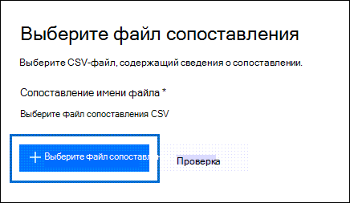

# <a name="use-drive-shipping-to-import-your-organizations-pst-files"></a>Использование доставки дисков для импорта PST-файлов организации

**Эта статья для администраторов. Вы пытаетесь импортировать PST-файлы в собственный почтовый ящик? См. [импорт электронной почты, контактов и календаря из Outlook PST-файла](https://go.microsoft.com/fwlink/p/?LinkID=785075)**
   
Используйте службу Office 365 импорта и доставку на массовый импорт PST-файлов в почтовые ящики пользователей. Под отправкой жестких дисков имеется в виду следующее: вы копируете PST-файлы на жесткие диски, а затем отправляете эти диски в корпорацию Майкрософт. Когда Microsoft получает жесткий диск, персонал центра обработки данных копирует данные с жесткого диска в область хранения в облаке Майкрософт. Затем у вас есть возможность обрезать данные PST, импортируемые в целевые почтовые ящики, установив фильтры, которые контролируют импортируемые данные. После запуска задания импорта служба импорта импортирует данные PST из области хранения в почтовые ящики пользователей. Использование доставки диска для импорта PST-файлов в почтовые ящики пользователей — это один из способов переноса электронной почты организации на Office 365.
  
Вот действия, необходимые для использования доставки дисков для импорта PST-файлов для Microsoft 365 почтовых ящиков:
  
[Шаг 1. Скачайте безопасный ключ хранения и средство импорта PST](#step-1-download-the-secure-storage-key-and-pst-import-tool)

[Шаг 2. Скопируйте PST-файлы на жесткий диск](#step-2-copy-the-pst-files-to-the-hard-drive)

[Шаг 3. Создание файла сопоставления импорта PST](#step-3-create-the-pst-import-mapping-file)

[Действие 4. В Office 365 создайте задание на импорт PST-файлов](#step-4-create-a-pst-import-job-in-office-365).

[Действие 5. Отправьте жесткие диски в корпорацию Майкрософт](#step-5-ship-the-hard-drive-to-microsoft).

[Шаг 6. Фильтрация данных и запуск задания импорта PST-файлов](#step-6-filter-data-and-start-the-pst-import-job)
  
> [!IMPORTANT]
> Для загрузки безопасного ключа хранилища и средства импорта необходимо выполнить шаг 1 один раз. После выполнения этих действий выполните шаг 2—шаг 6 каждый раз, когда вы хотите отогнать жесткий диск в Корпорацию Майкрософт. 
  
Часто задаваемые вопросы об использовании доставки дисков для импорта PST-файлов для Office 365 см. в часто задаваемой информации об использовании доставки дисков для импорта [PST-файлов.](./faqimporting-pst-files-to-office-365.yml#using-drive-shipping-to-import-pst-files) 
  
## <a name="before-you-import-pst-files"></a>Перед импортом PST-файлов

- Для импорта файлов PST в почтовые ящики Microsoft 365 необходимо назначить роль экспорта-импорта почтовых ящиков в Exchange Online. По умолчанию эта роль не назначена ни одной группе ролей в Exchange Online. Вы можете добавить роль "Импорт и экспорт почтовых ящиков" в группу ролей "Управление организацией". Кроме того, вы можете создать группу ролей, назначить ей роль "Импорт и экспорт почтовых ящиков" и добавить себя в качестве участника группы. Дополнительные сведения см. в разделах "Добавление роли в группу ролей" или "Создание группы ролей" статьи [Управление группами ролей](/Exchange/permissions-exo/role-groups).
    
    Кроме того, чтобы создать задания импорта в Центре безопасности и соответствия требованиям, должно выполняться одно из следующих условий:
    
  - Вам должна быть назначена роль "Получатели почты" в Exchange Online. По умолчанию эта роль назначается группам ролей "Управление организацией" и "Управление получателями".
    
    или
    
  - Вы должны быть глобальным администратором в своей организации.
    
    > [!TIP]
    > Рекомендуется создать новую группу ролей в Exchange Online, предназначенную специально для импорта PST-файлов в Office 365. Для минимального уровня прав, необходимого для импорта PST-файлов, назначьте роли "Импорт и экспорт почтовых ящиков" и "Получатели почты" новой группе ролей, а затем добавьте участников. 
  
- PST-файлы, которые вы хотите скопировать на жесткие диски, должны храниться на файловом сервере или в общей папке в вашей организации. На шаге 2 вы запустите средство экспорта импорта Azure (WAImportExport.exe), которое копирует файлы PST, хранимые на этом файловом сервере или общей папке, на жесткий диск.

- Крупные PST-файлы могут повлиять на скорость импорта PST. Поэтому рекомендуется, чтобы каждый PST-файл, который вы скопируете на жесткий диск в шаге 2, не должен быть больше 20 ГБ.
    
- Только 2,5-дюймовые твердотопливные диски (SSD) или 2,5-дюймовые или 3,5-дюймовые жесткие диски SATA II/III поддерживаются для использования в службе импорта Office 365. емкостью до 10 ТБ. При выполнении заданий импорта на каждом жестком диске будет обрабатываться только первый том данных. Тома должны быть отформатированы в файловой системе NTFS. При копировании данных на жесткий диск можно прикрепить их непосредственно с помощью 2,5-дюймового SSD или 2,5-дюймового или 3,5-дюймового соединителя SATA II/III или можно прикрепить его внешне с помощью внешнего 2,5-дюймового SSD или 2,5-дюймового или 3,5-дюймового USB-адаптора SATA II/III.
    
    > [!IMPORTANT]
    > Внешние жесткие диски со встроенным USB-адаптером не поддерживаются службой импорта Office 365. Кроме того, невозможно использовать диск в корпусе внешнего жесткого диска. Не отправляйте внешние жесткие диски. 
  
- Жесткие диски, на которые вы копируете PST-файлы, должны быть зашифрован с помощью технологии BitLocker. Средство WAImportExport.exe, которое вы запустите в действии 2, поможет вам настроить BitLocker. Кроме того, BitLocker ключ шифрования, который сотрудники центра обработки данных Майкрософт используют для доступа к диску для отправки PST-файлов в служба хранилища Azure области в облаке Майкрософт.
    
- Доставка диска доступна через microsoft Соглашение Enterprise (EA). Она недоступна при наличии соглашения об использовании товаров и услуг корпорации Майкрософт.
    
- Стоимость импорта PST-файлов для Microsoft 365 почтовых ящиков с помощью доставки диска составляет $2 USD за ГБ данных. Например, если отправляется жесткий диск, который содержит PST-файлы объемом 1000 ГБ (1 ТБ), это будет стоить 2000 долларов США. Вы можете оплатить комиссию за импорт файлов одному из наших партнеров. Сведения о поиске партнера см. в разделе [Поиск партнера или торгового посредника Microsoft](../admin/manage/find-your-partner-or-reseller.md).
    
- У вас или у вашей организации должна быть учетная запись в службах FedEx или DHL. 
    
  - Организации в США, Бразилии и Европе должны иметь учетные записи FedEx.
    
  - Организации в Восточной Азии, Юго-Восточной Азии, Японии, Республике Корея и Австралии должны иметь учетные записи DHL.
    
    Корпорация Майкрософт использует (и взимает) эту учетную запись, чтобы вернуть жесткий диск.
    
- Жесткий диск, который вы отгрузите Корпорации Майкрософт, может пересекать международные границы. В этом случае вы несете ответственность за то, чтобы жесткий диск и данные, которые он содержит, импортируются и/или экспортируются в соответствии с применимыми законами. Перед отправкой жестких дисков проконсультируйтесь со специалистами и убедитесь, что их можно законным образом доставить в один из центров обработки данных корпорации Майкрософт. Это помогает обеспечить своевременное обеспечение своевременного достижения майкрософт.
    
- Во время выполнения этой процедуры необходимо скопировать и сохранить ключ защищенного хранилища и ключ шифрования BitLocker. Необходимо защитить эти ключи так же надежно, как вы защищаете пароли и прочую информацию, связанную с обеспечением безопасности. Например, можно сохранить эти ключи в документе Microsoft Word, защищенном паролем, или на зашифрованном USB-накопителе. Пример этих [ключей](#more-information) см. в разделе Дополнительные сведения. 
    
- После импорта PST-файлов в Microsoft 365 почтовый ящик параметр хранения для почтового ящика включен на неопределенный срок. Это означает, что политика хранения, назначенная почтовому ящику, не будет обрабатываться, пока вы не отключите приостановку хранения или не назначите дату выполнения. Почему мы это делаем? Старые сообщения при импорте в почтовый ящик могут удаляться без возможности восстановления, так как их срок хранения, заданный в параметрах хранения почтового ящика, закончился. Приостановка хранения дает владельцу почтового ящика время для управления импортированными сообщениями или предоставляет вам время на изменение параметров хранения для почтового ящика. Дополнительные [сведения см. в](#more-information) разделе Дополнительные сведения о предложениях по управлению удержанием хранения. 
    
- По умолчанию максимальный размер сообщения, которое может получить почтовый ящик Microsoft 365, составляет 35 МБ. Это обусловлено тем, что значение по умолчанию для свойства *MaxReceiveSize* почтового ящика равно 35 МБ. Тем не менее, максимальный размер сообщения в Microsoft 365 ограничен 150 МБ. Поэтому при импорте PST-файла, содержащего элемент размером более 35 МБ, служба импорта Office 365 автоматически меняет значение свойства *MaxReceiveSize* целевого почтового ящика на 150 МБ. Это позволяет импортировать в почтовые ящики пользователей сообщения размером до 150 МБ. 
    
    > [!TIP]
    > Чтобы определить размер сообщения для почтового ящика, можно выполнить в Exchange Online PowerShell следующую команду: `Get-Mailbox <user mailbox> | FL MaxReceiveSize`. 
  
- PST-файлы можно импортировать в неактивный почтовый ящик Office 365. Для этого нужно указать GUID неактивного почтового ящика в параметре `Mailbox` файла сопоставления для импорта PST-файлов. Дополнительные сведения см. в шаге [3. Создание файла сопоставления импорта PST.](#step-3-create-the-pst-import-mapping-file) 
    
- В гибридной среде Exchange вы можете импортировать PST-файлы в облачный архивный почтовый ящик пользователя, основной почтовый ящик которого является локальным. Для этого выполните следующие действия в файле сопоставления для импорта PST-файлов:
    
  - Укажите адрес электронной почты для локального почтового ящика пользователя в параметре `Mailbox`. 
    
  - Укажите значение **TRUE** для параметра `IsArchive`. 
    
    Дополнительные сведения см. в шаге [3. Создание файла сопоставления импорта PST.](#step-3-create-the-pst-import-mapping-file) 

## <a name="step-1-download-the-secure-storage-key-and-pst-import-tool"></a>Шаг 1. Скачайте безопасный ключ хранения и средство импорта PST

Первым шагом является скачивание безопасного ключа хранения и средства, которое используется в шаге 2 для копирования PST-файлов на жесткий диск.
  
> [!IMPORTANT]
> Для успешного импорта PST-файлов с помощью метода доставки дисков необходимо использовать azure импорт и экспорт версии 1 (WAimportExportV1). Версия 2 средства импорт и экспорт Azure не поддерживается, и его использование приведет к неправильной подготовке жесткого диска для задания импорта. Не забудьте скачать импорт и экспорт Azure из Центра & безопасности, следуя процедурам на этом шаге. 
  
1. Перейдите в [https://protection.office.com/](https://protection.office.com/) и войдите в систему, используя учетные данные для учетной записи администратора в вашей организации. 
    
2. В левой области Центра безопасности и соответствия требованиям выберите **Управление информацией** \> **Импорт** \> **Импорт PST-файлов**.
    
    > [!NOTE]
    > Как уже говорилось ранее, вам должны быть назначены соответствующие разрешения для доступа к странице Импорт в Центре & безопасности.  
  
3. На странице **Импорт PST-файлов** нажмите  **Новое задание импорта**.
    
4. В мастере импортных рабочих мест введите имя задания импорта PST и нажмите кнопку **Далее**. Используйте строчные буквы, числа, дефисы и символы подчеркивания. Имя не должно содержать заглавных букв и пробелов.
    
5. На странице **Выберите тип задания** импорта нажмите **кнопку** Отгрузить жесткие диски в одно из наших физических местоположений, а затем нажмите **кнопку Далее**.
    
    
  
6. На странице **Импорт данных** выполните следующие два действия. 
    
    
  
    а. На шаге 2 щелкните **Скопируйте ключ безопасного хранения.** После отображения ключа хранения щелкните **Скопируйте** буфер обмена, а затем вклеите его и сохраните в файле, чтобы вы могли получить к нему доступ позже.
    
    б. В шаге 3 **скачайте** средство Azure импорт и экспорт для загрузки и установки средства Azure импорт и экспорт (версия 1).
    
    - В всплывающее окно щелкните **Сохранить** сохранение, чтобы сохранить WaImportExportV1.zip файл в папку \>  на локальном компьютере. 
    
    - Извлечение WaImportExportV1.zip файла.
    
7. Щелкните **Отмена,** чтобы закрыть мастера. 
    
    При создании задания  импорта на шаге 4 возвращаешься на страницу Импорт в центре & безопасности. 

## <a name="step-2-copy-the-pst-files-to-the-hard-drive&quot;></a>Шаг 2. Скопируйте PST-файлы на жесткий диск

Далее необходимо с помощью средства WAImportExport.exe скопировать PST-файлы на жесткие диски. Это средство шифрует жесткие диски с помощью технологии BitLocker, копирует на них PST-файлы и создает файл журнала, в котором хранятся сведения о процессе копирования. Чтобы выполнить это действие, необходимо, чтобы PST-файлы хранились в файловом ресурсе или на файловом сервере в вашей организации. В описанной ниже процедуре такое расположение называется исходным каталогом. 

 Как уже говорилось ранее, каждый PST-файл, который вы скопируете на жесткий диск, не должен быть больше 20 ГБ. PST-файлы размером более 20 ГБ могут повлиять на скорость импорта PST, запускаемого на шаге 6.
  
> [!IMPORTANT]
> После того как средство WAImportExport.exe будет в первый раз запущено для жесткого диска, при каждом последующем запуске необходимо будет использовать другой синтаксис. Этот синтаксис объясняется в шаге 4 этой процедуры для копирования PST-файлов на жесткий диск. 
  
1. Откройте окно командной строки на локальном компьютере.
    
    > [!TIP]
    > Если вы запустите командную строку с правами администратора (выбрав &quot;Запуск от имени администратора"), то в окне командной строки будут отображаться сообщения об ошибках. Это помогает устранить проблемы, возникающие при работе средства WAImportExport.exe. 
  
2. Перейдите в каталог, в который вы установили средство WAImportExport.exe в действии 1.
    
3. При первом использовании средства WAImportExport.exe для копирования PST-файлов на жесткие диски выполните указанную ниже команду.

    ```powershell
    WAImportExport.exe PrepImport /j:<Name of journal file> /t:<Drive letter> /id:<Name of session> /srcdir:<Location of PST files> /dstdir:<PST file path> /sk:<Storage account key> /blobtype:BlockBlob /encrypt /logdir:<Log file location>
    ```

    В таблице ниже перечислены необходимые параметры и значения для них.
    
    |**Параметр**|**Описание**|**Пример**|
    |:-----|:-----|:-----|
    | `/j:` <br/> |Указывает имя файла журнала. Этот файл сохраняется в той же папке, в которой расположено средство WAImportExport.exe. Для каждого жесткого диска, отправляемого в корпорацию Майкрософт, должен быть отдельный файл журнала. При каждом запуске средства WAImportTool.exe для копирования PST-файлов на жесткий диск в файл журнала для этого диска будут добавлены соответствующие сведения. 
  <br/> Сотрудники центра обработки данных Майкрософт используют сведения в файле журнала, чтобы связать жесткий диск с заданием импорта, которое создается в шаге 4, и загрузить PST-файлы в область служба хранилища Azure в облаке Майкрософт.  <br/> | `/j:PSTHDD1.jrn` <br/> |
    | `/t:` <br/> |Задает букву диска для жесткого диска при его подключении к локальному компьютеру.  <br/> | `/t:h` <br/> |
    | `/id:` <br/> |Задает имя сеанса копирования. Сеанс — это каждый запуск средства WAImportExport.exe для копирования файлов на жесткие диски. PST-файлы копируются в папку, в качестве имени которой используется имя сеанса, заданное этим параметром.   <br/> | `/id:driveship1` <br/> |
    | `/srcdir:` <br/> |Задает исходный каталог в вашей организации, содержащий PST-файлы, которые необходимо скопировать во время сеанса. Обязательно заключите значение этого параметра в кавычки (" ").  <br/> | `/srcdir:"\\FILESERVER01\PSTs"` <br/> |
    | `/dstdir:` <br/> |Указывает каталог назначения в области служба хранилища Azure в облаке Майкрософт, куда будут загружены PSTs. Необходимо использовать значение  `ingestiondata/` . Обязательно заключите значение этого параметра в кавычки (" ").  <br/> Кроме того, можно добавить дополнительный путь к значению этого параметра. Например, можно использовать путь файла каталога источника на жестком диске (преобразован в формат URL-адреса), который указан в  `/srcdir:` параметре. Например,  `\\FILESERVER01\PSTs` изменено на  `FILESERVER01/PSTs` . В этом случае необходимо включить в  `ingestiondata` путь файла. Таким образом, в этом примере значение для  `/dstdir:` параметра будет  `"ingestiondata/FILESERVER01/PSTs"` .  <br/> Одна из причин добавления дополнительного пути файла — это если у вас есть psTs-файлы с одним и тем же иным инаумным файлом.  <br/> > [!NOTE]> Если вы включаете необязательное имя пути, пространство имен для PST-файла после его отправки в область служба хранилища Azure включает имя пути и имя PST-файла; например, `FILESERVER01/PSTs/annb.pst` . Если вы не включаете имя пути, пространство имен — это только имя файла PST; например  `annb.pst` .           | `/dstdir:"ingestiondata/"` <br/> Или  <br/>  `/dstdir:"ingestiondata/FILESERVER01/PSTs"` <br/> |
    | `/sk:` <br/> |Задает ключ учетной записи хранения, который вы получили в действии 1. Обязательно заключите значение этого параметра в кавычки (" ").  <br/> | `"yaNIIs9Uy5g25Yoak+LlSHfqVBGOeNwjqtBEBGqRMoidq6/e5k/VPkjOXdDIXJHxHvNoNoFH5NcVUJXHwu9ZxQ=="` <br/> |
    | `/blobtype:` <br/> |Указывает тип blobs в области служба хранилища Azure для импорта PST-файлов. Для импорта PST-файлов используйте значение **BlockBlob**. Это обязательный параметр.   <br/> | `/blobtype:BlockBlob` <br/> |
    | `/encrypt` <br/> |Этот параметр включает шифрование BitLocker для жесткого диска. Этот параметр является обязательным при первом запуске средства WAImportExport.exe.  <br/> Ключ BitLocker скопируется в файл журнала и файл журнала, созданный при использовании `/logfile:` параметра. Как было сказано ранее, файл журнала хранится в той же папке, в которой расположено средство WAImportExport.exe.  <br/> | `/encrypt` <br/> |
    | `/logdir:` <br/> |Этот дополнительный параметр указывает папку для сохранения файлов журналов. Если не указано, файлы журнала сохраняются в той же папке, в которой WAImportExport.exe находится средство. Обязательно заключите значение этого параметра в кавычки (" ").  <br/> | `/logdir:"c:\users\admin\desktop\PstImportLogs"` <br/> |
   
    Вот пример синтаксиса для средства WAImportExport.exe, в котором использованы действительные значения для каждого параметра:
    
    ```powershell
    WAImportExport.exe PrepImport /j:PSTHDD1.jrn /t:f /id:driveship1 /srcdir:"\\FILESERVER01\PSTs" /dstdir:"ingestiondata/" /sk:"yaNIIs9Uy5g25Yoak+LlSHfqVBGOeNwjqtBEBGqRMoidq6/e5k/VPkjOXdDIXJHxHvNoNoFH5NcVUJXHwu9ZxQ==" blobtype:BlockBlob /encrypt /logdir:"c:\users\admin\desktop\PstImportLogs"
    ```

    После запуска команды будут отображаться сообщения о состоянии, показывающие ход копирования PST-файлов на жесткий диск. В окончательном сообщении о состоянии будет отображено общее количество успешно скопированных файлов. 
    
4. Выполняйте эту команду при каждом последующем запуске средства WAImportExport.exe для копирования PST-файлов на тот же жесткий диск.

    ```powershell
    WAImportExport.exe PrepImport /j:<Name of journal file> /id:<Name of new session> /srcdir:<Location of PST files> /dstdir:<PST file path> /blobtype:BlockBlob 
    ```

    Вот пример синтаксиса для запуска последующих сеансов копирования PST-файлов на тот же жесткий диск.  

    ```powershell
    WAImportExport.exe PrepImport /j:PSTHDD1.jrn /id:driveship2 /srcdir:"\\FILESERVER01\PSTs\SecondBatch" /dstdir:"ingestiondata/" /blobtype:BlockBlob
    ```

## <a name="step-3-create-the-pst-import-mapping-file"></a>Шаг 3. Создание файла сопоставления импорта PST

После того как сотрудники центра обработки данных Майкрософт загрузят PST-файлы с жесткого диска в область служба хранилища Azure, служба импорта будет использовать сведения в файле сопоставления импорта PST, который является разделенным запятой значением (CSV), в котором указывается, в какие почтовые ящики пользователей импортируется PST-файлы. Вы отправите этот CSV-файл в следующем действии, когда будете создавать задание на импорт PST-файлов.
  
1. [Скачайте файл сопоставления для импорта PST-файлов](https://go.microsoft.com/fwlink/p/?LinkId=544717).
    
2. Откройте или сохраните этот CSV-файл на локальный компьютер. В примере ниже показан готовый файл сопоставления для импорта PST-файлов (открытый в Блокноте). Для редактирования CSV-файла намного удобнее использовать Microsoft Excel.

    ```text
    Workload,FilePath,Name,Mailbox,IsArchive,TargetRootFolder,ContentCodePage,SPFileContainer,SPManifestContainer,SPSiteUrl
    Exchange,FILESERVER01/PSTs,annb.pst,annb@contoso.onmicrosoft.com,FALSE,/,,,,
    Exchange,FILESERVER01/PSTs,annb_archive.pst,annb@contoso.onmicrosoft.com,TRUE,/ImportedPst,,,,
    Exchange,FILESERVER01/PSTs,donh.pst,donh@contoso.onmicrosoft.com,FALSE,/,,,,
    Exchange,FILESERVER01/PSTs,donh_archive.pst,donh@contoso.onmicrosoft.com,TRUE,/ImportedPst,,,,
    Exchange,FILESERVER01/PSTs,pilarp.pst,pilarp@contoso.onmicrosoft.com,FALSE,/,,,,
    Exchange,FILESERVER01/PSTs,pilarp_archive.pst,pilarp@contoso.onmicrosoft.com,TRUE,/ImportedPst,,,,
    Exchange,,tonyk.pst,tonyk@contoso.onmicrosoft.com,FALSE,/,,,,
    Exchange,,tonyk_archive.pst,tonyk@contoso.onmicrosoft.com,TRUE,,,,,
    Exchange,,zrinkam.pst,zrinkam@contoso.onmicrosoft.com,FALSE,/,,,,
    Exchange,,zrinkam_archive.pst,zrinkam@contoso.onmicrosoft.com,TRUE,,,,,
    ```

    В первой строке (строке заголовков) CSV-файла перечислены параметры, которые будут использоваться службой импорта PST-файлов для импорта PST-файлов в почтовые ящики пользователей. Имена параметров отделяются друг от друга запятыми. Каждая строка, расположенная под строкой заголовков, содержит значения для импорта PST-файла в определенный почтовый ящик. Для каждого PST-файла, который был скопирован на жесткий диск, требуется строка. Не забудьте заменить данные-заполнители в файле сопоставления действительными данными.

    > [!NOTE]
    > Не изменяйте ничего в строке заголовков, в том числе параметры SharePoint. Они будут проигнорированы в процессе импорта PST-файлов. 
  
3. Для заполнения CSV-файла необходимой информацией воспользуйтесь сведениями из таблицы ниже.
    
    |**Параметр**|**Описание**|**Пример**|
    |:-----|:-----|:-----|
    | `Workload` <br/> |Определяет сервис, в который будут импортированы данные. Для импорта PST-файлов в почтовые ящики пользователей укажите `Exchange`.  <br/> | `Exchange` <br/> |
    | `FilePath` <br/> | Указывает расположение папки в области служба хранилища Azure, в которую будут скопированы PST-файлы при отправке жесткого диска в Корпорацию Майкрософт.  <br/>  То, что вы добавляете в этом столбце в CSV-файле, зависит от того, что вы указали для параметра  `/dstdir:` на предыдущем шаге. Если у вас есть подмостки на месте источника, то значение параметра должно содержать относительный путь для подмостков; `FilePath` например, /folder1/user1/.  <br/>  Если  `/dstdir:"ingestiondata/"` используется, оставьте этот параметр пустым в CSV-файле.  <br/>  Если вы включили необязательное имя пути для значения параметра (например, затем используйте это имя пути (не включая "ingestiondata") для этого параметра в  `/dstdir:`  `/dstdir:"ingestiondata/FILESERVER01/PSTs"` CSV-файле. Значение этого параметра нужно указывать с учетом регистра.  <br/>  В любом случае *не* включайте "ingestiondata" в значение параметра `FilePath`. Оставьте этот параметр пустым или укажите только необязательное имя пути.  <br/> > [!IMPORTANT]> случае для имени пути файла должен быть тот же случай, который вы указали в параметре  `/dstdir:` на предыдущем шаге. Например, если на предыдущем шаге используется имя подмостков, а затем используется в параметре  `"ingestiondata/FILESERVER01/PSTs"`  `fileserver01/psts` в  `FilePath` CSV-файле, импорт PST-файла не удастся. Используйте одинаковый регистр в обоих случаях.           |(Оставьте пустым)  <br/> или  <br/>  `FILESERVER01/PSTs` <br/> |
    | `Name` <br/> |Указывает имя PST-файла, который будет импортирован в почтовый ящик пользователя. Значение этого параметра нужно указывать с учетом регистра.  <br/> > [!IMPORTANT]> случае, когда имя файла PST в CSV-файле должно быть таким же, как файл PST, который был загружен в расположение служба хранилища Azure в шаге 2. Например, если вы указали `annb.pst` для параметра `Name` в CSV-файле, а сам файл называется `AnnB.pst`, импорт PST-файла завершится сбоем. Убедитесь, что для имени PST-файла в CSV-файле используется тот же регистр, что и для имени самого PST-файла.           | `annb.pst` <br/> |
    | `Mailbox` <br/> |Указывает электронный адрес почтового ящика, в который будет импортирован PST-файл. Указать общедоступную папку невозможно, так как служба импорта PST не поддерживает импорт PST-файлов в общедоступные папки.  <br/> Для импорта PST-файла в неактивный почтовый ящик необходимо указать GUID почтового ящика для этого параметра. Чтобы получить этот GUID, выполните в Exchange Online следующую команду PowerShell: `Get-Mailbox <identity of inactive mailbox> -InactiveMailboxOnly | FL Guid` <br/> > [!NOTE]> Иногда у вас может быть несколько почтовых ящиков с одним и тем же адресом электронной почты, где один почтовый ящик является активным почтовым ящиком, а другой — в состоянии мягкого удаления (или неактивности). В этих ситуациях требуется указать GUID почтового ящика, в который нужно импортировать PST-файл. Чтобы получить этот GUID, выполните следующую команду PowerShell: `Get-Mailbox <identity of active mailbox> | FL Guid`. Чтобы получить GUID для удаленных (или неактивных) почтовых ящиков, запустите эту команду:  `Get-Mailbox <identity of soft-deleted or inactive mailbox> -SoftDeletedMailbox | FL Guid` .           | `annb@contoso.onmicrosoft.com` <br/> или  <br/>  `2d7a87fe-d6a2-40cc-8aff-1ebea80d4ae7` <br/> |
    | `IsArchive` <br/> | Указывает, следует ли импортировать PST-файл в архивный почтовый ящик пользователя. Возможны два варианта:  <br/> **FALSE** Импортирует PST-файл в основной почтовый ящик пользователя.  <br/> **TRUE** Импортирует PST-файл в архивный почтовый ящик пользователя. При этом предполагается, что [архивный почтовый ящик пользователя включен](enable-archive-mailboxes.md). Если для этого параметра задано значение `TRUE` и архивный почтовый ящик не включен, импорт для этого пользователя завершится ошибкой. В случае сбоя импорта для одного пользователя (например, если для него отключен архив и для данного свойства установлено значение `TRUE`) остальные пользователи, для которых выполняется импорт, не будут затронуты.  <br/>  Если этот параметр оставлен пустым, PST-файл импортируется в основной почтовый ящик пользователя.  <br/> **Примечание.** Чтобы импортировать PST-файл в облачный архивный почтовый ящик пользователя, основной почтовый ящик которого является локальным, просто укажите `TRUE` для этого параметра и задайте адрес электронной почты локального почтового ящика для параметра `Mailbox`.  <br/> | `FALSE` <br/> или  <br/>  `TRUE` <br/> |
    | `TargetRootFolder` <br/> | Указывает папку почтового ящика, в которую импортируется PST-файл.  <br/>  Если оставить этот параметр пустым, PST будет импортироваться в новую папку с именем **Imported,** расположенную на корневом уровне почтового ящика (на том же уровне, что и папка "Входящие" и другие папки почтовых ящиков по умолчанию).  <br/>  Если указать, элементы в PST-файле будут импортироваться непосредственно в папку  `/` "Входящие" пользователя.  <br/>  Если  `/<foldername>` указать, элементы в PST-файле будут импортироваться в папку с именем  *\<foldername\>* . Например, если указан параметр `/ImportedPst`, элементы будут импортированы в папку с именем **ImportedPst**. Эта папка будет расположена в почтовом ящике пользователя на том же уровне, что и папка "Входящие".  <br/> |(Оставьте пустым)  <br/> или  <br/>  `/` <br/> или  <br/>  `/ImportedPst` <br/> |
    | `ContentCodePage` <br/> |Этот необязательный параметр задает числовое значение кодовой страницы, которую следует использовать для импорта PST-файлов в формате ANSI. Этот параметр применяется при импорте PST-файлов на китайском, японском и корейском языках, так как в них обычно используется двухбайтовая кодировка (DBCS). Если не использовать этот параметр, названия папок почтовых ящиков могут быть искажены после импорта.  <br/> Список поддерживаемых значений для этого параметра см. в статье [Идентификаторы кодовых страниц](/windows/win32/intl/code-page-identifiers).  <br/> > [!NOTE]> как уже говорилось, это необязательный параметр, и его необязательно включать в CSV-файл. Кроме того, вы можете добавить его и оставить поле пустым для одной или нескольких строк.           |(Оставьте пустым)  <br/> Или  <br/>  `932` (идентификатор кодовой страницы для японского языка ANSI/OEM)  <br/> |
    | `SPFileContainer` <br/> |При импорте PST-файлов оставьте этот параметр пустым.  <br/> |Неприменимо  <br/> |
    | `SPManifestContainer` <br/> |При импорте PST-файлов оставьте этот параметр пустым.  <br/> |Неприменимо  <br/> |
    | `SPSiteUrl` <br/> |При импорте PST-файлов оставьте этот параметр пустым.  <br/> |Неприменимо  <br/> |

## <a name="step-4-create-a-pst-import-job-in-office-365"></a>Действие 4. В Office 365 создайте задание на импорт PST-файлов.

Далее потребуется создать задание на импорт PST-файлов в службе импорта в Office 365. Как уже объяснялось ранее, вы представляете файл сопоставления импорта PST, созданный в шаге 3. После создания задания служба импорта будет использовать сведения в файле сопоставления для импорта PST-файлов в указанный почтовый ящик пользователя после копирования PST-файлов с жесткого диска в область служба хранилища Azure и при создании и запуске задания импорта.
  
1. Перейдите в [https://protection.office.com](https://protection.office.com) и войдите в систему, используя учетные данные для учетной записи администратора в вашей организации. 
    
2. В левой области Центра безопасности и соответствия требованиям выберите **Управление информацией** \> **Импорт** \> **Импорт PST-файлов**.
    
3. На странице **Импорт PST-файлов** нажмите  **Новое задание импорта**.
    
    > [!NOTE]
    > Как уже говорилось ранее, вам должны быть назначены соответствующие разрешения для доступа к странице Импорт в Центре & безопасности.  
  
4. Введите имя для задания импорта PST-файлов и нажмите кнопку **Далее**. Используйте строчные буквы, числа, дефисы и символы подчеркивания. Имя не должно содержать заглавных букв и пробелов.
    
5. На странице **Выберите тип задания** импорта нажмите **кнопку** Отгрузить жесткие диски в одно из наших физических местоположений, а затем нажмите **кнопку Далее**.
    
    
  
6. На шаге 6  нажмите кнопку Я подготовил жесткие диски и  получить доступ к необходимым файлам журнала дисков, и у меня есть доступ к флажкам картографического файла, а затем нажмите **кнопку Далее**.
    
    
  
7. На странице **Выберите файл диска** нажмите **выберите** файл диска, а затем перейдите в ту же папку, в которой WAImportExport.exe находится средство. Файл журнала, созданный в действии 2, был скопирован в эту папку.
    
    
  
8. Выберите файл журнала; например, `PSTHDD1.jrn` .
    
    > [!TIP]
    > Когда вы запустили WAImportExport.exe в шаге 2, имя файла журнала было задано  `/j:` параметром. 
  
9. После того как имя файла диска появится под именем **файла Drive,** щелкните **Проверка,** чтобы проверить файл диска на ошибки. 
    
    
  
    Файл диска должен быть успешно проверен для создания задания импорта PST. Обратите внимание, что имя файла становится зеленым после успешной проверки. Если проверка завершилась сбоем, щелкните ссылку **Просмотреть журнал**. Открывается отчет об ошибке проверки с сообщением об ошибке с информацией о причине сбой файла. 
    
    > [!NOTE]
    > Необходимо добавить и проверить файл журнала для каждого жесткого диска, который вы отгрузите в Корпорацию Майкрософт. 
  
10. После добавления и проверки файла журнала для каждого жесткого диска, который вы отгружает в Microsoft, нажмите **кнопку Далее**.
    
11. Нажмите  **сопоставления Значки** Выберите, чтобы отправить файл сопоставления импорта PST, созданный в шаге 3. 
    
    
  
12. Когда имя CSV-файла появится в разделе **Имя файла сопоставления**, выберите его и щелкните **Проверить**, чтобы проверить CSV-файл на наличие ошибок. 
    
    
  
    Чтобы можно было создать задание импорта PST-файлов, CSV-файл должен успешно пройти проверку. Обратите внимание, что имя файла становится зеленым после успешной проверки. Если проверка завершилась сбоем, щелкните ссылку **Просмотреть журнал**. Откроется журнал ошибок, в котором для каждой строки со сбоем будет соответствующее сообщение об ошибке. 
    
13. После успешной проверки файла сопоставления PST нажмите **кнопку Далее**.
    
14. На странице **Предоставление контактной информации** введите контактные данные в соответствующих полях. 
    
    Отображается адрес расположения Microsoft, в которое вы отгрузите жесткие диски. Этот адрес создается автоматически в зависимости от расположения центра обработки данных Майкрософт. Скопируйте этот адрес в файл или сделайте снимок экрана.
    
15. Ознакомьтесь с документом "Условия и условия", щелкните почтовый ящик и нажмите **кнопку Сохранить** для отправки задания импорта. 
    
    После успешного создания задания импорта отображается страница состояния, которая объясняет следующие действия процесса доставки диска.
    
16. На странице **Импорт PST-файлов** нажмите кнопку Обновить значок Обновление, чтобы отобразить новое задание импорта доставки дисков в   списке импортных заданий. Состояние задано **в ожидании номера отслеживания.** Вы также можете щелкнуть задание импорта, чтобы отобразить страницу вылетов состояния, которая содержит более подробные сведения о заданиях импорта.
 
## <a name="step-5-ship-the-hard-drive-to-microsoft"></a>Действие 5. Отправьте жесткие диски в корпорацию Майкрософт.

Следующий шаг — отправка жесткого диска в Корпорацию Майкрософт, а затем предоставление номера отслеживания для отправки и возврата данных о доставке для задания доставки диска. После того как диск будет получен корпорацией Майкрософт, персонал центра обработки данных будет загружать свои PST-файлы в область служба хранилища Azure для организации.
  
> [!NOTE]
> Если вы не предоставите номер отслеживания и не возвращаете данные о доставке в течение 14 дней после создания задания импорта, срок действия задания импорта истекает. Если это произойдет, вам придется создать новое задание импорта доставки дисков (см. шаг [4. Создание](#step-4-create-a-pst-import-job-in-office-365)задания импорта PST в Office 365) и повторно отправить файл диска и файл сопоставления импорта PST. 
  
### <a name="ship-the-hard-drive"></a>Отправка жестких дисков

При отправке жестких дисков в корпорацию Майкрософт имейте в виду следующее:
  
- Не отгрузка адаптеров SATA-to-USB; вам нужно только отгрузка жесткого диска.
    
- убедитесь, что диски упакованы должным образом (например, в антистатический пакет или воздушно-пузырьковую пленку);
    
- самостоятельно выберите поставщика почтовых услуг для доставки жестких дисков в корпорацию Майкрософт;
    
- Отгрузка жесткого диска на адрес расположения Майкрософт, отображаемого при создания задания импорта в шаге 4. Обязательно включай в адрес Office 365 службу импорта.
    
- после отправки жестких дисков запишите название поставщика почтовых услуг и номер для отслеживания отправления. Эти данные потребуются вам в следующем действии.
    
### <a name="enter-the-tracking-number-and-other-shipping-information"></a>Ввод номера для отслеживания и других сведениях об отправленных дисках

После отправки жестких дисков в корпорацию Майкрософт выполните указанную ниже процедуру на странице службы импорта.
  
1. Перейдите в [https://protection.office.com](https://protection.office.com) и войдите в систему, используя учетные данные для учетной записи администратора в вашей организации. 
    
2. В левой области нажмите кнопку **Управление информацией > импортировать > PST-файлы**.
    
3. На странице **Импорт PST-файлов** щелкните задание для отправки диска, для чего необходимо ввести номер отслеживания. 
    
4. На странице вылет состояния щелкните **введите номер отслеживания**.
    
5. Укажите следующие данные об отправленных жестких дисках:
    
1. **Переносчик доставки** Введите имя перевозчика доставки, который использовался для доставки жесткого диска в Корпорацию Майкрософт. 
    
2. **Число отслеживания** Введите номер отслеживания для отправки жесткого диска. 
    
3. **Номер учетной записи оператора возврата** Введите номер учетной записи организации для оператора, перечисленного в **статье Return carrier.** Корпорация Майкрософт использует (и взимает) эту учетную запись для отгрузки жесткого диска к вам. Организации в США и Европе должны иметь учетную запись в FedEx. У организаций в Азии и остальном мире должна быть учетная запись в службе DHL.
    
6. Щелкните **Сохранить**, чтобы сохранить эти сведения для задания на импорт. 
    
    На странице **Импорт PST-файлов** нажмите кнопку Обновить значок Обновление, чтобы обновить сведения для задания импорта доставки   дисков. Обратите внимание, что теперь у задания на импорт будет состояние **Диски в пути**.

## <a name="step-6-filter-data-and-start-the-pst-import-job"></a>Шаг 6. Фильтрация данных и запуск задания импорта PST-файлов

После того, как жесткий диск будет получен Корпорацией Майкрософт, состояние задания импорта на странице Файлы **PST** импорта изменится на **полученные диски.** Сотрудники центра обработки данных используют сведения в файле журнала для отправки PST-файлов в область служба хранилища Azure организации. На этом этапе состояние изменяется в **импорте в процессе выполнения.** Как уже говорилось ранее, после получения жесткого диска для загрузки PST-файлов может занять от 7 до 10 бизнес-дней.
  
После загрузки PST-файлов в Azure состояние будет изменено на **"Анализ в процессе".** Это означает, Microsoft 365 анализ данных в PST-файлах (безопасным и безопасным образом) для определения возраста элементов и различных типов сообщений, включенных в файлы PST. Когда анализ завершен и данные будут готовы к импорту, состояние задания импорта будет изменено на **завершенный анализ.** На этом этапе у вас есть возможность импортировать все данные, содержащиеся в файлах PST, или можно обрезать импортируемые данные, установив фильтры, которые контролируют импортируемые данные.
  
1. Перейдите в [https://protection.office.com](https://protection.office.com) и войдите в систему, используя учетные данные для учетной записи администратора в вашей организации. 
    
2. В левой области нажмите кнопку **Управление данными** \>  \> **импортировать PST-файлы** импорта .
    
3. На странице **Импорт PST-файлов** нажмите **кнопку Готово** импортировать Office 365 для задания импорта, созданного в шаге 4. 
    
    
  
    Появится страница со сведениями о PST-файлах и другой информацией о задании импорта.
    
4. Нажмите **кнопку Импорт Office 365**.
    
5. Откроется страница **Отфильтровать данные**. На ней представлены результаты анализа PST-файлов, выполненного в Office 365, в том числе сведения о возрасте данных. На этом этапе вы можете отфильтровать данные или импортировать их все. 
    
    
  
6. Выполните одно из указанных ниже действий.
    
    а. Чтобы ограничить объем импортируемых данных, щелкните **Да, я хочу отфильтровать данные перед импортом**.
    
    Пошаговые инструкции по фильтрации данных в PST-файлах и запуску задания импорта можно найти [здесь](filter-data-when-importing-pst-files.md).
    
    или
    
    б. Чтобы импортировать все данные из PST-файлов, щелкните **Нет, импортировать все**, а затем нажмите кнопку **Далее**.
    
7. Если вы решили импортировать все данные, нажмите кнопку **Импорт данных**, чтобы запустить задание импорта. 
    
    Состояние задания импорта отображается на странице **Файлы импортных PST.** Щелкните  **Обновить**, чтобы обновить данные, отображаемые в столбце **Состояние**. Щелкните задание импорта, чтобы открыть всплывающее окно, в котором отображаются сведения о состоянии каждого импортируемого PST-файла. По завершении импорта PST-файлов в почтовые ящики пользователей состояние задания на импорт изменится на **Завершено**.

## <a name="view-a-list-of-the-pst-files-uploaded-to-microsoft-365"></a>Просмотр списка файлов PST, загруженных в Microsoft 365

Вы можете установить и использовать Обозреватель службы хранилища Microsoft Azure (который является бесплатным средством с открытым исходным кодом) для просмотра списка файлов PST, которые мы загружены (сотрудниками центра обработки данных Майкрософт) в область служба хранилища Azure для вашей организации. Это можно сделать, чтобы убедиться, что файлы PST с жестких дисков, отправленных в Корпорацию Майкрософт, были успешно загружены в область служба хранилища Azure.
  
В настоящее время доступна предварительная версия обозревателя службы хранилища Microsoft Azure.
  
 **Важно:** Вы не можете использовать Обозреватель службы хранилища Azure для загрузки или изменения PST-файлов. Единственный поддерживаемый метод импорта PST-файлов для Microsoft 365 — это использование AzCopy. Кроме того, PST-файлы, отправленные в большой двоичный объект Azure, нельзя удалить. Если вы пытаетесь удалить PST-файл, вы получите ошибку из-за того, что у вас нет необходимых разрешений. Все PST-файлы автоматически удаляются из служба хранилища Azure области. Если не существует рабочих мест импорта, все файлы PST в контейнере ** ingestiondata ** удаляются через 30 дней после создания последнего задания импорта. 
  
Чтобы установить обозреватель службы хранилища Microsoft Azure и подключиться к хранилищу Azure, выполните следующие действия.
  
1. Выполните следующие действия, чтобы получить URL-адрес подписи общего доступа (SAS) для вашей организации. Этот URL-адрес является сочетанием сетевого URL-адреса для служба хранилища Azure в облаке Microsoft для организации и ключа SAS. Этот ключ предоставляет вам необходимые разрешения для доступа к служба хранилища Azure расположения организации.
    
1. Перейдите в [https://protection.office.com/](https://protection.office.com/) и войдите в систему, используя учетные данные для учетной записи администратора в вашей организации. 
    
2. В левой области Центра безопасности и соответствия требованиям выберите **Управление информацией > Импорт > Импорт PST-файлов**.
    
3. На странице **Импорт PST-файлов** нажмите  **Новое задание импорта**.
    
4. В мастере импортных рабочих мест введите имя задания импорта PST и нажмите кнопку **Далее**. Используйте строчные буквы, числа, дефисы и символы подчеркивания. Имя не должно содержать заглавных букв и пробелов.
    
5. На странице **Выбор типа** задания импорта щелкните **Upload данные,** а затем нажмите **кнопку Далее**.
    
6. На шаге 2 щелкните ссылку **Отображение URL-адреса SAS для отправки данных по сети**.
    
7. После отображения URL-адреса скопируйте его и сохраните в файле. Убедитесь, что вы скопировали весь URL-адрес.
    
    > [!IMPORTANT]
    > Примите меры предосторожности, чтобы защитить URL-адрес SAS. Это может быть использовано любыми для доступа к области хранения Azure для вашей организации. 
  
8. Щелкните **Отмена,** чтобы закрыть мастера импортных рабочих мест. 
    
2. Скачайте и установите [обозреватель службы хранилища Microsoft Azure](https://go.microsoft.com/fwlink/p/?LinkId=544842).
    
3. Запустите обозреватель службы хранилища Microsoft Azure, щелкните правой кнопкой мыши пункт **Учетные записи хранения** в левой области, а затем выберите команду **Подключиться к хранилищу Azure**.
    
    
  
4. Щелкните **Использовать URI подписанного URL-адреса (SAS) или строку подключения** и нажмите кнопку **Далее**.
    
5. Нажмите **кнопку Использовать URI SAS,** вклеить URL-адрес SAS, полученный в шаге 1 в поле под **URI,** а затем нажмите **кнопку Далее**.
    
6. На странице **Сводка подключения** просмотрите сведения о подключении и нажмите кнопку **Подключиться**.
    
    Открывается контейнер **ingestiondata**. Он содержит PST-файлы с жесткого диска. Контейнер **ingestiondata** находится в разделе **Учетные записи хранения** \> **(службы, подключенные к SAS)** \> **Контейнер BLOB-объектов**.
    
    
  
7. После завершения работы с обозревателем службы хранилища Microsoft Azure щелкните правой кнопкой элемент **ingestiondata** и выберите пункт **Отсоединить**, чтобы отключиться от хранилища Azure. В противном случае при следующей попытке подключиться произойдет ошибка. 
    
    

## <a name="troubleshooting-tips"></a>Советы по устранению неполадок

- **Что произойдет в случае сбой задания импорта из-за ошибок в файле сопоставления CSV импорта PST?** Если задание импорта не удается из-за ошибок в файле сопоставления, для создания задания импорта не нужно перенаправить жесткий диск в Корпорацию Майкрософт. Это потому, что файлы PST с жесткого диска, который вы отправили для импортной работы доставки диска, уже были загружены в область служба хранилища Azure для вашей организации. В этом случае необходимо устранить ошибки в файле сопоставления CSV импорта PST, а затем создать новое задание импорта "сетевой загрузки" и отправить пересмотренный файл сопоставления CSV. Чтобы создать и запустить новую работу по импорту сетевой загрузки, см. в разделе Шаг 5: Создание задания импорта PST в Microsoft 365 и шаг [6:](use-network-upload-to-import-pst-files.md#step-6-filter-data-and-start-the-pst-import-job) Фильтрация данных и запуск задания импорта PST в разделе "Использование сетевой загрузки для импорта [PST-файлов](use-network-upload-to-import-pst-files.md#step-5-create-a-pst-import-job) в Office 365". 
    
    > [!NOTE]
    > Чтобы устранить неполадки в файле сопоставления CSV импорта [PST,](#view-a-list-of-the-pst-files-uploaded-to-microsoft-365) используйте средство Обозреватель службы хранилища Azure для просмотра структуры папок в контейнере **ingestiondata** для PST-файлов с жесткого диска, которые были загружены в хранилище Azure. Ошибки сопоставления файлов обычно вызваны неправильным значением в параметре FilePath. Этот параметр указывает расположение PST-файла в области хранения Azure. Описание параметра FilePath в таблице в [шаге 3](#step-3-create-the-pst-import-mapping-file). Как объяснялось ранее, расположение PST-файлов в области хранения Azure было задано параметром при WAImportExport.exe в  `/dstdir:` [шаге 2](#step-2-copy-the-pst-files-to-the-hard-drive). 
  
## <a name="more-information"></a>Дополнительные сведения

- Доставка диска — это эффективный способ импорта больших объемов архивных данных Microsoft 365, чтобы воспользоваться функциями соответствия требованиям, доступными для вашей организации. После импорта архивных данных в почтовые ящики пользователей можно:
    
  - Включить [](enable-unlimited-archiving.md) [архивные почтовые ящики](enable-archive-mailboxes.md) и автоматическое расширение архивирования, чтобы предоставить пользователям больше места для хранения данных. 
    
  - Поместите почтовые ящики в [удержание судебного разбирательства,](./create-a-litigation-hold.md) чтобы сохранить данные. 
    
  - Для [поиска](search-for-content.md) данных используйте средства электронного поиска Майкрософт. 
    
  - Применяйте [Microsoft 365](retention.md) политики хранения, чтобы контролировать, как долго сохраняются данные и какие действия необходимо принять по истечении срока хранения. 
    
  - Поиск журнала [аудита событий,](search-the-audit-log-in-security-and-compliance.md) связанных с данными. 
    
  - Импорт данных для [неактивных почтовых ящиков в](create-and-manage-inactive-mailboxes.md) архив данных для целей соответствия требованиям. 
    
  - Защитите организацию [от потери конфиденциальной](dlp-learn-about-dlp.md) информации. 
    
- Ниже показаны примеры ключа учетной записи защищенного хранилища и ключа шифрования BitLocker. В этом примере также показан синтаксис команды WAImportExport.exe, которую необходимо запустить для копирования PST-файлов на жесткий диск. Необходимо защитить эти ключи так же, как вы защищаете пароли и другую информацию, связанную с обеспечением безопасности.
    

    ```text
    Secure storage account key: 

    yaNIIs9Uy5g25Yoak+LlSHfqVBGOeNwjqtBEBGqRMoidq6/e5k/VPkjOXdDIXJHxHvNoNoFH5NcVUJXHwu9ZxQ==

    BitLocker encryption key:

    397386-221353-718905-535249-156728-127017-683716-083391

  COMMAND SYNTAX

  First time:

  WAImportExport.exe PrepImport /j:<Name of journal file> /t:<Drive letter> /id:<Name of session> /srcdir:<Location of PST files> /dstdir:<PST file path> /sk:<Storage account key> /blobtype:BlockBlob /encrypt /logdir:<Log file location>

  Subsequent times:

  WAImportExport.exe PrepImport /j:<Name of journal file> /id:<Name of new session> /srcdir:<Location of PST files> /dstdir:<PST file path> /blobtype:BlockBlob 

  EXAMPLES

  First time:

  WAImportExport.exe PrepImport /j:PSTHDD1.jrn /t:f /id:driveship1 /srcdir:"\\FILESERVER1\PSTs" /dstdir:"ingestiondata/" /sk:"yaNIIs9Uy5g25Yoak+LlSHfqVBGOeNwjqtBEBGqRMoidq6/e5k/VPkjOXdDIXJHxHvNoNoFH5NcVUJXHwu9ZxQ==" /blobtype:BlockBlob /encrypt /logdir:"c:\users\admin\desktop\PstImportLogs"

  Subsequent times:

  WAImportExport.exe PrepImport /j:PSTHDD1.jrn /id:driveship2 /srcdir:"\\FILESERVER1\PSTs\SecondBatch" /dstdir:"ingestiondata/" /blobtype:BlockBlob
    ```

- Как упоминалось выше, служба импорта Office 365 включает параметр приостановки хранения (на неопределенное время) после импорта PST-файлов в почтовый ящик. Это означает, что свойство  *RentionHoldEnabled*  задано таким образом, чтобы политика хранения, назначенная почтовому ящику, не  `True` обрабатывалась. Это предоставляет владельцу почтового ящика время управлять только что импортированными сообщениями, не давая политике удаления или архивации удалить или архивировать более старые сообщения. Вот как можно управлять приостановкой хранения: 
    
  - Через определенный период времени можно отключить удержание хранения, заключив  `Set-Mailbox -RetentionHoldEnabled $false` команду. Инструкции для этого см. в статье [Включение функции приостановки хранения для почтового ящика](/exchange/security-and-compliance/messaging-records-management/mailbox-retention-hold).
    
  - Приостановку хранения можно настроить таким образом, чтобы она отключилась в определенную дату. Вы делаете это, запуская  `Set-Mailbox -EndDateForRetentionHold <date>` команду. Например, если предположить, что сегодняшняя дата 1 июня 2016 г. и вы хотите отключить удержание хранения через 30 дней, вы запустите следующую команду:  `Set-Mailbox -EndDateForRetentionHold 7/1/2016` . В этом сценарии свойство  *RentionHoldEnabled*  будет задано  *true*. Дополнительные сведения см. в статье [Set-Mailbox](/powershell/module/exchange/set-mailbox).
    
  - Параметры назначенной почтовому ящику политики хранения можно изменить таким образом, чтобы более старые из импортированных элементов не удалялись и не перемещались в архивный почтовый ящик пользователя сразу. Например, можно продлить срок хранения для назначенной почтовому ящику политики удаления или архивации. В таком случае после того, как вы измените параметры политики хранения, нужно отключить приостановку хранения в почтовом ящике. Для получения дополнительной информации см. [Настройка политики архивирования и удаления для почтовых ящиков в вашей организации](set-up-an-archive-and-deletion-policy-for-mailboxes.md).
    

