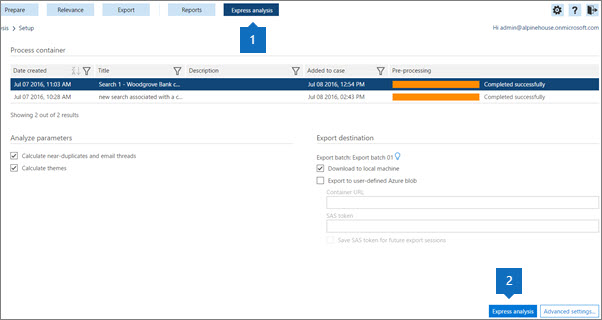

# Использование экспресс-анализа в Advanced eDiscovery (классическая) 

> [!NOTE]
> Чтобы можно было использовать Advanced eDiscovery, требуется подписка на Office 365 E3 с надстройкой Advanced Compliance или E5 для организации. Если у вас этого плана нет и вы хотите попробовать Advanced eDiscovery, можете [зарегистрироваться для получения пробной версии Office 365 корпоративный E5](https://go.microsoft.com/fwlink/p/?LinkID=698279). 
  
**Экспресс-анализ можно использовать** для быстрого анализа дела и экспорта результатов. 
  
Вы можете использовать экспресс-анализ для вычисления почти дубликатов и потоков электронной почты и вычисления тем. Вы также можете установить определенные параметры для тем, сходства документов и экспортных файлов в дополнительных параметрах [экспресс-анализа.](use-express-analysis-in-advanced-ediscovery.md#BK_AdvancedSettings)
  
## Запуск экспресс-анализа

1. На **вкладке Экспресс-анализа** (1) выберите контейнер, чтобы включить ** экспресс-анализ ** (2) и кнопки "Дополнительные параметры".  
    
    
  
2. В **области "Анализ параметров"**:
    
  - Проверьте **вычислять почти дубликаты** и потоки электронной почты, если вы хотите выполнить анализ. Этот параметр выбран по умолчанию. 
    
  - Проверьте **"Вычислять** темы", чтобы обработать все файлы и назначить им темы. Этот параметр выбран по умолчанию. 
    
3. В **пункте "Экспорт назначения"**:
    
  - Проверьте **загрузку на локальный компьютер,** чтобы скачать его на локальный компьютер. 
    
  - Если вы **проверяете экспорт в определенный** пользователем большой объем azure, вы также можете указать URL-адрес контейнера и маркер SAS. 
    
    > [!NOTE]
    > Когда пакет экспорта сохраняется в определенном пользователем BLOB-хранилище Azure, advanced eDiscovery больше не управляет данными. он управляется BLOB-клиентом Azure. Это означает, что если вы удалите дело, экспортные файлы останутся в BLOB-файле Azure. 
  
  - **Сохраните маркер SAS для** будущего сеанса экспорта: если он будет проверен, маркер SAS будет зашифрован во внутренней базе данных Advanced eDiscovery для дальнейшего использования.
    
    > [!NOTE]
    > В настоящее время срок действия маркера SAS истекает через месяц. Если вы пытаетесь скачать более месяца, вам нужно отменить последний сеанс, а затем снова экспортировать. 
  
4. Чтобы начать экспресс-анализ с настройками по умолчанию, выберите **экспресс-анализ** и отобразит страницу **состояния** задачи 
    
    На странице **состояния задачи** можно развернуть вкладки **"Процесс",**"Анализ" и **"Экспорт",** чтобы отобразить сведения о экспресс-запуске.  
    
    
  
5. Выберите **страницу сводки** экспресс-анализа, чтобы получить подробные сведения о запуске. 
    
    On the bottom of the **Express analysis summary** page, choose **Download last session** to download the analysis files tp your local computer. Сначала необходимо скачать средство экспорта eDiscovery и в paste the Export key to the eDiscovery Export tool. 
    
## Дополнительные параметры экспресс-анализа

При желании можно настроить **дополнительные параметры,** чтобы изменить параметры экспресс-анализа по умолчанию. 
  
1. В разделе **"Анализ":** 
    
  - В **потоках почти дубликатов** и сообщений электронной почты введите значение **сходства** документов или примите значение по умолчанию 65 %. 
    
  - В **максимальном количестве тем** введите или выберите значение для числа тем, которые необходимо создать. По умолчанию используется значение 200. 
    
    > [!NOTE]
    > Увеличение числа тем влияет на производительность, а также на возможность обобщения темы. Чем больше тем, тем более детализированной они являются. Например, если набор из 50 тем включает тему, например "Федерация, юные, клипы, "Lakers"; 300 тем могут включать отдельные темы: "Музыка", "Клиперы", "Lakers". Если вы не знаете тему "Федерация" и используете эту функцию для ECA, может оказаться полезной тема "Висячай". Но если в обработке слишком много тем, возможно, вы никогда не увидите слово "Федерация" и не знаете, что "Стиминги" и "Клиперы" — это хорошие темы для просмотра, а не элементы, которые находятся в загрузке и используются для использования в качестве стрижков. 
  
  - В **предлагаемых темах** выберите **"Изменить",** чтобы предложить слова темы для управления обработкой тем. Advanced eDiscovery сосредоточится на этих предлагаемых словах и попытается создать одну или несколько релевантной темы на основе параметров "Максимальное количество тем". 
    
    Например, если предлагаемым словом является "компьютер", а вы указали "2" как "Максимальное число тем", Advanced eDiscovery попытается создать две темы, которые относятся к слову "компьютер". Эти две темы могут быть, например, "программное обеспечение компьютера" и "компьютерное оборудование".
    
    
  
  - **Режим** В выпадаемом списке выберите параметр **"Темы":** 
    
  - **Создание и применение модели:** вычисляет темы по моделям из сегмента файлов, а затем распределяет файлы между ними.
    
  - **Create model**: Calculates a themes model from a segment of the files. Процесс применения деления файлов делается отдельно в другое время.
    
  - **Модель применения:** этот параметр отображается, только если модель была создана ранее и еще не применена. При этом файлы будут делиться на основе тем.
    
2. В разделе **"Экспорт":** 
    
1. В **пакете выбора экспорта:**
    
  - В **списке "Экспорт пакета"** выберите имя пакета или экспортировать результаты в пакет экспорта 01 (пакет по умолчанию). 
    
  - Чтобы экспортировать результаты для новых файлов, добавленных в существующий случай, продолжите работу с текущим пакетом. Чтобы создать сеанс в пакете, выберите тот же номер пакета и нажмите кнопку **"Создать** сеанс экспорта". Этот параметр можно использовать для постепенного экспорта тех же параметров, что и предыдущий пакет. 
    
  - Чтобы экспортировать в новый  пакет, нажмите кнопку "Добавить значок добавления" и введите новое имя в имя пакета (или примите значение по умолчанию) и  **пакета.**  Нажмите кнопку **ОК**.
    
  - Чтобы изменить имя или описание пакета, выберите имя  в пакете **экспорта,** щелкните значок редактирования  измените поля.
    
    > [!NOTE]
    > После запуска сеансов для пакета экспорта их нельзя удалить. Кроме того, после первого сеанса можно изменить только некоторые параметры. 
  
  - Чтобы создать дубликат  пакета экспорта, выберите "Дубликат пакета экспорта" "Создать дубликат значка пакета экспорта" и введите имя и описание дубликата пакета на  панели. 
    
  - Чтобы удалить пакет экспорта, выберите **"Удалить** 
    
  - Чтобы просмотреть историю пакета, выберите **значок** истории  просмотра.
    
2. Under Define p **opulation:** Select **Include only files above Relevance cut-off score** and/or **Refine export batch** if you want to fine-tune the settings for your export batch. Если выбрать "Включить только файлы" выше оценки прямого отключения релевантности, проблема будет включена, и если оценка релевантности файла выше, чем оценка прямого отключения для выбранной проблемы, файл будет экспортироваться.   Файл будет экспортироваться, если он не исключен фильтром **"Для** проверки". Если выбрать пакет **экспорта уточнения,** то будут включены кнопки **de-dupe** и Filter по полю **"Для** проверки". Если вы выберете **de-dupe,** дублирующиеся файлы будут отфильтровированы в соответствии с определенной политикой: [Уровень дела (по умолчанию): из каждого набора дублирующихся файлов в целом, все файлы, кроме одного, будут дедублированы. Уровень хранителя: из каждого набора дублирующихся файлов одного хранителя все файлы, кроме одного, будут дедублированы. В выходных данных экспорта доступна запись всех дублирующихся файлов. Если выбран фильтр **по полю "Для** проверки", выберите "Изменить" в поле "Метаданные", чтобы ввести параметры поля  **"Для** проверки". Выберите **"Включить входные файлы",** чтобы включить исходные файлы в содержимое пакета. Этот параметр можно очистить, чтобы ускорить процесс экспорта. Обратите внимание, что файлы Native будут экспортироваться в любом случае.
    
3. В **области "Определение метаданных"** выберите один из следующих параметров в списке шаблонов **экспорта** (один раз на сеанс). 
    
  - **Standard**: базовый набор элементов данных, метаданных и свойств. Используйте этот параметр, если импорт данных уже был обработан в Advanced eDiscovery и экспорт данных загружается в систему, которая уже содержит файлы. По умолчанию создаются и заполняются столбцы шаблонов экспорта.
    
  - **Все:** полный набор стандартных метаданных, включая все данные обработки, а также оценки анализа и релевантности. Этот шаблон требуется, когда Advanced eDiscovery выполняет обработку и данные файлов загружаются во внешнюю систему в первый раз.
    
  - **Issues**: Select **All Issues** or select a particular issue you have created. 
    
Choose **OK** to save the advanced settings, Restore defaults to use default **values,** or **Cancel** to cancel setting the advanced settings. 
  
## См. также

[Advanced eDiscovery (классическая версия)](office-365-advanced-ediscovery.md)

