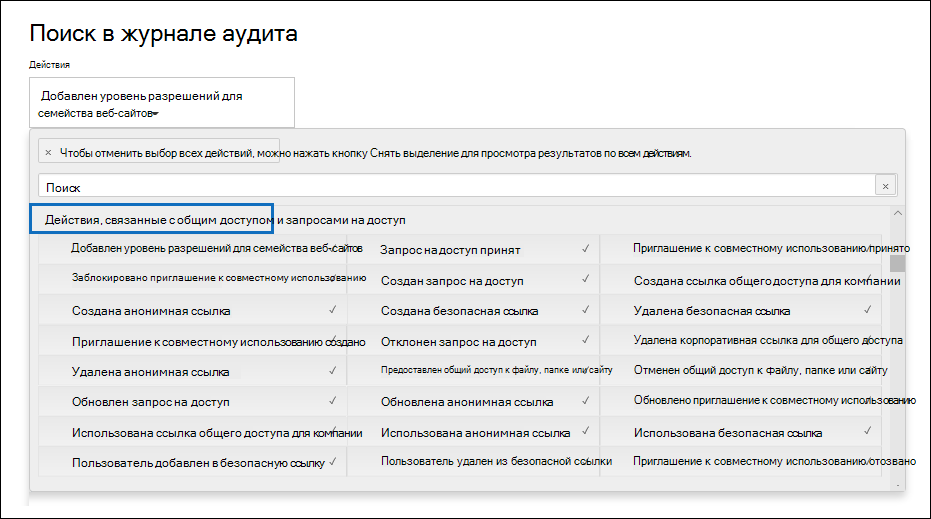

# Использование аудита общего доступа в журнале аудита

Совместное использование — это ключевое действие в SharePoint и OneDrive для бизнеса, и оно широко используется в организациях. Администраторы могут использовать аудит общего доступа в журнале аудита, чтобы определить, как используется общий доступ в организации. 
  
## Схема SharePoint общего доступа

События общего доступа (не включая события, связанные с политикой общего доступа и ссылками общего доступа) отличаются от событий, связанных с файлами и папками, одним основным способом: один пользователь выполняет действие, которое оказывает влияние на другого пользователя. Например, когда ресурс User A предоставляет пользователю B доступ к файлу. В этом примере пользователь A является действующим *пользователем,* а пользователь B — *целевым пользователем.* В схеме SharePoint файла действие действующего пользователя влияет только на сам файл. Когда пользователь A открывает файл, единственной информацией, необходимой в **событии FileAccessed,** является действующий пользователь. Для устранения этой разницы существует отдельная схема, называемая *схемой SharePoint Sharing,* которая фиксирует дополнительные сведения о событиях общего доступа. Это гарантирует, что администраторы будут иметь видимость того, кто поделился ресурсом, а также с пользователем, с которым он был общий. 
  
Схема Общего доступа содержит два дополнительных поля в записи аудита, связанных с событиями общего доступа: 
  
- **TargetUserOrGroupType:** Определяет, является ли целевой пользователь или группа участником, гостем, SharePointGroup, SecurityGroup или партнером.

- **TargetUserOrGroupName:** Сохраняет upN или имя целевого пользователя или группы, с помощью которого был общий ресурс (пользователь B в предыдущем примере). 

Эти два поля, в дополнение к другим свойствам из схемы журнала аудита, таких как  User,  Operation и Date, могут рассказать полную историю о том, какой пользователь поделился каким ресурсом, с кем и *когда*.  
  
Существует еще одно свойство схемы, важное для истории общего доступа. При экспорте результатов поиска журналов аудита столбец **AuditData** в экспортируемом файле CSV хранит сведения о событиях общего доступа. Например, если пользователь делится сайтом с другим пользователем, это достигается путем добавления целевого пользователя в SharePoint группу. Столбец **AuditData** фиксирует эти сведения для обеспечения контекста для администраторов. Инструкции по размыву сведений в столбце **AuditData** см. в статье Шаг [2.](#step-2-use-the-powerquery-editor-to-format-the-exported-audit-log)

## SharePoint обмена событиями

Общий доступ определяется тем,  когда пользователь (действующий пользователь) хочет поделиться ресурсом с другим пользователем (целевым *пользователем).* Записи аудита, связанные с совместной работой ресурса с внешним пользователем (пользователем, который находится за пределами организации и не имеет учетной записи гостей в Azure Active Directory организации), выявляются в следующих событиях, которые регистрируются в журнале аудита:

- **SharingInvitationCreated:** Пользователь в организации попытался поделиться ресурсом (скорее всего, с сайтом) с внешним пользователем. Это приводит к внешнему приглашению общего доступа, отправленного целевому пользователю. На данный момент доступ к ресурсу не предоставляется.

- **SharingInvitationAccepted:** Внешний пользователь принял приглашение на общий доступ, отправленный действующим пользователем, и теперь имеет доступ к ресурсу.

- **AnonymousLinkCreated:** Для ресурса создается анонимная ссылка (также называемая "Любое"). Поскольку можно создать анонимную ссылку и скопировать ее, разумно предположить, что любой документ с анонимной ссылкой был общим для целевого пользователя.

- **AnonymousLinkUsed:** Как следует из названия, это событие регистрируется, когда для доступа к ресурсу используется анонимная ссылка. 

- **SecureLinkCreated:** Пользователь создал "определенную ссылку для людей", чтобы поделиться ресурсом с определенным человеком. Этот целевой пользователь может быть внешним пользователем вашей организации. Лицо, с которого общий ресурс, определено в записи аудита для **события AddedToSecureLink.** Отметки времени для этих двух событий почти идентичны.

- **AddedToSecureLink:** Пользователь был добавлен в определенную ссылку. В этом событии используйте поле **TargetUserOrGroupName** для идентификации пользователя, добавленного в соответствующую ссылку. Этот целевой пользователь может быть внешним пользователем вашей организации.

## Общий рабочий поток аудита
  
Если пользователь (действующий пользователь) хочет поделиться ресурсом с другим пользователем (целевым пользователем), сначала SharePoint (или OneDrive для бизнеса) проверяет, связан ли адрес электронной почты целевого пользователя с учетной записью пользователя в каталоге организации. Если целевой пользователь находится в каталоге (и имеет соответствующую учетную запись гостя), SharePoint делает следующие действия:
  
-  Немедленно назначает целевым пользователям разрешения на доступ к ресурсу, добавляя целевого пользователя в соответствующую группу SharePoint и регистрируется **событие AddedToGroup.** 
    
- Отправляет уведомление о совместном использовании на адрес электронной почты целевого пользователя.
    
- Журналы события **SharingSet.** Это событие имеет дружеское имя "Общий файл, папка или сайт" в разделе **Действия по** обмену и запросу доступа в средствах поиска журналов аудита. См. снимок экрана [в шаге 1](#step-1-search-for-sharing-events-and-export-the-results-to-a-csv-file). 
    
Если учетная запись пользователя для целевого пользователя не в каталоге, SharePoint делает следующее: 
    
   - Регистрируются одно из следующих событий, основанное на совместном доступе к ресурсу:
   
      - **AnonymousLinkCreated**
   
      - **SecureLinkCreated**
   
      - **AddedToSecureLink** 

      - **SharingInvitationCreated** (это событие регистрируется только в том случае, если общий ресурс является сайтом)
    
   - Когда целевой пользователь принимает отправленное им приглашение на общий доступ (щелкнув ссылку в приглашении), SharePoint журнал события **SharingInvitationAccepted** и назначает целевым пользователям разрешения на доступ к ресурсу. Если целевому пользователю отправляется анонимная ссылка, **событие AnonymousLinkUsed** регистрируется после того, как целевой пользователь использует ссылку для доступа к ресурсу. Для безопасных ссылок регистрируется **событие FileAccessed,** когда внешний пользователь использует ссылку для доступа к ресурсу.

Кроме того, регистрируются дополнительные сведения о целевом пользователе, такие как удостоверение пользователя, которому будет приглашение, и о пользователе, который принимает приглашение. В некоторых случаях эти пользователи (или адреса электронной почты) могут быть разными. 

## Определение ресурсов, общих с внешними пользователями

Общим требованием для администраторов является создание списка всех ресурсов, которые были общими для пользователей за пределами организации. С помощью совместного аудита в Office 365 администраторы могут создать этот список. Ниже приведено описание процедуры.
  
### Шаг 1. Поиск общего доступа к событиям и экспорт результатов в CSV-файл

Первый шаг — поиск журнала аудита для обмена событиями. Дополнительные сведения (включая необходимые разрешения) о поиске журнала аудита см. в журнале Search [the audit log in the Security & Compliance Center.](search-the-audit-log-in-security-and-compliance.md)
  
1. Перейдите на сайт <https://compliance.microsoft.com>.

2. Выполните вход с помощью учетной записи вашей организации или учебного заведения.

3. В левой области Центр соответствия требованиям Microsoft 365 нажмите кнопку **Аудит**.

    Откроется страница **Аудит**.

4. В **разделе Действия** **щелкните действия по совместному доступу** и запросу доступа для поиска событий, связанных с обменом. 

    
  
5. Выберите диапазон дат и времени для поиска событий общего доступа, которые произошли в течение этого периода. 

6. Нажмите **кнопку Поиск** для запуска поиска. 

7. После завершения поиска и отображения результатов нажмите кнопку **Экспорт результаты** \> **Скачайте все результаты.**

    После выбора варианта экспорта сообщение в нижней части окна подсказает вам открыть или сохранить CSV-файл.

8. Щелкните  \> **Сохранить сохранение как** и сохранить CSV-файл в папку на локальном компьютере. 

### Шаг 2. Использование редактора PowerQuery для формата экспортируемой журнала аудита

Следующим шагом является использование функции преобразования JSON в редакторе запроса питания в Excel, чтобы разделить каждое свойство в столбце **AuditData** (состоящее из объекта JSON с несколькими свойствами) в свой столбец. Это позволяет фильтровать столбцы для просмотра записей, связанных с обменом

Пошаговые инструкции см. в пункте "Этап 2. Форматирование экспортированного журнала аудита с помощью редактора Power Query" в разделе [Экспорт, настройка и просмотр записей журнала аудита](export-view-audit-log-records.md#step-2-format-the-exported-audit-log-using-the-power-query-editor).

### Шаг 3. Фильтрация CSV-файла для ресурсов, общих с внешними пользователями

Следующий шаг — фильтрация CSV для различных событий, связанных с обменом, которые ранее были описаны в [разделе SharePoint общего доступа.](#sharepoint-sharing-events) Кроме того, можно отфильтровать столбец **TargetUserOrGroupType,** чтобы отобразить все записи, в которых значение этого свойства **является Гостевой.** 

После того как вы следовали инструкциям на предыдущем этапе подготовки CSV-файла с помощью редактора PowerQuery, сделайте следующее:
    
1. Откройте файл Excel, созданный в шаге 2. 

2. На **вкладке Главная** нажмите **кнопку Сортировка & фильтр,** а затем нажмите **фильтр**.
    
3. В списке **сортировки &** фильтрации  в столбце Операции очищают все выборы, затем выберите одно или несколько следующих событий, связанных с обменом, а затем нажмите **кнопку Ок**.
 
   - **SharingInvitationCreated**
   
   - **AnonymousLinkCreated**
   
   - **SecureLinkCreated**
   
   - **AddedToSecureLink** 
    
    Excel отображает строки для выбранных событий.
    
4. Перейдите в столбец **TargetUserOrGroupType** и выберите его. 
    
5. В **списке сортировки & фильтра** очистить все выборы, а затем выберите **TargetUserOrGroupType:Guest** и нажмите **кнопку Ок**.
    
    Теперь Excel отображает строки для обмена событиями и где целевой пользователь находится за пределами организации, так как внешние пользователи определены **значением TargetUserOrGroupType:Guest**. 
  
> [!TIP]
> Для отображаемой записи аудита столбец **ObjectId** определяет ресурс, который был общим с целевым пользователем; например  `ObjectId:https:\/\/contoso-my.sharepoint.com\/personal\/sarad_contoso_com\/Documents\/Southwater Proposal.docx` .
