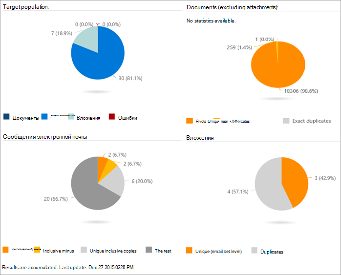

# Просмотр результатов анализа в Advanced eDiscovery (классическая)

> [!NOTE]
> Чтобы можно было использовать Advanced eDiscovery, требуется подписка на Office 365 E3 с надстройкой Advanced Compliance или E5 для организации. Если у вас этого плана нет и вы хотите попробовать Advanced eDiscovery, можете [зарегистрироваться для получения пробной версии Office 365 корпоративный E5](https://go.microsoft.com/fwlink/p/?LinkID=698279). 
  
В Advanced eDiscovery ход выполнения и результаты анализа можно просматривать на различных дисплеях, как описано ниже.
  
## Просмотр состояния задачи "Анализ"

В **состоянии \> задачи "Подготовка анализа \> \> результатов"** состояние отображается во время и после выполнения процесса анализа. 
  

  
Отображаемая задача может отличаться в зависимости от выбранных параметров. 
  
- **ND/ET: setup**: prepares for the run, for example, sets run and case parameters.
    
- **ND/ET: вычисление ND**: обрабатывает практически дубликат анализа файлов.
    
- **ND/ET: вычисление ET**: выполняет анализ потока электронной почты для всего набора электронной почты.
    
- **ND/ET: pivots and similarities**: Performs pivot and file similarity processing.
    
- **ND/ET: обновление метаданных:** завершение новых данных, собранных для файлов в базе данных.
    
- **Темы: вычисление тем**: выполняет анализ тем. (Отображается, только если выбрано.)
    
- **Состояние задачи:** эта строка отображается после завершения задачи. Во время выполнения задач отображается продолжительность выполнения.
    
> [!NOTE]
> Результаты анализа практически дубликатов и потоков электронной почты (ND и ED) применяются к количеству обрабатываемых документов. Он не включает точные дублирующиеся файлы. 
  
## Просмотр почти дубликатов и состояния потоков электронной почты

В **результатах** целевой аудитории отображается количество документов, сообщений электронной почты, вложений и ошибок в целевой аудитории. 
  
В **результатах** "Документы" отображается количество стеков, уникальных почти дубликатов и точные дублирующиеся файлы. 
  
В **результатах "Сообщения** электронной почты" отображается число инклюзивных, включительно минус, уникальных инклюзивных копий, а также остальные сообщения электронной почты. Различные типы результатов электронной почты: 
  
- Инклюзивное: инклюзивное сообщение электронной почты является завершающим узлом в потоке электронной почты и содержит всю предыдущую историю этого потока. В результате проверяющей может безопасно сосредоточиться на инклюзивном сообщении электронной почты без необходимости читать предыдущие сообщения в потоке. 
    
- **Инклюзивное** минус: инклюзивное сообщение электронной почты обозначается как инклюзивное минус, если с родительскими инклюзивными сообщениями связано одно или несколько разных вложений. В этом контексте термин Parent используется для сообщений, расположенных вверх в потоке электронной почты или бесед, включенных в определенное инклюзивное сообщение электронной почты. Проверяющей может использовать инклюзивный знак минус в качестве сигнала о том, что, хотя может не потребоваться просмотр контента инклюзивных родителей электронной почты, может быть полезно просмотреть вложения, связанные с родительскими путями инклюзивного пути. 
    
- **Инклюзивная** копия: инклюзивное сообщение электронной почты обозначается как инклюзивная копия, если это копия другого сообщения, помеченного как инклюзивная или включительно минус. Другими словами, это сообщение имеет ту же тему и текст, что и другое инклюзивное сообщение, и, таким образом, совместно находится в том же узле. Так как сообщения инклюзивной копии содержат одинаковое содержимое, их обычно можно пропустить в процессе проверки. 
    
- **В остальном**: это означает, что электронная почта не содержит уникального содержимого и, следовательно, не подпадет под предыдущие три категории. Эти сообщения электронной почты не требуют проверки. Если сообщение содержит вложение, которое не включено в более позднее инклюзивное сообщение электронной почты, может потребоваться проверка вложения. На это указывает наличие инклюзивного сообщения без электронной почты в потоке.
    
В **результатах** "Вложения" отображается число вложений в соответствии с таким типом, как уникальные и дубликаты. 
  

  
## См. также

[Advanced eDiscovery (классическая версия)](office-365-advanced-ediscovery.md)
  
[Понимание сходства документов](understand-document-similarity-in-advanced-ediscovery.md)
  
[Настройка параметров анализа](set-analyze-options-in-advanced-ediscovery.md)
  
[Настройка игнорирования текста](set-ignore-text-in-advanced-ediscovery.md)
  
[Настройка дополнительных параметров анализа](view-analyze-results-in-advanced-ediscovery.md)

