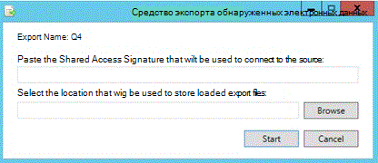

# Просмотр истории пакетов и экспорт прошлых результатов в Advanced eDiscovery (классический)

> [!NOTE]
> Advanced eDiscovery requires an Office 365 E3 with the Advanced Compliance add-on or an E5 subscription for your organization. If you don't have that plan and want to try Advanced eDiscovery, you can [sign up for a trial of Office 365 Enterprise E5](https://go.microsoft.com/fwlink/p/?LinkID=698279). 
  
В следующем разделе описываются дополнительные параметры для пакетного просмотра и экспорта данных в Advanced eDiscovery. 
  
## Просмотр истории пакетов экспорта и экспорт предыдущих пакетов

Диалоговое окно "журнал экспорта" предоставляет подробные сведения о выбранных сеансах пакетных экспортов, а также позволяет отменить последний сеанс.
  
1. В разделе **Экспорт \> программы установки**выберите имя раздела в раскрывающемся списке **Экспорт пакета** . 
    
2. Справа от имени пакета экспорта выберите значок **Журнал пакетов** : 
    
    
  
    Отобразится диалоговое окно "журнал пакетов".
    
    
  
3. Если необходимо откатить предыдущий сеанс, выберите пункт **отменить последний сеанс**. Откат можно выполнить несколько раз, что отменяет последний сеанс.
    
4. Если вы хотите скачать данные в любой момент из ранее выполненного сеанса экспорта, щелкните значок **скачать**  расположенный рядом с нужным экспортируемым пакетом. 
    
5. При отображении диалогового окна **подпись общего доступа** нажмите кнопку **Копировать в буфер обмена** , чтобы скопировать данные сеанса экспорта на локальный компьютер, а затем нажмите кнопку **Закрыть**. &amp;Отображается диалоговое окно **средства экспорта обнаружения электронных** данных для системы безопасности. 
    
    
  
6. В диалоговом окне **средства экспорта обнаружения электронных** данных: 
    
1. В **вставьте подпись общего доступа, которая будет использоваться для подключения к источнику**, **вставьте значение, которое ранее** было скопировано в буфер обмена. 
    
2. Нажмите кнопку **Обзор** , чтобы выбрать целевое расположение для хранения скачанных файлов экспорта на локальном компьютере. 
    
3. Нажмите кнопку **Начало**. Экспортируемые файлы загружаются на локальный компьютер. 
    
## Связанные статьи

[Advanced eDiscovery (классическая версия)](office-365-advanced-ediscovery.md)
  
[Экспорт результатов](export-results-in-advanced-ediscovery.md)

[Экспорт полей отчетов](export-report-fields-in-advanced-ediscovery.md)

