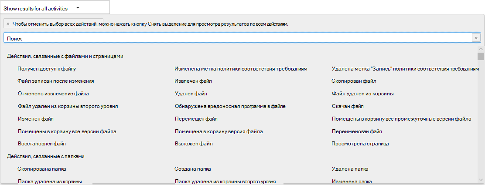

# Просмотр действий аудита хранителя

Нужно узнать, просматривал ли пользователь определенный документ или удалял элемент из своего почтового ящика? Advanced eDiscovery теперь интегрирован с существующим средством поиска в журнале аудита в Центре безопасности & соответствия требованиям. Используя этот встроенный опыт, вы можете использовать средство Advanced eDiscovery Custodian Management для упрощения расследования, легко получать доступ к действию хранителей в вашем деле и искать их в них.

## Получить разрешения

Для поиска журнала аудита вам должна быть назначена роль «Журналы аудита только для просмотра» или «Журналы аудита» в Exchange Online. Эти роли по умолчанию назначены группам ролей "Управление соответствием" и "Управление организацией" на странице Разрешения в Центре администрирования Exchange. Чтобы предоставить пользователю возможность выполнять поиск в журнале аудита Advanced eDiscovery с минимальным уровнем привилегий, можно создать настраиваемую группу ролей в Exchange Online, добавить роль View-Only Audit Logs или Audit Logs, а затем добавить пользователя в качестве члена новой группы ролей. Дополнительные сведения см. в статье Управление группами ролей в Exchange Online.

> [!IMPORTANT]
> Если назначить пользователю роль View-Only журналов аудита или журналов аудита на странице "Разрешения" в Центре безопасности & соответствия требованиям, он не сможет найти журнал аудита. Разрешения должны быть назначены в Exchange Online. Это связано с тем, что для поиска в журнале аудита используется командлет Exchange Online.

## Шаг 1. Поиск действий, выполняемых хранителями, в журнале аудита

1. Перейдите  **в > Advanced eDiscovery** и откройте дело.
  
2. Перейдите на **вкладку "Источники".**
  
3. На странице **Custodians** выберите хранителя в списке и нажмите кнопку **"Просмотреть** действие хранителя" на странице "Войдите".

    Отображается страница поиска действий хранителя. Обратите внимание, что в выпадаемом поле **Custodian** отображается выбранный вами на предыдущем шаге хранителей. В выпадаемом поле можно выбрать разных хранителей, но вы можете искать действия только для одного хранителя за раз.

    
   
4. Настройте указанные ниже условия. 
      
   1. **Действия** — щелкните в выпадаемом списке, чтобы отобразить действия, которые можно найти. После запуска поиска отображаются только записи аудита для выбранных действий. При выборе **"Показать результаты для всех** действий" отображаются результаты для всех действий, выполняемого хранителями, которые соответствуют другим условиям поиска.

      
      
   1. **Дата начала и дата окончания** — выберите диапазон дат и времени, чтобы отобразить события, произошедшие за этот период. Последние семь дней выбраны по умолчанию. Даты и время представлены в формате UTC. Максимальный диапазон дат, который можно указать, составляет один год.
      
   1. **Хранители:** щелкните это поле, а затем выберите определенного хранителя для отображения результатов поиска. Записи аудита для выбранного действия, выполняемого пользователями, выбранными в этом поле, отображаются в списке результатов.
      
5. Щелкните   для запуска поиска с использованием критериев поиска. Результаты поиска загружаются и через несколько секунд отображаются в области результатов на странице поиска "Действия хранителя". 

## Шаг 2. Просмотр результатов поиска в журнале аудита

Результаты поиска в журнале аудита отображаются в области "Результаты" на странице журнала аудита хранителя. Не более 5000 (новых) событий отображаются приращением 150 событий. Чтобы увидеть больше событий, воспользуйтесь полосой прокрутки в области Результаты или нажмите клавиши SHIFT+END для отображения следующих 150 событий.

Результаты содержат следующие сведения о каждом событии, возвращаемом поиском.
- **Дата**. Дата и время наступления события (в формате UTC).

- **IP-адрес**. IP-адрес устройства, которое использовалось при регистрации действия в журнале. IP-адрес отображается в формате адреса IPv4 или IPv6.

- **Пользователь**. Пользователь (или учетная запись службы), который выполнил действие, вызвавшее событие.

- **Действие**. Действие, выполненное пользователем. Это значение соответствует действиям, выбранным в раскрывающемся списке Действия. Для события из журнала аудита действий администратора Exchange значение в этом столбце представляет собой командлет Exchange.

- **Элемент**. Объект, созданный или измененный в результате соответствующего действия. Это может быть, например, просмотренный или измененный файл либо обновленная учетная запись пользователя. Значения в этом столбце отображаются не для всех действий.

- **Подробное:** дополнительные подробности о действии. Опять же, не все действия будут иметь значение.

## Шаг 3. Фильтрация результатов поиска

Помимо сортировки результатов поиска по журналу аудита, их также можно отфильтровать. Это поможет быстро отфильтровать результаты для определенного пользователя или действия. 

Чтобы отфильтровать результаты, выполните указанные ниже действия.

 1. Создайте и запустите поиск в журнале аудита.
  
2. Когда появятся результаты, нажмите кнопку **Показать фильтрацию результатов**.
 
3. Под заголовком каждого столбца приводятся поля ключевых слов.
  
4. Щелкните одно из полей под заголовком столбца и введите слово или фразу в зависимости от столбца, по которому осуществляется фильтрация. Результаты автоматически изменятся в соответствии с условием фильтра.
  
5. Чтобы очистить фильтр, щелкните **X** в поле фильтра или щелкните "Скрыть **фильтрацию".**

## Экспорт результатов поиска в файл

Результаты поиска в журнале аудита можно экспортировать в CSV-файл на локальном компьютере. Вы можете открыть этот файл в Microsoft Excel и использовать такие функции, как поиск, сортировка, фильтрация и разделение одного столбца (содержащем ячейки с несколькими значениями) на несколько столбцов.

1. Выполните поиск по журналу аудита, а затем изменяйте условия поиска, пока не получите нужные результаты.
  
2. Нажмите кнопку Экспорт результатов и выберите один из указанных ниже вариантов.

    - **Сохраните загруженные результаты:** Выберите этот параметр, чтобы экспортировать только те записи, которые отображаются в области **"Результаты"** на странице поиска в журнале **аудита хранителя.** Скачанный CSV-файл содержит те же столбцы (и данные), которые отображаются на странице ("Дата", "Пользователь", "Действие", "Элемент" и "Сведения"). В CSV-файл включен дополнительный столбец **(с** и названием "Дополнительно"), который содержит дополнительные сведения из записи журнала аудита. Так как вы экспортируете результаты, загруженные (и доступные для просмотра) на странице Поиск в журнале аудита, экспортируется не более 5000 записей.
        
    - **Скачайте все результаты:** Выберите этот параметр, чтобы экспортировать все записи из журнала аудита, которые соответствуют условиям поиска. Для большого набора результатов поиска выберите этот параметр, чтобы скачать все записи из журнала аудита в дополнение  к 5000 результатов, которые могут отображаться на странице поиска в журнале аудита хранителя. Этот параметр скачивает необработанные данные из журнала аудита в CSV-файл и содержит дополнительные сведения из записи журнала аудита в столбце AuditData. При выборе этого варианта экспорта скачивание файла может занять больше времени, так как файл может быть гораздо больше скачиваемого при выборе первого варианта.
    
      > [!IMPORTANT]
      > В CSV-файл можно загрузить до 50 000 записей результатов одной операции поиска по журналу аудита. Если в CSV-файл загружено 50 000 записей, можно предположить, что условиям поиска соответствует более 50 000 событий. Чтобы обойти это ограничение и экспортировать больше записей, попробуйте указать диапазон дат, позволяющий сократить количество записей из журнала. Чтобы экспортировать больше 50 000 записей, вы можете выполнить поиск несколько раз со смежными диапазонами дат.
        

3. После выбора варианта экспорта в нижней части окна отображается сообщение с запросом открыть CSV-файл, сохранить его в папке "Загрузки" или сохранить в определенной папке.

Дополнительные сведения о просмотре, фильтрации или экспорте результатов поиска в журнале аудита см. в журнале аудита в Центре безопасности [& соответствия требованиям.](search-the-audit-log-in-security-and-compliance.md)
