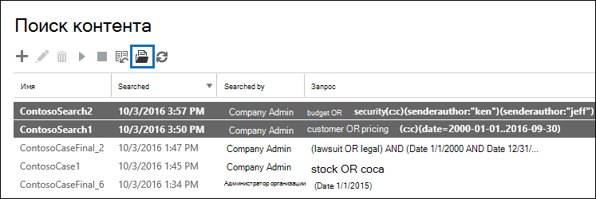
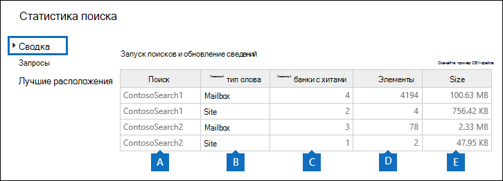
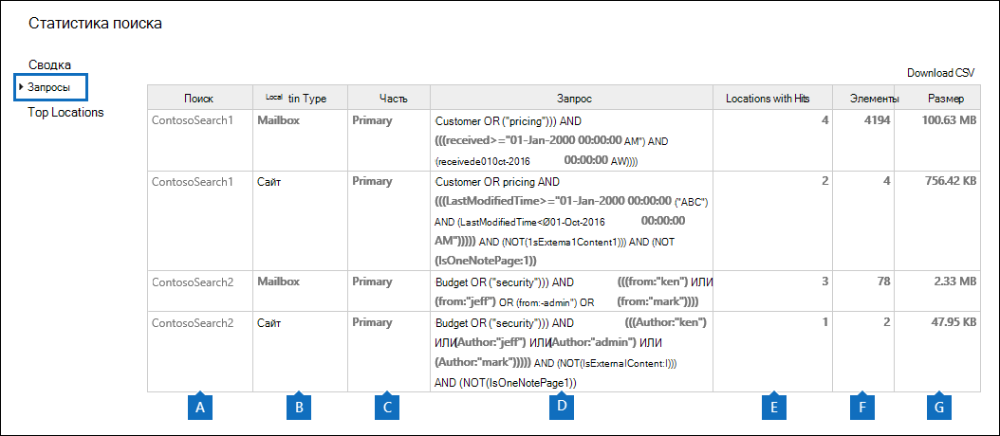

# Просмотр статистики ключевых слов для результатов поиска контентаView keyword statistics for Content Search results

После создания и запуска поиска контента можно просмотреть статистику о предполагаемых результатах поиска.After you create and run a Content Search, you can view statistics about the estimated search results. Это включает сводку результатов поиска (аналогичную сводке о предполагаемых результатах поиска, отображаемой в области сведений), статистику запросов, такую как количество местоположений контента с элементами, которые соответствуют запросу поиска, и имена расположения контента, которые имеют наиболее совпадающие элементы.This includes a summary of the search results (similar to the summary of the estimated search results displayed in the details pane), the query statistics such as the number of content locations with items that match the search query, and the name of content locations that have the most matching items. Вы можете вывести статистику по одному или нескольким поискам контента.You can display statistics for one or more content searches. Это позволяет быстро сравнивать результаты нескольких поисков и принимать решения об эффективности поисковых запросов.This lets you to quickly compare the results for multiple searches and make decisions about the effectiveness of your search queries.
  
Кроме того, вы можете настроить новые и существующие поиски, чтобы вернуть статистику по каждому ключевому слову в запросе поиска.Additionally, you can configure new and existing searches to return statistics for each keyword in a search query. Это позволяет сравнить количество результатов для каждого ключевого слова в запросе и сравнить статистику ключевых слов из нескольких поисковых запросов.This lets you compare the number of results for each keyword in a query and to compare the keyword statistics from multiple searches.
  
Вы также можете скачать статистику по поискам и ключевым словам в виде CSV-файла,You can also download the search statistics and keyword statistics to a CSV file. чтобы сравнить результаты с помощью функций фильтрации и сортировки в Excel или подготовить отчеты.This lets you use the filtering and sorting features in Excel to compare results, and prepare reports for your search results.
  
## Получить статистику поиска контентаGet statistics for Content Searches

Отображение статистики поиска контента:To display statistics for Content searches:
  
1. В центре соответствия требованиям Microsoft 365 перейдите к **демонстрации всех**  >  **поисков контента.**In the Microsoft 365 compliance center, go to **Show all** > **Content search**.

2. В списке поисков выберите два или несколько поисков, а затем щелкните статистику поиска **на** **странице** "Массовые действия".In the list of searches, select two or more searches, and then click **Search statistics** on the **Bulk actions** flyout page.
    
    
  
3. На странице **Статистика поиска** щелкните одну из следующих ссылок, чтобы отобразить статистику выбранных поисков.On the **Search statistics** page, click one of the following links to display statistics about the selected searches. 
    
    **Summary****Summary**
    
    На этой странице отображаются статистические данные, аналогичные тем, которые отображаются в области сведений на странице **поиска контента.**This page displays statistics similar to the ones displayed in the details pane on the **Content search** page. Отображаются статистические данные для всех выбранных поисков.Statistics for all selected searches are displayed. Обратите внимание, что вы также можете повторно выполнить выбранные поиски на этой странице, чтобы обновить статистику.Note that you can also re-run the selected searches from this page to update the statistics. 
    
    
  
    а.a.  Имя поиска контента.The name of the Content Search. Как уже говорилось ранее, вы можете отображать и сравнивать статистику для нескольких поисков.As previously stated, you can display and compare statistics for multiple searches.
    
    б.b. Тип расположения контента, который был в поиске.The type of content location that was searched. Каждая строка отображает статистику для почтовых ящиков, сайтов и общедоступных папок из указанного поиска.Each row displays statistics for mailboxes, sites, and public folders from the specified search.
    
    в.c. Количество местоположений контента, содержащих элементы, которые соответствуют запросу поиска.The number of content locations containing items that match the search query. Для почтовых ящиков эта статистика также включает число архивных почтовых ящиков, содержащих элементы, которые соответствуют запросу поиска.For mailboxes, this statistic also includes the number of archive mailboxes that contain items that match the search query.
    
    г.d. Общее число элементов всех указанных местоположений контента, которые соответствуют запросу поиска.The total number of items of all specified content locations that match the search query. Примеры типов элементов включают сообщения электронной почты, элементы календаря и документы.Examples of item types include email messages, calendar items, and documents. Если элемент содержит несколько экземпляров ключевого слова, которое находится в поиске, он учитывается только один раз в общем количестве элементов.If an item contains multiple instances of a keyword that is being searched for, it's only counted once in the total number of items. Например, если вы ищете слова "stock" или "fraud", а сообщение электронной почты содержит три экземпляра слова "stock", оно учитывается только один раз в столбце **Items.**For example, if you're searching for words "stock" or "fraud" and an email message contains three instances of the word "stock", it's only counted once in the **Items** column. 
    
    д.e. Общий размер всех элементов, найденных в указанном расположении контента, совпадающий с запросом поиска.The total size of all items that were found in the specified content location that match the search query. 
    
    **Queries****Queries**
    
    На этой странице отображаются статистические данные о запросе поиска.This page displays statistics about the search query.
    
    
  
    а.a. Имя поиска контента, для которого строка содержит статистику запросов.The name of the Content Search that the row contains query statistics for.
    
    б.b. Тип расположения контента, к который применима статистика запросов.The type of content location that the query statistics are applicable to.
    
    в.c. В этом столбце указывается, к какой части поискового запроса применима статистика.This column indicates which part of the search query the statistics are applicable to. **Основной** указывает на весь поисковый запрос.**Primary** indicates the entire search query. Если при создании или редактировании поискового запроса используется список ключевых слов, в эту таблицу включаются статистические данные по каждому компоненту запроса.If you use a keyword list when you create or edit a search query, statistics for each component of the query are included in this table. Дополнительные сведения см. в разделе Статистика поиска ключевых слов для раздела [Поиск](#get-keyword-statistics-for-content-searches) контента в этой статье.See the [Get keyword statistics for Content Searches](#get-keyword-statistics-for-content-searches) section in this article for more information. 
    
    г.d. В этом столбце содержится фактический поисковый запрос, запускаемый средством поиска контента.This column contains the actual search query that run by the Content Search tool. Обратите внимание, что средство автоматически добавляет несколько дополнительных компонентов в создающийся запрос.Note that the tool automatically adds a few additional components to the query that you create. 

    - При поиске всего контента в почтовых ящиках (не указав ключевых слов), фактический запрос ключевого слова является таким образом, чтобы все элементы  `size>=0` были возвращены.When you search for all content in mailboxes (by not specifying any keywords), the actual key word query is  `size>=0` so that all items are returned. 
    
     - При поиске сайтов SharePoint Online и OneDrive для бизнеса добавляются два следующих компонента:When you search SharePoint Online and OneDrive for Business sites, the two following components are added:
    
          **NOT IsExternalContent:1** — исключает контент из локальной организации SharePoint.**NOT IsExternalContent:1** - Excludes any content from an on-premises SharePoint organization. 
    
          **NOT IsOneNotePage:1** — исключает все файлы OneNote, так как они будут дублировать любой документ, соответствующий запросу поиска.**NOT IsOneNotePage:1** - Excludes all OneNote files because these would be duplicates of any document that matches the search query. 

    
    д.e. Количество расположений контента (указанных в столбце \*\* Тип расположения \*\*), содержащих элементы, которые соответствуют запросу поиска, указанному в столбце **Запрос.**The number of the content locations (specified by the \*\* Location type \*\* column) that contain items that match the search query listed in the **Query** column. 
    
    е.f. Количество элементов (из указанного расположения контента), которые соответствуют запросу поиска, указанному в **столбце Запрос.**The number of items (from the specified content location) that match the search query listed in the **Query** column. Как было объяснено ранее, если элемент содержит несколько экземпляров ключевого слова, которое ведется поиск, он учитывается только один раз в этом столбце.As previously explained, if an item contains multiple instances of a keyword that is being searched for, it's only counted once in the this column. 
    
    ж.g. Общий размер всех найденных элементов (в указанном расположении контента), которые соответствуют запросу поиска в **столбце Запрос.**The total size of all items that were found (in the specified content location) that match the search query in the **Query** column. 
    
    **Верхние расположения****Top locations**
    
    На этой странице отображаются статистические данные о количестве элементов, которые соответствуют запросу поиска в каждом расположении контента, которое было в поиске.This page displays statistics about the number of items that match the search query in each content location that was searched. Выводится первая 1000 расположений.The top 1,000 locations are displayed. При просмотре статистики для нескольких поисков отображаются 1000 расположения для каждого поиска.If you view statistics for multiple searches, the top 1,000 locations for each search are displayed. Обратите внимание, что расположение контента не включено на этой странице, если оно не содержит элементов, которые соответствуют запросу поиска.Note that a content location isn't included on this page if it doesn't contain any items that match the search query.
    
    
  
    а.a. Имя расположения контента.The name of the content location.
    
    б.b. Тип расположения контента, к который применима статистика расположения.The type of content location that the location statistics are applicable to.
    
    в.c. Для каждого поиска есть столбцы, для которых отображается статистика.There are columns for each search that you're displaying statistics for. В этом столбце показано количество (и общий размер) элементов, которые соответствуют запросу поиска в каждом расположении контента.This column shows the number (and total size) of items that match the search query in each content location. Обратите внимание, что при отображение статистики для нескольких поисков в этом столбце "NA" указывается, что расположение контента не было включено в этот поиск.Note that when you're displaying statistics for multiple searches, the "NA" in this column indicates that the content location wasn't included in that search. 

## Получить статистику ключевых слов для поиска контентаGet keyword statistics for Content Searches

Как было объяснено ранее, на странице **Запросы** показаны запрос поиска и число (и размер) элементов, которые соответствуют запросу.As previous explained, the **Queries** page shows the search query and the number (and size) of items that match the query. Если при создании или редактировании поискового запроса используется список ключевых слов, можно получить расширенную статистику, которая показывает, сколько элементов соответствует каждому ключевому слову или ключевому слову.If you use a keyword list when you create or edit a search query, you can get enhanced statistics that show how many items match each keyword or keyword phrase. Это поможет быстро определить, какие части запроса являются наиболее (и наименее) эффективными.This can help you quickly identify which parts of the query are the most (and least) effective. Например, если ключевое слово возвращает большое количество элементов, можно уточнить запрос ключевого слова, чтобы сузить результаты поиска.For example, if a keyword returns a large number of items, you might choose to refine the keyword query to narrow the search results. Список ключевых слов можно настроить при создании или редактировании поиска контента.You can set up a keyword list when you create or edit a Content Search. 

Чтобы создать список ключевых слов и просмотреть статистику ключевых слов для поиска контента:To create a keyword list and view keyword statistics for a Content Search:
  
1. В центре соответствия требованиям Microsoft 365 перейдите к **демонстрации всех**  >  **поисков контента.**In the Microsoft 365 compliance center, go to **Show all** > **Content search**.
    
2. В списке поиска контента нажмите кнопку и поиск, а затем нажмите **кнопку Изменить значок Изменить**  .In the list of content searches, click and a search, and then click **Edit** .
    
3. Щелкните **Запрос,** а затем делайте следующие вещи:Click **Query** and then do the following things: 
    
    
  
    а.a. Щелкните **поле список ключевых слов Show.**Click the **Show keyword list** check box. 
    
    б.b. Введите ключевое слово или этап ключевого слова в строке в таблице ключевых слов.Type a keyword or keyword phase in a row in the keywords table. Например, введите **бюджет** в первом ряду, а затем **введите** безопасность во втором ряду.For example, type **budget** in the first row and then type **security** in the second row. 
    
4. После добавления ключевых слов, для поиска и получения статистики нажмите **кнопку Поиск** для запуска пересмотренного поиска.After adding the keywords that you want to search and get statistics for, click **Search** to run the revised search. 
    
5. После завершения поиска выберите его в списке поисков и нажмите кнопку **Статистика**  поиска.When the search is completed, select it in the list of searches, and then click **Search statistics** . Вы также можете отображать и сравнивать статистику ключевых слов для нескольких поисков.You can also display and compare keyword statistics for multiple searches.
    
6. На странице **Статистика** поиска щелкните **Запрос,** чтобы отобразить статистику ключевых слов для выбранных поисков.On the **Search statistics** page, click **Query** to display the keyword statistics for the selected searches. 
    
    
  
    Как показано на предыдущем скриншоте, отображаются статистические данные по каждому ключевому слову; это включает в себя:As shown in the previous screenshot, the statistics for each keyword are displayed; this includes: 
    
    - Статистика ключевых слов для каждого типа расположения контента, включенного в поиск.The keyword statistics for each type of content location included in the search.
    
    - Фактический поисковый запрос для каждого ключевого слова, который включает все условия из поискового запроса.The actual search query for each keyword, which includes any conditions from the search query. 
    
    - Полный запрос поиска (определен как **Основной** в столбце **Часть)** и статистика для полного запроса.The complete search query (identified as **Primary** in the **Part** column) and the statistics for the complete query. Обратите внимание, что это те же статистические данные, которые отображаются на странице **Сводка.**Note these are the same statistics displayed on the **Summary** page. 

> [!NOTE]
> Чтобы уменьшить проблемы, вызванные большими списками ключевых слов, теперь в списке ключевых слов поискового запроса ограничено не более 20 строк.To help reduce issues caused by large keyword lists, you're now limited to a maximum of 20 rows in the keyword list of a search query.
