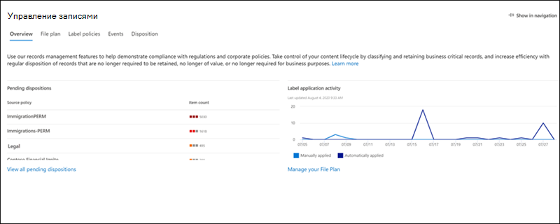

# Новые возможности центра соответствия требованиям Microsoft 365What's new in the Microsoft 365 compliance center

Мы постоянно добавляем новые функции в [центр соответствия требованиям Microsoft 365](microsoft-365-compliance-center.md), устранять проблемы, которые мы будем изучать, и вносить изменения в соответствии с вашими отзывами.We're continuously adding new features to the [Microsoft 365 compliance center](microsoft-365-compliance-center.md), fixing issues we learn about, and making changes based on your feedback. Ознакомьтесь со статьей ниже, чтобы узнать, что сейчас доступно.Take a look below to see what's available for you today. Некоторые функции получаются на разных скоростях для наших клиентов.Some features get rolled out at different speeds to our customers. Если вы еще не видите компонент, попробуйте добавить себя в [целевой выпуск](https://docs.microsoft.com/office365/admin/manage/release-options-in-office-365).If you aren't seeing a feature yet, try adding yourself to [targeted release](https://docs.microsoft.com/office365/admin/manage/release-options-in-office-365).

> [!TIP]
> Хотите узнать, что происходит в других центрах администрирования?Interested in what's going on in other admin centers? Ознакомьтесь со следующими статьями:Check out these articles: [Новые возможности центра администрирования Microsoft 365What's new in the Microsoft 365 admin center](https://docs.microsoft.com/office365/admin/whats-new-in-preview?view=o365-worldwide) [Новые возможности в центре администрирования SharePointWhat's new in the SharePoint admin center](https://docs.microsoft.com/sharepoint/what-s-new-in-admin-center)  
И посетите [план microsoft 365](https://www.microsoft.com/en-us/microsoft-365/roadmap) , чтобы узнать о возможностях Microsoft 365, которые были запущены, выходят из развертывания, были отменены или выпущены ранее.And visit the [Microsoft 365 Roadmap](https://www.microsoft.com/en-us/microsoft-365/roadmap) to learn about Microsoft 365 features that were launched, are rolling out, are in development, have been cancelled, or previously released.

## Февраль 2020 г.February 2020

### Предварительная версия управления рисками выпущена официальноInsider risk management is officially released

Барабан барабана,...Drum roll, please... Управление рисками для предварительной оценки теперь доступно для организаций со следующими подписками:Insider risk management is now available to organizations with the following subscriptions:

- [Microsoft 365](https://go.microsoft.com/fwlink/?linkid=2120431) (платная или пробная)[Microsoft 365 E5](https://go.microsoft.com/fwlink/?linkid=2120431) (paid or trial)
- Подписка на Microsoft 365 корпоративный E3 с [надстройкой Microsoft "соответствие требованиям](https://go.microsoft.com/fwlink/?linkid=2120432) "Microsoft 365 Enterprise E3 subscription with the [Microsoft E5 Compliance add-on](https://go.microsoft.com/fwlink/?linkid=2120432)

Мы внесли некоторые улучшения, начиная с ознакомительного выпуска, в том числе [новые группы ролей](insider-risk-management-configure.md#step-1-required-enable-permissions-for-insider-risk-management) и [Параметры на уровне решения](insider-risk-management-configure.md#step-4-required-configure-insider-risk-settings).Heads up that we made some improvements since the preview release, including [new role groups](insider-risk-management-configure.md#step-1-required-enable-permissions-for-insider-risk-management) and [solution-wide settings](insider-risk-management-configure.md#step-4-required-configure-insider-risk-settings).

Как всегда, оставьте свой отзыв при использовании решения, чтобы мы могли продолжить вносить улучшения.As always, please leave feedback as you use the solution so we can continue to make improvements.

### Управление записямиRecords management

Это новое решение предоставляет все возможности управления записями с одним символом "тег".This new solution brings all the records management capabilities under a single umbrella. Основные сведения включают введение записей управления версиями для SharePoint и OneDrive, а также подтверждение выбытия для записей.Highlights include the introduction of records versioning for SharePoint and OneDrive and proof of disposal for records.

[Дополнительные сведения об управлении записямиLearn more about records management](records-management.md)

### Интересное решение: соединители данных для Facebook и TwitterSolution spotlight: Data connectors for Facebook and Twitter

Соединители данных, [выпущенные в прошлом месяце](#just-launched) , и мы ищем помощь по тестированию следующих соединителей.Data connectors [released last month](#just-launched) and we're looking for your help in testing out the following connectors.

- [Бизнес-страницы Facebook](archive-facebook-data-with-sample-connector.md).[Facebook business pages](archive-facebook-data-with-sample-connector.md). Импорт и архивирование данных из бизнес-страниц Facebook в Microsoft 365.Imports and archives data from Facebook business pages to Microsoft 365. Преимущества для решений по обеспечению соответствия, таких как управление записями и обнаружение электронных данных.Beneficial for compliance solutions such as records management and eDiscovery.
- [Twitter](archive-twitter-data-with-sample-connector.md).[Twitter](archive-twitter-data-with-sample-connector.md). Импорт и архивирование данных из Twitter в Microsoft 365.Imports and archives data from Twitter to Microsoft 365. Преимущества для решений по обеспечению соответствия, таких как управление записями и обнаружение электронных данных.Beneficial for compliance solutions such as records management and eDiscovery.

После настройки и проверки этих соединителей оставьте отзыв о том, что было хорошо, что не так, и что мы можем сделать для усовершенствования взаимодействия.As you set up and validate these connectors, please leave us feedback about what went well, what didn't, and what we can do to improve the experience.

## Январь 2020 г.January 2020

Ожидание отменяется.The wait is over. Мы рады сообщить, что центр соответствия требованиям Microsoft 365 доступен всем клиентам с помощью Microsoft 365, Office 365, Enterprise Mobility + Security (EMS) и Windows 10 корпоративным планам.We're pleased to announce that the Microsoft 365 compliance center is available to all customers with Microsoft 365, Office 365, Enterprise Mobility + Security (EMS), and Windows 10 Enterprise plans. Любые данные или политики, которые вы управляли в центре безопасности & соответствия требованиям Office 365, доступны в центре соответствия требованиям, поэтому нет необходимости выполнять переход назад и вперед.Any data or policies you were managing in the Office 365 Security & Compliance Center are available in the compliance center, so no need to jump back and forth.

> [!TIP]
> Еще раз прочтите статью "обновление за прошлый месяц" на некоторых [новых решениях](#new-compliance-solutions) , которые мы недавно пропустили, а также в статье [схема](#updated-compliance-solutions) , в которой показано, как можно просмотреть функции соответствия требованиям из центра безопасности Office 365 & соответствия требованиям в Microsoft 365.Read through last month's update again for a refresher on some of the [new solutions](#new-compliance-solutions) we previewed recently, as well as a [roadmap](#updated-compliance-solutions) showing where compliance features from the Office 365 Security & Compliance Center now live in Microsoft 365.

Закладка и заголовков [https://compliance.microsoft.com](https://compliance.microsoft.com) , которые необходимо прообзорируют один и тот же процесс управления соответствием в вашей организации... или [Ознакомьтесь со статьей](microsoft-365-compliance-center.md) , чтобы узнать больше.Bookmark and head over now to [https://compliance.microsoft.com](https://compliance.microsoft.com) to tour your one-stop-shop for managing compliance across your org...or [read this article](microsoft-365-compliance-center.md) to dig in a bit more.

В этом месяце также были выпущены новые и обновленные решения.We also released new and updated solutions this month. Вот краткий взгляд на основные темы.Here's a quick glance at the highlights.

### Теперь в предварительной версииNow in preview

**Предварительное управление рисками (ознакомительная версия)****Insider risk management (preview)**

Мы рады сообщить о том, что наше решение по управлению рисками для бета-версии теперь в общедоступной предварительной версии.We're happy to announce that our insider risk management solution is now in public preview. По сути, управление рисками для предварительной оценки помогает вашей организации выполнить интеллектуальную идентификацию и выполнение действий, предоставляя:In a nutshell, insider risk management helps your organization intelligently identify and take action on insider risks by providing:

- Элементы управления анонимности помогают обеспечить конфиденциальность пользователей.Anonymity controls to help ensure user privacy.
- Интеллектуальные шаблоны политик со встроенными и сторонними индикаторами, которые идентифицируют угрозы для предварительной оценки, такие как утечки данных.Intelligent policy templates with native and third-party indicators that identify insider threats, such as data leaks.
- Интегрированные комплексные рабочие процессы расследования, которые охватывают ИТ-отдел, Отдел кадров и юридические команды.Integrated end-to-end investigation workflows that span across IT, HR and legal teams.

Мы будем рады узнать ваше мнение.We'd love to hear what you think. Когда вы используете решение, оставьте нам отзыв о том, чтобы мы могли убедиться в том, что мы собираемся придуматься к общему доступу.As you use the solution, leave us feedback so we can make sure we're meeting your needs as we head toward general availability.

[Дополнительные сведения об управлении рисками для участниковLearn more about insider risk management](insider-risk-management.md)

### Только что запущеноJust launched

**Соответствие коммуникаций требованиям****Communication compliance**

При переходе с этапа предварительной версии к полному уровню доступности обеспечение соответствия требованиям является важнейшим компонентом нового набора решений для оценки.Graduating from the preview phase to full availability, communication compliance is a key component of our new insider risk solution set. Это надежное решение позволяет свести к минимуму риски, связанные с обменом данными, используя рабочие процессы для обнаружения, исследования и принятия действий по исправлению сообщений, которые не удовлетворяют стандартам вашей организации.This robust solution helps minimize communication risks using workflows for detecting, investigating, and taking remediation actions for messages that don't meet your organization's standards.

Отзывы пользователей во время предварительного просмотра были.Customer feedback during the preview was fantastic. Она привела к нескольким усовершенствованиям, в том числе при первом запуске, а также в том, что необходимо для начала исследования и исправления, а также для получения дополнительных действий.It resulted in several enhancements, including a first-run experience to get you started, improvements to investigation and remediation actions, and more.

[Дополнительные сведения о совместимости связиLearn more about communication compliance](communication-compliance.md)

**Соединители данных****Data connectors**

Ранее при совместном использовании пространства с другими функциями импорта в центре безопасности & соответствия требованиям Office 365 соединители данных теперь имеют свои домашние домены в центре соответствия требованиям Microsoft 365.Formerly sharing space with other 'Import' features in the Office 365 Security & Compliance Center, data connectors now have their very own home in the Microsoft 365 compliance center. Используйте новую страницу "соединители данных" для импорта и архивирования данных из файлов отдела кадров Организации (HR) и различных платформ сторонних производителей (например, Facebook, LinkedIn, Twitter и Instant Bloomberg) в почтовые ящики в организации Microsoft 365.Use the new 'Data connectors' page to import and archive data from your organization's human resources (HR) files and various third-party platforms (like Facebook, LinkedIn, Twitter, and Instant Bloomberg) to mailboxes in your Microsoft 365 organization. После импорта эти данные можно управлять в нескольких решениях, в том числе на обнаружение электронных данных, управление рисками для оценки, соответствие требованиям, аудит, политики хранения и многое другое.Once imported, this data can be managed in several compliance solutions, including eDiscovery, insider risk management, communication compliance, audit, retention policies, and more.

[Дополнительные сведения о соединителях данныхLearn more about data connectors](archiving-third-party-data.md)

### Полезные обновленияNoteworthy updates

**Новые шаблоны оценки для оценки соответствия требованиям (Предварительная версия)****New assessment templates for Compliance Score (preview)**

Всегда очень сложно, чтобы вы выходили заранее развивающуюся структуру соответствия требованиям, Группа оценки соответствия требованиям представила новый набор шаблонов, которые помогут оценить соответствие вашей организации требованиям к последним нормативным требованиям и получить рекомендации по их внедрению. более эффективные элементы управления.Always working hard to help you get ahead of the ever-evolving compliance landscape, our Compliance Score team shipped a new set of templates to help you assess your organization's compliance posture against recent regulations and get guidance on how to implement more effective controls. Вы увидите новые шаблоны для:You'll see new templates for:

- ISO/IEC 27701:2019ISO/IEC 27701:2019
- Закон Калифорнии о конфиденциальности данных California Consumer Privacy Act (CCPA)California Consumer Privacy Act (CCPA)
- Общий закон по защите данных в Бразилии (леи Geral de Протеçãо de Дадос-ЛГПД)Brazil General Data Protection Law (Lei Geral de Proteção de Dados - LGPD)
- SOC 1 Type 2 и SOC 2 Type 2SOC 1 Type 2 and SOC 2 Type 2

[Дополнительные сведения о шаблонах оценки соответствия требованиямLearn more about Compliance Score templates](compliance-score.md#templates)

## Ноябрь & 2019 декабряNovember & December 2019

Над праздниками мы начали выработить все замечательные решения для обеспечения соответствия требованиям, которые были демоны, в Ignite.Over the holidays, we started rolling out all the great compliance solutions that were demo'd at Ignite. Большинство из них находятся в состоянии предварительной версии, поэтому протестируйте их и не забудьте сообщить, что вы думаете, открыв карточку обратной связи в правом нижнем углу центра соответствия требованиям.Most are in a preview state, so test them out and be sure to let us know what you think by opening the Feedback card at the bottom right of the compliance center.

### Знакомство с новым окружениемGet to know the new neighborhood

Новый центр соответствия требованиям Microsoft 365 включает в себя новые решения, а также возможности соответствия, которые вы знаете и которые вам нравятся в центре безопасности Office 365 & соответствия требованиям.The new Microsoft 365 compliance center includes brand new solutions as well as the compliance features you know and love from the Office 365 Security & Compliance Center. Давайте немного подробнее...Let's dig in a bit more…

#### Новые решения для обеспечения соответствия требованиямNew compliance solutions

Возможно, вы захотите узнать, что такое *решение* .You might be wondering what a *solution* is. По мере того, как облако работает по принципу работы бизнеса, он также открывает дверцу для новых методов кражи данных, мошенничества и необходимости новых нормативных требований.As much as the cloud has revolutionized the way business is done, it's also opened the door for new methods of data theft and fraud and necessitated new regulations. Наши решения по обеспечению соответствия — это наборы интегрированных возможностей, которые помогут вам управлять этими требованиями к соответствиям.Our compliance solutions are collections of integrated capabilities that can help you help you manage these evolving compliance requirements. Возможности решения могут включать в себя сочетание политик, оповещений, отчетов и т. д.A solution's capabilities might include a combination of policies, alerts, reports, and more.

Вот краткий обзор новых решений, которые вы найдете.Here's a summary of the new solutions you'll find. Следите за тем, чтобы другие пользователи вскоре появятся.Keep an eye out for others coming soon.

> [!NOTE]
> Эти решения находятся только в центре соответствия требованиям Microsoft 365.These solutions are located only in the Microsoft 365 compliance center. Они не могут управляться в центре & безопасности Office 365.They can't be managed in the Office 365 Security & Compliance Center.
 

|**Новое решение****New solution**|**Описание****Description**|**Подробнее****Learn more**|
|:-----|:-----|:-----|
|Оценка соответствия требованиям Майкрософт (Предварительная версия)Microsoft Compliance Score (preview)  |Оценка соответствия требованиям — это самостоятельная функция, которая позволяет понять и повысить степень соответствия требованиям Организации, используя встроенный [Диспетчер соответствия](compliance-manager-overview.md)требованиям.Built from [Compliance Manager](compliance-manager-overview.md), Compliance Score is a standalone feature with a simpler, more user-friendly design that helps you understand and improve your organization's compliance posture. Он вычисляет оценку, основанную на рисках, для выполнения действий, которые помогают уменьшить риски, связанные с защитой данных и нормативными стандартами.It calculates a risk-based score measuring your progress in completing actions that help reduce risks around data protection and regulatory standards.  |[Обзор оценки соответствия требованиям Майкрософт (Предварительная версия)Overview of Microsoft Compliance Score (preview)](compliance-score.md)|
|Каталог решений (Предварительная версия)Solution catalog (preview)  |Каталог решений это один-Stop-магазин для обнаружения, изучения и быстрого начала работы с нашими решениями по обеспечению соответствия требованиям и управлению рисками.The solution catalog is your one-stop-shop for discovering, learning about, and quickly getting started with our compliance and risk management solutions. Каталог состоит из трех категорий соответствия, каждый из которых содержит сведения о решениях, составляющих эту категорию.The catalog is organized into three compliance categories, each containing details about the solutions that make up that category. Категории включают в себя защиту информации & управления, управление рисками для оценки и & ответ на обнаружениеCategories include Information protection & governance, Insider risk management, and Discovery & response  |[Обзор каталога решений (Предварительная версия)Overview of the solution catalog (preview)](microsoft-365-solution-catalog.md)|
|Соответствие требованиям (Предварительная версия)Communication compliance (preview)  |Соответствие требованиям является частью новой категории управления рисками, которая помогает минимизировать риски при общении, помогая обнаруживать, записывать и устранять действия по исправлению неуместных сообщений в Организации.Communication compliance is part of the new insider risk management category that helps minimize communication risks by helping you detect, capture, and take remediation actions for inappropriate messages in your organization. Решение расширяет возможности политик контроля в Office 365, предвводя несколько новых усовершенствований, таких как интеллектуальные шаблоны, гибкие рабочие процессы исправления и подробные сведения о действиях.The solution extends the capabilities of supervision policies in Office 365 by introducing several new enhancements such as intelligent templates, flexible remediation workflows, and actionable insights.  |[Соответствие требованиям в Microsoft 365 (Предварительная версия)Communication compliance in Microsoft 365 (preview)](communication-compliance.md)|
|Классификация данных (Предварительная версия)Data classification (preview)  |На новой странице классификация данных содержатся эффективные аналитические сведения и средства, которые помогут вам обнаружить и оценить использование конфиденциальных сведений и меток (хранение и чувствительность) в рамках всей Организации.Our new Data classification page contains powerful insights and tools to help you discover and evaluate how sensitive info and labels (retention and sensitivity) are being used in content across your organization. Просмотрите контент, который содержит конфиденциальную информацию или имеет примененные метки, просмотрите действия с метками в расположениях Microsoft 365, создайте собственные типы конфиденциальных сведений и многое другое.Review content that contains sensitive info or has labels applied, explore label activity across Microsoft 365 locations, create custom sensitive info types, and much more. |[Общие сведения о классификации данных (предварительная версия)Data classification overview (preview)](data-classification-overview.md)|
|Выученные классификаторы (Предварительная версия)Trainable classifiers (preview)  |Это мощное новое средство использует наше средство машинного обучения для определения категорий контента в Организации, таких как нормативные документы или соглашения о сотрудниках.This powerful new tool uses our machine learning engine to help identify categories of content in your org, like regulatory docs or employee agreements. После создания классификаторы можно использовать в нескольких решениях по обеспечению соответствия требованиям для обнаружения связанного контента и его классификации, защиты, сохранения и многого другого.Once created, classifiers can be used in several compliance solutions to detect related content and classify it, protect it, retain it, and more. |[Начало работы с обучаемыми классификаторами (предварительная версия)Getting started with trainable classifiers (preview)](classifier-getting-started-with.md)|

#### Обновленные решения для обеспечения соответствия требованиямUpdated compliance solutions

Если вы используете Центр безопасности Office 365 & соответствия требованиям, вам может потребоваться, чтобы некоторые функции стали доступны в новом центре соответствия требованиям Microsoft 365.If you've been using the Office 365 Security & Compliance Center for your compliance needs, you might wonder where some features now live in the new Microsoft 365 compliance center. Вот краткий план для помощи в поиске новых домов.Here's a quick roadmap to help find their new homes.

> [!NOTE]
> Некоторые функции по-прежнему доступны только в центре безопасности & соответствия требованиям Office 365 — они указаны ниже.Some features are still available only in the Office 365 Security & Compliance Center – these are noted below. Но мы работаем над предварительным просмотром этих данных в центре соответствия требованиям Microsoft 365, поэтому оставайтесь в курсе обновлений.But we're working hard to preview these in the Microsoft 365 compliance center, so stay tuned for updates. 
 

|**Функция****Feature**|**Центр безопасности и соответствия требованиям Office 365****Office 365 Security & Compliance Center**|**Центр соответствия требованиям Microsoft 365****Microsoft 365 compliance center**|**Подробнее****Learn more**|
|:-----|:-----|:-----|:-----|
|Advanced eDiscoveryAdvanced eDiscovery|Обнаружение электронных данных > Advanced eDiscoveryeDiscovery > Advanced eDiscovery   https://protection.office.com/advancedediscoverycases |Расширенный > обнаружения электронных данныхeDiscovery > Advanced   https://compliance.microsoft.com/advancedediscovery | [Обзор расширенного решения обнаружения электронных данных в Microsoft 365Overview of the Advanced eDiscovery solution in Microsoft 365](overview-ediscovery-20.md) |
|Политики оповещенийAlert policies|Оповещения > политик оповещенийAlerts > Alert policies   https://protection.office.com/alertpolicies |В настоящее время политики оповещения управляются только в центре безопасности Office 365 & соответствия требованиям.At this time, alert policies are managed only in the Office 365 Security & Compliance Center. |[Политики оповещений в центре безопасности и соответствия требованиямAlert policies in the security and compliance center](alert-policies.md) |
|ОповещенияAlerts|Оповещения > Просмотр оповещенийAlerts > View alerts   https://protection.office.com/viewalerts |ОповещенияAlerts   https://compliance.microsoft.com/compliancealerts |[Просмотр оповещенийViewing alerts](alert-policies.md#viewing-alerts)|
|АрхивArchive|Архив > управления сведениямиInformation governance > Archive   https://protection.office.com/archiving |Вкладка > "Управление сведениями"Information governance > Archive tab   https://compliance.microsoft.com/informationgovernance?viewid=archive |[Включение архивных почтовых ящиковEnable archive mailboxes](enable-archive-mailboxes.md)|
|Поиск в журнале аудитаAudit log search|Поиск > поиска в журнале аудитаSearch > Audit log search   https://protection.office.com/unifiedauditlog |ВключитьAudit   https://compliance.microsoft.com/auditlogsearch | [Поиск в журнале аудита в центре безопасности & соответствия требованиямSearch the audit log in the Security & Compliance Center](search-the-audit-log-in-security-and-compliance.md)|
|Поиск контентаContent search|Поиск контента > поиск контентаSearch > Content search   https://protection.office.com/contentsearchbeta?ContentOnly=1 | Поиск контентаContent search   https://compliance.microsoft.com/contentsearch |[Поиск содержимого в Office 365Search for content in Office 365](search-for-content.md) |
|Соединители данныхData connectors|Управление сведениями > архивы сторонних данныхInformation governance > Archive third-party data   https://protection.office.com/nativeconnector | Соединители данныхData connectors   https://compliance.microsoft.com/connectorlanding |[Архивация сторонних данныхArchive third-party data](archiving-third-party-data.md)|
|Защита от потери данныхData loss prevention|Защита от потери данныхData loss prevention   https://protection.office.com/datalossprevention |Защита от потери данныхData loss prevention   https://compliance.microsoft.com/datalossprevention |[Общие сведения о защите от потери данныхOverview of data loss prevention](data-loss-prevention-policies.md)|
|Запросы субъектов данныхData subject requests |Конфиденциальность данных > запросов субъектов данныхData privacy > Data subject requests   https://protection.office.com/dsrcases |Запросы субъектов данныхData subject requests   https://compliance.microsoft.com/datasubjectrequest |[Управление запросами субъектов данных GDPR с помощью средства DSR CaseManage GDPR data subject requests with the DSR case tool](manage-gdpr-data-subject-requests-with-the-dsr-case-tool.md)|
|Обнаружение электронных данныхeDiscovery|Обнаружение электронных данных > обнаружения электронных данныхeDiscovery > eDiscovery   https://protection.office.com/ediscoveryv1 |Ядро > обнаружения электронных данныхeDiscovery > Core   https://compliance.microsoft.com/classicediscovery |[Управление делами по обнаружению электронных данныхManage eDiscovery cases](ediscovery-cases.md) |
|СобытияEvents|События > управления записямиRecords management > Events   https://protection.office.com/events |Вкладка "события управления записями >"Records management > Events tab   https://compliance.microsoft.com/recordsmanagement?viewid=events |[Общие сведения о хранении, зависящем от возникновения событияOverview of event-driven retention](event-driven-retention.md)|
|План храненияFile plan|Управление записями > плане файловRecords management > File plan   https://protection.office.com/fileplan |> "Управление записями" на вкладке "план файлов"Records management > File plan tab   https://compliance.microsoft.com/recordsmanagement?viewid=fileplan |[Общие сведения о диспетчере плана храненияOverview of file plan manager](file-plan-manager.md)|
|Импорт PST-файловImport PST files|Управление сведениями > Импорт PST-файловInformation governance > Import PST files   https://protection.office.com/importV2 |Вкладка "Управление сведениями >"Information governance > Import tab   https://compliance.microsoft.com/informationgovernance?viewid=import |[Общие сведения об импорте PST-файлов ОрганизацииOverview of importing your organization's PST files](importing-pst-files-to-office-365.md)|
|Обозреватель действий с меткамиLabel activity explorer|> "Управление сведениями" Обозреватель действий метокInformation governance > Label activity explorer   https://protection.office.com/labelexplorer |Вкладка "> классификации данных" обозревателя действийData classification > Activity explorer tab   https://compliance.microsoft.com/dataclassification?viewid=activitiesexplorer |[Просмотр действий над содержимым с метками (предварительная версия)View activity on your labeled content (preview)](data-classification-activity-explorer.md)|
|Метки хранения и политики метокRetention labels and label policies |Классификация > метки хранения > метки и политики метокClassification > Retention labels > Labels and Label policies tabs   https://protection.office.com/retentionlabels |Вкладки "Управление сведениями > метки и политики меток"Information governance > Labels and Label policies tabs   https://compliance.microsoft.com/informationgovernance?viewid=labels   https://compliance.microsoft.com/informationgovernance?viewid=labelpolicies | [Обзор меток храненияOverview of retention labels](labels.md)|
|Политики храненияRetention policies|Хранение > управления сведениямиInformation governance > Retention   https://protection.office.com/retention |Вкладка "Управление сведениями > хранения"Information governance > Retention tab   https://compliance.microsoft.com/informationgovernance?viewid=retention |[Обзор политик храненияOverview of retention policies](retention-policies.md)|
|Типы конфиденциальной информацииSensitive info types|Классификация > типы конфиденциальной информацииClassification > Sensitive info types   https://protection.office.com/sensitivetypes |Классификация данных > вкладка "типы конфиденциальной информации"Data classification > Sensitive info types tab   https://compliance.microsoft.com/dataclassification?viewid=sensitiveinfotypes |[Что позволяют искать типы конфиденциальной информацииWhat the sensitive information types look for](what-the-sensitive-information-types-look-for.md)|
|Метки конфиденциальности и политики метокSensitivity labels and label policies|Классификация > меток чувствительности > меток и политик метокClassification > Sensitivity labels > Labels and Label policies tabs   https://protection.office.com/sensitivity |Вкладки "Защита информации > меток и политик меток"Information protection > Labels and Label policies tabs   https://compliance.microsoft.com/informationprotection?viewid=sensitivitylabels   https://compliance.microsoft.com/informationprotection?viewid=sensitivitylabelpolicies |[Сведения о метках конфиденциальностиLearn about sensitivity labels](sensitivity-labels.md) |
|Контроль качества обслуживанияService assurance|Контроль качества обслуживанияService assurance   https://protection.office.com/serviceassurance/dashboard |На данный момент ресурсы контроля качества обслуживания доступны только в центре безопасности Office 365 & соответствия требованиям.At this time, service assurance resources can only be accessed in the Office 365 Security & Compliance Center. |[Гарантия обслуживания в центре безопасности & соответствия требованиямService assurance in the Security & Compliance Center](service-assurance.md)|
|КонтрольSupervision|КонтрольSupervision   https://protection.office.com/supervisoryreviewv2 |Соответствие коммуникаций требованиямCommunication compliance   https://compliance.microsoft.com/supervisoryreview |[Соответствие требованиям в Microsoft 365 (Предварительная версия)Communication compliance in Microsoft 365 (preview)](communication-compliance.md) |

## Сентябрь 2019 г.September 2019

Хотите узнать, почему она скрыта в выпуске за этот месяц?Wondering why it's quiet on the release front this month? Мы празднуем создание новых, инновационных решений для обеспечения соответствия требованиям, которые будут представили в [Microsoft Ignite](https://www.microsoft.com/ignite) в ноябре.We're heads down building new, innovative compliance solutions that'll be unveiled at [Microsoft Ignite](https://www.microsoft.com/ignite) in November. Оставайтесь в курсе.Stay tuned!

### Новые параметры шифрования для меток конфиденциальностиNew encryption options for sensitivity labels 

При настройке шифрования для метки конфиденциальности теперь у вас есть два параметра, которые позволяют пользователям назначать разрешения, когда они вручную применяют эту метку к электронной почте и документам:When configuring encryption for a sensitivity label, you now have two options that lets users assign permissions when they manually apply the label to email and docs: 
- При применении метки к **электронной почте Outlook**пользователи могут применять ограничения, эквивалентные параметру "не пересылать".When applying the label to **Outlook email**, users can enforce restrictions equivalent to the Do Not Forward option. Получатели смогут прочитать сообщение, но не пересылать, печатать или копировать содержимое.Recipients will be able to read the message but not forward, print, or copy the content.
- При применении метки к **файлам Word, PowerPoint и Excel**пользователям будет предложено назначить разрешения на доступ определенным пользователям и группам.When applying the label to **Word, PowerPoint, and Excel files**, users will be prompted to assign access permissions to specific users and groups.

[ПодробнееLearn more](encryption-sensitivity-labels.md#let-users-assign-permissions)

## Август 2019 г.August 2019

### Обновление для расследования данныхUpdate to data investigations

При проведении расследования данных теперь можно удалять элементы из их исходных расположений.When performing a data investigation, you can now delete items from their original locations. Это означает, что вы можете удалять элементы из почтовых ящиков Exchange, сайтов SharePoint и учетных записей OneDrive в Организации.This means you can delete items from Exchange mailboxes, SharePoint sites, and OneDrive accounts across your organization. Так как вы собрали элементы в качестве свидетельства, у вас будут копии, сохраненные в наборе свидетельств, вы сможете исследовать дальнейшие действия или просто хранить их в качестве справочных материалов.Because you collected the items as evidence, you'll have copies of them retained in the evidence set to you can investigate further or just keep as a reference. [ПодробнееLearn more](manage-data-spillage-incidents.md#step-4-delete-the-spilled-data) 

## Июль 2019 г.July 2019

### Новые роли администраторовNew admin roles

Мы выпускали две новые роли администратора для управления безопасностью и соответствием требованиям в Организации. Расскажите всем друзьям.We released two new admin roles to help manage security and compliance in your org. Tell all your friends.

- **Администратор данных соответствия требованиям**. Пользователи с этой ролью имеют разрешения на защиту и отслеживание данных в центре соответствия требованиям Microsoft 365, центре администрирования Microsoft 365 и Azure.**Compliance data admin**. Users with this role have permissions to protect and track data in the Microsoft 365 compliance center, Microsoft 365 admin center, and Azure. Кроме того, они могут управлять всеми разделом администрирования Exchange, диспетчером соответствия требованиям, Teams & центре администрирования Skype для бизнеса и создавать билеты поддержки для Azure и Microsoft 365.They can also manage everything the Exchange admin center, Compliance Manager, Teams & Skype for Business admin center and create support tickets for Azure and Microsoft 365.
- **Оператор безопасности**.**Security operator**. Пользователи с этой ролью могут управлять оповещениями и иметь глобальный доступ только для чтения к функциям, связанным с безопасностью, включая все элементы центра безопасности Microsoft 365, Azure Active Directory, защиту удостоверений, привилегированное управление удостоверениями и центр соответствия требованиям безопасности & Office 365.Users with this role can manage alerts and have global read-only access to security-related features, including everything in the Microsoft 365 security center, Azure Active Directory, Identity Protection, Privileged Identity Management and Office 365 Security & Compliance Center.

[Дополнительные сведения об этих роляхLearn more about these roles](https://docs.microsoft.com/microsoft-365/security//office-365-security/permissions-microsoft-365-compliance-security)

### Поиск и фильтрация для отчетовSearch and filtering for reports

Прокручивать изображения в море отчетов, чтобы найти нужные.No more scrolling through a sea of reports to find the ones you want. Теперь вы можете искать отчеты (на основе их названий) и фильтровать по категориям, например "метки" и "соответствие", а также источники, такие как "Office 365" и "Microsoft Cloud App Security".You can now search for reports (based on their titles) and filter on categories like 'Labels' and 'Compliance' and sources like 'Office 365' and 'Microsoft Cloud App Security'.

