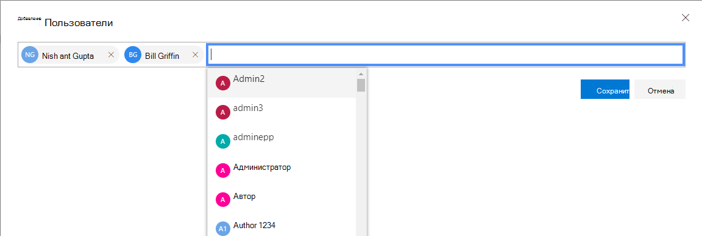
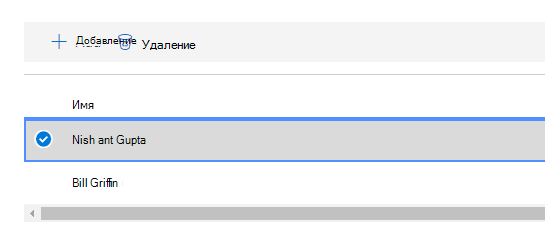
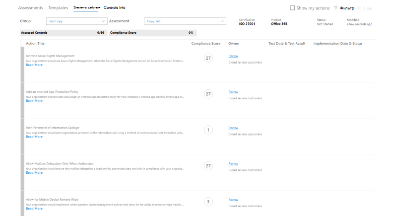
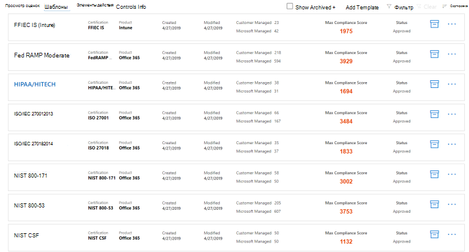

# Работа с диспетчером соответствия требованиям Майкрософт (Предварительная версия)

> [!IMPORTANT]
> Диспетчер соответствия требованиям (Microsoft) — это средство панели мониторинга и управления, которое предоставляет сводку по защите данных и требованиям к статуре, а также рекомендации по улучшению защиты и соответствия данных. Действия клиентов, предоставленные в диспетчере соответствия требованиям, являются рекомендациями. В Организации необходимо оценить эффективность этих рекомендаций в соответствующей нормативной среде перед реализацией. Рекомендации диспетчера соответствия требованиям не должны рассматриваться в качестве гарантии соблюдения требований.

## Управление соответствием требованиям

Диспетчер соответствия требованиям доступен на портале доверия службы Майкрософт. Любой пользователь с учетной записью Майкрософт или учетной записью организации Azure Active Directory может получить доступ к диспетчеру соответствия требованиям.

1. Перейдите по ссылке [https://servicetrust.microsoft.com/ComplianceManager/V3](https://servicetrust.microsoft.com/ComplianceManager/V3).

2. Войдите с помощью учетной записи службы Майкрософт, которая является учетной записью пользователя Office 365, Microsoft 365 или Azure Active Directory (Azure AD).

> [!NOTE]
> На портале доверия службы выберите **Диспетчер соответствия требованиям**, который является ознакомительной версией с самыми актуальными функциями. Не выбирайте элемент **"Диспетчер соответствия требованиям" (классический)**, содержащий функции раннего выпуска, не описанные в этой документации.

## Администрирование

Существуют специальные административные функции, доступные только глобальному администратору и отображаемые только при входе в учетную запись глобального администратора. Глобальный администратор может выполнять указанные ниже действия.
- [Назначение ролей пользователей](#assigning-compliance-manager-roles-to-users)
- [Включение и отключение автоматических обновлений оценок безопасности](#controlling-automatic-secure-score-updates)
- [Настройка параметров конфиденциальности пользователей](#configuring-user-privacy-settings)
  
### Назначение пользователям ролей в диспетчере соответствия требованиям

После того как администратор назначит роли диспетчера соответствия требованиям другим пользователям, эти пользователи могут просматривать данные в диспетчере соответствия требованиям и выполнять действия, определенные их ролью. Администратор также может предоставить доступ только для чтения к диспетчеру соответствия требованиям, назначив пользователю [роль глобального читателя в Azure Active Directory (Azure AD)](https://docs.microsoft.com/azure/active-directory/users-groups-roles/directory-assign-admin-roles#global-reader).

Каждая роль диспетчера соответствия требованиям обладает немного другими разрешениями. Вы можете просматривать разрешения, назначенные каждой роли, просматривать, какие пользователи имеют роли, а также добавлять и удалять пользователей из этой роли с помощью портала доверия службы. Выберите пункт меню **Администратор** и выберите **Параметры** для просмотра.
  

  
Чтобы добавить или удалить пользователей из роли в диспетчере соответствия требованиям, выполните указанные ниже действия.
  
1. Перейдите по ссылке [https://servicetrust.microsoft.com](https://servicetrust.microsoft.com).

2. Войдите с помощью учетной записи глобального администратора Azure Active Directory.

3. В верхней строке меню портала доверия службы выберите пункт **Администратор** , а затем — **Параметры**.

4. В раскрывающемся списке **Выбор роли** выберите роль, которую вы хотите изменить.

5. Пользователи, добавленные к каждой роли, указаны на странице **Выбор роли**.

6. Чтобы добавить пользователей в эту роль, нажмите кнопку **Добавить**. В диалоговом окне **Добавление пользователей** выберите поле пользователь. Вы можете прокрутить список доступных пользователей или начать ввод имени пользователя, чтобы отфильтровать список на основе искомого термина. Выберите пользователя, чтобы добавить эту учетную запись в список " **Добавить пользователей** ", подготовленный с помощью этой роли. Если вы хотите одновременно добавить нескольких пользователей, начните вводить имя пользователя, чтобы отфильтровать список, а затем выберите пользователя, которого нужно добавить в список. Нажмите кнопку **сохранить** , чтобы подготовить выбранную роль для этих пользователей. 

    
  
7. Чтобы удалить пользователей из этой роли, выберите пользователей и нажмите кнопку **Удалить**.

    

### Управление автоматическими обновлениями оценки безопасности

Обновления показателей безопасности можно включить автоматически для всех действий, выключенных для всех действий или для отдельных действий, выполнив указанные ниже действия.

1. Войдите на [портал службы доверия](https://servicetrust.microsoft.com) с учетной записью глобального администратора.

2. В верхней строке меню портала доверия службы выберите пункт Администратор **, а**затем **Admin** выберите пункт **Параметры**.

3. На вкладке **Оценка безопасности** нажмите соответствующую кнопку, чтобы **включить все действия**, отключить **для всех действий**или **задать для каждого действия.**

Если выбран параметр **задать для каждого действия,** выполните следующие дополнительные действия, чтобы включить обновления оценки безопасности для отдельных действий:

4. Выберите **Диспетчер соответствия требованиям** в верхнем меню (Примечание: не выбирайте "Диспетчер соответствия требованиям (классический)").

5. В правом верхнем углу экрана выберите **Управление клиентами** .

6. В области **действия клиента** найдите предполагаемое действие с многоточием (**...**) в столбце " **затронутые действия** ". Нажмите кнопку с многоточием и выберите **изменить.**

7. Переключите переключатель **показатель безопасности непрерывное обновление** в состояние **вкл.**

8. Нажмите кнопку **Сохранить.** Для этого действия включена постоянная оценка безопасности.

**Примечание:** Включать и отключать автоматическое обновление для всех действий может только глобальный администратор. Администратор управления соответствием может включить автоматическое обновление для отдельных действий, но не для глобальных действий.

### Настройка параметров конфиденциальности пользователей

Для некоторых нормативных актов требуется, чтобы Организация могла удалять данные журнала пользователей. Для этого функции **параметров конфиденциальности пользователя** позволяют администраторам выполнять следующие действия.
  
- [искать пользователей;](#search-for-a-user)

- [экспортировать отчет о журнале данных учетных записей;](#export-a-report-of-account-data-history)

- [переназначать поручения;](#reassign-action-items)

- [удалять журналы данных пользователей.](#delete-user-data-history)
    

  
#### Поиск пользователя

Чтобы найти учетную запись, выполните указанные ниже действия.
  
1. Укажите адрес электронной почты пользователя, введя его псевдоним (текст слева от символа @) и выбрав имя домена в списке справа. Если в Организации имеется несколько зарегистрированных доменов, можно дважды проверить суффикс имен адресов электронной почты, чтобы убедиться, что он правильный.
    
2. Когда введено правильное имя пользователя, выберите **Поиск**.
    
3. Если учетная запись пользователя не найдена, на странице будет отображаться сообщение об ошибке "пользователь не найден". Проверьте сведения об адресе электронной почты пользователя, внесите необходимые исправления и нажмите кнопку **Поиск** , чтобы повторить попытку.
    
4. Если учетная запись пользователя найдена, подпись кнопки **Поиск** изменится на **Очистить**. Это означает, что найденная учетная запись пользователя является рабочим контекстом для дополнительных функций, которые показаны ниже, а работа этих функций будет распространяться на данную учетную запись.
    
5. Чтобы очистить результаты поиска и выполнить поиск другого пользователя, нажмите кнопку **очистить**.
    
#### Экспорт отчета о журнале данных учетной записи

Когда учетная запись пользователя найдена, вы можете создать отчет о связанных с ней зависимостях. Эти сведения помогут вам переназначить открытые элементы действий или получить доступ к ранее отправленным доказательствам.
  
 Чтобы создать и экспортировать отчет, выполните указанные ниже действия.
  
1. Выберите пункт **Экспорт** , чтобы создать и скачать отчет о действиях элемента управления диспетчера соответствия требованиям, назначенных возвращенной учетной записи пользователя, и список документов, отправленных этим пользователем. Если нет назначенных действий или отправленных документов, в сообщении об ошибке отображается сообщение об ошибке "нет данных для этого пользователя".

2. Отчет загружается в фоновом окне активного браузера. Если всплывающее окно загрузки не отображается, проверьте историю скачивания браузера.

3. Откройте документ, чтобы просмотреть данные отчета.

> [!NOTE]
> Это не хронологический отчет с данными об изменении состояния в журнале назначения поручений. Создаваемый отчет представляет собой моментальный снимок поручений, назначенных в момент его создания (метка даты и времени заносится в отчет). Например, любое последующее переназначение поручений приведет к созданию другого моментального снимка данных, если другой пользователь снова создаст этот отчет.
  
#### Переназначение поручений

Эта функция позволяет организации удалять активные или просроченные зависимости учетной записи, переназначая все поручения (это относится как к активным, так и к выполненным поручениям) из найденной учетной записи пользователя новому пользователю, выбранному ниже. Это действие не меняет журнал отправки документов для найденной учетной записи.
  
 Чтобы переназначить поручения другому пользователю, выполните указанные ниже действия.
  
1. Щелкните поле ввода, чтобы найти и выбрать другого пользователя в организации, которому следует назначить поручения найденного пользователя.
    
2. Нажмите **Заменить**, чтобы переназначить все поручения найденного пользователя новому выбранному пользователю.
    
3. Появится диалоговое окно подтверждения "это приведет к повторному назначению всех элементов управления для текущего пользователя выбранному пользователю. Это действие невозможно отменить. Продолжить?"
    
4. Чтобы продолжить, нажмите кнопку **ОК**, в противном случае нажмите **кнопку Отмена**.
    
> [!NOTE]
> Все поручения (как активные, так и выполненные) будут назначены новому пользователю. Однако это действие не влияет на журнал отправки документов. Во всех документах, отправленных ранее назначенным пользователем, по-прежнему будут отображаться дата и время, а также имя назначенного ранее пользователя. 
  
Чтобы удалить назначенного ранее пользователя, необходимо вручную отредактировать журнал отправки документов. В этом случае администратору потребуется:
  
1. Открыть загруженный ранее отчет об экспорте.
  
2. Определить нужное поручение и перейти к нему.
  
3. Выберите **Управление документами** , чтобы перейти к репозиторию свидетельств для этого элемента управления.
  
4. Скачать документ.
  
5. Удалить документ их репозитория свидетельств.
  
6. Повторно отправьте документ. Теперь в документе будут отображаться новые Дата и время отправки, а затем имя пользователя, отправленное пользователем.
  
#### Удаление журнала данных пользователя

При этом все поручения, назначенные найденному пользователю, становятся неназначенными. Кроме того, для всех документов, отправленных этим пользователям, значение имени отправителя меняется на "Пользователь удален".
  
 Чтобы удалить журнал поручений и отправки документов для учетной записи, выполните указанные ниже действия.
  
1. Выберите **Удалить**.

2. Откроется диалоговое окно с подтверждением: "это приведет к удалению всех назначенных элементов действий управления и журнала отправки документов для выбранного пользователя. Это действие невозможно отменить. Продолжить?"
    
3. Чтобы продолжить, нажмите кнопку **ОК**, в противном случае нажмите **кнопку Отмена**.

## Группы

Группы — это контейнеры, позволяющие организовывать оценки и предоставлять общий доступ к общим данным и задачам рабочих процессов между оценками, имеющими одинаковые или связанные с управляемыми пользователями элементы управления.

Вы можете группировать оценки логически, например, по годам, Standard, Service или на основе Teams, отделов или географических регионов вашей организации. Ниже приведены примеры двух групп и их базовых оценок:
  
- **ФФИЕК — оценки 2020**
  - Office 365 + ФФИЕК —
  - Intune + ФФИЕК —
- **Оценки безопасности и конфиденциальности данных**
  - Office 365 + ISO 27001:2013
  - Office 365 + ISO 27018:2014

> [!NOTE]
> Рекомендуем определить стратегию группировки для Организации, *прежде чем* добавлять новые оценки.

Для начала вы настроили группу **по умолчанию** , которая содержит базовый план защиты данных. Этот базовый план представляет собой набор элементов управления, включающих распространенные отраслевые нормы и стандарты ([Подробнее](compliance-score-methodology.md#initial-score-based-on-microsoft-365-data-protection-baseline)).

### Создание группы

Группы нельзя создавать как отдельные субъекты. Группа всегда должна содержать по крайней мере одну оценку, поэтому для создания группы необходимо сначала создать оценку для помещения в группу.

Чтобы создать группу, выполните указанные ниже действия.

1. Создайте новую оценку, нажав кнопку **+ добавить оценку** в верхней части панели мониторинга.
2. В всплывающей области **Оценка** введите название для оценки и выберите шаблон в раскрывающемся меню.
3. **Выберите группу или добавьте новую группу**, выберите **Добавить новую группу** и введите имя группы в поле ниже.
4. Чтобы скопировать информацию из существующей группы, переключитесь в режим **копирования данных из существующей группы?** переключитесь **на on.** Выберите из раскрывающегося меню группу, которую необходимо скопировать, и установите флажки для всех полей, которые необходимо перенести в новую оценку в новой группе.
5. Нажмите кнопку **Сохранить**. После завершения всплывающая панель закроется, и на панели мониторинга отобразится новая группа.

Что необходимо знать при работе с группами:
  
- Имена групп (также называемые *идентификаторами групп*) должны быть уникальными в пределах организации.
- Группы не имеют свойств безопасности. Все разрешения связаны с оценками.
- После добавления оценки в группу изменение группы невозможно. Вы можете переименовать группу оценки, которая изменяет имя группировки оценки для всех оценок, связанных с этой группой.
- Связанные элементы управления оценки при различных оценках в пределах одной группы автоматически обновляются по завершении.
- При добавлении новой оценки в существующую группу Общие сведения из оценок в этой группе копируются в новую оценку.
- Группы могут содержать оценки для одного и того же сертификата или регламентирования, но каждая группа может содержать только одну оценку для определенной связи продукта с сертификатом. Например, Группа не может содержать две оценки для Office 365 и NIST CSF. Группа может содержать несколько оценок для одного и того же продукта только в том случае, если соответствующая сертификация или регламентирование для каждого из них отличаются.
- Скрытие оценки приводит к разрыву отношения между этой оценкой и группой. Дальнейшие обновления других связанных оценок больше не отражаются в скрытой оценке. ([Сведения о том, как скрыть оценки).](#hide-a-template-or-an-assessment)
- Удаление групп невозможно.
- При внесении изменений в элемент Action, который отображается в нескольких группах, это изменение отражается во всех экземплярах этого элемента Action.

## Управление клиентами измерений, владельцев, & действий клиентов

Интерфейс **управления клиентом** позволяет управлять параметрами, указанными в масштабе всей Организации:

- **Измерения:** Просмотр метаданных для шаблонов, оценок и действий, которые позволяют создавать настраиваемые сводные элементы для фильтров.
- **Владельцы:** Заполните список ответственных сторон, которые можно связать с действиями.
- **Действия клиента:** Управление полным списком элементов действий, включенных в Диспетчер соответствия требованиям (Предварительная версия), а также включение и отключение мониторинга безопасного индекса для действий, интегрированных с рейтингом безопасности.

Выберите **Управление клиентом** в правом верхнем углу экрана, чтобы открыть интерфейс управления, и выполните приведенные ниже действия для управления **измерениями**, **владельцами**и **действиями клиентов**.

### Dimensions

Измерения — это наборы метаданных, которые предоставляют сведения о шаблоне, оценке или элементе Action. В измерениях используется концепция ключей и значений, где ключ измерения представляет свойство, а значение измерения представляет допустимые значения свойства. Например, в диспетчере соответствия требованиям существует три типа действий. Они определяются ключом измерения **цели действия** и значениями измерений для **превентивных**, **обнаруживающее**и **корректирующих**элементов.

### Owners

Владельцы используются для определения пользователя, ответственного за каждый элемент управления. Все встроенные элементы управления принадлежат корпорации Майкрософт, клиентам или обоим. Вы можете создавать настраиваемые значения для владельцев, которые могут использоваться для указания более детализированных обязанностей в Организации. Например, вы можете создать владельцев, которые представляют определенные группы, Teams или подразделения в вашей организации.

#### Добавление владельца

1. Откройте **Управление клиентом** и выберите **владельцы**.
2. Нажмите кнопку **+ добавить владельца**.
3. Введите имя и описание владельца и нажмите кнопку **сохранить**. Описание отображается в столбце владелец.

#### Изменение владельца

Имя владельца нельзя изменить, но вы можете изменить его описание в столбце владелец.

1. Откройте **Управление клиентом** и выберите **владельцы**.
2. Выберите владельца, которого нужно изменить, щелкните многоточие (...) рядом с ним и нажмите кнопку **изменить**.
3. Измените описание так, как необходимо, и нажмите кнопку **сохранить**.

#### Удаление владельца

1. Откройте **Управление клиентом** и выберите **владельцы**.
2. Выберите владельца, которого нужно удалить, щелкните многоточие (...) рядом с ним и выберите команду **Удалить**.
3. Когда появится сообщение с подтверждением, нажмите кнопку **Удалить**.

### Действия клиентов

В области действия клиента отображаются все действия клиента для всех шаблонов и оценок в диспетчере соответствия требованиям (Предварительная версия).

С первого взгляда можно увидеть название действия, владельца, категорию, принудительно и оценить, а также определить, интегрируется ли оно с показателем безопасности. Вы можете развернуть действие и выбрать **Дополнительные** сведения, чтобы прочитать описание действия и получить доступ к любым ссылкам в описании. Кроме того, этот интерфейс можно использовать для включения и отключения безопасной интеграции рейтинга для отдельных действий и для добавления дополнительных действий. У действий с возможностями интеграции с обеспечением безопасной оценки есть многоточие (...) рядом с ними (Обратите внимание, что рядом с дополнительными действиями также имеется многоточие).

#### Включение или отключение безопасной интеграции показателей

1. Выберите многоточие (...) для действия, которое нужно изменить, и нажмите кнопку **изменить**.
2. Чтобы включить или отключить непрерывное наблюдение с помощью безопасной оценки, переключите флажок для режима безопасных обновлений.
3. Нажмите кнопку **Сохранить**.

Когда Организации сначала развертывают Microsoft 365 или Office 365, вы занимаетесь приблизительно за семь дней, чтобы обеспечить полную сбор данных и оценить их до оценки. В течение этого времени при установке переключателя непрерывного обновления оценки безопасности в **состояние "отключено** " и ручная настройка действия " **реализовано** " будет учитываться действие для оценки. По истечении семи дней с момента включения непрерывного обновления с включенной безопасностью непрерывный возврат будет включен непрерывный мониторинг.

Все действия, которые не поддерживаются при интеграции с безопасным рейтингом, могут быть реализованы вручную. Ручная реализация будет подноситься к оценке для группы действий.

## Оценки

В этом разделе объясняется, как просматривать и работать с оценками, в том числе добавлять новые, экспортировать их, копировать информацию из существующих оценок и обновлять их с помощью управления версиями.

> [!NOTE]
> Теперь вы можете создавать оценки в показателе соответствия требованиям. [Ознакомьтесь с руководством и инструкциями](compliance-score-assessments.md).

### Просмотр сведений о оценке и действиях
  
В панели мониторинга **оценки** выберите имя оценки, чтобы открыть его и просмотреть сведения о действиях и элементах управления.

Ниже приведен пример оценки для Office 365 и ISO 27001. Первое представление показывает новые представления "элементы действий" в диспетчере соответствия требованиям (Предварительная версия).

Действия перечислены в алфавитном порядке, и каждому действию назначается рейтинг и владелец. Чтобы просмотреть сведения о каждом действии, перейдите по ссылке **Read more** .

Перейдите по ссылке **Обзор** , чтобы управлять, назначить, реализовать и проверить действие. Ниже приведен пример действия.

Используйте следующие поля для управления рабочим процессом действия:

- **Назначение пользователя:** Выберите это поле, чтобы выбрать или ввести пользователя, которому будет назначено это действие. Вы можете прокрутить список или ввести имя, чтобы найти его, а затем выбрать.
- **Управление документами:** Вы можете загрузить свидетельство реализации в виде документов Office, файлов изображений и снимков экрана, выходных данных PowerShell в формате CSV или TXT, а также PDF-файлов.
- **Состояние реализации:** Используется для указания текущего состояния реализации действия. Возможные значения не реализованы, реализованы, относятся к альтернативной реализации, запланированы, а не в области.
- **Дата реализации:** Дата, когда действие было выполнено.
- **Результат теста:** Используется для указания результатов проверки реализации. Возможные значения не оцениваются, передаются, неудачные, низкие риски, сбой — средний риск, сбой — высокий риск, а не в области действия.
- **Дата тестирования:** Дата, когда выполнялась проверка.
- **Примечания по реализации:** Введите сведения о реализации для своей организации, а также примечания, которые нужно включить.
- **План тестирования:** Введите сведения о плане тестирования для этого действия, а также примечания, которые нужно включить.
- **Дополнительные сведения:** Введите дополнительные сведения об этом действии или о том, как оно было реализовано в Организации, а также какие заметки, которые необходимо включить.

На панели мониторинга " **сведения об элементах управления** " можно просматривать сведения для элементов управления на уровне оценки и шаблона. Ниже приведен пример панели мониторинга "сведения об элементах управления" для оценки.

Для оценок в панели мониторинга "сведения об элементах управления" отображаются следующие сведения:

- Раскрывающееся меню **группы** , чтобы выбрать группу для просмотра (при использовании нескольких групп).
- Раскрывающееся меню **оценки** для выбора оценки, которую необходимо просмотреть.
- Метаданные о выбранной оценке, в том числе:
    - Индикатор выполнения для **оцененных элементов** управления, в которых отображается количество оцененных элементов управления на общем числе элементов управления.
    - Текущий **показатель соответствия требованиям** для оценки, отображаемый в процентах.
    - Сведения о **сертификации** и **продукте** , используемых при оценке.
    - Текущее **состояние** и Дата последнего **изменения** оценки.
- Список **служб области** для оценки.
- Сведения об элементах управления, сгруппированных по семействам элементов управления со ссылками на действия пользователя и сведения об реализации Майкрософт:
    - **Ваши действия** отображают действия клиента, которые можно выполнить для удовлетворения некоторых или всех требований элемента управления. С несколькими элементами управления связано несколько действий, и здесь отображаются все действия, связанные с элементом управления. Эти действия имеют тот же пользовательский интерфейс, что и в панели мониторинга "действия".
    - **Действия Майкрософт** отображает список элементов управления из внутренней платформы Майкрософт, которые применяются к выбранному элементу управления сертификацией. Для каждого внутреннего элемента управления выберите **реализовано** , чтобы просмотреть сведения о реализации и тестировании Майкрософт, а также результаты тестирования и дату тестирования, как показано ниже.

### Добавление оценки
  
1. В панели мониторинга оценки нажмите **+ добавить оценку**.

2. Когда откроется колонка, введите следующие сведения:

    - **Название (обязательно):** Ввод названия для оценки
    - **Выберите шаблон (обязательно):** Выбор стандартного или настраиваемого шаблона
    - **Выберите группу или добавьте новую группу (обязательно):** Выберите существующую группу или нажмите кнопку Добавить новую группу и укажите уникальное имя группы.
    - **Вы хотите скопировать данные из существующей группы? (необязательно):** переключать элемент управления для включения копирования групп, а затем:
        - **Выберите группу (необязательно):** Если включена копия группы, выберите группу для копирования.
            - **Сведения о реализации (необязательно):** Выберите, чтобы скопировать сведения о реализации в новую группу
            - **План тестирования & дополнительные сведения (необязательно):** Выберите, чтобы скопировать план тестирования и дополнительные сведения о ней в новую группу.
            - **Документы (необязательно):** Выберите, чтобы копировать документы в новую группу

3. Нажмите кнопку **сохранить** , чтобы создать оценку.

 Новая оценка отобразится на панели мониторинга оценки и отобразит следующую информацию:

- Название оценки.
- Размеры оценки, включая сертификацию, среду и продукт, примененные к оценке.
- Дата создания и Дата последнего изменения.
- Показатель оценки отображается в процентах. Этот показатель автоматически включает оценки из управляемых корпорацией Майкрософт элементов управления и из оценки безопасности.
- Индикаторы хода выполнения, отображающие количество обслуживаемых корпорацией Майкрософт и управляемых пользователем элементов управления.

### Копирование сведений из имеющихся оценок

При создании оценки вы можете скопировать информацию из существующей группы. Копирование позволяет применить сведения, введенные в скопированную оценку, в те же элементы управления новой оценки. Например, если у вас есть группа для всех оценок, связанных с ФФИЕК в вашей организации, вы можете скопировать следующие данные из существующих оценок:

- Сведения о реализации
- План тестирования & дополнительные сведения
- Документы

#### Копирование данных из существующей оценки в новую оценку
  
1. В панели мониторинга оценки нажмите кнопку **+ добавить оценку**.
    
2. В окне **Добавление оценки** заполните указанные ниже сведения.

    - **Название (обязательно):** Введите название для оценки.
    - **Выберите шаблон (обязательно):** Выберите стандартный или настраиваемый шаблон.
    - **Выберите группу или добавьте новую группу (обязательно):** Выберите **Добавить новую группу** и укажите уникальное имя группы.
    - **Вы хотите скопировать данные из существующей группы? (необязательно):** Переключите элемент управления в on, чтобы включить копирование группы, а затем:- **выберите группу (необязательно):** если копия группы включена, выберите группу для копирования.
            - **Сведения о реализации (необязательно):** Выберите, чтобы скопировать сведения о реализации в новую группу.
            - **План тестирования & дополнительные сведения (необязательно):** Выберите, чтобы скопировать план тестирования и дополнительные сведения о ней в новую группу.
            - **Документы (необязательно):** Выберите, чтобы копировать документы в новую группу.

3. Нажмите кнопку **сохранить** , чтобы создать оценку.

### Оповещения об управлении версиями для оценочных обновлений

Когда обновление становится доступным для оценки, отображается значок оповещения о том, что обновление готово. Если щелкнуть этот значок, всплывающее окно поясняет обновление и выдает запрос на принятие. Ниже приведен пример оповещения о версии для оценки.

При выборе значка оповещения раскрывается раскрывающаяся панель, в которой объясняется обновление и предлагается принять его:

Настоятельно рекомендуется принимать все обновления при получении уведомлений об обновлениях.

### Экспорт оценки

Вы можете экспортировать оценку в файл Excel для заинтересованных лиц в Организации, а также для внешних аудиторов и стабилизаторов. Отчет является моментальным снимком оценки на дату и время создания отчета. В отчете содержатся сведения обо всех элементах Майкрософт и элементах управления, управляемых клиентами, для оценки, управления состоянием реализации, контроля даты тестирования, результатов тестирования и ссылки на отправленные документы с доказательствами.
  
### Экспорт отчета о оценке
  
1. На панели мониторинга "Управление соответствием требованиям" выберите вкладку **сведения об элементах управления** .
2. Выберите **группу** и **оценку** в раскрывающихся меню для оценки, которую нужно экспортировать.
3. Нажмите кнопку **Экспорт** .

Отчет о оценке загружается в качестве файла Excel в сеансе браузера. По умолчанию имя файла для файла Excel будет заголовком оценки.

### Скрытие шаблона или оценки

Когда вы завершите работу с шаблоном или оценкой и больше не хотите использовать их для целей обеспечения соответствия требованиям, вы можете скрыть ее в вашем представлении. Если шаблон или оценка скрыты, они удаляются из представления по умолчанию, а для отображения необходимо выбрать **включить скрытый** флажок.

> [!IMPORTANT]
> Скрытые оценки не сохраняют свои ссылки на отправленные документы свидетельств. Мы настоятельно рекомендуем экспортировать оценку перед скрытием, чтобы сохранить ссылки на документы с доказательствами в отчете.
  
#### Скрытие шаблона

1. Откройте панель мониторинга " **шаблоны** ".
2. Выберите шаблон, который нужно скрыть, и в его строке нажмите кнопку **Скрыть**.
3. Когда появится сообщение с подтверждением, выберите **Скрыть**.

#### Скрытие оценки

1. Откройте панель мониторинга **оценки** .
2. Выберите **группу** из раскрывающегося меню, которое содержит оценку, которую нужно скрыть.
3. Выберите нужную оценку и нажмите кнопку **Скрыть**, чтобы скрыть ее.
4. Когда появится сообщение с подтверждением, выберите **Скрыть**.

#### Просмотр скрытых оценок
  
1. Откройте вкладку Панель мониторинга **оценки** и установите флажок **включить скрытые** флажки.
2. Скрытые оценки отображаются в разделе **скрытые оценки** .

#### Отмена скрытия оценки

1. На вкладке **оценки** установите флажок **включить скрытые** флажки.
2. Скрытые оценки отображаются в разделе **скрытые оценки** .
3. Перейдите к оценке, которую нужно отобразить, и на многоточии выберите **отобразить**.
4. Когда появится сообщение с подтверждением, выберите **отобразить**.

## Элементы управления и действия

Элементы управления и действия — это основные сводные данные, используемые в диспетчере соответствия требованиям (Предварительная версия). Сводная таблица элементов управления, существовавшая в предыдущих версиях диспетчера соответствия требованиям, была улучшена для отображения элементов управления Майкрософт и клиентов в одних и тех же семействах элементов управления. Это объединенное представление упрощает просмотр полной модели общей ответственности для каждого элемента управления. Сводка действий является новой в диспетчере соответствия требованиям (Предварительная версия) и предназначена для упрощенного просмотра всех действий, рекомендуемых корпорацией Майкрософт.

### Элементы управления

Элементы управления можно просматривать на панели мониторинга "сведения об элементах управления". Элементы управления представляют требования из стандартной, сертификации, нормативной или платформы. Чтобы сопоставить эти требования в нескольких стандартах, нормативах и т. д., а также связать их с действиями, все будет считаться структурой элемента управления. Например, такие правила, как, например, HIPAA, разбиваются на раздел, а элементы управления HIPAA в диспетчере соответствия требованиям используют ту же схему нумерации, что и в этих разделах:

Существует три типа элементов управления:

1. **Управляемые корпорацией Майкрософт элементы управления:** это элементы управления, для которых у корпорации Майкрософт есть ответственность. Они отображаются в шаблонах и добавляются в Диспетчер соответствия требованиям корпорацией Майкрософт.
2. **Управляемые пользователями элементы управления:** это элементы управления, для которых у всех пользователей есть ответственность. Они отображаются в шаблонах, а также добавляются в Диспетчер соответствия требованиям клиентов.
3. **Общие управляющие элементы управления:** это элементы управления, в которых ответственность для совместного доступа между корпорацией Майкрософт и клиентом. Они отображаются в шаблонах, а также добавляются в Диспетчер соответствия требованиям корпорацией Майкрософт. Клиент также может изменять и отключать управляемые Майкрософт элементы управления.

### Элементы Actions

Элементы Actions — это Рекомендуемые задачи для реализации требований к стандартному или нормативному числу, а также для тестирования, проверки и документирования требований к реализации Организации. Действия связаны с одним или несколькими элементами управления. С каждым элементом управления связано одно или несколько действий, каждое из которых может быть связано с одним или несколькими элементами управления. Действия являются частью основного рабочего процесса в диспетчере соответствия требованиям (Предварительная версия), так как они являются объектами, которые были назначены, отслеживаются и проверяются организацией.

#### Назначение действий
  
1. На панели мониторинга **элементы действий** выберите **группу** , содержащую оценку, действие которой необходимо назначить.
2. В раскрывающемся списке **Оценка** выберите оценку, действие которой необходимо назначить, или выберите **все** из раскрывающегося списка, чтобы просмотреть все доступные действия.
3. Выберите действие, которое нужно назначить, и в столбце **владелец** выберите ссылку для **проверки**, * * реализована или **тест**.
4. Выберите поле **назначить пользователя** и отобразится список пользователей в Организации. Прокрутите список и выберите пункт пользователь или отфильтровать список, чтобы выбрать пользователя, введя имя пользователя.
5. В поле заметки о реализации введите любые заметки, которые необходимо передать назначенному пользователю.
6. Нажмите кнопку **сохранить** , чтобы назначить действие.

#### Переназначение элементов действий

Эта функция позволяет Организации удалять активные или незавершенные зависимости от учетной записи пользователя путем повторного назначения действия новому пользователю.

1. На панели мониторинга **элементы действий** выберите **группу** , содержащую оценку, действие которой необходимо переназначить.
2. В раскрывающемся списке **Оценка** выберите оценку, действие которой необходимо переназначить, или выберите **все** из раскрывающегося списка, чтобы просмотреть все доступные действия.
3. Выберите действие, которое необходимо переназначить, и в столбце **владелец** выберите ссылку для **проверки**, **реализована**или **тест**.
4. Удалите существующего пользователя из поля **Назначение пользователя** , а затем выберите другого пользователя из списка или выберите пользователя в списке, введя имя пользователя.
5. В поле заметки о реализации введите любые заметки, которые необходимо передать пользователю.
6. Нажмите кнопку **сохранить** , чтобы переназначить действие.

#### Состояние синхронизации типичных элементов действий для групп

Если в Организации имеется несколько групп оценок, поведение технических действий (то есть действий, влияющих на всю организацию). Все повторяющиеся действия в группах теперь объединяются в одно действие. Это единственное действие содержит все отправленные заметки и доказательства из предыдущих версий. Любые изменения, внесенные в действие в одной группе или оценке, будут отражены во всех экземплярах этого действия. Поля **состояние реализации**, **Дата реализации**, **Состояние тестирования**и **Дата тестирования** отражают самые последние обновления.

## Шаблоны

Шаблон — это базовый объект в диспетчере соответствия требованиям (Предварительная версия), связанный с продуктом и сертификацией (например, стандартная, нормативная, управляющая платформа и т. д.). Шаблоны можно просматривать и добавлять на панели мониторинга " **шаблоны** ".

 
В панели мониторинга отображается каждый шаблон вместе с сертификатом и продуктом, связанным с шаблоном, Дата создания и последнего изменения шаблона, количество элементов управления, управляемых клиентом и корпорацией Майкрософт, максимальный показатель соответствия для шаблона и состояние шаблона (например, утверждено, ожидающее утверждение, импортировано).

### Создание шаблона

Существует три способа работы с шаблонами для создания оценок:

1. Используйте один из готовых шаблонов, предоставляемых корпорацией Майкрософт.
2. Настройка готовности к использованию шаблона с собственными действиями и элементами управления с помощью процесса расширения.
3. Создайте собственный шаблон и импортируйте его в Диспетчер соответствия требованиям.

> [!NOTE]
> При отправке шаблона в Диспетчер соответствия требованиям он должен быть утвержден двумя пользователями, которые хранят роль администратора, прежде чем она будет опубликована и доступна для использования.

#### Использование шаблона "готово к использованию"

Готовые к использованию шаблоны доступны на панели мониторинга **шаблонов** . Просмотр текущего [списка шаблонов](compliance-score-templates.md), который обновляется каждый раз, когда доступен новый шаблон.

#### Настройка шаблона с помощью процесса расширения

1. Откройте панель мониторинга " **шаблоны** " и выберите **+ Добавить шаблон**.
2. В раскрывающейся области шаблона установите флажок **создать расширение в глобальном шаблоне** .
3. Выберите из раскрывающегося меню шаблон, который вы хотите расширить.
4. Если вы еще не отформатировани данные шаблона в Excel, выберите ссылку во всплывающей панели, чтобы скачать файл Excel. Заполните таблицу в соответствии с [данными шаблона импорта с помощью](#import-template-data-with-excel) приведенных ниже инструкций Excel и сохраните их на локальном диске.
5. Импортируйте данные настраиваемого шаблона, нажав кнопку **Обзор** , чтобы отправить файл Excel.
6. Нажмите кнопку **Добавить в панель мониторинга**.
7. Изменения в шаблоне требуют утверждения двух пользователей, которые содержат роль администратора. Эти пользователи получают уведомление об обновлениях шаблона. Один из изменений утверждается двумя администраторами, вы увидите обновленный шаблон на панели мониторинга **шаблонов** .

#### Создайте собственный шаблон и импортируйте его в Диспетчер соответствия требованиям

1. Откройте панель мониторинга " **шаблоны** " и выберите **+ Добавить шаблон**.
2. В раскрывающейся области шаблона выберите **создать новый шаблон**.
3. Импортируйте данные шаблона, нажав кнопку **Обзор** , чтобы отправить файл Excel с данными (см. раздел [Импорт данных шаблона с помощью Excel](#import-template-data-with-excel) ниже).
4. Нажмите кнопку **Добавить в панель мониторинга**.
5. Новый шаблон требует утверждения двух пользователей, которые содержат роль администратора. Пользователи получают уведомление о том, что новый шаблон готов к утверждению. Один из шаблонов утверждается двумя администраторами, вы увидите новый шаблон на панели мониторинга **шаблонов** .

#### Импорт данных шаблона в Excel

Чтобы изменить шаблон или создать собственный шаблон, вы будете использовать [электронную таблицу Excel](https://go.microsoft.com/fwlink/?linkid=2124865) для записи необходимых данных и их отправки в Диспетчер соответствия требованиям. Этот шаблон электронной таблицы имеет определенный формат и схему, которые необходимо использовать или импортировать в Диспетчер соответствия требованиям.

> [!IMPORTANT]
> Если вы создали или настроили шаблоны в диспетчере соответствия требованиям, **этот процесс был недавно обновлен. Внимательно изучите этот раздел.**

Электронная таблица содержит четыре вкладки, три из которых являются обязательными:

1. Шаблон (обязательный)
2. Контролфамили (обязательный)
3. Действия (обязательные)
4. Измерения (необязательно)

Ваша электронная таблица **должна включать вкладки в**указанном порядке, в противном случае данные не будут успешно импортированы в шаблон.

##### Вкладка "шаблон"

Вкладка " **шаблон** " является обязательной. Информация на этой вкладке содержит метаданные о шаблоне. Имеется четыре обязательных столбца. Столбцы должны храниться в таблице Excel, как показано ниже. Вы можете добавить свой собственный столбец **после** четырех столбцов для предоставления собственных измерений. В этом случае не забудьте добавить их на вкладку **измерения** с помощью приведенных [ниже инструкций](#dimensions-tab).

- **название**: это название шаблона, которое должно быть уникальным. Она не может предоставлять общий доступ к имени с другим шаблоном, созданным в диспетчере соответствия требованиям, независимо от того, был ли он создан ранее, или заранее настроенным шаблоном, предоставляемым корпорацией Майкрософт.

- **продукт**: это обязательное измерение. Перечислите продукты, связанные с шаблоном.

- **сертификация**: это нормативное значение, которое вы используете для шаблона.

- **инскопесервицес**: эти службы в рамках продукта, на которые распространяется этот оценочный адрес (например, если в качестве продукта указан Office 365, Microsoft Teams может быть службой в пределах области). Можно перечислить несколько служб, разделенных двумя точками с запятой.

> [!NOTE]
> Сведения о продукте и сертификации: данные, вставленные в ячейки **продукта** и **сертификации** , не могут быть изменены после импорта электронной таблицы для создания или настройки шаблона. Кроме того, Группа не может содержать две оценки, имеющие одинаковую комбинацию **продукта и сертификации** . Можно использовать несколько шаблонов с одинаковой комбинацией продукта и сертификации.

##### Вкладка "Контролфамили"

Вкладка **контролфамили** является обязательной.  Обязательные столбцы на этой вкладке, которые должны соответствовать порядку, указанному в примере электронной таблицы,:

- **контролнаме**: имя элемента управления из сертификата, стандартного или нормативного имени, который обычно имеет НЕКОТОРЫЙ тип идентификатора. Имена элементов управления должны быть уникальными в шаблоне. В электронной таблице не может быть нескольких элементов управления с одинаковыми именами.

- **контролфамили**: предоставление слова или фразы для контролфамили, которая определяет широкое группирование элементов управления. Контролфамили не обязательно должен быть уникальным; она может быть указана несколько раз в электронной таблице. Один и тот же Контролфамили также может быть указан в нескольких шаблонах, хотя они не имеют отношения друг к другу. Каждый Контролфамили должен быть сопоставлен по крайней мере с одним элементом управления.

- **контролтитле**: предоставьте заголовок для элемента управления. В то время как Контролнаме — это справочный код, заголовок — это формат форматированного текста, который обычно отображается в нормативных положениях.

- **контролдескриптион**: предоставьте описание элемента управления.

- **контролактионтитле**: это название действия, которое нужно связать с этим элементом управления. Можно добавить несколько действий, разделив их двумя точками с запятой, не пробелья между ними. Каждый список элементов управления должен включать по крайней мере одно действие (это означает, что вы можете перечислить список действий на вкладке **действия** той же электронной таблицы, действия, которые существуют в другом шаблоне или действием, созданным корпорацией Майкрософт). Разные элементы управления могут ссылаться на одно и то же действие.

##### Вкладка "действия"

Вкладка **действия** является обязательной.  Он определяет действия в Организации, а не действия Майкрософт, которые уже существуют в диспетчере соответствия требованиям. Обязательные столбцы для этой вкладки, которые должны соответствовать порядку, указанному в примере электронной таблицы,:

- **актионтитле**: это название действия и обязательное поле. Заданное название должно быть уникальным. **Важно!** если вы ссылаетесь на действие, которое уже существует (например, в другом шаблоне) и изменяли любой из его элементов в последующих столбцах, эти изменения будут распространяться на те же действия в других шаблонах.

- **имплементатионтипе**: в этом обязательном поле перечислите один из трех следующих типов реализации:
    - **Рабочие** действия, реализуемые людьми и процессами для защиты конфиденциальности, целостности и доступности организационных систем, активов, данных и сотрудников (например: осведомленность и обучение безопасности)
    - **Технические** действия, выполненные с помощью технологий и механизмов, которые входят в состав аппаратного, программного обеспечения или встроенного программного обеспечения информационной системы для защиты конфиденциальности, целостности и доступности организационных систем и данных (пример: многофакторная проверка подлинности)
    - **Документация** — действия, реализуемые с помощью документированных политик и процедур установки и определения элементов управления, необходимых для защиты конфиденциальности, целостности и доступности организационных систем, активов, данных и сотрудников (пример: политика информационной безопасности)

- **актионскоре**: в этом обязательном поле Укажите числовое значение оценки для действия. Он должен быть целым числом в диапазоне от 1 до 99; Он не может иметь значение 0, null или пустое значение. Чем больше число, тем больше его значение в сторону улучшения соответствия требованиям. Инструкции корпорации Майкрософт:

- **актиондескриптионтитле**: это название описания и является обязательным. Это название описания позволяет выполнять одно и то же действие в нескольких шаблонах и иметь разные описания в каждом шаблоне.  Это поле позволяет определить шаблон, на который ссылается описание. В большинстве случаев в это поле можно ввести имя шаблона, который вы создаете.

- **актиондескриптион**: предоставьте описание действия. Вы можете применить форматирование, например полужирный шрифт и гиперссылки. Это обязательное поле.

- **Dimension — назначение действия**: это необязательное поле. Если включить его, заголовок должен содержать префикс "Dimension –". Все измерения, которые вы включаете здесь, будут использоваться в качестве [фильтров в рейтинге соответствия](compliance-score-setup.md#filtering-your-dashboard-view) и будут отображаться на странице "сведения о действиях по улучшению" в показателе соответствия требованиям.

##### Вкладка "измерения"

Вкладка " **измерения** " является необязательной. Тем не менее, если вы ссылаетесь на измерение в другом месте, вам нужно указать его здесь, если он не существует в шаблоне, созданном ранее, или в шаблоне Microsoft. Столбцы для этой вкладки перечислены ниже.

- **дименсионкэй**: список "продукт", "сертификация", "цель действия"
- **дименсионвалуе**: примеры: Office 365, Хиппа, превентивные, обнаруживающее

Вы можете просмотреть существующие измерения, перейдя в **Управление клиентами** и выбрав вкладку **измерения** . Кроме того, при экспорте существующего шаблона у экспортированной таблицы будет вкладка **измерения** , в которой перечислены все измерения, используемые в шаблоне.

### Изменение существующего шаблона

Чтобы внести изменения в созданный или настроенный шаблон с помощью описанного выше процесса импорта, используйте один и тот же процесс для импорта изменений в шаблон.

> [!NOTE]
> Существует несколько важных факторов, которые следует учитывать при редактировании компонентов шаблонов, поэтому внимательно изучите этот раздел.

#### Общий процесс изменения шаблона

Чтобы внести изменения в один из существующих шаблонов вашей организации, общий процесс будет следующим:

1. В панели мониторинга **шаблонов** выберите шаблон, который необходимо изменить, в котором отображается панель мониторинга " **сведения об элементах управления** ", в которой отображается вкладка " **шаблон** ".
2. В этой статье выберите **Экспорт**. Будет загружен лист Excel со всеми данными шаблона.
3. Чтобы изменить, добавить или удалить действие, обратитесь к разделам ниже.
4. Завершив внесение изменений в файл Excel, импортируйте файл обратно в шаблон, выбрав шаблон на панели мониторинга и нажав кнопку **Импорт**. Теперь шаблон будет включать внесенные изменения.

#### Изменение атрибутов шаблона

На вкладке **шаблоны** можно изменить содержимое столбца **название** , столбец **инскопесервицес** и любой другой столбец, который вы можете добавить. Однако вы не можете изменять данные в столбцах **Product** или **Certification** .

#### Добавление действия к шаблону

1. Перейдите на вкладку **действия** и добавьте сведения из обязательных полей в первую пустую строку под существующими действиями.
2. Перейдите на вкладку **контролфамили** . Найдите строку, содержащую элемент управления, с которым сопоставлено действие. Добавьте новое действие в столбец **контролактионтитле** в этой строке (не забывайте, что в этом поле разделяются несколько действий с двумя точками с запятыми, между которыми нет пробела).
3. Сохраните электронную таблицу на локальном компьютере.

#### Изменение сведений о действии

Сведения о действиях можно изменить, *за исключением заголовка*. Вы можете изменять любую ячейку из столбцов B, а когда вы импортируете файл обратно в шаблон, действия в этом шаблоне теперь будут содержать обновленные данные.

Невозможно изменить **актионтитле** (столбец A), так как в этом случае диспетчер соответствия требованиям считает это новым действием. Если вы хотите изменить имя действия, ознакомьтесь с инструкциями, приведенными ниже.

#### Изменение имени действия

Если вы хотите изменить имя действия, необходимо явно указать в электронной таблице, что вы заменяете существующее имя новым. Чтобы изменить имя действия, выполните указанные ниже действия.

1. На вкладке **действия** электронной таблицы добавьте новый столбец после столбца a.
2. В этом новом столбце, который теперь является столбцом B, поместите в качестве его заголовка в строку 1: **олдактионтитле**.
3. Скопируйте содержимое столбца A и вставьте его в столбец B. В этом случае существующие названия действий, которые нужно изменить, будут помещены в столбец B.
4. В столбце A **актионтитле**удалите старое имя и замените его новым именем для действия.

#### Удаление действия из шаблона

Удаление действия из строки электронной таблицы не **приводит** к удалению действия из шаблона, который вы изменяете. Вместо этого выполните приведенный ниже процесс, чтобы удалить действие:

1. На вкладке **действия** Вставьте новый столбец в виде **операции** a и PUT в строку заголовка, которая является номером строки 1.
2. В строке для действия, которое требуется удалить, добавьте в столбец A команду **Delete** для этой строки.
3. Убедитесь, что на это действие больше не ссылается элемент управления. Перейдите на вкладку **контролфамили** и найдите заголовок действия в столбце F, который является **контролактионтитле**.
4. Если вы нашли действие, указанное в столбце **контролактионтитле** , удалите его.
5. Сохраните электронную таблицу на локальном компьютере.

При импорте электронной таблицы обратно в шаблон ваше действие будет удалено из шаблона. Удаление действия из шаблона не приводит к полному удалению действия. На это действие по-прежнему можно ссылаться из другого шаблона.

При удалении последнего действия, который ссылается на элемент управления, необходимо удалить элемент управления.

> [!NOTE]
> Чтобы удалить элемент управления: выполните ту же процедуру для удаления действия, как описано выше. На вкладке **контролфамили** добавьте столбец **Операция** и вставьте **Delete** рядом с элементом управления, который нужно удалить.

### Обновления шаблонов

При каждом обновлении оценки с помощью процесса управления версиями ваша настраиваемая оценка будет наследовать эти обновления и поддерживать пользовательские элементы управления. Ознакомьтесь с [оповещениями системы управления версиями для оценочных обновлений](#versioning-alerts-for-assessment-updates).

### Экспорт шаблона в JSON

Диспетчер соответствия требованиям (Предварительная версия) поддерживает экспорт шаблонов в формат нотации объектов JavaScript (JSON). Это позволяет обмениваться данными диспетчера соответствия требованиям с другими системами, поддерживающими JSON.

## Отчеты

Вы можете экспортировать оценку в файл Excel для заинтересованных лиц в Организации, а также для внешних аудиторов и стабилизаторов. Отчет является моментальным снимком оценки на дату и время экспорта. В отчете содержатся сведения об управляемых корпорацией Майкрософт и клиентах элементах управления для оценки, управления состоянием, тестовой датой, результатами тестов и ссылками на отправленные документы свидетельств. Так как скрытые оценки не сохраняют ссылки на отправленные документы, перед ее скрытием необходимо экспортировать оценку.

### Экспорт оценки

1. На панели мониторинга "Управление соответствием требованиям" выберите вкладку **сведения об элементах управления** .
2. Выберите группу и оценку в раскрывающихся меню для оценки, которую нужно экспортировать.
3. Выберите экспорт. Экспорт оценки загружается в виде файла Excel.

## Разрешения

В следующей таблице описаны все разрешения на Управление соответствием требованиям и то, что разрешает пользователю. В таблице также указывается роль, которой назначено каждое разрешение.

||**Глобальный читатель Azure AD**|**Читатель в диспетчере соответствия требованиям**|**Участник в диспетчере соответствия требованиям**|**Аудитор в диспетчере соответствия требованиям**|**Администратор диспетчера соответствия требованиям**|**Администратор портала**|
|:-----|:-----|:-----|:-----|:-----|:-----|:-----|
|**Чтение данных:** Пользователи могут читать, но не изменять данные (Кроме данных шаблонов и управления клиентами).    | X | X | X | X | X  | X |
|**Изменение данных:** Пользователи могут изменять все поля, за исключением полей "результат теста" и "Дата теста" (Кроме данных шаблонов и управления клиентами).    ||| X | X  | X | X |
|**Изменение результатов теста:** Пользователи могут редактировать поля результатов теста и даты тестирования.    |||| X | X | X |
|**Управление оценками:** Пользователи могут создавать, архивировать и удалять оценки.    ||||| X | X |
|**Управление основными данными:** Пользователи могут просматривать, изменять и удалять данные шаблонов и данные управления клиентами.    ||||| X | X |
|**Управление пользователями:** Пользователи могут добавлять других пользователей в своей организации для читателей, участников, оценки и ролей администратора. Только пользователи с ролью глобального администратора в организации могут добавлять и удалять пользователей из роли администратора портала.    |||||| X |