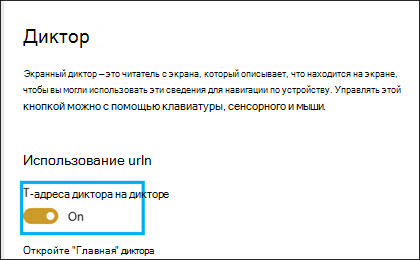

# Режим специальных возможностей SharePoint Syntex

В [SharePoint Syntex](index.md)пользователи могут включить режим доступности на всех этапах обучения модели (метка, поезд, тест) при работе с примерными документами. Использование режима доступности может помочь пользователям с низкой точки зрения упростить доступ к клавиатуре при навигации и метке элементов в просмотре документов.

Это помогает пользователям использовать свои клавиатуры для навигации по тексту в зрительном окантовке документа и услышать повествование не только выбранных значений, но и действий (например, маркировки или удаления меток из выбранного текста) или предсказания значений меток при подготовке модели дополнительными примерными документами. 

## Требования

Чтобы услышать звук повествования, включите приложение экранный диктор [в](https://support.microsoft.com/windows/complete-guide-to-narrator-e4397a0d-ef4f-b386-d8ae-c172f109bdb1) экранный диктор в Windows 10 системе.

## Маркировка для пользователей клавиатуры

Для пользователей клавиатуры с помощью режима доступности, если вы помечены текстом в примере документа в зритель, вы можете использовать следующие клавиши:

- Вкладка. Перемещает вас вперед и выбирает следующее слово.
- Tab + Shift: перемещает вас назад и выбирает предыдущее слово.
- Введите: Метка или удаление метки из выбранного слова.
- Правая стрелка. Перемещает вас вперед через отдельные символы в выбранном слове.
- Левая стрелка. Перемещает вас назад через отдельные символы в выбранном слове.

> [!NOTE]
> Если вы помечены несколькими словами для одной метки, необходимо пометить каждое слово.

## Повествование

Для экранный диктор пользователей, использующих режим доступности, используйте ту же навигацию клавиатуры, описанную для пользователей клавиатуры, чтобы просмотреть пример документа в зрительном окании.

При навигации по примеру документов и значениям строки меток экранный диктор пользователю будут даваться следующие звуковые подсказки:

- При использовании клавиатуры для навигации по просмотру документов экранный диктор будет заявят выбранную строку.
- В выбранной строке экранный диктор каждый символ в строке при выборе их с помощью клавиш правой или левой стрелки.
- Если выбрана строка, которая была помечена, экранный диктор будет указанить значение, а затем "помечено".  Например, если значение метки "Contoso", оно будет называться "Costoso метка". 
- На вкладке обучение при выборе строки для просмотра документов, которая только была предсказана, экранный диктор звук будет оговарить значение, а затем "предсказать". Это происходит, когда обучение предсказывает значение в файле, которое не совпадает с тем, что было помечено пользователем.
- На вкладке обучение при выборе строки для просмотра документов, которая была помечена и предсказана, экранный диктор звук будет оговарить значение, а затем "помечено и предсказано". Это происходит при успешном обучении и совпадении между прогнозируемым значением и меткой пользователя.

После того, как строка будет помечена или метка удалена в зритель, экранный диктор звук предупредит вас, чтобы сохранить изменения перед выходом.

## См. также

[Создание средства извлечения](create-an-extractor.md) 

[Создание классификатора](create-a-classifier.md) 

 

  
  

