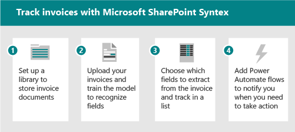

# Microsoft SharePoint Syntex adoption: Get startedMicrosoft SharePoint Syntex adoption: Get started

Думайте о том, что интеллектуальные службы контента, доступные в SharePoint Syntex, имеют три части:Think of the intelligent content services available in SharePoint Syntex as having three parts:

- **Понимание контента:** создание моделей AI без кода для классификации и извлечения информации из контента для автоматического применения метаданных для обнаружения и повторного использования знаний.**Content understanding:** create no-code AI models to classify and extract information from content to automatically apply metadata for knowledge discovery and reuse. Узнайте больше о [понимании контента.](document-understanding-overview.md)Learn more about [content understanding](document-understanding-overview.md).
- **Обработка контента:** Автоматизация захвата, ingestion и классификации контента и оптимизация процессов, ориентированных на контент, с помощью Power Automate.**Content processing:** Automate capture, ingestion, and categorization of content and streamline content-centric processes using Power Automate. Дополнительные материалы об [обработке контента.](form-processing-overview.md)Learn more about [content processing](form-processing-overview.md).
- **Соответствие требованиям контента:** Управление и управление контентом для улучшения безопасности и управления с помощью интеграции с Microsoft Information Protection.**Content compliance:** Control and manage content to improve security and governance with integration to Microsoft Information Protection.

С помощью новых служб и возможностей ИИ можно создавать приложения для понимания контента и классификации непосредственно в поток управления контентом с помощью SharePoint Syntex.With new AI services and capabilities, you can build content understanding and classification apps directly into the content management flow using SharePoint Syntex. Существует два различных способа понимания контента.There are two different ways of understanding your content. Тип модели, который вы используете, основан на формате файла и случае использования:The model type you use is based on file format and use case:

| Обработка формForm processing | Понимание документовDocument understanding |
|:-------|:-------|
| Создан из библиотеки документов.Created from document library. | Созданная в центре контента часть SharePoint Syntex.Created in the content center, part of SharePoint Syntex. |
| Модель, созданная в конструкторе ИИ.Model created in AI builder. | Модель, созданная в родном интерфейсе.Model created in native interface. |
| Используется для полуструктурных форматов файлов.Used for semi-structured file formats. | Используется для неструктурированных форматов файлов.Used for unstructured file formats. |
| Классификатор settable.Settable classifier. | Классификатор с необязательными экстракторами.Trainable classifier with optional extractors. |
| Ограничен одной библиотекой.Restricted to a single library. | Может применяться к нескольким библиотекам.Can be applied to multiple libraries. |
| Обучение в формате PDF, JPG, PNG общей стоимостью 50 МБ/500 pp.Train on PDF, JPG, PNG format, total 50 MB/500 pp. | Тренируйся по 5-10 PDF-файлам, Office или электронной почте, включая отрицательные примеры.Train on 5-10 PDF, Office, or email files, including negative examples. |

Для более полного сравнения возможностей см. разницу между пониманием документов и [моделями обработки форм.](difference-between-document-understanding-and-form-processing-model.md)For a more complete comparison of the capabilities, see [Difference between document understanding and form processing models](difference-between-document-understanding-and-form-processing-model.md).

## Определение пилотных бизнес-сценариев для оптимизацииIdentify pilot business scenarios to optimize

Чтобы подготовиться к использованию SharePoint Syntex в организации, сначала необходимо понять сценарии, в которых это будет полезно.To prepare for using SharePoint Syntex in your organization, you first need to understand the scenarios in which it will be useful. "Почему" помогает определить, какая модель будет нужна, и как структурировать свою организацию на основе того, где модель будет применяться.The "why" helps determine what model will be needed, and how to structure your org based on where the model will be applied. Вот несколько сценариев, в которых понимание документов может помочь организации:Here are a few scenarios where document understanding can help your organization:

- **Обработка контента:** Обработка контрактов, отчетов о работе и других документов, похожих на форму.**Content processing:** Process contracts, statements of work, and other form-like documents. Включите формы, обучите модель понимать поля и сопобирать их, а затем запустите формы, чтобы автоматически собирать данные.Intake the forms, train the model to understand and map the fields, and then run your forms through to automatically collect the data. Дополнительные сведения см. в [обзоре обработки форм.](form-processing-overview.md)For more information, see [Form processing overview](form-processing-overview.md).
- **Анализ счетов:** Извлеките соответствующие сведения из счетов и убедитесь, что они соответствуют политике или обрабатываются надлежащим образом.**Invoice analysis:** Pull out the relevant details from your invoices and make sure they're complying with policy or are being processed appropriately.

Подумайте о том, как SharePoint Syntex может помочь вашей организации:Think about ways that SharePoint Syntex can help your organization:

- Автоматизация бизнес-процессовAutomate business processes
- Повышение точности поискаImprove search accuracy
- Управление рисками соответствия требованиямManage compliance risk

При рассмотрении бизнес-сценариев задайте себе следующие вопросы:When thinking about which business scenarios to consider, ask yourself the following questions:

- Решает ли это реальную проблему?Does it solve a real problem?
- Будет ли он широко использоваться или будет иметь широкое влияние?Will it be widely used or have broad impact?
- Можно ли получить его?Is it obtainable?
- Можете ли вы измерить успех?Can you measure success?

Расставить приоритеты сценариев на основе влияния и простоты реализации.Prioritize scenarios based on impact and ease of implementation. Сделайте начальную область фокуса более высокими сценариями воздействия, которые также можно легко реализовать.Make your initial focus area higher impact scenarios that can also be easily implemented. Расставить приоритеты при снижении приоритетов сценариев воздействия, которые трудно реализовать.De-prioritize lower impact scenarios that are hard to implement.

Используйте следующие сценарии, чтобы подсказыть, как можно использовать SharePoint Syntex в организации.Use the following example scenarios to prompt ideas about how you can use SharePoint Syntex in your organization.

### Сценарий: отслеживание данных из счетов-фактур с обработкой формScenario: Track data from invoices with form processing

Например, вы можете настроить процесс с помощью функций SharePoint Syntex и Power Automate для отслеживания и мониторинга счетов-фактур.For example, you can set up a process using SharePoint Syntex and Power Automate features to track and monitor invoices.

1. Настройка библиотеки для хранения документов-фактур.Set up a library to store the invoice documents.
1. Обучение модели распознаванию полей в документах.Train the model to recognize fields in the documents.
1. Извлечение полей, которые необходимо отслеживать в списке.Extract the fields you want to track into a list.
1. Настройка потока для уведомления о определенных событиях, таких как:Set up a flow to notify you for specific events, such as:
    - Добавлен новый счет.A new invoice is added.
    - Счет-фактура засвечен.An invoice is past its due date.
    - Счет за сумму, которая превышает автоматическую сумму утверждения.An invoice is for an amount that's larger than your automatic approval amount.

При автоматизации этого сценария можно:When you automate this scenario, you can:

- Экономите время и деньги, автоматически извлекая данные из счетов, а не вручную.Save time and money by automatically extracting data from the invoices instead of doing it manually.
- Уменьшение потенциальных ошибок и обеспечение соответствия требованиям с помощью рабочего процесса для проверки счетов и уведомления о любых проблемах.Reduce potential errors and ensure better compliance by using workflows to check invoices and notify you of any issues.

### Сценарий: отслеживание сведений из контрактов с пониманием документовScenario: Track information from contracts with document understanding

В качестве другого примера можно настроить процесс определения контрактов, заключаемого вашей компанией с другими компаниями или отдельными лицами.As another example, you can set up a process to identify contracts your company has with other companies or individuals. Настройка модели для извлечения ключевых сведений из этих контрактов, таких как имя клиента, сборы, даты или другие важные сведения, а также добавление сведений в библиотеку в качестве полей, которые можно быстро просмотреть.Set up a model to extract key information from those contracts, such as the client name, fees, dates, or other important information, and add the information to the library as fields you can quickly view. Нанесите метку хранения в библиотеку документов, чтобы убедиться, что контракты не могут быть удалены до определенного времени для соответствующего соблюдения бизнес-правил.Apply a retention label on the document library to ensure that contracts can't be deleted before a specific length of time for appropriate compliance with your business regulations.

1. Начните с центра контента и создайте новую модель понимания документов для контрактов.Start at the content center and create a new document understanding model for contracts.
1. Загрузите примеры документов для положительных и отрицательных примеров, а затем запустите обучение, чтобы определить контрактные документы и просмотреть результаты.Upload sample documents for positive and negative examples, then run the training to identify contract documents and review the results.
1. Обучаем извлечения для определения полей в контрактах, таких как имя клиента, плата и дата, а затем протестировать экстрактор.Train the extractor to identify fields in the contracts, such as the client name, fee, and date, and then test the extractor.
1. По завершению модели примените модель к библиотеке, в которой можно загрузить контракты.When the model is complete, apply the model to a library where you can upload contracts.
1. Нанесите метку хранения на поле дат, чтобы контракты сохранялись в библиотеке в течение необходимого времени.Apply a retention label to the date field, so that contracts are retained in the library for the required length of time.

При автоматизации этого сценария можно:When you automate this scenario, you can:

- Экономите время и деньги, автоматически извлекая данные из контрактов, а не вручную.Save time and money by automatically extracting data from the contracts instead of doing it manually.
- Обеспечение соответствия требованиям с помощью меток хранения для обеспечения надлежащего хранения контрактов.Ensure better compliance by using retention labels to ensure that the contracts are retained appropriately.

### Сценарий: избегайте рисков при управлении записями, управлении документами и процессах соответствия требованиям на основе SharePoint SyntexScenario: Avoid risk with records management, document governance, and compliance processes based on SharePoint Syntex

Снижение рисков является общей целью для большинства компаний.Reducing risks is a common goal for most companies. Возможно, потребуется:You might need:

- Лучший способ обеспечения и обеспечения информационного управления в клиенте.A better way to provide/enforce information governance across your tenant.
- Усовершенствовать систему классификации документов, электронных писем и других форм связи, которые считаются "записями" для проектов.To improve the system for classification of documents, emails and other forms of communication considered ‘records’ for projects.
- Аудит квитанций, контрактов и так далее для обеспечения соответствия политикам компании.To audit receipts, contracts, and so on, to ensure compliance with company policies.
- Чтобы убедиться, что у проектов есть вся документация, необходимая для соответствия требованиям.To ensure that projects have all the documentation required for compliance.

Настройка некоторых процессов для соответствия требованиям SharePoint Syntex для захвата и надлежащей классификации, аудита и флага документов и форм, которые требуют более эффективного управления.Set up some processes for compliance with SharePoint Syntex to capture and appropriately classify, audit, and flag documents and forms that need better governance. Вы можете полагаться на SharePoint Syntex, чтобы автоматически классифицировать контент, а не полагаться на то, что конечные пользователи будут вручную тегировать или команда соответствия требованиям вручную применять правила управления и архивировать.You can rely on SharePoint Syntex to auto classify content rather than relying on end users to manually tag, or the compliance team to manually apply governance rules and archiving. Вы также можете включить упрощенный режим поиска, управлять объемами данных, применять политики управления записями и хранения, обеспечивать соответствие требованиям, а также применять методы архива и чистки.And you can enable a simplified search experience, manage data volumes, apply records management and retention policies, ensure compliance, and best practice archiving and purging practices.

Когда вы автоматизируете этот сценарий, вы можете чувствовать себя в безопасности, что:When you automate this scenario, you can feel secure that:

- Соответствие требованиям поддерживаются, а риск снижается.Compliance is upheld and risk is reduced.
- Управление таксономией и записями применяется последовательно и точно.Taxonomy and records management is consistently and accurately applied.
- Контролируются объемы контента.Content volumes are controlled.
- Сотрудники могут легко найти нужные сведения в нужном контексте.Employees can easily discover the right information in the right context.

### Сценарий: захват сведений из ранее недоступных документовScenario: Capture information from previously inaccessible documents

Большинство организаций имеют большие репозитории юридических документов, политик, контрактов, кадровой документации и руководства по управлению.Most organizations have large repositories of legal documents, policies, contracts, HR documents, and governance guidelines. Мои эти хранилища данных для извлечения ценных сведений, таких как: проекты, сектора, темы, люди, географические области и так далее.Mine these data stores to extract valuable information such as: projects, sectors, themes, people, geographical areas, and so on.

Например, директору отдела кадров необходимо быстро получить доступ ко всем hr-документам, включая резюме, политики кадров и другие формы.For example, an HR director needs to quickly access all HR documents – including resumes, HR policies, and other forms. Кроме того, они хотят быстро определить необходимые сведения из резюме и других документов, связанных с персоналом, без ручного сеяния документов.And they want to quickly identify necessary information from resumes and other HR-related documents without manually sifting through the documents. Они ищут решение, которое позволяет им быстро находить необходимую информацию без необходимости вручную искать тысячи резюме, политики кадров и другую документацию, которая может быть распространена на нескольких сайтах.They’re looking for a solution that allows them to quickly find the information they need without having to manually look through thousands of resumes, HR policies, and other documentation that may be spread across several sites.

При автоматизации этого сценария можно:When you automate this scenario, you can:

- Разблокировка знаний из цифрового контента.Unlock knowledge from digital content.
- Классифицировать политики, резюме, документы о продажах, технические чертежи, планы учетных записей и извлечение сведений.Classify HR policies, resumes, sales documents, technical blueprints, account plans and extract information.
- Быстро найдите правильные сведения или документ, которые вы ищете.Quickly find the correct information or document that you’re looking for.
- Получите мгновенный доступ к последней информации.Get instant access to the latest information.
- Сократите время поиска.Reduce search times.

### Сценарий. Улучшение обработки данных для предоставления & аналитикиScenario: Improve data processing to provide insights & analytics

Например, фармацевтическая компания может использовать SharePoint Syntex для извлечения информации из документов FDA для ответа на вопросы, которые есть у их руководителей.For example, a pharmaceutical company could use SharePoint Syntex to extract information from FDA documents to answer questions that their leaders have. Более легкодоступные ответы могут сократить время, необходимое для получения этих ответов, и повысить доступность данных для получения более точных ответов на вопросы руководства.Having the answers more easily accessible can reduce the time needed to produce these answers and increase the availability of data to generate more accurate answers to leadership questions.

Например, руководитель проекта должен быстро предоставить ответы на вопросы, связанные с продуктом, из моей команды руководства.For example, a project manager needs to quickly provide answers to product-related questions from my leadership team. Им необходимо найти сведения и метрики, связанные с запросами в одной консолидированной панели мониторинга.They need to find information and metrics related to queries in one consolidated dashboard. Они ищут решение, которое извлекает необходимую информацию из меток продуктов, брошюр продуктов и других материалов и создает консолидированный отчет, который они могут использовать при отчитывающейся группе руководства.They’re looking for a solution that extracts the information they need from product labels, product pamphlets, and other materials and generates a consolidated report that they can use when reporting back to their leadership team.

При автоматизации этого сценария можно:When you automate this scenario, you can:

- Сократите время для получения ответов.Reduce time to produce answers.
- Повышение доступности данных.Increase availability of data.
- Предоставление более точных ответов.Provide more accurate answers.

### Сценарий: автоматизация обработки заказовScenario: Automate order processing

Благодаря SharePoint Syntex можно сократить время ручной обработки заказов клиентов.With SharePoint Syntex, you can reduce the time of manual processing of customer orders. Например, вы можете загружать заказы из факса, электронной почты или бумаги в SharePoint с помощью обработки OCR, а затем извлекать метаданные из этих заказов, чтобы вы могли выполнять их с помощью автоматизированных процессов.For example, you can upload orders from fax, email, or paper into SharePoint by using OCR processing and then extract the metadata from those orders so you can fulfill them by using automated processes.

Например, руководитель цепочки поставок хочет уменьшить количество ошибок, вызванных вводом данных вручную.For example, a supply chain manager wants to reduce errors caused by manual data entry. Они хотят избегать ручного просмотра и ввода данных входящие клиенты (бумажные, факсимиловые или электронные сообщения), чтобы уменьшить количество ошибок при входе в бизнес-системы.They want to avoid manual review and data entry of inbound customer orders (paper, fax, or e-mail) to reduce errors going into their business systems. Они хотят, чтобы решение, применяее методы ИИ и машинного обучения, проверяли входящие сведения о порядке, извлекали основные данные и автоматически нажимали их в свою систему ERP для выполнения и согласования заказов.They want a solution that applies AI and machine learning techniques to validate incoming order information, extract core data and automatically push it into their ERP system, for order fulfillment and reconciliation.

При автоматизации этого сценария можно убедиться, что:When you automate this scenario, you can ensure that:

- Повышается точность заказа и отгрузки.Order and shipment accuracy increases.
- Уменьшаются сборы или штрафы, связанные с ошибками заказа или отправки.Fees or penalties associated to order or shipment errors are reduced.
- Задержки в взимание или оплата уменьшаются.Delays in invoicing or payments decrease.
- Сокращаются затраты на персонал.Personnel costs are reduced.

### Сценарий: упрощение процесса продления визыScenario: Simplify visa renewal process

SharePoint Syntex поможет вам автоматизировать напоминания и обновления для ключевых сведений о контракте.SharePoint Syntex can help you automate reminders and renewals for key contract information. Например, директору отдела кадров необходимо убедиться, что визы сотрудников обновляются и/или обновляются вовремя.For example, an HR director needs to ensure that employees’ visas are up to date and/or renewed on time. Они хотят предоставить людям простой и интуитивно понятный процесс обновления виз.They want to give people a simple and intuitive process for updating their Visas. Им нужно решение, которое извлекает даты продления из контрактов и автоматически отправляет напоминания сотрудникам, когда приближаются даты их продления.They need a solution that extracts renewal dates from contracts and automatically sends employees reminders when their renewal dates are approaching.

При автоматизации этого сценария можно убедиться, что:When you automate this scenario, you can ensure that:

- Снижается уровень несоблюдения.The levels of non-compliance are reduced.
- Количество ручных напоминаний уменьшается.The number of manual reminders is reduced.
- Уменьшается количество штрафов за несоблюдение.The number of fines for non-compliance is reduced.

## Определение ролей & обязанностейIdentify roles & responsibilities

Определите, кто в организации будет создавать и управлять моделями?Determine who in your organization will build and manage the models? Могут быть задействованы следующие роли:The following roles might be involved:

| Администратор SharePoint/KnowledgeSharePoint/Knowledge admin | Администратор Power PlatformPower Platform admin | Менеджер знанийKnowledge manager | Владелец моделиModel owner |
|:-------|:-------|:-------|:-------|
| Роль AADAAD role| Роль AADAAD role | Роль AADAAD role | ЛидерыChampions |
| Настройка обработки формConfigure form processing | Настройка среды общей службы данных для обработки формConfigure Common data service environment for form processing | Сбор случаев использованияGather use cases | Сбор дел по использованию бизнесаGather business use cases |
| Управление центрами контента и разрешениямиManage content centers and permissions| Покупка и выделение кредитов AIBPurchase and allocate AIB credits | Создание наилучшей практики и анализ моделей обзоровEstablish best practices and review model analytics | Создание и применение моделейCreate and apply models |

Менеджер знаний, владелец бизнес-процессов и владелец модели контента создают примерные модели и утверждение чемпиона в организации.Knowledge manager, Business Process Owner and Content model owner create sample models and champion adoption in the organization.
Другие, которые могут быть вовлечены: администратор соответствия требованиям, менеджеры таксономии.Others who may be involved: Compliance admin, Taxonomy managers.

Где будут создаваться и применяться модели?Where will they build and apply the models? Существуют ли существующие процессы или репозитории, которые можно усовершенствовать?Are there existing processes or repositories that could be enhanced?

- Обработка форм. Определите, какие сайты получат действие обработки форм.Form processing: Decide which sites will get Form processing action.
- Понимание документов. Можно создать несколько центров контента для различных бизнес-областей.Document understanding: You can create multiple content centers for different business areas.

## Стратегическое позиционированиеStrategic positioning

Работа с заинтересованными сторонами, чтобы убедиться, что они соответствуют стратегии использования SharePoint Syntex.Work with stakeholders to make sure they are aligned on the strategy for using SharePoint Syntex. Исследование и предоставление следующих ресурсов, которые помогут в этом позиционировании:Research and provide the following resources to help with this positioning:

- Бизнес-результаты:Business outcomes:
  - Потенциальные финансовые результатыPotential fiscal outcomes
  - Потенциальные результаты гибкостиPotential agility outcomes
  - Шаблон бизнес-результатовBusiness outcome template
- Участие в покупке/согласовании спонсоров и спонсоров ExecStakeholders/Exec sponsor buy-in/alignment
  - Колоды бизнес-кейсовBusiness case decks
  - Финансовые моделиFinancial models
  - Готовность компании — культураCompany readiness - culture

## Определение круга заинтересованных лицIdentify stakeholders

Определите заинтересованных лиц для проекта.Identify the stakeholders for your project.

|РольRole |ОбязанностиResponsibilities |DepartmentDepartment |
|:-------|:-------|:--------|
| Исполнительный спонсор (s)Executive sponsor(s)   | Связь с видением и значениями высокого уровня для компанииCommunicate high-level vision and values to the company   |  РуководствоExecutive leadership   |
| Руководство проекта (s)Project lead(s) | Контроль за всем процессом выполнения и выполнения запускаOversee the entire launch execution and rollout process | Управление проектамиProject management |
| Администраторы знанийKnowledge administrators| Создание и управление центрами контентаCreate and manage the content centers | ИТ-отдел или другой отделIT or other department|
| Менеджеры контента и владельцы моделейContent managers and model owners| Сбор случаев использования и создание и применение моделейGather use cases and create and apply models | Любой отделAny department|
| ЛидерыChampions | Помощь в евангелизации и управлении обработкой возраженийHelp evangelize and manage objection handling | Любой отдел (персонал)Any department (staff) |
| Администратор клиентаTenant administrator | Настройка параметров уровня клиентаConfigure tenant-level settings | ИТ-отделIT department|
| Администратор Power PlatformPower Platform administrator| Настройка общей среды служб данныхConfigure common data services environment | ИТ-отделIT department|

> [!Note]
> Хотя мы рекомендуем выполнять каждую из этих ролей на протяжении всего выполнения, вы можете обнаружить, что вам не требуется, чтобы все они начали работу с идентифицированным решением.Though we recommend having each of these roles fulfilled throughout your rollout, you may find that you don't require them all to get started with your identified solution.

## Контрольный список готовностиReadiness checklist

Чтобы быть готовым к реализации SharePoint Syntex, необходимо:To get ready for implementing SharePoint Syntex, you need to:

1. Планирование конечных состоянияPlan the end state
    - Модели понимания документов — это средства, а не конец.Document understanding models are the means, not the end.
    - Планирование использования значения извлеченных метаданных с помощью:Plan for harnessing the value of extracted metadata with:
      - ПоискSearch
      - Фильтрация и форматирование представленийFiltering and view formatting
      - Соответствие требованиямCompliance
      - АвтоматизацияAutomation
2. ОпределениеIdentify
    - Сведения о существующей информационной архитектуре и использовании функций управления контентом.Understand existing information architecture and content management feature use.
    - Являются ли существующие типы контента хорошими кандидатами для моделей?Are any existing content types good candidates for models?
    - Какие существующие процессы будут улучшены с помощью метаданных?What existing processes would be improved by metadata?
3. РазработкаDesign
    - Разработка подхода к информационной архитектуре, управляемым метаданным и типам контентаDesign your approach to information architecture, managed metadata and content types
    - Разработка процесса определения, создания, управления.Design the process for definition, creation, management.

## Вовлечение организацииEngage your organization

1. Определите владельцев долей, подтвердим сценарии и разработайте план проекта.Identify stake holders, confirm scenarios, and develop project plan.
1. Настройка параметров и применение лицензий.Configure settings and apply licenses.
1. Начало осведомленности и подготовки — набор чемпионов.Begin awareness and training – Recruit Champions.
1. Раскатывать поэтапно.Roll out in stages.  
1. Сбор отзывов и итерации.Gather feedback and iterate.
1. По мере роста использования планируйте любые кредиты AI Builder по мере необходимости.As usage grows plan for any AI Builder credits as needed.
