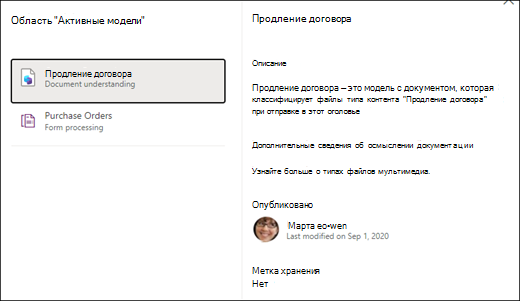
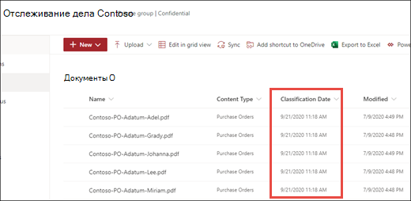
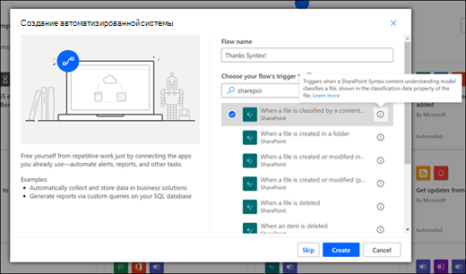

# Применение модели осмысления документации в Microsoft SharePoint Syntex

 

> [!VIDEO https://www.microsoft.com/videoplayer/embed/RE4CSoL]

 

После публикации модель осмысления документации можно применить к одной или нескольким библиотекам документов SharePoint в клиенте Microsoft 365.

> [!NOTE]
> Вы можете применить модель только к тем библиотекам документов, к которым у вас есть доступ.

## Примените модель к библиотеке документов.

Чтобы применить модель к библиотеке документов SharePoint, выполните указанные ниже действия.

1. На домашней странице модели на плитке **Применение модели к библиотекам** выберите **Опубликовать модель**. Вы также можете выбрать пункт **+ Добавить библиотеку** в разделе **Библиотеки с этой моделью**.  

     

2. Затем вы можете выбрать сайт SharePoint, содержащий библиотеку документов, к которой нужно применить модель. Если сайт не отображается в списке, используйте поле поиска, чтобы найти его. 

     

    > [!NOTE]
    > Вам потребуются разрешения *Управление списком* или права на *редактирование* для библиотеки документов, к которой применяется модель. 

3. Выбрав сайт, выберите библиотеку документов, к которой нужно применить модель. В приведенном примере выберите библиотеку документов *Документы* на сайте *Отслеживание обращения в Contoso*. 

     

4. Поскольку модель связана с типом контента, при ее применении к библиотеке будет добавлен тип контента и его представление с извлеченными метками в виде столбцов. Это представление по умолчанию является представлением библиотеки по умолчанию, но при желании можно не использовать его как таковое. Для этого выберите **Дополнительные параметры** и отмените выбор пункта **Использовать это новое представление по умолчанию**. 

     

5. Нажмите кнопку **Добавить**, чтобы применить модель к библиотеке. 
6. На домашней странице модели в разделе **Библиотеки с этой моделью** вы увидите URL-адрес указанного сайта SharePoint. 

     

7. Перейдите в библиотеку документов и убедитесь, что вы находитесь в представлении библиотеки документов, к которой применяется модель. Обратите внимание, что при нажатии кнопки сведений рядом с именем библиотеки документов появляется сообщение о том, что к библиотеке документов применена модель.

      

    Чтобы просмотреть подробные сведения о любой модели, примененной к библиотеке документов, выберите **Просмотр активных моделей**.

8. В области **Активные модели** можно просмотреть модели, примененные к библиотеке документов. Выберите модель, чтобы просмотреть дополнительные сведения о ней, например описание модели, кто ее опубликовал, а также сведения о том, применяет ли модель метку хранения к файлам, которые она классифицирует.

      

После применения модели к библиотеке документов можно начать отправку документов на сайт и просмотр результатов.

Модель определяет все файлы со связанным типом контента и выводит их в представлении. Если модель содержит средства извлечения, в представлении отображаются столбцы для данных, извлекаемых из каждого файла.

### Применение модели к файлам, уже находящимся в библиотеке документов

В результате применения модели выполняется обработка всех файлов, отправленных в библиотеку документов. Чтобы запустить модель для файлов, которые уже находились в библиотеке документов до применения модели, выполните указанные ниже действия.

1. В библиотеке документов выберите файлы, которые нужно обработать с помощью модели.
2. После того как вы выберете файлы, на ленте библиотеки документов появится элемент **Классификация и извлечение**. Выберите элемент **Классификация и извлечение**.
3. Выбранные файлы будут добавлены в очередь на обработку.

        

> [!NOTE]
> Вы можете скопировать отдельные файлы в библиотеку и применить их к модели, но не к папкам.

### Поле "Дата классификации"

Если к библиотеке документов применяется модель обработки форм или осмысления документации SharePoint Syntex, поле <b>Дата классификации</b> добавляется в схему библиотеки. По умолчанию это поле не заполнено, но если документы обрабатываются и классифицируются моделью, в это поле будет добавлена метка даты и времени завершения. 

     

Поле "Дата классификации" используется [триггером <b>Когда файл классифицируется моделью осмысления контента</b>](https://docs.microsoft.com/connectors/sharepointonline/#when-a-file-is-classified-by-a-content-understanding-model) для запуска потока Power Automate, после того как модель осмысления контента Syntex завершит обработку файла и обновление поля "Дата классификации".

    

Затем триггер <b>Когда файл классифицируется моделью осмысления контента</b> можно использовать для запуска другого рабочего процесса с использованием любой извлеченной из файла информации.

## См. также
[Создание классификатора](create-a-classifier.md)

[Создание средства извлечения](create-an-extractor.md)

[Общие сведения об осмыслении документации](document-understanding-overview.md)

