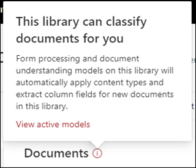

# Применение модели "Общие сведения о документе" (Предварительная версия)

> [!Note] 
> Содержимое этой статьи предназначено для Кортексного предварительного просмотра Project. [Узнайте больше о Кортекс Project](https://aka.ms/projectcortex).

 

> [!VIDEO https://www.microsoft.com/videoplayer/embed/RE4CSoL]

 

После публикации этой модели можно применить ее к библиотеке документов SharePoint в клиенте Microsoft 365.

> [!Note]
> Вы сможете применить модель только к библиотекам документов, к которым у вас есть доступ.

## Примените модель к библиотеке документов.

Чтобы применить модель к библиотеке документов SharePoint, выполните следующие действия:

1. На плитке " **применить модель к библиотекам** " на плитке Главная страница модели выберите пункт **опубликовать модель**. Кроме того, вы можете выбрать  **+ Добавить библиотеку** в разделе **библиотеки с этой моделью** .  

     

2. Затем можно выбрать сайт SharePoint, содержащий библиотеку документов, к которой требуется применить модель. Если сайт не отображается в списке, используйте поле поиска, чтобы найти его. 

     

    > [!Note]
    > Необходимо иметь разрешения на *Управление списками* или *изменить* права для библиотеки документов, к которой применяется модель. 

3. После выбора сайта необходимо выбрать библиотеку документов, к которой требуется применить модель. В этом примере мы выбираете *библиотеку документов Documents на сайте* *отслеживания дел Contoso* . 

     

4. Так как модель связана с типом контента, при его применении к библиотеке он создаст представление для типа контента с метками, которые вы извлекли в виде столбцов. Это представление по умолчанию будет представлением библиотеки по умолчанию, но при желании можно не использовать представление по умолчанию, выбрав **Дополнительные параметры** и отменить **установку нового представления по умолчанию**. 

     

5. Нажмите кнопку **Добавить** , чтобы применить модель к библиотеке. 
6. На домашней странице модели в разделе **библиотеки с данной моделью** отображается URL-адрес сайта SharePoint, указанного в списке. 

     

7. Перейдите в библиотеку документов и убедитесь, что вы используете представление "Библиотека документов" модели. Обратите внимание, что если нажать кнопку сведения рядом с именем библиотеки документов, появится сообщение о том, что модель применена к библиотеке документов.

      

После применения модели к библиотеке документов можно начать отправку документов на сайт и просмотр результатов.

Модель будет определять все файлы с типом контента, связанные с моделью, и будет отображать их в представлении. Если в вашей модели есть средства извлечения, представление будет отображать столбцы для извлекаемых данных из каждого файла.

### Применение модели к файлам, уже включенным в библиотеку документов

Несмотря на то, что примененная модель будет обрабатывать все файлы, отправленные в библиотеку документов после применения, можно также выполнить следующие действия, чтобы запустить модель для файлов, которые уже существовали в библиотеке документов перед применением модели:

1. В библиотеке документов выберите файлы, которые будут обрабатываться моделью.
2. После выбора файлов **классификация и извлечение** отобразятся на ленте библиотека документов. Выберите **классифицировать и извлечь**.
3. Выбранные файлы будут добавлены в очередь для обработки.

        

## См. также
[Создание классификатора](create-a-classifier.md) 
[Создание средства извлечения](create-an-extractor.md) 
[Общие сведения о документе](document-understanding-overview.md) 
[Создание модели обработки форм](create-a-form-processing-model.md)  

