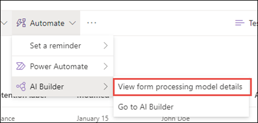

# Применение метки хранения к модели в SharePoint SyntexApply a retention label to a model in SharePoint Syntex

 

> [!VIDEO https://www.microsoft.com/videoplayer/embed/RE4GydO]  

 

Вы можете легко применить [метку хранения](../compliance/retention.md) к модели в Microsoft SharePoint Syntex.You can easily apply a [retention label](../compliance/retention.md) to a model in Microsoft SharePoint Syntex. Вы можете это сделать как для модели осмысления документации, так и для модели обработки форм.You can do this for both document understanding and form processing models.

Метки хранения позволяют применить параметры хранения к документам, определяемым моделями.Retention labels let you apply retention settings to the documents that your models identify.  Например, вы хотите, чтобы ваша модель не только определяла любые документы с *уведомлением о страховании*, которые загружаются в вашу библиотеку документов, но также применяла к ним тег хранения *Бизнес*, чтобы эти документы нельзя было удалить из библиотеки документов в течение указанного периода времени (например, в течение следующих пяти месяцев).For example, you want your model to not only identify any *Insurance notice* documents that are uploaded to your document library, but to also apply a *Business* retention tag to them so that these documents cannot be deleted from the document library for the specified time period (the next five months, for example).

Вы можете применить существующую метку хранения к вашей модели с помощью параметров модели на ее домашней странице.You can apply a pre-existing retention label to your model through your model settings on your model's home page. 

> [!Important]
> Чтобы метки хранения были доступны для применения к вашей модели осмысления документации, они должны быть [созданы и опубликованы в Центре соответствия требованиям Microsoft 365](../compliance/create-apply-retention-labels.md#how-to-create-and-publish-retention-labels).For retention labels to be available to apply to your document understanding models, they need to be [created and published in the Microsoft 365 Compliance Center](../compliance/create-apply-retention-labels.md#how-to-create-and-publish-retention-labels).

## Чтобы добавить метку хранения к модели понимания документа, выполните следующие действия:To add a retention label to a document understanding model

1. На домашней странице модели выберите **Параметры модели**.From the model home page, select **Model settings**. 
2. В **Параметрах модели**, в разделе **Безопасность и соответствие требованиям** выберите меню **Метка хранения**, чтобы просмотреть список меток хранения, которые можно применить к модели.In **Model settings**, in the **Security and compliance** section, select the **Retention label** menu to see a list of retention labels that are available for your to apply to the model. 
   
3. Выберите метку хранения, которую вы хотите применить к модели, и нажмите кнопку **Сохранить**.Select the retention label you want to apply to the model, and then select **Save**. 

Добавив метку хранения к модели, вы можете применить ее к:After applying the retention label to your model, you are able to apply it to a:
- Новой библиотеке документовNew document library
- Библиотеке документов, к которой уже применена модельDocument library to which the model is already applied
 
## Примените метку хранения к библиотеке документов, к которой уже применена модельApply the retention label to a document library to which the model is already applied

Если модель понимания документа уже была применена к библиотеке документов, вы можете выполнить следующие действия, чтобы синхронизировать обновление метки хранения, чтобы применить его к библиотеке документов:If your document understanding model has already been applied to a document library, you can do the following to sync your retention label update to apply it to the document library: 

1. На домашней странице модели в разделе **Библиотеки с этой моделью**, выберите библиотеку документов, к которой вы хотите применить обновление метки хранения.On your model home page, in the **Libraries with this model** section, select the document library to which you want to apply the retention label update.   
2. Выберите команду **Синхронизировать**.Select **Sync**.  
   

После применения обновления и его синхронизации с моделью вы можете подтвердить, что оно было применено, выполнив следующие действия:After applying the update and syncing it to your model, you can confirm that it has been applied by doing the following:

1. В Центре содержимого в разделе **Библиотеки с этой моделью**, щелкните библиотеку, к которой была применена обновленная модель.In the content center, in the **Libraries with this model** section, click on the library to which your updated model was applied.  
2. В представлении «Библиотека документов» щелкните значок сведений, чтобы проверить свойства модели.In your document library view, select the information icon to check the model properties.   
3. В списке **Активные модели** выберите обновленную модель.In the **Active models** list, select your updated model. 
4. В разделе **Метка хранения** будет указано имя примененной метки хранения.In the **Retention label** section you will see the name of the applied retention label. 

На странице представления модели в библиотеке документов будет отображаться новая **Метка хранения**.On your model's view page in your document library, a new **Retention label** column will display.  Поскольку ваша модель классифицирует файлы, которые она идентифицирует как принадлежащие к своему типу контента, и перечисляет их в представлении библиотеки, в столбце «Метка хранения» также отображается имя метки хранения, которая была применена к ней через модель.As your model classifies files it identifies as belonging to it's content type and lists them in the library view, the Retention label column will also display the name of the retention label that has been applied to it through the model.

Например, ко всем документам с *уведомлением о страховании*, которые определяет ваша модель, также будет применена метка хранения *Бизнес*, предотвращающая их удаление из библиотеки документов в течение пяти месяцев.For example, all *Insurance notice* documents that your model identifies will also have the *Business* retention label applied to them, preventing them from being deleted from the document library for five months. При попытке удалить файл из библиотеки документов будет отображаться сообщение о том, что это запрещено из-за примененной метки сохранения.If an attempt is made to delete the file from the document library, an error will display saying it is not allowed because of the applied retention label.

## Добавление метки хранения в модель обработки формTo add a retention label to a form processing model

> [!Important]
> Чтобы метки хранения были доступны для применения к вашей модели обработки форм, они должны быть [созданы и опубликованы в Центре соответствия требованиям Microsoft 365](../compliance/create-apply-retention-labels.md#how-to-create-and-publish-retention-labels).For retention labels to be available to apply to your form processing model, they need to be [created and published in the Microsoft 365 Compliance Center](../compliance/create-apply-retention-labels.md#how-to-create-and-publish-retention-labels).

Метку хранения можно применить к модели обработки форм при создании модели или применить ее к существующей модели.You can either apply a retention label to a form processing model when you are creating a model, or apply it to an existing model.

### Добавление метки хранения при создании модели обработки формTo add a retention label when you create a form processing model

1. При [создании модели обработки форм](./create-a-form-processing-model.md) выберите <b>Дополнительные параметры</b>.When you are [creating a new form processing model](./create-a-form-processing-model.md), select <b>Advanced settings.</b>
2. В области <b>Дополнительные параметры</b> в разделе <b>Метка хранения</b> откройте меню и выберите метку хранения, которую нужно применить к модели.</b>In <b>Advanced settings</b>, in the <b>Retention label</b> section, select the menu and then select the retention label you want to apply to the model.</b>

 
      

3.  Завершив настройку оставшихся параметров модели, выберите <b>Создать</b>, чтобы создать модель.After you've completed your remaining model settings, select <b>Create</b> to build your model.

### Добавление метки хранения в существующую модель обработки формTo add a retention label to an existing form processing model

Вы можете добавить метку хранения в существующую модель обработки форм разными способами:You can add a retention label to an existing form processing model in different ways:
- В меню автоматизации в библиотеке документовThrough the Automate menu in the document library
- В параметрах активной модели в библиотеке документовThrough the Active model settings in the document library 

#### Добавление метки хранения в существующую модель обработки форм в меню автоматизацииTo add a retention label to an existing form processing model through the Automate menu

Вы можете добавить метку хранения в существующую модель обработки форм, которой вы владеете, с помощью меню автоматизации в библиотеке документов, к которой применяется модель.You can add a retention label to an existing form processing model that you own through the Automate menu in the document library in which the model is applied.

1. В библиотеке документов, к которой применяется модель обработки форм, откройте меню <b>Автоматизация</b>, выберите <b>AI Builder</b> и нажмите <b>Просмотр сведений о модели обработки форм</b>.In your document library to which the form processing model is applied, select the <b>Automate</b> menu, select <b>AI Builder</b>, then select <b>View form processing model details</b>.

    

2. В сведениях о модели в разделе <b>Метка хранения</b> выберите метку хранения, которую нужно применить.In the model details, in the <b>Retention Label</b> section, select the retention label you want to apply.  Нажмите <b>Сохранить</b>.Then select <b>Save</b>.

       

#### Добавление метки хранения в существующую модель обработки форм в параметрах активной моделиTo add a retention label to an existing form processing model in the active model settings

Вы можете добавить метку хранения в существующую модель обработки форм, которой вы владеете, с помощью параметров активной модели в библиотеке документов, к которой применяется модель.You can add a retention label to an existing form processing model that you own through the Active model settings in the document library in which the model is applied.

1. В библиотеке документов SharePoint, к которой применяется модель, щелкните значок <b>Просмотреть активные модели</b> и выберите <b>Просмотреть активные модели</b>.</b>In the SharePoint document library in which the model is applied, select the <b>View active models</b> icon, and then select <b>View active models</b>.</b>

     

2. В разделе <b>Активные модели</b> выберите модель обработки форм, к которой нужно применить метку хранения.In <b>Active models</b>, select the form processing model to which you want to apply the retention label.

       

3. В сведениях о модели в разделе <b>Метка хранения</b> выберите метку хранения, которую нужно применить.In the model details, in the <b>Retention Label</b> section, select the retention label you want to apply.  Нажмите <b>Сохранить</b>.Then select <b>Save</b>.

> [!NOTE]
> Чтобы вносить изменения в области параметров модели, вы должны быть владельцем модели.You must be the model owner for the model settings pane to be editable. 

## См. такжеSee Also
[Создание классификатораCreate a classifier](create-a-classifier.md)

[Создание средства извлеченияCreate an extractor](create-an-extractor.md)

[Общие сведения об осмыслении документацииDocument Understanding overview](document-understanding-overview.md)
