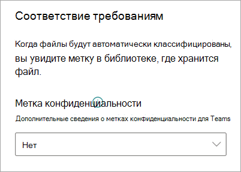

# Применение метки конфиденциальности к модели в Microsoft SharePoint Syntex

Вы можете легко применить [метку конфиденциальности ](../compliance/sensitivity-labels.md) к модели осмысления документации в Microsoft SharePoint Syntex. Эта функция пока недоступна для моделей обработки форм.

Метки конфиденциальности позволяют применять политики шифрования, общего доступа и условного доступа к документам, выявленным вашими моделями. Например, вы хотите, чтобы модель не только выявляла финансовые загруженные в библиотеку документы, содержащие номера банковских счетов или кредитных карт, но и применяла к ним метку конфиденциальности *Шифрование*, чтобы ограничить доступ к этому содержимому и его использование. Модели Syntex следуют правилам, регулирующим [порядок меток](../compliance/apply-sensitivity-label-automatically.md?view=o365-worldwide#how-multiple-conditions-are-evaluated-when-they-apply-to-more-than-one-label), а также не меняют существующие метки, вручную примененные пользователем к файлу. 

Вы можете применить уже существующую метку хранения к своей модели, используя параметры модели на ее домашней странице. Чтобы стать доступной для выбора в параметрах модели, метка должна быть опубликована.

> [!Important]
> Чтобы метки хранения стали доступны для применения к вашей модели осмысления документации, они должны быть [созданы и опубликованы в Центре соответствия требованиям Microsoft 365](../business-video/create-sensitivity-labels.md).

## Применение метки хранения к модели осмысления документации

1. На домашней странице модели выберите **Параметры модели**.

   

2. В области **Параметры модели**, в разделе **Безопасность и соответствие требованиям**, выберите **Метка конфиденциальности**, чтобы просмотреть список меток конфиденциальности, доступных для применения к модели.

    

3. Выберите метку конфиденциальности, которую хотите применить к модели, и нажмите кнопку **Сохранить**.

После применения метки конфиденциальности к модели ее можно применить к:

- Новой библиотеке документов
- Библиотеке документов, к которой уже применена модель
 
### Примените метку конфиденциальности к библиотеке документов, к которой уже применена модель

Если модель осмысления документации уже была применена к библиотеке документов, вы можете выполнить следующие действия, чтобы синхронизировать обновление метки конфиденциальности и применить ее к библиотеке документов:

1. На домашней странице модели в разделе **Библиотеки с этой моделью**, выберите библиотеку документов, к которой хотите применить обновление метки конфиденциальности.

2. Выберите **Синхронизировать**.

   

После применения обновления и его синхронизации с моделью вы можете удостовериться, что оно было применено, выполнив следующие действия:

1. В Центре содержимого в разделе **Библиотеки с этой моделью** щелкните библиотеку, к которой была применена обновленная модель. 

2. В представлении «Библиотека документов» щелкните значок сведений, чтобы проверить свойства модели.

3. В списке **Активные модели** выберите обновленную модель.

4. В разделе **Метки конфиденциальности** вы увидите имя примененной метки конфиденциальности.

На странице представления модели в библиотеке документов будет показана новая **Метка конфиденциальности**. Поскольку ваша модель классифицирует файлы, выявленные ею как принадлежащие к нужному типу контента, и перечисляет их в представлении библиотеки, в столбце **Метка конфиденциальности** также появится имя метки хранения, которая была применена к ней через модель.

Например, ко всем финансовым документам, выявленным вашей моделью, также будет применена метка конфиденциальности *Шифрование*, предотвращающая неавторизованный доступ. Если пользователь, не имеющий нужных полномочий, попытается удалить файл из библиотеки документов, будет выведено сообщение о том, что это запрещено из-за примененной метки конфиденциальности.

<!---
## Add a sensitivity label to a form processing model

> [!Important]
> For sensitivity labels to be available to apply to your form processing model, they need to be [created and published in the Microsoft 365 Compliance Center](../business-video/create-sensitivity-labels.md).

You can either apply a sensitivity label to a form processing model when you are creating a model, or apply it to an existing model.

### Add a sensitivity label when you create a form processing model

1. When you [create a new form processing model](create-a-form-processing-model.md), select **Advanced settings**.

2. In **Advanced settings**, in the **Sensitivity label** section, select the menu and then select the sensitivity label you want to apply to the model.

3.  After you've completed your remaining model settings, select **Create** to build your model.

### Add a sensitivity label to an existing form processing model

You can add a sensitivity label to an existing form processing model in different ways:

- Through the **Automate** menu in the document library
- Through the **Active model** settings in the document library 

#### Add a sensitivity label to an existing form processing model through the Automate menu

You can add a sensitivity label to an existing form processing model that you own through the **Automate** menu in the document library in which the model is applied.

1. In your document library to which the form processing model is applied, select the **Automate** menu, select **AI Builder**, and then select **View form processing model details**.

2. On the **Model details** pane, in the **Sensitivity label** section, select the sensitivity label you want to apply. Then select **Save**.

#### Add a sensitivity label to an existing form processing model in the active model settings

You can add a sensitivity label to an existing form processing model that you own through the **Active model** settings in the document library in which the model is applied.

1. In the SharePoint document library in which the model is applied, select the **View active models** icon, and then select **View active models**.

2. In **Active models**, select the form processing model to which you want to apply the sensitivity label.

3. On the **Model details** pane, in the **Sensitivity label** section, select the sensitivity label you want to apply. Then select **Save**.

   > [!NOTE]
   > You must be the model owner for the **Model settings** pane to be editable. 
--->

## См. также

[Применение метки хранения](apply-a-retention-label-to-a-model.md)

[Создание классификатора](create-a-classifier.md)

[Создание средства извлечения](create-an-extractor.md)

[Общие сведения об осмыслении документации](document-understanding-overview.md)
