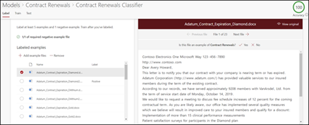

# Создание классификатора в Microsoft SharePoint Syntex

 

> [!VIDEO https://www.microsoft.com/videoplayer/embed/RE4CL0R]  

 

Классификатор — это разновидность модели, с помощью которой можно автоматизировать определение и классификацию типов документов. Например, вы можете определить все документы для *продления контракта*, добавленные в библиотеку документов, например, как на следующем рисунке.

Создание классификатора позволяет создать новый [тип контента SharePoint](https://docs.microsoft.com/sharepoint/governance/content-type-and-workflow-planning#content-type-overview), который будет связан с моделью.

При создании классификатора вам требуется создать *объяснения*, чтобы определить модель. Это позволяет вам отметить общие данные, которые вы ожидаете видеть в этом типе документа. 

Используйте примеры типа документа ("примеры файлов"), чтобы "обучить" модель определению файлов с таким же типом контента.

Чтобы создать классификатор, вам потребуется выполнить следующие действия:
1. Присвоение имени модели.
2. Добавление примеров файлов.
3. Пометка примеров файлов.
4. Создание объяснения.
5. Тестирование модели.

> [!NOTE]
> Ваша модель использует классификатор для определения и классификации типов документов, но вы также можете извлекать конкретные элементы информации из каждого файла, определенного моделью. Для этого создайте **средство извлечения**, чтобы добавить его в свою модель. См. статью [Создание средства извлечения](create-an-extractor.md).

## Присвоение имени модели

Первым шагом при создании модели является присвоение ей имени.

1. В центре контента выберите **Создать**, а затем —**Создать модель**.
2. В области **Новая модель осмысления документации** в поле **Имя** введите имя модели. Например, если вы хотите определить документы для продления контракта, можно назвать модель *Продление контракта*.
3. Нажмите **Создать**. В результате будет создана домашняя страница для модели. 

    

При создании модели вы также создаете новый тип контента сайта. Тип контента представляет категорию документов с общими характеристиками и коллекцией столбцов или свойств метаданных для определенного контента. Управление типами контента SharePoint осуществляется с помощью [коллекции типов контента](https://support.microsoft.com/office/create-or-customize-a-site-content-type-27eb6551-9867-4201-a819-620c5658a60f). В этом примере при создании модели вы создаете новый тип контента *Продление контракта*.

Выберите **Дополнительные параметры**, если хотите сопоставить эту модель с существующим корпоративным типом контента в коллекции типов контента SharePoint, чтобы использовать его схему. Корпоративные типы контента хранятся в центре типов контента в Центре администрирования SharePoint и являются общими для всех сайтов в клиенте. Обратите внимание, что хотя вы можете применять существующий тип контента для использования его схемы с целью упрощения определения и классификации, вам по-прежнему требуется обучить свою модель для извлечения информации из файлов, которые она определяет. 

## Добавление примеров файлов

На домашней странице модели добавьте примеры файлов, которые потребуются, чтобы обучить модель определять ваш тип документа.  
 

> [!VIDEO https://www.microsoft.com/videoplayer/embed/RE4D0iX] 

 

> [!NOTE]
> Вам следует использовать одинаковые файлы как для классификатора, так и для [обучения средства извлечения](create-an-extractor.md). Вы всегда можете добавить другие файлы позже, но обычно добавляется полный набор примеров файлов. Пометьте некоторые из них, чтобы обучить свою модель, и протестируйте остальные файлы без меток, чтобы оценить пригодность модели. 

В качестве обучающего набора следует использовать положительные и отрицательные примеры:
- Положительный пример: документы, представляющие тип документа. Они содержат строки и сведения, которые всегда будут присутствовать в этом типе документа.
- Отрицательные примеры: любой другой документ, не представляющий тип документа, который вы хотите классифицировать. 

Используйте не менее пяти положительных примеров и хотя бы один отрицательный пример, чтобы обучить свою модель.  Желательно создать дополнительные примеры, чтобы протестировать свою модель после обучения.

Добавление примеров файлов:

1. На домашней странице модели на плитке **Добавить примеры файлов** щелкните **Добавить файлы**.
2. На странице **Выберите примеры файлов для модели** выберите примеры файлов из библиотеки учебных файлов в центре контента. Если вы еще не отправили их туда, щелкните **Отправить**, чтобы скопировать их в библиотеку учебных файлов.
3. Выбрав примеры файлов для обучения модели, щелкните **Добавить**.

     

## Пометка примеров файлов

После добавления примеров файлов вам требуется пометить их в качестве положительных или отрицательных примеров.

1. На домашней странице модели на плитке **Классификация файлов и запуск обучения** щелкните **Обучить классификатор**.
   Отобразится страница присвоения метки со списком ваших примеров файлов и первым файлом, отображаемым в средстве просмотра.
2. В средстве просмотра поверх первого примера файла вы увидите текст с вопросом, является ли файл примером для созданной вами модели. Если это положительный пример выберите **Да**. Если это отрицательный пример выберите **Нет**.
3. В списке **Примеры с метками** слева выберите дополнительные файлы, которые нужно использовать в качестве примеров, и пометьте их. 

     

> [!NOTE]
> Пометьте как минимум пять положительных примеров. Вы также должны пометить хотя бы один отрицательный пример. 

## Создание объяснения

Следующее действие — создание объяснения на странице обучения. Объяснение помогает модели понять, как распознать документ. Например, документы для продления контракта всегда содержат текстовую строку *Запрос дополнительного раскрытия информации*.

> [!Note]
> При использовании со средствами извлечения объяснение определяет строку, которую нужно извлечь из документа. 

Создание объяснения:

1. На домашней странице модели откройте вкладку **Обучение**, чтобы перейти на страницу обучения.
2. На странице обучения в разделе **Подготовленные файлы** вы увидите список примеров файлов, которые вы пометили ранее. Выберите один из положительных файлов из списка, и он отобразится в средстве просмотра.
3. В разделе объяснения выберите **Создать**, а затем — **Пустое**.
4. На странице **Создание объяснения**: 
    а. Введите **имя** (например, "блок раскрытия информации"). 
    б. Выберите **Тип**. В качестве примера выберите **Список фраз**, так как вы добавляете текстовую строку. 
    в. В поле **Введите здесь** введите строку. В качестве примера добавьте "Запрос дополнительного раскрытия информации". Вы можете выбрать **С учетом регистра**, если требуется учитывать регистр строки. 
    г. Щелкните **Сохранить**.

     
    
 
5. Теперь модель проверяет, является ли созданное объяснение достаточно хорошим, чтобы правильно определить остальные помеченные примеры файлов в качестве положительных и отрицательных примеров. В разделе подготовленных файлов просмотрите столбец **Оценка** после завершения обучения, чтобы увидеть результаты. Файлы имеют значение **Соответствие**, если созданные вами объяснения были достаточными, чтобы сопоставить помеченные файлы с положительными или отрицательными примерами.

     

Если вы видите значение **Несоответствие** для помеченных файлов, вам может потребоваться создать дополнительное объяснение, чтобы предоставить модели больше сведений для определения типа документа. В этом случае щелкните файл, чтобы получить дополнительные сведения о причине несоответствия.

## Тестирование модели

Если вы получили сообщение о соответствии помеченных примеров файлов, вы можете протестировать свою модель на оставшихся примерах файлов без меток, которые еще не использовались в модели.  Это действие необязательно.

1. На домашней странице модели откройте вкладку **Тестирование**. Это запустит модель на примерах файлов без меток.
2. В списке **Тестовые файлы** отображаются ваши примеры файлов и указывается прогноз модели в их отношении: положительные или отрицательные. Используйте эти сведения, чтобы определить эффективность классификатора в определении ваших документов.

     

## См. также
[Создание средства извлечения](create-an-extractor.md)

[Общие сведения об осмыслении документации](document-understanding-overview.md)

[Создание модели обработки форм](create-a-form-processing-model.md)

[Применение модели](apply-a-model.md) 
