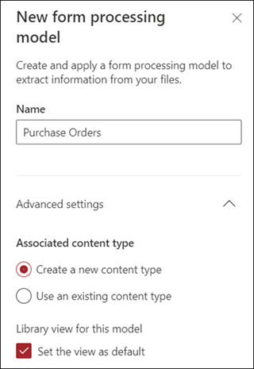
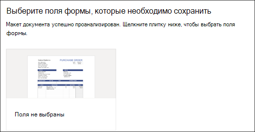
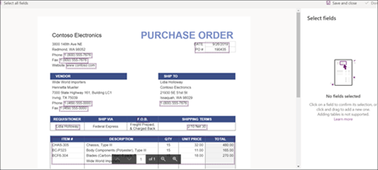
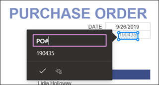

# Создание модели обработки форм в Microsoft SharePoint SyntexCreate a form processing model in Microsoft SharePoint Syntex

 

> [!VIDEO https://www.microsoft.com/videoplayer/embed/RE4GnhN]  

 

Использование [AI Builder](https://docs.microsoft.com/ai-builder/overview) — функция в Microsoft PowerApps — пользователи SharePoint Syntex могут создавать [модель обработки форм](form-processing-overview.md) непосредственно из библиотеки документов SharePoint.Using [AI Builder](https://docs.microsoft.com/ai-builder/overview) - a feature in Microsoft PowerApps - SharePoint Syntex users can create a [form processing model](form-processing-overview.md) directly from a SharePoint document library. 

Создание модели обработки форм состоит из следующих действий:Creating a form processing model involves the following:
 - Шаг 1. Создание модели обработки для создания типа контентаStep 1: Create the from processing model to create the content type
 - Шаг 2. Добавление и анализ примеров файловStep 2: Add and analyze example files
 - Шаг 3. Выбор полей формыStep 3: Select your form fields
 - Шаг 4. Обучение и тестирование моделиStep 4: Train and test your model
 - Шаг 5. Публикация моделиStep 5: Publish your model
 - Шаг 6. Использование моделиStep 6: Use your model

## ТребованияRequirements

Модель обработки форм можно создать только в библиотеках документов SharePoint, для которых она включена. Если обработка формы включена, вы можете просмотреть **AI Builder** **"Создать модель обработки форм"** в меню **Автоматизация** в библиотеке документов. Если вам требуется обработка в библиотеке документов, необходимо обратиться к администратору SharePoint.You can only create a form processing model in SharePoint document libraries for which it is enabled. If form processing is enabled, you are able to see the **AI Builder** **"Create a form processing model'** under the **Automate** menu in your document library.  If you need processing enabled on your document library, you must contact your SharePoint administrator.

  

## Шаг 1. Создание модели обработки формStep 1: Create a form processing model

Первым шагом в создании модели обработки формы является присвоение ей имени и создание нового типа содержимого и нового представления библиотеки документов.The first step in creating a form processing model is to name it and create the define the new content type and create a new document library view for it.

1. В библиотеке документов выберите меню **Автоматизация**, выберите **AI Builder** и щелкните **Создать модель обработки форм**.From the document library, select the **Automate** menu, select **AI Builder**, and then select **Create a Form Processing model**.

     

2. В области **Новая модель обработки форм**, в поле **Имя** введите имя модели (например, *Заказы на покупку*).In the **New form processing model** pane, in the  **Name** field, type a name for your model (for example, *Purchase Orders*).

      

3. При создании модели обработки форм создается новый тип содержимого SharePoint. Тип содержимого SharePoint представляет собой категорию документов, имеющих общие характеристики и использующих коллекцию столбцов или свойств метаданных для определенного содержимого. Управление типами содержимого SharePoint осуществляется с помощью [коллекции типов содержимого]().When you create a form processing model, you create a new SharePoint content type. A SharePoint content type represents a category of documents that have common characteristics and share a collection of columns or metadata properties for that particular content. SharePoint Content Types are managed through the [Content types gallery]().

    Выберите **Дополнительные параметры**, если вы хотите сопоставить эту модель с существующим типом содержимого в коллекции типов содержимого SharePoint, чтобы использовать ее схему.Select **Advanced settings** if you want to map this model to an existing content type in the SharePoint Content types gallery to use its schema. 

4. Ваша модель создает новое представление в вашей библиотеке документов для извлеченных данных. Если вы не хотите использовать это представление по умолчанию, снимите флажок **Сделать представлением по умолчанию**.Your model creates a new view in your document library for your extracted data. If you do not want it to the default view, deselect **Set the view as default**.

5. Нажмите **Создать**.Select **Create**.

## Шаг 2. Добавление и анализ документовStep 2: Add and analyze documents

После создания новой модели обработки форм браузер открывает новую страницу модели обработки форм PowerApps AI Builder. На этой странице вы можете добавить и проанализировать примеры документов.After you create your new form processing model, your browser opens a new PowerApps AI Builder forms processing model page. On this page you can add and analyze your example documents.  

> [!NOTE]
> При поиске примеров файлов для использования см. раздел [Требования к входному документу модели обработки формы и советы по оптимизации](https://docs.microsoft.com/ai-builder/form-processing-model-requirements).When looking for example files to use, see the [form processing model input document requirements and optimization tips](https://docs.microsoft.com/ai-builder/form-processing-model-requirements). 

     
 
1. Выберите **Добавить документы**, чтобы начать добавление примеров документов, проанализированных для определения именованных пар значений, которые могут быть извлечены. После этого можно выбрать **Отправить из локального хранилища**, **SharePoint** или **Хранилище BLOB-объектов Azure**. Для обучения необходимо использовать не менее пяти файлов.Select **Add documents** to begin adding example documents analyzed to determine the named value pairs that can be extracted. You can then choose either **Upload from local storage**, **SharePoint**, or **Azure Blob storage**. You need to use at least five files for training.

2. После добавления файлов нажмите **Анализировать**, чтобы проверить наличие общих сведений для всех файлов. Это может занять несколько минут.After adding files, select **Analyze** to check for any information common is all files. This may take several minutes to complete.  
 
      

3. После анализа файлов на странице **Выберите поля формы, которые хотите сохранить** выберите файл, чтобы просмотреть найденные поля.After the files have been analyzed, in the **Select the form fields you want to save** page select the file to view the detected fields. 

      

## Шаг 3. Выбор полей формыStep 3: Select your form fields

Проанализировав документы на наличие полей, вы можете просмотреть найденные поля и определить те, которые нужно сохранить. Сохраненные поля отображаются в виде столбцов в представлении библиотеки документов вашей модели и показывают значения, извлеченные из каждого документа.After analyzing the documents for fields, you can now see the fields that were found, and identify the ones that you want to save. Saved fields display as columns in your model's document library view and show the values extracted from each document.

1. На следующей странице показан один из примеров файлов и выделены все общие поля, которые были автоматически обнаружены системой.The next page displays one of your sample files and will highlight all common fields that were automatically detected by the system.  

      

2. Выберите поля, которые нужно сохранить, и установите флажок, чтобы подтвердить выбор. Например, в модели "Заказ на покупку" можно выбрать поля *Дата*, *Заказ на покупку* и *Итого*. Обратите внимание, что вы также можете переименовать поле, если захотите.Select the fields that you want to save and select the checkbox to confirm your selection. For example, in the Purchase Order model, choose to select the *Date*, *PO*, and *Total* fields.  Note that you can also choose to rename a field if you choose.  

      

3. Если поле не было обнаружено при анализе, его все равно можно добавить. Выделите сведения, которые нужно извлечь, и в поле имени введите нужное имя. Затем установите флажок. Обратите внимание, что вам необходимо подтвердить необнаруженные поля в оставшихся примерах файлов.If a field was not detected by analysis, you can still choose to add it. Highlight the information you want to extract, and in the name box type in the name you want. Then select the check box. Note that you need to confirm undetected fields in your remaining sample files.

4. Щелкните **Подтвердить поля** после выбора полей, которые нужно сохранить.Click **Confirm fields** after you have selected the fields that you want to save.  
 
      
 
5. На странице **Выбор полей формы, которые нужно сохранить** будет указано количество выбранных полей. Нажмите **Готово**.On the **Select the form fields you want to save** page, it shows the number of fields you have selected. Select **Done**.

## Шаг 4. Обучение и тестирование моделиStep 4: Train and test your model

После выбора полей, которые нужно сохранить, на странице **Сведения о модели** можно начать обучение и протестировать модель.After selecting the fields you want to save, the **Model Summary** page lets you train and test your model.

1. На странице **Сведения о модели** сохраненные поля будут показаны в разделе **Выбранные поля**. Чтобы начать обучение по примерам файлов, выберите **Обучение**. Обратите внимание, что это займет несколько минут.On the **Model Summary** page, the saved fields will show in the **Selected fields** section. Select **Train** to begin training on your example files. Note that this may take a few minutes to complete. 

       

2. Когда появится уведомление о том, что обучение завершено, выберите **Перейти на страницу сведений**.When you see the notification that training has completed, select **Go to details page**. 

3. На странице **Сведения о модели** вы можете проверить, как работает ваша модель, выбрав **Быстрый тест**. Это позволяет перетаскивать файлы на страницу и проверять, обнаруживаются ли поля.On the **Model details** page, you can choose to test how your model works by selecting **Quick test**. This lets you drag and drop files to the page and see if the fields are detected.

      

2. Когда появится уведомление о том, что обучение завершено, выберите **Перейти на страницу сведений**.When you see the notification that training has completed, select **Go to details page**. 

3. На странице **Сведения о модели** проверьте, как работает ваша модель, выбрав **Быстрый тест**. Это позволяет перетаскивать файлы на страницу и проверять, обнаруживаются ли поля.On the **Model details** page, choose to test how your model works by selecting **Quick test**. This lets you drag and drop files to the page and see if the fields are detected.

## Шаг 5. Публикация моделиStep 5: Publish your model

1. Если вы удовлетворены результатами вашей модели, выберите **Опубликовать**, чтобы сделать ее доступной для использования.If you are satisfied with the results of your model, select **Publish** to make it available for use.

2. После публикации модели выберите **Использовать модель**. В результате создается поток PowerAutomate, который может выполняться в вашей библиотеке документов SharePoint и извлекает поля, идентифицированные в модели. Затем выберите **Создать поток**.After the model is published, select **Use model**. This creates a PowerAutomate flow that can run in your SharePoint document library and extracts the fields that have been identified in the model, then select **Create Flow**.
  
3. После завершения вы увидите сообщение: **Поток успешно создан**.When completed, you will see the message **Your flow has been successfully created**.
 
## Шаг 6. Использование моделиStep 6: Use your model

После публикации модели и создания потока PowerAutomate вы можете использовать модель в библиотеке документов SharePoint.After publishing your model and creating it's PowerAutomate flow, you can use your model in your SharePoint document library.

1. После публикации модели выберите **Перейти в SharePoint**, чтобы перейти в библиотеку документов.After publishing your model, select **Go to SharePoint** to go to your document library.

2. В представлении модели библиотеки документов обратите внимание, что выбранные вами поля теперь отображаются в виде столбцов.In the document library model view, notice that the fields you selected now display as columns. 

      

3. Обратите внимание, что информационная ссылка рядом с **документами** указывает на то, что к этой библиотеке документов применяется модель обработки форм.Notice that the information link next to **Documents** notes that a forms processing model is applied to this document library.

       

4. Отправка файлов в вашу библиотеку документов. Все файлы, которые модель определяет как собственный тип содержимого, содержат список файлов в вашем представлении и отображают извлеченные данные в столбцах.Upload files to your document library. Any files that the model identifies as it's content type lists the files in your view and displays the extracted data in the columns. 

       

## См. такжеSee Also
  
[Документация Power AutomatePower Automate documentation](https://docs.microsoft.com/power-automate/)

[Учебный курс. Повышение продуктивности бизнеса с помощью AI BuilderTraining: Improve business performance with AI Builder](https://docs.microsoft.com/learn/paths/improve-business-performance-ai-builder/?source=learn)
