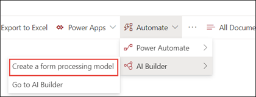

# Создание модели обработки форм (Предварительная версия)

> [!Note] 
> Содержимое этой статьи предназначено для Кортексного предварительного просмотра Project. [Узнайте больше о Кортекс Project](https://aka.ms/projectcortex).

С помощью [AI Builder](https://docs.microsoft.com/ai-builder/overview) — компонент в Microsoft PowerApps-Project Кортекс пользователи могут создавать [модели обработки форм](form-processing-overview.md) непосредственно из библиотеки документов SharePoint. 

Создание модели обработки форм состоит из следующих компонентов:
 - Шаг 1: создание модели "из обработки" для создания типа контента
 - Шаг 2: Добавление и анализ файлов примеров
 - Шаг 3: выбор полей формы
 - Шаг 4: обучение и тестирование модели
 - Шаг 5: Публикация модели
 - Шаг 6: использование модели

## Требования

Модель обработки форм можно создать только в библиотеках документов SharePoint, в которых она включена. Если обработка формы включена, **AI-построитель** **"Создание модели обработки формы"** будет доступен в меню " **Автоматизация** " библиотеки документов.  Если вы хотите включить обработку в вашей библиотеке документов, обратитесь к администратору.

  

## Шаг 1: создание модели обработки форм

Первым шагом при создании модели обработки формы является назначение имени для создания нового типа контента и создания нового представления библиотеки документов для нее.

1. В библиотеке документов выберите пункт **Автоматизация** меню, выберите **AI Builder**, а затем выберите **создать модель обработки формы**.

     
2. В области **Новая модель обработки форм** в поле **имя** введите имя модели (например, *заказы на покупку*).

      

3. При создании модели обработки формы создается новый тип контента SharePoint. Тип контента SharePoint представляет категорию документов, имеющих общие характеристики и совместное использование коллекции столбцов или свойств метаданных для конкретного содержимого. Управление типами контента SharePoint осуществляется с помощью [коллекции типов контента]().

    Выберите **Дополнительные параметры** , если вы хотите сопоставить эту модель с существующим типом контента в коллекции типов контента SharePoint, чтобы использовать ее схему. 

4. Ваша модель создаст новое представление в библиотеке документов для извлеченных данных. Если вы не хотите использовать представление по умолчанию, снимите флажок **задать представление по умолчанию**.
5. Нажмите **Создать**.

## Шаг 2: Добавление и анализ документов

После создания новой модели обработки форм браузер откроет новую страницу модели обработки форм AI-построителя. На этой странице вы можете добавить и проанализировать документы с примерами.  

> [!Note]
> Если вы ищете примеры файлов, которые необходимо использовать, ознакомьтесь с [требованиями к входным документом модели обработки форм и советами по оптимизации](https://docs.microsoft.com/ai-builder/form-processing-model-requirements). 

     
 

1. Нажмите кнопку **добавить документы** , чтобы начать добавлять документы с примерами, которые анализируются, чтобы определить, какие именованные пары значений можно извлечь. Вы можете выбрать **загрузку из локального хранилища**, **SharePoint**или **хранилища BLOB-объектов Azure**. Для обучения необходимо использовать по крайней мере пять файлов.
2. После добавления файлов нажмите кнопку **анализ** , чтобы проверить, все ли общие сведения являются файлами. Обратите внимание, что выполнение этого действия может занять несколько минут.  
 
      

3. После анализа **выберите поля формы** , которые необходимо сохранить, и щелкните файл, чтобы увидеть обнаруженные поля. 

      

## Шаг 3: выбор полей формы

После анализа документов для полей можно увидеть, какие поля были найдены и какие из них вы хотите сохранить. Сохраненные поля будут отображаться в виде столбцов в представлении библиотеки документов модели и будут показывать значения, извлеченные из каждого документа.

1. На следующей странице отобразится один из примеров файлов и будут выделены все общие поля, автоматически обнаруженные системой.  

      

2. Выберите поля, которые необходимо сохранить, и установите флажок, чтобы подтвердить выбор. Например, в модели заказа на покупку можно выбрать поля *даты*, *ЗП*и *итоги* .  Обратите внимание, что вы также можете изменить имя поля.  

      

3. Если поле не было обнаружено в ходе анализа, вы по-прежнему можете добавить его. Выделите данные, которые необходимо извлечь, и введите в поле Имя имя, которое вы хотите присвоить. Затем нажмите кнопку проверить. Обратите внимание, что вам потребуется подтвердить необнаруженные поля в оставшихся примерах файлов.
4. После выбора полей, которые необходимо сохранить, нажмите кнопку **подтвердить поля** .  
 
      
 
5. На странице **выберите поля формы, которые необходимо сохранить** , отображается количество выбранных полей. Нажмите кнопку **Готово**.

## Шаг 4: обучение и тестирование модели

После выбора полей, которые необходимо сохранить, страница **сводки по модели** позволит вам обучить и тестировать модель.

1. На странице **Сводка по модели** сохраненные поля отобразятся в разделе **Выбранные поля** . Выберите **обучение** , чтобы начать обучение с примерами файлов. Обратите внимание, что выполнение этого действия может занять несколько минут. 
      
2. Когда появится уведомление о том, что обучение завершено, нажмите **Перейти на страницу сведений**. 
3. На странице **сведения о модели** можно проверить, как работает модель, выбрав пункт **Быстрая проверка**. Это позволяет перетаскивать файлы на страницу и просматривать, обнаруживаются ли поля.

## Шаг 5: Публикация модели

1. Если вы удовлетворены результатами вашей модели, нажмите кнопку **опубликовать** , чтобы сделать ее доступной для использования.
2. После публикации модели выберите **использовать модель**. При этом будет создан поток Повераутомате, который будет выполняться в библиотеке документов SharePoint, и будут извлечены поля, идентифицированные в модели. Выберите **создать блок**.  
3. После завершения вы увидите сообщение о том, что **ваш процесс был успешно создан**.
 
 
## Шаг 6: использование модели

После того как вы публикуете модель и создаете ее Повераутомате, вы можете использовать модель в библиотеке документов SharePoint.

1. После публикации модели выберите **Перейти в SharePoint** , чтобы перейти в библиотеку документов.
2. Обратите внимание, что в представлении модель библиотеки документов выбранные поля будут отображаться в виде столбцов. 

      

    Кроме того, обратите внимание на то, что информационная ссылка рядом с **документом** будет иметь значение, что модель обработки форм применена к этой библиотеке документов.

       

3. Отправка файлов в библиотеку документов. Все файлы, идентифицированные моделью в качестве типа контента, будут отображать файлы в представлении и будут отображать извлеченные данные в столбцах. 

       

## См. также
  
[Документация по автоматизации управления питанием](https://docs.microsoft.com/power-automate/) 
[Обучение: повышение производительности бизнеса с помощью построителя AI](https://docs.microsoft.com/learn/paths/improve-business-performance-ai-builder/?source=learn) 

