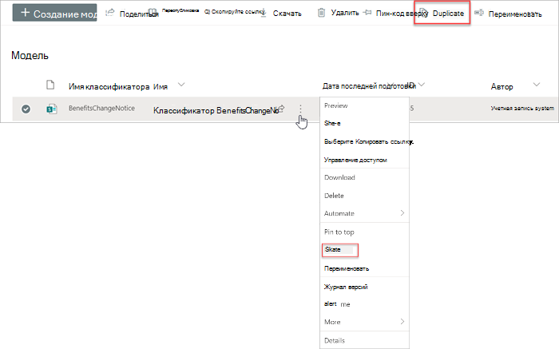
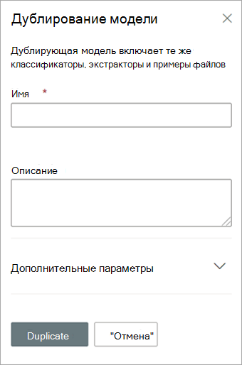

# Дублирование модели в Microsoft SharePoint Syntex

Дублирование модели осмысления документации может сэкономить время и усилия, если вам нужно создать новую модель и вы знаете, что существующая модель очень похожа на нужную вам.

Например, существующая модель с именем "Контракты" классифицирует те же файлы, с которыми вам потребуется работать. Новая модель будет извлекать некоторые существующие данные, но ее потребуется обновить для извлечения дополнительных данных. Вместо создания и обучения новой модели с нуля можно использовать функцию дублирования модели, чтобы создать копию модели "Контракты", которая также будет копировать все связанные элементы обучения, такие как примеры файлов и средства извлечения объектов.

Если вы дублируете модель, после ее переименования (например, на "Продление контрактов") вы можете внести в нее изменения. Например, можно удалить некоторые существующие извлеченные поля, которые вам не нужны, а затем обучить модель извлечению нового поля (например, "Дата продления").

## Дублирование модели

Выполните следующие действия, чтобы дублировать модель осмысления документации.

1. В центре контента выберите **Модели**, чтобы просмотреть список моделей.

2. На странице **Модели** выберите модель, которую нужно дублировать.

3. С помощью ленты или кнопки **Показать действия** (рядом с именем модели) выберите **Дублировать**. 

      

4. На панели **Дублировать модель**:

   а. В поле **Имя** введите новое имя модели, которую вы хотите дублировать. 

      

   б. В разделе **Описание** добавьте описание новой модели.

   в. (Необязательно) В разделе **Дополнительные параметры** выберите, следует ли связать существующий [тип контента](/sharepoint/governance/content-type-and-workflow-planning#content-type-overview).

5. Выберите **Дублировать**.

## См. также
[Создание классификатора](create-a-classifier.md)

[Переименование модели](rename-a-model.md)

[Создание средства извлечения](create-an-extractor.md)

[Общие сведения об осмыслении документации](document-understanding-overview.md)

[Типы объяснения](explanation-types-overview.md)

[Применение модели](apply-a-model.md) 

[Режим специальных возможностей SharePoint Syntex](accessibility-mode.md)