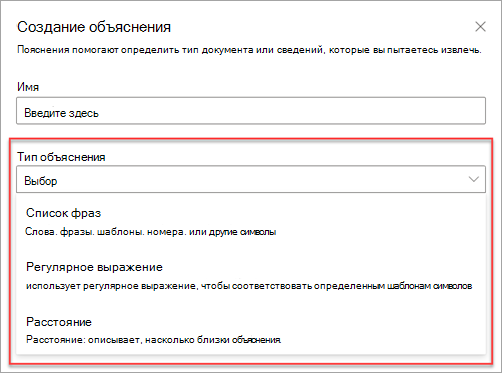
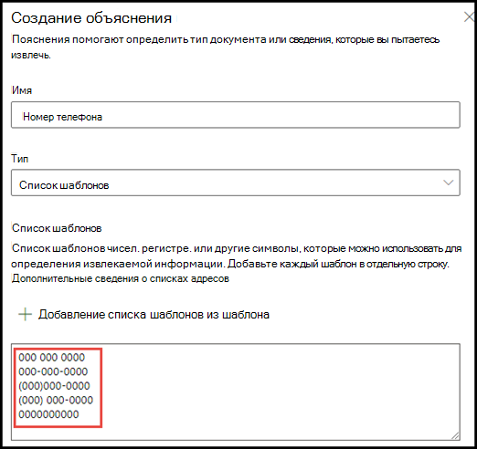
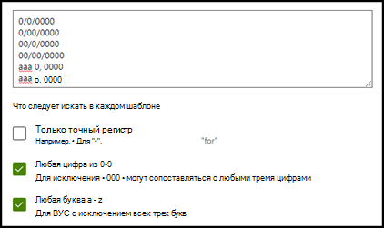
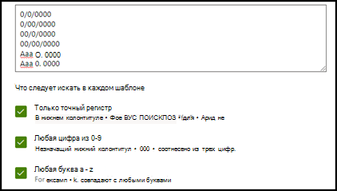
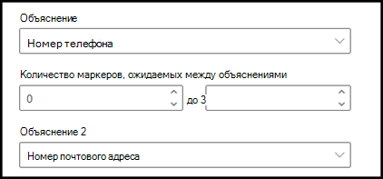
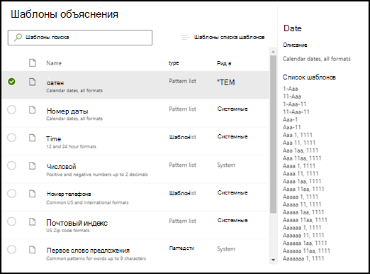
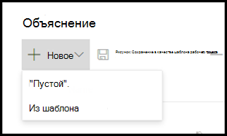
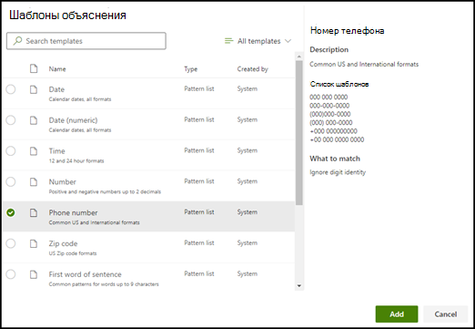
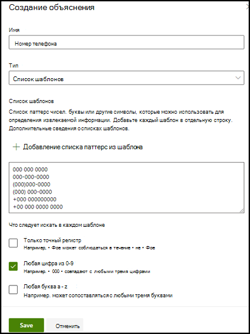

# Введение в типы объяснений

Объяснения помогают определить информацию, которую вы хотите пометить и извлечь в своих моделях осмысления документации в Microsoft SharePoint Syntex. При создании объяснения следует выбрать тип объяснения. Данная статья поможет вам узнать подробности о разных типах объяснений и о том, как они используются. 

    
   
Доступны следующие типы объяснений:

- **Список фраз**: список слов, фраз, цифр или других символов, которые можно использовать в документе или в извлекаемой информации. Например, текстовая строка **Направивший врач** находится во всех идентифицируемых документах с медицинскими направлениями. 

- **Список шаблонов**: список шаблонов чисел, букв или других символов, которые можно использовать для идентификации извлекаемой информации. Например, вы можете извлечь **номер телефона** направившего врача из идентифицируемого документа с медицинским направлением. 

- **Расстояние**: описывает, насколько близки объяснения. Например, список шаблонов с *номерами домов* идет прямо перед списком фраз с *названиями улиц* без маркеров между ними (больше информации о маркерах приведено в этой статье). Для использования типа расстояния требуется, чтобы в вашей модели было как минимум два объяснения, иначе эта функция будет отключена. 
 
## Список фраз

Список фраз — это тип объяснения, который обычно используется, чтобы идентифицировать и классифицировать документ через вашу модель. Как описано в примере с меткой *Направивший врач*, это строка со словами, фразами, номерами или символами, которые постоянно встречаются в идентифицируемых документах.

Хоть это и не требования, но лучших результатов можно добиться, если считываемая фраза находится во всех документах в одном месте. Например, метка *Направивший врач* может находиться в первом абзаце всех документов.

Если при идентификации метки важна точность, при использовании списка фраз вы можете указать это, выбрав флажок **Только точная капитализация**.

    

## Списки шаблонов

Список шаблонов особенно полезен, когда вы создаете объяснение, которое находит и извлекает информацию из документа. Обычно такая информация представлена определенным форматом, например даты, номера телефонов или кредитных карт. Например, значение даты может быть представлено в нескольких различных форматах (1/1/2020, 1-1-2020, 01/01/20, 01/01/2020, 1 января 2020 г. и так далее). Определение списка шаблонов делает объяснение более эффективным за счет сбора всех возможных вариаций данных, которые вы хотите выявить и извлечь. 

В случае с **номером телефона** извлеките номер телефона каждого направивишего врача из документов с медицинскими направлениями, которые идентифицирует модель. Создавая объяснение, выберите тип "Список шаблонов", чтобы были возвращены различные возможные форматы.

   

В этом примере выберите флажок **Любая цифра от 0 до 9**. При выборе этого пункта каждое значение "0" в шаблоне будет любой цифрой от 0 до 9.

   

Походим образом, если вы создаете список шаблонов с текстовыми символами, выберите флажок **Любая буква от а до я**. При данном выборе каждый символ "а" в списке шаблоном будет буквой от "а" до "я".

Например, если вы создаете список шаблонов **Дата** и хотите, чтобы формат даты типа *1 янв 2020* был идентифицирован, то нужно сделать следующее:
- Добавьте в список шаблонов *aaa 0, 0000* и *aaa 00, 0000*.
- Убедитесь, что выбран флажок **Любая буква от а до я**.

   

Кроме того, если в вашем списке шаблонов есть требования по капитализации, вы можете выбрать флажок **Только точная капитализация**. В примере с датами, если нужно, чтобы первая буква месяца была заглавной, сделайте следующее:

- Добавьте в список шаблонов *Aaa 0, 0000* и *Aaa 00, 0000*.
- Убедитесь, что выбран флажок **Только точная капитализация**.

   

> [!NOTE]
> Вместо того, чтобы вручную создавать объяснение для списка шаблонов, воспользуйтесь [библиотекой объяснений]() с готовыми шаблонами из популярных списков шаблонов, например *даты*, *номера телефонов*, *номера кредитных карт* и так далее. 

## Расстояние 

Тип объяснения по расстоянию позволяет идентифицировать информацию по ее схожести с другим фрагментов данных. Например, в своей модели вы определили два типа объяснений, которые отмечают *Улицу и номер дома* и *Номер телефона* клиента. 

Вы также обратили внимание, что номер телефона клиента всегда идет до номера дома и улицы. 

Алексей Виноградов 
555-555-5555 
One Microsoft Way 
Redmond, WA 98034 

Используйте объяснение по расстоянию, чтобы определить, насколько далеко находится объяснение номера телефона, чтобы лучше идентифицировать адрес в документах.

    

#### Что такое маркеры?

Чтобы использовать тип объяснения по расстоянию, нужно знать, что такое маркер, поскольку тип объяснения по расстоянию измеряет расстояние в маркерах.  

Маркер — это непрерывный диапазон (без пробелов или пунктуации) букв и цифр. Пробел не является маркером. Каждый знак препинания является маркером. В таблице ниже приведены примеры определения количества маркеров в фразе.

|Фраза|Количество маркеров|Объяснение|
|--|--|--|
|`Dog`|1|Отдельное слово без пунктуации и пробелов.|
|`RMT33W`|1|Номер локатора записи. В нем могут быть буквы и цифры, но не знаки пунктуации.|
|`425-555-5555`|5|Номер телефона. Каждый знак препинания является маркером, поэтому в `425-555-5555` 5 маркеров: `425` `-` `555` `-` `5555` |
|`https://luis.ai`|7|`https` `:` `/` `/` `luis` `.` `ai` |

#### Настройка типа объяснения по расстоянию

В качестве примера настройте расстояние так, чтобы определить диапазон количества маркеров от объяснения *Номер телефона* до объяснения *Номер дома*.

В качестве минимального диапазона указан "0", потому что между номером телефона и номером дома нет маркеров.

Однако некоторые номера телефонов в примерах имеют добавление, например *(мобильный)*.

Николай Белых 
111-111-1111 (мобильный) 
One Microsoft Way 
Redmond, WA 98034 

В примере *(мобильный)* три маркера:

|Фраза|Количество маркеров|
|--|--|
|(|1|
|мобильный|2|
|)|3|

Настройте параметры расстояния так, чтобы диапазон был от 0 до 3.

    

## Используйте шаблона объяснений

Вы можете вручную добавлять значения списка шаблонов для объяснений, но может быть проще использовать уже созданные шаблоны из библиотеки объяснений.

Например, вместо того, чтобы вручную добавлять все вариации *Даты*, вы можете использовать шаблон *Дат*, в котором уже есть несколько значений для списка шаблонов: 

    
 
В библиотеке объяснений включает часто используемые объяснений в виде списка шаблонов, включая: 

- Дата 
- Дата (числовая) 
- Время 
- Числовой 
- Номер телефона 
- Почтовый индекс 
- Первое слово предложения 
- Кредитная карта 
- Номер социального страхования 

Обратите внимание, что библиотека объяснений также включает в себя шаблоны для списков фраз, в том числе:
- Конец предложения
- Валюта

#### Использование шаблонов из библиотеки объяснений

1. В разделе **Объяснения** на странице **Обучение** вашей модели, выберите **Новый**, затем выберите **Из шаблона**. 

    

2.  На странице **Шаблоны объяснений** выберите объяснение, которое хотите использовать, а затем выберите **Добавить**. 

        

3. Информация о шаблоне, который вы выбрали, отобразится на странице **Создание объяснений**. При необходимости измените название объяснения, а также добавьте или удалите элементы из списка шаблонов.   

    

4. По завершении нажмите кнопку **Сохранить**.
