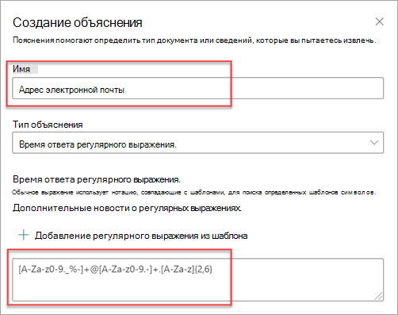

# Типы объяснений в Microsoft SharePoint Syntex

Объяснения помогают определить информацию, которую вы хотите пометить и извлечь в своих моделях осмысления документации в Microsoft SharePoint Syntex. При создании объяснения следует выбрать тип объяснения. Эта статья поможет вам узнать о разных типах объяснений и о том, как они используются.

 
   
Существуют следующие типы объяснений:

- [**Список фраз**](#phrase-list): список слов, фраз, цифр или других символов, которые можно использовать в документе или в извлекаемой информации. Например, текстовая строка *Направивший врач* находится во всех идентифицируемых документах с медицинскими направлениями. Или *Номер телефона* направившего врача из идентифицируемого документа с медицинским направлением.

- [**Регулярное выражение**](#regular-expression): использует нотацию сопоставления с шаблоном для поиска определенных сочетаний символов. Например, с помощью регулярного выражения можно найти все *адреса электронной почты* в наборе документов.

- [**Расстояние**](#proximity): описывает, насколько близки объяснения друг к другу. Например, список фраз с *номерами домов* идет прямо перед списком фраз с *названиями улиц* без маркеров между ними (больше информации о маркерах приведено в этой статье). Для использования типа расстояния необходимо, чтобы в модели было как минимум два объяснения, иначе эта функция будет отключена. 

## Список фраз

Список фраз — это тип объяснения, который обычно используется, чтобы идентифицировать и классифицировать документ через вашу модель. Как описано в примере с меткой *Направивший врач*, это строка со словами, фразами, номерами или символами, постоянно встречающимися в идентифицируемых документах.

Хоть это и не обязательно, но если считываемая фраза находится в одном и том же месте во всех документах, это позволяет добиться наилучших результатов. Например, метка *Направивший врач* может находиться в первом абзаце всех документов. Также можно использовать дополнительный параметр **[Настройка расположения фраз в документе](https://docs.microsoft.com/microsoft-365/contentunderstanding/explanation-types-overview#configure-where-phrases-occur-in-the-document)** для выбора определенных областей, в которых встречается фраза, особенно если существует вероятность ее нахождения в нескольких местах документа.

Если при идентификации метки важна точность, при использовании списка фраз вы можете указать это, выбрав флажок **Только точная капитализация**.

 

Тип фразы особенно полезен при создании объяснения, которое выявляет и извлекает информацию в различных форматах, например даты, номера телефонов и номера кредитных карт. Например, дата может быть представлена в нескольких различных форматах (1/1/2020, 1-1-2020, 01.01.20, 01.01.2020, 1 января 2020 г. и т. д.). Определение списка фраз делает объяснение более эффективным, так как оно будет содержать все возможные вариации данных, которые вы хотите выявить и извлечь. 

В случае с *номером телефона* извлеките номер телефона каждого направляющего врача из документов с медицинскими направлениями, которые идентифицирует модель. При создании объяснения введите различные форматы, в которых номер телефона может отображаться в документе, для сбора возможных вариаций. 

В этом случае в разделе **Дополнительные параметры** установите флажок **Любая цифра от 0 до 9**, чтобы распознавать каждое значение "0", используемое в списке фраз, как любую цифру от 0 до 9.

Точно так же при создании списка фраз, включающего текстовые символы, установите флажок **Любая буква от a до я**, чтобы распознавать каждый символ "a", используемый в списке фраз, как любую букву от "а" до "я".

Например, если вы создаете список фраз **Дата** и хотите, чтобы был распознан формат даты типа *1 янв 2020*, нужно сделать следующее:

- Добавьте в список фраз *aaa 0, 0000* и *aaa 00, 0000*.
- Убедитесь, что выбран флажок **Любая буква от а до я**.

Кроме того, если ваш список фраз содержит требования относительно заглавных букв, вы можете установить флажок **Только точная капитализация**. В примере с датами, если нужно, чтобы первая буква месяца была заглавной, сделайте следующее:

- Добавьте в список фраз *Aaa 0, 0000* и *Aaa 00, 0000*.
- Убедитесь, что выбран флажок **Только точная капитализация**.

> [!NOTE]
> Вместо того, чтобы вручную создавать объяснение для списка фраз, воспользуйтесь [библиотекой объяснений](https://docs.microsoft.com/microsoft-365/contentunderstanding/explanation-types-overview#use-explanation-templates) с шаблонами популярных списков фраз, например *дата*, *номер телефона*, *номер кредитной карты* и т. д.

## Регулярное выражение

Тип объяснения регулярного выражения позволяет создавать шаблоны, помогающие находить и выявлять определенные текстовые строки в документах. С помощью регулярных выражений можно быстро анализировать большие объемы текста, чтобы:

- Находить сочетания символов, соответствующие определенным шаблонам.
- Проверять текст на соответствие заданному шаблону (например, адресу электронной почты).
- Извлекать, изменять, заменять и удалять подстроки текста.

Тип регулярного выражения особенно полезен при создании объяснения, которое выявляет и извлекает информацию в различных форматах, например даты, номера телефонов и номера кредитных карт. Например, адрес электронной почты, такой как olga@contoso.com, отображается в определенном шаблоне ("olga" — первая часть, а "com" — последняя часть). 

Регулярное выражение для адреса электронной почты: **[A-Za-z0-9._%-]+@[A-Za-z0-9.-]+.[A-Za-z]{2,6}**.

Это выражение состоит из пяти частей в таком порядке:

1. Следующие символы в любом количестве: 

   а. буквы от a до z

   б. цифры от 0 до 9

   в. точка, символ подчеркивания, знак процент или дефис

2. Знак @

3. любое количество тех же символов, что и в первой части адреса электронной почты

4. точка

5. от двух до шести букв

Чтобы добавить тип объяснения регулярного выражения, выполните следующие шаги.

1. На панели **Создание объяснения** в элементе **Тип объяснения** выберите **Регулярное выражение**.

   

2. Вы можете ввести выражение вручную в поле **Регулярное выражение** или выбрать **Добавить регулярное выражение из шаблона**.

   При добавлении регулярного выражения с помощью шаблона в текстовое поле автоматически добавляются имя и регулярное выражение. Например, если вы выберете **адрес электронной почты**, будет заполнена панель **Создание объяснения**.

   

## Расстояние 

Тип объяснения по расстоянию позволяет идентифицировать информацию по ее схожести с другим фрагментом данных. Например, вы определили в модели два типа объяснений, которые помечают *Улицу и номер дома* и *Номер телефона* клиента. 

Обратите внимание, что номера телефонов клиента всегда идут до номера дома и улицы. 

Алексей Виноградов 
555-555-5555 
One Microsoft Way 
Redmond, WA 98034 

Используйте объяснение по расстоянию, чтобы определить, насколько далеко находится объяснение номера телефона, чтобы лучше идентифицировать адрес в документах.

#### Что такое маркеры?

Чтобы использовать тип объяснения по расстоянию, необходимо понять, что такое маркер. Тип объяснения по расстоянию измеряет расстояние в маркерах. Маркер — это непрерывный диапазон (без пробелов или пунктуации) букв и цифр. 

В таблице ниже приведены примеры определения количества маркеров в фразе.

|Фраза|Количество маркеров|Объяснение|
|--|--|--|
|`Dog`|1|Отдельное слово без пунктуации и пробелов.|
|`RMT33W`|1|Номер локатора записи. Он может содержать буквы и цифры, но не знаки пунктуации.|
|`425-555-5555`|5|Номер телефона. Каждый знак препинания является маркером, поэтому в `425-555-5555` 5 маркеров: `425` `-` `555` `-` `5555` |
|`https://luis.ai`|7|`https` `:` `/` `/` `luis` `.` `ai` |

#### Настройка типа объяснения по расстоянию

В качестве примера настройте расстояние так, чтобы определить диапазон количества маркеров от объяснения *Номер телефона* до объяснения *Номер дома*. Обратите внимание, что в качестве минимального диапазона указан «0», потому что между номером телефона и номером дома нет маркеров.

Однако к некоторым номерам телефонов в примерах документов добавлен *(мобильный)*.

Николай Белых 
111-111-1111 (мобильный) 
One Microsoft Way 
Redmond, WA 98034 

В примере *(мобильный)* три маркера:

|Фраза|Количество маркеров|
|--|--|
|(|1|
|мобильный|2|
|)|3|

Настройте параметры расстояния так, чтобы диапазон был от 0 до 3.

## Настройка расположения фраз в документе

Когда вы создаете объяснение, по умолчанию поиск фразы, которую вы пытаетесь извлечь, выполняется по всему документу. Однако вы можете использовать дополнительный параметр **Где встречаются эти фразы**, чтобы изолировать определенное место в документе, в котором встречается фраза. Это удобно в ситуациях, когда похожие вхождения фразы могут появляться в другом месте документа и вы хотите убедиться в том, что выбран нужный вариант.

В нашем примере, когда документ представляет собой медицинское направление, *Направивший врач* всегда упоминается в первом абзаце документа. С помощью параметра **Где встречаются эти фразы** в этом примере вы можете настроить свое объяснение для поиска этой метки только в начальном разделе документа или в любом другом месте, где она может встречаться.

В этом параметре доступны следующие варианты на выбор.

- В любом месте файла: поиск фразы выполняется во всем документе.

- Начало файла: поиск в документе выполняется с начала до места, где расположена фраза.

   

    В средстве просмотра вы можете вручную изменить поле выбора, чтобы включить расположение фразы. Значение **Конечное положение** обновляется для отображения количества маркеров, содержащихся в выбранной вами области. Обратите внимание, что вы можете изменить значение **Конечное положение**, а также настроить выбранную область.

   

- Конец файла: поиск в документе выполняется с конца до места, где расположена фраза.

   

    В средстве просмотра вы можете вручную изменить поле выбора, чтобы включить расположение фразы. Значение **Начальное положение** обновляется для отображения количества маркеров, содержащихся в выбранной вами области. Обратите внимание, что вы можете изменить значение "Начальное положение", а также настроить выбранную область.

   

- Произвольный диапазон: поиск расположения фразы в документе выполняется в указанном диапазоне.

   

    В средстве просмотра вы можете вручную изменить поле выбора, чтобы включить расположение фразы. Для этого параметра требуется выбрать положение **Начало** и **Конец**. Эти значения отражают количество маркеров с начала документа. Хотя вы можете вручную ввести эти значения, проще вручную изменить поле выбора в средстве просмотра. 
   
## Используйте шаблона объяснений

Вы можете вручную добавлять значения списка фраз для объяснений, но может быть проще использовать шаблоны из библиотеки объяснений.

Например, вместо того, чтобы вручную добавлять все варианты *Даты*, вы можете использовать шаблон списка фраз для *Дат*, так как в нем уже есть несколько значений списков фраз:

 
Библиотека объяснений содержит часто используемые объяснения *списка фраз*, в том числе:

- Дата: даты календаря, все форматы. Содержит текст и числа (например, "9 декабря 2020 г.").
- Дата (численная): даты календаря, все форматы. Числа (например, 1-11-2020).
- Время: 12- и 24-часовой форматы.
- Число: положительные и отрицательные числа с десятичными дробями до двух знаков после запятой. 
- Процент: список шаблонов, представляющих процентные значения. Например, 1%, 11%, 100% или 11.11%.
- Номер телефона: распространенные форматы, используемые в США и в других странах мира. Например, 000 000 0000, 000-000-0000, (000)000-0000, (000) 000-0000 и т. д.
- Почтовый индекс: почтовый индекс в США. Например, 11111, 11111-1111.
- Первое слово предложения: общие шаблоны для слов длиной до 9 букв. 
- Конец предложения: распространенные знаки препинания для конца предложения
- Кредитная карта: распространенные форматы номеров кредитных карт. Например, 1111-1111-1111-1111. 
- Номер социального обеспечения: формат номера социального обеспечения США. Например, 111-11-1111. 
- Элемент "Флажок": список фраз, представляющий варианты проставленного флажка. Например, _X_, _ _X_ и т. д.
- Валюта: основные международные символы валют. Пример: $. 
- Адрес электронной почты для отправки копий сообщения: список фраз с термином "CC:", который часто находится рядом с именами или адресами электронной почты дополнительных пользователей или групп - адресатов сообщения.
- Дата сообщения электронной почты: список фраз с термином "Отправлено:", который часто находится рядом с датой отправки сообщения электронной почты.
- Приветствие в электронном письме: часто встречающиеся строки, которыми открывается тело сообщения электронной почты.
- Адресат электронной почты: список фраз с термином "Кому:", который часто находится рядом с именами или адресами электронной почты пользователей или групп, на которые было отправлено сообщение. 
- Отправитель электронной почты: список фраз с термином "От:", который часто находится рядом с именем или адресом электронной почты отправитель. 
- Тема сообщения электронной почты: список фраз с термином "Тема:", который часто находится рядом с темой сообщения.

Библиотека объяснений содержит часто используемые объяснения в формате *регулярных выражений*, в том числе:

- От 6 до 17 цифр: соответствует любому числу длиной от 6 до 17 цифр. Номера банковских счетов в США соответствуют этому шаблону.
- Адрес электронной почты: соответствует общему типу адреса электронной почты, например olgaa@contoso.com
- Идентификационный номер налогоплательщика США: 3-значный номер, начинающийся с 9, за которым следует 6-значный номер, начинающийся с 7 или 8. 
- Веб-адрес (URL-адрес): соответствует формату веб-адреса, то есть начинается с http:// или https://

Библиотека объяснений также содержит три автоматических типа шаблонов для работы с данными, которые вы пометили в файлах примера:

- После метки. Слова и символы, которые встречаются после меток в файлах примера.
- До метки. Слова и символы, которые встречаются до меток в файлах примера.
- Метки. До 10 первых меток из файлов примера.

В следующем примере мы рассмотрим для демонстрации работы автоматических шаблонов шаблон объяснения "До метки", предоставляющий модели дополнительные сведения для получения более точного соответствия.

Если выбрать шаблон объяснения "До метки", он будет искать первый набор слов, которые появляются перед меткой в файлах примера. Например, слова, определяемые в первом примере файла: "As of" (Начиная с).

Чтобы создать объяснение из шаблона, вы можете выбрать **Добавить**.  Когда вы добавляете другие примеры файлов, дополнительные слова определяются и добавляются в список фраз.

 
#### Использование шаблонов из библиотеки объяснений

1. В разделе **Объяснения** на странице **Обучение** вашей модели, выберите **Новый**, затем выберите **Из шаблона**.

   

2.  На странице **Шаблоны объяснений** выберите объяснение, которое хотите использовать, и выберите **Добавить**.

    

3. Информация о выбранном шаблоне отображается на странице **Создание объяснений**. При необходимости измените название объяснения, а также добавьте или удалите элементы из списка фраз.  

    

4. По завершении нажмите кнопку **Сохранить**.