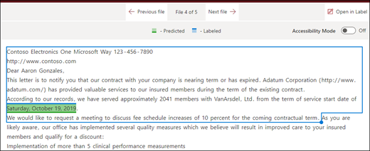

# Введение в типы объяснений

Объяснения помогают определить информацию, которую вы хотите пометить и извлечь в своих моделях осмысления документации в Microsoft SharePoint Syntex. При создании объяснения следует выбрать тип объяснения. Данная статья поможет вам узнать о разных типах объяснений и о том, как они используются. 

    
   
Доступны следующие типы объяснений:

- **Список фраз**: список слов, фраз, цифр или других символов, которые можно использовать в документе или в извлекаемой информации. Например, текстовая строка **Направивший врач** находится во всех идентифицируемых документах с медицинскими направлениями. 

- **Список шаблонов**: список шаблонов чисел, букв или других символов, которые можно использовать для идентификации извлекаемой информации. Например, вы можете извлечь **номер телефона** направившего врача из идентифицируемого документа с медицинским направлением. 

- **Расстояние**: описывает, насколько близки объяснения. Например, список шаблонов с *номерами домов* идет прямо перед списком фраз с *названиями улиц* без маркеров между ними (больше информации о маркерах приведено в этой статье). Для использования типа расстояния необходимо, чтобы в модели было как минимум два объяснения, иначе эта функция будет отключена. 
 
## Список фраз

Список фраз — это тип объяснения, который обычно используется, чтобы идентифицировать и классифицировать документ через вашу модель. Как описано в примере с меткой *Направивший врач*, это строка со словами, фразами, номерами или символами, постоянно встречающимися в идентифицируемых документах.

Хоть это и не требование, но лучших результатов можно добиться, если считываемая фраза находится во всех документах в одном месте. Например, метка *Направивший врач* может находиться в первом абзаце всех документов.

Если при идентификации метки важна точность, при использовании списка фраз вы можете указать это, выбрав флажок **Только точная капитализация**.

    

## Списки шаблонов

Список шаблонов особенно полезен, когда вы создаете объяснение, которое находит и извлекает информацию из документа. Обычно такая информация представлена в различных форматах, например как даты, номера телефонов и кредитных карт. Например, значение даты может быть представлено в нескольких различных форматах (1/1/2020, 1-1-2020, 01/01/20, 01/01/2020, 1 января 2020 г. и так далее). Определение списка шаблонов делает объяснение более эффективным за счет сбора всех возможных вариаций данных, которые вы хотите выявить и извлечь. 

В случае с **номером телефона** извлеките номер телефона каждого направляющего врача из документов с медицинскими направлениями, которые идентифицирует модель. Создавая объяснение, выберите тип "Список шаблонов", чтобы были возвращены различные возможные форматы.

   

В этом случае установите флажок **Любая цифра от 0 до 9**, чтобы распознавать каждое значение «0», используемое в списке шаблонов, как любую цифру от 0 до 9.

   

Точно так же, при создании списка шаблонов, включающего текстовые символы, установите флажок **Любая буква от a до я**, чтобы распознавать каждый символ «a», используемый в списке шаблонов, как любую букву от «a» до «я».

Например, если вы создаете список шаблонов **Дата** и хотите, чтобы формат даты типа *1 янв 2020* был идентифицирован, то нужно сделать следующее:
- Добавьте в список шаблонов *aaa 0, 0000* и *aaa 00, 0000*.
- Убедитесь, что выбран флажок **Любая буква от а до я**.

   

Кроме того, если в вашем списке шаблонов есть требования по капитализации, вы можете выбрать флажок **Только точная капитализация**. В примере с датами, если нужно, чтобы первая буква месяца была заглавной, сделайте следующее:

- Добавьте в список шаблонов *Aaa 0, 0000* и *Aaa 00, 0000*.
- Убедитесь, что выбран флажок **Только точная капитализация**.

   

> [!NOTE]
> Вместо того, чтобы вручную создавать объяснение для списка шаблонов, воспользуйтесь [библиотекой объяснений](https://docs.microsoft.com/microsoft-365/contentunderstanding/explanation-types-overview#use-explanation-templates) с шаблонами из популярных списков шаблонов, например *даты*, *номера телефонов*, *номера кредитных карт* и так далее.

## Расстояние 

Тип объяснения по расстоянию позволяет идентифицировать информацию по ее схожести с другим фрагментом данных. Например, вы определили в модели два типа объяснений, которые помечают *Улицу и номер дома* и *Номер телефона* клиента. 

Обратите внимание, что номера телефонов клиента всегда идут до номера дома и улицы. 

Алексей Виноградов 
555-555-5555 
One Microsoft Way 
Redmond, WA 98034 

Используйте объяснение по расстоянию, чтобы определить, насколько далеко находится объяснение номера телефона, чтобы лучше идентифицировать адрес в документах.

    

#### Что такое маркеры?

Чтобы использовать тип объяснения по расстоянию, вам нужно знать, что такое маркер, так как тип объяснения по расстоянию измеряет расстояние в количестве маркеров. Маркер — это непрерывный диапазон (без пробелов или пунктуации) букв и цифр. 

В таблице ниже приведены примеры определения количества маркеров в фразе.

|Фраза|Количество маркеров|Объяснение|
|--|--|--|
|`Dog`|1|Отдельное слово без пунктуации и пробелов.|
|`RMT33W`|1|Номер локатора записи. Он может включать буквы и цифры, но не знаки пунктуации.|
|`425-555-5555`|5|Номер телефона. Каждый знак препинания является маркером, поэтому в `425-555-5555` 5 маркеров: `425` `-` `555` `-` `5555` |
|`https://luis.ai`|7|`https` `:` `/` `/` `luis` `.` `ai` |

#### Настройка типа объяснения по расстоянию

В качестве примера настройте расстояние так, чтобы определить диапазон количества маркеров от объяснения *Номер телефона* до объяснения *Номер дома*. Обратите внимание, что в качестве минимального диапазона указан «0», потому что между номером телефона и номером дома нет маркеров.

Однако к некоторым номерам телефонов в примерах документов добавлен *(мобильный)*.

Николай Белых 
111-111-1111 (мобильный) 
One Microsoft Way 
Redmond, WA 98034 

В примере *(мобильный)* три маркера:

|Фраза|Количество маркеров|
|--|--|
|(|1|
|мобильный|2|
|)|3|

Настройте параметры расстояния так, чтобы диапазон был от 0 до 3.

    

## Настройка расположения фраз в документе

Когда вы создаете объяснение, по умолчанию поиск фразы, которую вы пытаетесь извлечь, выполняется по всему документу. Однако вы можете использовать дополнительный параметр <b>Где встречаются эти фразы</b>, чтобы изолировать определенное место в документе, в котором встречается фраза. Это удобно в ситуациях, когда похожие вхождения фразы могут появляться в другом месте документа и вы хотите убедиться в том, что выбран нужный вариант. В нашем примере документа с медицинским направлением **Направивший врач** всегда упоминается в первом абзаце документа. С помощью параметра <b>Где встречаются эти фразы</b> в этом примере вы можете настроить свое объяснение для поиска этой метки только в начальном разделе документа или в любом другом месте, где она может встречаться.

    

В этом параметре доступны следующие варианты на выбор.

- В любом месте файла: поиск фразы выполняется во всем документе.
- Начало файла: поиск в документе выполняется с начала до места, где расположена фраза.  
    
В средстве просмотра вы можете вручную изменить поле выбора, чтобы включить расположение фразы. Значение <b>Конечное положение</b> обновляется для отображения количества маркеров, содержащихся в выбранной вами области. Обратите внимание, что вы можете изменить значение "Конечное положение", а также настроить выбранную область. 
    

- Конец файла: поиск в документе выполняется с конца до места, где расположена фраза.  
    
В средстве просмотра вы можете вручную изменить поле выбора, чтобы включить расположение фразы. Значение <b>Начальное положение</b> обновляется для отображения количества маркеров, содержащихся в выбранной вами области. Обратите внимание, что вы можете изменить значение "Начальное положение", а также настроить выбранную область.  
    
- Произвольный диапазон: поиск расположения фразы выполняется в указанном диапазоне документа.  
    
В средстве просмотра вы можете вручную изменить поле выбора, чтобы включить расположение фразы. Для этого параметра требуется выбрать положение <b>Начало</b> и <b>Конец</b>. Эти значения отражают количество маркеров с начала документа. Хотя вы можете вручную ввести эти значения, проще вручную изменить поле выбора в средстве просмотра.  
   

## Используйте шаблона объяснений

Вы можете вручную добавлять значения списка шаблонов для объяснений, но может быть проще использовать шаблоны из библиотеки объяснений.

Например, вместо того, чтобы вручную добавлять все вариации *Даты*, вы можете использовать шаблон *Дат*, так как в нем уже есть несколько значений для списка шаблонов: 

    
 
Библиотека объяснений включает часто используемые объяснения списка шаблонов, включая: 

- Дата 
- Дата (числовая) 
- Время 
- Числовой 
- Номер телефона 
- Почтовый индекс 
- Первое слово предложения 
- Кредитная карта 
- Номер социального страхования 

Обратите внимание, что библиотека объяснений также включает шаблоны для объяснений списков фраз:
- Конец предложения
- Валюта

#### Использование шаблонов из библиотеки объяснений

1. В разделе **Объяснения** на странице **Обучение** вашей модели, выберите **Новый**, затем выберите **Из шаблона**. 

    

2.  На странице **Шаблоны объяснений** выберите объяснение, которое хотите использовать, и выберите **Добавить**. 

        

3. Информация о выбранном шаблоне отображается на странице **Создание объяснений**. При необходимости измените название объяснения, а также добавьте или удалите элементы из списка шаблонов.   

    

4. По завершении нажмите кнопку **Сохранить**.
