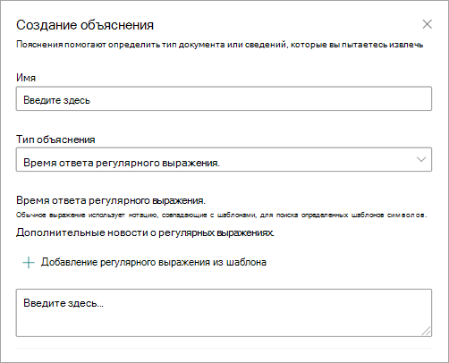

# Типы объяснений в Microsoft SharePoint SyntexExplanation types in Microsoft SharePoint Syntex

Объяснения помогают определить информацию, которую вы хотите пометить и извлечь в своих моделях осмысления документации в Microsoft SharePoint Syntex.Explanations are used to help to define the information you want to label and extract in your document understanding models in Microsoft SharePoint Syntex. При создании объяснения следует выбрать тип объяснения.When you create an explanation, you need to select an explanation type. Эта статья поможет вам узнать о разных типах объяснений и о том, как они используются.This article helps you understand the different explanation types and how they're used.

 
   
Существуют следующие типы объяснений:These explanation types are available:

- [**Список фраз**](#phrase-list): список слов, фраз, цифр или других символов, которые можно использовать в документе или в извлекаемой информации.[**Phrase list**](#phrase-list): List of words, phrases, numbers, or other characters you can use in the document or information that you're extracting. Например, текстовая строка *Направивший врач* находится во всех идентифицируемых документах с медицинскими направлениями.For example, the text string *referring doctor* is in all Medical Referral documents you're identifying. Или *Номер телефона* направившего врача из идентифицируемого документа с медицинским направлением.Or the *phone number* of the referring doctor from all Medical Referral documents that you're identifying.

- [**Регулярное выражение**](#regular-expression): использует нотацию сопоставления с шаблоном для поиска определенных сочетаний символов.[**Regular expression**](#regular-expression): Uses a pattern-matching notation to find specific character patterns. Например, с помощью регулярного выражения можно найти все *адреса электронной почты* в наборе документов.For example, you can use a regular expression to find all instances of an *email address* pattern in a set of documents.

- [**Расстояние**](#proximity): описывает, насколько близки объяснения друг к другу.[**Proximity**](#proximity): Describes how close explanations are to each other. Например, список фраз с *номерами домов* идет прямо перед списком фраз с *названиями улиц* без маркеров между ними (больше информации о маркерах приведено в этой статье).For example, a *street number* phrase list goes right before the *street name* phrase list, with no tokens in between (you'll learn about tokens later in this article). Для использования типа расстояния необходимо, чтобы в модели было как минимум два объяснения, иначе эта функция будет отключена.Using the proximity type requires you to have at least two explanations in your model or the option will be disabled. 

## Список фразPhrase list

Список фраз — это тип объяснения, который обычно используется, чтобы идентифицировать и классифицировать документ через вашу модель.A phrase list explanation type is typically used to identify and classify a document through your model. Как описано в примере с меткой *Направивший врач*, это строка со словами, фразами, номерами или символами, постоянно встречающимися в идентифицируемых документах.As described in the *referring doctor* label example, it's a string of words, phrases, numbers, or characters that is consistently in the documents that you're identifying.

Хоть это и не обязательно, но если считываемая фраза находится в одном и том же месте во всех документах, это позволяет добиться наилучших результатов.While not a requirement, you can achieve better success with your explanation if the phrase you're capturing is located in a consistent location in your document. Например, метка *Направивший врач* может находиться в первом абзаце всех документов.For example, the *referring doctor* label might be consistently located in the first paragraph of the document. Также можно использовать дополнительный параметр **[Настройка расположения фраз в документе](https://docs.microsoft.com/microsoft-365/contentunderstanding/explanation-types-overview#configure-where-phrases-occur-in-the-document)** для выбора определенных областей, в которых встречается фраза, особенно если существует вероятность ее нахождения в нескольких местах документа.You can also use the **[Configure where phrases occur in the document](https://docs.microsoft.com/microsoft-365/contentunderstanding/explanation-types-overview#configure-where-phrases-occur-in-the-document)** advanced setting to select specific areas where the phrase is located, especially if there's a chance that the phrase might occur in multiple locations in your document.

Если при идентификации метки важна точность, при использовании списка фраз вы можете указать это, выбрав флажок **Только точная капитализация**.If case sensitivity is a requirement in identifying your label, using the phrase list type allows you to specify it in your explanation by selecting the **Only exact capitalization** checkbox.

 

Тип фразы особенно полезен при создании объяснения, которое выявляет и извлекает информацию в различных форматах, например даты, номера телефонов и номера кредитных карт.A phrase type is especially useful when you create an explanation that identifies and extracts information in different formats, such as dates, phone numbers, and credit card numbers. Например, дата может быть представлена в нескольких различных форматах (1/1/2020, 1-1-2020, 01.01.20, 01.01.2020, 1 января 2020 г. и т. д.).For example, a date can be displayed in many different formats (1/1/2020, 1-1-2020, 01/01/20, 01/01/2020, or Jan 1,2020). Определение списка фраз делает объяснение более эффективным, так как оно будет содержать все возможные вариации данных, которые вы хотите выявить и извлечь.Defining a phrase list makes your explanation more efficient by capturing any possible variations in the data that you're trying to identify and extract. 

В случае с *номером телефона* извлеките номер телефона каждого направляющего врача из документов с медицинскими направлениями, которые идентифицирует модель.For the *phone number* example, you extract the phone number for each referring doctor from all Medical Referral documents that the model identifies. При создании объяснения введите различные форматы, в которых номер телефона может отображаться в документе, для сбора возможных вариаций.When you create the explanation, type the different formats a phone number might display in your document so that you're able to capture possible variations. 

В этом случае в разделе **Дополнительные параметры** установите флажок **Любая цифра от 0 до 9**, чтобы распознавать каждое значение "0", используемое в списке фраз, как любую цифру от 0 до 9.For this example, in **Advanced Settings** select the **Any digit from 0-9** checkbox to recognize each "0" value used in your phrase list to be any digit from 0 through 9.

Точно так же при создании списка фраз, включающего текстовые символы, установите флажок **Любая буква от a до я**, чтобы распознавать каждый символ "a", используемый в списке фраз, как любую букву от "а" до "я".Similarly, if you create a phrase list that includes text characters, select the **Any letter from a-z** checkbox to recognize each "a" character used in the phrase list to be any character from "a" to "z".

Например, если вы создаете список фраз **Дата** и хотите, чтобы был распознан формат даты типа *1 янв 2020*, нужно сделать следующее:For example, if you create a **Date** phrase list and you want to make sure that a date format such as *Jan 1, 2020* is recognized, you need to:

- Добавьте в список фраз *aaa 0, 0000* и *aaa 00, 0000*.Add *aaa 0, 0000* and *aaa 00, 0000* to your phrase list.
- Убедитесь, что выбран флажок **Любая буква от а до я**.Make sure that **Any letter from a-z** is also selected.

Кроме того, если ваш список фраз содержит требования относительно заглавных букв, вы можете установить флажок **Только точная капитализация**.If you have capitalization requirements in your phrase list, you can select the **Only exact capitalization** checkbox. В примере с датами, если нужно, чтобы первая буква месяца была заглавной, сделайте следующее:For the date example, if you require the first letter of the month to be capitalized, you need to:

- Добавьте в список фраз *Aaa 0, 0000* и *Aaa 00, 0000*.Add *Aaa 0, 0000* and *Aaa 00, 0000* to your phrase list.
- Убедитесь, что выбран флажок **Только точная капитализация**.Make sure that **Only exact capitalization** is also selected.

> [!NOTE]
> Вместо того, чтобы вручную создавать объяснение для списка фраз, воспользуйтесь [библиотекой объяснений](https://docs.microsoft.com/microsoft-365/contentunderstanding/explanation-types-overview#use-explanation-templates) с шаблонами популярных списков фраз, например *дата*, *номер телефона*, *номер кредитной карты* и т. д.Instead of manually creating a phrase list explanation, use the [explanation library](https://docs.microsoft.com/microsoft-365/contentunderstanding/explanation-types-overview#use-explanation-templates) to use phrase list templates for a common phrase list, such as *date*, *phone number*, or *credit card number*.

## Регулярное выражениеRegular expression

Тип объяснения регулярного выражения позволяет создавать шаблоны, помогающие находить и выявлять определенные текстовые строки в документах.A regular expression explanation type allows you to create patterns that help find and identify certain text strings in documents. С помощью регулярных выражений можно быстро анализировать большие объемы текста, чтобы:You can use regular expressions to quickly parse large amounts of text to:

- Находить сочетания символов, соответствующие определенным шаблонам.Find specific character patterns.
- Проверять текст на соответствие заданному шаблону (например, адресу электронной почты).Validate text to ensure that it matches a predefined pattern (such as an email address).
- Извлекать, изменять, заменять и удалять подстроки текста.Extract, edit, replace, or delete text substrings.

Тип регулярного выражения особенно полезен при создании объяснения, которое выявляет и извлекает информацию в различных форматах, например даты, номера телефонов и номера кредитных карт.A regular expression type is especially useful when you create an explanation that identifies and extracts information in similar formats, such as email addresses, bank account numbers, or URLs. Например, адрес электронной почты, такой как olga@contoso.com, отображается в определенном шаблоне ("olga" — первая часть, а "com" — последняя часть).For example, an email address, such as megan@contoso.com, is displayed in a certain pattern ("megan" is the first part, and "com" is the last part). 

Регулярное выражение для адреса электронной почты: **[A-Za-z0-9._%-]+@[A-Za-z0-9.-]+.[A-Za-z]{2,6}**.The regular expression for an email address is: **[A-Za-z0-9._%-]+@[A-Za-z0-9.-]+.[A-Za-z]{2,6}**.

Это выражение состоит из пяти частей в таком порядке:This expression consists of five parts, in this order:

1. Следующие символы в любом количестве: Any amount of the following characters:

   а.a. буквы от a до zLetters from a to z

   б.b. цифры от 0 до 9Numbers from 0-9

   в.c. точка, символ подчеркивания, знак процент или дефисPeriod, underscore, percent, or dash

2. Знак @The @ symbol

3. любое количество тех же символов, что и в первой части адреса электронной почтыAny amount of the same characters as the first part of the email address

4. точкаA period

5. от двух до шести буквTwo to six letters

Чтобы добавить тип объяснения регулярного выражения, выполните следующие шаги.To add a regular expression explanation type:

1. На панели **Создание объяснения** в элементе **Тип объяснения** выберите **Регулярное выражение**.From the **Create an explanation** panel, under **Explanation type**, select **Regular expression**.

   

2. Вы можете ввести выражение вручную в поле **Регулярное выражение** или выбрать **Добавить регулярное выражение из шаблона**.You can either type an expression in the **Regular expression** text box or select **Add a regular expression from a template**.

   При добавлении регулярного выражения с помощью шаблона в текстовое поле автоматически добавляются имя и регулярное выражение.When you add a regular expression by using a template, it automatically adds the name and the regular expression to the text box. Например, если вы выберете **адрес электронной почты**, будет заполнена панель **Создание объяснения**.For example, if you choose the **Email address** template, the **Create an explanation** panel will be populated.

   

## РасстояниеProximity 

Тип объяснения по расстоянию позволяет идентифицировать информацию по ее схожести с другим фрагментом данных.The proximity explanation type helps your model identify data by defining how close another piece of data is to it. Например, вы определили в модели два типа объяснений, которые помечают *Улицу и номер дома* и *Номер телефона* клиента.For example, in your model say you have defined two explanations that label both the customer *street address number* and *phone number*. 

Обратите внимание, что номера телефонов клиента всегда идут до номера дома и улицы.Notice that customer phone numbers always appear before the street address number. 

Алексей ВиноградовAlex Wilburn 
555-555-5555555-555-5555 
One Microsoft WayOne Microsoft Way 
Redmond, WA 98034Redmond, WA 98034 

Используйте объяснение по расстоянию, чтобы определить, насколько далеко находится объяснение номера телефона, чтобы лучше идентифицировать адрес в документах.Use the proximity explanation to define how far away the phone number explanation is to better identify the street address number in your documents.

#### Что такое маркеры?What are tokens?

Чтобы использовать тип объяснения по расстоянию, необходимо понять, что такое маркер.To use the proximity explanation type, you need to understand what a token is. Тип объяснения по расстоянию измеряет расстояние в маркерах.The number of tokens is how the proximity explanation measures distance from one explanation to another. Маркер — это непрерывный диапазон (без пробелов или пунктуации) букв и цифр.A token is a continuous span (not including spaces or punctuation) of letters and numbers. 

В таблице ниже приведены примеры определения количества маркеров в фразе.The following table shows examples for how to determine the number of tokens in a phrase.

|ФразаPhrase|Количество маркеровNumber of tokens|ОбъяснениеExplanation|
|--|--|--|
|`Dog`|11|Отдельное слово без пунктуации и пробелов.A single word with no punctuation or spaces.|
|`RMT33W`|11|Номер локатора записи.A record locator number. Он может содержать буквы и цифры, но не знаки пунктуации.It might include numbers and letters, but doesn't have punctuation.|
|`425-555-5555`|55|Номер телефона.A phone number. Каждый знак препинания является маркером, поэтому в `425-555-5555` 5 маркеров:Each punctuation mark is a single token, so `425-555-5555` is 5 tokens: `425` `-` `555` `-` `5555` |
|`https://luis.ai`|77|`https` `:` `/` `/` `luis` `.` `ai` |

#### Настройка типа объяснения по расстояниюConfigure the proximity explanation type

В качестве примера настройте расстояние так, чтобы определить диапазон количества маркеров от объяснения *Номер телефона* до объяснения *Номер дома*.For the example, configure the proximity setting to define the range of the number of tokens in the *phone number* explanation from the *street address number* explanation. Обратите внимание, что в качестве минимального диапазона указан «0», потому что между номером телефона и номером дома нет маркеров.Notice that the minimum range is "0", because there are no tokens between the phone number and street address number.

Однако к некоторым номерам телефонов в примерах документов добавлен *(мобильный)*.But some phone numbers in the sample documents are appended with *(mobile)*.

Николай БелыхNestor Wilke 
111-111-1111 (мобильный)111-111-1111 (mobile) 
One Microsoft WayOne Microsoft Way 
Redmond, WA 98034Redmond, WA 98034 

В примере *(мобильный)* три маркера:There are three tokens in *(mobile)*:

|ФразаPhrase|Количество маркеровToken count|
|--|--|
|((|11|
|мобильныйmobile|22|
|))|33|

Настройте параметры расстояния так, чтобы диапазон был от 0 до 3.Configure the proximity setting to have a range of 0 through 3.

## Настройка расположения фраз в документеConfigure where phrases occur in the document

Когда вы создаете объяснение, по умолчанию поиск фразы, которую вы пытаетесь извлечь, выполняется по всему документу.When you create an explanation, by default the entire document is searched for the phrase you're trying to extract. Однако вы можете использовать дополнительный параметр **Где встречаются эти фразы**, чтобы изолировать определенное место в документе, в котором встречается фраза.However, you can use the **Where these phrases occur** advanced setting to help in isolating a specific location in the document that a phrase occurs. Это удобно в ситуациях, когда похожие вхождения фразы могут появляться в другом месте документа и вы хотите убедиться в том, что выбран нужный вариант.This setting is useful in situations where similar instances of a phrase might appear somewhere else in the document, and you want to make sure that the correct one is selected.

В нашем примере, когда документ представляет собой медицинское направление, *Направивший врач* всегда упоминается в первом абзаце документа.Referring to our Medical Referral document example, the *referring doctor* is always mentioned in the first paragraph of the document. С помощью параметра **Где встречаются эти фразы** в этом примере вы можете настроить свое объяснение для поиска этой метки только в начальном разделе документа или в любом другом месте, где она может встречаться.With the **Where these phrases occur** setting, in this example you can configure your explanation to search for this label only in the beginning section of the document, or any other location in which it might occur.

В этом параметре доступны следующие варианты на выбор.You can choose the following options for this setting:

- В любом месте файла: поиск фразы выполняется во всем документе.Anywhere in the file: The entire document is searched for the phrase.

- Начало файла: поиск в документе выполняется с начала до места, где расположена фраза.Beginning of the file:  The document is searched from the beginning to the phrase location.

   

    В средстве просмотра вы можете вручную изменить поле выбора, чтобы включить расположение фразы.In the viewer, you can manually adjust the select box to include the location where the phase occurs. Значение **Конечное положение** обновляется для отображения количества маркеров, содержащихся в выбранной вами области.The **End position** value will update to show the number of tokens your selected area includes. Обратите внимание, что вы можете изменить значение **Конечное положение**, а также настроить выбранную область.You can update the **End position** value as well to adjust the selected area.

   

- Конец файла: поиск в документе выполняется с конца до места, где расположена фраза.End of the file: The document is searched from the end to the phrase location.

   

    В средстве просмотра вы можете вручную изменить поле выбора, чтобы включить расположение фразы.In the viewer, you can manually adjust the select box to include the location where the phase occurs. Значение **Начальное положение** обновляется для отображения количества маркеров, содержащихся в выбранной вами области.The **Starting position** value will update to show the number of tokens your selected area includes. Обратите внимание, что вы можете изменить значение "Начальное положение", а также настроить выбранную область.You can update the Starting position value as well to adjust the selected area.

   

- Произвольный диапазон: поиск расположения фразы в документе выполняется в указанном диапазоне.Custom range: The document is searched within a specified range for the phrase location.

   

    В средстве просмотра вы можете вручную изменить поле выбора, чтобы включить расположение фразы.In the viewer, you can manually adjust the select box to include the location where the phase occurs. Для этого параметра требуется выбрать положение **Начало** и **Конец**.For this setting, you need to select a **Start** and an **End** position. Эти значения отражают количество маркеров с начала документа.These values represent the number of tokens from the beginning of the document. Хотя вы можете вручную ввести эти значения, проще вручную изменить поле выбора в средстве просмотра.While you can manually enter in these values, it's easier to manually adjust the select box in the viewer. 
   
## Используйте шаблона объясненийUse explanation templates

Вы можете вручную добавлять значения списка фраз для объяснений, но может быть проще использовать шаблоны из библиотеки объяснений.While you can manually add various phrase list values for your explanation, it can be easier to use the templates provided to you in the explanation library.

Например, вместо того, чтобы вручную добавлять все варианты *Даты*, вы можете использовать шаблон списка фраз для *Дат*, так как в нем уже есть несколько значений списков фраз:For example, instead of manually adding all the variations for *date*, you can use the phrase list template for *date* because it already includes many phrase lists values:

 
Библиотека объяснений содержит часто используемые объяснения *списка фраз*, в том числе:The explanation library includes commonly used *phrase list* explanations, including:

- Дата: даты календаря, все форматы.Date: Calendar dates, all formats. Содержит текст и числа (например, &quot;9 декабря 2020 г.").Includes text and numbers (for example, "Dec 9, 2020").
- Дата (численная): даты календаря, все форматы.Date (numeric): Calendar dates, all formats. Числа (например, 1-11-2020).Includes numbers (for example, 1-11-2020).
- Время: 12- и 24-часовой форматы.Time: 12 and 24 hour formats.
- Число: положительные и отрицательные числа с десятичными дробями до двух знаков после запятой.Number: Positive and negative numbers up to two decimals. 
- Процент: список шаблонов, представляющих процентные значения.Percentage: A list of patterns representing a percentage. Например, 1%, 11%, 100% или 11.11%.For example, 1%, 11%, 100%, or 11.11%.
- Номер телефона: распространенные форматы, используемые в США и в других странах мира.Phone number: Common US and International formats. Например, 000 000 0000, 000-000-0000, (000)000-0000, (000) 000-0000 и т. д.For example, 000 000 0000, 000-000-0000, (000)000-0000, or (000) 000-0000.
- Почтовый индекс: почтовый индекс в США.Zip code: US Zip code formats. Например, 11111, 11111-1111.For example, 11111, 11111-1111.
- Первое слово предложения: общие шаблоны для слов длиной до 9 букв.First word of sentence: Common patterns for words up to nine characters. 
- Конец предложения: распространенные знаки препинания для конца предложенияEnd of sentence: Common punctuation for end of a sentence.
- Кредитная карта: распространенные форматы номеров кредитных карт.Credit card: Common credit card number formats. Например, 1111-1111-1111-1111.For example, 1111-1111-1111-1111. 
- Номер социального обеспечения: формат номера социального обеспечения США. Например, 111-11-1111.Social security number: US Social Security Number format. For example, 111-11-1111. 
- Элемент "Флажок": список фраз, представляющий варианты проставленного флажка.Checkbox: A phrase list representing variations on a filled in checkbox. Например, _X_, _ _X_ и т. д.For example, _X_, _ _X_.
- Валюта: основные международные символы валют.Currency: Major international symbols. Пример: $.For example, $. 
- Адрес электронной почты для отправки копий сообщения: список фраз с термином "CC:", который часто находится рядом с именами или адресами электронной почты дополнительных пользователей или групп - адресатов сообщения.Email CC: A phrase list with the term 'CC:', often found near the names or email addresses of other people or groups the message was sent to.
- Дата сообщения электронной почты: список фраз с термином "Отправлено:", который часто находится рядом с датой отправки сообщения электронной почты.Email date: A phrase list with the term 'Sent on:', often found near the date the email was sent.
- Приветствие в электронном письме: часто встречающиеся строки, которыми открывается тело сообщения электронной почты.Email greeting: Common opening lines for emails.
- Адресат электронной почты: список фраз с термином "Кому:", который часто находится рядом с именами или адресами электронной почты пользователей или групп, на которые было отправлено сообщение.Email recipient: A phrase list with the term 'To:', often found near the names or email addresses of people or groups the message was sent to. 
- Отправитель электронной почты: список фраз с термином "От:", который часто находится рядом с именем или адресом электронной почты отправитель.Email sender: A phrase list with the term 'From:', often found near the sender's name or email address. 
- Тема сообщения электронной почты: список фраз с термином "Тема:", который часто находится рядом с темой сообщения.Email subject: A phrase list with the term 'Subject:', often found near the email's subject.

Библиотека объяснений содержит часто используемые объяснения в формате *регулярных выражений*, в том числе:The explanation library also includes commonly used *regular expression* explanations, including:

- От 6 до 17 цифр: соответствует любому числу длиной от 6 до 17 цифр.6 to 17 digit numbers: Matches any number from 6 to 17 digits long. Номера банковских счетов в США соответствуют этому шаблону.US bank account numbers fit this pattern.
- Адрес электронной почты: соответствует общему типу адреса электронной почты, например olgaa@contoso.comEmail address: Matches a common type of email address like meganb@contoso.com.
- Идентификационный номер налогоплательщика США: 3-значный номер, начинающийся с 9, за которым следует 6-значный номер, начинающийся с 7 или 8.US taxpayer ID number: Matches a three-digit number starting with 9 followed by a 6 digit number starting with 7 or 8. 
- Веб-адрес (URL-адрес): соответствует формату веб-адреса, то есть начинается с http:// или https://Web address (URL): Matches the format of a web address, starting with http:// or https://.

Библиотека объяснений также содержит три автоматических типа шаблонов для работы с данными, которые вы пометили в файлах примера:In addition, the explanation library includes three automatic template types that work with the data you've labeled in your example files:

- После метки. Слова и символы, которые встречаются после меток в файлах примера.After label: The words or characters that occur after the labels in the example files.
- До метки. Слова и символы, которые встречаются до меток в файлах примера.Before label: The words or characters that occur before the labels in the example files.
- Метки. До 10 первых меток из файлов примера.Labels: Up to the first 10 labels from the example files.

В следующем примере мы рассмотрим для демонстрации работы автоматических шаблонов шаблон объяснения "До метки", предоставляющий модели дополнительные сведения для получения более точного соответствия.To give you an example of how automatic templates work, in the following example file, we'll use the Before label explanation template to help give the model more information to get a more accurate match.

Если выбрать шаблон объяснения "До метки", он будет искать первый набор слов, которые появляются перед меткой в файлах примера.When you select the Before label explanation template, it will look for the first set of words that appear before the label in your example files. Например, слова, определяемые в первом примере файла: "As of" (Начиная с).In the example, the words that are identified in the first example file is "As of".

Чтобы создать объяснение из шаблона, вы можете выбрать **Добавить**.You can select **Add** to create an explanation from the template.  Когда вы добавляете другие примеры файлов, дополнительные слова определяются и добавляются в список фраз.As you add more example files, additional words will be identified and added to the phrase list.

 
#### Использование шаблонов из библиотеки объясненийTo use a template from the explanation library

1. В разделе **Объяснения** на странице **Обучение** вашей модели, выберите **Новый**, затем выберите **Из шаблона**.From the **Explanations** section of your model's **Train** page, select **New**, then select **From a template**.

   

2.  На странице **Шаблоны объяснений** выберите объяснение, которое хотите использовать, и выберите **Добавить**.On the **Explanation templates** page, select the explanation you want to use, then select **Add**.

    

3. Информация о выбранном шаблоне отображается на странице **Создание объяснений**.The information for the template you selected displays on the **Create an explanation** page. При необходимости измените название объяснения, а также добавьте или удалите элементы из списка фраз.If needed, edit the explanation name and add or remove items from the phrase list.  

    

4. По завершении нажмите кнопку **Сохранить**.When finished, select **Save**.