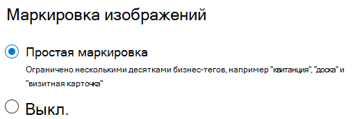

# Расстановка тегов для изображений в SharePoint SyntexImage tagging in SharePoint Syntex

Расстановка тегов для изображений в SharePoint Syntex помогает пользователям находить нужные изображения и создавать процессы на базе тегов.With image tagging in SharePoint Syntex, users can find images through search by searching on image tags, and create workflows based on image tags. По умолчанию для SharePoint и OneDrive включена базовая расстановка тегов для изображений.By default, basic image tagging is turned on for SharePoint and OneDrive. Изображения, отправленные в какое-либо расположение, автоматически сканируются и к ним применяются применимые теги (при наличии) из списка 37 основных тегов.Images uploaded to either location are automatically scanned and applicable tags are applied, if available, from a list of 37 basic tags. Пользователи могут находить изображения с помощью поиска, выполняя поиск по тегам изображения.Users can find images through search by searching on the image tags.

Процесс расстановки тегов запускается автоматически при отправке изображения.When a user uploads an image, the  tagging process runs automatically. Если изображение будет изменено, процесс расстановки тегов запустится снова, чтобы обновить теги.If an image is edited, the tagging process runs again to update the tags.

Пользователи с разрешениями на доступ к файлу изображения могут просматривать и редактировать теги на панели сведений о файле или на странице результатов поиска.Users with permissions to the image file can see and edit the tags in the file information panel or in the search results page. Если пользователь изменит теги изображения, система больше не будет автоматически расставлять теги для этого изображения, даже если оно будет изменено.Once a user edits an image's tags, the system no longer auto-tags that image, even if it's edited.

Если вы отключите расстановку тегов, изображения больше не будут автоматически ими помечаться.If you turn tagging off, images will no longer be automatically tagged. Существующие теги не будут удалены.Existing tags won't be removed.

> [!NOTE]
> Теги, созданные системой, могут измениться в связи с изменением изображения или нашей технологии тегов.System generated tags may change with updates to the image or our tag technology.

## Настройка расстановки тегов для изображенийConfigure image tagging

После [настройки SharePoint Syntex](set-up-content-understanding.md) вы можете настроить расстановку тегов для изображений в центре администрирования Microsoft 365.After you [set up SharePoint Syntex](set-up-content-understanding.md), you can configure image tagging in the Microsoft 365 admin center.  

Включение и отключение расстановки тегов для изображенийTo turn image tagging on or off

1. В Центре администрирования Microsoft 365 щелкните **Настройка**.In the Microsoft 365 admin center, click **Setup**.

2. В разделе **Знания организации** выберите **Автоматическое осмысление контента**.Under **Organizational knowledge**, click **Automate content understanding**.

3. Нажмите кнопку **Управление**.Click **Manage**.

4. На вкладке **Расстановка тегов для изображений** нажмите **Изменить**.On the **Image tagging** tab, click **Edit**.

5. Выберите разрешить **Базовую расстановку тегов** или **Отключить** расстановку тегов.Choose to allow **Basic tagging** or turn tagging **Off**.

6. Щелкните **Сохранить**.Click **Save**.

    
